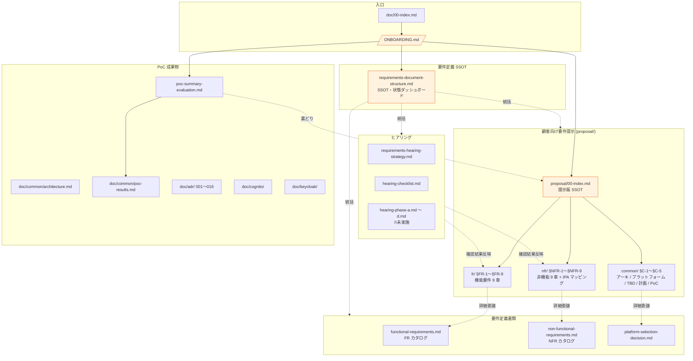

# 共有認証基盤プロジェクト — 新規参入者ガイド

このプロジェクトに新しく入った方が、**最短で全体像をつかみ、適切なドキュメントに辿り着ける**ようにするための案内です。

---

## 1. このプロジェクトは何か（30 秒サマリー）

**目的**: 複数の顧客企業 + 複数のバックエンドシステムをカバーする **AWS 上の共有認証基盤** を構築する案件。

**現状フェーズ**: PoC（Phase 1〜9）完了 → **要件定義フェーズ**。
- PoC では Cognito / Keycloak の両方で「認証 / 認可 / DR / マルチ IdP / VPC プライベート JWKS」まで実装・検証済み（[PoC 総括](doc/requirements/poc-summary-evaluation.md)）。
- いま顧客と要件定義をするための **要件提示版（proposal/）** を整備中。

**基本方針（4 軸）** — すべての要件はこの 4 つに照らして判断する:
1. **絶対安全** — セキュリティ最優先（OAuth 2.1 / NIST SP 800-63B Rev 4 等の業界標準準拠）
2. **どんなアプリでも** — 認証フロー・IdP・クライアント種別の網羅性
3. **効率よく認証** — 顧客追加・システム追加のフリクションレス
4. **運用負荷・コスト最小** — マネージド優先、自前運用は限定

**実装プラットフォーム候補**: AWS Cognito / Keycloak OSS / Keycloak RHBK（Red Hat 商用版）の 3 候補を併記し、顧客要件で自動選定（[§C-2](doc/requirements/proposal/common/02-platform.md)）。

**アーキテクチャ**: **Identity Broker パターン**（Hub-and-Spoke）。顧客 IdP 群 → 共通基盤（Hub）→ 各バックエンドシステム（[§C-1](doc/requirements/proposal/common/01-architecture.md)）。

---

## 2. 読む順序（役割別キャッチアップ）

### 2.1 全員（最初の 30 分）

順番に読めば「**この案件が何で、何のためにあって、どこに何があるか**」が掴めます。

| # | ドキュメント | 何が分かるか |
|:---:|---|---|
| 1 | 本ファイル ([/ONBOARDING.md](ONBOARDING.md)) | プロジェクト概要・読む順序 |
| 2 | [doc/requirements/poc-summary-evaluation.md](doc/requirements/poc-summary-evaluation.md) | PoC で何が確認できたか、何が未検証か |
| 3 | [doc/requirements/proposal/00-index.md](doc/requirements/proposal/00-index.md) | **要件提示の SSOT**。基本方針 4 軸・5 ステップ・章ナビ |
| 4 | [doc/requirements/requirements-document-structure.md](doc/requirements/requirements-document-structure.md) | 要件定義フェーズ全体の SSOT（プロセス / 状態ダッシュボード / ID 体系） |

### 2.2 顧客提示・要件定義を担当する方（次の 1〜2 時間）

| # | ドキュメント | 何が分かるか |
|:---:|---|---|
| 5 | [proposal/fr/00-index.md](doc/requirements/proposal/fr/00-index.md) | 機能要件 9 章の構成と依存関係 |
| 6 | [proposal/fr/01-auth.md](doc/requirements/proposal/fr/01-auth.md) 〜 [09-integration.md](doc/requirements/proposal/fr/09-integration.md) | 機能要件 §FR-1〜§FR-9（ベースライン + TBD を顧客と読み合わせる素材） |
| 7 | [proposal/nfr/00-index.md](doc/requirements/proposal/nfr/00-index.md) | 非機能要件 9 章（IPA 非機能要求グレード 2018 マッピング付き） |
| 8 | [proposal/common/01-architecture.md](doc/requirements/proposal/common/01-architecture.md) | Identity Broker パターンの採用根拠 |
| 9 | [proposal/common/02-platform.md](doc/requirements/proposal/common/02-platform.md) | Cognito / Keycloak / RHBK 選定の判定フロー |
| 10 | [proposal/common/03-tbd-summary.md](doc/requirements/proposal/common/03-tbd-summary.md) | プラットフォーム選定に直結する最優先 TBD（ヒアリング順序の指針） |

### 2.3 設計・実装を担当する方

| # | ドキュメント | 何が分かるか |
|:---:|---|---|
| 11 | [doc/common/architecture.md](doc/common/architecture.md) | PoC 段階の全体構成図 |
| 12 | [doc/common/poc-results.md](doc/common/poc-results.md) | PoC 各 Phase の検証結果（Cognito vs Keycloak 対比含む） |
| 13 | [doc/adr/](doc/adr/) (001〜016) | 設計判断の経緯（特に [006 損益分岐](doc/adr/006-cognito-vs-keycloak-cost-breakeven.md) / [012 VPC 内 JWKS](doc/adr/012-vpc-lambda-authorizer-internal-jwks.md) / [014 認証パターン範囲](doc/adr/014-auth-patterns-scope.md)） |
| 14 | [doc/cognito/](doc/cognito/) / [doc/keycloak/](doc/keycloak/) | プラットフォーム個別の認証フロー・構築手順・検証シナリオ |
| 15 | [doc/common/identity-broker-multi-idp.md](doc/common/identity-broker-multi-idp.md) | Broker パターンの詳細 |
| 16 | [doc/common/bff-implementation-notes.md](doc/common/bff-implementation-notes.md) | BFF パターンの内部技術メモ |

### 2.4 ヒアリング・プロジェクト推進を担当する方

| # | ドキュメント | 何が分かるか |
|:---:|---|---|
| 17 | [doc/requirements/requirements-hearing-strategy.md](doc/requirements/requirements-hearing-strategy.md) | ヒアリング Phase A〜D の進め方 |
| 18 | [doc/requirements/hearing-checklist.md](doc/requirements/hearing-checklist.md) | 全 67 項目の確認事項一覧 |
| 19 | [proposal/common/04-schedule.md](doc/requirements/proposal/common/04-schedule.md) | 要件定義 → 設計 → 実装の想定タイムライン |
| 20 | [doc/requirements/requirements-process-plan.md](doc/requirements/requirements-process-plan.md) | 4 段階プロセス・終了基準 |

---

## 3. ドキュメントマップ



---

## 4. ドキュメント体系の全体構造

```
/                                       ← プロジェクトルート
├── ONBOARDING.md                       ← 本ファイル
├── README.md                           ← AWS 便利コマンド集
├── app/, app-keycloak/, app-sso-peer/  ← サンプルアプリ
├── infra/                              ← Terraform / IaC
├── lambda/                             ← Lambda 実装
├── keycloak/                           ← Keycloak Docker 構成
└── doc/
    ├── 00-index.md                     ← doc 全体の入口
    ├── requirements/                   ← 【要件定義フェーズ】★ いまここ
    │   ├── requirements-document-structure.md  ← フェーズ SSOT
    │   ├── proposal/                   ← 顧客向け要件提示版
    │   │   ├── 00-index.md             ← 提示版 SSOT
    │   │   ├── fr/                     ← 機能要件 §FR-1〜§FR-9
    │   │   ├── nfr/                    ← 非機能要件 §NFR-1〜§NFR-9（IPA マッピング）
    │   │   └── common/                 ← 横断 §C-1〜§C-5
    │   ├── functional-requirements.md       ← FR カタログ（詳細マトリクス）
    │   ├── non-functional-requirements.md   ← NFR カタログ（詳細マトリクス）
    │   ├── platform-selection-decision.md   ← プラットフォーム選定判断書
    │   ├── poc-summary-evaluation.md        ← 社内 PoC 総括
    │   ├── requirements-hearing-strategy.md ← ヒアリング戦略
    │   ├── hearing-checklist.md             ← ヒアリング 67 項目
    │   └── hearing-phase-{a,b,c,d}.md       ← Phase 別記録（未実施）
    ├── common/                         ← PoC 期の全体設計
    │   ├── architecture.md             ← 全体構成図
    │   ├── poc-results.md              ← Phase 1〜7 検証結果
    │   ├── identity-broker-multi-idp.md ← Broker パターン詳細
    │   ├── bff-implementation-notes.md  ← BFF パターン技術メモ
    │   └── …
    ├── cognito/                        ← Cognito 個別資料
    ├── keycloak/                       ← Keycloak 個別資料
    ├── adr/                            ← 設計判断記録（001〜016）
    ├── reference/                      ← 参考情報
    └── old/                            ← 過去の検討（読み取り専用）
```

---

## 5. ドキュメント記述ルール（参入者が編集する前に）

新規参入者がドキュメントを書き足すときに守ってほしいルール:

### 5.1 章番号体系

`proposal/` 配下は 3 つの番号体系で統一されています:

| 体系 | 接頭辞 | 配置 |
|---|---|---|
| 機能要件 | **§FR-1〜§FR-9** | `proposal/fr/` |
| 非機能要件 | **§NFR-1〜§NFR-9** | `proposal/nfr/` |
| 横断章 | **§C-1〜§C-5** | `proposal/common/` |

FR カタログ（[functional-requirements.md](doc/requirements/functional-requirements.md)）は §1〜§8 の独自番号。proposal/fr/X が FR カタログ §X-1 と対応する形（例: proposal の §FR-2 フェデレーション ↔ FR カタログ §2 FR-FED）。

### 5.2 各章冒頭の規約（§X.0 前提と背景）

`proposal/` 配下の各章は **必ず § X.0「前提と背景」** を冒頭に置く。構成:

1. **用語整理** — 本章で扱う概念の定義
2. **なぜここ（§X）で決めるか** — 他章との関係を mermaid で図化
3. **§X.0.A 本基盤のスタンス** — 基本方針 4 軸への立場明示
4. **共通認証基盤として「○○」を検討する意義**（意義表）
5. **本章で扱うサブセクションの一覧**

NFR 章は加えて **IPA グレード中項目とのマッピング表** を §X.0 内に置く。

### 5.3 各サブセクション規約（lead-in 3 行）

各サブセクションの冒頭に以下 3 行を必ず置く:

1. **このサブセクションで定めること** — 何を決めるか
2. **主な判断軸** — 何を基準に決めるか
3. **§X 全体との関係** — 上位章の中での位置づけ

### 5.4 ベースライン + TBD のペア構造

各サブセクションは以下 2 つを必ず含む:

- **ベースライン**: 弊社が「こう定義したい」と提示する要件案
- **TBD / 要確認**: 顧客に確認すべき項目

### 5.5 日付スタンプは書かない

「最終更新: YYYY-MM-DD」のような **手動更新の日付スタンプは書かない**（git log が真実）。状態（✅ / 🚧 / 🔄 / 📋）のみメンテナンス。

### 5.6 mermaid の括弧注意

mermaid のラベル中に `(` `)` を含めるとパースエラーになる構文が複数ある。**括弧入りラベルは必ずダブルクォートで包む**のがプロジェクト規約。

**(a) 菱形ノード `{...}`**:
```
Q1{"XSS リスク<br/>(third-party JS)"}   ← OK
Q1{XSS リスク<br/>(third-party JS)}      ← パースエラー
```

**(b) エッジラベル `|...|`**（矢印のラベル）:
```
A -->|"OIDC<br/>(基盤運用者用)"| Hub    ← OK
A -->|OIDC<br/>(基盤運用者用)| Hub       ← パースエラー
```

**(c) 角丸ノード `(...)` / 円ノード `((...))`** も同様にダブルクォート推奨。

**(d) 安全な例外**: 角括弧ノード `[...]` のラベルは括弧を含んでもパースエラーにならないことが多いが、**揃えてダブルクォートにする方が見落としがない**:
```
A["JWT<br/>(統一クレーム)"]   ← OK
A[JWT<br/>(統一クレーム)]      ← 動くが規約上はクォート推奨
```

> 自動チェック方法: 後述の `find ... | perl -ne` ワンライナーで diamond / edge label の漏れを検出可能（[最新の検出スクリプトは git 履歴で確認](doc/requirements/proposal/) — 全 23 ファイルが clean な状態）。

---

## 6. よくある質問

**Q. PoC は完了しているのか？**
A. はい、Phase 1〜9 まで完了（[PoC 総括](doc/requirements/poc-summary-evaluation.md)）。Cognito / Keycloak 両方で基本機能を検証済。未検証は Entra ID/Okta 実地・Route 53 自動フェイルオーバー・大規模負荷・RHBK 商用評価。

**Q. プラットフォームは決まっているのか？**
A. **決まっていない**。3 候補（Cognito / Keycloak OSS / RHBK）を併記し、顧客要件で自動判定する方針（[§C-2.4 選定フロー](doc/requirements/proposal/common/02-platform.md)）。

**Q. 顧客はすでに決まっているのか？**
A. 提示資料の段階で、顧客固有情報は埋まっていない（TBD として明示）。

**Q. 北極星は？**
A. 旧バージョンでは「北極星」と呼んでいた**基本方針 4 軸**のこと。新規参入者向けにわかりやすさを優先して **「基本方針」** に統一済（2026-05-18）。

**Q. ドキュメントが多すぎる、どこから読めば？**
A. 本ガイド §2 の役割別キャッチアップ順序に従ってください。**全員必須**は §2.1（4 ファイル / 30 分）です。

---

## 7. 質問・更新の窓口

- ドキュメントの誤り・古い情報を見つけたら、対応するファイルを直接編集して PR / commit
- 不明点は [proposal/common/03-tbd-summary.md](doc/requirements/proposal/common/03-tbd-summary.md) と照らし合わせて、TBD なのか実装方針が決まっているのかを判別
- 全体方針に関わる判断変更は ADR（[doc/adr/](doc/adr/)）に新規番号で追加
