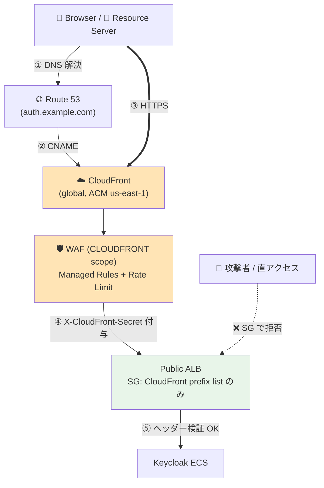

# ADR-013: CloudFront + WAF による IP 制限の置き換え戦略

- **ステータス**: Proposed（要件定義フェーズで Accepted に昇格予定）
- **日付**: 2026-04-24
- **関連**:
  - [ADR-011](011-auth-frontend-network-design.md)（認証基盤前段の統合判断、Pattern C を本 ADR で詳細化）
  - [keycloak-network-architecture.md §9](../common/keycloak-network-architecture.md)（CloudFront + WAF 後の構成）

---

## Context

現状の Public ALB は **L4 SG が `0.0.0.0/0` 全開、L7 Listener Rule で IP 制限**という構造で運用している:

| レイヤ | 設定 |
|-------|------|
| L4 (SG) | `0.0.0.0/0` :80 全開 |
| L7 Rule#100 | JWKS / `.well-known` パスは全 IP 許可 |
| L7 Rule#200 | その他のパスは `my_ip + allowed_cidr_blocks` のみ |
| Default | 403 Forbidden |

この設計には PoC 段階では合理性があるが、本番運用では以下の課題:

1. **顧客 IP allowlist の運用負荷** — 顧客の社内 NW 変更のたびに `allowed_cidr_blocks` 更新
2. **顧客拡大時のスケーラビリティ** — 顧客数 × 拠点数で IP リストが肥大化
3. **WAF 機能の不在** — レート制限、ボット対策、OWASP ルールが未適用
4. **DDoS 防御がエッジでない** — オリジン（ALB）まで攻撃が到達
5. **JWKS パスのパブリック公開** — ADR-012 の VPC Lambda により VPC 内から取得可能になったが、Public ALB 側の閉塞はまだ可能性として残るのみ

ADR-011 で CloudFront 採用の論点は整理済（Pattern C）。本 ADR ではその詳細実装方針を定義する。

---

## Decision（Proposed）

**Public ALB の前段に CloudFront を配置し、WAF（global WAFv2）でセキュリティを担保する**。L7 IP 制限は撤廃し、CloudFront + WAF + ALB SG 制限の 3 層で防御する。

### Decision の詳細

#### (1) ネットワーク経路



#### (2) ALB SG の絞り込み

```hcl
# Before
ingress {
  from_port = 80
  to_port = 80
  cidr_blocks = ["0.0.0.0/0"]  # 現状
}

# After
ingress {
  from_port = 443
  to_port = 443
  prefix_list_ids = [data.aws_ec2_managed_prefix_list.cloudfront.id]
  # com.amazonaws.global.cloudfront.origin-facing
}
```

#### (3) Listener Rule の簡素化

L7 IP 制限を撤廃。L7 Rule は以下のみ残す:

| Priority | パス | 動作 |
|---------|------|------|
| 100 | カスタムヘッダー `X-CloudFront-Secret` 一致 | 転送 |
| Default | — | 403（直アクセス遮断） |

JWKS / ログイン / トークンパスのパスベース制限は不要（CloudFront に到達した時点で WAF が判断）。

#### (4) WAF ルール

global WAFv2（CloudFront 用、`us-east-1` 配置）に以下のルールを適用:

| ルール | 目的 | 推定 WCU |
|-------|------|---------|
| **AWSManagedRulesCommonRuleSet** | OWASP Top 10（XSS, SQLi 等） | 700 |
| **AWSManagedRulesAmazonIpReputationList** | 既知の不正 IP リスト | 25 |
| **AWSManagedRulesKnownBadInputsRuleSet** | 既知の攻撃パターン | 200 |
| **Rate-based rule** | IP 単位レート制限（例: 2,000 req/5min） | カスタム |
| **AWSManagedRulesBotControlRuleSet** | ボット検知（オプション、コスト高） | 50 |
| **GeoMatch（オプション）** | 地理的制限（顧客が国内のみなら） | 1 |

#### (5) CloudFront Origin 認証方式の選択

| 方式 | 概要 | 採用判断 |
|------|------|---------|
| **カスタムヘッダー** | CloudFront が `X-CloudFront-Secret: <random>` を送信、ALB Listener Rule で検証 | シンプル、PoC 推奨 |
| **OAC for ALB**（2024 GA） | CloudFront が SigV4 で ALB に署名リクエスト、ALB 側で検証 | より安全だが ALB の auth-action 設定が必要 |

PoC では**カスタムヘッダー方式**を推奨（設定が簡素、Secrets Manager で値を管理）。

#### (6) ACM 証明書

| 配置場所 | リージョン | 用途 |
|---------|----------|------|
| CloudFront | `us-east-1`（必須） | カスタムドメイン HTTPS（`auth.example.com`） |
| Public ALB | `ap-northeast-1` | CloudFront → ALB の HTTPS（自己署名 or AWS 内証明書も可） |

#### (7) JWKS パスの扱い

ADR-012 で VPC Lambda が Internal ALB から JWKS 取得可能になった。CloudFront 配置後の戦略は以下:

| 経路 | JWKS 公開先 | 用途 |
|------|----------|------|
| **VPC 内 Resource Server** | Internal ALB | 自社 Lambda 等（推奨） |
| **VPC 外 Resource Server** | CloudFront 経由（WAF で保護） | 顧客の外部システムが JWT を検証する場合 |
| **直接 Public ALB** | ❌ 遮断 | CloudFront 強制 |

→ VPC 外の Resource Server がいる場合、JWKS パスは引き続き「広く公開」が必要だが、**CloudFront + WAF でレート制限・攻撃検知**が掛かる。

---

## Consequences

### Positive

- **顧客 IP allowlist の撤廃** — 顧客運用負荷が大幅減
- **顧客拡大時のスケーラビリティ** — 顧客追加時に NW 設定変更不要
- **DDoS 吸収** — エッジでトラフィック吸収、オリジン保護
- **WAF による多層防御** — レート制限、ボット対策、OWASP
- **TLS 終端の最適化** — エッジで TLS 終端、レイテンシ低減
- **Cognito Hosted UI とのドメイン統一可能** — Cognito 側もカスタムドメイン経由（CloudFront 自動配置）で同一ブランドドメイン

### Negative

- **追加月額コスト ~$10〜$50**
  - CloudFront リクエスト課金: $0.0090〜0.0120/10K requests
  - WAF: $5/月 + ルール毎に追加（Managed Rules ~$1/百万 req）
  - Bot Control: $10/月 + 追加課金（オプション）
- **us-east-1 ACM の管理が必要** — Terraform provider alias が必要
- **CloudFront キャッシュ戦略** — 認証エンドポイントは基本キャッシュ不可、適切な Cache Behavior 設定が必要
- **デバッグ性の低下** — エッジでの WAF ブロックは原因特定が難しい場合あり

### Neutral

- Admin ALB は本 ADR のスコープ外（N2 で internal 化を別途決定）
- Cognito の標準ドメイン（`<domain>.auth.<region>.amazoncognito.com`）には CloudFront が AWS 内部で自動配置されるが、これとは別に共有基盤の CloudFront を持つ

---

## Alternatives Considered

| 案 | 判断 |
|----|------|
| 現状維持（L7 IP 制限） | 顧客拡大時に運用が破綻、却下 |
| **ALB + regional WAFv2**（ADR-011 Pattern B） | シンプルだが、Cognito Hosted UI との統合不可、エッジでの DDoS 吸収不可。**国内のみ・小規模顧客なら候補** |
| **CloudFront + global WAFv2**（本 ADR） | グローバル展開・スケーラビリティ・Cognito 統合の観点で最良 |
| Shield Advanced 追加 | 月 $3,000 でオーバースペック、却下 |

---

## Implementation Order

要件定義で本 ADR が Accepted になった後の実装順:

1. **us-east-1 ACM 証明書を取得**（Terraform provider alias 設定）
2. **CloudFront Distribution を作成**（origin = Public ALB DNS）
3. **WAF Web ACL を作成**（global、CloudFront にアタッチ）
4. **カスタムヘッダー値を Secrets Manager で生成**
5. **ALB Listener Rule を更新**（カスタムヘッダー検証）
6. **ALB SG を CloudFront プレフィックスリストのみに変更**
7. **Route 53 で CNAME を CloudFront に向ける**
8. **動作確認後、L7 IP 制限ルールを削除**

---

## Follow-up

- 本 ADR を Accepted に昇格させる際は、ADR-011 の暫定推奨（Pattern B）を Pattern C に確定
- Admin ALB の internal 化（N2）は別 ADR で扱う
- Cognito Hosted UI 側のカスタムドメイン設定との整合（同一 CloudFront に統一可能性）
- CloudFront Functions / Lambda@Edge での認証処理委譲は別途検討
