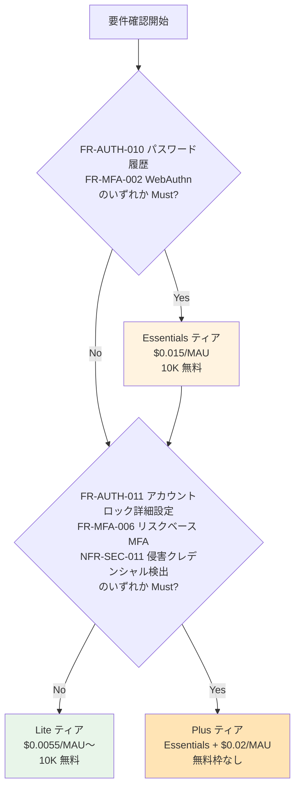

# ADR-016: Cognito 機能ティア（Lite / Essentials / Plus）の機能マトリクスと選定基準

- **ステータス**: Proposed（要件定義フェーズで Accepted に昇格予定）
- **日付**: 2026-05-13
- **関連**:
  - [ADR-006](006-cognito-vs-keycloak-cost-breakeven.md)（Cognito vs Keycloak コスト損益分岐）
  - [ADR-014](014-auth-patterns-scope.md)（認証パターン対応範囲）
  - [functional-requirements.md](../requirements/functional-requirements.md) FR-AUTH-009〜014 / FR-MFA-002 / FR-MFA-006
  - [non-functional-requirements.md](../requirements/non-functional-requirements.md) NFR-SEC-010
  - [reference/cognito-pricing-2024-revision.md](../reference/cognito-pricing-2024-revision.md)

---

## Context

2024 年 11 月、Amazon Cognito は料金体系を改定し、機能を **Lite / Essentials / Plus の 3 ティア制**に再編した。要件定義時に「Cognito で X 機能ができるか」は**どのティアを採用するかに依存する**ため、ティア別の機能差を整理し、要件 → ティアの対応関係を確定させる必要がある。

加えて、PoC ドキュメント（初期作成 2026-03 頃）には旧仕様（Advanced Security Features の有無）に基づく記述が残っており、**事実と異なる箇所**（後述）が見つかったため、最新仕様で整理し直す。

---

## 機能ティア マトリクス（一次資料ベース）

下記表は AWS 公式ドキュメント（[Plus plan features](https://docs.aws.amazon.com/cognito/latest/developerguide/feature-plans-features-plus.html), [Essentials plan features](https://docs.aws.amazon.com/cognito/latest/developerguide/feature-plans-features-essentials.html)）と [Pricing](https://aws.amazon.com/cognito/pricing/) の事実マトリクス。要件定義のティア選定根拠とする。

### 料金体系（2024-12 以降）

| ティア | 月次無料枠 | 有料単価（直接サインイン）| 有料単価（フェデレーション）|
|---|---|---|---|
| **Lite** | 10,000 MAU | $0.0055 / MAU（〜100K MAU） | $0.015 / MAU |
| **Essentials** | 10,000 MAU | $0.015 / MAU（〜100K MAU） | $0.015 / MAU |
| **Plus** | **無料枠なし** | $0.02 / MAU を**上記に加算** | $0.02 / MAU を**上記に加算** |

※ Plus は Essentials に対する**追加課金**。Plus ティア採用 = 「Essentials の機能セット + Plus の Threat Protection 機能」+ $0.02/MAU の上乗せ。

### 機能マトリクス

| 要件 ID | 機能 | Lite | Essentials | Plus | 出典 |
|---|---|:---:|:---:|:---:|---|
| FR-AUTH-001 | ID/PW 認証（ローカルユーザー）| ✅ | ✅ | ✅ | 全ティア標準 |
| FR-AUTH-002 | Authorization Code + PKCE | ✅ | ✅ | ✅ | 全ティア標準 |
| FR-AUTH-003 | Authorization Code + client_secret（SSR）| ✅ | ✅ | ✅ | 全ティア標準（App Client Confidential 設定）|
| FR-AUTH-004 | Client Credentials（M2M）| ✅ | ✅ | ✅ | Resource Server + Custom Scope 設定 |
| FR-AUTH-005 | Token Exchange（RFC 8693）| ❌ | ❌ | ❌ | Cognito 全ティア非対応 |
| FR-AUTH-006 | Device Code Flow | ❌ | ❌ | ❌ | Cognito 全ティア非対応 |
| FR-AUTH-007 | mTLS Client Auth（RFC 8705）| ❌ | ❌ | ❌ | Cognito 全ティア非対応 |
| FR-AUTH-009 | パスワードポリシー（最小長・複雑性）| ✅ | ✅ | ✅ | 全ティア標準（`PasswordPolicyType`）|
| FR-AUTH-010 | **パスワード履歴**（過去 N 個と一致禁止）| ❌ | **✅ N=0〜24** | ✅ | [Password reuse prevention docs](https://docs.aws.amazon.com/cognito/latest/developerguide/cognito-user-pool-settings-advanced-security-password-reuse.html) — Essentials+ で `PasswordHistorySize` 設定可。**Terraform aws_cognito_user_pool は未対応（[#39016](https://github.com/hashicorp/terraform-provider-aws/issues/39016)）→ Console/SDK/CFn で設定** |
| FR-AUTH-011 | **アカウントロック（連続失敗）** | ⚠ 標準ブルートフォース保護のみ（パラメータ調整不可）| ⚠ 同左 | **✅ 詳細設定可**（Risk Configuration、リスクベース適応認証）| [Threat protection docs](https://docs.aws.amazon.com/cognito/latest/developerguide/cognito-user-pool-settings-threat-protection.html) |
| FR-AUTH-012 | パスワード有効期限 | ✅ | ✅ | ✅ | `TemporaryPasswordValidityDays` ほか |
| FR-AUTH-013 | セルフサービスパスワードリセット | ✅ | ✅ | ✅ | Forgot Password / Hosted UI 標準 |
| FR-AUTH-014 | 初期パスワード強制変更 | ✅ | ✅ | ✅ | Required Action 標準 |
| FR-FED-001〜010 | フェデレーション系 | ✅ | ✅ | ✅ | 全ティア標準。フェデレーション課金 $0.015/MAU は別途 |
| FR-MFA-001 | TOTP MFA | ✅ | ✅ | ✅ | 全ティア標準 |
| FR-MFA-002 | **WebAuthn / FIDO2（Passkeys）** | ❌ | **✅** | ✅ | [Cognito Passkeys (2024-11)](https://aws.amazon.com/about-aws/whats-new/2024/11/passkeys-passwordless-authentication-amazon-cognito/) — Essentials+ で対応。`ALLOW_USER_AUTH` フロー限定、最大 20 個/ユーザー |
| FR-MFA-003 | SMS OTP | ✅（SNS 課金別途）| ✅ | ✅ | 全ティア標準 |
| FR-MFA-006 | **条件付き MFA（リスクベース）** | ❌ | ❌ | **✅** | Plus ティアの Threat Protection 機能 |
| FR-MFA-008 | 端末記憶（Trusted Device）| ✅ | ✅ | ✅ | Remember Device 標準 |
| FR-AUTHZ-006 | カスタムクレーム注入（Pre Token Lambda V2）| ✅ | ✅ | ✅ | Lambda Trigger 標準 |
| FR-AUTHZ-007 | API Gateway 認可統合 | ✅ | ✅ | ✅ | 全ティア標準 |
| FR-USER-003 | SCIM プロビジョニング | ❌ | ❌ | ❌ | Cognito User Pool は SCIM ネイティブ非対応（全ティア共通）|
| NFR-SEC-010 | **ブルートフォース対策（詳細設定可）** | ⚠ 基本のみ | ⚠ 基本のみ | **✅** | FR-AUTH-011 と同じ判定 |
| NFR-SEC-011 | **侵害クレデンシャル検出**（Compromised Credentials）| ❌ | ❌ | **✅** | [Compromised credentials docs](https://docs.aws.amazon.com/cognito/latest/developerguide/cognito-user-pool-settings-compromised-credentials.html) |
| — | カスタム Hosted UI / Managed Login UI | ❌（標準のみ）| ✅（テーマカスタム）| ✅ | Essentials+ で UI 拡張機能 |
| — | アクティビティログ（認証イベントエクスポート）| ❌ | ❌ | ✅ | Plus ティアの Threat Protection 機能 |

### PoC 実装における誤認の訂正

| ドキュメント | 旧記載 | 訂正後 | 根拠 |
|---|---|---|---|
| FR-MFA-002 | Cognito ❌ 非対応 | ✅ Essentials+ ティア | Cognito Passkeys は 2024-11 公開 |
| FR-AUTH-010 | Cognito ❌ 非対応 | ⚠ Essentials+ ティア必要 | Password Reuse Prevention は Essentials+ |
| FR-AUTH-011 | Cognito ⚠ Advanced Security 必要 | ⚠ 標準 BF 保護 / Plus で詳細制御 | Advanced Security は Plus に統合 |
| NFR-SEC-010 | Cognito ⚠ Advanced Security | ⚠ 同上 | 同上 |

---

## Decision（Proposed）

要件定義のティア選定は以下のフローに従う。

### ティア → 損益分岐 MAU（vs Keycloak、ADR-006 連動）

Keycloak HA 構成の月額 $2,620（インフラ $940 + 運用 $1,680）を起点に算出。

| Cognito ティア | 連携課金 | Plus 課金 | 合計 / MAU | 損益分岐 MAU |
|---|---|---|---|---|
| Lite + フェデレーション利用 | $0.015 | — | $0.015 | **175,000** |
| Essentials + フェデレーション利用 | $0.015 | — | $0.015 | **175,000**（料金は Lite と同じ）|
| Plus + フェデレーション利用 | $0.015 | $0.02 | $0.035 | **75,000** |

※ 直接サインイン（ローカルユーザー）課金は別途。ローカルユーザーが多数を占める想定なら別途試算が必要。

### 補足: Essentials と Lite のフェデレーション課金は同額

フェデレーション利用なら Lite と Essentials の単価差はない（どちらも $0.015/MAU）。**機能差のためにのみ Essentials を選ぶ判断になる**ため、Essentials 採用に追加コストはほぼ発生しない（FR-AUTH-010 パスワード履歴 / FR-MFA-002 WebAuthn が Must なら Essentials を選択しても損益分岐は変わらない）。

---

## Consequences

### Positive

- 要件 → ティアの対応が明確化し、ヒアリングで顧客に「この要件を入れると追加で $X/MAU 必要」と説明可能
- ADR-006 のコスト計算前提（連携 $0.015/MAU）がティアによって変動する事実を明示
- WebAuthn / パスワード履歴を「Keycloak 必須要因」と誤認しなくなる（要件定義の判断材料を 1 件正す）

### Negative

- ティア選定がコスト試算の前提を変えるため、要件確定後に **ADR-006 のコスト試算を再計算**する必要がある
- Terraform `aws_cognito_user_pool.password_policy` が `PasswordHistorySize` 未対応のため、**FR-AUTH-010 採用時は IaC で完全管理できない**（PR 待ち or CFn 併用）

### Neutral

- 「Cognito Plus ティアを採用するか」の最終判断は要件定義完了後（ADR-024 として将来発番）
- 損益分岐 75,000 MAU と 175,000 MAU の差は、Plus 機能 1 つ Must かどうかで決まる

---

## Alternatives Considered

| 案 | 判断 |
|----|------|
| Lite で進めて Plus 必要時にティアアップ | ティアアップは可能だが、設計初期に決めないと**料金前提が崩れる**。要件定義時に決定すべき |
| Plus を初期から採用（全機能利用可） | コスト過剰。Threat Protection が不要なら Plus は無駄 |
| WebAuthn / パスワード履歴を Keycloak で対応（Cognito は Lite） | 機能 1〜2 個のために Keycloak（運用負荷 +$1,680/月）に切り替えるのはコスト不利 |
| **要件確定 → 最小ティア選定**（採用） | コスト最適、機能要件と合致 |

---

## Follow-up

要件定義フェーズで以下を確認:

| 確認項目 | 関連 ID | ティア影響 |
|---------|--------|----------|
| パスワード履歴は Must か? | FR-AUTH-010 | Yes → Essentials+ |
| WebAuthn / Passkeys は Must か? | FR-MFA-002 | Yes → Essentials+ |
| 連続失敗でアカウントロックする要件か? 自動 BF 保護で十分か? | FR-AUTH-011 / NFR-SEC-010 | 詳細ロック設定 Must → Plus |
| リスクベース適応認証は必要か? | FR-MFA-006 | Yes → Plus |
| 侵害クレデンシャル検出は必要か? | NFR-SEC-011（新規）| Yes → Plus |

確定後に本 ADR を Accepted に昇格、ADR-006 のコスト試算を採用ティアで再計算する。

---

## NIST SP 800-63B 観点での補足

パスワード履歴（FR-AUTH-010）について、NIST SP 800-63B（2017 改訂以降）は**履歴強制を推奨していない**:

- 推奨されるのは「侵害された / 漏洩したパスワードのブロック」
- Cognito Plus の Compromised Credentials Detection はこの推奨と整合
- 顧客要件で「過去 N 個禁止」が**法令やコンプライアンスベース**なら従う、**慣習ベース**なら NIST 推奨に沿って Compromised Credentials Detection（Plus ティア）への振替を提案する余地あり

→ 要件定義ヒアリング時に「履歴 vs 漏洩検知」のどちらが本質要件かを確認する。

---

## 出典

- [Plus plan features - Amazon Cognito](https://docs.aws.amazon.com/cognito/latest/developerguide/feature-plans-features-plus.html)
- [Essentials plan features - Amazon Cognito](https://docs.aws.amazon.com/cognito/latest/developerguide/feature-plans-features-essentials.html)
- [Password reuse prevention - Amazon Cognito](https://docs.aws.amazon.com/cognito/latest/developerguide/cognito-user-pool-settings-advanced-security-password-reuse.html)
- [Advanced security with threat protection - Amazon Cognito](https://docs.aws.amazon.com/cognito/latest/developerguide/cognito-user-pool-settings-threat-protection.html)
- [Working with compromised-credentials detection - Amazon Cognito](https://docs.aws.amazon.com/cognito/latest/developerguide/cognito-user-pool-settings-compromised-credentials.html)
- [Passwords, account recovery, and password policies - Amazon Cognito](https://docs.aws.amazon.com/cognito/latest/developerguide/managing-users-passwords.html)
- [PasswordPolicyType - Amazon Cognito User Pools API](https://docs.aws.amazon.com/cognito-user-identity-pools/latest/APIReference/API_PasswordPolicyType.html)
- [Announcing new feature tiers: Essentials and Plus (AWS, 2024-11)](https://aws.amazon.com/about-aws/whats-new/2024/11/new-feature-tiers-essentials-plus-amazon-cognito/)
- [Amazon Cognito Pricing](https://aws.amazon.com/cognito/pricing/)
- [terraform-provider-aws#39016 - PasswordHistorySize support](https://github.com/hashicorp/terraform-provider-aws/issues/39016)
- [NIST SP 800-63B Digital Identity Guidelines](https://pages.nist.gov/800-63-3/sp800-63b.html)
