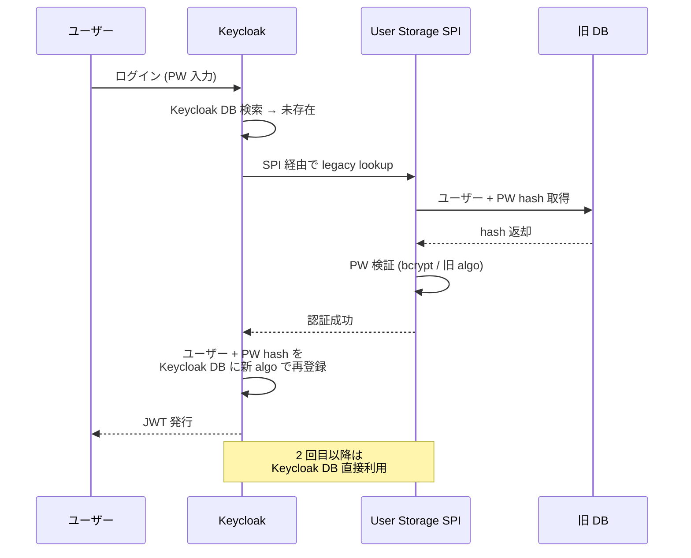
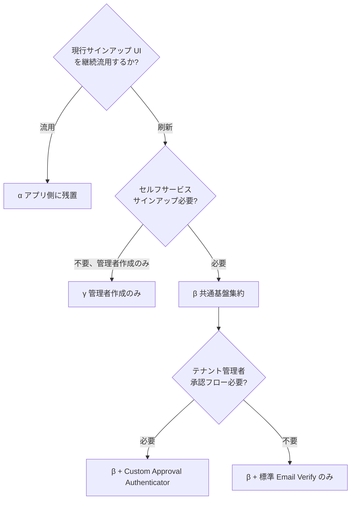
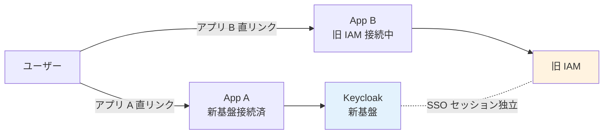
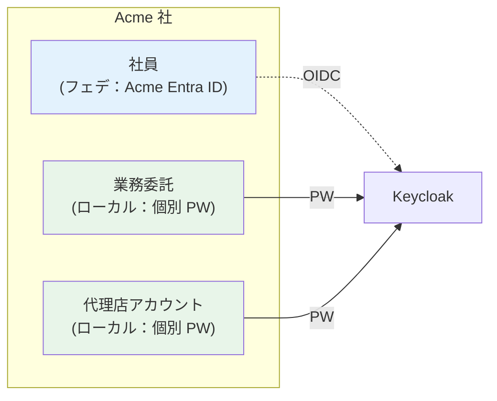
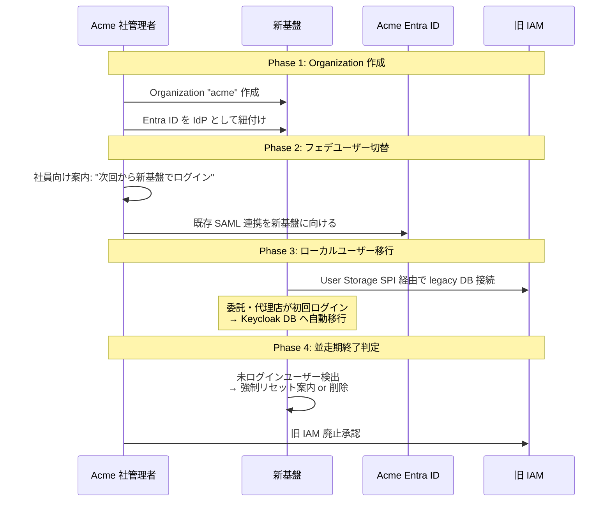

# ADR-019: 既存システムからの移行戦略（並走 + User Storage SPI キャッシュ移行）

- **ステータス**: Proposed（要件定義フェーズで Accepted に昇格予定）
- **日付**: 2026-06-12 作成、**2026-07-24 更新（`legacy_user_id` クレーム廃止確定 — [U10 D-U10-12](../basic-design/10-integration-migration-design.md)、idmap API 参照へ一本化）**
- **関連**:
  - [§FR-1.2.0.E 既存システムからの混在モデル移行戦略](../requirements/proposal/fr/01-auth.md#fr-120e-既存システムからの混在モデル移行戦略ローカル--フェデ併存からの集約)
  - [ADR-018 ユーザー識別子 3 階層戦略](018-user-identifier-3layer-emailless.md)
  - [§FR-7.4.7 段階移行運用](../requirements/proposal/fr/07-user.md#fr-747-段階移行運用jit--scim-追加既存ユーザーマージ)
  - 関連 Claude 内部メモリ: `project_migration_strategy_local_fed.md`

---

## Context

現行システムが**ローカルユーザー管理（サインアップ + ユーザー管理 UI）とフェデレーションを併存運用している**状態から、本基盤（Keycloak ベース）へ移行する戦略を確定する必要がある。

具体的な摩擦:

| 摩擦点 | 内容 |
|---|---|
| **PW ハッシュの互換性** | 旧システムが bcrypt / Argon2 旧版 / 独自 algo の場合、Keycloak ネイティブ（PBKDF2 / Argon2 25+）と非互換。強制リセットせずに移行する手段が必要 |
| **サインアップ UI の所在** | 既存のサインアップ機能を新基盤の Hosted UI に集約するか、アプリ側に残すか、廃止するか |
| **混在顧客の存在** | 同一顧客内で「社員=フェデ + 委託=ローカル」のような混在構成があると、移行も二重に必要 |
| **新旧の識別子衝突** | 旧システム ID と新基盤 Layer A `sub` の対応表が必要、並走期は両方が活きる |
| **ロールバックの単位** | アプリ単位 / 顧客単位 / 利用者カテゴリ単位 のどこで切替・戻すか |

戦略レベルで先に確定しないと、運用開始後に「PW 強制リセット通知が顧客で炎上」「ロールバック単位が不明確」等の事故が起きる。

---

## Decision

| 項目 | 採用方針 |
|---|---|
| **移行アプローチ** | **B. 並走（Parallel Run）** — アプリ単位で順次切替 |
| **ローカル PW ハッシュ** | **② User Storage SPI（キャッシュ移行）** — 初回ログイン後に Keycloak DB へ自動移行 |
| **サインアップ機能** | **β. 共通基盤集約**（Keycloak Hosted UI + Custom Approval Authenticator） |
| **並走期間** | **3〜6 ヶ月**（休眠ユーザーは半年で 90% カバー）|
| **切替単位** | **アプリ単位**（リスク低分散）|
| **識別子マッピング** | 旧 user_id を Layer B `external_id` として保持、JWT に `legacy_user_id` クレーム発行 → **2026-07-24 廃止確定（[U10 D-U10-12](../basic-design/10-integration-migration-design.md)）: 旧 ID の参照は JWT クレームでなく idmap API（`GET /idmap/{sub}`）へ一本化**（P-10 Stage 1 最小クレームと整合）|
| **混在顧客対応** | Keycloak Organizations + Organization メンバー（IdP 紐付け有 / 無）で統合 |
| **ロールバック単位** | アプリ単位（DNS / config 切替で 1 時間以内）|

---

## A. 移行アプローチ 3 パターンの比較

業界（Ubisecure / Inteca / Strata.io / IdentityPlane 2025-2026 ガイドライン）は次の 3 パターンに収斂:

| 案 | 特徴 | リスク | 工数 | ロールバック容易性 | 推奨度 |
|---|---|---|---|:---:|:---:|
| **A. Big Bang（Rip & Replace）** | メンテ窓 1 回で全ユーザー / 全アプリ切替 | 🔴 高（戻り道なし）| 短期集中 | ❌ 困難 | 小規模 / 単純構成のみ |
| **B. 並走（Parallel Run）**（**業界推奨**）| 旧 IAM が source、新基盤と双方向接続、**アプリ単位で順次切替** | 🟡 中（並走期の複雑性）| 中（3〜6 ヶ月）| **✅ 容易**（アプリ単位）| ★★★★★ |
| **C. 永続共存（Coexistence）** | 旧 + 新が共に本番稼働 | 🟡 中-高（長期複雑運用）| 長期 | ⚠ 制限的 | 例外（特殊レガシー）|

### B 案（並走）の業界裏どり

Ubisecure / Inteca のガイダンス引用:

> "The legacy IAM remains the **primary source for identity data at the beginning**. The new platform runs alongside it, with connectivity back to the old directory or user store. You cut applications over incrementally starting with internal or low-risk apps to validate the pattern. **If a specific app runs into trouble, you do not have to roll back the whole migration**."

→ **「アプリ単位で切替・戻し可能」**が並走方式の最大の利点。Keymate の事例では Keycloak へ **12 million records/hour** で大量移行を実証。

---

## B. ローカル PW ハッシュ移行の 5 手段

### Keycloak のネイティブ対応範囲

| アルゴリズム | Keycloak ネイティブ対応 | 備考 |
|---|:---:|---|
| **PBKDF2-SHA256 / SHA512** | ✅ | Keycloak 24 以前のデフォルト |
| **Argon2** | ✅ | Keycloak 25+ デフォルト |
| **bcrypt** | ❌（プラグイン / Custom SPI 必要）| `keycloak-bcrypt` OSS あり |
| **Argon2 旧版** | ⚠ パラメータ次第 | Custom PasswordHashProvider 推奨 |
| **MD5 / SHA1 単純ハッシュ** | ❌ | 強制リセット推奨 |

### 5 つの移行手段

| # | 手段 | Keycloak 実装 | 強制リセット要否 | 採用判断 |
|---|---|---|:---:|---|
| ① | 既存値が PBKDF2 / Argon2 互換 | そのまま import | ❌ 不要 | レア（旧システム = Keycloak 系のみ）|
| **②** | **User Storage SPI（キャッシュ移行）**（**業界標準**）| 旧 DB を一時的に認証ソースに、初回ログイン後に Keycloak DB へ移行 | ❌ 不要 | ★★★★★ |
| ③ | Custom PasswordHashProvider SPI | bcrypt / Argon2 旧版を Keycloak に永続的に追加 | ❌ 不要 | 旧 algo を恒久維持したい場合 |
| ④ | 強制リセット（招待メール + Reset Credentials）| すべてのユーザーに「新規 PW 設定」案内 | ✅ **必要** | クリーン、UX 悪化・サポート工数増 |
| ⑤ | アプリ側で代理認証（移行期のみ）| アプリが旧 DB で検証 → Token Exchange | ❌ 不要 | 移行期のみ、段階廃止前提 |

### 推奨：② User Storage SPI の動作

### 重要な業界知見（codesoapbox.dev / Inteca）

> "Both authentication systems will have to be **deployed at the same time until every user has logged in at least once**, as there is no other way to achieve this goal while responsibly encrypting users' passwords."

→ **並走期間 = 全ユーザーが一度はログインする期間**。半年〜1 年が現実的。並走終了時に未ログインユーザーは強制リセット or 削除。

---

## C. サインアップ機能の引き継ぎ 3 パターン

| 案 | サインアップ UI 所在 | 承認フロー | 採用判断 | 業界実例 |
|---|---|---|---|---|
| α. アプリ側に残置 | 各アプリの既存 UI | アプリ実装 | 既存 UI を継続使用 / リスク最小化 | レガシー多数の混在環境 |
| **β. 共通基盤集約**（**業界標準**）| 認証基盤 Hosted UI | Keycloak Registration Flow + Custom Approval Authenticator | 統一 UX / 運用集約 | Microsoft Entra External ID、Auth0 B2B Starter |
| γ. 管理者作成のみ（セルフ廃止）| なし | 管理者主導 (Admin UI / API) | 規制業種 / B2B 一部 | Salesforce Enterprise |

### β 案（Keycloak Hosted Registration）の構成

- **Keycloak Registration Flow** が標準で登録 UI を提供
- 承認ワークフロー: 標準で「メール確認」のみ。カスタム承認（テナント管理者承認）が必要なら Custom Required Action / Authenticator 実装
- Event Listener SPI で外部承認システム（Salesforce / Slack / 自社管理 UI）と連携可
- Microsoft Entra External ID の "Self-service sign-up + Approval workflow" と概念的に等価

### 決定木

---

## D. 並走期の運用設計

### 識別子マッピングの持ち方

| 持ち方 | 場所 | 用途 |
|---|---|---|
| **マッピング表（DB / KVS）**| 専用 service or 共通基盤の custom attribute | 旧 user_id を `external_id` カスタム属性として Layer B に保持 |
| **JWT クレーム** | `legacy_user_id` クレーム発行 — **2026-07-24 廃止確定（[U10 D-U10-12](../basic-design/10-integration-migration-design.md)）: 旧 ID の参照は JWT クレームでなく idmap API（`GET /idmap/{sub}`）へ一本化**（P-10 Stage 1 最小クレームと整合）| 旧 ID を必要とするアプリ向け → idmap API 照会に置換 |
| **アプリ側 lookup** | 各アプリの user_id 列に both 値を保持 | アプリ DB 移行を伴う場合のみ |

### 切替単位の選択

| 単位 | 例 | 利点 | 欠点 |
|---|---|---|---|
| **アプリ単位**（**推奨**）| App A → App B → App C | ロールバック容易、リスク分散 | アプリ間 SSO が一時的に複雑化 |
| 顧客単位 | Acme 全アプリ → Globex 全アプリ | 顧客への影響説明がシンプル | 単一顧客で全アプリ巻き戻し必要時に重い |
| 利用者カテゴリ単位 | 管理者層 → 一般従業員 → ゲスト | リスク低層から開始 | 同一アプリ内で新旧混在、Sorry 多発 |

### 並走期の SSO / セッション制御

→ **並走期は「アプリごとに独立 SSO セッション」が現実解**。新旧を跨いだ SSO セッションは設計困難（業界事例なし）。ユーザーには「移行期は両方のログインが起きうる」と事前周知（B-616 リードタイム）。

### ロールバック手段

| 切替後の問題 | ロールバック手段 |
|---|---|
| 特定アプリで認証エラー多発 | アプリの IdP 設定を旧 IAM に戻す（DNS / config 切替、1 時間以内）|
| 全アプリで Keycloak 障害 | DNS で `auth.example.com` を旧 IAM に向け、旧 IAM が引き続き全アプリの IdP として機能 |
| 識別子マッピング不整合発覚 | マッピング表を再生成 / 該当ユーザーのみ手動修正 |

---

## E. 混在顧客（同一顧客内 local + fed）の扱い

### 典型シナリオ

→ **業界標準パターン**（Microsoft Azure Architecture Center 2026）:

> "Some solutions allow federation to grant employees access, while also allowing access for contractors or users who don't have accounts in the federated IdP."

### Keycloak Organizations での実装

| ユーザー種別 | Keycloak での扱い |
|---|---|
| 社員（フェデ）| Organization メンバー + 紐付け IdP 経由 |
| 委託・代理店（ローカル）| Organization メンバー but IdP 紐付けなし、ローカル PW |
| ゲスト（一時アクセス）| Organization 非所属 realm ユーザー |

→ [ADR-020](020-hrd-hint-keys-mixed-login.md) で確定した Identifier-First 標準動作で同じログイン画面から両方扱える。

### 混在顧客の移行手順

---

## Consequences

### Positive

- 強制 PW リセットを避け、ユーザーへの負担を最小化
- アプリ単位の切替・ロールバックでリスク分散
- 並走期 3〜6 ヶ月で短期完了
- 混在顧客（社員=フェデ + 委託=ローカル）を業界標準パターンで処理

### Negative

- 並走期間中は旧 IAM + Keycloak の二重運用負荷
- Custom User Storage SPI の実装・保守（移行期のみ）
- 並走期は「アプリごとに独立 SSO セッション」となり、新旧跨ぎ SSO は提供できない
- bcrypt / 独自 algo の場合は Custom PasswordHashProvider SPI も追加で必要

### Constraints

- 並走期間中は全ユーザーが一度はログインしないと旧 DB を完全廃止できない
- 並走期終了時に未ログインユーザーは強制リセット or 削除が必要

---

## 参考資料

- **業界移行戦略ガイドライン**:
  - [Ubisecure: How to migrate your IAM system](https://www.ubisecure.com/identity-platform/how-to-migrate-iam-system/) — Big Bang vs Parallel
  - [Inteca: IAM Migration Strategy 2026](https://inteca.com/business-insights/iam-migration/) — 並走 + アプリ単位切替が業界主流
  - [Strata.io: App Identity Modernization 2025](https://www.strata.io/resources/whitepapers/identity-modernization-app-migration-checklist/)
  - [IdentityPlane: Practical IAM Migration Strategies for High-Scale](https://www.identityplane.com/post/iam-migration-strategies-for-high-scale-user-bases)
- **Keycloak 移行実装**:
  - [Keycloak User Migration Plugin (codesoapbox.dev)](https://codesoapbox.dev/keycloak-user-migration/) — User Storage SPI キャッシュ移行
  - [Keycloak Password Hashprovider Extension](https://github.com/inventage/keycloak-password-hashprovider-extension)
  - [Keymate: Massive Identity Migration to Keycloak (12M records/hr)](https://keymate.io/blog/tuning_keycloak_migration)
  - [DEV: Import bcrypt hashed user passwords into Keycloak](https://dev.to/carnewal/import-existing-users-with-bcrypt-hashed-passwords-in-keycloak-17oo)
- **B2B サインアップ + 混在モデル**:
  - [Microsoft Entra External ID Self-service sign-up + Approval](https://learn.microsoft.com/en-us/entra/external-id/self-service-sign-up-user-flow)
  - [Auth0 B2B SaaS Starter](https://github.com/auth0-developer-hub/auth0-b2b-saas-starter)
  - [Azure Architecture Center: Identity in Multitenant Solution](https://learn.microsoft.com/en-us/azure/architecture/guide/multitenant/considerations/identity)
