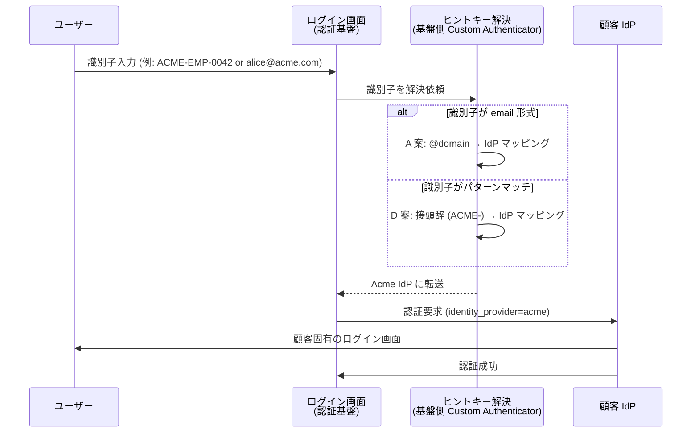

# ADR-020: HRD ヒントキー戦略 + フェデ/ローカル混在 Identifier-First

- **ステータス**: Proposed（要件定義フェーズで Accepted に昇格予定）
- **日付**: 2026-06-12
- **⚠ 2026-06-25 補足**: 本 ADR は **HRD のヒントキー戦略（A〜E 案 + 補助 2）**を確定する**戦略レイヤ**。**実装方式選定**は [ADR-055](055-hrd-implementation-method-selection.md) で 3 方式を裏どり調査の上、**Phase 1 = 方式 A（Custom Authenticator SPI、Java、社内開発）採用確定**（2026-06-25 ユーザー判断）。Phase 2 で大口顧客向けに方式 C（URL + CloudFront Function）併用候補。
- **関連**:
  - [**ADR-055 HRD 実装方式選定**](055-hrd-implementation-method-selection.md)（**実装レイヤ、2026-06-25 新規**）
  - [§FR-2.3.3 ログイン画面で IdP 選択 UX / Home Realm Discovery](../requirements/proposal/fr/02-federation.md#fr-233-ログイン画面で-idp-選択-ux--home-realm-discovery--fr-fed-013)
  - [ADR-018 ユーザー識別子 3 階層戦略](018-user-identifier-3layer-emailless.md)
  - 関連 Claude 内部メモリ: `project_hrd_emailless_extension.md`、`project_mixed_login_landing_ux.md`

---

## Context

打ち合わせ準備の深掘りで 2 つの論点が判明:

1. **HRD = メールドメイン HRD という前提崩壊**: ADR-018 で email 非保有ユーザー（フィールドワーカー / 工場 / 病院 / 小売 / 教育）を正式に受け入れる前提を確定したことで、既存の HRD パターン A（メールドメインベース）が email 非保有時に破綻する。
2. **フェデ + ローカル混在ログイン**: 1 つの認証基盤に「フェデユーザー（顧客 IdP 経由）」と「ローカルユーザー（共通基盤 DB 直接登録）」が同居するシナリオで、共通ログイン画面が両方を**同じ画面で安全に振り分ける**仕組みが必要。

「HRD = email ドメイン HRD」を再定義する必要がある。Keycloak v26 Organizations の標準動作で何ができるかも併せて確定する。

---

## Decision

### HRD ヒントキーは「email ドメイン」とは限らない — 5 案 + 補助 2 案を整理

HRD の業界一般定義（Auth0 / Microsoft / Scalekit）:

> **HRD = ユーザーがどの IdP / realm に属するかを認証情報の入力前に判定する仕組み**

採用する 5 案 + 補助 2 案:

| 案 | ヒントキー | 取得タイミング | email 非保有時 | 採用例 |
|---|---|---|:---:|---|
| A | email の @domain | ユーザー入力 | ❌ 破綻 | Auth0、Entra ID、Notion |
| B | ユーザーが選択（セレクター UI）| ユーザー入力 | ✅ | Google、多くの SaaS（汎用フォールバック）|
| **C** | URL（サブドメイン / パス）| URL 自体 | ✅ **第一推奨** | Slack（`workspace.slack.com`）、Figma |
| **D** | 顧客独自 ID パターン（`ACME-EMP-*` 等）| ユーザー入力 | ✅ | Microsoft 365 sign-in name、Auth0 Identifier-First |
| **E** | `kc_idp_hint` URL パラメータ | SPA / ポータル注入 | ✅ | 自社ポータル経由ディープリンク |
| 補 ⑥ | Cookie（前回選択記憶）| ブラウザ | ✅ | 補助 |
| 補 ⑦ | IP / CIDR ベース | ネットワーク | ✅ | 補助、企業内 NW |

### フェデ + ローカル混在は **Keycloak v26 Organizations 標準動作で実現**

Keycloak 公式ブログ（2024-06）からの引用:

> "The main change to the browser flow is that it **defaults to an identity-first login** so that users are identified before prompting for their credentials. During login, the user provides an email address. Keycloak analyzes its domain and automatically assigns the user to the appropriate organization."

> "A user will act as **an existing realm user that has an email that matches one of the domains set to an organization but is not yet a member of the organization**. This user could have been created through **self-registration, or by integrating with a custom identity store, or even federated from an identity provider available from the realm**."

→ v26 Organizations は次の 3 つを同じ Browser Flow で扱う前提で設計されている:
1. Organization に IdP が紐付いている → フェデ経路（IdP に強制 redirect）
2. Organization に IdP が紐付いていないが、ユーザーは Organization メンバー → ローカル経路（PW プロンプト）
3. Organization メンバーでないが realm に既存ユーザーとして存在 → ローカル経路（PW プロンプト、Organization 非依存）

---

## A. 顧客状況別の HRD パターン推奨マトリクス

| 顧客状況 | 推奨 HRD パターン | 補助手段 |
|---|---|---|
| **全員 email 保有 + 1 顧客 = 1 ドメイン** | A（email ドメイン HRD）| Cookie 記憶（⑥）|
| **全員 email 保有 + 1 顧客 = 複数ドメイン** | A + 複数ドメイン → 同一 IdP マッピング | Cookie 記憶（⑥）|
| **email 一部のみ保有（混在）** | **D + A ハイブリッド**（識別子先行で判定、email 形式なら A、ID 形式なら D）| C を大口顧客に追加 |
| **全員 email 非保有 + 単一顧客** | **C（組織固有 URL）** | Cookie 記憶（⑥）|
| **全員 email 非保有 + 複数顧客** | **C + E（kc_idp_hint）** | テナントコード（③）バックアップ |
| **ポータル経由ディープリンクが主** | **E（kc_idp_hint）** | C をフォールバック |

## B. 各案の実装フロー

### D 案（識別子先行 / Identifier-First）

### C 案（組織固有 URL）の email-less シナリオ

- **URL の例**: `acme.basis.example.com` / `basis.example.com/t/acme` / `basis.example.com/acme/login`
- **Front Proxy**（CloudFront / ALB / nginx）でテナント識別子を抽出し、Keycloak への認可要求に `kc_idp_hint=acme` を自動付与
- ユーザーは何も入力せずに顧客 IdP に直接転送される（**email も独自 ID も入力不要**）
- 顧客のブランディング（ロゴ / 色 / フッター）が URL 単位で確定

### E 案（`kc_idp_hint` URL パラメータ）の使い所

Keycloak の `kc_idp_hint` は OAuth/OIDC 認可要求の**オプションパラメータ**として扱われ、Keycloak のログイン画面をスキップして指定 IdP へ直接転送する標準機能。

| ユースケース | E 案が刺さる場面 |
|---|---|
| 自社ポータル / SPA がテナントを認識済 | ポータル側で `?kc_idp_hint=acme` を付けてディープリンク |
| QR コード / バッジログイン | QR の中に `kc_idp_hint` を埋め込む |
| メール招待リンク（基盤内招待）| 招待 URL に `kc_idp_hint` を付与 |
| C 案（組織固有 URL）の裏で使用 | Front Proxy がサブドメインを抽出して `kc_idp_hint` 化 |

## C. 5 案のフォールバック設計

各案でヒントキーが取れない場合の動作:

| 案 | ヒントキー欠落時の動作 | 推奨フォールバック |
|---|---|---|
| A | email が入力されない / 未登録ドメイン | B（IdP セレクター）に降格 |
| B | — | （フォールバック先） |
| C | URL にテナント識別子なし | ランディング画面で「組織コードを入力してください」 or B |
| D | パターンマッチ失敗 | B + ヘルプリンク |
| E | `kc_idp_hint` 不正 / 未設定 | A or B |

→ **すべての案で「最終的に B（IdP セレクター）にフォールバック」する設計が業界標準**。

## D. Keycloak での混在ハンドリング 4 実装パス

| # | 実装パス | Keycloak 機能 | 工数 | email 非保有対応 | 推奨度 |
|---|---|---|---|:---:|:---:|
| **①** | **v26 Organizations 標準**（推奨）| 公式機能 | ◎ 設定のみ | ❌ email ドメイン依存 | ★★★★★（email あり時）|
| ② | Conditional Authenticator（公式）| Browser Flow + 公式 Condition - User Configured | ◎ 設定で組合せ | ⚠ 標準条件式の範囲 | ★★★★ |
| **③** | **Custom Conditional Authenticator SPI** | Java 実装 | ❌ 1-2 週間 | ✅ **D 案はこれが必要** | ★★（email 非保有時）|
| ④ | コミュニティ `keycloak-home-idp-discovery` | OSS プラグイン | ◎ JAR 配置 | ⚠ Elastic License v2、RHBK 対象外 | ★★（RHBK 不採用時のみ）|

### 顧客状況別の推奨実装パス

| 顧客状況 | 推奨実装パス | 理由 |
|---|---|---|
| **全員 email 保有** | **① v26 Organizations 標準** | 設定のみで Identifier-First + 混在ハンドリングが揃う |
| **email 一部のみ保有（混在）** | **① + ③ Custom Authenticator** | email 形式なら ① の Organization マッチ、独自 ID 形式なら ③ Custom Conditional |
| **全員 email 非保有** | **③ Custom Authenticator + C 案 URL** | Front Proxy が URL → `kc_idp_hint` 化、Keycloak は混在判定スキップ |
| **ローカルユーザーゼロ（フェデ専用）** | **① + IdP セレクター B 案** | 混在判定不要、IdP 選択のみ |

## E. 業界実例（混在ハンドリング UI）

| サービス | UI パターン | 出典 |
|---|---|---|
| **Notion** | email / password を**分離フィールド表示**、Identifier-First で HRD | Scalekit Blog |
| **Dropbox** | email 入力でエンタープライズ認証が判定されたら **password フィールドを隠す** | 同上 |
| **Freshworks** | email でテナント特定後、**組織固有ログインページに redirect** | 同上 |
| **Microsoft 365** | sign-in name 入力 → managed / federated を判定 → 適切なログイン画面に遷移 | Microsoft Learn |

→ いずれも「**email/識別子先行 → 判定 → 適切な経路に分岐**」という **Identifier-First** が業界標準。

## F. 「混在を許す realm」の運用注意点

| 注意点 | 対策 |
|---|---|
| **同一 email がフェデユーザーとローカルユーザーで重複** | [ADR-018](018-user-identifier-3layer-emailless.md) と連動。Layer A `sub` で完全分離、Layer B email は補助属性 |
| **ローカルユーザーが Organization の IdP 経由で別 sub になる** | First Broker Login Flow で既存ローカルユーザー検出 → アカウントリンク or 拒否 |
| **Organization メンバーかつローカル PW を持つユーザー** | 「フェデ強制」か「ローカル PW 残置」かの**ポリシー選択**が必要 |
| **realm 既存ユーザーで Organization 非所属** | デフォルトは「ローカル PW プロンプト」 |
| **未登録 email でアクセス**（不正フィッシング含む）| `User not found` の即座表示は user enumeration リスク。**Generic error + 一定待機** |

---

## Consequences

### Positive

- HRD を「email ドメインに縛られない」設計に再定義
- email 非保有ユーザーを正式に収容可能（C 案 URL ベース or D 案識別子先行）
- Keycloak v26 Organizations の標準動作で混在ハンドリングの 90% カバー
- Theme 微調整のみで Notion / Dropbox 風の UX 実現可能
- すべての案で B（IdP セレクター）フォールバック → 堅牢

### Negative

- email 非保有時は Custom Conditional Authenticator SPI 実装が必要（D 案）
- C 案採用時は Front Proxy のテナント抽出ロジックが追加要素
- ヒントキー戦略を顧客別に決める必要がある（B-619 / B-IDM-1 連動）

---

## 参考資料

- **HRD 業界調査**:
  - [Auth0: B2B Authentication — Home Realm Discovery 3 アプローチ](https://auth0.com/docs/get-started/architecture-scenarios/business-to-business/authentication)
  - [Microsoft Entra B2C: Advanced Home Realm Discovery](https://techcommunity.microsoft.com/t5/azure-developer-community-blog/advanced-home-realm-discovery-in-azure-ad-b2c/ba-p/482788)
  - [Scalekit: B2B Auth — Universal vs Org-Specific Logins](https://www.scalekit.com/blog/designing-b2b-authentication-experiences-universal-vs-organization-specific-login)
  - [SkyCloak: Use kc_idp_hint in Keycloak](https://skycloak.io/blog/use-kc_idp_hint-to-choose-identity-provider-in-keycloak/)
  - [Kinde: Home realm or IdP discovery](https://docs.kinde.com/authenticate/enterprise-connections/home-realm-discovery/)
- **Keycloak Organizations**:
  - [Keycloak Organizations 発表（2024-06）](https://www.keycloak.org/2024/06/announcement-keycloak-organizations) — Identifier-First 標準化の根拠
  - [Red Hat build of Keycloak 26.0 Managing Organizations](https://docs.redhat.com/en/documentation/red_hat_build_of_keycloak/26.0/html/server_administration_guide/managing_organizations)
  - [Inero Software: Organizations in Keycloak](https://inero-software.com/organizations-in-keycloak-management-and-customization-of-authentication/)
- **Custom Authenticator**:
  - [Karelics: Building a custom conditional authenticator for Keycloak](https://karelics.fi/blog/2023/08/22/building-a-custom-conditional-authenticator-for-keycloak/)
