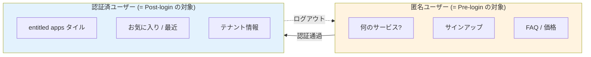
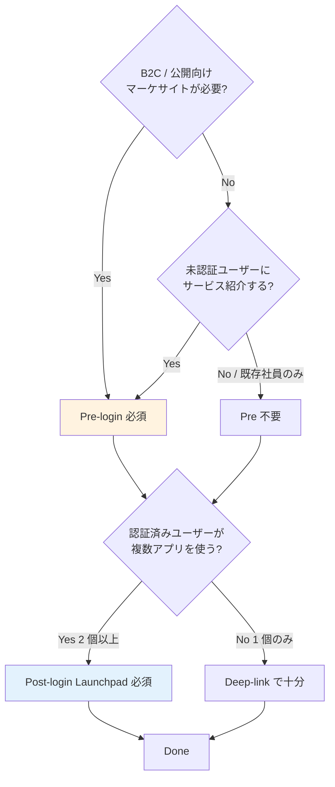
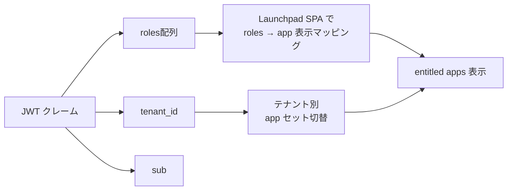
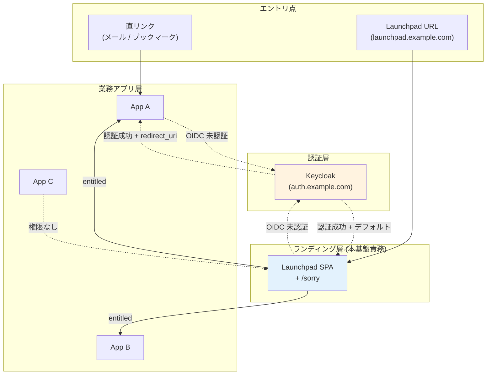

# ADR-021: Post-login Landing UX（Pre/Post 設計判断 + Launchpad + Sorry）

- **ステータス**: Proposed（要件定義フェーズで Accepted に昇格予定）
- **日付**: 2026-06-12
- **関連**:
  - [§FR-4.3 ログイン後のランディング UX](../requirements/proposal/fr/04-sso.md#fr-43-ログイン後のランディング-uxlaunchpad--sorry--deep-link--fr-sso-008)
  - [ADR-022 AWS edge Sorry 制御パターン](022-aws-edge-sorry-control.md)
  - [ADR-018 ユーザー識別子戦略](018-user-identifier-3layer-emailless.md)
  - [project_mixed_login_landing_ux.md](../../.claude/projects/-Users-suepie-Develop-10-project-aws-atuh-poc/memory/project_mixed_login_landing_ux.md)（メモリ）

---

## Context

ユーザーが認証完了後に**どこに着地するか**の UX 設計が未確定。具体的には:
1. ログイン**前**にシステム選択を強制するか（社内ポータル型）
2. ログイン**後**に entitled apps の一覧画面（Launchpad）を出すか（Microsoft 365 portal 型）
3. 権限のないアプリに直リンクされた場合の **Sorry ページ** の扱い

この 3 点はそれぞれ独立した設計軸で、組み合わせ可能。間違った前提（「二択」と思い込む / 「Sorry = 認証エラー」と扱う）で進めると、運用後の UX 改善コストが大きい。

---

## Decision

### 1. Pre / Post は「二択」ではなく「役割の違う 2 軸」

- **Pre = マーケティング / 発見 / サインアップ**（匿名訪問者向け）
- **Post = 生産性 / 権限ベース / 個人化**（認証済ユーザー向け）
- 共存可能。B2B SaaS では両方持つのが標準（Atlassian / Microsoft 型）

### 2. 本基盤のデフォルトスタンス

| 観点 | デフォルト |
|---|---|
| Pre-login | **B-626 ヒアリングで判定**。マーケサイト要否次第で採用 / 不採用 |
| Post-login Launchpad | **採用**（業界標準、複数アプリの効率な起動）|
| Sorry | **採用**（権限なしクリック時の必須挙動、AWS edge で集約 → ADR-022）|
| デフォルト構成 | **② Post + Sorry**（または **③ Pre + Post + Sorry**）|

### 3. Launchpad は **別 SPA 構築**が業界標準

Keycloak Account Console は補助、本格 Launchpad は別 SPA。

---

## A. Pre / Post の 4 組合せパターン

| パターン | Pre-login | Post-login Launchpad | 業界実例 |
|---|:---:|:---:|---|
| ① Pre のみ | ✅ | ❌ | 社内イントラ単体 |
| ② Post のみ | ❌ | ✅ | Okta End-User Dashboard 単独運用 |
| **③ Pre + Post**（**B2B SaaS で多い**）| ✅ | ✅ | Atlassian（`atlassian.com` + `start.atlassian.com`）/ Microsoft（`microsoft.com` + `office.com`）|
| ④ いずれもなし | ❌ | ❌ | Deep-link 専用（メール / ブックマーク主体）|

### 役割別の住み分け



---

## B. Pre vs Post の 20 観点詳細比較

| # | 観点 | Pre-login | Post-login Launchpad |
|---|---|---|---|
| 1 | **誰に何を見せるか** | 匿名訪問者にサービス群を見せる | 認証済ユーザーに entitled apps だけ見せる |
| 2 | **権限ベースのフィルタ** | ❌ 不可（未認証）| ✅ JWT roles / tenant_id でフィルタ |
| 3 | **「使えないシステム」誤選択** | 発生（クリック後 Sorry へ）| 発生しない（最初から非表示）|
| 4 | **マーケティング / 値訴求** | ✅ 主目的 | ❌ 認証済ユーザー対象 |
| 5 | **新規サインアップ導線** | ✅ 自然に組込可 | ❌ 認証済前提 |
| 6 | **公開情報**（FAQ / プライシング）| ✅ 自然 | ❌ 認証越しは不自然 |
| 7 | **個人化**（最近使った / お気に入り）| ❌ 不可 | ✅ ユーザー固有 |
| 8 | **ブランディング** | コーポレートブランド前面 | プロダクトブランド前面 |
| 9 | **既知ユーザーの操作工数** | Pre 経由は 1 クリック増 | Deep-link なら最短 |
| 10 | **エンタープライズ顧客の "自社専用入口" 期待** | 中 | 高 |
| 11 | **テナント別カスタマイズ** | 弱 | 強 |
| 12 | **セキュリティ面の攻撃面** | 公開エンドポイント | 認証越し → 内部情報漏出対策が必要 |
| 13 | **アプリ追加時の更新場所** | Pre ページ（手動）| Launchpad（ロール定義 + 自動表示）|
| 14 | **アプリ削除時の更新場所** | Pre ページの手動更新 | Launchpad は自動 |
| 15 | **多言語対応** | 必須（B2C / 海外顧客向け）| アプリ側に揃える程度 |
| 16 | **B2B エンタープライズのホワイトラベル要望** | 顧客ロゴ程度 | 強い対応可 |
| 17 | **「初めて使うが何ができる?」の発見性** | ✅ 良好 | ❌ 認証後でしかわからない |
| 18 | **オフライン / 障害時のフォールバック** | 静的 HTML で生存可 | 認証基盤依存 |
| 19 | **Cookie / セッション削除後の挙動** | 何も困らない | 再ログイン後 Launchpad へ |
| 20 | **既存システムからの移行容易性** | 既存ポータル流用しやすい | 新規構築が必要 |

## C. 採用判断の決定木



### 顧客像別の推奨パターン

| 顧客像 | 推奨パターン | 理由 |
|---|---|---|
| 社内専用、既存社員のみ、複数アプリ | **② Post のみ** | マーケ不要、entitled apps 提示で十分 |
| B2C / B2B 両方、複数アプリ | **③ Pre + Post** | 業界標準（Atlassian / Microsoft 型）|
| 完全社内、アプリ 1 つだけ | **④ いずれもなし**（Deep-link）| Launchpad もなしで OK |
| マーケサイト中心、アプリは付随 | **① Pre のみ** | 業務アプリが弱いケース |

## D. よくある誤解と落とし穴

| 誤解 | 実際 |
|---|---|
| 「Pre があれば Sorry 不要」| ❌ Sorry は別軸。Pre 経由でも権限ない場合は Sorry 必要 |
| 「Post があれば Pre は不要」| ⚠ 公開向けマーケサイトが必要なら Pre も必要 |
| 「Launchpad = ホームページ」| ❌ Launchpad は entitled apps の起動台、ホームページ（マーケサイト）と役割違い |
| 「Pre-login で entitled apps を見せる」| ❌ 未認証では権限不明、原理的に不可 |
| 「Pre と Launchpad は同じ画面でいい」| ⚠ 認証前後で見せる情報が違うため、画面を分けるのが業界標準 |

---

## E. Post-login Launchpad の設計

### 業界実例

| サービス | Launchpad 形態 |
|---|---|
| **Microsoft 365 portal** | `office.com` ハブ。entitled apps をタイル表示、お気に入り / 検索 / 履歴 |
| **Okta End-User Dashboard** | `*.okta.com/app/UserHome` でアプリタイル、SSO はクリック 1 回 |
| **Atlassian Cloud start** | `start.atlassian.com` で全 Atlassian アプリ + サードパーティ tile |
| **Salesforce App Launcher** | アプリ内（Lightning Experience）で App 切替 |
| **AWS IAM Identity Center** | SSO portal でロール選択 |

→ いずれも**独立した SPA** で構築。Keycloak の Account Console とは別物。

### Launchpad の責務と Keycloak の限界

| 機能 | Keycloak Account Console "Applications" タブ | 独立 Launchpad SPA |
|---|:---:|:---:|
| entitled clients のリスト表示 | ✅ 標準 | ✅ |
| "Always Display in Console" 制御 | ✅ クライアント単位設定 | ✅ |
| **業界標準 UX**（タイル / 検索 / お気に入り / 履歴）| ❌ | ✅ |
| カスタムブランディング | ⚠ Theme 微調整のみ | ✅ 自由設計 |
| **Authz ロールベースの可視性制御** | ⚠ 制限あり | ✅ JWT クレームで完全制御 |
| アプリへの SSO 遷移 | ✅ deep-link 可 | ✅ |
| 管理外アプリのリンク（社内 Wiki / Slack 等）| ❌ | ✅ |
| **本基盤の採用方針** | ⚠ 補助的 | ✅ **業界標準として別 SPA 構築** |

### entitled apps の判定根拠



### 最小構成

```
Common Auth Platform (Keycloak)
   ↓ OIDC
Launchpad SPA (auth.example.com/launchpad)
   ↓ JWT 検証 + roles 解析
[App A tile] [App B tile] [App C tile]
   ↓ deep-link with active session
App A / B / C (各システム)
```

---

## F. Sorry ページの設計

### Sorry は完全に別軸、ただし Pre/Post と連動

| Pre / Post の組合せ | Sorry の自然な振る舞い |
|---|---|
| Post-login Launchpad あり | Sorry → Launchpad にリダイレクト |
| Post なし、Pre のみ | Sorry → Pre ページに戻す（UX 弱い）|
| 両方なし（Deep-link 主体）| Sorry 専用ページが必須 |
| 両方あり | Sorry → Post Launchpad へ |

### 3 つの実装パターン

| パターン | 責務分担 | UX | 採用例 |
|---|---|---|---|
| A. アプリ側 Sorry + Launchpad リンク | アプリ X が 403 → 自前 Sorry ページ → Launchpad リンク | アプリのブランディング維持 | Atlassian Cloud |
| B. 認証基盤の Sorry テーマ | Keycloak の `access_denied` ページを Theme カスタマイズ | 認証基盤側で統一 | 小規模システム |
| **C. 共通 Sorry SPA**（**推奨**）| アプリ X が 403 → `auth.example.com/sorry?app=x` にリダイレクト → 共通 SPA がガイダンス表示 + entitled apps リスト | 業界標準 | LinkedIn / Microsoft 365 |

→ **AWS インフラ層での具体実装は [ADR-022](022-aws-edge-sorry-control.md) を参照**。

### Sorry ページの最低限の情報

| 表示項目 | 理由 |
|---|---|
| **「このアプリにはアクセス権がありません」**（明確なメッセージ）| 認証失敗ではないことを伝える |
| ユーザー自身の情報（名前 / テナント）| 「別人としてログイン中?」の不安解消 |
| **entitled apps の一覧 or Launchpad リンク** | 行き先を提供 |
| アクセス申請の連絡先 | 「使いたい場合は管理者に連絡」|
| ログアウトリンク | 別人としてログインし直す場合 |

### Sorry ページの設計アンチパターン

| アンチパターン | 問題 |
|---|---|
| 「認証エラー」と表示する | 認証は成功している。ユーザーが PW 再入力を試みる無駄が発生 |
| **アプリの存在自体を隠す**（"Not Found" 表示）| 一部の規制業種では透明性要件と矛盾 |
| **詳細な権限内訳を表示**（"あなたは admin ロールが必要だが viewer のみ"）| 内部ロール構造を漏らす攻撃面 |
| ホーム画面に強制リダイレクト（何も表示せず）| 「なぜ?」がわからずユーザーが混乱 |

---

## G. Deep-Link return_to 制御

### 標準 OIDC フローでの return_to

- OIDC `redirect_uri` パラメータがアプリ X の URL
- Keycloak は **Client の登録済 Valid Redirect URIs** と完全一致でない限り拒否
- 認証成功後、`code` を持って `redirect_uri` にリダイレクト

### return_to が機能しないケースと対策

| ケース | 対策 |
|---|---|
| `redirect_uri` が未登録 / 不正 | Keycloak が `Invalid redirect_uri` エラー表示 → Valid Redirect URIs 設定を確認 |
| セッションタイムアウト中の deep-link | 認証フロー後に `redirect_uri` でアプリに戻る（標準動作）|
| Launchpad 経由ログインでアプリに飛ばしたい | Launchpad が App tile クリック時にアプリの URL に redirect（アプリ側 OIDC フローが起動、SSO セッションで即返る）|
| 認証後に Launchpad に必ず着地させたい | `redirect_uri` を Launchpad SPA に固定（業界標準は **アプリ側 redirect_uri 優先**、Launchpad はデフォルト着地点のみ）|

---

## H. 推奨デフォルトアーキテクチャ



---

## Consequences

### Positive

- Pre / Post / Sorry の責務が明確化、運用後の UX 改善コスト低減
- Launchpad は別 SPA で構築 → ロールベース可視性 + 自由ブランディング
- Sorry は edge 集約（ADR-022）で実装、アプリは 403 を返すだけ
- 業界標準（Atlassian / Microsoft / Okta）と整合

### Negative

- Launchpad SPA の別途構築工数（OIDC RP として 1 つの client 追加）
- アプリ追加時に Launchpad の表示ロール / マッピング更新が必要
- Pre-login を採用する場合は **マーケサイト + 認証基盤** の責務分離設計が追加で必要

### プラットフォーム実装の差

| 機能 | Cognito | Keycloak |
|---|:---:|:---:|
| OIDC redirect_uri 検証 | ✅ 標準 | ✅ 標準 |
| Account Console（簡易 Launchpad）| ❌ なし | ✅ あり（補助用途）|
| Custom Sorry テーマ | ⚠ Hosted UI で限定的 | ✅ Theme で完全カスタマイズ |
| クライアント別 default redirect | ✅ App Client 単位 | ✅ Client 単位 |
| Launchpad SPA との統合 | ✅ OIDC RP として実装可 | ✅ 同左 |

→ どちらでも Launchpad SPA を別構築する設計は同等に可能。Keycloak は Account Console を補助的に使える分やや優位。

---

## 参考資料

- [Keycloak Account Console — Applications tab](https://access.redhat.com/documentation/en-us/red_hat_build_of_keycloak/22.0/html/server_administration_guide/account-service)
- [Keycloak issue #23885: Display only accessible clients in Account Console](https://github.com/keycloak/keycloak/issues/23885)
- [Microsoft 365 portal architecture](https://learn.microsoft.com/en-us/microsoft-365/admin/admin-overview/admin-center-overview)
- [Atlassian Cloud start page](https://support.atlassian.com/atlassian-account/docs/launch-products-from-your-start-page/)
- [Salesforce App Launcher](https://help.salesforce.com/s/articleView?id=sf.app_launcher.htm)
