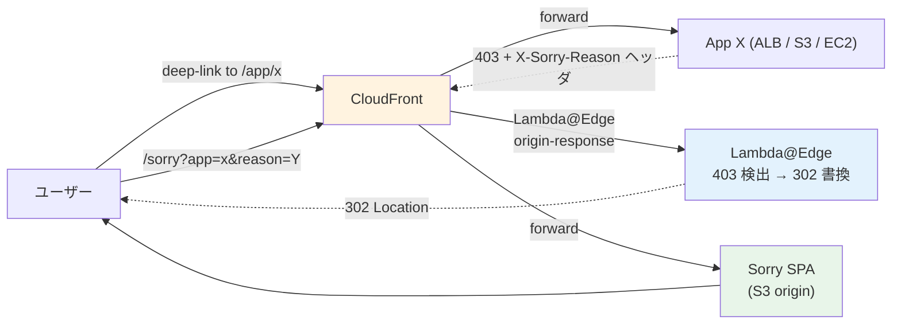

# ADR-022: AWS edge での Sorry 制御パターン（ALB / CloudFront 統合）

- **ステータス**: Proposed（要件定義フェーズで Accepted に昇格予定）
- **日付**: 2026-06-12
- **⚠ 2026-06-23 更新**: **[ADR-039](039-centralized-network-account-edge-layer.md)** で **CloudFront を Network 専用アカウントに集約**することが確定。本 ADR のパターン ii（CloudFront + Lambda@Edge）の **CloudFront / Lambda@Edge は Network Acct に配置**。Lambda@Edge は CloudFront と同一アカウント必須（AWS 仕様）のため、Sorry SPA への redirect 先（`launchpad.example.com/sorry`）も Network Acct CloudFront 経由。本 ADR の Sorry 制御パターン選定（ii Lambda@Edge 推奨）自体は不変、**所有アカウントが変更**。
- **関連**:
  - [ADR-039 中央集約 Network 専用アカウント設計](039-centralized-network-account-edge-layer.md)（**本 ADR の上位方針**）
  - [§FR-4.3.2 Sorry ページ](../requirements/proposal/fr/04-sso.md#fr-432-sorry-ページ権限なしアクセス時--fr-sso-008-2)
  - [ADR-021 Post-login Landing UX](021-post-login-landing-ux.md)
  - [ADR-011 認証基盤前段ネットワーク設計](011-auth-frontend-network-design.md)（CloudFront / WAF 構成）

---

## Context

ADR-021 で Sorry の業界標準実装パターンは「**C. 共通 Sorry SPA**」と確定した。これを AWS インフラ層でどう実装するかが本 ADR の論点。

- 業務アプリが N 個ある場合、**各アプリが 403 → Sorry リダイレクトを個別実装するのは非経済的**
- 403 ハンドリングを **ALB / CloudFront に寄せれば、アプリは単に 403 を返すだけ**で良い
- 認証連動の判定（JWT クレーム検証）も edge でできる
- Sorry SPA は **1 つだけ S3 に置けば全アプリで共有**できる

---

## Decision

**ii. CloudFront + Lambda@Edge（origin-response 403 → 302 redirect）を推奨デフォルト**として採用。アプリは「403 + `X-Sorry-Reason` ヘッダを返すだけ」で良く、Sorry リダイレクトを edge で集約する。

2025 リリースの **v. ALB Native JWT Validation** は適用範囲確定後にオプションとして追加検討。

---

## A. 5 つの AWS 実装パターン

| # | パターン | edge 層 | JWT 検証 | 動的コンテキスト | 工数 | 遅延 | コスト | 推奨度 |
|---|---|---|---|:---:|:---:|:---:|:---:|:---:|
| **i** | **CloudFront Custom Error Response**（静的）| CloudFront | アプリ任せ | ❌ 静的 HTML のみ | ◎ 設定のみ | 0 | ◎ ほぼ 0 | ★★★（アプリ少時）|
| **ii** | **CloudFront + Lambda@Edge（origin-response 403 → 302 redirect）**（**業界標準・推奨**）| CloudFront | アプリ任せ | ✅ クエリ動的化 | △ Lambda 実装 | 〜10ms | ⚠ Lambda@Edge 実行料 | ★★★★★ |
| **iii** | **CloudFront + Lambda@Edge（viewer-request JWT 検証）**（先回り判定）| CloudFront | ✅ edge で実行 | ✅ | ❌ Lambda + KMS 鍵検証 | 〜20ms | ⚠ 全リクエストに乗る | ★★★（高度な要件のみ）|
| **iv** | **ALB authenticate-oidc + 403 ターゲット**（OIDC 認証付き ALB）| ALB | ALB が OIDC 認証、JWT を `x-amzn-oidc-data` ヘッダで target に渡す | △ 限定的 | △ ALB 設定 | 0 | ◎ ALB のみ | ★★★（単一 ALB 構成時）|
| **v** | **ALB Native JWT Validation**（2025 新機能）| ALB | ✅ ALB がネイティブ検証 | △ ヘッダで判定可 | ◎ 設定のみ | 0 | ◎ ALB のみ | ★★★★（最新構成、適用範囲確定後）|

## B. 推奨アーキテクチャ：パターン ii（CloudFront + Lambda@Edge）



### 実装ポイント

```javascript
// Lambda@Edge: origin-response トリガー
exports.handler = async (event) => {
  const response = event.Records[0].cf.response;
  const request = event.Records[0].cf.request;

  if (response.status === '403') {
    const appName = request.uri.match(/^\/app\/([^/]+)/)?.[1] || 'unknown';
    const reason = response.headers['x-sorry-reason']?.[0]?.value || 'not_entitled';

    return {
      status: '302',
      statusDescription: 'Found',
      headers: {
        location: [{
          key: 'Location',
          value: `/sorry?app=${encodeURIComponent(appName)}&reason=${encodeURIComponent(reason)}`,
        }],
      },
    };
  }
  return response;
};
```

## C. パターン v（ALB Native JWT Validation、2025 新機能）の使い所

ALB が OIDC IdP（Keycloak）の JWT を**ネイティブで署名検証**できるようになり、特定の claim 有無で Listener Rule を分岐できる。

- **適合**: 単一 ALB に複数アプリがぶら下がる構成、JWT クレームベース粗粒度ルーティング
- **制限**: 11K byte claim 制約あり（超過時 HTTP 500）、ALB が JWT を含むリクエストを受け取る必要がある（典型: Authorization ヘッダ）
- **本基盤適用**: Identity Broker 配下のアプリが ALB 経由ならパターン v は最少工数で導入可。**ただし業界での適用実績がまだ少ない**ため、パターン ii を主にしてパターン v はオプション位置付け

## D. パターン別比較（推奨判断の整理）

| 観点 | i 静的 | **ii Lambda@Edge** | iii viewer-request | iv ALB OIDC | v ALB JWT |
|---|:---:|:---:|:---:|:---:|:---:|
| **マルチオリジン対応** | ✅ | ✅ | ✅ | ⚠ ALB 配下のみ | ⚠ ALB 配下のみ |
| **アプリ無変更で導入** | ✅ | ⚠ 403 + ヘッダ返却が必要 | ✅ | ✅ | ⚠ JWT 送信が必要 |
| **動的コンテキスト**（app 名 / 理由）| ❌ | ✅ | ✅ | ⚠ 限定的 | ⚠ 限定的 |
| **JWT 検証を edge で完結** | ❌ | ❌ | ✅ | ✅ | ✅ |
| **遅延ペナルティ** | 0 | 〜10ms（403 時のみ）| 〜20ms（全リクエスト）| 0 | 0 |
| **ブランディング細かな反映** | ⚠ 静的 HTML | ✅ Sorry SPA で自由 | ✅ | ⚠ ALB は HTML 表示弱い | ⚠ 同左 |
| **Sorry SPA との統合**（ADR-021 連動）| ⚠ 別 SPA で運用は弱い | ✅ クエリ受渡で完全統合 | ✅ | ⚠ 受渡が手間 | ⚠ 同左 |
| **運用変更頻度** | 低（静的）| 中（Lambda 改修）| 高（JWT ロジック改修）| 中 | 中 |
| **コスト**（月間 1M リクエスト想定）| 〜数 USD | 〜20 USD | 〜100 USD（全リクエスト）| ALB のみ | ALB のみ |
| **障害時の挙動** | CloudFront 健全なら継続 | Lambda@Edge 障害で 5xx 露出 | 同左、影響範囲広い | ALB 障害でアプリ全停止 | 同左 |

## E. 顧客状況別の推奨

| 顧客状況 | 推奨パターン | 理由 |
|---|---|---|
| **業務アプリ 3 個以上、CloudFront 前段あり**（本基盤の標準想定）| **ii Lambda@Edge** | 動的コンテキスト + Sorry SPA 統合 + アプリ無変更（403 ヘッダ返却のみ）|
| アプリ 1 個のみ、簡素な要件 | **i Custom Error Response** | コストゼロ、運用最小 |
| 全アプリが ALB 配下、JWT 認証統一 | **v ALB Native JWT Validation** | 最少工数、edge 完結 |
| 多層認証 + 高度なクレーム判定 | **ii + iii の組合せ** | 認証は viewer-request、Sorry は origin-response |

---

## Consequences

### Positive

- アプリは「403 + `X-Sorry-Reason` ヘッダ返却」のみで Sorry 対応完了
- Sorry SPA は 1 つだけ S3 に置けば全アプリで共有
- 動的コンテキスト（app 名 / 理由）を URL クエリで渡せる
- 2025 新機能（ALB Native JWT Validation）への将来移行パスを確保

### Negative

- Lambda@Edge の実行コスト（月間 1M リクエスト想定で 〜20 USD）
- Lambda@Edge 障害時の影響範囲（403 時のみ発火するため通常時は影響なし）
- Lambda@Edge デプロイの伝播時間（5-15 分）

### 我々のスタンス

| 基本方針の柱 | AWS edge Sorry 制御での実現 |
|---|---|
| **絶対安全** | edge での JWT 署名検証（v）、Sorry での内部情報非露出 |
| **どんなアプリでも** | アプリは「403 + ヘッダ返却」だけで OK、Sorry 集約 |
| **効率よく認証** | edge 集約で個別アプリ実装不要、変更は 1 箇所 |
| **運用負荷・コスト最小** | パターン ii は Lambda@Edge 1 本 + Sorry SPA 1 つ + S3 で完結 |

---

## 参考資料

- [AWS Blog: Customize 403 error pages from CloudFront Origin with Lambda@Edge](https://aws.amazon.com/blogs/networking-and-content-delivery/customize-403-error-pages-from-amazon-cloudfront-origin-with-lambdaedge/)
- [AWS Blog: Generating dynamic error responses in CloudFront with Lambda@Edge](https://aws.amazon.com/blogs/networking-and-content-delivery/generating-dynamic-error-responses-in-amazon-cloudfront-with-lambdaedge/)
- [AWS Docs: Authenticate users using an Application Load Balancer](https://docs.aws.amazon.com/elasticloadbalancing/latest/application/listener-authenticate-users.html) — `authenticate-oidc` で Keycloak 連携可
- [AWS Docs: Verify JWTs using an Application Load Balancer](https://docs.aws.amazon.com/elasticloadbalancing/latest/application/listener-verify-jwt.html) — 2025 新機能 ALB Native JWT Validation
- [AWS Blog: Security best practices when using ALB authentication](https://aws.amazon.com/blogs/networking-and-content-delivery/security-best-practices-when-using-alb-authentication/) — `x-amzn-oidc-data` ヘッダ署名検証要件
