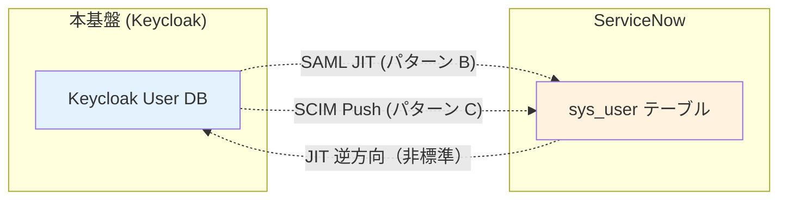
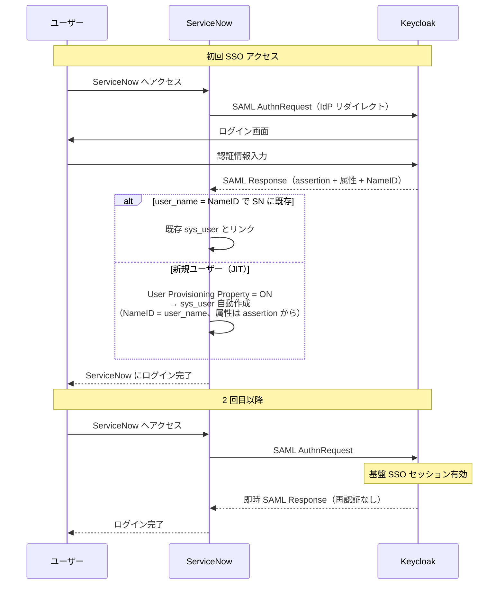
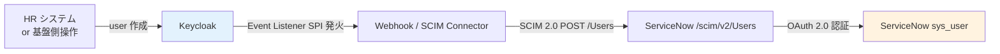
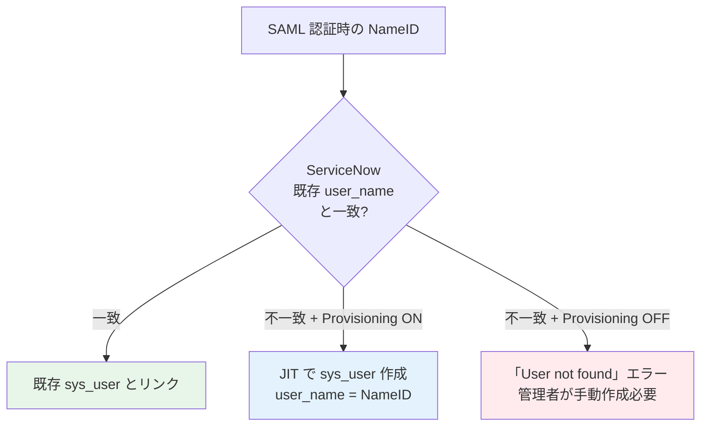
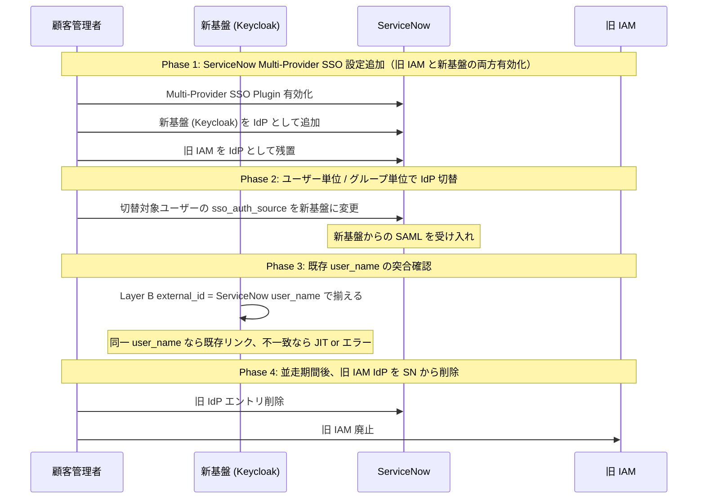

# ADR-023: ServiceNow SP 連携設計（SSO + プロビジョニング方向の選択）

- **ステータス**: Proposed（要件定義フェーズで Accepted に昇格予定）
- **日付**: 2026-06-15
- **関連**:
  - [§FR-2.4 外部 SP（SaaS）連携 — ServiceNow ケース](../requirements/proposal/fr/02-federation.md#fr-24-外部-spsaas連携--servicenow-ケース)
  - [§FR-7.4.10 発信プロビジョニング（基盤 → ServiceNow 等）](../requirements/proposal/fr/07-user.md#fr-7410-発信プロビジョニング基盤--servicenow-等)
  - [ADR-018 ユーザー識別子 3 階層戦略](018-user-identifier-3layer-emailless.md)
  - [ADR-019 既存システム移行戦略](019-existing-system-migration.md)
  - [B-IDM-8 ServiceNow user_name との関係](../requirements/hearing-checklist.md)
  - 関連 Claude 内部メモリ: `project_servicenow_sp_integration.md`

---

## Context

打ち合わせインプット 3 点目:

> 「現行のシステムでは ServiceNow などとの連携があり、ServiceNow のユーザは ServiceNow で管理されている。これも今回 SSO 対象としたい」

ServiceNow は次の特性を持つため、本基盤との連携設計には**複数の独立した論点**が絡む:

| 特性 | 含意 |
|---|---|
| ServiceNow 自身が**ユーザー DB を持つ**（`sys_user` テーブル）| ID マスタをどこに置くか論点になる |
| ServiceNow が **SP**（SAML / OIDC RP）として動作する | 本基盤が IdP として連携可能 |
| ServiceNow に **SCIM v2 plugin** がある（公式）| 基盤からの自動プロビが理論的には可能 |
| **2025-11 KB2599716**：Microsoft Entra 経由の SCIM プロビが現在非サポート | Keycloak からの SCIM プロビは実装可能だが**公式ベンダー保証外**、SOAP 経由が ServiceNow 推奨 |
| 業界の主要連携実績は **SAML 2.0 SSO + JIT**（Multi-Provider SSO Plugin）| 軽量・安定の標準パターンが確立済 |

設計判断軸:

1. **SSO 方向（認証）** — 本基盤が IdP、ServiceNow が SP（これは確定）
2. **Provisioning 方向（ユーザー作成）** — 基盤→SN / SN→基盤 / 双方向 / なし（JIT）の選択
3. **ユーザーマスタの所在** — ServiceNow 残し / 新基盤集約 / ハイブリッド の選択

---

## Decision

### 推奨デフォルト：**パターン B（SSO + SAML JIT Provisioning）**

| 項目 | 採用方針 |
|---|---|
| **SSO プロトコル** | **SAML 2.0**（Multi-Provider SSO Plugin、業界標準）。OIDC は Tokyo+ で対応するが事例少、新規案件のみオプション |
| **Provisioning** | **SAML JIT Provisioning**（ServiceNow が初回 SSO 時にユーザー自動作成）。SCIM Push（基盤→ServiceNow）は**第二オプション** |
| **ユーザーマスタ** | **ServiceNow に残す**（業務システム側がユーザーマスタを持つのが業界標準。本基盤は認証マスタ）|
| **既存 ServiceNow ユーザー** | `user_name` を Layer B `external_id` として本基盤にマッピング、ADR-018 と整合 |
| **属性連携** | SAML Assertion 経由（roles / department / manager 等）|
| **退職フロー** | 本基盤側で無効化 → SSO 不可、ServiceNow 側のレコード削除は ServiceNow 運用に委ねる（or 別途 SCIM Push 検討）|

→ 大規模 / 運用統合度を求める顧客のみ **パターン C（SSO + SCIM Push）** をオプション提示。

---

## A. ServiceNow の SSO / プロビジョニング機能整理

### SSO 受信機能（SP として）

| 機能 | 詳細 | 適合プロトコル |
|---|---|---|
| **Multi-Provider SSO Plugin** (`com.snc.integration.sso.multi`) | 複数 IdP 並列接続可、SAML / OIDC 両対応 | SAML 2.0（業界標準）/ OIDC（Tokyo+）|
| SAML 2.0 Single | 1 IdP 専用、レガシー設定 | SAML 2.0 |
| **本基盤推奨** | Multi-Provider SSO + SAML 2.0 | — |

### プロビジョニング受信機能（外部から ServiceNow へ User 作成）

| 機能 | 詳細 | 制約 |
|---|---|---|
| **SAML JIT Provisioning** | 初回 SSO 時に `User Provisioning` プロパティが ON なら自動作成 | 業界標準、最軽量 |
| **SCIM v2 Plugin** (`com.snc.integration.scim2`) | `/scim/v2/Users` `/scim/v2/Groups` エンドポイント | OAuth 2.0 / Basic Auth で保護、**Microsoft Entra 経由は KB2599716 で非サポート（2025-11）** |
| **SOAP-based**（Microsoft Gallery Connector 推奨）| ServiceNow Web Services 経由 | ServiceNow 推奨だが、Keycloak からの直接連携は事例少 |
| REST API 直接 | カスタム実装 | Keycloak Event Listener SPI で実装可、保守負荷 |

### Provisioning 方向の整理

---

## B. 4 パターン詳細比較

| パターン | 認証 | プロビ | UserDB | 工数 | 既存 SN ユーザー扱い | 推奨度 |
|---|---|---|---|:---:|---|:---:|
| **A. SSO のみ（既存ユーザー前提）** | 基盤 → SN SAML | なし、ServiceNow が手動 / Outbound | ServiceNow | ◎ 最少 | そのまま、新規は管理者作成 | ★★★（既存利用継続のみ）|
| **B. SSO + SAML JIT**（**推奨**）| 基盤 → SN SAML | SAML JIT で SN が自動作成 | ServiceNow | ◎ ServiceNow 設定のみ | 既存 user_name で突合、新規は JIT 作成 | **★★★★★** |
| **C. SSO + SCIM Push** | 基盤 → SN SAML/OIDC | 基盤が SCIM Push（or Webhook 経由）| ServiceNow | ❌ 〜2 週間（保守含む）| 基盤側で初期 import 後 SCIM 同期 | ★★★（大規模・運用統合志向のみ）|
| **D. 双方向同期** | 基盤 → SN | SCIM 双方向 | 両方（複雑）| ❌❌ 1 ヶ月超 | 双方向整合性ルール定義必要 | ★（推奨しない、業界事例少）|

### B 案（推奨）の構成

### C 案（SCIM Push）の構成

#### C 案を採る場合の重要な制約

- ServiceNow SCIM v2 plugin の有効化が必要（公式機能）
- **Microsoft Entra 公式統合は非サポート（KB2599716、2025-11）** → Keycloak からの直接連携は事例少、SI ベンダー保証外の自前実装
- OAuth 2.0 設定（ServiceNow OAuth Application Registry）が前提
- 属性マッピングを基盤側 / ServiceNow 側で二重管理
- 認可・ロール同期は別途設計
- 障害時のリトライ・整合性確保が必要

---

## C. ユーザー識別子の扱い（ADR-018 連動）

| Layer | 値の例 | ServiceNow での位置 | 本基盤での位置 |
|---|---|---|---|
| **A** `sub`（UUID）| `a1b2c3d4-...` | `sys_user.sys_id` ではなく `external_id` 拡張属性として保持 | JWT `sub`、不変 |
| **B** `external_id` | `ACME-EMP-0042` | **`sys_user.user_name`**（一意キー）| `preferred_username` / カスタム属性 |
| **C** `identities[].userId` | Keycloak の sub | — | フェデ突合 |

→ **ServiceNow の `user_name` = 本基盤の Layer B `external_id`** として扱う。SAML NameID にも `user_name` を載せる。

### 既存 ServiceNow ユーザーの突合

---

## D. 退職フロー（Deprovisioning）

| パターン | 退職時の動き | 業界実例 |
|---|---|---|
| **基本（推奨）** | 本基盤で `enabled=false` → SAML 認証拒否 → SN にログイン不能。SN の `sys_user.active=true` のまま | Salesforce / Workday と同じ |
| **完全削除志向** | 本基盤で無効化 + SCIM DELETE で ServiceNow も `active=false` 更新 | C 案採用時のみ |
| **アプリ側オーナーシップ** | ServiceNow 管理者が手動で `active=false`、本基盤は触らない | A 案採用時 |

→ **基本パターンが業界標準**。「ServiceNow のレコードを残すことで監査・履歴・チケット履歴が壊れない」というメリットあり。

---

## E. 本基盤導入時の段階移行（ADR-019 連動）

ADR-019 の並走移行戦略の中で、ServiceNow 連携の具体的な切替手順:

---

## F. Keycloak での実装パス

### SSO 部分

| 設定項目 | Keycloak 側 | ServiceNow 側 |
|---|---|---|
| Client 種別 | SAML Client、`saml.assertion.signature=true` | Multi-Provider SSO Identity Provider |
| メタデータ交換 | SP メタデータを ServiceNow から取得、Keycloak に登録 | IdP メタデータ XML を Keycloak から取得、ServiceNow にインポート |
| NameID Format | `persistent` 推奨、または `unspecified` で `user_name` 明示マッピング | 同左 |
| 属性マッピング | Protocol Mapper で `user_name` / `email` / `roles` 等を送出 | User table の属性として受信 |
| 署名 | RSA-SHA256、証明書ローテーション設定 | 公開鍵を IdP 設定に登録 |

### JIT Provisioning 部分（B 案）

ServiceNow 側で **System Properties > User Provisioning Enabled = Yes** に設定するだけ。NameID と属性マッピングで自動作成される。

### SCIM Push 部分（C 案）

| 実装方式 | 内容 | 工数 |
|---|---|---|
| **Keycloak Event Listener SPI + SCIM Client** | User CRUD イベントを受信し、SCIM 2.0 で ServiceNow に POST/PUT/DELETE | ❌ 1-2 週間 |
| **Phase Two `keycloak-events` Webhook + Lambda** | Webhook → Lambda → ServiceNow SCIM API | ⚠ 中（Lambda 保守）|
| **公式 ServiceNow Connector**（存在せず）| — | — |
| **Identity Bridge ツール**（Stitchflow / Hire2Retire 等）| 商用ツール経由 | ✅ ツール採用 |

---

## Consequences

### Positive

- **業界標準パターン（B 案 SAML JIT）で 90% カバー**できる、最少工数
- ServiceNow ユーザーマスタを保持 → 既存業務データ・チケット履歴を壊さない
- ADR-018 識別子戦略（Layer B `external_id` = `user_name`）と完全整合
- 移行は ADR-019 並走方式と統合可能（Multi-Provider SSO で並走期対応）

### Negative

- C 案（SCIM Push）採用時は ServiceNow KB2599716 リスクを承知の上で自前実装が必要
- 退職時の ServiceNow 側レコード論理削除を別途運用設計が必要（B 案）
- OIDC ベースの連携は事例が少なく、SAML 推奨

### Constraints

- ServiceNow の **Multi-Provider SSO Plugin が前提**（顧客テナントで有効化必要）
- SCIM 採用時は **Enterprise Plan + SCIM v2 Plugin** 必須
- Microsoft Entra 連携を別途使う顧客がいる場合、Entra → SN の SCIM 設計とは分離して扱う

---

## 参考資料

- **ServiceNow 公式**:
  - [ServiceNow Community: SAML Setup — Multi-Provider SSO vs SAML 2 Single](https://www.servicenow.com/community/sysadmin-forum/saml-setup-in-servicenow-multi-provider-sso-vs-saml-2-single/m-p/3178936)
  - [ServiceNow Knowledge Base KB2599716](https://support.servicenow.com/kb)（2025-11、SCIM via Entra ID 非サポート）
  - [ServiceNow Community: SCIM Provisioning from Microsoft Entra ID](https://www.servicenow.com/community/developer-blog/scim-provisioning-from-microsoft-entra-id/ba-p/2984734)
- **Keycloak × ServiceNow**:
  - [SkyCloak: SSO Implementation Guide — SAML and OIDC with Keycloak](https://skycloak.io/blog/sso-implementation-guide-developers/)
- **業界 IdP の ServiceNow SAML 設定**:
  - [Okta: Configure SAML 2.0 for ServiceNow](https://saml-doc.okta.com/SAML_Docs/How-to-Configure-SAML-2.0-for-ServiceNow.html)
  - [miniOrange: Configure SSO for ServiceNow](https://www.miniorange.com/servicenow-single-sign-on-(sso))
- **SCIM 制約 / 代替**:
  - [Stitchflow: ServiceNow SCIM Provisioning — Pricing & Limitations](https://www.stitchflow.com/scim/servicenow)
  - [ServiceNow Community: SCIM vs Microsoft Gallery (SOAP)](https://www.servicenow.com/community/itsm-forum/scim-vs-microsoft-gallery-soap-recommended-approach-for-entra-id/m-p/3488369)
