# ADR-023: ServiceNow SP 連携設計（SSO + プロビジョニング方向の選択）

- **ステータス**: Proposed（要件定義フェーズで Accepted に昇格予定）
- **日付**: 2026-06-15
- **関連**:
  - [§FR-2.4 外部 SP（SaaS）連携 — ServiceNow ケース](../requirements/proposal/fr/02-federation.md#fr-24-外部-spsaas連携--servicenow-ケース)
  - [§FR-7.4.10 発信プロビジョニング（基盤 → ServiceNow 等）](../requirements/proposal/fr/07-user.md#fr-7410-発信プロビジョニング基盤--servicenow-等)
  - [ADR-018 ユーザー識別子 3 階層戦略](018-user-identifier-3layer-emailless.md)
  - [ADR-019 既存システム移行戦略](019-existing-system-migration.md)
  - [B-IDM-8 ServiceNow user_name との関係](../requirements/hearing-checklist.md)
  - 関連 Claude 内部メモリ: `project_servicenow_sp_integration.md`

---

## Context

打ち合わせインプット 3 点目:

> 「現行のシステムでは ServiceNow などとの連携があり、ServiceNow のユーザは ServiceNow で管理されている。これも今回 SSO 対象としたい」

ServiceNow は次の特性を持つため、本基盤との連携設計には**複数の独立した論点**が絡む:

| 特性 | 含意 |
|---|---|
| ServiceNow 自身が**ユーザー DB を持つ**（`sys_user` テーブル）| ID マスタをどこに置くか論点になる |
| ServiceNow が **SP**（SAML / OIDC RP）として動作する | 本基盤が IdP として連携可能 |
| ServiceNow に **SCIM v2 plugin** がある（公式）| 基盤からの自動プロビが理論的には可能 |
| **2025-11 KB2599716**：Microsoft Entra 経由の SCIM プロビが現在非サポート | Keycloak からの SCIM プロビは実装可能だが**公式ベンダー保証外**、SOAP 経由が ServiceNow 推奨 |
| 業界の主要連携実績は **SAML 2.0 SSO + JIT**（Multi-Provider SSO Plugin）| 軽量・安定の標準パターンが確立済 |

設計判断軸:

1. **SSO 方向（認証）** — 本基盤が IdP、ServiceNow が SP（これは確定）
2. **Provisioning 方向（ユーザー作成）** — 基盤→SN / SN→基盤 / 双方向 / なし（JIT）の選択
3. **ユーザーマスタの所在** — ServiceNow 残し / 新基盤集約 / ハイブリッド の選択

---

## Decision

### 推奨デフォルト：**パターン B（SSO + SAML JIT Provisioning）**

| 項目 | 採用方針 |
|---|---|
| **SSO プロトコル** | **SAML 2.0**（Multi-Provider SSO Plugin、業界標準）。OIDC は Tokyo+ で対応するが事例少、新規案件のみオプション |
| **Provisioning** | **SAML JIT Provisioning**（ServiceNow が初回 SSO 時にユーザー自動作成）。SCIM Push（基盤→ServiceNow）は**第二オプション** |
| **ユーザーマスタ** | **ServiceNow に残す**（業務システム側がユーザーマスタを持つのが業界標準。本基盤は認証マスタ）|
| **既存 ServiceNow ユーザー** | `user_name` を Layer B `external_id` として本基盤にマッピング、ADR-018 と整合 |
| **属性連携** | SAML Assertion 経由（roles / department / manager 等）|
| **退職フロー** | 本基盤側で無効化 → SSO 不可、ServiceNow 側のレコード削除は ServiceNow 運用に委ねる（or 別途 SCIM Push 検討）|

→ 大規模 / 運用統合度を求める顧客のみ **パターン C（SSO + SCIM Push）** をオプション提示。

---

## A. ServiceNow の SSO / プロビジョニング機能整理

### SSO 受信機能（SP として）

| 機能 | 詳細 | 適合プロトコル |
|---|---|---|
| **Multi-Provider SSO Plugin** (`com.snc.integration.sso.multi`) | 複数 IdP 並列接続可、SAML / OIDC 両対応 | SAML 2.0（業界標準）/ OIDC（Tokyo+）|
| SAML 2.0 Single | 1 IdP 専用、レガシー設定 | SAML 2.0 |
| **本基盤推奨** | Multi-Provider SSO + SAML 2.0 | — |

### プロビジョニング受信機能（外部から ServiceNow へ User 作成）

| 機能 | 詳細 | 制約 |
|---|---|---|
| **SAML JIT Provisioning** | 初回 SSO 時に `User Provisioning` プロパティが ON なら自動作成 | 業界標準、最軽量 |
| **SCIM v2 Plugin** (`com.snc.integration.scim2`) | `/scim/v2/Users` `/scim/v2/Groups` エンドポイント | OAuth 2.0 / Basic Auth で保護、**Microsoft Entra 経由は KB2599716 で非サポート（2025-11）** |
| **SOAP-based**（Microsoft Gallery Connector 推奨）| ServiceNow Web Services 経由 | ServiceNow 推奨だが、Keycloak からの直接連携は事例少 |
| REST API 直接 | カスタム実装 | Keycloak Event Listener SPI で実装可、保守負荷 |

### Provisioning 方向の整理

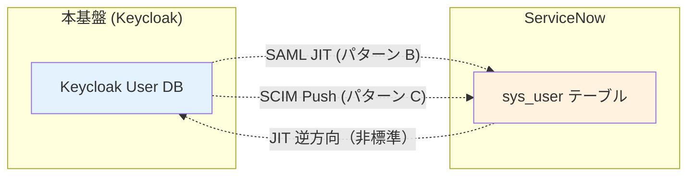

---

## B. 4 パターン詳細比較

| パターン | 認証 | プロビ | UserDB | 工数 | 既存 SN ユーザー扱い | 推奨度 |
|---|---|---|---|:---:|---|:---:|
| **A. SSO のみ（既存ユーザー前提）** | 基盤 → SN SAML | なし、ServiceNow が手動 / Outbound | ServiceNow | ◎ 最少 | そのまま、新規は管理者作成 | ★★★（既存利用継続のみ）|
| **B. SSO + SAML JIT**（**推奨**）| 基盤 → SN SAML | SAML JIT で SN が自動作成 | ServiceNow | ◎ ServiceNow 設定のみ | 既存 user_name で突合、新規は JIT 作成 | **★★★★★** |
| **C. SSO + SCIM Push** | 基盤 → SN SAML/OIDC | 基盤が SCIM Push（or Webhook 経由）| ServiceNow | ❌ 〜2 週間（保守含む）| 基盤側で初期 import 後 SCIM 同期 | ★★★（大規模・運用統合志向のみ）|
| **D. 双方向同期** | 基盤 → SN | SCIM 双方向 | 両方（複雑）| ❌❌ 1 ヶ月超 | 双方向整合性ルール定義必要 | ★（推奨しない、業界事例少）|

### B 案（推奨）の構成

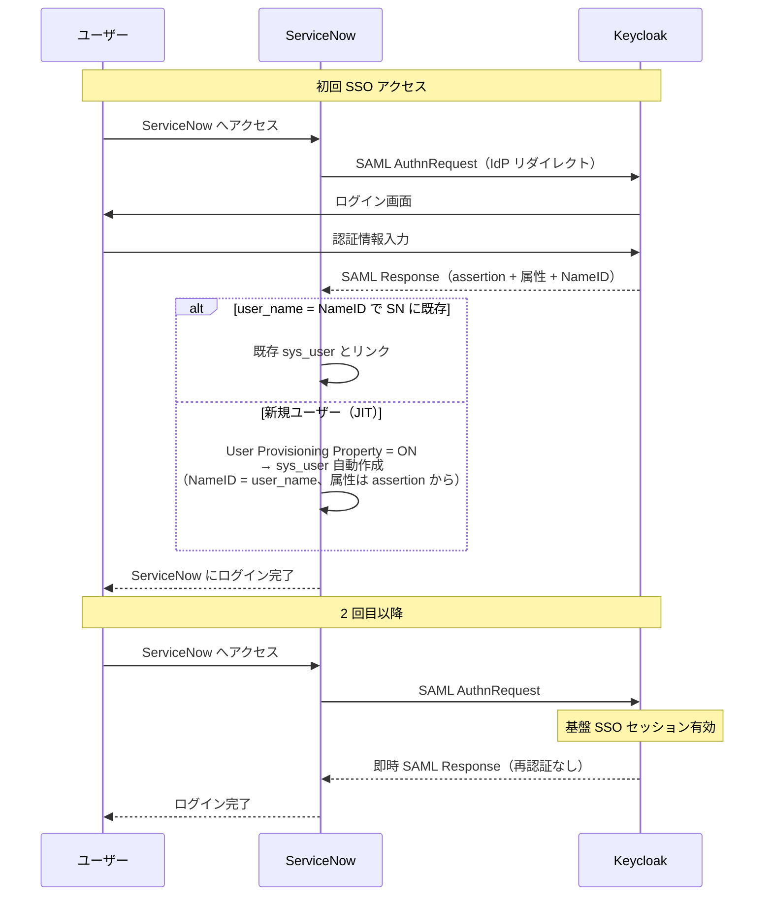

### C 案（SCIM Push）の構成

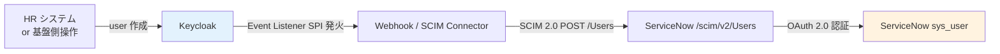

#### C 案を採る場合の重要な制約

- ServiceNow SCIM v2 plugin の有効化が必要（公式機能）
- **Microsoft Entra 公式統合は非サポート（KB2599716、2025-11）** → Keycloak からの直接連携は事例少、SI ベンダー保証外の自前実装
- OAuth 2.0 設定（ServiceNow OAuth Application Registry）が前提
- 属性マッピングを基盤側 / ServiceNow 側で二重管理
- 認可・ロール同期は別途設計
- 障害時のリトライ・整合性確保が必要

---

## C. ユーザー識別子の扱い（ADR-018 連動）

| Layer | 値の例 | ServiceNow での位置 | 本基盤での位置 |
|---|---|---|---|
| **A** `sub`（UUID）| `a1b2c3d4-...` | `sys_user.sys_id` ではなく `external_id` 拡張属性として保持 | JWT `sub`、不変 |
| **B** `external_id` | `ACME-EMP-0042` | **`sys_user.user_name`**（一意キー）| `preferred_username` / カスタム属性 |
| **C** `identities[].userId` | Keycloak の sub | — | フェデ突合 |

→ **ServiceNow の `user_name` = 本基盤の Layer B `external_id`** として扱う。SAML NameID にも `user_name` を載せる。

### 既存 ServiceNow ユーザーの突合

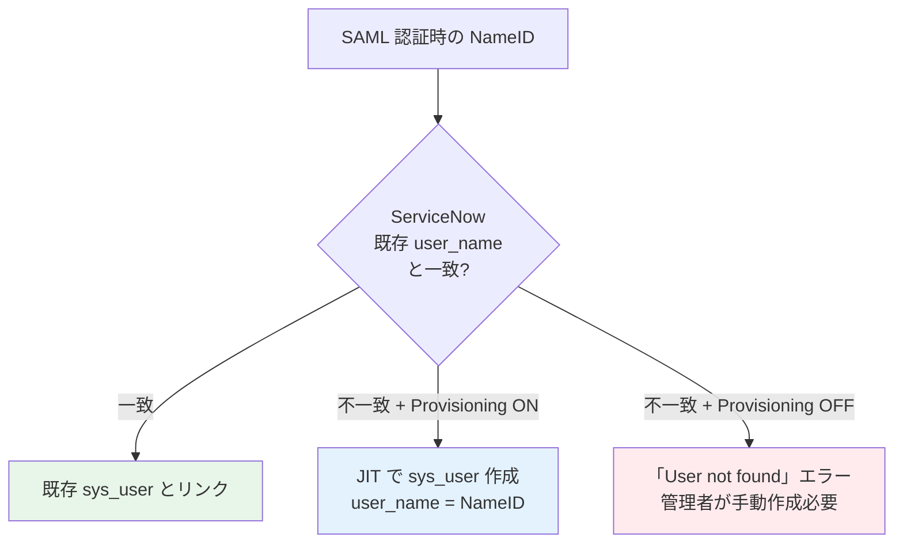

---

## D. 退職フロー（Deprovisioning）

| パターン | 退職時の動き | 業界実例 |
|---|---|---|
| **基本（推奨）** | 本基盤で `enabled=false` → SAML 認証拒否 → SN にログイン不能。SN の `sys_user.active=true` のまま | Salesforce / Workday と同じ |
| **完全削除志向** | 本基盤で無効化 + SCIM DELETE で ServiceNow も `active=false` 更新 | C 案採用時のみ |
| **アプリ側オーナーシップ** | ServiceNow 管理者が手動で `active=false`、本基盤は触らない | A 案採用時 |

→ **基本パターンが業界標準**。「ServiceNow のレコードを残すことで監査・履歴・チケット履歴が壊れない」というメリットあり。

---

## E. 本基盤導入時の段階移行（ADR-019 連動）

ADR-019 の並走移行戦略の中で、ServiceNow 連携の具体的な切替手順:

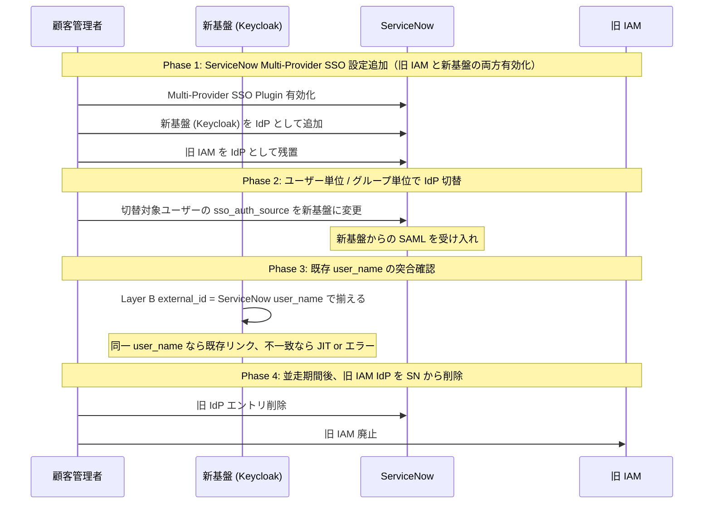

---

## F. Keycloak での実装パス

### SSO 部分

| 設定項目 | Keycloak 側 | ServiceNow 側 |
|---|---|---|
| Client 種別 | SAML Client、`saml.assertion.signature=true` | Multi-Provider SSO Identity Provider |
| メタデータ交換 | SP メタデータを ServiceNow から取得、Keycloak に登録 | IdP メタデータ XML を Keycloak から取得、ServiceNow にインポート |
| NameID Format | `persistent` 推奨、または `unspecified` で `user_name` 明示マッピング | 同左 |
| 属性マッピング | Protocol Mapper で `user_name` / `email` / `roles` 等を送出 | User table の属性として受信 |
| 署名 | RSA-SHA256、証明書ローテーション設定 | 公開鍵を IdP 設定に登録 |

### JIT Provisioning 部分（B 案）

ServiceNow 側で **System Properties > User Provisioning Enabled = Yes** に設定するだけ。NameID と属性マッピングで自動作成される。

### SCIM Push 部分（C 案）

| 実装方式 | 内容 | 工数 |
|---|---|---|
| **Keycloak Event Listener SPI + SCIM Client** | User CRUD イベントを受信し、SCIM 2.0 で ServiceNow に POST/PUT/DELETE | ❌ 1-2 週間 |
| **Phase Two `keycloak-events` Webhook + Lambda** | Webhook → Lambda → ServiceNow SCIM API | ⚠ 中（Lambda 保守）|
| **公式 ServiceNow Connector**（存在せず）| — | — |
| **Identity Bridge ツール**（Stitchflow / Hire2Retire 等）| 商用ツール経由 | ✅ ツール採用 |

### ServiceNow 側の設定責務分担と必要権限

> **論点**: SAML SSO を成立させるには **Keycloak 側だけでなく ServiceNow 側にも設定が必須**。顧客の ServiceNow 担当者にどこまで依頼可能か、提供すべき情報、想定ハードルを整理する。

#### ServiceNow 側で必要な設定 8 項目

| # | 設定 | 場所 / 内容 |
|---|---|---|
| 1 | **Multi-Provider SSO Plugin 有効化** | プラグイン名: `com.snc.integration.sso.multi`（現代のインスタンスでは通常デフォルト有効）|
| 2 | **Identity Provider 登録** | `Multi-Provider SSO > Identity Providers` → New → SAML を選択 |
| 3 | **IdP メタデータインポート** | Keycloak の SAML Descriptor XML をアップロード or URL 指定。ほぼ全項目が**自動入力** |
| 4 | **NameID Format 設定** | `Email` or `Unspecified` を選択、Keycloak 側と合致させる |
| 5 | **属性マッピング** | SAML 属性 → `sys_user` フィールドの対応（user_name / email / first_name / last_name 等）|
| 6 | **Auto Provisioning 設定**（JIT 採用時）| System Properties で `User Provisioning Enabled = Yes`、関連プロパティ 4-5 個 |
| 7 | **Active 化 + Default 設定** | IdP entry を `Active` にし、必要なら全ユーザーで SSO 強制 |
| 8 | **テスト** | テストユーザーで SP-initiated / IdP-initiated 両方検証 |

#### 顧客 ServiceNow 担当者への依頼可否：✅ **標準業務として可能**

| 観点 | 判定 |
|---|---|
| **必要権限** | `admin` role（ServiceNow 標準管理者ロール）。`security_admin` も推奨 |
| **業界での頻度** | ServiceNow 管理者は **Okta / Azure AD と SAML SSO 連携した経験が大半**（過去 10 年の業界標準作業）|
| **所要工数** | 初回設定 1-2 時間、テスト 1-2 日 |
| **公式ドキュメント** | ServiceNow Now Learning / Product Documentation に SAML SSO 設定手順あり |
| **第三者ドキュメント** | [Okta](https://saml-doc.okta.com/SAML_Docs/How-to-Configure-SAML-2.0-for-ServiceNow.html) / [miniOrange](https://www.miniorange.com/servicenow-single-sign-on-(sso)) / その他多数 |

→ **「Keycloak と SSO 連携してください」とお願いすれば、Okta / Azure 連携と同じ作業として理解されます**。ServiceNow 側からは Keycloak は "Generic SAML 2.0 IdP" と見えるだけで、特殊対応は不要。

#### 弊社 → 顧客に提供する 6 項目（設定依頼セット）

ServiceNow 担当者に設定を依頼するときに、**こちらから提供する情報**:

| # | 提供物 | 例 |
|---|---|---|
| 1 | **Keycloak IdP メタデータ XML**（URL or ファイル）| `https://auth.example.com/realms/main/protocol/saml/descriptor` |
| 2 | **SP Entity ID**（Keycloak に登録する ServiceNow の識別子）| `https://acme.service-now.com` |
| 3 | **Assertion Consumer Service (ACS) URL**（SAML Response 受信先）| `https://acme.service-now.com/navpage.do` |
| 4 | **属性マッピング仕様** | `userName` → `user_name`、`email` → `email`、`firstName` → `first_name` 等 |
| 5 | **NameID Format** | `urn:oasis:names:tc:SAML:1.1:nameid-format:emailAddress` or `unspecified`（顧客の `user_name` 仕様に合わせる）|
| 6 | **テストユーザー作成依頼** | 検証用に 1-2 名 |

#### 想定される潜在的ハードル

| 障害候補 | 対処 |
|---|---|
| **ServiceNow Edition 制限** | Multi-Provider SSO は全 Edition 利用可、SCIM v2 は Enterprise 以上 |
| **Plugin 未有効化** | 顧客が ServiceNow HI Portal でアクティベーション申請（通常即時〜数日）|
| **顧客社内の Change Management** | 規制業種では Change Request が必要、リードタイム 1-2 週間追加 |
| **既存 SAML 接続との競合** | Multi-Provider SSO なら **複数 IdP 並列接続可**（旧 IdP 残置で並走可能）|
| **NameID Format の不一致** | 設定段階で確認、`Email` / `Unspecified` どちらを使うか事前合意 |
| **ServiceNow 管理者の経験不足** | SAML 経験のない管理者の場合、ServiceNow Partner / Now Support の利用が必要 |

#### 責務分担サマリ（弊社 vs 顧客 ServiceNow 担当者）

| 作業項目 | 弊社（基盤側）| 顧客（ServiceNow 担当）|
|---|:---:|:---:|
| Keycloak SAML Client 登録 | ✅ | — |
| Keycloak Protocol Mapper 設定（属性送出）| ✅ | — |
| Keycloak IdP メタデータ XML 提供 | ✅ | — |
| 設定情報の事前ドキュメント化（上記 6 項目）| ✅ | — |
| ServiceNow Multi-Provider SSO Plugin 有効化確認 | — | ✅ |
| ServiceNow IdP entry 作成 + メタデータインポート | — | ✅ |
| ServiceNow 属性マッピング設定 | — | ✅ |
| ServiceNow Auto Provisioning プロパティ設定 | — | ✅ |
| ServiceNow テストユーザー作成 | — | ✅ |
| SP-initiated SSO テスト | ✅ 立会 | ✅ 操作 |
| IdP-initiated SSO テスト | ✅ 立会 | ✅ 操作 |
| Change Request 提出（社内手続き）| — | ✅ |
| 既存 SAML 接続との並走管理 | — | ✅ |

---

## J. 既存 ServiceNow ローカルユーザーの SSO 化フロー（**ServiceNow のみに存在するユーザー**の取扱い）

> **対象シナリオ**: 現状 ServiceNow にローカルユーザーが存在し（`sys_user` テーブルに PW ハッシュ付きで保持）、それらを本基盤経由の SSO に切替えたい。これらのユーザーは ServiceNow 以外の認証ソース（Entra / Okta 等）に存在しないか、存在しても紐付けが必要。

ADR-023 メイン部のパターン A〜D は「**新規連携**」を主眼としていたが、本セクションは「**既存ローカルユーザーをどう SSO 対応するか**」の追加論点を整理する。

### J-1. 認証ソースをどこに置くか（4 選択肢）

ブローカー（本基盤）から SAML SSO を発行するには、ユーザーの**認証ソース**がブローカーの先に存在する必要がある。ServiceNow しか居ない場合、認証ソースを次のいずれかに置く必要がある（**④ は移行せず、ServiceNow ローカル PW を残置して per-user SSO routing で回避する選択肢**）:

| 案 | 認証ソース | 採用条件 | 関連 ADR |
|:---:|---|---|---|
| **①** | **IdP Keycloak（Tier 2）**（推奨、10M MAU 規模時）| ServiceNow ローカルユーザーを IdP-KC に移行、Broker → IdP-KC → SAML → ServiceNow | [ADR-033](033-keycloak-2tier-broker-idp-architecture.md) E 案 |
| **②** | **Broker 共通 Pool**（中規模時）| Broker KC のローカル Pool に移行、Broker から直接 SAML → ServiceNow | [ADR-028 A 案](028-idpless-customer-local-user-management.md) |
| **③** | **顧客 IdP**（ハイブリッド時）| 該当ユーザーが他に Entra/Okta アカウントを持つ場合、それを認証ソースとして使う | ADR-023 メイン部の通常パターン |
| **④** | **ServiceNow ローカル残置**（**NEW、SN-only ユーザー向け**）| ServiceNow ローカル PW のまま、per-user `sso_source` で SSO 経路を制御。**Keycloak には移行しない**（他アプリ SSO 利用は不可、SN 内に閉じた利用のみ）| [§J-1.④](#j-1-認証ソースをどこに置くか4-選択肢) |

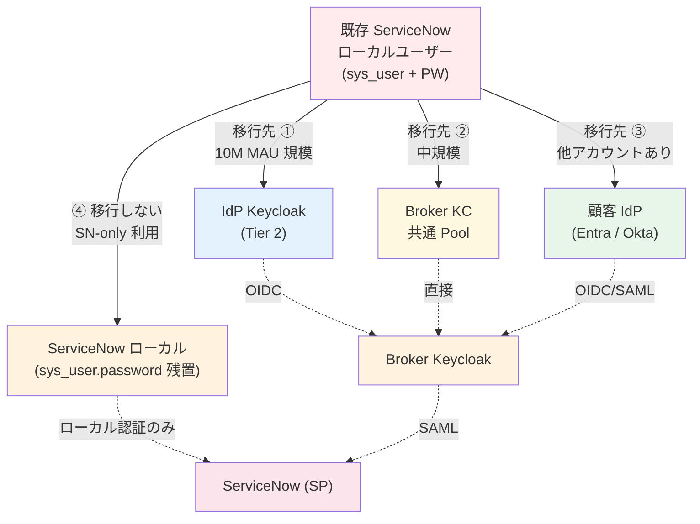

#### 4 選択肢の比較

| 観点 | ① IdP-KC | ② Broker 共通 Pool | ③ 顧客 IdP | ④ SN ローカル残置 |
|---|:---:|:---:|:---:|:---:|
| PW ハッシュの物理分離 | ✅ Tier 2 のみ | ❌ Broker 同居 | ✅ 顧客 IdP のみ | ✅ ServiceNow のみ |
| 適用 MAU 規模 | 10M+ | 〜中規模 | 顧客次第 | 規模問わず |
| 既存 SN ユーザーの追加作業 | PW 移行 + IdP-KC 登録 | PW 移行 + Broker 登録 | 顧客 IdP リンク | **不要（設定のみ）** |
| ユーザー追加体験 | IdP-KC でログイン | Broker でログイン | 顧客 IdP でログイン | **SN ローカル PW** |
| 該当ユーザーに他 IdP アカウントが必要 | ❌ 不要 | ❌ 不要 | ✅ 必須 | ❌ 不要 |
| **他アプリ SSO 利用** | ✅ 可能 | ✅ 可能 | ✅ 可能 | ❌ **不可（SN-only）** |
| 監査・統制 | 一元化（KC）| 一元化（KC）| 一元化（KC）| **二元化（KC + SN）**|
| 退職時 deprovision | KC で一括 | KC で一括 | 顧客 IdP で一括 | SN で個別 |
| 規制業種適合 | ✅ | ✅ | ✅ | ⚠ 監査複雑性 |
| 関連 ADR | ADR-033 E 案 | ADR-028 A 案 / D 案 | ADR-023 メイン | §J-1.④ |

#### ④ SN ローカル残置の実装：per-user `sso_source` ベース routing

ServiceNow は **per-user SSO routing** を公式サポート（[ServiceNow Community](https://www.servicenow.com/community/servicenow-ai-platform-forum/allow-local-login-alongside-sso-quot-source-quot-field/td-p/2471845)）:

| 設定項目 | 値 | 効果 |
|---|---|---|
| `sys_user.sso_source` = `<keycloak_idp_sys_id>` | Keycloak へ routing | Keycloak SSO ユーザー |
| `sys_user.sso_source` = `""`（空欄）| デフォルト IdP へ | デフォルト IdP 設定次第 |
| デフォルト IdP **未設定** + `sso_source` 空欄 | **ローカル認証画面表示** | SN-only ユーザー |
| `glide.authentication.external.disable_local_login` = `false` | ローカル併用許可 | フォールバック有効 |

##### サポートされるフォールバック機構（4 種）

| # | 機構 | 内容 |
|---|---|---|
| **1** | **per-user `sso_source` 設定**（推奨）| `sys_user.sso_source` 列に IdP の sys_id を設定。空欄なら**ローカル認証フォールバック** |
| 2 | **`side_door.do` URL**（サイドドア）| `https://<instance>.service-now.com/side_door.do` でローカルログインに直アクセス（注：`glide.authenticate.sso.redirect.idp` 設定時はモバイルでも動作する KB0584514）|
| 3 | `glide.authentication.external.disable_local_login = false` | ローカル併用許可 |
| 4 | Multi-Provider SSO without auto-redirect | デフォルト IdP 未設定で**ユーザー選択画面**表示 |

##### ④ 採用時の運用イメージ

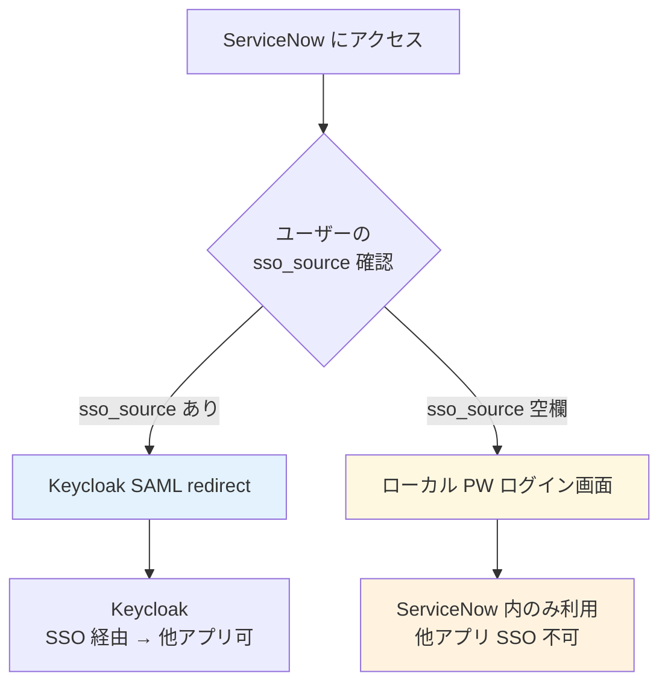

##### ④ のサイレント前提（重要）

- ④ 採用ユーザーは **Keycloak には存在しない** → 他アプリ SSO は利用不可
- **ServiceNow 内に閉じた利用のみ**（業務委託・外部ベンダー・限定的な現場担当者等）
- ServiceNow → Keycloak への同期機構は ServiceNow 公式に存在しない（自前 Event Listener + Webhook + Lambda で構築可だが保守負荷）

##### 顧客状況別の推奨使い分け

| 顧客状況 | 推奨 |
|---|---|
| 全 SN ユーザーが他アプリも利用 | ① IdP-KC 移行（or ②）|
| SN-only ユーザーが少数（< 10%）| ① + ④ **ハイブリッド**（少数のみ SN ローカル残置）|
| **SN-only ユーザーが多数**（外部ベンダー / 限定業務委託 / 一時アクセス）| **④ メイン + 他アプリ利用者のみ ① で移行** |
| 規制業種（金融 / 医療 / 政府）| ① **強推奨**（監査一元化のため、④ は監査複雑性で非推奨）|

### J-2. PW ハッシュ移行戦略（[ADR-019](019-existing-system-migration.md) の応用）

#### ServiceNow の PW ハッシュ仕様確認

ServiceNow の `sys_user.password` 列は**ServiceNow 独自のハッシュ形式**（PBKDF2 ベース、内部実装非公開）。

| 観点 | ServiceNow の挙動 |
|---|---|
| ハッシュアルゴリズム | PBKDF2 + ServiceNow 独自パラメータ（非公開）|
| 外部からの直接検証 | ❌ 不可（公開 API なし）|
| 平文 PW のエクスポート | ❌ 不可（セキュリティ仕様）|

→ **ServiceNow から PW を「そのまま」Keycloak に持っていくことは不可能**。

#### 移行手段 3 つ

| 手段 | 内容 | UX |
|:---:|---|---|
| **A. User Storage SPI（キャッシュ移行）** | Keycloak が ServiceNow REST API（`sys_user_credentials` 認証エンドポイント）に問合せて検証 → 成功時に Keycloak DB へ再ハッシュ保存 | ✅ 強制リセット不要 |
| **B. 強制 PW リセット** | 招待メール送信、ユーザーが新規 PW 設定 | ⚠ UX 悪化、サポート工数増 |
| **C. ADR-019 ②と同じく外部 DB 読み出し** | ServiceNow DB に直接接続して検証（推奨されない）| ❌ ServiceNow の規約違反、保守困難 |

→ **A 案 = User Storage SPI 経由のキャッシュ移行**が現実的かつ ADR-019 ② と完全整合。

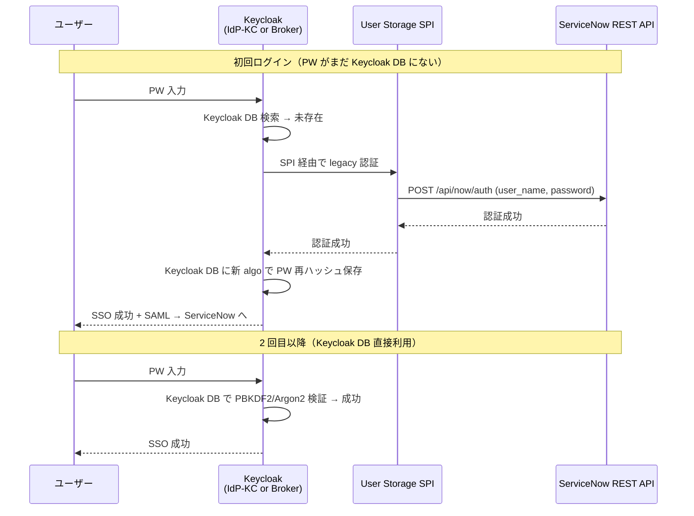

→ ServiceNow REST API による外部認証は ServiceNow が公式 API として提供しており、SI 保証対象内。

### J-3. SSO 開始後の ServiceNow ローカル PW の取り扱い

ServiceNow のローカル PW は SSO 開始後どうするか:

| 選択肢 | 内容 | 推奨度 |
|:---:|---|:---:|
| **無効化（推奨）** | `sys_user.locked_out = true` 等で SSO 経由のみログイン可能に。Local Login 機能も無効化 | ✅ |
| 残置（Break Glass）| SSO 障害時の最終防衛線として一部管理者のみ PW 残す（業界標準）| ⚠ 管理者層のみ可 |
| 完全削除 | `sys_user.password = ""` で物理削除 | ❌ 過剰、ロールバック不可 |

→ **推奨は「一般ユーザーは無効化、管理者層 1-2 名のみ Break Glass で残置」**（業界標準、Salesforce / Workday 同パターン）。

#### J-3-A. Break Glass 管理者運用のベストプラクティス

> SSO 障害時の最終防衛線として、**ServiceNow 管理者のごく一部を IdP 経由から除外**し、ローカル PW でアクセスできる状態を維持する運用パターン。**全業界の SaaS で必須レベルの標準**。

##### Break Glass が必要な 6 ケース

| ケース | 説明 |
|---|---|
| Keycloak 障害 | Keycloak ダウン中に ServiceNow 復旧が必要（IdP の事情で SP が止まるのを防ぐ）|
| Keycloak 設定ミス | SAML 証明書期限切れ・属性マッピング誤り等で全 SSO 不能になった時の復旧 |
| ネットワーク障害 | Keycloak ↔ ServiceNow 間の通信遮断 |
| インシデント対応 | Keycloak 自体がインシデントの原因の時、Keycloak 経由で入れない |
| 初期構築 / 大規模変更時 | SSO 設定変更中の安全網 |
| 退職管理者のロックアウト | SSO 経由でしか管理できないと、緊急時に追加管理者作成不能 |

##### 業界事例（Break Glass は全 SaaS の標準）

| サービス | Break Glass パターン |
|---|---|
| **AWS** | root user（IAM 一切経由しない）、Break Glass IAM user |
| **Microsoft 365** | Emergency Access Account（Cloud-only、MFA exclusion 設定可）|
| **Okta** | Super Admin の Break Glass account（SSO 除外）|
| **Salesforce** | System Administrator with local PW（SSO 除外）|
| **GitHub Enterprise** | site_admin recovery code |
| **ServiceNow** | `admin` role + `sso_source` 空欄 + `side_door.do` |

##### 実装の仕組み（§J-1 ④ と同じメカニズム）

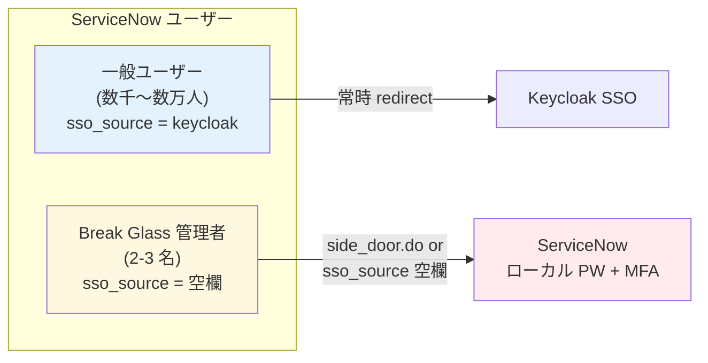

| 設定項目 | 内容 |
|---|---|
| 一般ユーザー | `sys_user.sso_source = <keycloak_idp_sys_id>` → Keycloak SSO 強制 |
| **Break Glass 管理者**（2-3 名）| `sys_user.sso_source = ""`（空欄）→ ローカル PW 認証可能 |
| アクセス URL | `https://<instance>.service-now.com/side_door.do`（Break Glass にのみ周知）|

##### 推奨実装 10 項目（ベストプラクティス）

| # | 要件 | 詳細 |
|---|---|---|
| 1 | **アカウント数** | **2〜3 名**（1 名だと当該管理者の不在時に動けない、5+ だと管理過剰）|
| 2 | **ロール** | `admin` ロール（ServiceNow 標準最高権限）|
| 3 | **`sso_source`** | **空欄**（SSO 経路非適用）|
| 4 | **ローカル PW** | **長く・ランダム**（20+ 文字、生成パスワード）|
| 5 | **MFA** | **ハードウェアキー必須**（YubiKey 等、Authenticator アプリも併用可）|
| 6 | **PW 保管** | **企業 PW マネージャ**（1Password Business / Vault 等）、紙の封印保管も可 |
| 7 | **IP 制限** | **社内 VPN / 特定 IP からのみログイン可**（ServiceNow IP Access Control）|
| 8 | **定期テスト** | **四半期 1 回程度、ログイン動作確認**（休眠アカウントは緊急時に動かないリスク）|
| 9 | **監査ログ** | 使用時に**即時通知**（Slack / メール）+ CloudTrail / SIEM 連携 |
| 10 | **アクセス記録** | 使用理由のチケット必須（事後でも可、業界標準）|

##### ServiceNow 特有の追加考慮

| 項目 | 内容 |
|---|---|
| **`sn_security_break_glass` ロール** | ServiceNow が用意する Break Glass 専用ロール（一部バージョンで利用可）|
| **`glide.authentication.external.disable_local_login` プロパティ** | これを `false` に保持（Break Glass のためにローカル併用許可）|
| **`side_door.do` URL の周知** | Break Glass 管理者にのみ周知（一般ユーザーに教えない、URL 自体は隠匿せず運用ドキュメント化）|
| **MFA 別管理** | ServiceNow ネイティブ MFA（Authenticator）を Break Glass 専用に有効化 |
| **アカウント命名** | `bg-admin-01` / `bg-admin-02` 等、識別しやすく |

##### 一般ユーザーとの違い

| 観点 | 一般ユーザー（Keycloak SSO 強制）| Break Glass 管理者 |
|---|---|---|
| 数 | 数千〜数万 | 2-3 名 |
| `sso_source` | Keycloak IdP sys_id | 空欄 |
| 認証経路 | 必ず Keycloak 経由 | **Keycloak バイパス**（ローカル PW）|
| MFA 場所 | Keycloak（or 顧客 IdP）| ServiceNow ネイティブ |
| アクセス URL | 通常 URL（自動 redirect）| `/side_door.do` |
| 監査ログ | Keycloak イベント | ServiceNow Login Log（即時通知）|
| 用途 | 日常業務 | 緊急時のみ |
| 利用頻度 | 毎日 | 月 0-1 回程度（テスト含む）|

→ **「ServiceNow 管理者だけ IdP 経由しない」は ② Break Glass パターンとして業界標準**。少数の管理者を Break Glass にし、それ以外は Keycloak SSO 強制が推奨。

#### J-3-B. ServiceNow SSO Routing 制御の 7 レベル粒度マトリクス（技術詳細）

> §J-1 ④（SN ローカル残置）/ §J-3-A（Break Glass）の**実装裏側にある ServiceNow の routing 制御機構**を 7 レベルで体系化。顧客の柔軟な要望（経理だけ別 IdP / Portal 別 SSO / 役割別 routing 等）への対応可否を判定する根拠資料。

##### 7 レベル粒度マトリクス（粗 → 細）

| Lv | 制御単位 | メカニズム | 用途例 | 採用頻度 |
|:---:|---|---|---|:---:|
| **1** | **グローバル**（システム全体）| `glide.authenticate.sso.redirect.idp` プロパティ + Default IdP 設定 | デフォルト経路の決定 | **★★★★★（必須）**|
| **2** | **per-user** | `sys_user.sso_source` フィールド | Break Glass 管理者 / SN-only ユーザー | **★★★★★（必須）**|
| **3** | **per-URL** | `glide_sso_id` URL パラメータ + `side_door.do` | 特定 URL から別 IdP 強制 | ★★★ |
| **4** | **Service Portal 単位** | Portal 別の SSO 設定 | 社員 Portal vs 顧客 Portal で別 IdP | ★★★★ |
| **5** | **Role / Group / Attribute** | SPEntryPage カスタムスクリプト | 役割別の routing | ★★★ |
| **6** | **ユーザー選択** | Multi-Provider SSO without auto-redirect | 複数 IdP の選択画面 | ★★（移行期）|
| **7** | **User Criteria**（高度な条件式）| ServiceNow 標準 User Criteria | Role + Group + Department + Location 複合 | ★★★ |

##### Lv 1: グローバル制御（デフォルト経路）

「**デフォルト Keycloak に redirect**」の設定:

| プロパティ / 設定 | 値 | 効果 |
|---|---|---|
| `glide.authenticate.sso.redirect.idp` | `true` | 自動 redirect 有効化（一般ユーザー = 認証画面なしで Keycloak へ）|
| Identity Provider entry "Default" | チェック ON（Keycloak IdP）| Keycloak をデフォルト IdP に |
| `glide.authentication.external.disable_local_login` | `false` | ローカル併用許可（Break Glass のため）|

##### Lv 2: per-user 制御（`sys_user.sso_source` フィールド）

| `sso_source` の値 | ユーザーの挙動 | 用途 |
|---|---|---|
| `<keycloak_idp_sys_id>` | Keycloak へ強制 redirect | 一般ユーザー（明示指定）|
| 空欄 | デフォルト IdP へ（Lv 1 設定適用）| 通常ユーザー（暗黙の Keycloak）|
| 空欄 + デフォルト IdP 未設定 | **ローカルログイン画面表示** | **Break Glass 管理者** |
| `<another_idp_sys_id>` | 別 IdP（例：旧 Okta）へ | 移行期の並走 |

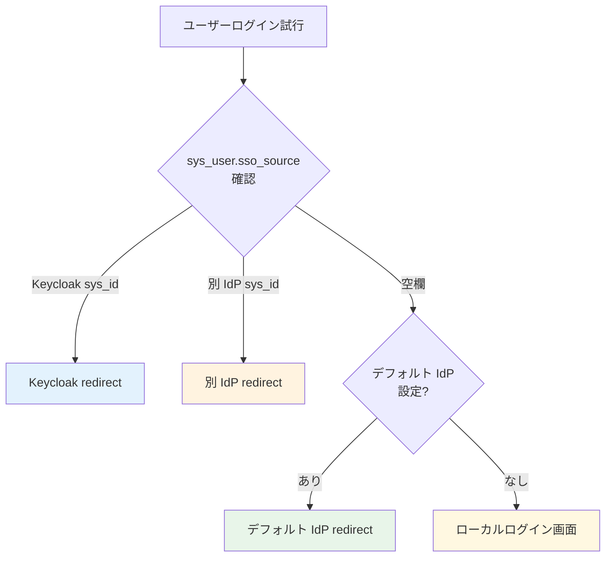

##### Lv 3: per-URL 制御

| URL | 挙動 |
|---|---|
| `https://<inst>.service-now.com/` | デフォルト経路（Lv 1 設定）|
| `https://<inst>.service-now.com/login.do?glide_sso_id=<sys_id>` | **指定 IdP に強制 redirect**（URL に IdP を埋込）|
| `https://<inst>.service-now.com/side_door.do` | **ローカルログイン画面強制**（Break Glass 用）|

##### Lv 4: Service Portal 単位

ServiceNow は **Service Portal** を複数持てる（社員 / 顧客 / パートナー等）。各 Portal で独立 SSO 設定可能:

| Portal | 想定ユーザー | SSO 設定 |
|---|---|---|
| Employee Center Portal | 社員 | Keycloak SSO 強制 |
| Customer Service Portal | 顧客 | 別 IdP（B2C 用）or ローカル |
| Vendor Portal | ベンダー | ローカル only（Keycloak バイパス）|

詳細: [ServiceNow KB0747338](https://support.servicenow.com/kb?id=kb_article_view&sysparm_article=KB0747338) / [KB0682702](https://noderegister.service-now.com/kb?id=kb_article_view&sysparm_article=KB0682702)

##### Lv 5: Role / Group / Attribute ベース（スクリプト）

**SPEntryPage Script** でログイン後の routing を条件分岐可能:

```javascript
// SPEntryPage Script Include 例
var SPEntryPage = Class.create();
SPEntryPage.prototype = {
    initialize: function() {},
    getFirstPageURL: function() {
        var user = gs.getUser();

        if (user.hasRole('itil') && user.hasRole('snc_internal')) {
            return '/now/nav/ui/home';  // ITIL エージェント → 標準 UI
        }
        if (user.hasRole('admin') && !user.hasRole('snc_external')) {
            return '/sp/admin';  // 管理者 → 管理 Portal
        }
        if (user.hasGroupName('Vendor')) {
            return '/sp/vendor';  // ベンダー → ベンダー Portal
        }
        return '/sp';  // デフォルト
    }
};
```

| 制御条件 | 例 |
|---|---|
| Role | `admin` / `itil` / カスタムロール |
| Group | `IT Service Desk` / `External Partners` |
| Department | `Engineering` / `Sales` |
| カスタム属性 | `sys_user.location` / `sys_user.company` |

##### Lv 6: ユーザー選択（Multi-Provider SSO without auto-redirect）

デフォルト IdP を設定せず、`glide.authenticate.sso.redirect.idp = false` にすると選択画面表示:

```
┌──────────────────────────────────┐
│  ServiceNow Login                 │
│  [ Keycloak でログイン ]          │  ← 本基盤の SSO
│  [ Acme Entra ID でログイン ]    │  ← 並走中の旧 IdP
│  [ ローカル PW でログイン ]       │  ← Break Glass
└──────────────────────────────────┘
```

→ 移行期の並走運用や、混在シナリオに有効。

##### Lv 7: User Criteria（ServiceNow 標準の高度条件式）

ServiceNow の **User Criteria** は Role / Group / Department / Location / カスタム条件を組合せた条件式を定義可能:

```
User Criteria 例:
  - Role: itil OR admin
  - AND Group: Tokyo Office
  - AND Department: ≠ External Vendor
  - AND Active: true
```

これを Identity Provider entry に紐付けると「**この条件を満たすユーザーだけこの IdP に redirect**」が定義可能。

##### 制御できる / できないことの整理

**できる ✅**

| 制御 | レベル |
|---|---|
| デフォルト経路（Keycloak）| L1 |
| 特定ユーザーだけ除外（Break Glass）| L2 |
| 特定 URL から別 IdP / ローカル | L3 |
| 用途別 Portal で別 SSO | L4 |
| 役割 / Group / 部署別 routing | L5・L7 |
| ユーザーに IdP 選択させる | L6 |
| 複数条件の組合せ | L7 |
| モバイルアプリ別 IdP | [KB0864615](https://support.servicenow.com/kb?id=kb_article_view&sysparm_article=KB0864615) で個別設定 |

**できない / 限定的 ⚠**

| 制御 | 状況 |
|---|---|
| **IP ベース routing** | 標準では限定的。`gs.getSession().getClientIP()` を SPEntryPage で使えば実装可（カスタム）|
| **時間帯ベース routing** | 標準なし、カスタム実装で可 |
| **デバイスタイプ別**（PC vs モバイル）| モバイル別 IdP 設定は可（KB0864615）、それ以外は限定的 |
| **位置情報ベース** | 標準なし |
| **動的属性 routing**（ログイン時に AD 等を呼出して判定）| Server Script で可能だが複雑 |

##### 推奨パターン（典型シナリオ別）

| シナリオ | 推奨 Level | 具体構成 |
|---|---|---|
| **「全員 Keycloak、管理者だけ Break Glass」**（最頻出）| **L1 + L2** | デフォルト IdP = Keycloak + `glide.authenticate.sso.redirect.idp = true` + Break Glass 管理者 2-3 名は `sso_source` 空欄 |
| 移行期の並走 | L2 or L6 | per-user `sso_source` で旧 / 新 IdP 振分 / 選択画面方式 |
| 社員 vs 顧客で完全分離 | L4 | 別 Service Portal、Portal ごとに SSO 設定 |
| 役割別 routing（経理は別 IdP 等）| L5 + L7 | User Criteria + SPEntryPage Script |
| **SN-only ユーザー多数**（§J-1 ④）| L2 | per-user `sso_source` で SSO 対象と非対象を分離 |
| 外部ベンダー Portal | L4 + L2 | Vendor Portal はローカル only、`sso_source` 空欄 |

##### 結論：本基盤での標準構成

| 構成項目 | 採用方針 |
|---|---|
| **本基盤デフォルト** | **L1 + L2 の組合せ**（Keycloak デフォルト IdP + 自動 redirect + Break Glass 管理者は `sso_source` 空欄）|
| **必要に応じ追加** | L3-L7（顧客の固有要件に応じて選択）|
| **顧客ヒアリング** | B-SN-17 で「L1+L2 で足りるか / L3 以降の細かい要件があるか」確認 |

→ **顧客の柔軟な要望にほぼ全パターン対応可能**。Lv 5 / 7 までいけば「経理だけ別 IdP」「Tokyo Office だけ MFA 強化」等の高度な要件も実装できる。

### J-4. 移行手順（並走 + 切替 + 旧 PW 廃止）

[ADR-019](019-existing-system-migration.md) の並走戦略を ServiceNow 連携に適用:

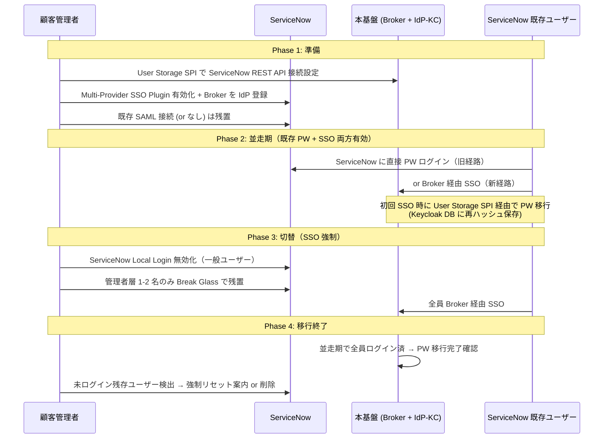

| Phase | 期間目安 | 内容 |
|---|---|---|
| Phase 1 | 1-2 週間 | SPI 接続設定、ServiceNow Multi-Provider SSO + Broker IdP 登録、ステージング検証 |
| Phase 2 | 3-6 ヶ月 | 並走運用、ユーザーは SN ローカル PW でも SSO 経由でもログイン可。初回 SSO で PW 移行 |
| Phase 3 | 1-2 週間 | SN Local Login 無効化（Break Glass 管理者除く）、SSO 強制 |
| Phase 4 | 1 ヶ月 | 未ログインユーザーの最終処理、SPI 接続削除 |

### J-5. user_name の突合（[ADR-018](018-user-identifier-3layer-emailless.md) と整合）

ServiceNow 既存ユーザーの `user_name` をどう本基盤側と突合するか:

| 状況 | 突合キー | 注意点 |
|---|---|---|
| ServiceNow `user_name` がメールアドレス | email を SAML NameID として送出、SN 側で email = user_name で突合 | 単純、現状でも動く |
| ServiceNow `user_name` が独自 ID（社員番号等）| **`user_name` を Layer B `external_id` として基盤に保持**、SAML NameID に `external_id` 送出 | ADR-018 の方針と完全整合 |
| ServiceNow `user_name` の重複（同名異人）| `tenant_id + user_name` の複合キー化 | テナント境界の厳格化 |
| ServiceNow に複数の同一人物レコード | ServiceNow 側で事前にマージ or 本基盤側で `identities` リンク管理 | 移行前のデータ品質確認必須 |

### J-6. 混在シナリオ（同一顧客内で「SN のみのユーザー」と「他 IdP もあるユーザー」が併存）

ADR-019 §E の混在顧客パターンを ServiceNow ケースに適用:

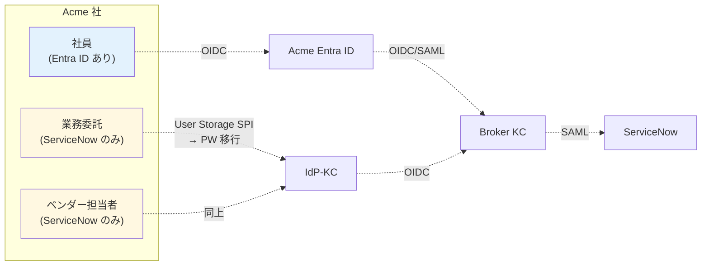

→ **業界標準パターン**（Microsoft Azure Architecture Center 2026）。社員は Entra 経由、SN のみのユーザーは IdP-KC 経由、両者とも Broker で統一 JWT 発行 → ServiceNow に SAML SSO。

### J-7. ヒアリング項目（B-SN-9〜11 追加）

| ID | 確認項目 | 回答例 |
|---|---|---|
| **B-SN-9** | 既存 ServiceNow ローカルユーザー数 | 全体 / カテゴリ別（社員 / 委託 / ベンダー等）|
| **B-SN-10** | 既存 SN ローカルユーザーの PW 移行希望 | A User Storage SPI（推奨）/ B 強制リセット / C SSO 後も SN ローカル PW 残置 |
| **B-SN-11** | SSO 開始後の SN ローカル PW 取扱い | **無効化（推奨）** / Break Glass 残置（管理者層のみ）/ 完全削除 |

### J-8. 推奨デフォルトアプローチ

| 項目 | 推奨 |
|---|---|
| 認証ソース配置 | **10M MAU 規模なら IdP-KC、中規模なら Broker 共通 Pool**（[J-1](#j-1-認証ソースをどこに置くか3-選択肢) 参照）|
| PW 移行手段 | **A. User Storage SPI（キャッシュ移行）** — ServiceNow REST API 経由 |
| SSO 開始後の SN ローカル PW | **一般ユーザー無効化 + 管理者 1-2 名 Break Glass 残置** |
| 移行期間 | 3〜6 ヶ月（ADR-019 並走戦略と同じ）|
| 切替単位 | ユーザーカテゴリ単位（社員 → 委託 → ベンダー）|
| user_name 突合 | Layer B `external_id` = `user_name`（ADR-018 整合）|

---

## Consequences

### Positive

- **業界標準パターン（B 案 SAML JIT）で 90% カバー**できる、最少工数
- ServiceNow ユーザーマスタを保持 → 既存業務データ・チケット履歴を壊さない
- ADR-018 識別子戦略（Layer B `external_id` = `user_name`）と完全整合
- 移行は ADR-019 並走方式と統合可能（Multi-Provider SSO で並走期対応）

### Negative

- C 案（SCIM Push）採用時は ServiceNow KB2599716 リスクを承知の上で自前実装が必要
- 退職時の ServiceNow 側レコード論理削除を別途運用設計が必要（B 案）
- OIDC ベースの連携は事例が少なく、SAML 推奨

### Constraints

- ServiceNow の **Multi-Provider SSO Plugin が前提**（顧客テナントで有効化必要）
- SCIM 採用時は **Enterprise Plan + SCIM v2 Plugin** 必須
- Microsoft Entra 連携を別途使う顧客がいる場合、Entra → SN の SCIM 設計とは分離して扱う

---

## 参考資料

- **ServiceNow 公式**:
  - [ServiceNow Community: SAML Setup — Multi-Provider SSO vs SAML 2 Single](https://www.servicenow.com/community/sysadmin-forum/saml-setup-in-servicenow-multi-provider-sso-vs-saml-2-single/m-p/3178936)
  - [ServiceNow Knowledge Base KB2599716](https://support.servicenow.com/kb)（2025-11、SCIM via Entra ID 非サポート）
  - [ServiceNow Community: SCIM Provisioning from Microsoft Entra ID](https://www.servicenow.com/community/developer-blog/scim-provisioning-from-microsoft-entra-id/ba-p/2984734)
- **Keycloak × ServiceNow**:
  - [SkyCloak: SSO Implementation Guide — SAML and OIDC with Keycloak](https://skycloak.io/blog/sso-implementation-guide-developers/)
- **業界 IdP の ServiceNow SAML 設定**:
  - [Okta: Configure SAML 2.0 for ServiceNow](https://saml-doc.okta.com/SAML_Docs/How-to-Configure-SAML-2.0-for-ServiceNow.html)
  - [miniOrange: Configure SSO for ServiceNow](https://www.miniorange.com/servicenow-single-sign-on-(sso))
- **SCIM 制約 / 代替**:
  - [Stitchflow: ServiceNow SCIM Provisioning — Pricing & Limitations](https://www.stitchflow.com/scim/servicenow)
  - [ServiceNow Community: SCIM vs Microsoft Gallery (SOAP)](https://www.servicenow.com/community/itsm-forum/scim-vs-microsoft-gallery-soap-recommended-approach-for-entra-id/m-p/3488369)
