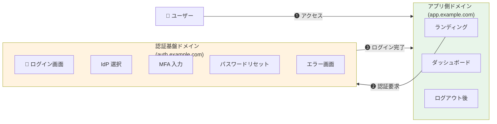
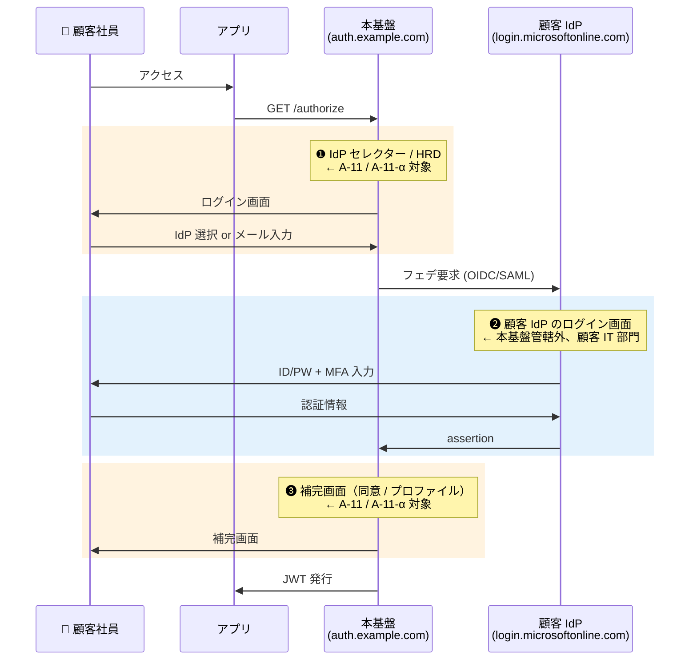
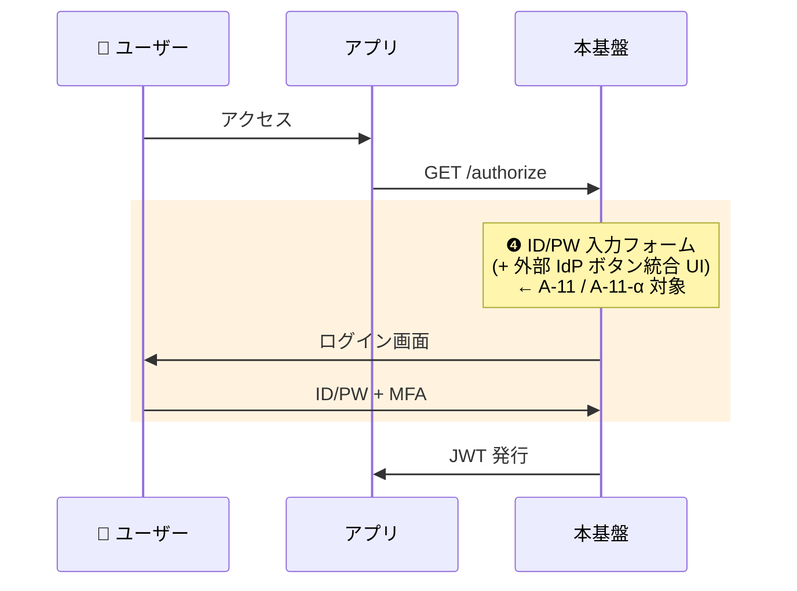
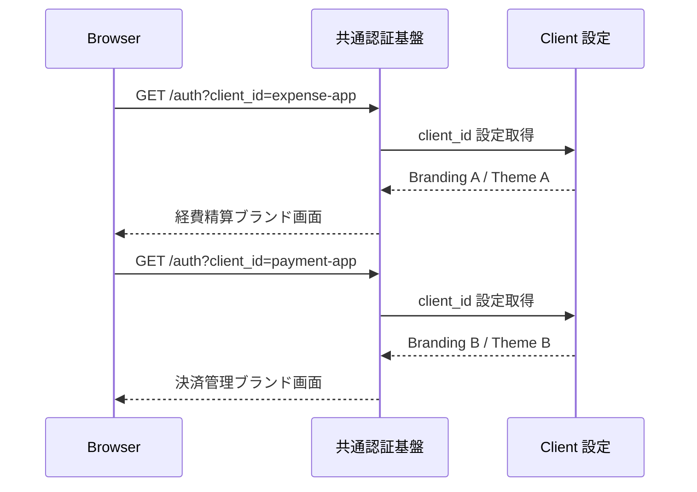

# ADR-024: ログイン画面アーキテクチャとブランディング 4 パターン

- **ステータス**: Proposed（要件定義フェーズで Accepted に昇格予定）
- **日付**: 2026-06-15
- **関連**:
  - [§FR-2.3.3.A 画面所在マトリクスとカスタマイズ 3 パターン](../requirements/proposal/fr/02-federation.md#fr-233a-画面所在マトリクスとカスタマイズ-3-パターン)
  - [ADR-020 HRD ヒントキー + 混在 Identifier-First](020-hrd-hint-keys-mixed-login.md)
  - [common/branding-strategy-evidence.md](../common/branding-strategy-evidence.md)
  - [common/platform-architecture-patterns.md](../common/platform-architecture-patterns.md)
  - **[ADR-057 CSRF 対策の責任分界](057-csrf-protection-responsibility-boundary.md)** — Custom Theme 実装時に Keycloak 標準の hidden CSRF field を消さないこと（2026-07-06 追記、[ADR-057 §D.1](057-csrf-protection-responsibility-boundary.md#d1-l1-keycloak-ui本基盤担当追加実装ゼロ) 連動）

---

## Context

「画面が認証基盤上 vs アプリ側のどちらに存在するか」で**カスタマイズ可能範囲と実装手段が決定的に変わる**。ブランディング設計を 2 軸（アプリ別 / 顧客別）で整理し、4 つの設計パターン（A / A' / B / C）から推奨を選ぶ必要がある。

**3 つの論点が絡む**:
1. 画面の物理的所在（認証基盤 vs アプリ）
2. フェデユーザーとローカルユーザーで画面遷移が異なる責務分担
3. 「2 回ログイン問題」（顧客誤解への対応）

---

## Decision

### ブランディングパターンは 2 軸 × Yes/No で自動判定

| 軸 1（アプリ別）| 軸 2（顧客別）| 結果パターン | 採用シーン |
|:---:|:---:|:---:|---|
| ❌ No | ❌ No | **パターン A** | アプリ画面のみ（Slack/Notion 型）|
| ✅ Yes | ❌ No | **パターン A'** | アプリ間差別化（**業界主流**、Auth0/Entra/Okta 型）|
| ❌ No | ✅ Yes 部分 | **パターン B** | 顧客別（Cognito 20 上限、規制業種）|
| - | ✅ Yes 完全分離 | **パターン C** | Pool/Realm 分離、Enterprise プラン |

**ベースライン**: **パターン A** デフォルト、アプリ間差別化が必要なら **パターン A'** へ。

---

## A. 画面の物理的所在で整理



| 画面 | 物理的所在 | アプリで `tenant_id` 解釈可能? | 認証基盤側設定 |
|---|---|:---:|:---:|
| ログイン画面（ID/PW 入力） | 認証基盤 | ❌ 不可能 | ✅ 必須 |
| IdP 選択画面（セレクター / HRD） | 認証基盤 | ❌ | ✅ 必須 |
| MFA 入力画面 | 認証基盤 | ❌ | ✅ 必須 |
| パスワードリセット画面 | 認証基盤 | ❌ | ✅ 必須 |
| 同意画面 / Consent | 認証基盤 | ❌ | ✅ 必須 |
| 認証エラー画面（一部） | 認証基盤 | △（リダイレクトで逃せる）| ⚠ 部分的に必要 |
| ログイン前ランディング | アプリ | ✅ 完全可能 | 不要 |
| ログイン後ダッシュボード | アプリ | ✅ 完全可能 | 不要 |
| ログアウト後ランディング | アプリ | ✅ 完全可能 | 不要 |

### なぜアプリ側で完全カスタマイズできないか

ブラウザの URL バーが `auth.example.com` を指している間は、**ブラウザの Same-Origin Policy により、アプリの JS から認証基盤ドメインの DOM を触れない**（XSS / CSRF 対策の根幹）。回避は不可能。

→ **認証基盤上の画面のカスタマイズは、必ず認証基盤側の Theme / Branding 設定が必要**。

---

## B. フェデユーザー / ローカルユーザーの画面遷移と責務分担

### フェデユーザー（P-3）の画面遷移



### ローカルユーザー（P-2 / P-4 等）の画面遷移



### 画面別の責務分担マトリクス

| 画面 | 物理的所在 | 管理者 | A-11/A-11-α | 利用者 |
|---|---|---|:---:|---|
| ❶ 本基盤 IdP セレクター | 本基盤 | 本基盤チーム | ✅ 対象 | P-3 フェデ |
| ❷ 顧客 IdP ログイン画面 | 顧客 IdP | **顧客 IT 部門** | ❌ 対象外 | P-3 フェデ |
| ❸ 本基盤 補完画面 | 本基盤 | 本基盤チーム | ✅ 対象 | P-3 + 初回 |
| ❹ 本基盤 ID/PW フォーム | 本基盤 | 本基盤チーム | ✅ 対象 | P-2/P-4 ローカル |

→ **❶❸❹ は本基盤側ドメイン**で A-11 / A-11-α 対象。**❷ は顧客 IdP のドメイン**で本基盤管轄外（Entra ID なら Company Branding 機能）。

### Managed Login / Theme の重要な特性

Cognito Managed Login / Keycloak Theme の **ログイン画面はフェデ / ローカル分離ではなく統合**:

```
┌──────────────────────────────┐
│  本基盤のログイン画面（共通 UI）  │
│  📧 メールアドレス              │  ← ローカル用 (P-4/P-2)
│  🔒 パスワード                 │
│  [ ログイン ]                  │
│  ─────  または  ─────         │
│  [ Microsoft Entra でログイン ] │  ← フェデ用 (P-3)
│  [ Okta でログイン ]            │
└──────────────────────────────┘
```

### App Client 単位での「誰が見るか」の制御

| App Client | 設定 | 表示 UI | 採用シーン |
|---|---|---|---|
| 経費精算（P-3 のみ）| 外部 IdP のみ許可 | 外部 IdP ボタンのみ | γ シナリオ |
| 管理画面（P-1/P-2）| ローカル Pool のみ | ID/PW フォームのみ | 管理者専用 |
| 汎用（P-3 + P-4）| 両方許可 | 統合 UI | β シナリオ |

---

## C. フェデユーザーの IdP 選択 UX（HRD / セレクター / 組織固有 URL）

| パターン | フロー | 業界実例 |
|---|---|---|
| **A. HRD** | メール入力 → ドメイン → IdP 自動判定 | Microsoft 365 / Slack |
| **B. セレクター** | IdP ボタン押下 → IdP リダイレクト | GitHub / GitLab |
| **C. 組織固有 URL** | `acme.app.example.com` → 組織確定 | Slack（チーム別）/ Notion |

### 採用シナリオ（A-5-3）との関係

| シナリオ | 推奨 UX | 理由 |
|---|---|---|
| α 全カテゴリ | A. HRD + 統合 UI | メールで両方判定 |
| β 管理者+IdP なし | A. HRD + 統合 UI | フェデ → HRD、ローカル → ID/PW |
| γ 管理者のみ | **A. HRD（フェデ専用）** | 顧客従業員は全員フェデ |
| δ Break Glass | A. HRD or B. セレクター | 緊急用ローカルのみ |

詳細な HRD 各パターン比較・email 非保有時の対応は [ADR-020](020-hrd-hint-keys-mixed-login.md) 参照。

---

## D. 「2 回ログイン」問題の整理（顧客誤解への対応）

> 顧客典型質問: 「フェデなのに 2 回ログインさせるのか?」  
> 回答: 多くのケースで **操作は 2 段階だが認証は 1 回**（業界標準）。

### 「2 回ログイン」と見える 3 種類の現象

| 見え方 | 本当のところ | 評価 |
|---|---|:---:|
| ❶ メール入力 + ❷ IdP ログイン（HRD パターン）| ❶ は認証ではなく IdP 振り分け識別子入力 | ✅ 標準 |
| 本基盤 IdP セレクター + IdP ログイン | ❶ はクリック 1 つ、認証ではない | ✅ 標準 |
| **顧客 IdP MFA + 本基盤 MFA**（MFA 重複）| 本当に 2 回認証 | ❌ アンチパターン |

### 「ログイン」の定義の整理

| 用語 | 意味 | 操作 |
|---|---|---|
| 狭義のログイン（認証）| PW / MFA で本人確認 | ID/PW + MFA 入力 |
| 広義のログイン（認証フロー）| 認証完了までの一連 | IdP 選択 + 認証 + 同意 |

### SSO の本当の意味：「2 回目以降のログイン不要」

```
[初回（フェデ）]
ユーザー → ❶ IdP 振り分け → ❷ 顧客 IdP で認証 → アプリ A
   ↓ 顧客 IdP と本基盤の両方にセッション Cookie 確立
[2 回目以降]
ユーザー → アプリ B → ❶❷ 両方スキップ → 即時利用可 ← SSO 効果
```

### 「本当に 2 回認証させる」アンチパターン 4 種

| パターン | 原因 | 対策 | 関連章 |
|---|---|---|---|
| 1. MFA 重複（最多）| 顧客 IdP MFA 済なのに本基盤側でも要求 | `amr` 信頼設計 | [§FR-2.2.3](../requirements/proposal/fr/02-federation.md#fr-223-mfa-重複回避--fr-fed-012) |
| 2. L4 不信任 | `prompt=login` 強制 | L1〜L3 採用 | [§FR-4.2](../requirements/proposal/fr/04-sso.md) |
| 3. `max_age` 制約 | 高セキュ操作時に再認証 | 重要操作のみ | [§FR-4.2](../requirements/proposal/fr/04-sso.md) |
| 4. SCIM/JIT 補完画面 | 初回アカウントリンク確認 | 認証ではないが操作増 | [§FR-2.2.1.A](../requirements/proposal/fr/02-federation.md#fr-2.2.1.a-同一テナント内ユーザー重複の扱い) |

### 業界実例（フェデ 2 段階は標準）

| サービス | 初回操作 | 認証回数 |
|---|---|:---:|
| Microsoft 365 | メール入力 → Entra ID で ID/PW + MFA → サービス | 1 回 |
| Slack | Workspace 名入力 → SSO ボタン → IdP → Slack | 1 回 |
| Notion | メール入力 → SSO 自動振り分け → IdP → Notion | 1 回 |
| Salesforce | My Domain URL → SSO ボタン → IdP → Salesforce | 1 回 |
| GitHub Enterprise | IdP ボタン → IdP → GitHub | 1 回 |

→ **業界全体で「フェデの初回は 2 段階操作、認証は 1 回」が標準**。

### 画面数を 1 つに減らす選択肢

| 選択肢 | 効果 | トレードオフ | 採用例 |
|---|---|---|---|
| A. 組織固有 URL（パターン C）| ❶ スキップ → 1 画面 | 顧客ごとに URL 周知 | Slack / Figma |
| B. IdP-Initiated SSO | ❶ + ❷ スキップ | 運用動線整備必要 | Office 365 ポータル |
| C. SSO セッション持ち越し | 2 回目以降 0〜1 画面 | 業務開始時のみ通常 | Microsoft 365 |
| D. HRD Cookie 保存 | 体感 1 画面 | プライベートブラウジング NG | 一部 B2B SaaS |
| E. IdP 1 社固定 | 1 画面 | マルチテナント不可 | 単一顧客向け |

### 顧客対話用の説明テンプレート

```
顧客「フェデなのに 2 回ログインさせるのか?」

回答:
「実は『2 段階操作』に見えますが、認証（パスワード入力）自体は 1 回だけです。

  ❶ 本基盤の画面でメール入力（または IdP ボタン選択）
     → これは『認証』ではなく『どの会社の IdP に振り分けるか』を
       決めるための識別子入力です。パスワードは入れません。

  ❷ 御社の Entra ID で ID/パスワード + MFA 入力
     → これが本物の『認証』です。

Microsoft 365 / Slack / Notion / Salesforce 等の業界標準 SaaS で全て採用。

SSO の本当の効果は『2 回目以降の操作不要』。初回認証後、別アプリにアクセス
すると Entra と本基盤の両セッションで完全スキップ → 即時利用可能。」
```

---

## E. 認証基盤側ブランディングの方法と制約

### Cognito Managed Login Branding（Essentials+）

| 機能 | 内容 | 制約 |
|---|---|---|
| Branding Styles | ロゴ / 配色 / フォント | **20 / User Pool（Hard limit）**|
| App Client 別 Branding | App Client 単位で別 Style | App Client 数の制約に縛られる |
| 動的差替（query パラメータ）| ❌ 標準非対応 | カスタム実装で代替 |

→ **顧客 20 社まで個別ブランディング可、それ以上は不可能**。

### Keycloak Themes

| 機能 | 内容 | 制約 |
|---|---|---|
| Realm Theme | Realm 単位で別 Theme | Realm 分離が必要 |
| Client Theme Override | Client 単位で一部上書き | 限定的（Login Theme は Realm が支配的）|
| カスタム Theme（FreeMarker）| 動的ロゴ/色変更可 | 実装コスト高 |

---

## F. 4 パターン詳細

### パターン A: 認証基盤は最小、アプリ側で完全カスタマイズ（業界標準）

```
[認証基盤側] ニュートラル ロゴ・配色、多言語のみ
[アプリ側] tenant_id を JWT で解釈、完全カスタマイズ
```

| 観点 | 評価 |
|---|---|
| Cognito | ✅ 1 Theme で完結 |
| Keycloak | ✅ 1 Realm + 標準 Theme |
| 業界実例 | **Slack / Notion / Microsoft 365** |

### パターン A': アプリ単位 Branding（認証基盤側）+ テナント別差替（アプリ側）（業界主流）

```
[認証基盤側] アプリ単位（client_id ベース）に Branding Style 割当
[アプリ側] tenant_id を JWT で解釈、完全カスタマイズ
```

**ポイント**: 「ログイン画面はアプリ単位」「アプリ画面は顧客単位」の**二重軸**。認証前は `client_id` パラメータでアプリ識別、認証後は JWT `tenant_id` クレームで顧客識別。

| 観点 | 評価 |
|---|---|
| Cognito | ✅ App Client 単位 Branding（20 Style 上限）、Essentials+ |
| Keycloak | ✅ Client 単位 Login Theme Override、制限なし |
| 業界実例 | **Auth0 / Entra / Okta / Cognito Managed Login** |

#### パターン A' のカスタマイズ範囲の限界

| Lv | 内容 | Cognito Managed Login | Keycloak Theme |
|:---:|---|:---:|:---:|
| L1-L3 | 見た目・配置（事前選択肢）| ✅ | ✅ |
| L4 | テキスト・文言変更 | ❌（多言語のみ）| ✅ |
| L5 | 要素追加・削除 | ❌ | ✅ |
| L6 | 要素並び順変更 | ❌ | ✅ |
| L7-L8 | HTML 構造完全自由 / カスタム JS | ❌ | ✅ |

→ **L4-L8 が必要なら Keycloak 採用** or Cognito Custom UI（SDK 経由）or アプリ側カスタム UI（SSO 喪失トレードオフ）。詳細は [common/branding-strategy-evidence.md §7.B](../common/branding-strategy-evidence.md) 参照。

#### パターン A' の動作原理：URL 1 つで UI を振り分ける

OAuth 標準の **`client_id` クエリパラメータで Client を識別**し、Client 設定から Branding / Theme を解決。Cognito / Keycloak 共通。



| 観点 | Cognito | Keycloak |
|---|---|---|
| 管理単位 | Branding Style（JSON 設定）| Theme（ファイル群）|
| HTML 編集 | ❌ 不可 | ✅ 完全自由（`.ftl`）|
| 継承機構 | ❌ なし | ✅ `parent` 指定で base 継承 |
| 上限 | 20 Style / Pool | 制限なし |
| デプロイ | API 経由 | ファイル配置（Git）|
| 動的選択 | App Client 静的割当 | Theme Selector SPI で動的 |

### パターン B: テナント別ロゴのみ動的注入

| 観点 | 評価 |
|---|---|
| Cognito | △ 20 顧客上限 |
| Keycloak | ✅ カスタム Theme + Theme Selector SPI |
| 採用シーン | 中規模顧客（規制業種等）|

### パターン C: 完全テナント別ブランディング（Enterprise 専用）

| 観点 | 評価 |
|---|---|
| Cognito | ❌ 21 社目から不可（Pool 分離が必要）|
| Keycloak | ⚠ Realm 分離が必須（L3 ハイブリッドへ移行）|

---

## G. 4 パターン比較表（決定版）

| 軸 | A | A' | B | C |
|---|:---:|:---:|:---:|:---:|
| 認証基盤側カスタマイズ単位 | ❌ 共通 | **✅ アプリ単位**（client_id）| ✅ テナント単位 | ✅ テナント単位（物理分離）|
| アプリ側カスタマイズ | ✅ テナント単位 | ✅ テナント単位 | ✅ | ✅ |
| Cognito 制約 | なし | 20 Branding Style 上限 | 20 顧客上限 | Pool 分離（10,000 Pool）|
| Keycloak 制約 | なし | なし | Realm 分離 or Theme | Realm 分離（数千）|
| 必要ティア（Cognito）| Lite OK | **Essentials+** | Essentials+ | Lite OK |
| URL allowlist 数 | 5-10 / アプリ | 5-10 / アプリ | 顧客 × アプリ | 顧客 × アプリ |
| 対象スケール | 制限なし | **アプリ 20 個まで** | 顧客 20 社まで | 大口顧客のみ |
| 業界実例 | Slack / Notion | **Auth0 / Entra / Okta** | 規制業種 | 金融 |

### 業界実例（拡張版）

| サービス | 認証基盤側 | アプリ側 | パターン |
|---|---|---|---|
| Slack | 共通 | Workspace 別 | A |
| Notion | 共通 | Workspace 別 | A |
| **Auth0 Universal Login** | **Application 単位 Branding Page** | 自由 | **A'** |
| **Microsoft Entra ID** | **App Registration 単位ロゴ** | 各 SaaS でカスタマイズ | **A'** |
| **Okta** | **Application 単位 + Brands** | 自由 | **A'** |
| **AWS Cognito Managed Login** | **App Client 単位 Branding Style** | アプリ側 | **A'** |
| Microsoft 365 | テナント別ロゴ表示可 | 各 SaaS | A + 一部 B |
| AWS Console | 共通 | 一部 IAM Identity Center で組織別 | A |

---

## H. 顧客との対話：要望の翻訳表

| 顧客要望 | 真意の確認 | 対応 |
|---|---|---|
| 「テナントごとにブランディング」 | ログイン画面? アプリ内? 両方? | アプリ内のみ = A / ログイン画面まで = B |
| 「会社のロゴを出したい」 | どの画面で? どの単位で? | ログイン画面で顧客 = B / アプリ内のみ = A / **アプリ単位 = A'** |
| **「経費精算と決済で違うブランド体験にしたい」** | アプリ単位の差別化 | **パターン A'**（業界主流）|
| 「完全に自社専用にしたい」 | 全画面? 目に触れる画面? | 全画面なら **C**（Enterprise）|
| 「迷わないようにしたい」 | UX 問題（B-601）| **A** + HRD で十分 |
| 「アプリごとに異なるログイン画面のロゴ」 | `client_id` ベース | **パターン A'** |

---

## Consequences

### Positive

- 2 軸 × Yes/No で複雑なブランディング設計を機械的に判定可能
- A 案デフォルト + A' へのスケールアップで業界主流と整合
- Cognito / Keycloak の機能差を明示し、適切なプラットフォーム選定を可能に
- 「2 回ログイン」誤解への顧客対話テンプレート確立

### Negative

- パターン A'（Cognito）は 20 Branding Style 上限の制約
- 顧客側 IdP 画面（❷）は管轄外で、別途顧客 IT 部門との連携必要
- L4-L8（HTML 構造変更）が必要な場合は Keycloak 必須

---

## 参考資料

- [common/branding-strategy-evidence.md](../common/branding-strategy-evidence.md) — 詳細な技術根拠・公式ソース引用
- [common/platform-architecture-patterns.md](../common/platform-architecture-patterns.md) — Cognito Branding Style 20 上限
- [Auth0 Universal Login](https://auth0.com/docs/authenticate/login/auth0-universal-login)
- [AWS Cognito Managed Login Branding](https://docs.aws.amazon.com/cognito/latest/developerguide/managed-login.html)
- [Keycloak Themes](https://www.keycloak.org/docs/latest/server_development/#_themes)
