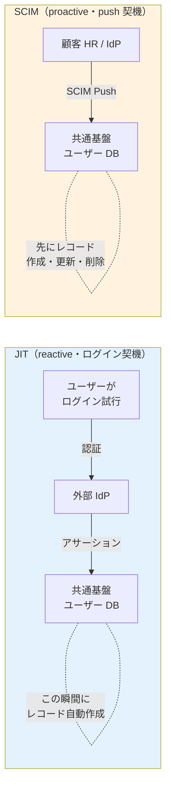
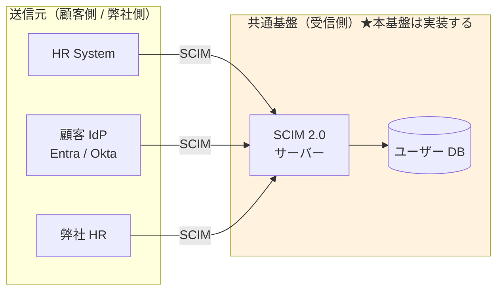
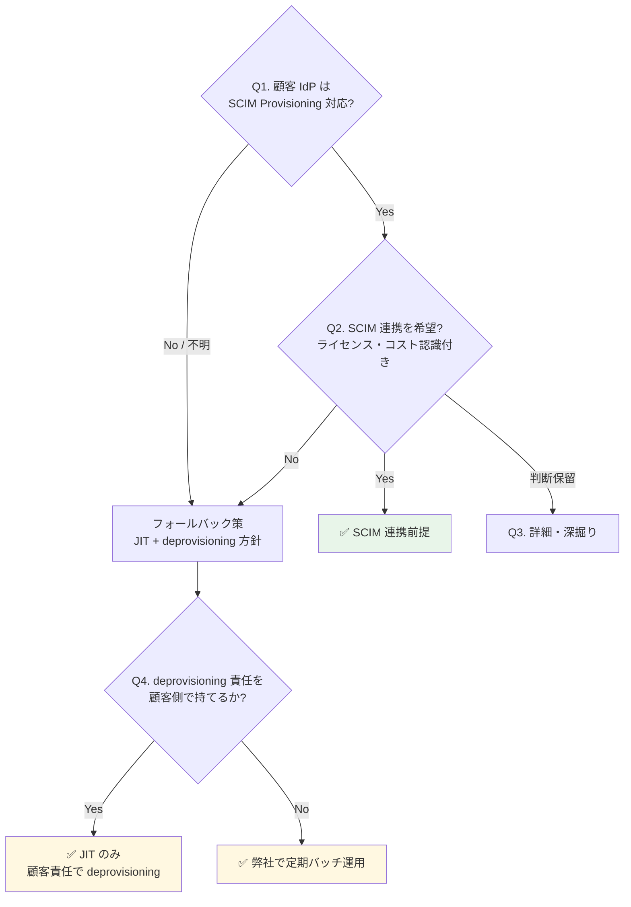

# ADR-025: SCIM 2.0 の位置づけと本基盤の受信スタンス

- **ステータス**: Proposed（要件定義フェーズで Accepted に昇格予定）
- **日付**: 2026-06-15、**2026-07-08 §H 追記**（顧客 IdP が LDAP(s) の場合の JIT/SCIM 扱い）+ **§H.7.A 認証フロー追加**（§C-7.4.7 SSO ログイン / §C-7.4.8 Full Sync Deprovision）、**2026-07-09 §H.6.3 Transient Password Exposure 追加**（Level 1 vs Level 2 区別 + フェーズ図 + 6 脅威 + 10 緩和策 + 3 規制対応 + 4 方式比較）+ **§H.4.B JIT vs SCIM 判別と自動 deprovisioning 追加**（scim_active + provisioned_by 3 段階戦略、[jit-scim §10.4.A/B](../common/jit-scim-coexistence-keycloak.md) + [ADR-060 §C.2.3](060-auth-protocol-attack-path-residual-tbd.md) 波及）+ **⚠ §I.2 Metatavu keycloak-scim-server の Phase 1 実装前 PoC 検証追記**（[jit-scim §10.4.E 一次資料調査 14 件](../common/jit-scim-coexistence-keycloak.md) 反映、Keycloak 26 対応 / カスタム属性書込 / SPI 統合の 3 点確認必要）
- **関連**:
  - [§FR-7.4.0 SCIM の位置づけと本基盤のスタンス](../requirements/proposal/fr/07-user.md#fr-740-scim-の位置づけと本基盤のスタンス)
  - [§FR-2.2.1 JIT プロビジョニング](../requirements/proposal/fr/02-federation.md#321-jit-プロビジョニング--fr-fed-008)
  - [ADR-023 ServiceNow SP 連携設計](023-servicenow-sp-integration.md)
  - [common/jit-scim-coexistence-keycloak.md](../common/jit-scim-coexistence-keycloak.md)
  - **[ADR-009 MFA 責任](009-mfa-responsibility-by-idp.md)**（§H.6 LDAP + MFA 論点、2026-07-08 追記）
  - **[ADR-014 認証パターン範囲 K-12 制約](014-auth-patterns-scope.md)**（§H.8 LDAP は Cognito 不可、Keycloak 必須化、2026-07-08 追記）
  - **[ADR-058 認証プラットフォーム比較](058-auth-platform-alternatives-comparison.md)**（§H LDAP 対応可否、2026-07-08 追記）
  - **[ADR-060 §A Log scrubbing / §C Golden 検知](060-auth-protocol-attack-path-residual-tbd.md)**（§H.6 LDAP パスワード転送のマスキング + Golden LDAP 検知 L-GD シグナル追加候補、2026-07-08 追記）
- **[reference/scim-deletion-realtime-detection.md](../reference/scim-deletion-realtime-detection.md)** — §I の実装裏どり（Metatavu SCIM Server + Custom Event Listener SPI + EventBridge 統合の詳細実装ガイド、2026-07-08 追記）

---

## Context

SCIM 2.0 は**ユーザー情報を別システムに自動同期する標準 API**で、OIDC / SAML の認証層とは別レイヤーのプロビジョニング層プロトコル。退職者 deprovisioning / 属性同期 / GDPR 削除権応答を自動化する用途で、エンタープライズ B2B SaaS の標準。

顧客採用判断には次の論点が絡む:
- 「SCIM = SAML 専用」という誤解（実際は OIDC + SCIM が標準パターン）
- 「JIT があれば SCIM 不要」「SCIM があれば JIT 不要」という誤解（両者は補完関係）
- 顧客 IdP の SCIM 対応状況とライセンスコスト
- SCIM 不採用時の deprovisioning 責任所在

---

## Decision

**SCIM 2.0 受信機能（SCIM サーバー）を本基盤で実装する（Must）**。顧客側に SCIM クライアント機能の保有・採用は必須化しない（Should）。「全部 SCIM 可能、顧客選択」アプローチで柔軟性最大化。

JIT と SCIM の使い分け:
- **JIT = 日常運用（ログイン契機の自動作成）**
- **SCIM = 退職者 deprovisioning + 大量変更 + 属性同期**
- **両方併用が標準**（補完関係、排他ではない）

---

## A. SCIM とは（基本）

| 観点 | 内容 |
|---|---|
| 正式名称 | System for Cross-domain Identity Management 2.0（RFC 7643 + RFC 7644）|
| 役割 | ユーザー情報の CRUD を行う REST API 標準（POST/GET/PUT/PATCH/DELETE）|
| 送受信関係 | クライアント（送信元: HR / IdP）→ サーバー（受信先: 本基盤）|
| 典型データ | userName / email / active / name / groups 等の標準スキーマ + 拡張 |

### OIDC / SAML との関係（直交する 2 層）

| 層 | プロトコル | やること |
|---|---|---|
| **認証層** | OIDC / SAML | 「いまログインしようとしているのは誰か」を確認 |
| **プロビジョニング層** | **SCIM** | 「そもそも誰がユーザーとして存在するか」を管理 |

→ **OIDC + SCIM** は標準的な組み合わせ。「SCIM = SAML 専用」は誤解（Entra / Okta / Google はいずれも OIDC + SCIM をセット提供）。

---

## B. JIT と SCIM の比較

| 方式 | やり方 | 強み | 弱み |
|---|---|---|---|
| JIT | OIDC/SAML 初回ログイン時に自動作成 | 事前準備不要 | **退職者の deprovisioning が困難** |
| SCIM | HR/IdP が REST API で push 同期 | 事前作成・自動 deprovisioning・属性同期 | ソース側に SCIM 機能必要 |
| 手動 / バルクインポート | 管理者が UI / CSV で投入 | 簡単 | スケールしない |

### 起動タイミング・方向（混同しやすい点）



| 観点 | JIT | SCIM |
|---|---|---|
| 起動タイミング | ユーザーがログインした瞬間 | HR/IdP で CRUD が起きた瞬間 |
| 方向 | 外部 IdP → 基盤（ログインのついで）| 外部 HR/IdP → 基盤（独立 REST API）|
| 動作タイプ | **reactive**（受け身）| **proactive**（能動・push）|
| 対象操作 | 作成のみ（更新も可だがログイン時のみ）| 作成 / 更新 / 削除すべて |
| 退職者 deprovisioning | ❌ 不可能 | ✅ 可能 |
| プロトコル依存 | OIDC / SAML / LDAP 等何でも可 | RFC 7644（独立 REST API）|
| デフォルト権限付与 | JIT 作成時に IdP アサーションの groups/roles を読む | SCIM ペイロードの groups を読む |

→ **JIT と SCIM は方向は同じ（外部 → 基盤）だが、起動契機・動作タイプが真逆**。**両方併用が標準**。SCIM が無くても JIT は動く。SCIM があっても JIT は無効化しない（IdP 側の SCIM 未対応ユーザーをカバー）。Webhook は方向自体が SCIM と真逆（基盤 → 外部アプリ、[§FR-9.3.0](../requirements/proposal/fr/09-integration.md#fr-930-webhook-の役割と-scimjit-との違い)）で補完関係。

---

## C. 本基盤での JIT / SCIM の使い分け（利用者カテゴリ別）

| カテゴリ | JIT 使用 | SCIM 使用 | 補足 |
|---|---|---|---|
| **P-1 基盤運用管理者** | フェデログイン時（弊社内 IdP）| 弊社 HR から push（任意）| 数十名、手動 + JIT で十分 |
| **P-2 テナント管理者**（顧客 IdP あり）| フェデログイン時 | 顧客 IdP から push（任意）| 数名、JIT で十分なケース多い |
| **P-3 現行で IdP があった従業員** ★主役 | **フェデログイン時（主用途）** | **退職者 deprovisioning に強く推奨** | 数千〜数万、退職者問題が顕在化 |
| **P-4 現行で IdP がなかった従業員**（旧 P-5 ゲスト/外部協力者 統合）| 招待リンク経由 or ローカル | 該当なし（ソース無し）| 手動 + セルフサービス + 招待ベース |

### 「JIT プロビジョニング」と「JIT 管理者」の区別（紛らわしい類似用語）

| 用語 | 何の話 | 関連章 |
|---|---|---|
| **JIT プロビジョニング**（本 ADR）| フェデログイン時のユーザーレコード自動作成 | §FR-2.2.1, §FR-7.4 |
| **JIT 管理者**（別物）| 必要な時間だけ管理者権限を付与する仕組み（Microsoft Entra PIM 等）| §FR-8.3 |

→ 「Just-in-Time」が共通する別概念。前者は**ユーザー**、後者は**権限**の話。

### カテゴリ別の SCIM 成立性

SCIM が機能するには**送信元（source of truth）が必要**:

| カテゴリ | 想定される送信元 | SCIM 成立性 |
|---|---|:---:|
| P-1 基盤運用管理者 | 弊社の HR / 弊社内 IdP | ✅ 成立 |
| P-2 テナント管理者 | 顧客 HR / 顧客 IdP | ✅ 成立 |
| P-3 現行で IdP があった従業員 | 顧客 HR / 顧客 IdP | ✅ **最も成立しやすい** |
| P-4 現行で IdP がなかった従業員（旧 P-5 ゲスト/外部協力者 統合）| 顧客の HR システムが SCIM 対応か? / 招待ベース | ⚠ 顧客 IT 体制次第 / SCIM 概念外 |

---

## D. 「全部 SCIM 強制」vs「全部 SCIM 可能」の 3 アプローチ

| アプローチ | 共通基盤側 | 顧客側 | 採用判断 |
|---|---|---|:---:|
| A. 全顧客 SCIM 強制 | SCIM 実装必須 | 全顧客に SCIM 対応 IdP / 上位ライセンス強制 | ❌ 顧客取得幅が狭まる |
| B. SCIM 不採用、JIT のみ | 実装不要 | なし | ⚠ GDPR / 退職 deprovisioning リスク |
| **C. SCIM 受信実装 + 顧客選択**（**採用**）| 実装する | 利用可否は顧客選択 | ✅ 柔軟性最大 |



→ C 案採用により、**SCIM 対応顧客には自動化メリットを提供しつつ、SCIM 未対応顧客も取り込める**バランスを実現。

---

## E. 顧客への QA 4 段階フロー



| Q# | 質問 | 期待回答 |
|:---:|---|---|
| **Q1（基本）** | 顧客 IdP は SCIM 2.0 Provisioning 対応?（Entra Premium P1+ / Okta 全プラン / Google Cloud Identity Premium 等は標準対応）| Yes / No / 不明 |
| **Q2（採用意思）** | SCIM 連携を採用希望?（顧客側で SCIM 設定 + IdP 上位ライセンス必要）| 採用 / 採用しない / 保留 |
| **Q3（詳細）** | 利用中の IdP 製品とライセンス / HR と IdP の連携状況 / 入退社フロー | 製品名 + 詳細 |
| **Q4（Fallback）** | SCIM 不採用の場合、退職者 deprovisioning 責任を顧客側で持てるか? | 顧客責任 / 弊社サポート希望 |

### 顧客の回答による運用パターン

| 回答パターン | 共通基盤側の運用 | リスク |
|---|---|---|
| Q1 Yes + Q2 採用 | SCIM 自動同期（推奨）| 最小 |
| Q1 Yes + Q2 採用しない | JIT のみ + **契約で deprovisioning 責任を顧客に明示** | 中（契約条件次第）|
| Q1 No（IdP 未対応）| JIT のみ + **弊社による定期バッチ deprovisioning** を提案 | 中（弊社運用コスト微増）|
| Q1 No（IdP なし、ローカル）| ローカル + 手動 + セルフサービス（β/α シナリオ）| 状況次第 |

---

## F. 業界の現在地

### SCIM 2.0 が業界標準化（2026）

- Microsoft Entra が SCIM 2.0 API を GA 化（2026 年）
- **コスト効果**: 手動 $28/user → 自動 $3.50/user（87% 削減）
- **ユーザー価値**: SCIM 採用組織は 90 日でアクティブユーザー数が SAML-only より多い
- **限界**: IT チームの 75-85% の SaaS で依然手動運用

### プロビジョニング方式の使い分け

- **JIT**: 初回 SSO 時の自動作成
- **SCIM 2.0**: ライフサイクル全体（退職時の即時 deprovision 含む）
- **バルクインポート**: 初期移行・大量投入
- **管理者強制操作**: パスワードリセット、即時無効化

---

## G. 対応能力マトリクス（Cognito vs Keycloak）

| 機能 | Cognito | Keycloak (OSS/RHBK) | 備考 |
|---|:---:|:---:|---|
| JIT プロビジョニング | ✅ | ✅ | §FR-2.2.1 |
| **SCIM 2.0**（IdP からの自動連携）| ⚠ **ネイティブ非対応**（自前 Lambda 実装要）| ✅ **プラグイン対応**（標準的）| **大きな差** |
| バルクインポート（CSV / JSON）| ✅ ImportUsers | ✅ Realm Import | 両方 |
| 管理者によるパスワード強制リセット | ✅ AdminSetUserPassword | ✅ Admin Console | 両方標準 |
| 退職時の Deprovision | ⚠ 個別実装（SCIM ない）| ✅ SCIM 経由 | エンタープライズ要件で大差 |
| 監査ログ（プロビ・デプロビ）| ✅ CloudTrail | ⚠ Event Listener | Cognito が楽 |

→ **SCIM 2.0 受信機能は本基盤で実装**。Cognito 採用時は Lambda 自前実装、Keycloak 採用時はプラグイン採用で対応。

---

## H. 顧客 IdP が LDAP(s) の場合の JIT / SCIM 扱い（2026-07-08 追記）

> **背景**：§B〜§G は OIDC / SAML IdP を前提に議論した。LDAP(s) 直結の顧客がいる場合、**動作モデルが根本的に異なる**（Push → Pull）。既存議論からの追記として整理する。

### H.1 LDAP と OIDC/SAML の根本的な違い（Pull vs Push）

| 観点 | **OIDC / SAML** | **LDAP / LDAPS** |
|---|---|---|
| **モデル**| Redirect Push（IdP → Browser → 本基盤）| **Bind Pull**（本基盤 → 顧客 AD に接続 + 検索）|
| **接続方向**| 顧客 IdP → 本基盤（Browser 経由）| **本基盤 → 顧客 AD**（サーバ間 TCP 636）|
| **ネットワーク**| Browser 経由（HTTPS）| **VPN / Direct Connect / VPC Peering** 必要 |
| **プロトコル**| HTTPS + JWT / SAML XML | LDAP v3 + TLS（LDAPS 636）|
| **認証情報の流れ**| IdP でパスワード検証 → 本基盤にトークン | **本基盤経由でパスワードが AD に届く**（bind operation）|
| **セッション**| フェデ後の Cookie / Refresh Token | 都度 bind or Kerberos ticket |
| **本基盤のパスワード知識**| ゼロ（Zero Knowledge 設計）| **メモリに一瞬平文でのる**（LDAP bind の宿命）|

**含意**：LDAP は「本基盤がパスワード転送の中継点」になる → OIDC/SAML と異なるセキュリティモデルが必要（後述 §H.6）。

### H.2 「JIT」の観点：LDAP User Federation が JIT 相当を実現

Keycloak の **LDAP User Federation Provider** が JIT に近い動作をする:

```
初回ログイン時:
1. ユーザーが Keycloak にログイン画面提示
2. Keycloak がユーザー名を受け取り、LDAP に検索 (ldap_search)
3. LDAP からユーザー DN + 属性取得
4. Keycloak が入力パスワードで bind 試行 (ldap_bind)
5. bind 成功 → 認証成立 + Keycloak DB にユーザーレコードキャッシュ
6. 以降は Keycloak DB を SoR として使いつつ、変更は LDAP 側と同期

2 回目以降ログイン:
1. Keycloak DB のキャッシュ + LDAP bind で認証
2. 属性変更があれば LDAP → Keycloak DB 同期
```

**§B の JIT と LDAP User Federation の差**:

| 観点 | OIDC/SAML JIT（§B）| LDAP User Federation |
|---|---|---|
| ユーザー属性のリード | IdP 応答の Assertion / ID Token 属性から | **LDAP `ldap_search` で明示的にリード** |
| 認証の実行場所 | 顧客 IdP 内（本基盤はトークン検証のみ）| **本基盤経由で LDAP bind**（本基盤経由で AD に届く）|
| キャッシュ | User Storage SPI（[ADR-019](019-existing-system-migration.md)）| Keycloak DB に自動キャッシュ（Import Users モード）|
| 変更検知 | ログインの度に上書き | **Sync Interval（バッチ、標準 1 h）or Read-only Sync** |

### H.3 LDAP における「JIT」の 3 モード（Keycloak User Federation 設定）

| モード | 動作 | 用途 |
|---|---|---|
| **Import Users = ON**（推奨、デフォルト）| 初回ログイン時に LDAP から属性を Keycloak DB に取り込み、以降はキャッシュを SoR | JIT 相当、性能◎ |
| Import Users = OFF（Read-only Passthrough）| 毎回 LDAP に問い合わせ、Keycloak DB には保存しない | 顧客が「本基盤にキャッシュを持ちたくない」場合（機微データ配慮）|
| **Full Sync**（バッチ）| 定期的（1 h 標準）に全ユーザーを LDAP から同期 | **SCIM 相当**（後述 §H.4）、退職者 deprovisioning 用 |

### H.4 「SCIM」の観点：LDAP なら **SCIM は基本不要**

SCIM の存在意義は「IdP 側で CRUD が起きた瞬間に本基盤に push」（§A）。LDAP は **本基盤が AD を pull する** モデルなので、以下 2 手段で SCIM 相当を代替できる:

| SCIM の役割 | LDAP での実現方法 |
|---|---|
| 新規ユーザー作成 | LDAP Sync（バッチ）or JIT（初回ログイン時取込）|
| 属性更新 | LDAP Sync（バッチ）or ログイン時の更新検知 |
| **退職者 deprovisioning** | **LDAP Sync（バッチ、必須）**、AD 側で無効化 → Sync で Keycloak も無効化 |
| グループ / ロール変更 | LDAP Group Mapper で自動マッピング + Sync |

**結論**：**LDAP User Federation + Sync Interval 設定で SCIM の役割を代替できる**。SCIM を追加で使う必要はない（併用は可だが冗長）。

#### H.4.A LDAP + SCIM 併用が発生するシナリオ

現実には LDAP + SCIM の**併用**もありうる:

| シナリオ | LDAP 用途 | SCIM 用途 |
|---|---|---|
| **AD 認証 + HR 別ソース** | 認証（bind）| HR → 本基盤の属性 push（部署、ロール等）|
| **段階移行**| 既存 AD 継続 | 新しい HR 統合基盤から先行 SCIM |

→ **「LDAP なら SCIM 一切不要」は誤り**、シナリオ次第で併用あり。ヒアリング B-LDAP-3（§H.7）で確認。

#### H.4.B JIT vs SCIM 判別と自動 deprovisioning（2026-07-09 追加）

**背景**：LDAP + SCIM 併用時、Broker Keycloak に残るユーザーレコードを **JIT 由来 / SCIM 由来 / LDAP 由来** で見分ける必要がある。特に PCI DSS Req 8.2.6（90 日未使用無効化）の自動バッチで **SCIM 管理下ユーザーを誤削除しない** ためのロジックが必須。

**判別戦略の 3 段階**（詳細実装は [jit-scim §10.4.B](../common/jit-scim-coexistence-keycloak.md) 参照）:

```
【判定 1】user_attribute.scim_active == "true" → 削除禁止（最強フラグ）
【判定 2】サービスアカウント / ローカルユーザー / 管理者ロール → 除外
【判定 3】user_attribute.provisioned_by の値で判定:
        - "jit"           → 90 日未ログインで自動削除対象
        - "scim"          → 削除禁止（SCIM 管理下）
        - "ldap"          → LDAP Sync に委譲（AD 側 Disable で自動反映）
        - "manual" / null → 人間レビュー対象
```

**LDAP User Federation ユーザーの特殊性**:
- `federation_link` = LDAP User Federation Provider ID が設定される
- **LDAP Sync で AD 側の Disabled 状態が反映される**（msad-user-account-control-mapper 経由、[§H.7](#h7-keycloak-実装ldap-user-federation-provider-設定) 参照）
- そのため **本基盤側での定期バッチは不要**（LDAP Sync が担当）
- ただし `provisioned_by=ldap` を明示的に付与して、JIT 側の削除バッチが誤って対象化しないよう保護

**参照**:
- **[jit-scim §10.4.A Event Listener SPI 版 バッチスクリプト](../common/jit-scim-coexistence-keycloak.md)** — 10M MAU 対応の本番実装
- **[jit-scim §10.4.B 判別ロジック 3 段階](../common/jit-scim-coexistence-keycloak.md)** — scim_active + provisioned_by + federated_identity の 3 段階
- **[ADR-060 §C.2.3](060-auth-protocol-attack-path-residual-tbd.md)** — Event Listener SPI で last_login + provisioned_by を書込

### H.5 利用者カテゴリ別の LDAP 適用（§C 拡張）

| カテゴリ | 想定される顧客構成 | LDAP JIT 成立 | LDAP Sync（SCIM 代替）| SCIM 併用 |
|---|---|:---:|:---:|:---:|
| P-1 基盤運用管理者 | 弊社は AD 使わず Cognito / Keycloak native | — | — | — |
| P-2 テナント管理者 | 顧客がオンプレ AD 運用 | ✅ | ✅（1 h）| 稀 |
| **P-3 現行 IdP あり従業員** ★主役 | **顧客がオンプレ AD 運用（金融/製造/官公庁で頻出）**| ✅ | ✅（**5 min 推奨、退職者速報**）| HR 別ソース時のみ |
| P-4 現行 IdP なし従業員 | 該当なし（AD がない前提）| — | — | — |

### H.6 セキュリティ・ネットワーク要件（LDAP 特有）

#### H.6.1 接続要件

| 項目 | 要件 |
|---|---|
| **プロトコル**| **LDAPS（TCP 636）必須**、Plain LDAP（389）は禁止 |
| TLS バージョン | TLS 1.2 以上（1.3 推奨）|
| 証明書 | 顧客 AD の CA 証明書を Keycloak Truststore に登録 |
| **ネットワーク経路**| **Direct Connect / VPN / VPC Peering 経由**（Public LDAPS はまずない）|
| 認証 | Bind DN + Password（Service Account）or Kerberos（SASL bind）|

#### H.6.2 OIDC/SAML と異なるセキュリティ論点

| 論点 | LDAP 特有の考慮 |
|---|---|
| **パスワードが本基盤経由**| 本基盤サーバは「MITM 位置」にある、TLS 終端後はメモリに平文 → **Log scrubbing 必須**（[ADR-060 §A](060-auth-protocol-attack-path-residual-tbd.md)）|
| **Service Account 権限**| 検索用の bind DN は AD の Domain Admin 相当権限が必要になりがち → **最小権限化必須**（Read-only + 限定 OU）|
| **AD 側 MFA との整合**| AD 側 MFA（Duo / Windows Hello 等）は LDAP bind では検証されない → **本基盤側で追加 MFA 必須**（[ADR-009](009-mfa-responsibility-by-idp.md)）|
| **Kerberos / GSSAPI 対応**| Windows デスクトップ SSO 要件時、Keycloak + KDC 連携必要（Phase 2 候補）|
| **Golden LDAP 検知**| Service Account 乗っ取りは [ADR-060 §C](060-auth-protocol-attack-path-residual-tbd.md) の Golden 系検知に**新シグナル追加が必要**（bind DN の異常アクセス、L-GD シグナル）|
| **Egress 通信の監査**| 本基盤 → 顧客 AD の outbound 通信を Network Firewall + VPC Flow Log で監視 |

#### H.6.3 Transient Password Exposure — "本基盤経由パスワード" の実体（2026-07-09 追加）

> **§H.6.2 の "パスワードが本基盤経由" 論点を深掘り**。永続保管 vs 一時保持の 2 段階区別、Keycloak Pod メモリ上のパスワードの旅、6 つの現実的脅威、10 の緩和策を整理する。

##### H.6.3.1 「パスワードを持つ」の 2 段階

| レベル | 意味 | Broker Keycloak の状態 |
|---|---|:---:|
| **Level 1: 永続保管**（Persistent Storage）| DB / ディスク / Cache に保存 | ✅ **持たない**（credential テーブル 0 行、READ_ONLY モード）|
| **Level 2: 一時保持**（Transient Memory）| 処理中にメモリに載る | ⚠ **持つ**（LDAP bind の瞬間だけ）|

**「本基盤経由でパスワード」は Level 2 の話**。Level 1 は変わらず 0 保管。

##### H.6.3.2 LDAP bind 実行中のパスワードの旅（フェーズ別）

```
【フェーズ 1】ブラウザ入力
    ユーザーのブラウザ  input type="password" value="tanaka-pass-123"  ← 当然平文
              │  HTTPS (TLS 1.3 暗号化)
              ▼
【フェーズ 2】TLS 終端 → Keycloak Pod のメモリ ★★★問題の箇所★★★
    Keycloak Pod (Auth Acct EKS) の Java プロセス
      HTTP Body Parser → Authenticator → LDAP User Federation Provider → JNDI LDAP Client
    ★ この間、Java の String or char[] に平文で数ミリ秒〜数百ミリ秒存在
              │  LDAPS (TLS 1.2/1.3 暗号化)
              ▼
【フェーズ 3】顧客 AD で bind 検証
    ldap_bind(userDN, PW) → AD 内部で hash 検証
              │  bind 成功/失敗の結果のみ
              ▼
【フェーズ 4】結果 Keycloak に返る
    メモリ上の平文 String は GC 対象に（明示的 zero-out は Java 標準では困難）
```

**核心**：**フェーズ 2 の「Keycloak Pod メモリ上に平文で数ミリ秒〜数百ミリ秒存在」が "Broker がパスワードを持つ" の実体**。

##### H.6.3.3 OIDC/SAML との根本的違い — Zero Knowledge の崩れ

**OIDC/SAML の場合**（Zero Knowledge 保持）:
```
ユーザー → 顧客 IdP のログイン画面（Entra/Okta のドメイン）
           パスワード検証は顧客 IdP 内で完結
           Broker はトークンだけ受信 → **本基盤はパスワードを一切知らない**
```

**LDAP の場合**（Zero Knowledge 崩壊）:
```
ユーザー → **Broker Keycloak** のログイン画面（自社ドメイン）
           パスワード入力は Keycloak の form → **本基盤のメモリを通過** ★
           Keycloak → LDAP bind（TLS 経由で AD へ）
```

**設計上の意味**：LDAP の場合、**本基盤サーバは "MITM 位置"** に立つ。悪意ある攻撃者の話ではなく、**アーキテクチャ上必然的にパスワード転送の中継点になる**という意味。

##### H.6.3.4 現実的な 6 脅威

| # | 脅威 | 詳細 |
|---|---|---|
| **1** | ヒープダンプ漏洩 | Keycloak Pod がクラッシュ or 手動 dump → Java heap ファイルにパスワード文字列が残存 |
| **2** | デバッグログ漏洩 | 誤って `logger.debug(request.getBody())` 等でパスワード出力 → [ADR-060 §A Log scrubbing](060-auth-protocol-attack-path-residual-tbd.md) 対象 |
| **3** | kubectl exec でメモリ dump | Pod シェルアクセス可能な者が `jmap` 等で稼働中プロセスのヒープ取得 |
| **4** | Swap file への書き出し | コンテナ memory pressure 時に swap → ディスクにパスワード文字列 |
| **5** | APM / Java Agent のメモリスキャン | Datadog / New Relic / Dynatrace 等の Agent が Method 引数を capture → 送信先ベンダーへ漏洩 |
| **6** | Keycloak バグ / 脆弱性経由の情報開示 | CVE 経由でリクエスト内容が別レスポンスに混入等 |

##### H.6.3.5 規制対応（APPI / GDPR / PCI DSS）

| 規制 | 該当条項 | 影響 |
|---|---|---|
| **APPI 第 23 条**（安全管理措置）| パスワードは個人データ、一時保持でも "取り扱う" 状態 → 安全管理措置対象 | [pci-dss-appi-compliance-gap.md §4](../common/pci-dss-appi-compliance-gap.md) |
| **GDPR Art. 32**（Security of processing）| Processor（本基盤）に technical measures 実装義務、pseudonymisation / encryption | 同上 |
| **PCI DSS Req 8.3.2**（Strong cryptography）| "during transmission" は TLS で担保、"storage" は memory の一時保持が該当するかグレー | 業界慣行では transient nature を理由に storage 除外 |
| **PCI DSS Req 3.5.1**（認証情報保護）| 認証情報の cryptographic protection | 一時保持も対象になり得る |

##### H.6.3.6 10 の緩和策（本基盤で実装）

| # | 対策 | 実装 | 参照 |
|---|---|---|---|
| 1 | **Log scrubbing 徹底** | Password field を含むログを Fluent Bit / Lambda マスク | [ADR-060 §A](060-auth-protocol-attack-path-residual-tbd.md) |
| 2 | **char[] 使用**（Java String 回避）| Keycloak 内部で `char[]` 使用、明示 zero-out（対応範囲） | Keycloak 本体依存 |
| 3 | **ヒープダンプ無効化**（本番）| JVM flag `-XX:-HeapDumpOnOutOfMemoryError` | EKS deployment.yaml |
| 4 | **kubectl exec 禁止**（本番）| Pod Security Standard `restricted` + RBAC | [ADR-041](041-workload-identity-spiffe.md) |
| 5 | **Swap 無効化** | Kubernetes ノードで swap off + `--fail-swap-on=true` | EKS 標準 |
| 6 | **APM の request body capture 禁止** | Datadog / New Relic / Dynatrace の Agent 設定でマスキング | [ADR-053 Observability](053-observability-strategy.md) |
| 7 | **Debug flag OFF**（本番）| Keycloak `KC_LOG_LEVEL=INFO`、debug は Staging のみ | Keycloak 設定 |
| 8 | **メモリ暗号化オプション**（Enclaves）| AWS Nitro Enclaves / SEV 対応（Phase 2 候補）| 本基盤 Phase 2 |
| 9 | **本基盤側追加 MFA 必須** | 万一パスワードが漏れても MFA で防御 | [ADR-009](009-mfa-responsibility-by-idp.md) + §H.6.2 |
| 10 | **短命セッション**（PW 再確認頻度）| Access Token 15 分 + Refresh Rotation | [ADR-030](030-minimal-jwt-claim-design.md) |

##### H.6.3.7 4 認証方式のパスワード扱い比較（LDAP の位置づけ）

| 認証方式 | 顧客 IdP | ブラウザ | 本基盤（Broker）メモリ | 本基盤（Broker）DB | Zero Knowledge |
|---|:---:|:---:|:---:|:---:|:---:|
| **OIDC**（Entra/Okta 等）| ✅ 検証 | ⚪ 一時 | ❌ **通過しない** | ❌ 無し | ✅ **保つ** |
| **SAML**（Entra/Okta 等）| ✅ 検証 | ⚪ 一時 | ❌ **通過しない** | ❌ 無し | ✅ **保つ** |
| **LDAP**（オンプレ AD）| ✅ 検証 | ⚪ 一時 | **⚠ 平文で通過** ★ | ❌ 無し（READ_ONLY）| ❌ **崩れる** |
| **ローカルユーザー**（IdP-KC）| ❌ 該当なし | ⚪ 一時 | ⚠ 平文で通過 → hash 化して保存 | ✅ **ハッシュ保存** | ❌ 崩れる |

**LDAP の特殊性**：**メモリは通過するが DB には保存しない**中間状態。ローカルユーザー（DB にハッシュ保存）とも顧客 IdP フェデ（メモリ通過なし）とも異なる。

##### H.6.3.8 §H.6.3 まとめ

- **「Broker がパスワードを持つ」= 永続保管 (Level 1) ではなく、LDAP bind 実行時の一時保持 (Level 2)**
- Broker Keycloak DB には保存しない（credential テーブル 0 行、READ_ONLY モード）
- ただし Keycloak Pod メモリ上に数ミリ秒〜数百ミリ秒平文で存在（アーキ上必然）
- 6 脅威（ヒープダンプ / debug ログ / kubectl exec / swap / APM / CVE）
- 10 緩和策で 5 層防御（Log scrubbing / char[] / ヒープダンプ無効化 / exec 禁止 / swap 無効化 / APM マスキング / debug OFF / Enclaves Phase 2 / 追加 MFA / 短命セッション）
- 3 規制対応（APPI 23 / GDPR 32 / PCI DSS 8.3.2 + 3.5.1）
- Zero Knowledge が崩れる点で OIDC/SAML と本質的に異なる

##### H.6.3.9 顧客説明で使える一言

> **「LDAP 直結の場合、パスワードは Broker Keycloak の DB には保存されません（credential テーブル 0 行、READ_ONLY モード）。ただし LDAP bind を実行する数ミリ秒だけ Broker Keycloak Pod のメモリ上に平文で通過します。これは "本基盤が MITM 位置に立つ" という LDAP プロトコルの構造的特性で、OIDC/SAML の Zero Knowledge 設計とは根本的に異なります。緩和策として Log scrubbing + ヒープダンプ無効化 + APM マスキング + 本基盤側追加 MFA + Pod Security Standard restricted の 5 層防御を実装します。」**

### H.7 Keycloak 実装：LDAP User Federation Provider 設定

**[§C-7.3.4.4 Custom SPIs](../requirements/proposal/common/07-implementation-architecture.md#c-7-3-4-4-custom-spi)** の User Storage SPI に相当（Keycloak 標準実装、追加開発不要）:

```
User Federation Provider: ldap
Vendor: Active Directory / Red Hat DS / Tivoli / etc.
Connection URL: ldaps://ad.customer.example.com:636
Bind Type: simple / GSSAPI (Kerberos)
Users DN: ou=users,dc=customer,dc=example,dc=com
Username LDAP attribute: sAMAccountName / uid
Sync Mode: FORCE / IMPORT
Import Users: ON (推奨)
Sync Registrations: OFF (Keycloak → LDAP 書込禁止、Read-Only 運用)
Batch Size: 1000
Full Sync Period: 3600 (1h、標準) or 300 (5min、金融/規制業界)
Changed Users Sync Period: 300 (5min)
```

**主要マッパー**：
- **User Attribute Mapper**：LDAP `cn` → Keycloak `firstName+lastName` 等
- **Group Mapper**：LDAP `memberOf` → Keycloak Groups / Roles
- **msad-user-account-control Mapper**（AD 特化）：AD 側の Disabled 状態を Keycloak に反映

#### H.7.A 認証フロー図（2026-07-08 追加）

- **[§C-7.4.7 LDAP 顧客の SSO ログイン（Bind Pull モデル、Import Users = ON）](../requirements/proposal/common/07-implementation-architecture.md#c-747-ldap-顧客の-sso-ログインbind-pull-モデルimport-users--on2026-07-08-追加)** — 初回 JIT + 2 回目以降キャッシュ利用の 33 ステップ Mermaid シーケンス、Network Firewall / Golden LDAP 検知 / 本基盤側 MFA を含む
- **[§C-7.4.8 LDAP 顧客の退職時 Deprovision（Full Sync、SCIM 代替）](../requirements/proposal/common/07-implementation-architecture.md#c-748-ldap-顧客の退職時-deprovisionfull-syncscim-代替2026-07-08-追加)** — SCIM Push（§C-7.4.6）との対比表付き、Sync 頻度による遅延の議論

#### H.7.B 実装時チェックリスト（2026-07-08 追加）

**設定リファレンス + 実装チェックリスト**は独立ドキュメントに集約:

- **[common/keycloak-ldap-configuration-notes.md](../common/keycloak-ldap-configuration-notes.md)** — 接続・Sync・Mapper・Truststore・Kerberos・マルチテナント・**AD 特有の落とし穴 Top 5** + **運用ハマりどころ Top 10** + **実装チェックリスト 8 領域**（事前準備 / Keycloak 設定 / Mapper / Truststore / Organization / Network Firewall / セキュリティ / 動作確認）

### H.8 Cognito 不可の理由（改めて確認）

[ADR-014 K-12 制約](014-auth-patterns-scope.md) と [ADR-058 §比較](058-auth-platform-alternatives-comparison.md):

- **Cognito は User Pool 内 or 外部 IdP（OIDC/SAML）のみ**
- **LDAP 直結の User Federation は存在しない**
- 代替案：ADFS 経由で SAML 化 or AWS Directory Service AD Connector + Managed AD を挟むが**遅延・コスト・複雑化**

→ **LDAP 要件がある = Cognito 不可 = Keycloak 必須化**（[マスター表 B 列 Y γ 判定](../requirements/hearing-checklist.md) と整合）。

### H.9 論点 / TBD

以下は既存 ADR/ドキュメントでもカバーされていない、LDAP + JIT/SCIM 特化の論点:

| # | 論点 | 現状 |
|---|---|---|
| **L-1** | AD 側 MFA との整合方針（Duo / Windows Hello）| [ADR-009](009-mfa-responsibility-by-idp.md) で「パスワード管理側に帰属」だが、AD 側 MFA を LDAP bind で検証する方法が未整理、**本基盤側で追加 MFA が現実解** |
| **L-2** | LDAP Sync 頻度の推奨値（退職者 deprovisioning 遅延）| 現状 1 h デフォルト、規制業界は 5 min 推奨（本セクションで暫定明示）|
| **L-3** | Kerberos / GSSAPI 対応（Windows デスクトップ SSO）| §C-7.3.4 で言及なし、**Phase 2 候補** |
| **L-4** | AD 側 Password Policy との整合（Keycloak Password Policy との重複）| どちらを SoT にするか未確定、**基本は AD 側 SoT を尊重、Keycloak Policy は無効化推奨** |
| **L-5** | LDAP + [ADR-060 §C Golden 検知] 連動 | Golden LDAP（Service Account 乗っ取り）検知シグナル追加が必要（L-GD シグナル、ADR-060 §C.2 拡張候補）|
| **L-6** | 本基盤 → 顧客 AD への Egress 通信の監査 | Network Firewall / VPC Flow Log 設定要件（[ADR-039 v2](039-centralized-network-account-edge-layer.md) で LDAP egress 経路の追記が必要）|
| **L-7** | LDAP の「Just-in-Time」と OIDC/SAML の「JIT」の用語混乱 | 本 §H で明示的に区別、他ドキュメントでも同様の注記推奨 |

### H.10 ヒアリング項目追加候補

| 項目 | 記号 | 対象 | 内容 |
|---|---|---|---|
| LDAP 直結の有無 | B-LDAP-1 | 顧客 | 既存の LDAP / AD 直結要件（マスター表 B 列 Y γ と統合、既存の B-IdP-Protocol-2 補完）|
| LDAP Sync 頻度要件 | B-LDAP-2 | 顧客（金融/規制業界）| 退職者 deprovisioning の必要遅延（1 h / 5 min / リアルタイム）|
| SCIM 併用要否 | B-LDAP-3 | 顧客 | HR 別ソースからの SCIM 併用が必要か |
| AD 側 MFA 要件 | B-LDAP-4 | 顧客 | Duo / Windows Hello 等の MFA 実装、本基盤側で追加必要か |
| Kerberos SSO 要件 | B-LDAP-5 | 顧客（オンプレ Windows 環境）| Windows デスクトップからの seamless SSO 要否（Phase 2 候補）|
| LDAP Bind Service Account 権限 | B-LDAP-6 | 顧客 AD 管理者 | Read-only + 限定 OU 権限で発行可能か |
| ネットワーク経路 | B-LDAP-7 | 顧客ネットワーク管理者 | Direct Connect / VPN / VPC Peering の想定 |

### H.11 §H まとめ

- **LDAP は OIDC/SAML と根本的に違う（Pull vs Push、Bind vs Redirect）**
- **JIT 相当は Keycloak LDAP User Federation で自動実現**（Import Users = ON）
- **SCIM は基本不要**、LDAP Sync（バッチ）で退職者 deprovisioning を代替、HR 別ソース時のみ SCIM 併用
- **セキュリティ設計が変わる**：本基盤経由でパスワード転送 + 本基盤側 MFA 必須 + Log scrubbing 必須
- **Cognito 不可、Keycloak 必須化**（[マスター表 B 列 Y γ](../requirements/hearing-checklist.md) 判定と整合）
- **B-LDAP-1〜7 ヒアリング項目起票**（§H.10）+ **L-1〜L-7 論点整理**（§H.9）
- **認証フロー 2 種を §C-7.4.7 / §C-7.4.8 に追加**（§H.7.A、SSO ログイン + Full Sync による退職者 deprovisioning）
- **実装リファレンス [common/keycloak-ldap-configuration-notes.md](../common/keycloak-ldap-configuration-notes.md) を新規作成**（§H.7.B、AD 特有落とし穴 Top 5 + 運用ハマりどころ Top 10 + 実装チェックリスト 8 領域）
- **§H.6.3 Transient Password Exposure 深掘り追加**（Level 1 vs Level 2 の区別、Keycloak Pod メモリ上のパスワードの旅、6 脅威 + 10 緩和策 + 3 規制対応 + 4 方式比較、2026-07-09）

### H.12 顧客説明で使える一言

> **「顧客 IdP が LDAP(s) の場合、SCIM は基本不要です。Keycloak の LDAP User Federation で JIT + Sync が自動実現し、退職者の deprovisioning は Sync 頻度で調整（5 分〜1 時間）。**ただし本基盤経由でパスワードが AD に届くので、Log scrubbing + 本基盤側追加 MFA + Bind Service Account 最小権限が必須**。Cognito は LDAP 直結非対応のため、この要件があれば Keycloak 必須化になります。」**

---

## I. 2-tier アーキでの SCIM 削除リアルタイム検知設計（2026-07-08 追加）

### I.0 追加の背景

- 顧客要件が「顧客 IdP + IdP-KC のユーザ削除をリアルタイムで検知したい」に絞られた
- 前提: 顧客 IdP は SCIM 対応済み（JIT-only は Phase 2 別途）
- 削除検知の具体的な実装フロー / SCIM Server 選定 / 保有データ最小化方針 / ゾンビセッション対策 を確定

### I.1 4 方向 SCIM のうち Phase 1 で採用する 2 方向

| 方向 | 内容 | Phase 1 | 用途 |
|---|---|:-:|---|
| **D1: 顧客 HRIS → IdP-KC** | HRIS が SCIM Push で IdP-KC のローカルユーザ管理 | ✅ 必須 | IdP なし顧客のマスタ同期 + 削除検知 |
| **D2: 顧客 IdP → Broker** | 顧客 IdP が SCIM Push で Broker に事前プロビ / 削除通知 | ✅ 必須 | フェデ顧客のリアルタイム削除検知 |
| D3: Broker → 外部 SaaS SP | Broker が SCIM Client で ServiceNow 等に Push | Phase 2 | 削除の下流連携 |
| D4: IdP-KC → 外部 SaaS SP | 通常使わない | ❌ | Broker 経由（D3）で代替 |

→ **Phase 1 は D1 + D2 の 2 方向。D3 は Phase 2、D4 は採用せず**。

### I.2 実装スタック確定

| コンポーネント | 実装 | 選定理由 |
|---|---|---|
| **Broker SCIM Server** | **Metatavu keycloak-scim-server** (Apache 2.0) | Phase Two ELv2 の SaaS 販売制約回避、Native 26.6 Experimental 回避 |
| **IdP-KC SCIM Server** | 同上 | 同一実装、Realm 別デプロイ |
| **Broker / IdP-KC Event Listener SPI** | Custom Java SPI（薄い実装）| SCIM DELETE 検知 → SQS enqueue |
| **削除イベントバス** | AWS EventBridge | Broker + IdP-KC の削除イベント集約 |
| **Session Revoke Lambda** | Node.js / Python | `not_before` セット + Session removal |
| **Keycloak バージョン** | **26.6.0 以上必須** | SCIM PUT IDOR (#46658) + Group Auth Bypass (#47536) 修正済み |

> **⚠ 2026-07-09 追加調査結果 — Metatavu keycloak-scim-server の再検証必要**
>
> [jit-scim §10.4.E.1 一次資料調査](../common/jit-scim-coexistence-keycloak.md) で判明した以下 3 事実により、**Metatavu keycloak-scim-server の以下 3 点の PoC 検証が Phase 1 実装開始前に必須**:
>
> 1. **Keycloak 26.6 対応度**：README 明記なし、実際の動作確認必要（一次資料 [E-2](../common/jit-scim-coexistence-keycloak.md)）
> 2. **カスタム属性書込対応**：`scim_active` / `provisioned_by` 等のカスタム属性を SCIM 経由で user_attribute に書き込めるか（Phase Two 系は明記なしのため、Metatavu も同様の懸念、一次資料 [E-4 - E-7](../common/jit-scim-coexistence-keycloak.md)）
> 3. **Custom Event Listener SPI との統合パス**：SCIM 受信後の SPI 呼び出し順序 + Transaction 分離（一次資料 [E-8 - E-10](../common/jit-scim-coexistence-keycloak.md) の Issue #14942 / #22902 の影響）
>
> **代替案**：
> - **代替 A**：Metatavu が動かない場合、Keycloak 26.6 native SCIM Realm API + カスタム属性は Custom Authenticator SPI で自動セット（jit-scim §10.4.E.1 代替 A）
> - **代替 B**：Metatavu + Custom SCIM Schema 拡張（工数 2-4 週間、jit-scim §10.4.E.1 代替 B）
> - **代替 C**：SCIM 経由書込を諦め、LDAP User Federation Provider の federation_link 経由判別（[§H.4.B](#h4b-jit-vs-scim-判別と自動-deprovisioning2026-07-09-追加) 記載、LDAP 顧客のみ有効）
>
> **反映先**：**ヒアリング項目 B-SCIM-7〜10** で PoC 検証事項化（[hearing-checklist.md](../requirements/hearing-checklist.md)）

### I.3 Broker の PII 最小化方針（Minimum Storage）

ADR-033 の「Shallow Broker」原則を踏襲しつつ、フェデユーザに対する PII 保有を最小化する設計判断:

| データ | Broker 保有 | 実装方針 |
|---|:-:|---|
| user_entity.id (UUID) | ✅ 必須 | Keycloak 生成 |
| user_entity.username | ✅ 必須 | ハイフン区切り `<tenant>-<userid>` |
| user_entity.email | △ 削除検知用に持つ場合のみ | 顧客判断 |
| user_entity.enabled | ✅ 必須 | 削除時 false |
| federated_identity | ✅ 必須 | 顧客 IdP との連携維持 |
| user_attribute (department 等) | ❌ 保有しない | 都度 Claim から取得、DB 保存なし |
| user_role_mapping | ❌ 保有しない | Claim ベース算出 |
| credential (PW hash) | ❌ 保有しない | ADR-033 Shallow Broker 原則、変更なし |

**実装**: 顧客 IdP の SAML/OIDC Mapper で `sync-mode=FORCE` + Import 属性を `username` / `tenant_id` に絞る

### I.4 APPI 観点の解釈（重要）

**「最小化」に関する APPI の位置付け**:

- APPI に GDPR Article 5(1)(c) のような「データ最小化」明示規定は**存在しない**
- 関連条文: 法第 17 条（利用目的の特定）/ 法第 22 条（不要データの消去努力義務）/ 法第 23 条（安全管理措置）
- **最小化は義務ではなく、ベストプラクティス扱い**

**Minimum Storage の APPI 上のメリット**:

- 法第 22 条の努力義務充足の説明容易化
- 法第 23 条の安全管理措置対象データ量の縮小
- 事故時の影響範囲限定（漏洩通知範囲の縮小）
- 法第 30 条の削除権対応コスト削減

**重要な認識**（誤解回避）:

- Minimum Storage を採用しても **APPI 適用範囲は縮小しない**（保有事業者としての義務は同じ）
- 「PII を保有しない」と言えるのは、事業者全体で個人特定が不可な場合のみ
- 同一事業者内で他システムに PII があれば「保有」に該当（法第 2 条 + PPC 通則編 2-1）

**顧客説明での注意**:

| ❌ 誤解を招く | ✅ 正確 |
|---|---|
| PII を持たないので APPI 対象外 | PII を最小限に絞り、APPI の要件を満たす |
| GDPR の最小化原則に従い | 実装ベストプラクティスとして最小化（APPI 明示規定なし）|

### I.5 ゾンビセッション対策（JWT の Stateless 特性への対応）

Access Token は JWT のため、Broker で `enabled=false` にしても最大 TTL 分は有効:

| 対策 | ゾンビ期間 | Phase |
|---|---|---|
| **① Access Token TTL = 5 分** | 最大 5 分 | Phase 1 必須 |
| **② SCIM DELETE 時に `not_before` + Session revoke** | Refresh 時に即時ブロック | Phase 1 必須 |
| ③ Backchannel Logout（各 RP に実装）| 数秒 | Phase 2 |
| ④ API Gateway Token Introspection（高機密 API のみ）| リアルタイム（<1 秒）| Phase 3 |

**Phase 1 の実装で最大 5 分のゾンビ期間が発生する**（多くの規制業種で許容）。PCI DSS §8.2.5 の即時無効化 SLA 60 秒は超過するが、Access Token TTL 5-15 分は業界標準。

### I.6 顧客 IdP 別の SCIM 対応状況（Auth0 例外）

| 顧客 IdP | Outbound SCIM Push | 本設計の対応 |
|---|:-:|---|
| Microsoft Entra ID / Okta / Google / Ping | ✅ | Metatavu SCIM Endpoint に Push |
| **Auth0** | ❌ **Native 非対応** | **Event Streams + Custom Actions で workaround**（B-SCIM-N ヒアリング）|
| HENNGE One | 要確認 | 個別ヒアリング |
| SAML JIT-only | ❌ | Phase 2 で別途検討 |

### I.7 詳細実装ガイド

具体的な実装手順、Metatavu の設定、Event Listener SPI コード例、Session Revoke Lambda 実装、Auth0 workaround 手順、Rate Limit の正確な値等は以下参照:

**→ [reference/scim-deletion-realtime-detection.md](../reference/scim-deletion-realtime-detection.md)**（本 ADR §I の実装裏どり）

### I.8 過去の情報の訂正（2026-07-08 検証で判明）

以下の情報は誤りだったため訂正:

| 誤り | 正しい情報 |
|---|---|
| ServiceNow SCIM Rate Limit = 20 req/sec | **公式に固定値なし**。インスタンス単位で Rate Limit Rules を管理者が設定 |
| Salesforce SCIM = 100 req/sec | **公式に per-second 値なし**。24 時間あたりの上限（Edition 依存）、実運用 15 req/sec 以下推奨 |
| Slack SCIM Tier 2 = 20 req/min per method | **Slack Web API と混同**。SCIM の正しい値は Write 600/min (burst 180) / Read 1000/min (burst 1000) |
| Vymalo SCIM extension が存在 | **存在しない**（Vymalo は webhook / phone / bcrypt / mailchimp のみ）|
| Auth0 は Outbound SCIM 対応 | **Native 非対応**（Event Streams + Custom Actions で workaround 必要）|

詳細検証結果は reference/scim-deletion-realtime-detection.md §11 参照。

---

## Consequences

### Positive

- 顧客の IdP / SCIM 対応状況に関わらず受け入れ可能（C アプローチで柔軟性最大）
- 退職者 deprovisioning の業界標準パターン提供
- 87% コスト削減効果（業界調査）
- JIT との補完関係明示で誤解回避
- **§H 追記により LDAP(s) 直結顧客の JIT/SCIM 扱いを明確化**（2026-07-08）
- **§I 追記により 2-tier での SCIM 削除リアルタイム検知設計を確定**（2026-07-08）
- **Minimum Storage 方針により Broker の APPI / セキュリティ影響範囲を限定**（2026-07-08）

### Negative

- Cognito 採用時は Lambda 自前実装の保守負荷
- Q1 No（IdP 未対応）顧客向けに弊社定期バッチ運用が必要
- 顧客側の SCIM 設定・上位ライセンス前提（採用希望時）
- プラットフォーム選定で Keycloak がやや有利（SCIM 標準対応）
- **§H LDAP 対応でパスワード転送経由となるため、Log scrubbing + 追加 MFA + Bind SA 最小権限化の運用オーバヘッド**（2026-07-08）
- **§I Metatavu SCIM Server 導入 + Custom Event Listener SPI 実装工数（Phase 1 合計 2-3 週間）**（2026-07-08）
- **§I Auth0 顧客は Event Streams + Custom Actions で workaround 必要（Auth0 個別対応が発生）**（2026-07-08）
- **§I Access Token TTL 5 分によるゾンビ期間の発生（Phase 3 で API GW Introspection でリアルタイム化）**（2026-07-08）

---

## 参考資料

- [RFC 7643 SCIM Core Schema](https://datatracker.ietf.org/doc/html/rfc7643)
- [RFC 7644 SCIM Protocol](https://datatracker.ietf.org/doc/html/rfc7644)
- [Microsoft Entra SCIM 2.0 API GA（2026）](https://techcommunity.microsoft.com/blog/microsoft-entra-blog/microsoft-entra-expands-scim-support-with-new-scim-2-0-apis-for-identity-lifecyc/4507465)
- [Phase Two SCIM for Keycloak](https://phasetwo.io/scim/)
- [common/jit-scim-coexistence-keycloak.md](../common/jit-scim-coexistence-keycloak.md) — Keycloak 実装詳細
- [Keycloak Server Administration Guide - LDAP and Active Directory](https://www.keycloak.org/docs/latest/server_admin/#_ldap) — §H LDAP User Federation の一次資料
- [RFC 4511 LDAPv3](https://datatracker.ietf.org/doc/html/rfc4511)（§H LDAP プロトコル）
- [RFC 4513 LDAPv3 Authentication Methods](https://datatracker.ietf.org/doc/html/rfc4513)（§H bind operation）
- [Microsoft AD LDAPS 設定ガイド](https://learn.microsoft.com/en-us/troubleshoot/windows-server/certificates-and-public-key-infrastructure-pki/enable-ldap-over-ssl-3rd-certification-authority)（§H LDAPS 設定）
