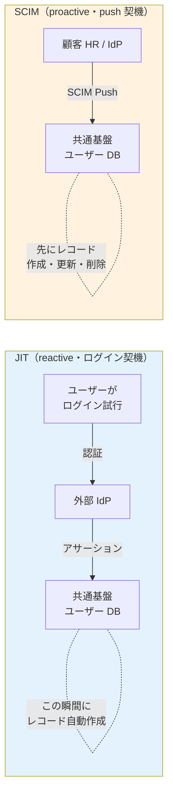
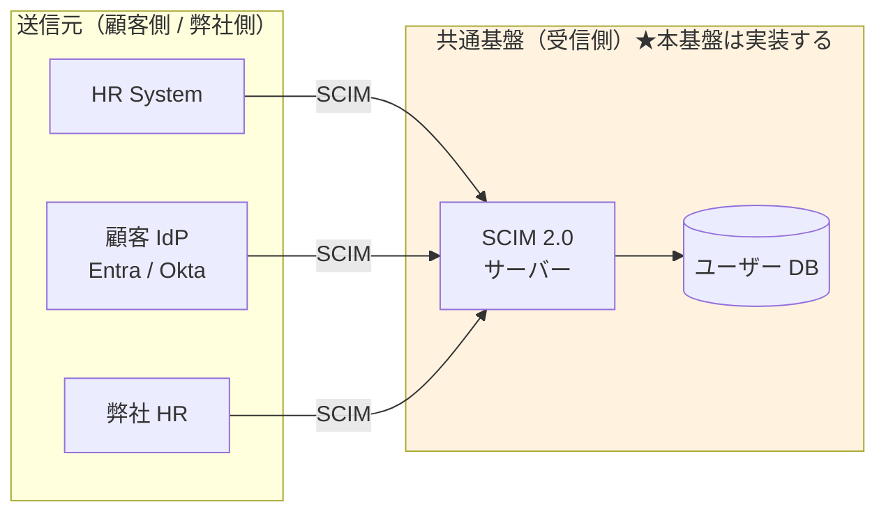
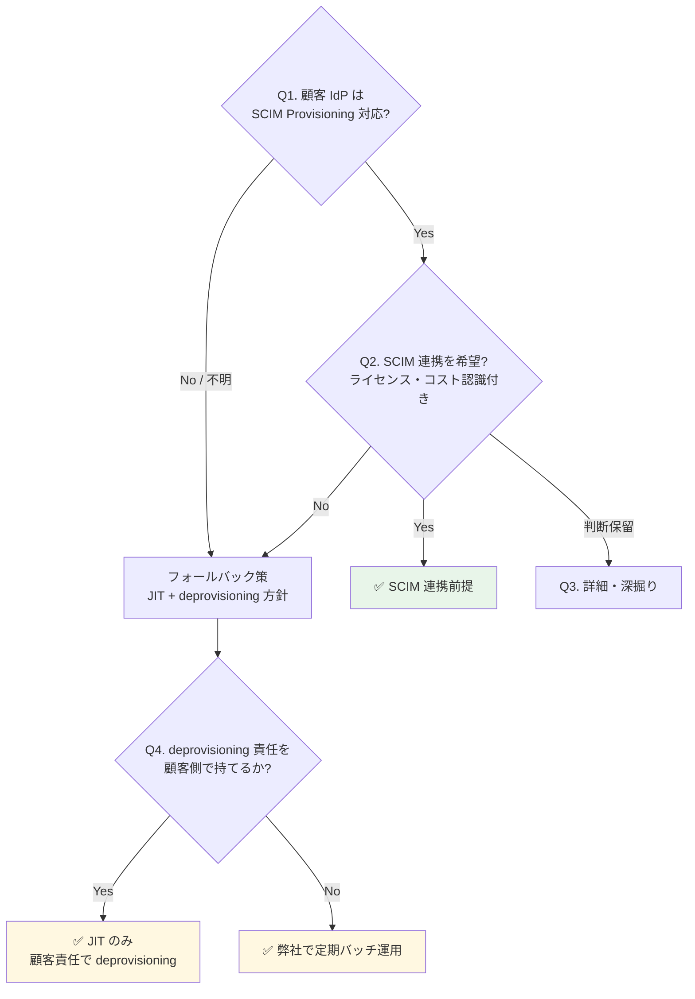

# ADR-025: SCIM 2.0 の位置づけと本基盤の受信スタンス

- **ステータス**: Proposed（要件定義フェーズで Accepted に昇格予定）
- **日付**: 2026-06-15、**2026-07-08 §H 追記**（顧客 IdP が LDAP(s) の場合の JIT/SCIM 扱い）
- **関連**:
  - [§FR-7.4.0 SCIM の位置づけと本基盤のスタンス](../requirements/proposal/fr/07-user.md#fr-740-scim-の位置づけと本基盤のスタンス)
  - [§FR-2.2.1 JIT プロビジョニング](../requirements/proposal/fr/02-federation.md#321-jit-プロビジョニング--fr-fed-008)
  - [ADR-023 ServiceNow SP 連携設計](023-servicenow-sp-integration.md)
  - [common/jit-scim-coexistence-keycloak.md](../common/jit-scim-coexistence-keycloak.md)
  - **[ADR-009 MFA 責任](009-mfa-responsibility-by-idp.md)**（§H.6 LDAP + MFA 論点、2026-07-08 追記）
  - **[ADR-014 認証パターン範囲 K-12 制約](014-auth-patterns-scope.md)**（§H.8 LDAP は Cognito 不可、Keycloak 必須化、2026-07-08 追記）
  - **[ADR-058 認証プラットフォーム比較](058-auth-platform-alternatives-comparison.md)**（§H LDAP 対応可否、2026-07-08 追記）
  - **[ADR-060 §A Log scrubbing / §C Golden 検知](060-auth-protocol-attack-path-residual-tbd.md)**（§H.6 LDAP パスワード転送のマスキング + Golden LDAP 検知 L-GD シグナル追加候補、2026-07-08 追記）

---

## Context

SCIM 2.0 は**ユーザー情報を別システムに自動同期する標準 API**で、OIDC / SAML の認証層とは別レイヤーのプロビジョニング層プロトコル。退職者 deprovisioning / 属性同期 / GDPR 削除権応答を自動化する用途で、エンタープライズ B2B SaaS の標準。

顧客採用判断には次の論点が絡む:
- 「SCIM = SAML 専用」という誤解（実際は OIDC + SCIM が標準パターン）
- 「JIT があれば SCIM 不要」「SCIM があれば JIT 不要」という誤解（両者は補完関係）
- 顧客 IdP の SCIM 対応状況とライセンスコスト
- SCIM 不採用時の deprovisioning 責任所在

---

## Decision

**SCIM 2.0 受信機能（SCIM サーバー）を本基盤で実装する（Must）**。顧客側に SCIM クライアント機能の保有・採用は必須化しない（Should）。「全部 SCIM 可能、顧客選択」アプローチで柔軟性最大化。

JIT と SCIM の使い分け:
- **JIT = 日常運用（ログイン契機の自動作成）**
- **SCIM = 退職者 deprovisioning + 大量変更 + 属性同期**
- **両方併用が標準**（補完関係、排他ではない）

---

## A. SCIM とは（基本）

| 観点 | 内容 |
|---|---|
| 正式名称 | System for Cross-domain Identity Management 2.0（RFC 7643 + RFC 7644）|
| 役割 | ユーザー情報の CRUD を行う REST API 標準（POST/GET/PUT/PATCH/DELETE）|
| 送受信関係 | クライアント（送信元: HR / IdP）→ サーバー（受信先: 本基盤）|
| 典型データ | userName / email / active / name / groups 等の標準スキーマ + 拡張 |

### OIDC / SAML との関係（直交する 2 層）

| 層 | プロトコル | やること |
|---|---|---|
| **認証層** | OIDC / SAML | 「いまログインしようとしているのは誰か」を確認 |
| **プロビジョニング層** | **SCIM** | 「そもそも誰がユーザーとして存在するか」を管理 |

→ **OIDC + SCIM** は標準的な組み合わせ。「SCIM = SAML 専用」は誤解（Entra / Okta / Google はいずれも OIDC + SCIM をセット提供）。

---

## B. JIT と SCIM の比較

| 方式 | やり方 | 強み | 弱み |
|---|---|---|---|
| JIT | OIDC/SAML 初回ログイン時に自動作成 | 事前準備不要 | **退職者の deprovisioning が困難** |
| SCIM | HR/IdP が REST API で push 同期 | 事前作成・自動 deprovisioning・属性同期 | ソース側に SCIM 機能必要 |
| 手動 / バルクインポート | 管理者が UI / CSV で投入 | 簡単 | スケールしない |

### 起動タイミング・方向（混同しやすい点）



| 観点 | JIT | SCIM |
|---|---|---|
| 起動タイミング | ユーザーがログインした瞬間 | HR/IdP で CRUD が起きた瞬間 |
| 方向 | 外部 IdP → 基盤（ログインのついで）| 外部 HR/IdP → 基盤（独立 REST API）|
| 動作タイプ | **reactive**（受け身）| **proactive**（能動・push）|
| 対象操作 | 作成のみ（更新も可だがログイン時のみ）| 作成 / 更新 / 削除すべて |
| 退職者 deprovisioning | ❌ 不可能 | ✅ 可能 |
| プロトコル依存 | OIDC / SAML / LDAP 等何でも可 | RFC 7644（独立 REST API）|
| デフォルト権限付与 | JIT 作成時に IdP アサーションの groups/roles を読む | SCIM ペイロードの groups を読む |

→ **JIT と SCIM は方向は同じ（外部 → 基盤）だが、起動契機・動作タイプが真逆**。**両方併用が標準**。SCIM が無くても JIT は動く。SCIM があっても JIT は無効化しない（IdP 側の SCIM 未対応ユーザーをカバー）。Webhook は方向自体が SCIM と真逆（基盤 → 外部アプリ、[§FR-9.3.0](../requirements/proposal/fr/09-integration.md#fr-930-webhook-の役割と-scimjit-との違い)）で補完関係。

---

## C. 本基盤での JIT / SCIM の使い分け（利用者カテゴリ別）

| カテゴリ | JIT 使用 | SCIM 使用 | 補足 |
|---|---|---|---|
| **P-1 基盤運用管理者** | フェデログイン時（弊社内 IdP）| 弊社 HR から push（任意）| 数十名、手動 + JIT で十分 |
| **P-2 テナント管理者**（顧客 IdP あり）| フェデログイン時 | 顧客 IdP から push（任意）| 数名、JIT で十分なケース多い |
| **P-3 現行で IdP があった従業員** ★主役 | **フェデログイン時（主用途）** | **退職者 deprovisioning に強く推奨** | 数千〜数万、退職者問題が顕在化 |
| **P-4 現行で IdP がなかった従業員**（旧 P-5 ゲスト/外部協力者 統合）| 招待リンク経由 or ローカル | 該当なし（ソース無し）| 手動 + セルフサービス + 招待ベース |

### 「JIT プロビジョニング」と「JIT 管理者」の区別（紛らわしい類似用語）

| 用語 | 何の話 | 関連章 |
|---|---|---|
| **JIT プロビジョニング**（本 ADR）| フェデログイン時のユーザーレコード自動作成 | §FR-2.2.1, §FR-7.4 |
| **JIT 管理者**（別物）| 必要な時間だけ管理者権限を付与する仕組み（Microsoft Entra PIM 等）| §FR-8.3 |

→ 「Just-in-Time」が共通する別概念。前者は**ユーザー**、後者は**権限**の話。

### カテゴリ別の SCIM 成立性

SCIM が機能するには**送信元（source of truth）が必要**:

| カテゴリ | 想定される送信元 | SCIM 成立性 |
|---|---|:---:|
| P-1 基盤運用管理者 | 弊社の HR / 弊社内 IdP | ✅ 成立 |
| P-2 テナント管理者 | 顧客 HR / 顧客 IdP | ✅ 成立 |
| P-3 現行で IdP があった従業員 | 顧客 HR / 顧客 IdP | ✅ **最も成立しやすい** |
| P-4 現行で IdP がなかった従業員（旧 P-5 ゲスト/外部協力者 統合）| 顧客の HR システムが SCIM 対応か? / 招待ベース | ⚠ 顧客 IT 体制次第 / SCIM 概念外 |

---

## D. 「全部 SCIM 強制」vs「全部 SCIM 可能」の 3 アプローチ

| アプローチ | 共通基盤側 | 顧客側 | 採用判断 |
|---|---|---|:---:|
| A. 全顧客 SCIM 強制 | SCIM 実装必須 | 全顧客に SCIM 対応 IdP / 上位ライセンス強制 | ❌ 顧客取得幅が狭まる |
| B. SCIM 不採用、JIT のみ | 実装不要 | なし | ⚠ GDPR / 退職 deprovisioning リスク |
| **C. SCIM 受信実装 + 顧客選択**（**採用**）| 実装する | 利用可否は顧客選択 | ✅ 柔軟性最大 |



→ C 案採用により、**SCIM 対応顧客には自動化メリットを提供しつつ、SCIM 未対応顧客も取り込める**バランスを実現。

---

## E. 顧客への QA 4 段階フロー



| Q# | 質問 | 期待回答 |
|:---:|---|---|
| **Q1（基本）** | 顧客 IdP は SCIM 2.0 Provisioning 対応?（Entra Premium P1+ / Okta 全プラン / Google Cloud Identity Premium 等は標準対応）| Yes / No / 不明 |
| **Q2（採用意思）** | SCIM 連携を採用希望?（顧客側で SCIM 設定 + IdP 上位ライセンス必要）| 採用 / 採用しない / 保留 |
| **Q3（詳細）** | 利用中の IdP 製品とライセンス / HR と IdP の連携状況 / 入退社フロー | 製品名 + 詳細 |
| **Q4（Fallback）** | SCIM 不採用の場合、退職者 deprovisioning 責任を顧客側で持てるか? | 顧客責任 / 弊社サポート希望 |

### 顧客の回答による運用パターン

| 回答パターン | 共通基盤側の運用 | リスク |
|---|---|---|
| Q1 Yes + Q2 採用 | SCIM 自動同期（推奨）| 最小 |
| Q1 Yes + Q2 採用しない | JIT のみ + **契約で deprovisioning 責任を顧客に明示** | 中（契約条件次第）|
| Q1 No（IdP 未対応）| JIT のみ + **弊社による定期バッチ deprovisioning** を提案 | 中（弊社運用コスト微増）|
| Q1 No（IdP なし、ローカル）| ローカル + 手動 + セルフサービス（β/α シナリオ）| 状況次第 |

---

## F. 業界の現在地

### SCIM 2.0 が業界標準化（2026）

- Microsoft Entra が SCIM 2.0 API を GA 化（2026 年）
- **コスト効果**: 手動 $28/user → 自動 $3.50/user（87% 削減）
- **ユーザー価値**: SCIM 採用組織は 90 日でアクティブユーザー数が SAML-only より多い
- **限界**: IT チームの 75-85% の SaaS で依然手動運用

### プロビジョニング方式の使い分け

- **JIT**: 初回 SSO 時の自動作成
- **SCIM 2.0**: ライフサイクル全体（退職時の即時 deprovision 含む）
- **バルクインポート**: 初期移行・大量投入
- **管理者強制操作**: パスワードリセット、即時無効化

---

## G. 対応能力マトリクス（Cognito vs Keycloak）

| 機能 | Cognito | Keycloak (OSS/RHBK) | 備考 |
|---|:---:|:---:|---|
| JIT プロビジョニング | ✅ | ✅ | §FR-2.2.1 |
| **SCIM 2.0**（IdP からの自動連携）| ⚠ **ネイティブ非対応**（自前 Lambda 実装要）| ✅ **プラグイン対応**（標準的）| **大きな差** |
| バルクインポート（CSV / JSON）| ✅ ImportUsers | ✅ Realm Import | 両方 |
| 管理者によるパスワード強制リセット | ✅ AdminSetUserPassword | ✅ Admin Console | 両方標準 |
| 退職時の Deprovision | ⚠ 個別実装（SCIM ない）| ✅ SCIM 経由 | エンタープライズ要件で大差 |
| 監査ログ（プロビ・デプロビ）| ✅ CloudTrail | ⚠ Event Listener | Cognito が楽 |

→ **SCIM 2.0 受信機能は本基盤で実装**。Cognito 採用時は Lambda 自前実装、Keycloak 採用時はプラグイン採用で対応。

---

## H. 顧客 IdP が LDAP(s) の場合の JIT / SCIM 扱い（2026-07-08 追記）

> **背景**：§B〜§G は OIDC / SAML IdP を前提に議論した。LDAP(s) 直結の顧客がいる場合、**動作モデルが根本的に異なる**（Push → Pull）。既存議論からの追記として整理する。

### H.1 LDAP と OIDC/SAML の根本的な違い（Pull vs Push）

| 観点 | **OIDC / SAML** | **LDAP / LDAPS** |
|---|---|---|
| **モデル**| Redirect Push（IdP → Browser → 本基盤）| **Bind Pull**（本基盤 → 顧客 AD に接続 + 検索）|
| **接続方向**| 顧客 IdP → 本基盤（Browser 経由）| **本基盤 → 顧客 AD**（サーバ間 TCP 636）|
| **ネットワーク**| Browser 経由（HTTPS）| **VPN / Direct Connect / VPC Peering** 必要 |
| **プロトコル**| HTTPS + JWT / SAML XML | LDAP v3 + TLS（LDAPS 636）|
| **認証情報の流れ**| IdP でパスワード検証 → 本基盤にトークン | **本基盤経由でパスワードが AD に届く**（bind operation）|
| **セッション**| フェデ後の Cookie / Refresh Token | 都度 bind or Kerberos ticket |
| **本基盤のパスワード知識**| ゼロ（Zero Knowledge 設計）| **メモリに一瞬平文でのる**（LDAP bind の宿命）|

**含意**：LDAP は「本基盤がパスワード転送の中継点」になる → OIDC/SAML と異なるセキュリティモデルが必要（後述 §H.6）。

### H.2 「JIT」の観点：LDAP User Federation が JIT 相当を実現

Keycloak の **LDAP User Federation Provider** が JIT に近い動作をする:

```
初回ログイン時:
1. ユーザーが Keycloak にログイン画面提示
2. Keycloak がユーザー名を受け取り、LDAP に検索 (ldap_search)
3. LDAP からユーザー DN + 属性取得
4. Keycloak が入力パスワードで bind 試行 (ldap_bind)
5. bind 成功 → 認証成立 + Keycloak DB にユーザーレコードキャッシュ
6. 以降は Keycloak DB を SoR として使いつつ、変更は LDAP 側と同期

2 回目以降ログイン:
1. Keycloak DB のキャッシュ + LDAP bind で認証
2. 属性変更があれば LDAP → Keycloak DB 同期
```

**§B の JIT と LDAP User Federation の差**:

| 観点 | OIDC/SAML JIT（§B）| LDAP User Federation |
|---|---|---|
| ユーザー属性のリード | IdP 応答の Assertion / ID Token 属性から | **LDAP `ldap_search` で明示的にリード** |
| 認証の実行場所 | 顧客 IdP 内（本基盤はトークン検証のみ）| **本基盤経由で LDAP bind**（本基盤経由で AD に届く）|
| キャッシュ | User Storage SPI（[ADR-019](019-existing-system-migration.md)）| Keycloak DB に自動キャッシュ（Import Users モード）|
| 変更検知 | ログインの度に上書き | **Sync Interval（バッチ、標準 1 h）or Read-only Sync** |

### H.3 LDAP における「JIT」の 3 モード（Keycloak User Federation 設定）

| モード | 動作 | 用途 |
|---|---|---|
| **Import Users = ON**（推奨、デフォルト）| 初回ログイン時に LDAP から属性を Keycloak DB に取り込み、以降はキャッシュを SoR | JIT 相当、性能◎ |
| Import Users = OFF（Read-only Passthrough）| 毎回 LDAP に問い合わせ、Keycloak DB には保存しない | 顧客が「本基盤にキャッシュを持ちたくない」場合（機微データ配慮）|
| **Full Sync**（バッチ）| 定期的（1 h 標準）に全ユーザーを LDAP から同期 | **SCIM 相当**（後述 §H.4）、退職者 deprovisioning 用 |

### H.4 「SCIM」の観点：LDAP なら **SCIM は基本不要**

SCIM の存在意義は「IdP 側で CRUD が起きた瞬間に本基盤に push」（§A）。LDAP は **本基盤が AD を pull する** モデルなので、以下 2 手段で SCIM 相当を代替できる:

| SCIM の役割 | LDAP での実現方法 |
|---|---|
| 新規ユーザー作成 | LDAP Sync（バッチ）or JIT（初回ログイン時取込）|
| 属性更新 | LDAP Sync（バッチ）or ログイン時の更新検知 |
| **退職者 deprovisioning** | **LDAP Sync（バッチ、必須）**、AD 側で無効化 → Sync で Keycloak も無効化 |
| グループ / ロール変更 | LDAP Group Mapper で自動マッピング + Sync |

**結論**：**LDAP User Federation + Sync Interval 設定で SCIM の役割を代替できる**。SCIM を追加で使う必要はない（併用は可だが冗長）。

#### H.4.A LDAP + SCIM 併用が発生するシナリオ

現実には LDAP + SCIM の**併用**もありうる:

| シナリオ | LDAP 用途 | SCIM 用途 |
|---|---|---|
| **AD 認証 + HR 別ソース** | 認証（bind）| HR → 本基盤の属性 push（部署、ロール等）|
| **段階移行**| 既存 AD 継続 | 新しい HR 統合基盤から先行 SCIM |

→ **「LDAP なら SCIM 一切不要」は誤り**、シナリオ次第で併用あり。ヒアリング B-LDAP-3（§H.7）で確認。

### H.5 利用者カテゴリ別の LDAP 適用（§C 拡張）

| カテゴリ | 想定される顧客構成 | LDAP JIT 成立 | LDAP Sync（SCIM 代替）| SCIM 併用 |
|---|---|:---:|:---:|:---:|
| P-1 基盤運用管理者 | 弊社は AD 使わず Cognito / Keycloak native | — | — | — |
| P-2 テナント管理者 | 顧客がオンプレ AD 運用 | ✅ | ✅（1 h）| 稀 |
| **P-3 現行 IdP あり従業員** ★主役 | **顧客がオンプレ AD 運用（金融/製造/官公庁で頻出）**| ✅ | ✅（**5 min 推奨、退職者速報**）| HR 別ソース時のみ |
| P-4 現行 IdP なし従業員 | 該当なし（AD がない前提）| — | — | — |

### H.6 セキュリティ・ネットワーク要件（LDAP 特有）

#### H.6.1 接続要件

| 項目 | 要件 |
|---|---|
| **プロトコル**| **LDAPS（TCP 636）必須**、Plain LDAP（389）は禁止 |
| TLS バージョン | TLS 1.2 以上（1.3 推奨）|
| 証明書 | 顧客 AD の CA 証明書を Keycloak Truststore に登録 |
| **ネットワーク経路**| **Direct Connect / VPN / VPC Peering 経由**（Public LDAPS はまずない）|
| 認証 | Bind DN + Password（Service Account）or Kerberos（SASL bind）|

#### H.6.2 OIDC/SAML と異なるセキュリティ論点

| 論点 | LDAP 特有の考慮 |
|---|---|
| **パスワードが本基盤経由**| 本基盤サーバは「MITM 位置」にある、TLS 終端後はメモリに平文 → **Log scrubbing 必須**（[ADR-060 §A](060-auth-protocol-attack-path-residual-tbd.md)）|
| **Service Account 権限**| 検索用の bind DN は AD の Domain Admin 相当権限が必要になりがち → **最小権限化必須**（Read-only + 限定 OU）|
| **AD 側 MFA との整合**| AD 側 MFA（Duo / Windows Hello 等）は LDAP bind では検証されない → **本基盤側で追加 MFA 必須**（[ADR-009](009-mfa-responsibility-by-idp.md)）|
| **Kerberos / GSSAPI 対応**| Windows デスクトップ SSO 要件時、Keycloak + KDC 連携必要（Phase 2 候補）|
| **Golden LDAP 検知**| Service Account 乗っ取りは [ADR-060 §C](060-auth-protocol-attack-path-residual-tbd.md) の Golden 系検知に**新シグナル追加が必要**（bind DN の異常アクセス、L-GD シグナル）|
| **Egress 通信の監査**| 本基盤 → 顧客 AD の outbound 通信を Network Firewall + VPC Flow Log で監視 |

### H.7 Keycloak 実装：LDAP User Federation Provider 設定

**[§C-7.3.4.4 Custom SPIs](../requirements/proposal/common/07-implementation-architecture.md#c-7-3-4-4-custom-spi)** の User Storage SPI に相当（Keycloak 標準実装、追加開発不要）:

```
User Federation Provider: ldap
Vendor: Active Directory / Red Hat DS / Tivoli / etc.
Connection URL: ldaps://ad.customer.example.com:636
Bind Type: simple / GSSAPI (Kerberos)
Users DN: ou=users,dc=customer,dc=example,dc=com
Username LDAP attribute: sAMAccountName / uid
Sync Mode: FORCE / IMPORT
Import Users: ON (推奨)
Sync Registrations: OFF (Keycloak → LDAP 書込禁止、Read-Only 運用)
Batch Size: 1000
Full Sync Period: 3600 (1h、標準) or 300 (5min、金融/規制業界)
Changed Users Sync Period: 300 (5min)
```

**主要マッパー**：
- **User Attribute Mapper**：LDAP `cn` → Keycloak `firstName+lastName` 等
- **Group Mapper**：LDAP `memberOf` → Keycloak Groups / Roles
- **msad-user-account-control Mapper**（AD 特化）：AD 側の Disabled 状態を Keycloak に反映

### H.8 Cognito 不可の理由（改めて確認）

[ADR-014 K-12 制約](014-auth-patterns-scope.md) と [ADR-058 §比較](058-auth-platform-alternatives-comparison.md):

- **Cognito は User Pool 内 or 外部 IdP（OIDC/SAML）のみ**
- **LDAP 直結の User Federation は存在しない**
- 代替案：ADFS 経由で SAML 化 or AWS Directory Service AD Connector + Managed AD を挟むが**遅延・コスト・複雑化**

→ **LDAP 要件がある = Cognito 不可 = Keycloak 必須化**（[マスター表 B 列 Y γ 判定](../requirements/hearing-checklist.md) と整合）。

### H.9 論点 / TBD

以下は既存 ADR/ドキュメントでもカバーされていない、LDAP + JIT/SCIM 特化の論点:

| # | 論点 | 現状 |
|---|---|---|
| **L-1** | AD 側 MFA との整合方針（Duo / Windows Hello）| [ADR-009](009-mfa-responsibility-by-idp.md) で「パスワード管理側に帰属」だが、AD 側 MFA を LDAP bind で検証する方法が未整理、**本基盤側で追加 MFA が現実解** |
| **L-2** | LDAP Sync 頻度の推奨値（退職者 deprovisioning 遅延）| 現状 1 h デフォルト、規制業界は 5 min 推奨（本セクションで暫定明示）|
| **L-3** | Kerberos / GSSAPI 対応（Windows デスクトップ SSO）| §C-7.3.4 で言及なし、**Phase 2 候補** |
| **L-4** | AD 側 Password Policy との整合（Keycloak Password Policy との重複）| どちらを SoT にするか未確定、**基本は AD 側 SoT を尊重、Keycloak Policy は無効化推奨** |
| **L-5** | LDAP + [ADR-060 §C Golden 検知] 連動 | Golden LDAP（Service Account 乗っ取り）検知シグナル追加が必要（L-GD シグナル、ADR-060 §C.2 拡張候補）|
| **L-6** | 本基盤 → 顧客 AD への Egress 通信の監査 | Network Firewall / VPC Flow Log 設定要件（[ADR-039 v2](039-centralized-network-account-edge-layer.md) で LDAP egress 経路の追記が必要）|
| **L-7** | LDAP の「Just-in-Time」と OIDC/SAML の「JIT」の用語混乱 | 本 §H で明示的に区別、他ドキュメントでも同様の注記推奨 |

### H.10 ヒアリング項目追加候補

| 項目 | 記号 | 対象 | 内容 |
|---|---|---|---|
| LDAP 直結の有無 | B-LDAP-1 | 顧客 | 既存の LDAP / AD 直結要件（マスター表 B 列 Y γ と統合、既存の B-IdP-Protocol-2 補完）|
| LDAP Sync 頻度要件 | B-LDAP-2 | 顧客（金融/規制業界）| 退職者 deprovisioning の必要遅延（1 h / 5 min / リアルタイム）|
| SCIM 併用要否 | B-LDAP-3 | 顧客 | HR 別ソースからの SCIM 併用が必要か |
| AD 側 MFA 要件 | B-LDAP-4 | 顧客 | Duo / Windows Hello 等の MFA 実装、本基盤側で追加必要か |
| Kerberos SSO 要件 | B-LDAP-5 | 顧客（オンプレ Windows 環境）| Windows デスクトップからの seamless SSO 要否（Phase 2 候補）|
| LDAP Bind Service Account 権限 | B-LDAP-6 | 顧客 AD 管理者 | Read-only + 限定 OU 権限で発行可能か |
| ネットワーク経路 | B-LDAP-7 | 顧客ネットワーク管理者 | Direct Connect / VPN / VPC Peering の想定 |

### H.11 §H まとめ

- **LDAP は OIDC/SAML と根本的に違う（Pull vs Push、Bind vs Redirect）**
- **JIT 相当は Keycloak LDAP User Federation で自動実現**（Import Users = ON）
- **SCIM は基本不要**、LDAP Sync（バッチ）で退職者 deprovisioning を代替、HR 別ソース時のみ SCIM 併用
- **セキュリティ設計が変わる**：本基盤経由でパスワード転送 + 本基盤側 MFA 必須 + Log scrubbing 必須
- **Cognito 不可、Keycloak 必須化**（[マスター表 B 列 Y γ](../requirements/hearing-checklist.md) 判定と整合）
- **B-LDAP-1〜7 ヒアリング項目起票**（§H.10）+ **L-1〜L-7 論点整理**（§H.9）

### H.12 顧客説明で使える一言

> **「顧客 IdP が LDAP(s) の場合、SCIM は基本不要です。Keycloak の LDAP User Federation で JIT + Sync が自動実現し、退職者の deprovisioning は Sync 頻度で調整（5 分〜1 時間）。**ただし本基盤経由でパスワードが AD に届くので、Log scrubbing + 本基盤側追加 MFA + Bind Service Account 最小権限が必須**。Cognito は LDAP 直結非対応のため、この要件があれば Keycloak 必須化になります。」**

---

## Consequences

### Positive

- 顧客の IdP / SCIM 対応状況に関わらず受け入れ可能（C アプローチで柔軟性最大）
- 退職者 deprovisioning の業界標準パターン提供
- 87% コスト削減効果（業界調査）
- JIT との補完関係明示で誤解回避
- **§H 追記により LDAP(s) 直結顧客の JIT/SCIM 扱いを明確化**（2026-07-08）

### Negative

- Cognito 採用時は Lambda 自前実装の保守負荷
- Q1 No（IdP 未対応）顧客向けに弊社定期バッチ運用が必要
- 顧客側の SCIM 設定・上位ライセンス前提（採用希望時）
- プラットフォーム選定で Keycloak がやや有利（SCIM 標準対応）
- **§H LDAP 対応でパスワード転送経由となるため、Log scrubbing + 追加 MFA + Bind SA 最小権限化の運用オーバヘッド**（2026-07-08）

---

## 参考資料

- [RFC 7643 SCIM Core Schema](https://datatracker.ietf.org/doc/html/rfc7643)
- [RFC 7644 SCIM Protocol](https://datatracker.ietf.org/doc/html/rfc7644)
- [Microsoft Entra SCIM 2.0 API GA（2026）](https://techcommunity.microsoft.com/blog/microsoft-entra-blog/microsoft-entra-expands-scim-support-with-new-scim-2-0-apis-for-identity-lifecyc/4507465)
- [Phase Two SCIM for Keycloak](https://phasetwo.io/scim/)
- [common/jit-scim-coexistence-keycloak.md](../common/jit-scim-coexistence-keycloak.md) — Keycloak 実装詳細
- [Keycloak Server Administration Guide - LDAP and Active Directory](https://www.keycloak.org/docs/latest/server_admin/#_ldap) — §H LDAP User Federation の一次資料
- [RFC 4511 LDAPv3](https://datatracker.ietf.org/doc/html/rfc4511)（§H LDAP プロトコル）
- [RFC 4513 LDAPv3 Authentication Methods](https://datatracker.ietf.org/doc/html/rfc4513)（§H bind operation）
- [Microsoft AD LDAPS 設定ガイド](https://learn.microsoft.com/en-us/troubleshoot/windows-server/certificates-and-public-key-infrastructure-pki/enable-ldap-over-ssl-3rd-certification-authority)（§H LDAPS 設定）
