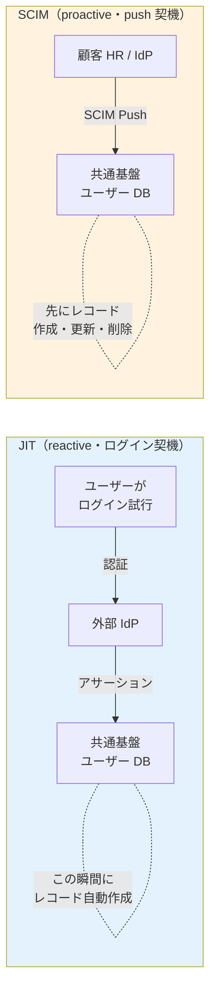
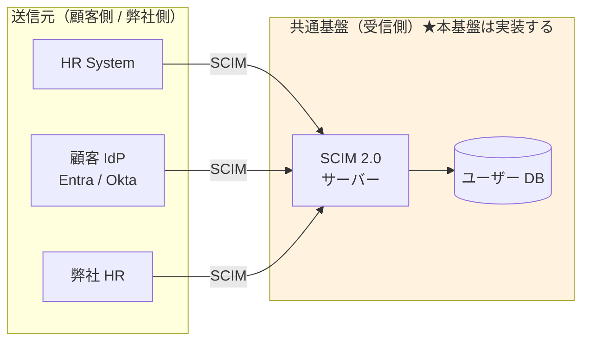
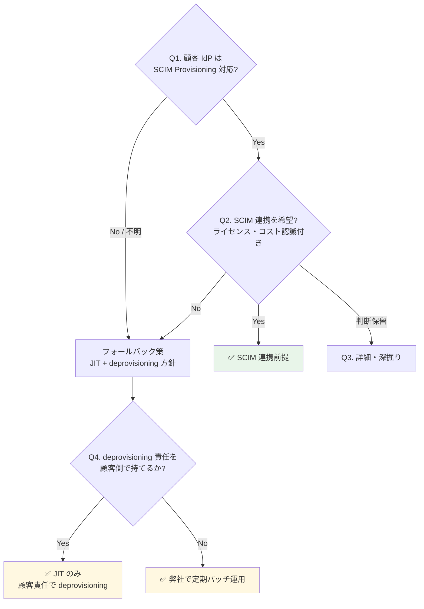

# ADR-025: SCIM 2.0 の位置づけと本基盤の受信スタンス

- **ステータス**: Proposed（要件定義フェーズで Accepted に昇格予定）
- **日付**: 2026-06-15
- **関連**:
  - [§FR-7.4.0 SCIM の位置づけと本基盤のスタンス](../requirements/proposal/fr/07-user.md#fr-740-scim-の位置づけと本基盤のスタンス)
  - [§FR-2.2.1 JIT プロビジョニング](../requirements/proposal/fr/02-federation.md#321-jit-プロビジョニング--fr-fed-008)
  - [ADR-023 ServiceNow SP 連携設計](023-servicenow-sp-integration.md)
  - [common/jit-scim-coexistence-keycloak.md](../common/jit-scim-coexistence-keycloak.md)

---

## Context

SCIM 2.0 は**ユーザー情報を別システムに自動同期する標準 API**で、OIDC / SAML の認証層とは別レイヤーのプロビジョニング層プロトコル。退職者 deprovisioning / 属性同期 / GDPR 削除権応答を自動化する用途で、エンタープライズ B2B SaaS の標準。

顧客採用判断には次の論点が絡む:
- 「SCIM = SAML 専用」という誤解（実際は OIDC + SCIM が標準パターン）
- 「JIT があれば SCIM 不要」「SCIM があれば JIT 不要」という誤解（両者は補完関係）
- 顧客 IdP の SCIM 対応状況とライセンスコスト
- SCIM 不採用時の deprovisioning 責任所在

---

## Decision

**SCIM 2.0 受信機能（SCIM サーバー）を本基盤で実装する（Must）**。顧客側に SCIM クライアント機能の保有・採用は必須化しない（Should）。「全部 SCIM 可能、顧客選択」アプローチで柔軟性最大化。

JIT と SCIM の使い分け:
- **JIT = 日常運用（ログイン契機の自動作成）**
- **SCIM = 退職者 deprovisioning + 大量変更 + 属性同期**
- **両方併用が標準**（補完関係、排他ではない）

---

## A. SCIM とは（基本）

| 観点 | 内容 |
|---|---|
| 正式名称 | System for Cross-domain Identity Management 2.0（RFC 7643 + RFC 7644）|
| 役割 | ユーザー情報の CRUD を行う REST API 標準（POST/GET/PUT/PATCH/DELETE）|
| 送受信関係 | クライアント（送信元: HR / IdP）→ サーバー（受信先: 本基盤）|
| 典型データ | userName / email / active / name / groups 等の標準スキーマ + 拡張 |

### OIDC / SAML との関係（直交する 2 層）

| 層 | プロトコル | やること |
|---|---|---|
| **認証層** | OIDC / SAML | 「いまログインしようとしているのは誰か」を確認 |
| **プロビジョニング層** | **SCIM** | 「そもそも誰がユーザーとして存在するか」を管理 |

→ **OIDC + SCIM** は標準的な組み合わせ。「SCIM = SAML 専用」は誤解（Entra / Okta / Google はいずれも OIDC + SCIM をセット提供）。

---

## B. JIT と SCIM の比較

| 方式 | やり方 | 強み | 弱み |
|---|---|---|---|
| JIT | OIDC/SAML 初回ログイン時に自動作成 | 事前準備不要 | **退職者の deprovisioning が困難** |
| SCIM | HR/IdP が REST API で push 同期 | 事前作成・自動 deprovisioning・属性同期 | ソース側に SCIM 機能必要 |
| 手動 / バルクインポート | 管理者が UI / CSV で投入 | 簡単 | スケールしない |

### 起動タイミング・方向（混同しやすい点）

| 観点 | JIT | SCIM |
|---|---|---|
| 起動タイミング | ユーザーがログインした瞬間 | HR/IdP で CRUD が起きた瞬間 |
| 方向 | 外部 IdP → 基盤（ログインのついで）| 外部 HR/IdP → 基盤（独立 REST API）|
| 動作タイプ | **reactive**（受け身）| **proactive**（能動・push）|
| 対象操作 | 作成のみ（更新も可だがログイン時のみ）| 作成 / 更新 / 削除すべて |
| 退職者 deprovisioning | ❌ 不可能 | ✅ 可能 |
| プロトコル依存 | OIDC / SAML / LDAP 等何でも可 | RFC 7644（独立 REST API）|
| デフォルト権限付与 | JIT 作成時に IdP アサーションの groups/roles を読む | SCIM ペイロードの groups を読む |

→ **JIT と SCIM は方向は同じ（外部 → 基盤）だが、起動契機・動作タイプが真逆**。**両方併用が標準**。SCIM が無くても JIT は動く。SCIM があっても JIT は無効化しない（IdP 側の SCIM 未対応ユーザーをカバー）。Webhook は方向自体が SCIM と真逆（基盤 → 外部アプリ、[§FR-9.3.0](../requirements/proposal/fr/09-integration.md#fr-930-webhook-の役割と-scimjit-との違い)）で補完関係。

---

## C. 本基盤での JIT / SCIM の使い分け（利用者カテゴリ別）

| カテゴリ | JIT 使用 | SCIM 使用 | 補足 |
|---|---|---|---|
| **P-1 基盤運用管理者** | フェデログイン時（弊社内 IdP）| 弊社 HR から push（任意）| 数十名、手動 + JIT で十分 |
| **P-2 テナント管理者**（顧客 IdP あり）| フェデログイン時 | 顧客 IdP から push（任意）| 数名、JIT で十分なケース多い |
| **P-3 現行で IdP があった従業員** ★主役 | **フェデログイン時（主用途）** | **退職者 deprovisioning に強く推奨** | 数千〜数万、退職者問題が顕在化 |
| **P-4 現行で IdP がなかった従業員**（旧 P-5 ゲスト/外部協力者 統合）| 招待リンク経由 or ローカル | 該当なし（ソース無し）| 手動 + セルフサービス + 招待ベース |

### 「JIT プロビジョニング」と「JIT 管理者」の区別（紛らわしい類似用語）

| 用語 | 何の話 | 関連章 |
|---|---|---|
| **JIT プロビジョニング**（本 ADR）| フェデログイン時のユーザーレコード自動作成 | §FR-2.2.1, §FR-7.4 |
| **JIT 管理者**（別物）| 必要な時間だけ管理者権限を付与する仕組み（Microsoft Entra PIM 等）| §FR-8.3 |

→ 「Just-in-Time」が共通する別概念。前者は**ユーザー**、後者は**権限**の話。

### カテゴリ別の SCIM 成立性

SCIM が機能するには**送信元（source of truth）が必要**:

| カテゴリ | 想定される送信元 | SCIM 成立性 |
|---|---|:---:|
| P-1 基盤運用管理者 | 弊社の HR / 弊社内 IdP | ✅ 成立 |
| P-2 テナント管理者 | 顧客 HR / 顧客 IdP | ✅ 成立 |
| P-3 現行で IdP があった従業員 | 顧客 HR / 顧客 IdP | ✅ **最も成立しやすい** |
| P-4 現行で IdP がなかった従業員（旧 P-5 ゲスト/外部協力者 統合）| 顧客の HR システムが SCIM 対応か? / 招待ベース | ⚠ 顧客 IT 体制次第 / SCIM 概念外 |

---

## D. 「全部 SCIM 強制」vs「全部 SCIM 可能」の 3 アプローチ

| アプローチ | 共通基盤側 | 顧客側 | 採用判断 |
|---|---|---|:---:|
| A. 全顧客 SCIM 強制 | SCIM 実装必須 | 全顧客に SCIM 対応 IdP / 上位ライセンス強制 | ❌ 顧客取得幅が狭まる |
| B. SCIM 不採用、JIT のみ | 実装不要 | なし | ⚠ GDPR / 退職 deprovisioning リスク |
| **C. SCIM 受信実装 + 顧客選択**（**採用**）| 実装する | 利用可否は顧客選択 | ✅ 柔軟性最大 |

→ C 案採用により、**SCIM 対応顧客には自動化メリットを提供しつつ、SCIM 未対応顧客も取り込める**バランスを実現。

---

## E. 顧客への QA 4 段階フロー

| Q# | 質問 | 期待回答 |
|:---:|---|---|
| **Q1（基本）** | 顧客 IdP は SCIM 2.0 Provisioning 対応?（Entra Premium P1+ / Okta 全プラン / Google Cloud Identity Premium 等は標準対応）| Yes / No / 不明 |
| **Q2（採用意思）** | SCIM 連携を採用希望?（顧客側で SCIM 設定 + IdP 上位ライセンス必要）| 採用 / 採用しない / 保留 |
| **Q3（詳細）** | 利用中の IdP 製品とライセンス / HR と IdP の連携状況 / 入退社フロー | 製品名 + 詳細 |
| **Q4（Fallback）** | SCIM 不採用の場合、退職者 deprovisioning 責任を顧客側で持てるか? | 顧客責任 / 弊社サポート希望 |

### 顧客の回答による運用パターン

| 回答パターン | 共通基盤側の運用 | リスク |
|---|---|---|
| Q1 Yes + Q2 採用 | SCIM 自動同期（推奨）| 最小 |
| Q1 Yes + Q2 採用しない | JIT のみ + **契約で deprovisioning 責任を顧客に明示** | 中（契約条件次第）|
| Q1 No（IdP 未対応）| JIT のみ + **弊社による定期バッチ deprovisioning** を提案 | 中（弊社運用コスト微増）|
| Q1 No（IdP なし、ローカル）| ローカル + 手動 + セルフサービス（β/α シナリオ）| 状況次第 |

---

## F. 業界の現在地

### SCIM 2.0 が業界標準化（2026）

- Microsoft Entra が SCIM 2.0 API を GA 化（2026 年）
- **コスト効果**: 手動 $28/user → 自動 $3.50/user（87% 削減）
- **ユーザー価値**: SCIM 採用組織は 90 日でアクティブユーザー数が SAML-only より多い
- **限界**: IT チームの 75-85% の SaaS で依然手動運用

### プロビジョニング方式の使い分け

- **JIT**: 初回 SSO 時の自動作成
- **SCIM 2.0**: ライフサイクル全体（退職時の即時 deprovision 含む）
- **バルクインポート**: 初期移行・大量投入
- **管理者強制操作**: パスワードリセット、即時無効化

---

## G. 対応能力マトリクス（Cognito vs Keycloak）

| 機能 | Cognito | Keycloak (OSS/RHBK) | 備考 |
|---|:---:|:---:|---|
| JIT プロビジョニング | ✅ | ✅ | §FR-2.2.1 |
| **SCIM 2.0**（IdP からの自動連携）| ⚠ **ネイティブ非対応**（自前 Lambda 実装要）| ✅ **プラグイン対応**（標準的）| **大きな差** |
| バルクインポート（CSV / JSON）| ✅ ImportUsers | ✅ Realm Import | 両方 |
| 管理者によるパスワード強制リセット | ✅ AdminSetUserPassword | ✅ Admin Console | 両方標準 |
| 退職時の Deprovision | ⚠ 個別実装（SCIM ない）| ✅ SCIM 経由 | エンタープライズ要件で大差 |
| 監査ログ（プロビ・デプロビ）| ✅ CloudTrail | ⚠ Event Listener | Cognito が楽 |

→ **SCIM 2.0 受信機能は本基盤で実装**。Cognito 採用時は Lambda 自前実装、Keycloak 採用時はプラグイン採用で対応。

---

## Consequences

### Positive

- 顧客の IdP / SCIM 対応状況に関わらず受け入れ可能（C アプローチで柔軟性最大）
- 退職者 deprovisioning の業界標準パターン提供
- 87% コスト削減効果（業界調査）
- JIT との補完関係明示で誤解回避

### Negative

- Cognito 採用時は Lambda 自前実装の保守負荷
- Q1 No（IdP 未対応）顧客向けに弊社定期バッチ運用が必要
- 顧客側の SCIM 設定・上位ライセンス前提（採用希望時）
- プラットフォーム選定で Keycloak がやや有利（SCIM 標準対応）

---

## 参考資料

- [RFC 7643 SCIM Core Schema](https://datatracker.ietf.org/doc/html/rfc7643)
- [RFC 7644 SCIM Protocol](https://datatracker.ietf.org/doc/html/rfc7644)
- [Microsoft Entra SCIM 2.0 API GA（2026）](https://techcommunity.microsoft.com/blog/microsoft-entra-blog/microsoft-entra-expands-scim-support-with-new-scim-2-0-apis-for-identity-lifecyc/4507465)
- [Phase Two SCIM for Keycloak](https://phasetwo.io/scim/)
- [common/jit-scim-coexistence-keycloak.md](../common/jit-scim-coexistence-keycloak.md) — Keycloak 実装詳細
