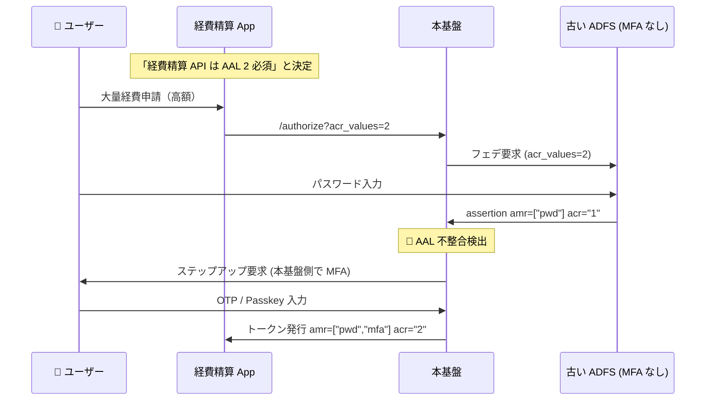
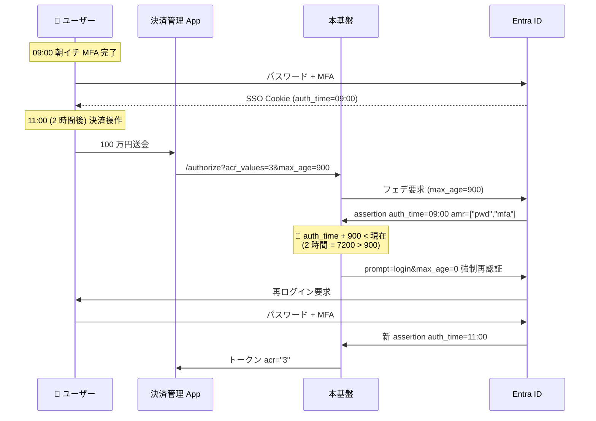
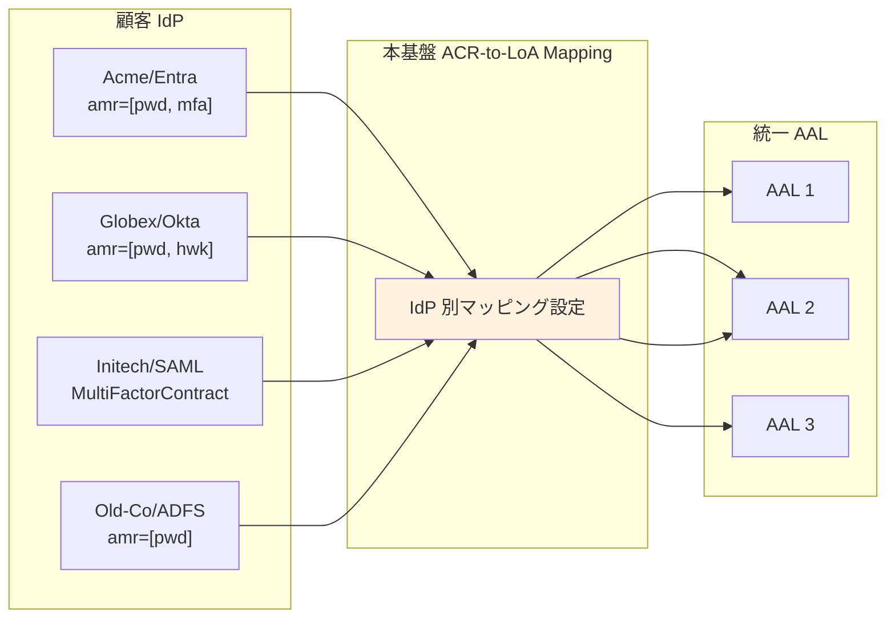
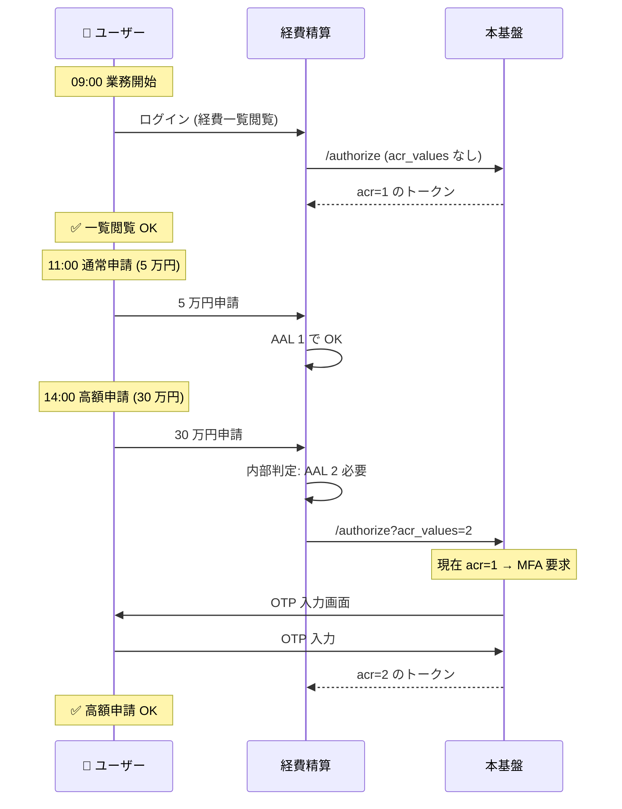

# ADR-026: AAL 不整合の具体例とステップアップ MFA 設計

- **ステータス**: Proposed（要件定義フェーズで Accepted に昇格予定）
- **日付**: 2026-06-15
- **関連**:
  - [§FR-3.3.A AAL 不整合の具体例とフロー](../requirements/proposal/fr/03-mfa.md#fr-33a-aal-不整合の具体例とフロー)
  - [§FR-4.2 クロス IdP SSO リスク 4](../requirements/proposal/fr/04-sso.md#リスク-4-aal-不整合)
  - [common/jit-scim-coexistence-keycloak.md §10.8](../common/jit-scim-coexistence-keycloak.md)

---

## Context

「外部 IdP の AAL レベルが本基盤の要求と一致しない」場合の典型シナリオが複数あり、放置すると弱い IdP 経路で高セキュリティ操作が通る重大なリスクが発生する。RFC 9470 ステップアップ認証の業界標準パターンを本基盤でどう実装するか確定が必要。

---

## Decision

**ステップアップ MFA を業界標準として採用**（A 案：本基盤側で不足分を補う）。`acr_values` で要求 AAL を宣言、本基盤が IdP のクレームをマッピングし、不足時に追加 MFA を要求する。

---

## A. AAL レベルの定義（NIST SP 800-63B Rev 4）

| レベル | 必要な認証要素 | 例 |
|:---:|---|---|
| AAL 1 | 単一要素（パスワードのみ）| ID + パスワード |
| AAL 2 | 多要素（パスワード + 何か）| パスワード + OTP / Push / SMS |
| AAL 3 | Phishing-resistant 多要素（暗号鍵ベース）| パスワード + Hardware Key / Passkey |

### OIDC で AAL を表現するクレーム

| クレーム | 役割 | 値の例 |
|---|---|---|
| **`acr`** | 認証の保証レベル | `"0"` / `"1"` / `"2"` / `"3"` |
| **`amr`** | 認証方法のリスト | `["pwd"]` / `["pwd", "mfa"]` / `["hwk"]` |
| **`auth_time`** | 認証時刻 | `1730000000` |

---

## B. シナリオ 1: 本基盤は AAL 2 要求、顧客 IdP は AAL 1 のみ（不整合の典型）



### 対応の 3 つの選択肢

| 選択肢 | 内容 | 推奨度 | リスク / コスト |
|:---:|---|:---:|---|
| **A 本基盤側でステップアップ MFA** | Hub が追加で OTP / Passkey 要求 → 不足分を補う | ✅ **推奨** | UX 1 ステップ追加 |
| B AAL 無視して通す | acr 検査せずトークン発行 | ❌ | 🚨 コンプラ違反 |
| C エラー返却 | 「顧客 IdP に MFA を設定してください」 | △ | UX 悪化、顧客クレーム |

→ **A が現実解**。本基盤側で「不足分を補う」MFA を提供することで、顧客 IdP の AAL 実装差異を吸収できる。

---

## C. シナリオ 2: IdP は MFA 済みだが古すぎる auth_time



→ **「2 時間前の MFA 認証で 100 万円送金は危ない」を防ぐ仕組み**。`max_age` がない（Cognito）と、IdP セッション TTL（8 時間）までは古い認証で通る。

---

## D. シナリオ 3: 複数 IdP で AAL 表現が違う（標準化問題）

各 IdP は `amr` / `AuthnContext` を独自命名で返す:

| 顧客 | IdP | 認証方法 | `amr` の値 | 本基盤側のマッピング |
|---|---|---|---|---|
| Acme | Entra ID | パスワード + MFA | `["pwd", "mfa"]` | → AAL 2 |
| Globex | Okta | パスワード + WebAuthn | `["pwd", "hwk"]` | → AAL 3 |
| Initech | 自社 SAML | パスワード + OTP | `urn:oasis:names:tc:SAML:2.0:ac:classes:MultiFactorContract` | → AAL 2 |
| Old-Co | レガシー ADFS | パスワードのみ | `["pwd"]` | → AAL 1 |

→ **本基盤の ACR-to-LoA Mapping でこの差異を正規化**:



→ 各アプリは「`acr=2` 必須」とだけ宣言すれば、本基盤が裏で全 IdP の方言を AAL に変換。

---

## E. シナリオ 4: 段階的なステップアップ（最も実用的）



→ **「操作の重要度に応じて段階的に認証を強化」**。NIST SP 800-63B Rev 4 が推奨する標準パターン。

---

## F. プラットフォーム別の実装イメージ

### Keycloak（宣言的・標準対応）

```
[1] Admin Console > Realm Settings > Authentication
    → ACR to LoA Mapping を設定
    例: acr "2" → loa 1 (AAL 2 相当)
        acr "3" → loa 2 (AAL 3 相当)

[2] IdP 接続設定で「この IdP の amr=mfa → AAL 2」をマッピング

[3] Client Settings > Advanced > Authentication Flow Overrides
    → Step-up Flow を選択

[4] アプリから acr_values=2 で要求 → Keycloak が自動判定 + ステップアップ
```

### Cognito（Lambda 自前実装）

```python
# Pre Token Generation Lambda V2
def lambda_handler(event, context):
    requested_acr = parse_acr_from_state(event)
    idp_amr = event['request']['userAttributes'].get('cognito:idp_amr', [])

    current_aal = 1
    if 'mfa' in idp_amr:
        current_aal = 2
    if 'hwk' in idp_amr or 'webauthn' in idp_amr:
        current_aal = 3

    if requested_acr and current_aal < int(requested_acr):
        # Cognito ではここでフロー開始不可
        # 代替: クレーム注入 + アプリ側で別 Custom Auth Challenge 起動
        event['response']['claimsOverrideDetails'] = {
            'claimsToAddOrOverride': {
                'needs_stepup': 'true',
                'current_aal': str(current_aal)
            }
        }
    return event
```

→ **Cognito は Pre Token Lambda V2 でクレーム注入 → アプリ側で別 Custom Auth Challenge 起動という 2 段階実装が必要**。Keycloak なら Realm Settings の宣言的設定で完結。

---

## G. 不整合を放置すると何が起きるか（脅威モデル）

| 放置時のリスク | 具体例 |
|---|---|
| 弱い IdP の経路で高セキュリティ操作 | Old-Co（パスワードのみ）の従業員が、本来 AAL 2 必須の機能にアクセス可 |
| フィッシング被害の伝播 | IdP セッションが奪取されても、本基盤側で AAL 検証していれば高セキュ操作は防げる |
| コンプライアンス違反 | PCI DSS / NIST 準拠を謳いながら実態は AAL 1 で運用 |
| MFA バイパス | `amr` 値の偽装（[§FR-4.2 リスク 3](../requirements/proposal/fr/04-sso.md#リスク-3-amr-偽装)）と組み合わさると致命的 |
| 規制業種顧客の獲得不能 | 金融・医療顧客が AAL 整合性を契約条件にする場合、対応不可 |

---

## H. 本基盤での推奨設計

| 項目 | 推奨 |
|---|---|
| **デフォルト要求 AAL** | AAL 1（業務系標準）|
| **重要操作**（決済 / 管理画面 / 大量データ出力）| AAL 2 要求、ステップアップで対応 |
| **金融・規制業種顧客** | AAL 3 要求、Phishing-resistant 必須 |
| **IdP 接続時の AAL 評価** | 接続承認時に「この IdP は何の AAL まで出せるか」を契約に明記 |
| **AAL 不足時の挙動** | **本基盤側でステップアップ MFA**（拒否でなく補完）|
| **`auth_time` 制約** | 高セキュ操作は `max_age` 15 分 / AAL 3 は 5 分推奨 |

---

## Consequences

### Positive

- 顧客 IdP の AAL 実装差異を本基盤で吸収できる
- 各アプリは `acr_values` 宣言のみで AAL 管理可能
- NIST SP 800-63B Rev 4 標準の段階的ステップアップを実現
- 金融・規制業種顧客の獲得に必要な機能を確保

### Negative

- Cognito 採用時は Pre Token Lambda V2 + アプリ側 Custom Auth Challenge の 2 段階実装が必要（保守負荷）
- IdP 別の amr → AAL マッピング設定が顧客数比例で増加
- ステップアップ UX が顧客に「2 回ログイン感」として伝わるリスク（§FR-2.3.3.A の 2 回ログイン対策と整合）

---

## 参考資料

- [NIST SP 800-63B Rev 4](https://nvlpubs.nist.gov/nistpubs/SpecialPublications/NIST.SP.800-63B-4.pdf) — AAL レベル定義
- [RFC 9470 OAuth 2.0 Step Up Authentication Challenge Protocol](https://datatracker.ietf.org/doc/html/rfc9470)
- [Keycloak Step-up Authentication](https://www.keycloak.org/docs/latest/server_admin/index.html#_step-up-flow)
- [Cognito Pre Token Generation Lambda V2](https://docs.aws.amazon.com/cognito/latest/developerguide/user-pool-lambda-pre-token-generation.html)
