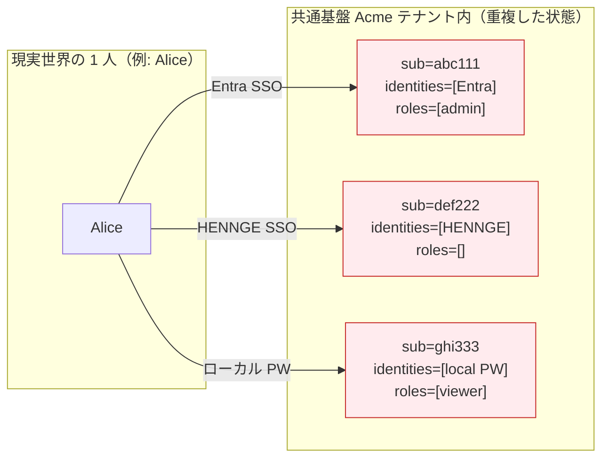
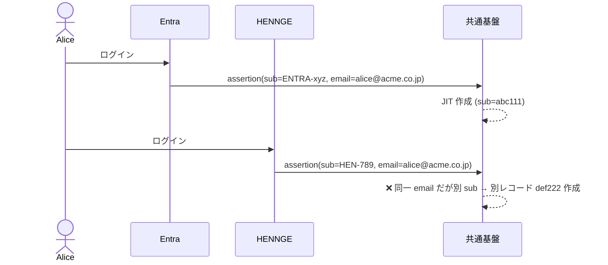
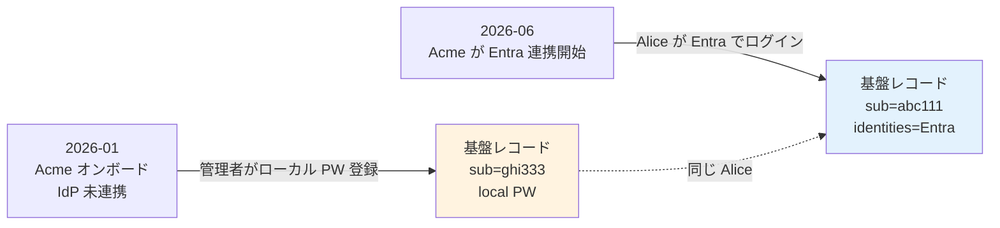
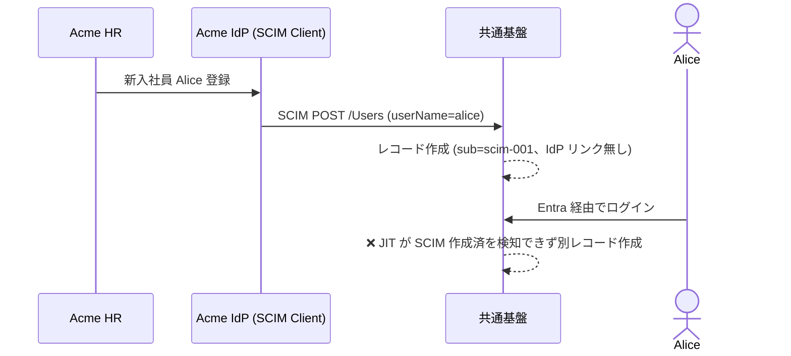
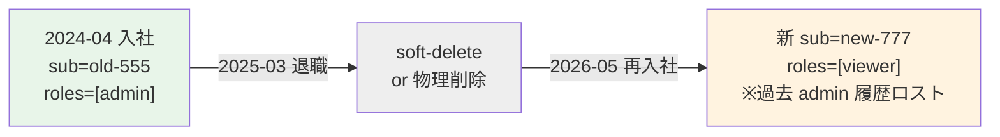
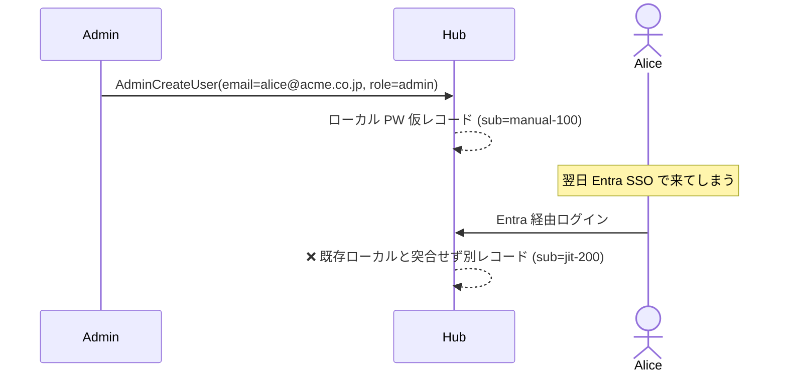

# ADR-027: 同一テナント内ユーザー重複の扱い（7 シナリオ + アカウントリンク戦略）

- **ステータス**: Proposed（要件定義フェーズで Accepted に昇格予定）
- **日付**: 2026-06-15
- **関連**:
  - [§FR-2.2.1.A 同一テナント内ユーザー重複の扱い](../requirements/proposal/fr/02-federation.md#fr-2.2.1.a-同一テナント内ユーザー重複の扱い)
  - [ADR-018 ユーザー識別子 3 階層戦略](018-user-identifier-3layer-emailless.md)
  - [common/identity-broker-multi-idp.md](../common/identity-broker-multi-idp.md)

---

## Context

同一テナント内で同一人物が複数 IdP / ローカル経由で別レコード化する重複問題が、7 つの典型シナリオで発生する。**`sub` が分かれると認可・履歴・退職処理・MFA 登録が分断**される深刻な問題。

理想は「同一人物 = 1 プロファイル + 複数 IdP リンク（`identities` 配列）」（業界標準 = Microsoft Entra / Auth0 / Okta）。本 ADR は「どうやってその理想状態に収束させるか」と、その実装パスを Cognito / Keycloak 別に整理する。

⚠ **前提**: JIT 突合キーの第一推奨は `tenant_id + persistent NameID`、email は補助属性扱い（[ADR-018](018-user-identifier-3layer-emailless.md)）。本 ADR の図中で「email 同一だが別 sub」と書かれている箇所は「email がある場合の典型例」として読む。

---

## Decision

**A 案 統合（リンク）派を採用**: 同一人物 → 1 プロファイル + 複数 IdP リンク。

**自動リンクは原則行わない**。Email OTP 確認 or 既存パスワード再認証を経たリンクのみ。Trust Email は IdP 単位で明示判断（デフォルト false）。突合せキーは email 補助 + immutable な `sub` / 雇用 ID プライマリ。

**Cognito の 1 ユーザーあたり 5 IdP リンク Hard limit が制約**。多 IdP 顧客（製造業多重子会社、IdP 切替を複数回経験）は Keycloak 必須。

---

## A. 7 つの重複発生シナリオ

| # | シナリオ | 発生原因 |
|:---:|---|---|
| 1 | 顧客が複数 IdP を持つ（例: Acme = Entra ID + HENNGE 併用）| 各 IdP からの `sub` が別 |
| 2 | IdP 切り替え期間（例: Okta → Entra 移行中）| 旧 `sub` と新 `sub` が並存 |
| 3 | ローカル + フェデの併存 | 先にローカル登録、後から IdP 接続で別レコード |
| 4 | SCIM プロビ + JIT 競合 | 事前 SCIM の `userName` ≠ JIT 時の `sub` |
| 5 | 退職 → 再入社 | IdP 上は新規、基盤側に旧履歴あり |
| 6 | 複数役割の表現 | 1 人 = 複数組織コードで別レコード化 |
| 7 | 手動登録 + 自動流入 | 管理者の `AdminCreateUser` vs JIT 流入 |

### 重複が発生した状態のイメージ

### シナリオ 1: 複数 IdP 併用（最頻出）

### シナリオ 2: IdP 切替期間（Okta → Entra 移行中）

並走 4 ヶ月の間、**同じ社員が Okta と Entra の両方からログインしてくる** ため、`sub` が異なる 2 レコードが基盤に並存。

### シナリオ 3: ローカル + フェデの併存

### シナリオ 4: SCIM プロビ + JIT 競合

### シナリオ 5: 退職 → 再入社

→ IdP 上は新規アカウント扱い、基盤上は旧 sub の履歴・監査ログが残る。**運用判断（コンプライアンス論点）**。

### シナリオ 6: 複数役割の表現（1 人 = 複数組織コードで多重所属）

レアだが業務複雑な業種（建設・コンサル・SI 多重所属）で発生。アプリ側の文脈切替で対応すべき要件か、基盤で別レコードを許すかの判断。

### シナリオ 7: 手動登録 + 自動流入の競合

---

## B. 業界の現在地

- 業界標準は「**同一人物 = 1 プロファイル + 複数 IdP リンク**」（Microsoft Entra / Auth0 / Okta などの実装）
- リンク時の最大リスクは「**他人 email アサーション流入による乗っ取り**」
- AWS Cognito 公式は `AdminLinkProviderForUser` を **"trusted IdPs only"** と警告
- Keycloak は First Broker Login Flow で **Confirm Link / Email OTP / Re-auth** を標準フロー化

---

## C. 設計の三択

| 案 | 設計方針 | メリット | デメリット | 採用例 |
|:---:|---|---|---|---|
| **A 統合（リンク）派** | 同一人物 → 1 プロファイル / 複数 IdP リンク | UX 一貫、データ重複なし、deprovision 一括 | リンク誤動作で乗っ取りリスク | **Microsoft Entra / Auth0 / Okta** |
| B 独立（許可）派 | IdP 経由 = 別ユーザー、重複を許容 | 攻撃面狭い | UX 悪化、データ重複、ロール管理混乱 | レガシー設計 |
| C ハイブリッド | IdP 経由は独立、ローカルとは統合 | 規制業種で許容しやすい | 設計複雑、説明難 | 慎重派、規制業種 |

→ **推奨ベースライン: A 統合（リンク）派 + Trust Email を IdP 単位で慎重制御 + Email OTP / 再認証確認**

---

## D. 対応能力マトリクス（Cognito vs Keycloak）

| 機能 | Cognito | Keycloak (OSS / RHBK) | 備考 |
|---|:---:|:---:|---|
| 同一プロファイルへの IdP リンク | ✅ `AdminLinkProviderForUser` API | ✅ First Broker Login Flow | 両方標準 |
| **リンク可能な IdP 数上限** | **5（Hard limit）** | 制限なし | AWS 公式: "link up to five federated users to each user profile" |
| **リンク時の突合せ属性数上限** | **5（Hard limit）** | 制限なし | AWS 公式: "from up to five IdP attribute claims" |
| 既存ユーザー検出時の確認フロー | ⚠ Pre Sign-up Lambda 自前 | ✅ `Confirm Link Existing Account` / `Verify Existing Account By Email` / `Verify Existing Account By Re-authentication` 3 認証器 | Keycloak Identity Brokering Docs |
| Detect Existing Broker User | ❌ 自前 | ✅ `Detect Existing Broker User` 認証器 | Keycloak Docs |
| **既ログイン済 IdP の再リンク** | ⚠ **既存プロファイル削除が必要**（監査ログ分断）| ✅ `Detect Existing Broker User` で上書き確認 | AWS 公式: "you must first delete their existing profile" |
| 管理 UI からのリンク操作 | ❌ **API のみ**（Console 不可）| ✅ Admin Console + アカウント設定画面 | AWS 公式 |
| ユーザー自身による自己リンク | ❌ | ✅ アカウント設定画面 経由 | 同上 |
| Trust Email の IdP 単位制御 | ⚠ 暗黙的 | ✅ IdP 設定で明示 | Keycloak Identity Brokering |
| `identities` クレーム出力 | ✅ ID Token | ✅ Federated Identities API | 両方標準 |
| 自動リンク（信頼 IdP 前提）| ⚠ Pre Sign-up Lambda で自前 | ✅ `Automatically Set Existing User` 認証器 | 業界標準は**自動リンク非推奨** |
| 退職 → 再入社時の旧履歴復活 | ⚠ プラットフォーム標準なし | ⚠ 同左 | **シナリオ 5 はプラットフォーム選定で決まらない** |

---

## E. シナリオ別の実装可否（7 シナリオ × 2 プラットフォーム）

| # | シナリオ | Cognito での実現 | Keycloak での実現 |
|:---:|---|---|---|
| 1 | 複数 IdP 併用 | Pre Sign-up Lambda + `AdminLinkProviderForUser`（**自前 200〜500 行**）。5 IdP までしかリンク不可 | First Broker Login Flow に `Confirm Link` + `Verify by Email` を組むだけ（追加コード 0）。IdP 数無制限 |
| 2 | IdP 切替期間 | 同上（移行用に Lambda 増強）| 同上（標準フローで自然に処理）|
| 3 | ローカル + フェデ併存 | Pre Sign-up Lambda + 既存ローカル検索 → Link | First Broker Login Flow で標準動作 |
| 4 | SCIM + JIT 競合 | Pre Sign-up Lambda で SCIM 作成済を email/externalId で検索 → Link（重い実装）| `Detect Existing Broker User` + email 突合（標準）|
| 5 | 退職 → 再入社 | **両プラットフォームとも標準機能なし** — soft-delete + 管理者承認の自前運用 | 同左（**運用設計マター**）|
| 6 | 複数役割（多重所属）| アプリ層で文脈切替 or Cognito Groups | Realm Groups / Composite Roles で表現可 |
| 7 | 手動 + 自動流入 | Pre Sign-up Lambda で AdminCreateUser 済を検出 → Link | First Broker Login Flow で標準動作 |

---

## F. Cognito の落とし穴 3 点（要件定義時に必ず顧客と握る）

| # | 制約 | 影響シナリオ |
|:---:|---|---|
| 1 | **1 ユーザーあたり IdP リンクは 5 個まで（Hard limit）**、突合せ属性も 5 個まで | グローバル製造業（多重子会社で各社が別 IdP）、IdP 切替を複数回経験する顧客で破綻 |
| 2 | **リンク操作の管理コンソール UI なし**（`AdminLinkProviderForUser` API のみ）| 運用者が CLI / カスタム自前 UI でしかリンク作業ができない |
| 3 | **既ログイン済 IdP の再リンクには既存プロファイル削除が必要** | 監査ログ・履歴が分断、退職再入社で運用複雑化 |

→ **B-406 で「あり」回答 + 経路に「複数 IdP」「IdP 切替」「SCIM + JIT 競合」のいずれかが含まれる場合、Cognito は実質ノックアウト**になる可能性が高い。

---

## G. セキュリティ上の最大論点：アカウント乗っ取り対策

| 攻撃ベクター | 対策 |
|---|---|
| **悪意ある（or 設定ミス）IdP からの他人 email アサーション流入**（攻撃者が自分の IdP アカウントに被害者 email を設定 → 自動リンクで乗っ取り）| **Trust Email を自動 true にしない**（IdP 単位で明示判断）+ Email OTP 確認 |
| 同名同 email の偶然衝突 | 突合せキーを email でなく **immutable な `sub` / `objectid` / 雇用 ID** にする |
| 退職者の再入社時のリンク誤動作 | 退職者プロファイルは soft-delete + 管理者承認後リンク |
| JIT による自動レコード生成と既存ローカル衝突 | First Broker Login Flow / Pre Sign-up Lambda で確認フロー必須 |
| 管理者通知なしのサイレント乗っ取り | リンクイベントは監査ログ + 管理者通知（§FR-8.2 監査）|

→ **能動検知の補完**: 本セクションで挙げた攻撃ベクター（特に「悪意ある IdP からの他人 email アサーション流入」「JIT 自動レコード生成衝突」）は、[ADR-035 ITDR](035-identity-threat-detection-response.md) の **6 検知領域**（特に Compromised Credentials / Anomaly Login / Privileged Account Abuse）で**能動検知される**。本セクションが「攻撃を防ぐ設計」、ADR-035 が「攻撃を検知する設計」として補完関係。

---

## Consequences

### Positive

- 業界標準の「同一人物 = 1 プロファイル」を実現、UX 一貫
- Email OTP + 再認証フローで乗っ取りリスク最小化
- 7 シナリオすべてに対応可能（プラットフォーム選定次第）

### Negative

- Cognito の 5 IdP Hard limit が制約（多 IdP 顧客は Keycloak 必須）
- Cognito 採用時はリンク管理 UI を自前開発必要
- 自動リンクを採らないため初回 SSO で「補完画面」UX が発生
- 退職再入社（シナリオ 5）はプラットフォーム選定で決まらず、運用設計マター

---

## 参考資料

- [AWS Cognito - Linking federated users to an existing user profile](https://docs.aws.amazon.com/cognito/latest/developerguide/cognito-user-pools-identity-federation-consolidate-users.html)
- [Keycloak Server Admin Guide - First Login Flow](https://www.keycloak.org/docs/latest/server_admin/index.html#_default-first-login-flow)
- [common/identity-broker-multi-idp.md](../common/identity-broker-multi-idp.md) — 詳細な Keycloak 実装パターン
