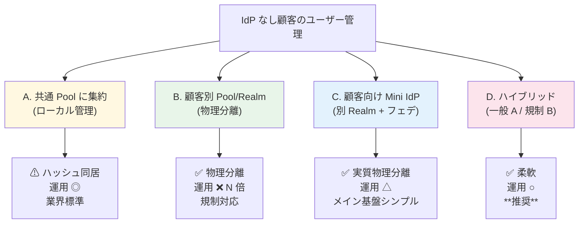
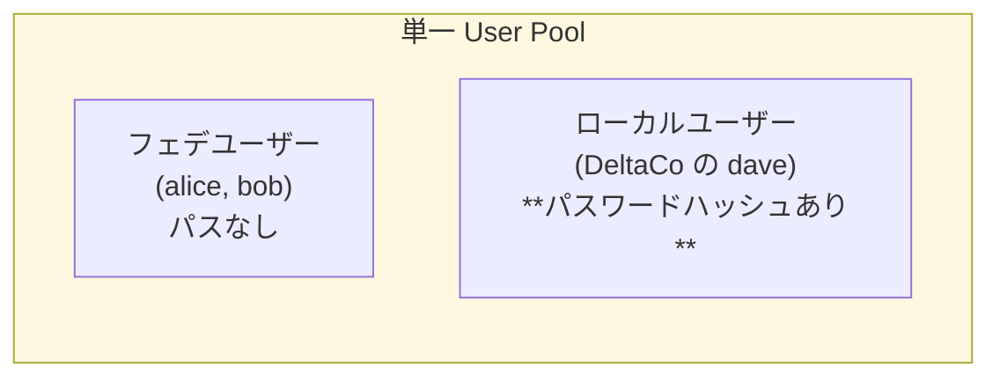
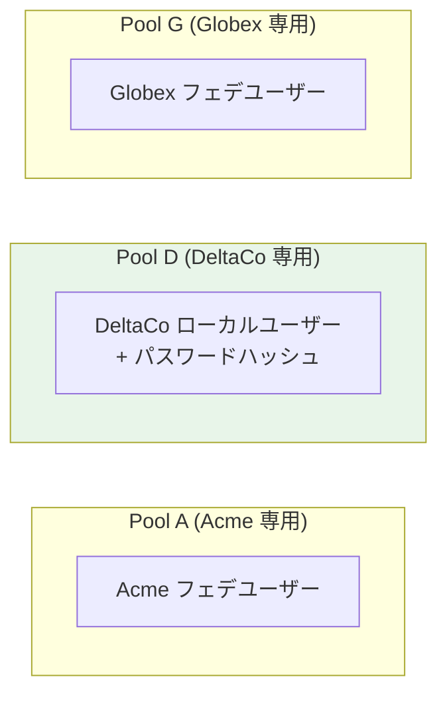
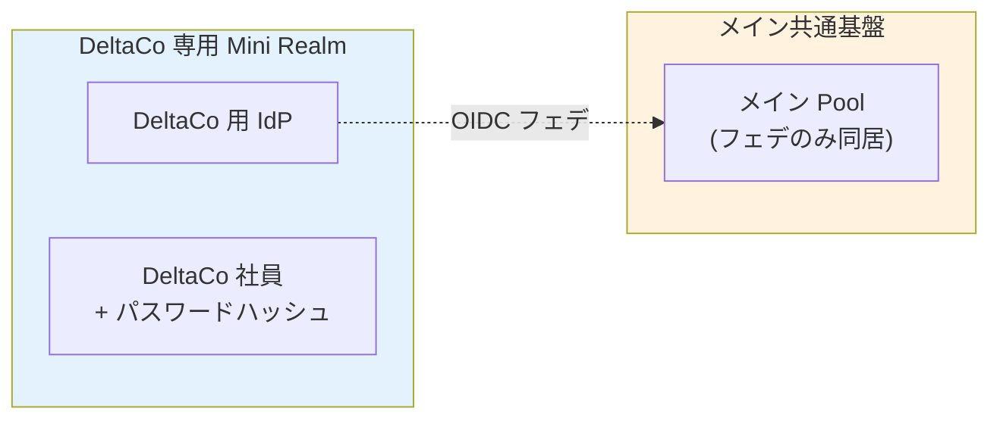
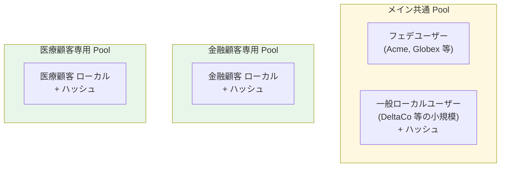

# ADR-028: IdP なし顧客のローカルユーザー管理 — 4 選択肢の比較

- **ステータス**: Proposed（要件定義フェーズで Accepted に昇格予定）
- **日付**: 2026-06-15
- **関連**:
  - [§FR-2.3.A.2 IdP なし顧客のローカルユーザー管理 — パスワードハッシュの同居問題](../requirements/proposal/fr/02-federation.md#fr-23a2-idp-なし顧客のローカルユーザー管理--パスワードハッシュの同居問題)
  - [ADR-017 マルチテナント L2 採用根拠](017-multitenant-l2-single-realm.md)
  - [ADR-018 ユーザー識別子 3 階層戦略](018-user-identifier-3layer-emailless.md)
  - [common/identity-broker-multi-idp.md §10](../common/identity-broker-multi-idp.md)

---

## Context

「IdP を持たない顧客」のユーザーをローカル管理すると、**パスワードハッシュも本基盤側に保存される**ため、フェデユーザー以上に強い「同居」状態になる。

| 顧客タイプ | パスワード保存先 | 本基盤での同居 |
|---|---|---|
| IdP あり顧客（Acme, Globex）| 顧客 IdP（Entra / Okta）| ユーザーレコードのみ同居 |
| **IdP なし顧客**（DeltaCo）| **本基盤 User Pool**（PBKDF2/Argon2 ハッシュ）| **ユーザーレコード + パスワードハッシュ同居** |

規制顧客（金融 / 医療 / 政府）への対応、運用工数最小化、Broker パターン整合性の 3 軸を考慮した選択が必要。

---

## Decision

**D 案 ハイブリッド**を採用：

| 顧客タイプ | 配置 | パスワード扱い |
|---|---|---|
| **IdP あり顧客** | 共通 Pool | 顧客 IdP 側、本基盤に来ない |
| **IdP なし 一般顧客**（標準セキュリティ要件）| **共通 Pool でローカル管理** | PBKDF2/Argon2 ハッシュ + `tenant_id` タグ |
| **規制顧客**（金融 / 医療 / 政府）| **専用 Pool/Realm** | 物理分離 + 別 KMS キー |

A 案を採用する場合は侵害クレデンシャル検出 / MFA Must / Pool DB 暗号化 等の標準セキュリティ要件を必須。

---

## A. 4 つの選択肢

### A. 共通 Pool に集約（ローカル管理、論理分離）

- **同居**: ユーザーレコード + パスワードハッシュ（DeltaCo 分）
- **保存形式**: PBKDF2-SHA512 / Argon2id（業界標準ハッシュ）
- **リスク**: Pool DB 全体漏洩時に全顧客のローカルユーザー分のハッシュ流出。**ただし強いハッシュ + salt で元パスワード復元困難**
- **業界スタンス**: B2B SaaS で論理分離 + 強いハッシュ + 侵害検知で十分（OWASP / WorkOS / Microsoft 標準）

### B. 顧客別 Pool / Realm（物理分離 = §FR-2.3.A の B 案）

- パスワードハッシュも**物理分離**（DeltaCo の Pool D のみに存在）
- 運用工数が顧客数 N に比例（100 社抱えると Pool 100 個）
- JWT issuer が分散 → 各アプリで複数 issuer 検証必要
- Broker パターンの本質が崩壊

### C. 顧客専用 Mini IdP（別 Realm）+ メインからフェデ

- 「**IdP を自前で用意**」案 = 顧客専用に Mini Realm/Pool を立て、メインからは外部 IdP として接続
- 物理分離の効果は B 案と同等
- メイン共通基盤側はシンプル（メインから見れば「フェデのみ」）
- 実装複雑度は B 案以上（2 段階の認証フロー）
- 採用例: Auth0 / Okta が「Premium Tenant」として顧客専用テラスを提供

### D. ハイブリッド（一般 A + 規制 B / C）— **本基盤の推奨**

- **一般顧客（IdP なし含む）**: 共通 Pool で論理分離
- **規制顧客（金融 / 医療 / 政府）**: 専用 Pool で物理分離
- 柔軟で運用工数も最小化
- 業界実例: Auth0 / Microsoft Entra External ID 等が「**Standard Tenant + Premium Tenant**」パターン採用

---

## B. 4 案比較表

| 観点 | A. 共通 Pool | B. 顧客別 Pool | C. Mini IdP フェデ | D. ハイブリッド |
|---|:---:|:---:|:---:|:---:|
| パスワードハッシュの物理分離 | ❌ 同居 | ✅ 完全分離 | ✅ 完全分離 | ⚠ 部分分離 |
| 同居規模 | 全顧客 | 顧客 1 社 | 顧客 1 社 | 一般顧客のみ |
| 運用工数 | ◎ 1 つ | ❌ N 倍 | ❌ N 倍 + 階層 | ○ 数個 |
| JWT issuer | 1 つ | N 個 | N + 1 個 | 数個 |
| Broker パターン整合 | ✅ 完全 | ❌ 崩壊 | ⚠ 階層化 | ⚠ 部分崩壊 |
| 規制対応（金融 / 医療）| ⚠ 要交渉 | ✅ | ✅ | ✅ 特殊顧客のみ |
| **本基盤での採用判断** | ⚠ 一般顧客のみ | × 過剰 | △ 例外的 | ✅ **推奨** |

---

## C. 「Pool を分けたら物理的に別れているのか?」の直接回答

**Yes、Pool/Realm を分けると物理的に別ストレージで分離されます**：

| 観点 | 単一 Pool | 別 Pool 分離 |
|---|---|---|
| データストレージ | 同じテーブル / DB | 別テーブル / 別 DB（Cognito 別 User Pool / Keycloak 別 Realm = 別テーブル群）|
| パスワードハッシュ | 同居 | 別物理保管 |
| 暗号化キー | 共通 | 別 KMS キー設定可 |
| 管理権限 | 共通 IAM Role / Realm Admin | Pool/Realm 別の Admin |
| 障害影響範囲 | 全テナント | 該当テナントのみ |
| GDPR Right to Erasure 等 | tenant_id レコード削除 | Pool 全体削除可、より厳密 |

→ 「**自前 IdP として別 Pool/Realm を立てる**」 = 「**Pool を分ける**」 = **物理分離**として等価。

---

## D. 共通 Pool でローカル管理する場合の必須セキュリティ要件

A 案（共通 Pool）を採用する場合、以下を**標準実装**する：

| 要件 | 実装 | 参照 |
|---|---|---|
| **強いハッシュ** | PBKDF2-SHA512 / Argon2id | Cognito 自動 / Keycloak 標準 |
| **侵害クレデンシャル検出** | Cognito Plus（$0.02/MAU）or Keycloak + HIBP | [§FR-1.2 C-205-2](../requirements/proposal/fr/01-auth.md) |
| **強いパスワードポリシー** | NIST SP 800-63B Rev 4 準拠 | [§FR-1.2](../requirements/proposal/fr/01-auth.md) |
| **アカウントロック / ブルートフォース対策** | 連続失敗で一時ロック | [§FR-1.2](../requirements/proposal/fr/01-auth.md) |
| **MFA Must**（IdP なしユーザー）| Passkey 推奨 + TOTP | [§FR-3](../requirements/proposal/fr/03-mfa.md) |
| **Pool DB 暗号化** | Cognito 自動 / Keycloak: Aurora storage_encrypted=true + KMS CMK | [§NFR-4](../requirements/nfr/04-security.md) |
| **管理 API 制限** | `ListUsers` 等は IAM Role で制限、`tenant_id` フィルター必須 | OWASP |
| **監査ログ** | 全認証イベント（成功・失敗）を CloudTrail / Event Listener に永続化 | [§FR-8.2](../requirements/proposal/fr/08-admin.md) |

→ これらを実装すれば、**ハッシュ同居でも実用上のセキュリティリスクは小さい**（業界標準）。

---

## E. 顧客への説明（推奨フレーズ）

> 「IdP をお持ちでない顧客のユーザーは、本基盤側で**ローカル管理**します。パスワードは PBKDF2-SHA512（または Argon2）でハッシュ化して保存され、salt 付きで元パスワード復元は困難です。
>
> ハッシュ自体は他の一般顧客のものと**同じデータベースに格納**されますが、これは Slack / Notion / Linear など主要 B2B SaaS の標準的な構成です（OWASP 推奨）。**侵害クレデンシャル検出 / 強いパスワードポリシー / MFA / DB 暗号化**で実用上のリスクは抑えられます。
>
> 金融・医療・政府系など、**規制・契約で物理分離が必須**な場合は、お客様専用の User Pool を別途用意することも可能です（B 案 = 物理分離、コスト・運用工数増）。」

---

## Consequences

### Positive

- 一般顧客は運用工数最小 + 業界標準セキュリティで対応
- 規制顧客には B / C 案で完全物理分離を提供可能
- Broker パターン整合性を主に維持しつつ、必要な部分のみ崩す

### Negative

- A 採用時はハッシュ同居が顧客交渉時の論点になる（説明工数）
- D ハイブリッド採用時は規制顧客の判定基準・契約条件を設計する必要
- 規制顧客が増えると Pool/Realm 数が増加 → 運用負荷上昇

---

## 参考資料

- [common/identity-broker-multi-idp.md §10](../common/identity-broker-multi-idp.md) — Cognito 別 Pool vs Keycloak 別 Realm の実装比較
- [OWASP Multi-Tenant Security Cheat Sheet](https://cheatsheetseries.owasp.org/cheatsheets/Multifactor_Authentication_Cheat_Sheet.html)
- [Auth0 Standard Tenant vs Premium Tenant](https://auth0.com/docs/get-started/auth0-overview/create-tenants)
- [Microsoft Entra External ID Tenant Pricing](https://learn.microsoft.com/en-us/entra/external-id/external-identities-pricing)
