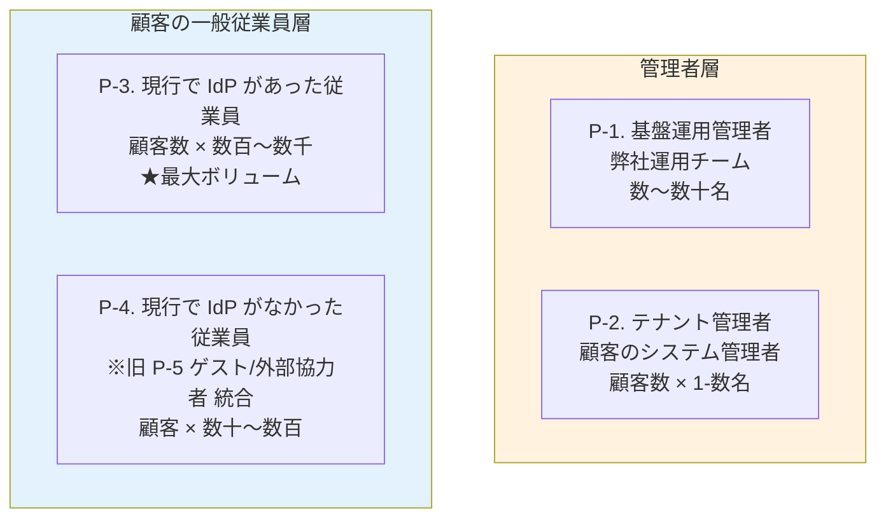
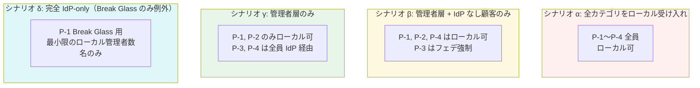

# ADR-029: ローカルユーザーの定義 — 利用者カテゴリと範囲シナリオ

- **ステータス**: Proposed（要件定義フェーズで Accepted に昇格予定）
- **日付**: 2026-06-15
- **関連**:
  - [§FR-1.2.0.0 ローカルユーザーとは何か — 利用者カテゴリ別の分析](../requirements/proposal/fr/01-auth.md#fr-1200-ローカルユーザーとは何か--利用者カテゴリ別の分析)
  - [ADR-017 マルチテナント L2 採用根拠](017-multitenant-l2-single-realm.md)
  - [ADR-028 IdP なし顧客のローカルユーザー管理](028-idpless-customer-local-user-management.md)

---

## Context

「ローカルユーザー」を素朴に「IdP を経由せずパスワードで認証するユーザー全部」と定義すると、**P-1 基盤運用管理者**から **P-4 現行で IdP がなかった従業員**まで性格の異なる利用者群を 1 箱に詰め込むことになる。範囲を絞れば運用負荷もリスクも変わるため、まず**利用者カテゴリ**を整理してから「どこまでをローカルにするか」を決める必要がある。

> **2026-06-24 体系修正**: 旧 P-5 ゲスト/外部協力者は **P-4「現行で IdP がなかった従業員」に統合**、旧 P-6 B2C エンドユーザーは **本基盤対象外**として削除。現体系は **P-1〜P-4 の 4 カテゴリ**。

加えて、人間ユーザー（P-1〜P-4）以外にも **インフラ運用者（AWS IAM 経由）/ M2M（システム間連携）/ 脅威モデル** を明示的に分類しておかないと、設計の責務分担が曖昧になる。

---

## Decision

### ローカルユーザー範囲：**シナリオ γ（管理者層のみローカル）を第一推奨**

| 観点 | 採用方針 |
|---|---|
| **第一推奨** | **シナリオ γ**（管理者層のみローカル、顧客従業員は全員顧客 IdP 経由）|
| **現実的フォールバック** | シナリオ β（β: 管理者 + IdP なし顧客のみローカル）|
| **不採用** | シナリオ α（全カテゴリをローカル受け入れ）/ シナリオ δ（Break Glass のみ）|
| **管理者層（P-1）の認証** | **弊社内 IdP（Entra ID 等）連携** + Break Glass 用 2-3 名のローカル管理者 |
| **管理者層（P-2）の認証** | **顧客 IdP 経由を推奨**、IdP なし顧客はローカル許容 |
| **アプリ集約方針** | **A. 共通基盤集約**（Must）— 各アプリ独自認証（B 案）は採用しない |

---

## A. 利用者カテゴリ全体マップ

> **対象外カテゴリ**：旧 P-6 B2C エンドユーザーは**本基盤の対象外**（2026-06-24 確定）。本基盤は **B2B SaaS 専用**。

### カテゴリ別の特性

| カテゴリ | 想定数 | 認証 SLA | 業務影響 | 自然な認証方式 |
|---|---|---|---|---|
| **P-1. 基盤運用管理者** | 弊社運用チーム数〜数十名 | 24/7 | 全顧客影響 | 弊社内 IdP（Entra ID 等）連携 / Break Glass 用に最小ローカル |
| **P-2. テナント管理者** | 顧客数 × 1-数名 | 営業時間 | 自テナント内のみ | 顧客 IdP（推奨）/ ローカル（妥協）|
| **P-3. 現行で IdP があった従業員** | 顧客数 × 数百〜数千 | 営業時間 | 個人作業 | **顧客 IdP（フェデ）** |
| **P-4. 現行で IdP がなかった従業員**（※旧 P-5 ゲスト/外部協力者 統合）| 一部顧客 × 数十〜数百 | 営業時間 | 個人作業 | ローカル / 顧客に IdP を持ってもらう |

---

## B. 4 カテゴリの責務分担（人間 / インフラ運用 / M2M / 脅威）

P-1〜P-4 は「本基盤の認証を経由する人間ユーザー」のみ。実際の運用では**他の 3 カテゴリも明示**する必要がある。

### Category A: 本基盤の認証を経由する人間ユーザー（P-1〜P-4）

上記。

### Category B: 本基盤の認証を経由しないインフラ運用者

| ID | ユーザー種類 | 認証方式 |
|:---:|---|---|
| **I-1** | AWS インフラ運用者 | **AWS IAM**（IAM Identity Center / IAM ユーザー / IAM Role）、MFA 必須 |
| **I-2** | Keycloak / RHBK 運用者 | AWS IAM + kubectl auth、Bastion 経由の SSH キー |
| **I-3** | 監視・SRE 担当 | AWS IAM / Datadog SSO / Grafana OAuth、**Read-Only 推奨** |
| **I-4** | セキュリティ監査者 | AWS IAM / SIEM 認証、**Read-Only 強制** |
| **I-5** | ベンダー / SI サポート | サポートチケット経由 / **IAM Role の STS 一時付与**（24-72h）|

### Category C: M2M（システム間連携）

| ID | ユーザー種類 | 認証方式 |
|:---:|---|---|
| **M-1** | アプリ間サービス（OBO）| **本基盤発行 Token Exchange（RFC 8693）**（Keycloak 必須）+ Client Credentials |
| **M-2** | CI/CD パイプライン | **AWS IAM Role**（GitHub OIDC Federation 経由）|
| **M-3** | SCIM プロビジョニング元 | **本基盤発行 SCIM Bearer Token**、TLS 経由 |
| **M-4** | Webhook 受信側 | **HMAC 署名**（本基盤側で生成、受信側で検証）|
| **M-5** | IoT / CLI デバイス | **本基盤発行 Device Code Flow（RFC 8628）** |

### Category D: 脅威モデル（参考、防御対象）

| ID | ユーザー種類 |
|:---:|---|
| **T-1** | 外部攻撃者（不正アクセス・フィッシング・トークン盗難等）|
| **T-2** | 内部不正者（特権アカウント悪用・退職者残存アクセス等）|

### 4 カテゴリ責務分担サマリ

| カテゴリ | 認証提供主体 | ヒアリング対象 | 関連設計章 |
|:---:|---|:---:|---|
| **A. 人間ユーザー** | 本基盤（Cognito / Keycloak）| ✅ | §FR-1.2.0 / §FR-2 |
| **B. インフラ運用者** | AWS IAM / IAM Identity Center / K8s RBAC | △ | [§NFR-6.4](../requirements/nfr/06-operations.md) |
| **C. M2M** | 本基盤（Client Credentials / Token Exchange / SCIM / Device Code）| ✅ | §FR-1.1, §FR-6.3 |
| **D. 脅威モデル** | （対象外、防御対象）| — | [§NFR-4](../requirements/nfr/04-security.md) |

→ **Category B のインフラ運用者は本基盤の認証を使わない**ため、Cognito / Keycloak の設計には影響しないが、**運用設計と監査ログ要件には直接関わる**。

---

## C. ローカルユーザー範囲の 4 シナリオ

### シナリオ別の比較

| 観点 | α 全カテゴリ | β 管理者+IdPなし | γ 管理者のみ | δ Break Glass のみ |
|---|:---:|:---:|:---:|:---:|
| ローカルユーザー総数 | 多 | 中 | 少 | 極小 |
| 対応可能な顧客範囲 | 全顧客 | 全顧客 | IdP 持つ顧客 | IdP 持つ顧客 |
| 顧客に IdP 準備依頼 | なし | IdP なし顧客のみ | **全顧客必須** | **全顧客必須** |
| 侵害クレデンシャル検出対象 | 大 | 中 | 小 | 最小 |
| MFA 対象 | 全員（負担大）| 全員（負担大）| 管理者のみ | 管理者のみ |
| PW ポリシー運用負荷 | 高 | 中 | 低 | 最小 |
| Layer 1-4 必要性 | 必須 | 必須 | 軽量化 | ほぼ不要 |
| IdP 障害時の継続性 | ✅ ローカル切替可 | ✅ | ⚠ 管理者のみ | ⚠ Break Glass のみ |
| B2B 顧客獲得幅 | 広い | 広い | やや狭い | 狭い |
| Broker パターン純度 | △ | ⚠ | ✅ | ✅✅ |
| 業界事例 | Auth0 デフォルト / 中小 B2B | 多くの中堅 B2B SaaS | **Notion Enterprise** | **Stripe / AWS 管理層** |

---

## D. 業界の現在地

OIDC / OAuth 2.0 の **Identity Broker パターン**を採用する組織では、**ローカルユーザーも基盤側に集約する**のが業界標準。範囲は組織のターゲット顧客層次第:

- **中小企業中心の B2B SaaS** → 顧客の IdP 普及率が低いため、ローカル受け入れ必須（α / β）
- **エンタープライズ B2B SaaS**（Notion Enterprise, Workday）→ **IdP 必須**化、ローカルは管理者層のみ（γ）
- **大手 IaaS / PaaS 管理層**（AWS / Microsoft / Google）→ Break Glass のみローカル（δ）
- **B2C プラットフォーム**（Spotify, Netflix）→ 全員ローカル + ソーシャル（α 系統）

各アプリで独自認証を持つと、Broker パターンの本質（集約点 1 つ、各アプリは JWT を信頼するだけ）が崩れ、SSO・コンプライアンス・運用面で大きな問題が発生する。

---

## E. アプリ集約 3 選択肢の評価

| 選択肢 | 概要 | 採用判断 |
|---|---|---|
| **A. 共通基盤集約** | 全ローカルユーザーを共通基盤の User DB に集約 | ✅ **Must** |
| **B. 各アプリ独自認証** | 各アプリが独自 Login UI + ユーザー DB + パスワード管理 | ❌ **Won't** |
| **C. ハイブリッド** | レガシーは独自、新規は共通基盤 | △ **移行期限定で許容** |

### B 案を採用しない理由

| 理由 | 内容 |
|---|---|
| **Broker パターンの崩壊** | issuer が分散し、各アプリで複数 issuer 検証必要 |
| **SSO 不可能** | 別認証セッションのため「一度のログインで全システム」が成立しない |
| **セキュリティの品質差** | 各アプリで PW ハッシュ・レート制限・侵害検出・MFA を個別実装 → 最も弱いアプリが天井 |
| **コンプライアンス重複** | GDPR / SOC 2 / ISO 27001 等を全アプリで個別対応必要 |
| **退職時 deprovision 漏れ** | 基盤で 1 回 → 全アプリ反映、にならない |
| **コスト** | 開発・運用コスト N 倍 |

---

## F. カテゴリ別の認証主体と委譲モデル

| カテゴリ | 推奨認証 | 管理主体 | §FR-1.2.0.B Layer |
|---|---|---|---|
| P-1 基盤運用管理者 | 弊社内 IdP + Break Glass ローカル | 共通基盤運用チーム | AWS IAM Identity Center |
| P-2 テナント管理者（IdP あり）| 顧客 IdP 経由 | 顧客 IdP 側 | フェデユーザー |
| P-2 テナント管理者（IdP なし）| ローカル + MFA Must | 共通基盤運用がプロビジョン | Layer 3 委譲管理者 |
| P-3 顧客従業員（IdP あり）| 顧客 IdP 経由 | 顧客 IdP 側 | フェデユーザー |
| P-4 顧客従業員（IdP なし）+ ゲスト/外部協力者（旧 P-5 統合）| ローカル + MFA 強推奨、ゲスト系は招待 URL も可 | 顧客がテナント管理者として CRUD | Layer 3 + Layer 1 |

→ シナリオ γ / β 採用により、ローカルユーザー数を**顧客一般従業員規模 → 管理者層規模に圧縮**。§FR-1.2.0.B Layer 1-4 運用モデルが**より軽量に成立**する。

---

## Consequences

### Positive

- 利用者カテゴリ P-1〜P-4 + I-1〜I-5 + M-1〜M-5 + T-1〜T-2 の完全な責務分担マップ（旧 P-5/P-6 は廃止）
- ローカルユーザー範囲を 4 シナリオに整理し、顧客状況別の選択肢を明示
- 第一推奨 γ で B2C エンタープライズ標準と整合、Identity Broker 純度向上
- B 案不採用の根拠が 6 観点で明確化

### Negative

- シナリオ γ は「IdP 必須」化のため、IdP 未保有顧客の獲得を制限
- フォールバック β を採る場合、IdP 推進の継続的運用方針が必要
- Category B（インフラ運用者）の認証は別系統（AWS IAM）で管理する必要がある

---

## 参考資料

- [Identity Broker パターン](../common/identity-broker-multi-idp.md)
- [Notion Enterprise SSO Requirements](https://www.notion.so/help/saml-sso-configuration)
- [AWS IAM Identity Center](https://docs.aws.amazon.com/singlesignon/)
