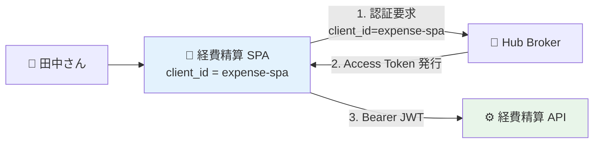

# ADR-030: 最小 JWT クレーム設計と接続元アプリ表現

- **ステータス**: Proposed（要件定義フェーズで Accepted に昇格予定）
- **日付**: 2026-06-15
- **関連**:
  - [§FR-6.1.A 最小クレーム設計と接続元アプリ表現](../requirements/proposal/fr/06-authz.md#fr-61a-最小クレーム設計と接続元アプリ表現)
  - [ADR-018 ユーザー識別子 3 階層戦略](018-user-identifier-3layer-emailless.md)

---

## Context

「最小限のクレーム」を採用した場合の具体的な JWT 構造、特に **`aud` / `azp` / `client_id` の使い分け（接続元アプリの表現）** と、**Cognito の `aud` 罠**の対処を確定する必要がある。

「最小限」には 3 つの意味（セキュリティ最小 / サイズ最小 / 機能最小）があり、B2B SaaS 共通基盤の文脈では**セキュリティ最小 + サイズ最小**が中心論点。

---

## Decision

**Stage 1（標準最小）をデフォルト発行クレーム**として採用。マイクロサービス展開時に Stage 2 へ昇格、RBAC 採用時に Stage 3 へ昇格。

**接続元アプリ表現は `azp` を使用**（OIDC 標準）。**PII は JWT に入れない**（email / name 等は userinfo / DB 参照）。Cognito 採用時は **Pre Token Lambda V2 で `aud` / `azp` 注入**（Essentials+ 必須）。

---

## A. 「最小限」の 3 つの意味

| 観点 | 何を最小化 | 削れる対象 |
|---|---|---|
| **セキュリティ最小** | PII / 機密情報の漏洩リスク | email / 氏名 / 部署 / カスタム属性 |
| **サイズ最小** | トークン肥大化（Cookie / ヘッダ上限）| groups（大量配列）/ 長い文字列属性 |
| **機能最小** | アプリが動作する最小情報 | 認可に使わないクレーム全部 |

→ B2B SaaS 共通基盤の文脈では **セキュリティ最小 + サイズ最小** が中心論点。

---

## B. 業界の現在地：OIDC / RFC 9068 必須クレーム

**RFC 9068**（JWT Profile for OAuth 2.0 Access Tokens、IETF Proposed Standard）の必須クレーム:

| クレーム | 必須/推奨 | 役割 |
|---|:---:|---|
| `iss` | **必須** | 発行者（署名検証の起点）|
| `sub` | **必須** | ユーザー一意 ID |
| `aud` | **必須** | JWT の受信者（API リソースサーバー）|
| `exp` | **必須** | 有効期限 |
| `iat` | **必須** | 発行時刻 |
| `jti` | 推奨 | 一意 ID（revocation / replay 対策）|
| `client_id` | 推奨 | M2M 用 client_id |
| `scope` | 推奨 | 権限スコープ |
| `auth_time` | 推奨 | 認証時刻（`max_age` 用）|
| `acr` / `amr` | 推奨 | 認証コンテキスト / 認証方法 |
| `azp` | 条件付き必須 | aud が複数のとき必須。「誰のために発行されたか」|

---

## C. 「接続元アプリ」を JWT で表現する：`aud` / `azp` / `client_id` の使い分け

OAuth/OIDC では **3 つの異なる ID** がある。混同しやすいので明示分離する:



### Access Token のクレーム

```json
{
  "iss": "https://auth.example.com",
  "sub": "user-tanaka",
  "aud": "expense-api",        // ← 検証する側（API）
  "azp": "expense-spa",        // ← 取得した側（SPA）= 接続元アプリ
  "client_id": "expense-spa",  // ← OAuth client（≒ azp）
  "tenant_id": "acme",
  "exp": ..., "iat": ...
}
```

| クレーム | 意味 | 検証側の使い方 |
|---|---|---|
| **`aud`**（audience）| **JWT の宛先 = 検証する側**（API リソースサーバー）| API は「自分宛か」を必ず検証。違えば reject |
| **`azp`**（authorized party）| **JWT を取得した側 = 接続元アプリ**（SPA / モバイル / BFF）| 「どのフロントから来たか」のトレース・ログ・追加検証用 |
| **`client_id`** | OAuth 2.0 client（実体は azp と同じことが多い）| RFC 9068 推奨。M2M では発行元 = `sub` も指す |

→ **「接続元アプリ」を JWT に入れたい = `azp` を入れる**（標準クレーム、Validator も対応）。

### 多重 `aud` の場合（API Gateway が複数 API に転送）

```json
{ "aud": ["expense-api", "approval-api"], "azp": "expense-spa", ... }
```

→ `aud` が配列なら **`azp` 必須化**（OIDC 仕様）。

---

## D. 推奨：3 段階の最小クレーム設計

### Stage 1: 標準最小（本基盤の推奨デフォルト）

```json
{
  "iss": "https://auth.example.com",
  "sub": "user-abc-123",
  "aud": "expense-api",
  "azp": "expense-spa",
  "tenant_id": "acme",
  "exp": 1730003600,
  "iat": 1730000000
}
```

**サイズ目安: 約 300 byte**（base64 後）。Cookie / Authorization ヘッダで余裕。

### Stage 2: 認可・監査強化

```json
{
  ...Stage 1...,
  "client_id": "expense-spa",  // RFC 9068 推奨（azp と同値）
  "scope": "expense:read",     // 最小権限スコープ
  "auth_time": 1729999000,     // max_age / ステップアップ用
  "jti": "abc-123-def"         // revocation / replay 対策
}
```

### Stage 3: ロール表現（必要時のみ）

```json
{
  ...Stage 2...,
  "roles": ["expense:user"]    // RBAC 必須時のみ
}
```

---

## E. 削っていい? いけない? 判定軸

| クレーム | 削れる条件 | 削るリスク |
|---|---|---|
| **`iss`** | ❌ 削るな | 署名検証の起点不明 |
| **`sub`** | ❌ 削るな | ユーザー識別不能、監査不能 |
| **`aud`** | ❌ 削るな（Cognito Access Token は注意）| token confused deputy 攻撃 |
| **`exp`** | ❌ 削るな | 永久トークン化 |
| **`tenant_id`** | ❌ 削るな（B2B SaaS 必須）| テナント分離崩壊、IDOR 攻撃 |
| **`azp`** | △ aud が単一なら削れる | 接続元アプリの追跡不能。推奨は残す |
| **`scope`** | △ 単一スコープなら削れる | 最小権限の表現不能 |
| **`roles` / `groups`** | △ scope で代替可能なら削れる | RBAC 不能 |
| **`email`** | ✅ **PII 観点で削るのが推奨** | UI 表示は userinfo / DB 参照で取得 |
| **`name`** | ✅ 同上 | 同上 |
| **`auth_time`** | △ ステップアップ MFA なしなら削れる | `max_age` / `prompt=login` 判定不能 |
| **`amr` / `acr`** | △ MFA 重複回避使わないなら削れる | 認証強度の伝達不能 |
| **`jti`** | △ revoke リスト不要なら削れる | revoke / replay 検出不能 |

---

## F. Cognito の罠：Access Token に `aud` がない

### Cognito 固有の挙動

- **ID Token**: `aud = client_id` がデフォルトで入る
- **Access Token**: `aud` が**デフォルトで入らない**（代わりに `client_id` だけある）

→ 多くの JWT 検証ライブラリは `aud` 検証必須 → そのままだと検証エラー。

| 対処 | 内容 |
|---|---|
| **A**: Pre Token Generation Lambda V2 で `aud` 注入 | **Essentials/Plus ティア必須**。本基盤推奨 |
| **B**: API 側で `aud` 検証を無効化し `client_id` 検証に置き換え | 標準から外れる、移植性低下 |
| **C**: Resource Server + Custom Scope で `aud` を埋める | RFC 8707 Resource Binding 利用 |

→ **Keycloak は標準で `aud` を埋めるため、この罠はない**（Audience Mapper で複数 `aud` も可能）。

---

## G. 接続元アプリ表現の 3 つのユースケース

`azp` を含める意義:

| 用途 | 内容 |
|---|---|
| **アプリ単位の認可** | 経費精算 API は経費精算 SPA からのトークンのみ受理 → token confused deputy 攻撃を防御 |
| **監査・追跡** | インシデント時にどのアプリ経由で何が起きたかを追跡 |
| **レート制限・ログ集計** | 「経費精算 SPA からの API 呼び出しが急増」を検知 |

```python
# API 側の検証ロジック例
if claims["aud"] != "expense-api":
    raise Unauthorized  # 別 API 向けトークン拒否

if claims["azp"] not in ["expense-spa", "expense-mobile"]:
    raise Unauthorized  # 別アプリ流用拒否
```

---

## H. 対応能力マトリクス（最小クレーム設計）

| 機能 | Cognito | Keycloak (OSS / RHBK) | 備考 |
|---|:---:|:---:|---|
| `aud` を Access Token に注入 | ⚠ Pre Token Lambda V2 必須（Essentials+）| ✅ Audience Mapper（宣言的）| Cognito 罠 |
| `azp` を Access Token に注入 | ⚠ Pre Token Lambda V2 で実装 | ✅ 標準（`azp = client_id` 自動）| Cognito 自前実装 |
| 多重 `aud`（配列）| ⚠ Pre Token Lambda V2 で実装 | ✅ Audience Mapper（複数）| Keycloak 標準 |
| クレーム削除（PII 除去）| ✅ Pre Token Lambda V2 | ✅ Protocol Mapper 無効化 | 両方可 |
| Stage 2/3 への段階拡張 | ✅ Pre Token Lambda V2 | ✅ Protocol Mapper 追加 | 両方可 |
| トークンサイズ最適化 | ✅ Lambda で必要クレームのみ | ✅ Protocol Mapper 個別制御 | 両方可 |

---

## Consequences

### Positive

- Stage 1 デフォルトで最小・標準的な JWT を発行
- PII を JWT に含めない方針で漏洩リスク最小化
- `azp` 採用で接続元アプリの追跡 / token confused deputy 防御を確保
- 段階的拡張（Stage 2/3）で要件変化に対応

### Negative

- Cognito 採用時は Pre Token Lambda V2 必須化により **Essentials+ ティアが前提**
- PII を JWT から削った場合、UI 表示で userinfo エンドポイント or DB 参照の追加処理が必要
- 段階的拡張時にすべてのアプリの検証ロジック更新が必要

---

## 参考資料

- [RFC 9068 JWT Profile for OAuth 2.0 Access Tokens](https://datatracker.ietf.org/doc/html/rfc9068)
- [RFC 8707 Resource Indicators for OAuth 2.0](https://datatracker.ietf.org/doc/html/rfc8707)
- [OIDC Core 1.0 §3.1.3.7](https://openid.net/specs/openid-connect-core-1_0.html) — `azp` 仕様
- [Keycloak Audience Mapper](https://www.keycloak.org/docs/latest/server_admin/#_audience)
- [Cognito Pre Token Generation V2](https://docs.aws.amazon.com/cognito/latest/developerguide/user-pool-lambda-pre-token-generation.html)
