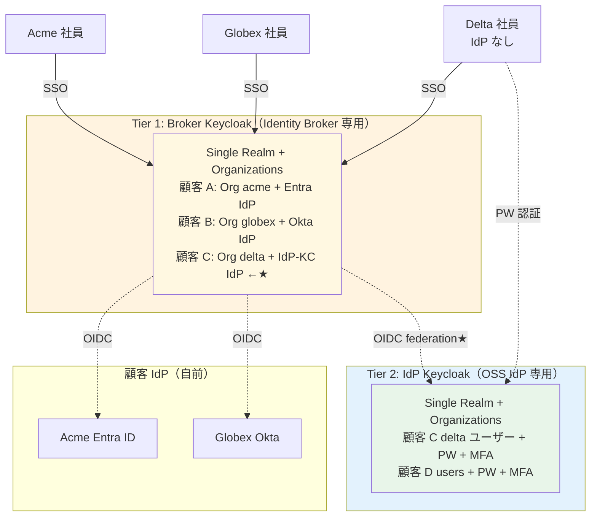
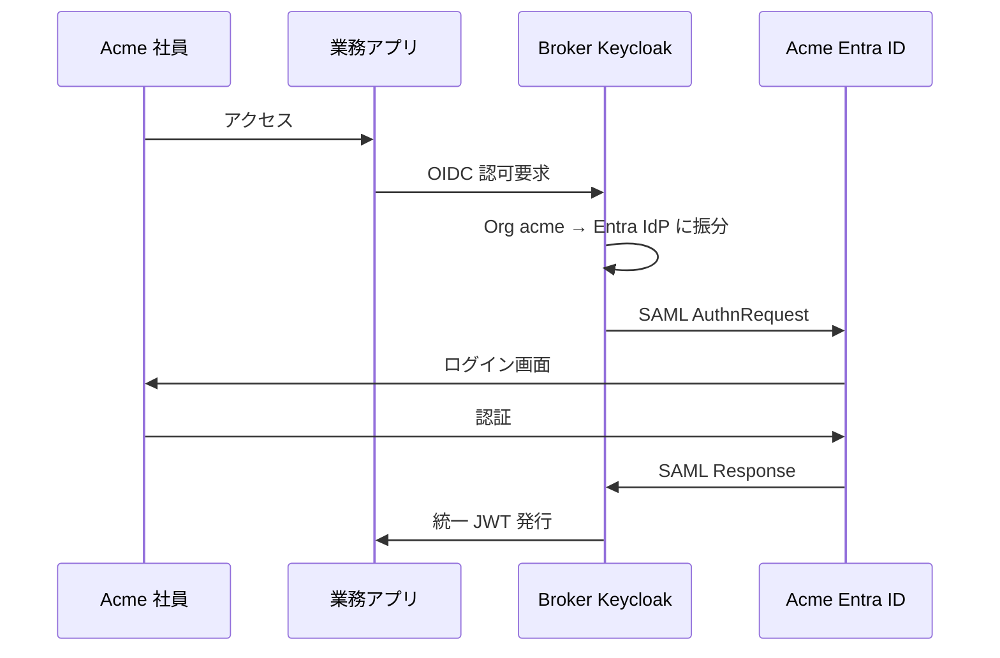
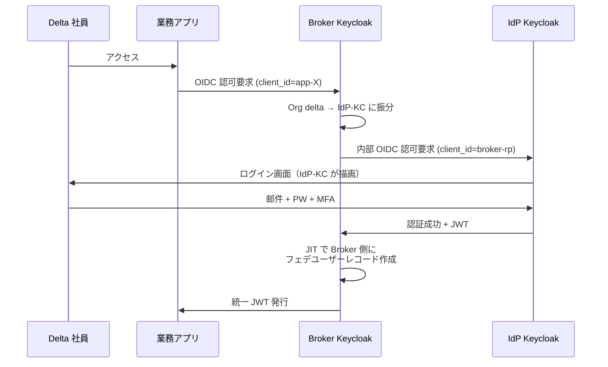
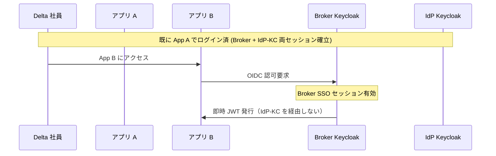
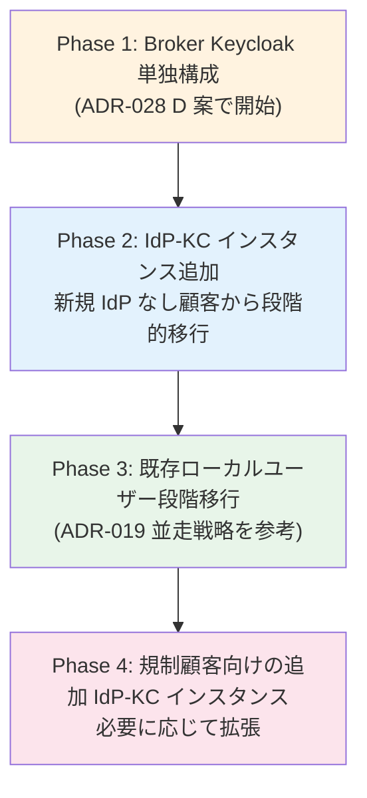

# ADR-033: Keycloak 2-tier アーキテクチャ（Broker Keycloak + IdP Keycloak）

- **ステータス**: Proposed（要件定義フェーズで Accepted に昇格予定）
- **日付**: 2026-06-15 作成、**2026-07-23 更新（IdP-KC 別 AWS アカウント配置 + ROSA 2 クラスタ凍結 + シャーディング拡張パス、P-16/P-17）+ 基本設計 Wave 1 確定反映（`idpkc-oidc01` 単一共有エントリ / IdP alias 命名規則 / アプリ発 CRUD = 専用 API 層 D3-05 / §G 再試算）**

> **2026-07-23 配置前提の更新（P-17）**: IdP-KC は Broker と**別の AWS アカウント**に構築する（ユーザー指示、変更可能性あり）。同アカウント内に構築するアプリからユーザの登録・削除等を直接実施する想定。これに伴い:
> - **クラスタトポロジ = 別アカウント 2 クラスタ（ROSA HCP × 2）で凍結**（2026-07-23 ユーザー判断。クラスタ 1 本増分 ≒ +$500/月 + DR 側は許容し、権限分界・障害隔離を優先）
> - **アプリ → IdP-KC のユーザ CRUD 経路**（Keycloak Admin API 直 / SCIM / 専用 API 層）が新規設計論点 → 基本設計 U3（[00-basic-design-plan.md](../basic-design/00-basic-design-plan.md)）→ **2026-07-23 確定: 3 案比較の結果、専用 API 層（案 C）を採用（[U3 D3-05](../basic-design/03-identity-provisioning-design.md)）— 本論点はクローズ**
> - Broker ↔ IdP-KC 間はクロスアカウント経路（OIDC federation の HTTPS 経路設計）→ 基本設計 U6
> - **1000 社超過時の拡張パス**: IdP-KC 側をシャーディング（例: 500 IdP/クラスタ）して Broker KC の IdP 数を圧縮（[keycloak-1000idp-scalability-research.md](../basic-design/research/keycloak-1000idp-scalability-research.md)）
> - 本文 §G のインフラ規模試算は EKS/同一 Acct 前提の旧記述を含む → **ROSA HCP 前提の再試算は [U6 §6.5](../basic-design/06-infra-network-design.md) で実施済み**
>
> **2026-07-23 基本設計 Wave 1 確定の追記**:
> - **Broker 側の IdP-KC 向け IdP は単一共有 OIDC エントリ `idpkc-oidc01`**（顧客別エントリは不採用、[U2 §2.2.2](../basic-design/02-keycloak-logical-design.md)）
> - **IdP alias は製品中立の `<orgAlias>-<proto><NN>` 規則**（本文/図の `acme-entra` 例は PoC 時代の表記であり本番規則ではない、[U2 §2.1.4](../basic-design/02-keycloak-logical-design.md)）

- **関連**:
  - [ADR-017 マルチテナント L2（単一 Pool/Realm + 複数 IdP）採用根拠](017-multitenant-l2-single-realm.md)
  - [ADR-028 IdP なし顧客のローカルユーザー管理 — 4 選択肢の比較](028-idpless-customer-local-user-management.md)
  - [ADR-032 10M MAU 規模における CIAM プラットフォーム選定](032-ciam-platform-cost-comparison-10m-mau.md)
  - [§FR-1.2.0.0 ローカルユーザーの定義](../requirements/proposal/fr/01-auth.md#fr-1200-ローカルユーザーとは何か--利用者カテゴリ別の分析)
  - [§FR-2.3.A IdP なし顧客のローカルユーザー管理](../requirements/proposal/fr/02-federation.md#fr-23a2-idp-なし顧客のローカルユーザー管理--パスワードハッシュの同居問題)

---

## Context

ADR-032 で 10M MAU 規模では **Keycloak OSS が圧倒的優位**（Entra External ID / Cognito / Auth0 は MAU 単価でコスト破綻）と確定した。一方 ADR-028 では「IdP を持たない顧客のローカルユーザー管理」で **4 つの選択肢（A 共通 Pool / B 顧客別 Pool / C Mini IdP / D ハイブリッド）** を提示し、D 案を推奨してきた。

しかし 10M MAU 規模で IdP なし顧客が一定数含まれる場合、ADR-028 D 案（一般顧客は Broker 共通 Pool でローカル管理）には次の構造的問題が残る:

1. **Broker DB にローカル PW ハッシュが同居** — 一般顧客向けの妥協であり、漏洩時の影響範囲が広い
2. **Broker の責務肥大化** — 認証集約（フェデ仲介）+ ローカルユーザー管理（PW / MFA / サインアップ UI）の二役を 1 インスタンスが担う
3. **変更頻度の異なる業務が同居** — Broker（顧客 IdP 追加が高頻度）と ローカルユーザー管理（PW ポリシー変更が低頻度）が同じバージョン管理サイクル
4. **障害ドメインが広い** — Broker 停止で IdP あり顧客もログイン不能

業界調査（[oneuptime.com 2026-01](https://oneuptime.com/blog/post/2026-01-25-keycloak-identity-management/view) / [keycloak-orgs](https://github.com/p2-inc/keycloak-orgs)）によれば **Keycloak-to-Keycloak federation は標準パターン**で、Keycloak は OIDC Provider と OIDC Client の両役割を同一インスタンスで提供できる。これを活用して **Broker と IdP を 2 インスタンスに物理分離**する 2-tier アーキテクチャが構成可能。

本 ADR は、この 2-tier アーキテクチャを ADR-028 の 4 案に加える **第 5 の選択肢「E. 2-tier 別インスタンス」** として正式化し、10M MAU かつ IdP なし顧客が含まれるシナリオでのデフォルト構成として採用する。

---

## Decision

### 2-tier Keycloak アーキテクチャを採用

### テナント設計

両 Tier とも **Single Realm + Organizations**（Keycloak v26+ 公式機能）を採用:

| Tier | テナント表現 | 含まれる顧客 |
|---|---|---|
| **Tier 1 Broker Keycloak** | Single Realm + 全顧客分の Organizations | 全顧客（IdP あり + IdP なし）|
| **Tier 2 IdP Keycloak** | Single Realm + IdP なし顧客分の Organizations | IdP なし顧客のみ（Delta, DeltaCo 等）|

→ ADR-017（マルチテナント L2 単一 Realm + 複数 IdP）の方針と整合。**Realm per Tenant は 100-400 で性能劣化**するため、両 Tier で採用しない。

---

## A. 技術的実現性

### Keycloak-to-Keycloak Federation は標準パターン

公式ドキュメント / コミュニティ事例で広く採用:

> "Keycloak B serves as an Identity Provider that connects to Keycloak A... Once connected from Keycloak A to Keycloak B via OIDC, users registered on Keycloak B can connect themselves with their Keycloak B credentials through Keycloak A"
> — [oneuptime.com / Keycloak Identity Management, 2026-01](https://oneuptime.com/blog/post/2026-01-25-keycloak-identity-management/view)

Keycloak は **OIDC Provider（IdP）と OIDC Client（RP）の両役割**を同一インスタンスで提供できるため、IdP Keycloak を Broker Keycloak の「外部 OIDC IdP」として登録するだけで連携完了。

### 10M MAU 規模での Keycloak スケーラビリティ

公式ベンチマーク（[Keycloak 26.4 Performance Benchmarks, 2025-10](https://www.keycloak.org/2025/10/keycloak-benchmark)）から試算:

| パラメータ | 試算値（10M MAU 想定）|
|---|---|
| 同時セッション（ピーク 10%）| 〜100 万 |
| ログイン RPS（ピーク）| 〜1,000-3,000 RPS |
| 必要 vCPU（0.35-0.7 / 100 RPS）| **〜10-21 vCPU** |
| Aurora Write IOPS（1,400 / 100 RPS）| **〜14,000-42,000 IOPS** |
| Pod メモリ | 1,250 MB / pod、70% Heap |
| 推奨構成 | EKS 3+ ノード、Aurora I/O-Optimized、auto-scaling |

→ 実証データ:
- 本番運用 2,600 Realm（[ADR-017](017-multitenant-l2-single-realm.md) より）
- Keycloak Benchmark で 12,000 RPS 確認
- **10M MAU は技術的に十分到達可能**

### Single Realm + Organizations の正当性

Keycloak 26.x の Organizations 機能により、Realm-per-tenant の性能制約（100-400 Realm で劣化）を回避しつつ顧客ごとの論理分離が可能。

> "A multi-realm architecture means a single Keycloak instance contains one realm per tenant. However, performance is degraded beyond a hundred or so realms... For larger scales, a single realm is recommended."
> — [Phase Two: Multi-Tenancy Options](https://phasetwo.io/blog/multi-tenancy-options-keycloak/)

> "Phase Two's Organizations Extension for Keycloak enables true multi-tenancy within a single realm—a more scalable and resource-efficient model."
> — [keycloak-orgs](https://github.com/p2-inc/keycloak-orgs)

---

## B. 役割分担マトリクス

| 観点 | Broker Keycloak（Tier 1）| IdP Keycloak（Tier 2）|
|---|---|---|
| **責務** | 認証集約・JWT 発行・Organizations + IdP リンク管理 | ローカル PW・MFA・サインアップ UI |
| **ユーザーレコード** | フェデユーザー（IdP リンクのみ、PW なし）| **PW ハッシュ + 個人情報**（IdP なし顧客全員）|
| **Organizations 数** | 全顧客分（IdP あり + IdP なし）| IdP なし顧客分のみ |
| **対外接続** | 顧客 IdP（Entra / Okta / IdP-KC 等）| Broker Keycloak からの OIDC RP のみ |
| **MAU 規模見積もり** | 10M（全顧客経由）| 部分（例: IdP なし顧客が 20-30% なら 2-3M）|
| **変更頻度** | 高（顧客 IdP 追加が継続的に発生）| 低（PW ポリシー / サインアップフロー変更）|
| **設定の Source of Truth** | Terraform（IaC）| Terraform（IaC、別 state）|

---

## C. 認証フロー

### シナリオ 1: IdP あり顧客（Acme 社員）

### シナリオ 2: IdP なし顧客（Delta 社員）— 2-tier フロー

→ ユーザー視点では **1 つのログイン画面**（IdP-KC が描画する画面）+ 標準的な 2-tier OIDC フロー（業界標準）。

### シナリオ 3: SSO（同一テナント内 2 アプリ目）

→ **Broker SSO セッション内で完結**、IdP-KC への往復は初回のみ。

---

## D. 4 つの主要なメリット

| メリット | 内容 |
|---|---|
| **1. パスワードハッシュの物理分離** | Broker DB にローカル PW が存在しない。ADR-028 A 案の同居懸念が完全解消。漏洩時の影響範囲は IdP-KC のみに局所化 |
| **2. コスト圧倒的優位** | Keycloak OSS でライセンス費ゼロ、infrastructure のみ。10M MAU で Entra External ID 比 **100 倍以上のコスト削減**（[ADR-032](032-ciam-platform-cost-comparison-10m-mau.md) 確認済み）|
| **3. 責務分離による保守性向上** | Broker = 認証集約・フェデ仲介、IdP-KC = ローカルユーザー管理。**変更頻度・スキルセット・SLA の異なる業務を分離** |
| **4. 規制顧客対応の自然な延長** | 「金融顧客は専用 IdP-KC インスタンスをもう一つ立てる」「医療顧客は別 VPC に隔離」など段階的拡張パスが明確 |

---

## E. 4 つの考慮点（Negative）

| 考慮点 | 内容 | 緩和策 |
|---|---|---|
| **1. 運用複雑性 2 倍** | Keycloak 2 インスタンス + 2 Aurora DB + 2 IaC（Terraform）+ 2 監視 + 2 パッチ運用 | IaC で構成統一、Datadog/Grafana で監視一元化、CI/CD パイプライン共通化 |
| **2. 2 段階認証フロー** | IdP なし顧客は Broker → IdP-KC への内部 redirect が 1 回追加。SSO セッション設計が複雑化（両方の Cookie 管理）| OIDC 標準フローの範囲内、初回のみ往復し SSO 中は完結。Broker / IdP-KC 両方の SSO TTL を整合させる設計 |
| **3. 障害ドメイン** | IdP-KC 停止時、IdP なし顧客の全ユーザーがログイン不能 | EKS Multi-AZ、Aurora Multi-AZ、別 Region への HA を別途検討。Broker は影響受けない（責務分離のメリット）|
| **4. 業界実例の少なさ** | 「Keycloak を Broker と IdP の 2-tier で運用」は理論上可能だが、公開された大規模本番事例が少ない | Phase 1 検証で挙動確認、運用ノウハウは内部ドキュメント化、必要なら Phase Two / Cloud-IAM 等 managed Keycloak サポートを併用 |

---

## F. ADR-028 4 案との対比

| 案 | 概要 | PW 物理分離 | 運用 | コスト | 採用判断 |
|:---:|---|:---:|:---:|:---:|---|
| A. 共通 Pool 集約 | Broker に PW 同居 | ❌ | ◎ 1 つ | ◎ | 一般のみ |
| B. 顧客別 Pool/Realm | Realm 分離（Broker 内）| ✅ | ❌ N 倍 | △ | 過剰 |
| C. Mini IdP（別 Realm）| Broker 内に Mini IdP Realm | ✅ | △ 階層 | △ | 例外的 |
| D. ハイブリッド | 一般 A + 規制 B/C | ⚠ 部分 | ○ | ○ | ADR-028 推奨（〜中規模時）|
| **E. 2-tier 別インスタンス**（本 ADR）| **Broker + IdP-KC 物理分離** | ✅ 完全 | ⚠ 2 倍 | ◎ 10M MAU 時 | **大規模時の推奨** |

### 採用判断基準

| 状況 | 推奨案 |
|---|---|
| MAU < 1M、IdP あり顧客 100%（IdP なし顧客なし）| ADR-028 D 案で十分（ローカル PW 同居が発生しない）|
| MAU 1M-10M、IdP なし顧客が含まれる | **E 案（本 ADR）**を検討開始 |
| MAU 10M+、IdP なし顧客が含まれる | **E 案（本 ADR）採用** |
| 規制顧客（金融・医療）が含まれる | E 案 + 規制顧客は専用 IdP-KC インスタンス追加 |

---

## G. 採用時のインフラ規模試算（参考）

### Broker Keycloak（Tier 1）

| 項目 | 規模 |
|---|---|
| MAU | 10M（全顧客経由）|
| 同時セッション（ピーク 10%）| 〜100 万 |
| ログイン RPS（ピーク）| 〜1,000-3,000 |
| EKS Pod 数 | 10-20 pod（auto-scaling）|
| vCPU 合計 | 〜10-21 |
| Aurora 構成 | Aurora I/O-Optimized、Multi-AZ、r6g.2xlarge × 3-4 |
| 月額試算（AWS）| 〜$5,000-10,000 |

### IdP Keycloak（Tier 2）

| 項目 | 規模（IdP なし顧客 30% 想定）|
|---|---|
| MAU | 〜3M |
| 同時セッション（ピーク 10%）| 〜30 万 |
| ログイン RPS（ピーク）| 〜300-1,000 |
| EKS Pod 数 | 5-10 pod（auto-scaling）|
| vCPU 合計 | 〜5-10 |
| Aurora 構成 | Aurora I/O-Optimized、Multi-AZ、r6g.xlarge × 2-3 |
| 月額試算（AWS）| 〜$3,000-5,000 |

### 合計と比較

| 構成 | 月額試算 | 年額 |
|---|---|---|
| **2-tier Keycloak OSS（本 ADR）** | $8,000-15,000 | **〜$100K-180K** |
| **Entra External ID P1（参考）** | $5,000,000（$0.50 × 10M MAU）| **〜$60M** |
| **差** | — | **〜350-600 倍のコスト削減** |

→ Keycloak OSS 採用の場合、運用人件費を加算しても 1 桁以上の差は維持される（[ADR-032](032-ciam-platform-cost-comparison-10m-mau.md) 詳細試算）。

### G.2 CPU 律速の観点での分離根拠（2026-07-08 追加）

Keycloak は CPU 律速なワークロードであり、**Broker と IdP-KC の CPU プロファイルが根本的に違う**。この違いが 2-tier 分離の技術的正当性を強化する。

**Broker と IdP-KC の CPU 消費源**:

| CPU 消費源 | Broker Keycloak | IdP Keycloak |
|---|---|---|
| **Password Hashing**（bcrypt / Argon2id / PBKDF2）| **~0%**（自身は password 持たない）| **60-80%** |
| JWT Signing（ES256）| 20-30% | 5-10% |
| SAML DSig 検証（顧客 IdP の SAML Response）| 20-30% | ~0% |
| Federation プロトコル処理 | 15-20% | 0% |
| JSON Serialization / JVM オーバーヘッド | 10-15% | 5-10% |

**スループット/vCPU 比較**:

- Broker: **~500-1,500 TPS/vCPU**（JWT signing / SAML DSig 中心）
- IdP-KC: **~50-100 TPS/vCPU**（Password Hashing が支配）
- 差 = **10-30 倍**

→ Broker と IdP-KC は同じ Keycloak でも**別性能スケールのワークロード**。分離しないと Broker が余剰 CPU を持つか、IdP-KC が不足する。

**2-tier 分離の CPU 観点での利点**:

| 観点 | 単一 Keycloak（Broker + IdP 混在）| 2-tier 分離 |
|---|---|---|
| Tier 別 CPU サイジング | 全負荷を単一ノードで捌く必要、bcrypt に引きずられ全体スケール | Tier 別に最適サイズ選定、無駄なし |
| Password Hashing CPU 隔離 | Broker への影響あり（Federation TPS 落ちる）| **完全隔離**、Broker は影響なし |
| Auto Scale トリガ | 統合、細粒度制御難しい | Tier 別に別メトリック |
| 障害 blast radius | Broker 障害 = IdP も止まる | 分離、独立障害 |
| スケールポリシー | 統一（余剰）| Tier 別（最適）|

**フェデ比率別の IdP-KC サイジング感度**（1.5M ユーザ / Peak 125 Login TPS ケース）:

| フェデ比率（B-BROK-1 ヒアリング）| IdP-KC Login TPS | IdP-KC 必要 vCPU（bcrypt cost 12）| IdP-KC 推奨（3 node）|
|---|---|---|---|
| 100% フェデ / 0% ローカル | 0 | 0 | **IdP-KC 不要** |
| 90% / 10% | 12.5 | 3-5 | c7g.large × 3 |
| **70% / 30% ★典型** | 37.5 | 8-15 | **c7g.xlarge × 3** |
| 50% / 50% | 62.5 | 12-20 | c7g.xlarge × 3 or 2xlarge × 3 |
| 30% / 70% | 87.5 | 18-26 | c7g.2xlarge × 3 |
| 0% / 100% ローカル | 125 | 25-35 | c7g.2xlarge × 4-5 |

→ **フェデ比率のヒアリング（B-BROK-1）が IdP-KC サイジングに直結**。詳細な CPU 律速の技術根拠 + Tier 別サイジング公式 + フェデ比率シナリオ別試算は **[reference/keycloak-cpu-bottleneck-sizing-guide.md](../reference/keycloak-cpu-bottleneck-sizing-guide.md)** 参照。

### G.3 Shallow Broker の定義と Minimum Storage 方針（2026-07-08 追加）

「Shallow Broker」という用語は本 ADR 内で使用しているが、Keycloak 公式用語ではなく設計指針の呼称。以下で正確に定義する。

#### Shallow Broker の意味

「Shallow Broker」= **credential テーブルに PW ハッシュを保存しない**という設計判断。以下との対比:

| 分類 | credential テーブル | 認証実行主体 | 実現 |
|---|---|---|---|
| **Deep Broker** | PW ハッシュ保存 | Broker 自身 | Keycloak 標準（Local User Realm）|
| **Shallow Broker** ★本基盤 | **空**（フェデユーザは PW なし）| 顧客 IdP | Keycloak 標準（Federation Realm）|
| True Zero-storage Broker | 空 + user_entity も持たない | 外部 IdP | Custom User Storage SPI 必須（Non-standard）|

→ **本基盤の「Shallow Broker」は Keycloak 標準の Federation Realm 挙動**であり、Custom SPI 開発を伴わない。

#### Broker が保有する情報の実態

Shallow Broker（本基盤）でもフェデユーザについて以下は普通に保存される（Keycloak 標準動作）:

- **user_entity**: id, username, email, enabled 等
- **user_attribute**: IdP Mapper で Import した属性（可変）
- **federated_identity**: 顧客 IdP との連携情報
- **user_role_mapping / user_group_membership**: ロール・グループ
- **user_session / client_session**: セッション状態

**空になる（PW hash 非保持）**:
- **credential**: PW hash / MFA 秘密鍵はフェデユーザに対して発行されない

→ 「Shallow = ほぼ何も持たない」は誤解。「Shallow = PW hash 非保持、それ以外は保存」が正確。

#### Minimum Storage 方針（Shallow Broker のさらなる細分化）

事故時の影響範囲を限定し、APPI 安全管理措置対象データを縮小するため、Broker の user_attribute 保存を最小化する **Minimum Storage 方針**を採用可能:

| 方針 | user_attribute 保存内容 | 実装 |
|---|---|---|
| **L1: フル保有**（Metatavu 標準）| department / manager / cost_center 等全属性 | IdP Mapper 標準設定 |
| **★ L2: Minimum Storage** ★本基盤採用 | username / tenant_id のみ | IdP Mapper で Import 属性を絞る + Claim Mapper で JWT 埋込 |
| L3: ほぼゼロ保有 | user_entity.id + session のみ | Custom User Storage SPI（2-4 週間開発）|

**L2 Minimum Storage の実装**:
- IdP Mapper で Import 属性を制限（username / tenant_id のみ）
- 他属性は Claim ベースで都度取得、DB 保存なし
- Role / Group は Claim Mapper で JWT に埋込、user_role_mapping 未使用
- Sync Mode = FORCE で毎回上書き（陳腐化防止）

**APPI 上の位置付け**（重要な認識）:
- APPI に「データ最小化」明示規定は**存在しない**（GDPR とは異なる）
- Minimum Storage は義務ではなく、**事故時リスク低減目的のベストプラクティス**
- APPI 適用範囲は L1/L2/L3 いずれでも同じ（保有事業者としての義務）
- 「PII を保有しない」と言えるのは事業者全体で個人特定不可な場合のみ

**メリット**:
- 事故時の影響範囲限定（漏洩通知範囲の縮小）
- 法第 23 条の安全管理措置対象データ量の縮小
- 法第 22 条の努力義務充足の説明容易化
- 法第 30 条の削除権対応コスト削減

詳細は **[ADR-025 §I](025-scim-positioning-and-receive-stance.md#i-2-tier-アーキでの-scim-削除リアルタイム検知設計2026-07-08-追加)** および **[reference/scim-deletion-realtime-detection.md §4-5](../reference/scim-deletion-realtime-detection.md#4-broker-の-pii-最小化方針minimum-storage)** 参照。

---

## H. 運用上の留意点

### 構成管理

- **Terraform で両 Tier を IaC 化**（state 分離）
  - Broker 用 module / IdP-KC 用 module / 共通 module（ネットワーク・KMS 等）
  - PR レビューで両 Tier の整合性チェック
- **realm.json + organizations.json での差分管理**
  - Broker: 顧客 IdP リンクとして IdP-KC を OIDC IdP 登録
  - IdP-KC: Broker を OIDC Client として登録

### 監視・アラート

- **両 Tier で別系統メトリクス**（Prometheus）
- **クロス Tier フロー監視**: Broker → IdP-KC 往復レイテンシ、エラー率
- **SLA 設計**: IdP-KC 停止は IdP なし顧客全員に影響、HA 設計を Broker より厳格に

### パッチ運用

- **Broker と IdP-KC を独立にアップグレード可能**
- ただし Keycloak バージョン差は最大 1 マイナーバージョン以内に維持（互換性）
- Staging 環境で両 Tier 連携を E2E テスト

### バックアップ・DR

- Aurora 自動バックアップ、PITR
- IdP-KC は PW ハッシュ保持のため**バックアップ暗号化必須**（KMS CMK）
- DR シナリオ: Broker 単体障害 / IdP-KC 単体障害 / 両方同時障害を別々に設計

### セキュリティ

- IdP-KC は **VPC Private Subnet** に配置、Broker からのみアクセス可
- IdP-KC のログイン画面公開は Broker 経由のみ（外部 IP からの直接アクセス禁止）
- IdP-KC の Admin Console は Bastion 経由
- Broker と IdP-KC 間の通信は mTLS 推奨（OIDC over mTLS、追加保護）

---

## Consequences

### Positive

- Broker DB からローカル PW ハッシュが完全消滅、漏洩影響範囲を局所化
- 10M MAU 規模で Entra External ID 比 350-600 倍のコスト削減
- Broker と IdP-KC の責務・変更頻度・SLA を分離し、保守性向上
- 規制顧客対応の段階的拡張パスが明確
- Single Realm + Organizations 採用で両 Tier とも 1,000+ 顧客にスケール

### Negative

- Keycloak 2 インスタンス運用（IaC・監視・パッチ・DR）の複雑性 2 倍
- 2 段階認証フロー（初回往復 1 回追加）
- 業界実例が少ないため、運用ノウハウは内部蓄積が必要
- IdP-KC 停止が IdP なし顧客全員に影響

### Constraints

- 中小規模（MAU < 1M）でこの構成を採ると過剰投資、ADR-028 D 案で十分
- 全顧客が IdP を持つ場合は IdP-KC 不要、Broker のみで完結
- Keycloak v26 Organizations 機能採用が前提（v25 以前は Realm-per-tenant に退化）

---

## I. 段階的導入パス

| Phase | タイミング | 内容 |
|---|---|---|
| **Phase 1** | 初期リリース | Broker Keycloak 単独で開始、IdP なし顧客は共通 Pool（ADR-028 D 案）|
| **Phase 2** | IdP なし顧客が 5-10 社になった時点 | IdP-KC インスタンス構築、新規 IdP なし顧客はこちらへ |
| **Phase 3** | Phase 2 安定後 | 既存ローカルユーザーを段階的に IdP-KC へ移行（[ADR-019](019-existing-system-migration.md) 並走戦略を流用）|
| **Phase 4** | 規制顧客獲得時 | 規制顧客向けに追加 IdP-KC インスタンスを別 VPC / Region に構築 |

---

## 参考資料

- [oneuptime: How to Configure Keycloak for Identity Management (2026-01)](https://oneuptime.com/blog/post/2026-01-25-keycloak-identity-management/view)
- [Keycloak 26.4 Performance Benchmarks (2025-10)](https://www.keycloak.org/2025/10/keycloak-benchmark)
- [Keycloak Production Configuration](https://www.keycloak.org/server/configuration-production)
- [Phase Two: Understanding Multi-Tenancy Options in Keycloak](https://phasetwo.io/blog/multi-tenancy-options-keycloak/)
- [keycloak-orgs (Phase Two Organizations Extension)](https://github.com/p2-inc/keycloak-orgs)
- [Cloud-IAM: Keycloak Multi-Tenant Architecture](https://www.cloud-iam.com/post/keycloak-multi-tenancy/)
- [Alauda Build of Keycloak: Identity Federation](https://docs.alauda.io/keycloak/26.4/concepts/30-identity_federation.html)
- [Skycloak: Authentication Capacity Planning for Production](https://skycloak.io/blog/authentication-capacity-planning-scaling-peak-usage-periods/)
- [Kloia: Keycloak on AWS EKS and Aurora](https://www.kloia.com/blog/simplifying-authentication-and-authorization-with-keycloak-on-aws-eks-and-aurora)

- 関連 Claude 内部メモリ: `project_keycloak_2tier_architecture.md`
