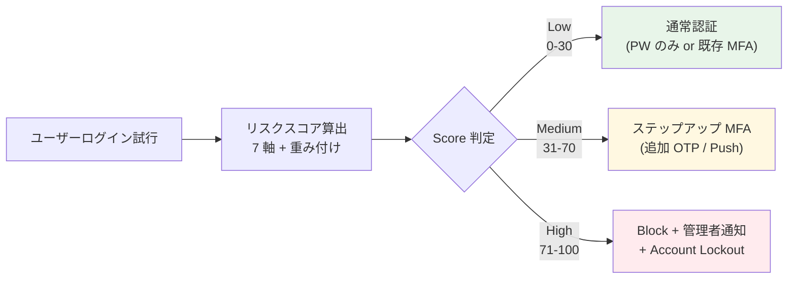
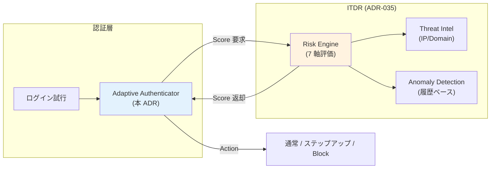

# ADR-034: Adaptive Authentication（Risk-based 認証）の設計

- **ステータス**: Proposed（要件定義フェーズで Accepted に昇格予定）
- **日付**: 2026-06-18
- **関連**:
  - [§FR-3 MFA](../requirements/proposal/fr/03-mfa.md)
  - [ADR-026 AAL 不整合とステップアップ MFA](026-aal-mismatch-stepup-mfa.md)
  - [ADR-031 amr/SAML AuthnContext MFA 評価](031-amr-saml-mfa-evaluation.md)
  - [ADR-035 ITDR](035-identity-threat-detection-response.md)（連動）

---

## Context

§FR-3 + ADR-026 で**静的ステップアップ MFA**（acr_values で要求された AAL に応じて補完 MFA）は設計済。しかし業界（Gartner 2026 CIAM / NIST SP 800-63-4 / IDPro BoK）は**動的なリスク評価で認証強度を変える Adaptive / Risk-based Authentication** を必須機能化しつつある:

- **Gartner 2025 Magic Quadrant for Access Management**: Adaptive Authentication が評価必須項目
- **NIST SP 800-63-4 (2025-07)**: Risk-based authentication を AAL2 / AAL3 の補完手段として明示
- **業界標準実装**: AWS Cognito Plus Threat Protection / Keycloak Risk Authenticators / Okta Adaptive MFA / Auth0 Anomaly Detection

本基盤は現状 ADR-026 ステップアップ MFA（**ユーザーが操作した時点での要求 AAL**で判定）までで、**コンテキスト（IP / デバイス / 地理 / 時刻 / 異常パターン）に基づく自動引上げ**は未踏。

---

## Decision

**Adaptive Authentication を §FR-3 の追加サブセクション（§FR-3.6）として正式採用**:

| 項目 | 採用方針 |
|---|---|
| **基本方針** | **コンテキストベース Risk Scoring** + Score 閾値で MFA / Block / 通常認証を動的決定 |
| **評価コンテキスト** | IP / 地理 / デバイス指紋 / ログイン失敗履歴 / 異常時刻 / Impossible Travel / 既知の脅威 IP |
| **アクション** | Low Risk → 通常認証 / Medium → ステップアップ MFA / High → Block + 管理者通知 |
| **実装プラットフォーム** | **Keycloak 採用時**: Risk-based Authenticator SPI（公式機能 + コミュニティ拡張）/ **Cognito 採用時**: Plus ティアの Threat Protection（Adaptive Authentication） |
| **ITDR との連携** | Risk Score 算出ロジックは [ADR-035 ITDR](035-identity-threat-detection-response.md) と統合 |

---

## A. Adaptive Authentication とは

### 定義（Gartner CARTA / NIST 準拠）

> **Adaptive Authentication**: 認証時に**コンテキスト情報**（IP / デバイス / 地理 / 行動 / 履歴）を評価し、**リスクスコア**を算出して**動的に認証強度を調整**する仕組み。低リスクは UX を優先（通常認証）、高リスクは強化（追加 MFA / Block）。

### 静的 vs 動的の違い

| 観点 | 静的ステップアップ MFA（ADR-026）| Adaptive Authentication（本 ADR）|
|---|---|---|
| 判定タイミング | アプリが `acr_values` で要求した時 | **すべてのログイン試行で自動評価** |
| 判定根拠 | 操作の重要度（経費申請 vs 100 万送金）| **コンテキスト**（IP / デバイス / 地理 / 時刻 / 異常パターン）|
| ユーザー視点 | 重要操作時に追加 MFA | **異常検知時のみ追加 MFA**（通常時は UX 維持）|
| 自動化 | アプリ側がトリガー | **基盤が自動判定** |
| 業界位置 | RFC 9470（OAuth Step-Up）| Gartner CARTA / NIST 800-63-4 |

→ **両者は補完関係**。Adaptive で異常時の自動引上げ + ADR-026 ステップアップで操作時の引上げ。

---

## B. リスク評価コンテキスト（7 軸）

業界標準（Cognito Plus / Keycloak Risk-based / Microsoft Entra ID Protection）の評価軸:

| # | コンテキスト | 評価内容 | データソース |
|:---:|---|---|---|
| **1** | **IP レピュテーション** | 既知の脅威 IP / Tor exit node / Anonymous Proxy | 商用 Threat Intel（Spamhaus / Cisco Talos 等）|
| **2** | **地理的位置** | 通常利用国と異なる国からのアクセス | MaxMind GeoIP 等 |
| **3** | **Impossible Travel** | 短時間で物理的に不可能な位置移動 | GeoIP + 時刻差 |
| **4** | **デバイス指紋** | 既知デバイスか / 新規デバイスか | Browser fingerprinting / Device cookie |
| **5** | **ログイン失敗履歴** | 直近 N 分の失敗回数 / Brute Force パターン | 認証ログ |
| **6** | **異常時刻** | 業務時間外 / 普段使わない時間帯 | ユーザー履歴 |
| **7** | **既知の Compromised Credentials** | HIBP / 漏洩クレデンシャル DB ヒット | HaveIBeenPwned API / Cognito Plus 内蔵 |

### 追加コンテキスト（高度な実装）

| # | コンテキスト | 説明 |
|:---:|---|---|
| 8 | User-Agent 異常 | 既知ブラウザではない / ヘッドレスブラウザ |
| 9 | ASN（自治システム番号）| 通常 ISP と異なる AS |
| 10 | 行動分析（UEBA）| キーストロークタイミング / マウス動き |
| 11 | セッション履歴 | 同時複数セッション数 |
| 12 | 失敗 → 成功パターン | 連続失敗後の成功 = ATO 兆候 |

---

## C. リスクスコア → アクション マッピング

| Score 範囲 | リスク | アクション | UX 影響 |
|---|:---:|---|---|
| 0-30 | Low | 通常認証（既存 AAL 維持）| なし |
| 31-70 | Medium | ステップアップ MFA 要求 | 追加 MFA 1 回 |
| 71-100 | High | **認証 Block** + 管理者通知 + Account Lockout（24h）| ログイン不可、管理者解除待ち |

### 閾値カスタマイズ

| 顧客タイプ | Low | Medium | High |
|---|---|---|---|
| デフォルト | 0-30 | 31-70 | 71-100 |
| 規制業種（金融）| 0-15 | 16-50 | 51-100（厳しい）|
| B2C（UX 優先）| 0-50 | 51-85 | 86-100（緩い）|
| 内部利用のみ | 0-40 | 41-80 | 81-100 |

---

## D. プラットフォーム別実装

### Keycloak での実装

| 機能 | 提供 | 詳細 |
|---|:---:|---|
| **Brute Force Detection** | ✅ 標準 | Realm Settings > Security Defenses |
| **Conditional Authenticator** | ✅ 標準 | User Role / Group / IP / Cookie ベース条件分岐 |
| **Risk-based Authenticator SPI** | ⚠ Custom 実装 | Risk Score 算出 → Conditional 分岐の Custom Authenticator |
| **コミュニティ拡張** | ⚠ あり | [keycloak-risk-based-authn](https://github.com/...) 等 |
| **Threat Intel 連携** | ❌ 自前実装 | HIBP API / MaxMind / 商用 API 呼出 |
| **デバイス指紋** | ⚠ Custom Authenticator | Browser fingerprint 取得 + Keycloak Session 紐付 |
| **Impossible Travel** | ⚠ Custom 実装 | 前回 IP + 時刻差 + GeoIP API |

### Cognito での実装

| 機能 | 提供 | 詳細 |
|---|:---:|---|
| **Threat Protection**（旧 Advanced Security）| ✅ **Plus ティアのみ** | Adaptive Authentication 公式機能、$0.05/MAU 追加課金 |
| 危険アカウント検出 | ✅ Plus | Compromised Credentials Check 含む |
| Risk Score | ✅ Plus | Low / Medium / High 自動算出（カスタマイズ可）|
| ユーザー通知 | ✅ Plus | 異常検知時 SES 経由メール通知 |
| Adaptive MFA | ✅ Plus | Score 連動の MFA 要求 |
| カスタム評価追加 | ⚠ Pre Token Lambda V2 | 独自スコアリングを Lambda で追加可能 |

→ **Cognito は Plus ティアで「すぐに使える」、Keycloak は「自前構築の柔軟性」**。本基盤の Keycloak 採用方針なら Custom Authenticator SPI 実装が前提。

---

## E. 我々のスタンス（基本方針との整合）

| 基本方針の柱 | Adaptive Authentication での実現 |
|---|---|
| **絶対安全** | 異常検知時の自動引上げ + Compromised Credentials 検出 |
| **どんなアプリでも** | 認証基盤が自動判定、アプリ無変更 |
| **効率よく認証** | 通常時は UX 維持（追加 MFA なし）、異常時のみ強化 |
| **運用負荷・コスト最小** | Cognito Plus 採用なら設定のみ / Keycloak は初期実装後はメンテのみ |

---

## F. ITDR との連携（ADR-035）

Adaptive Authentication の**リスクスコア算出ロジック**は ADR-035 ITDR と統合:

→ **Adaptive Authentication は「動的判定」、ITDR は「Risk Score 算出 + 監視 + 通知」**。本基盤では両者を統合実装。

---

## G. 段階的導入パス

| Phase | 内容 | タイミング |
|---|---|---|
| **Phase 1** | Brute Force Detection（Keycloak / Cognito 標準）+ Compromised Credentials 検出 | 初期 |
| **Phase 2** | IP レピュテーション + 地理的位置（GeoIP）追加 | 半年後 |
| **Phase 3** | デバイス指紋 + Impossible Travel | 1 年後 |
| **Phase 4** | 行動分析（UEBA）+ AI/ML ベース異常検知 | 必要時 |

---

## Consequences

### Positive

- 異常時の自動 MFA 引上げで ATO（Account Takeover）攻撃を抑止
- 通常時は UX 維持、規制業種要求にも対応
- ADR-026 静的ステップアップと補完関係で**動的 + 静的の二重防御**
- 業界標準（Gartner / NIST）準拠

### Negative

- Keycloak 採用時は Custom Authenticator SPI 実装が必要（初期工数）
- 商用 Threat Intel 連携時は別途ライセンス費（年額数百 USD〜）
- False Positive（正常ユーザーが Block）対策の運用設計が必要
- Cognito Plus 採用時は $0.05/MAU 追加課金

### 顧客への説明テンプレート

> 「本基盤は **Adaptive Authentication** を実装し、ログイン試行ごとに IP / 地理 / デバイス / 履歴を評価して**動的にリスクスコアを算出**します。**通常利用時は UX を維持**しつつ、**異常検知時のみ追加 MFA を要求**します。これにより業界標準の Account Takeover 攻撃対策を実現します（Gartner / NIST 準拠）」

---

## 参考資料

- [NIST SP 800-63-4 Digital Identity Guidelines](https://nvlpubs.nist.gov/nistpubs/SpecialPublications/NIST.SP.800-63-4.pdf)
- [Gartner CARTA Framework](https://www.gartner.com/en/documents/3804470)
- [AWS Cognito Threat Protection](https://docs.aws.amazon.com/cognito/latest/developerguide/cognito-user-pool-settings-threat-protection.html)
- [Keycloak Brute Force Detection](https://www.keycloak.org/docs/latest/server_admin/index.html#password-guess-brute-force-attacks)
- [Microsoft Entra ID Protection](https://learn.microsoft.com/en-us/entra/id-protection/overview-identity-protection)
- [Okta Adaptive MFA](https://www.okta.com/products/adaptive-multi-factor-authentication/)
- 関連 Claude 内部メモリ: `project_coverage_audit_2026-06-18.md`
