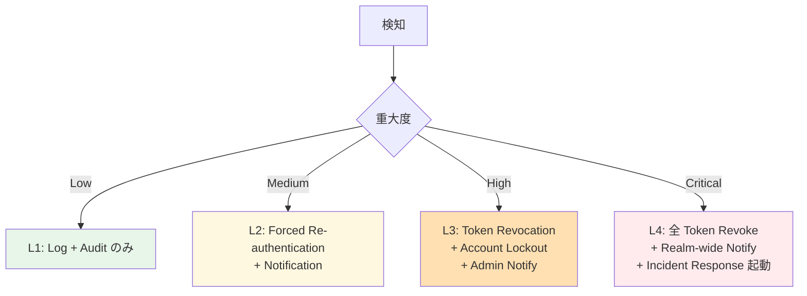
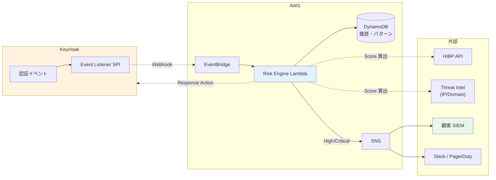

# ADR-035: Identity Threat Detection and Response (ITDR) 設計

- **ステータス**: Proposed（要件定義フェーズで Accepted に昇格予定）
- **日付**: 2026-06-18
- **関連**:
  - [§NFR-4 セキュリティ](../requirements/nfr/04-security.md)
  - [ADR-034 Adaptive Authentication](034-adaptive-authentication.md)（連動）
  - [common/scim-operations.md §5](../common/scim-operations.md)（SCIM 非対応 IdP 顧客への ITDR 投資パターン B）

---

## Context

Gartner が **2022 年に "Identity Threat Detection and Response (ITDR)"** を独立カテゴリとして定義し、2024-2026 で急成長領域として注目。Microsoft Defender for Identity / CrowdStrike Falcon Identity Protection / SentinelOne Singularity Identity / Silverfort 等の専用製品が登場。

本基盤の現状の §NFR-4 セキュリティでは「監査ログ」「侵害クレデンシャル検出」を断片的に扱うが、**ITDR の体系的な設計は未踏**。「認証基盤」として「**認証経路の脅威を能動的に検知・対応する機能**」が抜けている。

### なぜ ITDR が今重要か

| トレンド | 出典 |
|---|---|
| **アイデンティティ攻撃が主要侵入経路に**（80% 以上）| Verizon DBIR 2024 |
| **MFA バイパス攻撃の急増**（Adversary-in-the-Middle / Token Theft）| CISA / Microsoft Security 2024 |
| **Session Hijacking が増加**（cookie theft、token replay）| Mandiant M-Trends 2024 |
| **Compromised Credentials が侵害の起点 60%**| HaveIBeenPwned / Verizon |
| **既存 EDR / SIEM では検知困難**（Identity 層の専用検知が必要）| Gartner 2024 |

---

## Decision

**ITDR を本基盤の §NFR-4 拡張として組み込む**:

| 項目 | 採用方針 |
|---|---|
| **基本方針** | **Detection（検知）+ Response（対応）の自動化パイプライン**を構築 |
| **検知対象 6 領域** | Compromised Credentials / Anomaly Login / Token Theft / Session Hijacking / Privileged Account Abuse / MFA Bypass Attempt |
| **対応自動化** | 自動 Block / Token Revocation / 管理者通知 / Account Lockout / Forced Re-authentication |
| **アーキテクチャ** | Keycloak Event Listener SPI → EventBridge → Lambda → DynamoDB（履歴）+ Slack/PagerDuty 通知 + SIEM 連携 |
| **Adaptive Auth との連携** | ITDR の Risk Score を [ADR-034 Adaptive Authentication](034-adaptive-authentication.md) に供給 |
| **SIEM 統合** | 業界標準形式（CEF / LEEF / OCSF）でログ出力、顧客 SIEM 連携可 |

---

## A. ITDR とは（Gartner 定義）

> **Identity Threat Detection and Response (ITDR)**: アイデンティティインフラ（IdP / Directory / Authentication Service）に対する**攻撃を検知し、対応する**ためのセキュリティ規範・ツール群。EDR / XDR / SIEM の Identity 層特化版。

### 既存セキュリティとの違い

| カテゴリ | 守備範囲 | ITDR の差分 |
|---|---|---|
| **EDR**（Endpoint Detection）| エンドポイント（PC / サーバー）| Identity 層は手薄 |
| **XDR**（Extended Detection）| エンドポイント + ネットワーク + クラウド | Identity 層特化機能不足 |
| **SIEM**（Security Info & Event Mgmt）| 全ログ集約 + 相関分析 | Identity セマンティクス理解せず |
| **ITDR** | **Identity 層特化**（IdP / Directory / Auth）| **MFA Bypass / Token Theft / Privileged Account Abuse** を直接検知 |

---

## B. 検知対象 6 領域

| # | 検知領域 | 攻撃例 | 検知手段 |
|:---:|---|---|---|
| **1** | **Compromised Credentials** | HIBP 漏洩 PW で侵入 | HIBP API + Keycloak Login Event |
| **2** | **Anomaly Login** | 通常と異なる IP / 国 / 時刻 / デバイス | ADR-034 Adaptive Auth Risk Engine |
| **3** | **Token Theft / Replay** | 同一 Token を複数 IP / Geolocation で利用 | Token 使用パターン分析 |
| **4** | **Session Hijacking** | Cookie 盗難後の異常操作 | Session fingerprint 変化検知 |
| **5** | **Privileged Account Abuse** | 管理者アカウントの異常操作 | Role-based 異常検知 + Just-in-Time PAM 連携 |
| **6** | **MFA Bypass Attempt** | MFA Fatigue / MFA Push Bombing / SS7 attack 等 | MFA 失敗パターン + Push 連続発生検知 |

### 詳細パターン（業界事例）

| パターン | 説明 | 業界実例 |
|---|---|---|
| MFA Fatigue Attack | Push 通知を連続送信して承認を強制 | Uber 2022 breach |
| Adversary-in-the-Middle (AiTM) | Phishing で MFA トークンを横取り | Microsoft observed 2023+ |
| Pass-the-Cookie | Session cookie 盗難で MFA バイパス | Cisco Talos 2023 |
| Golden SAML | SAML 署名鍵盗難で任意ユーザー化 | SolarWinds incident |
| Token Theft via Malware | Refresh Token を端末から窃取 | RedLine stealer 等 |

---

## C. 対応アクション（4 レベル）

| Level | 検知例 | アクション |
|:---:|---|---|
| **L1 Log** | 通常範囲のリスク（IP がやや異常等）| ログ記録のみ、後段分析用 |
| **L2 Re-auth** | 中程度の異常（新規デバイス等）| **Forced Re-authentication** + ユーザー通知 |
| **L3 Block** | 高リスク（Impossible Travel / Compromised Credentials 等）| **Token Revocation + Account Lockout** + 管理者通知 |
| **L4 Critical** | 致命的（Golden SAML / 管理者アカウント Compromise）| **全 Token Revoke + Realm 凍結** + Incident Response 起動 |

---

## D. アーキテクチャ（Keycloak ベース）

### 構成要素

| コンポーネント | 役割 | 実装 |
|---|---|---|
| **Keycloak Event Listener SPI** | 認証イベント発生時に Webhook 発火 | Phase Two `keycloak-events` or 自前 SPI |
| **EventBridge** | イベント Routing | AWS EventBridge |
| **Risk Engine Lambda** | スコア算出 + アクション判定 | Node.js / Python Lambda |
| **DynamoDB** | 履歴・パターン蓄積 | ログイン履歴・IP 履歴・デバイス履歴 |
| **SNS** | 通知配信 | Slack / PagerDuty / SIEM 統合 |
| **SIEM 連携** | 顧客 SIEM への出力 | CEF / LEEF / OCSF フォーマット |

---

## E. SIEM 統合（業界標準フォーマット）

顧客 SIEM（Splunk / QRadar / Microsoft Sentinel / Datadog / Sumo Logic 等）への ITDR イベント出力:

| フォーマット | 用途 | 採用 SIEM |
|---|---|---|
| **OCSF**（Open Cybersecurity Schema Framework、AWS / Splunk / IBM 推進）| 業界標準化中、本基盤の**第一推奨** | AWS Security Lake / Splunk / その他多数 |
| **CEF**（Common Event Format）| 老舗、ArcSight 系で標準 | ArcSight / Splunk |
| **LEEF**（Log Event Extended Format）| IBM QRadar 用 | QRadar |
| Syslog | 汎用 | 多数 |
| JSON（生）| カスタム連携 | Datadog / Sumo Logic |

→ **OCSF 第一推奨**（Gartner 2026 で業界標準化見通し）。CEF / LEEF / Syslog は要望に応じてサポート。

---

## F. Adaptive Authentication との連携

ITDR は [ADR-034 Adaptive Authentication](034-adaptive-authentication.md) の**Risk Score 算出エンジン**を提供:

| ITDR コンポーネント | Adaptive Auth での利用 |
|---|---|
| Risk Engine Lambda | Adaptive Auth が呼出してスコア取得 |
| DynamoDB 履歴 | Impossible Travel / 異常パターン判定 |
| Threat Intel | IP レピュテーション / Compromised Credentials |
| 通知パイプライン | 異常検知時の管理者通知 |

→ **ITDR は基盤、Adaptive Auth はその上の認証層実装**。両者は密結合で設計。

---

## G. 我々のスタンス

| 基本方針の柱 | ITDR での実現 |
|---|---|
| **絶対安全** | アイデンティティ脅威の能動検知 + 自動対応 |
| **どんなアプリでも** | 認証基盤レベルで検知、アプリ無変更 |
| **効率よく認証** | False Positive 抑制、UX への影響最小化 |
| **運用負荷・コスト最小** | OSS Keycloak Event + AWS 標準サービス（EventBridge/Lambda）で完結 |

---

## H. 段階的導入パス

| Phase | 検知領域 | 対応アクション | タイミング |
|---|---|---|---|
| **Phase 1** | Compromised Credentials（HIBP）+ Brute Force | L2 Re-auth + L3 Block | 初期 |
| **Phase 2** | Anomaly Login（IP/地理/時刻）+ Impossible Travel | L2 + L3 | 半年後 |
| **Phase 3** | Token Theft / Session Hijacking | L3 + L4 | 1 年後 |
| **Phase 4** | MFA Bypass / Privileged Account Abuse + AI/ML | 全 Level | 必要時 |
| **Phase 5** | SIEM 連携（OCSF 出力）| Customer SIEM | 顧客要件次第 |

---

## I. SCIM 非対応 IdP 顧客への ITDR 投資パターン B との関係

[common/scim-operations.md §5](../common/scim-operations.md) で言及した「**案 B: ITDR 投資（脅威検知）**」（SCIM 非対応 IdP 顧客向けの compensating control）は本 ADR の Phase 1-3 で実装される機能を指す。

具体的には:
- 退職者のアカウント不正利用検知（Anomaly Login + Privileged Account Abuse）
- SCIM Deprovision 未実施の代替として、**振る舞い検知で即時 Block**

---

## Consequences

### Positive

- 業界標準（Gartner ITDR）に準拠した能動的脅威検知
- Compromised Credentials / MFA Bypass 等の最新攻撃に対応
- Adaptive Authentication と統合で動的防御を実現
- 顧客 SIEM 連携で監視一元化可能
- SCIM 非対応 IdP 顧客の deprovision 不備を補完

### Negative

- Risk Engine Lambda の初期実装（Node.js/Python で 1-2 ヶ月）
- Threat Intel ライセンス費（HIBP は無料、商用 IP Intel は年額数百 USD〜）
- False Positive 対応の運用設計
- DynamoDB ストレージコスト（イベント量次第）
- Lambda 実行コスト（イベント量次第）

### 試算（10M MAU、1 ログイン/MAU/日想定）

| 項目 | 月額 |
|---|---|
| Lambda 実行（月 3 億イベント）| 〜$1,500 |
| DynamoDB（On-Demand）| 〜$500 |
| EventBridge | 〜$300 |
| SNS / Slack | <$50 |
| **合計** | **〜$2,500/月（〜$30K/年）**|

→ Entra ID Protection 同等機能の MAU 単価コスト（10M MAU で数 M USD/年）と比較し**約 100 倍コスト削減**。

---

## 参考資料

- [Gartner ITDR Definition](https://www.gartner.com/en/information-technology/glossary/identity-threat-detection-and-response-itdr) — 2022 定義
- [Microsoft Defender for Identity](https://www.microsoft.com/en-us/security/business/siem-and-xdr/microsoft-defender-for-identity)
- [CrowdStrike Falcon Identity Protection](https://www.crowdstrike.com/products/identity-protection/)
- [Silverfort Identity Threat Protection](https://www.silverfort.com/)
- [OCSF (Open Cybersecurity Schema Framework)](https://schema.ocsf.io/)
- [Verizon DBIR 2024](https://www.verizon.com/business/resources/reports/dbir/)
- [CISA AiTM Phishing Alert](https://www.cisa.gov/news-events/cybersecurity-advisories/aa23-336a)
- [HaveIBeenPwned API](https://haveibeenpwned.com/API/v3)
- 関連 Claude 内部メモリ: `project_coverage_audit_2026-06-18.md`
