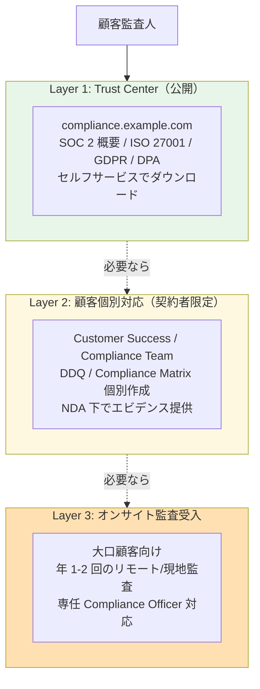
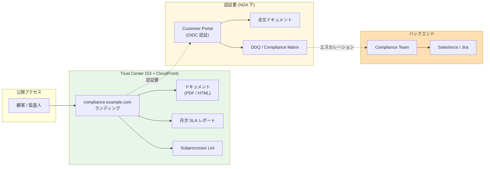

# ADR-036: Customer Audit Support（顧客監査支援）の設計

- **ステータス**: Proposed（要件定義フェーズで Accepted に昇格予定）
- **日付**: 2026-06-18
- **関連**:
  - [§NFR-7 コンプライアンス](../requirements/nfr/07-compliance.md)
  - [common/pci-dss-appi-compliance-gap.md](../common/pci-dss-appi-compliance-gap.md)
  - [ADR-035 ITDR](035-identity-threat-detection-response.md)（監査ログ・SIEM 連携）

---

## Context

B2B SaaS の顧客は自社の **SOC 2 / ISO 27001 / PCI DSS / HIPAA / FedRAMP 等の監査** を年次で実施しており、**サブプロセッサ（本基盤）に対しても監査エビデンス提出を要求**する。Gartner CIAM 2026 でも「Customer Audit Support」が評価項目に含まれる。

現状の §NFR-7 はコンプライアンス**自社準拠**は扱うが、**顧客監査への対応支援**は明示されていない。打ち合わせで顧客から以下のような要求が来た時に応答できる必要がある:

> 「我々の SOC 2 監査人がエビデンスを要求している、提供できるか?」
> 「ISO 27001 の Annex A.9（アクセス制御）統制について、貴社の対応を文書化してほしい」
> 「PCI DSS 8.x 要件への適合状況を Compliance Matrix で示してほしい」

業界主要 SaaS（Salesforce / Microsoft / Auth0 / Okta / AWS）は**Trust Center / Compliance Portal** を運営し、これらの要求にセルフサービスで応えている。

---

## Decision

**Customer Audit Support を §NFR-7 拡張として正式採用**:

| 項目 | 採用方針 |
|---|---|
| **基本方針** | **3 層構成**（Trust Center 公開 / 顧客個別対応 / オンサイト監査受入）|
| **Trust Center（Layer 1、公開）** | SOC 2 Type II 報告書概要 / ISO 27001 認証 / PCI DSS AOC / GDPR 体制等を公開ポータルで提供 |
| **顧客個別対応（Layer 2、契約者限定）**| 顧客固有質問（DDQ）対応、Compliance Matrix 個別作成、エビデンス NDA 下提供 |
| **オンサイト監査受入（Layer 3）**| 大口顧客向け、年 1-2 回の現地監査受入（リモート可）|
| **公開する標準アーティファクト** | SOC 2 Type II / ISO 27001 / PCI DSS AOC / GDPR DPA / SCRR / アーキテクチャ概要 / インシデント対応プロセス / SLA |
| **顧客監査対応の窓口** | 統一窓口（compliance@example.com）、レスポンス SLA 5 営業日 |

---

## A. 顧客監査の典型要求パターン

### 1. ドキュメント要求（最頻出）

| 要求 | 提供形態 |
|---|---|
| **SOC 2 Type II 報告書** | NDA 下で提供（年次更新）|
| **ISO 27001 認証書 + Statement of Applicability** | 公開可能（Trust Center）|
| **PCI DSS AOC**（Attestation of Compliance）| NDA 下、PCI DSS 適合顧客のみ |
| **GDPR 体制説明 + DPA**（Data Processing Agreement）| 公開可能 |
| **アーキテクチャ概要図** | NDA 下、過度な詳細は控える |
| **インシデント対応プロセス** | NDA 下 |
| **データフロー図**（PII の取扱い）| NDA 下、GDPR 顧客向け |

### 2. Compliance Matrix / DDQ（Due Diligence Questionnaire）

顧客が自社の監査人に提示するための**項目別適合状況**:

| フレームワーク | 主な質問例 |
|---|---|
| **SOC 2 Trust Service Criteria** | CC6.1 論理的アクセス / CC7.2 検知 / CC8.1 変更管理 / A1.x 可用性 等 |
| **ISO 27001 Annex A**（A.5〜A.18）| A.9 アクセス制御 / A.10 暗号化 / A.12 運用セキュリティ / A.16 インシデント管理 等 |
| **PCI DSS v4.0** | Req 8 認証 / Req 7 アクセス制御 / Req 10 監査ログ 等 |
| **NIST CSF**（Identify / Protect / Detect / Respond / Recover）| 全カテゴリ |
| **CSA CAIQ**（Cloud Security Alliance Consensus Assessment Initiative Questionnaire）| 130+ 質問 |

→ **業界の標準 DDQ パターン**として CSA CAIQ / SIG（Standardized Information Gathering）/ SIG Lite が広く使われる。

### 3. エビデンス提出（個別案件）

| エビデンス | 例 |
|---|---|
| 監査ログのサンプル | 過去 3 ヶ月のログイン履歴抜粋（PII 匿名化）|
| ペネトレーションテスト結果 | 年次実施の Executive Summary（詳細は NDA 下）|
| 脆弱性スキャン結果 | 月次スキャンのサマリ |
| 設定スクリーンショット | Keycloak Realm 設定 / IAM ポリシー 等 |
| 暗号化設定証跡 | TLS 設定 / Aurora 暗号化設定 等 |

### 4. オンサイト監査 / リモート監査

| 対象 | 内容 |
|---|---|
| **大口顧客**（年間契約 N M USD+）| 年 1-2 回、データセンター見学（リモート可）/ プロセス確認 / インタビュー |
| **規制業種**（金融 / 医療）| 規制機関（FSA / FDA 等）の代行監査 |
| **政府系**（FedRAMP 等）| 連邦政府監査人による独立評価 |

---

## B. 業界標準の 3 層構成



### 業界実例

| サービス | Trust Center URL |
|---|---|
| **Salesforce** | trust.salesforce.com |
| **Microsoft** | servicetrust.microsoft.com |
| **AWS** | aws.amazon.com/compliance/programs |
| **Okta** | trust.okta.com |
| **Auth0** | community.auth0.com / compliance.auth0.com |
| **Atlassian** | trust.atlassian.com |
| **GitHub** | github.com/security |
| **Slack** | slack.com/trust/compliance |

→ **全業界主要 SaaS が Trust Center 運営**、エンタープライズ顧客の前提条件。

---

## C. 公開する標準アーティファクト 10 種

| # | アーティファクト | Layer | 提供条件 |
|:---:|---|:---:|---|
| 1 | **SOC 2 Type II 報告書** | L1（概要）/ L2（全文）| L1: 概要公開 / L2: NDA 下全文 |
| 2 | **ISO 27001 認証書 + SoA** | L1 | 公開可 |
| 3 | **PCI DSS AOC** | L2 | NDA 下、PCI 適合顧客 |
| 4 | **GDPR DPA** | L1 | 公開可、署名版は L2 |
| 5 | **アーキテクチャ概要図** | L2 | NDA 下 |
| 6 | **インシデント対応プロセス** | L2 | NDA 下 |
| 7 | **SLA / 可用性レポート**（月次・年次）| L1 | 公開可 |
| 8 | **データフロー図**（PII / カードデータ等）| L2 | NDA 下、GDPR / PCI 顧客向け |
| 9 | **Subprocessor List**（GDPR Art. 28）| L1 | 公開必須 |
| 10 | **Penetration Test Summary** | L2 | NDA 下、年次更新 |

---

## D. Compliance Matrix テンプレート（SOC 2 / ISO 27001 例）

### SOC 2 Trust Service Criteria 抜粋

| TSC | 要件 | 本基盤の対応 | エビデンス |
|---|---|---|---|
| CC6.1 | 論理的アクセス制御 | OIDC/SAML、MFA、RBAC | Keycloak 設定スクリーンショット |
| CC6.2 | アカウント登録・解除 | JIT/SCIM、Deprovision プロセス | SCIM ログ |
| CC6.3 | 認証情報の管理 | NIST 800-63B 準拠、Hardware MFA | パスワードポリシー設定 |
| CC6.6 | 暗号化（保管・転送）| Aurora 暗号化 + TLS 1.3 | AWS Config / 設定確認 |
| CC7.1 | 構成変更検知 | CloudTrail + Config Rules | 監査ログサンプル |
| CC7.2 | 異常検知 | ITDR（ADR-035）| ITDR イベントサンプル |
| CC8.1 | 変更管理 | IaC + PR レビュー | Git ログ |
| A1.1 | 可用性 SLA | 99.9%（NFR-1）| 月次稼働レポート |

### ISO 27001 Annex A 抜粋

| Annex | 要件 | 本基盤の対応 |
|---|---|---|
| A.9.1 | アクセス制御方針 | Identity Broker パターン（ADR-017）|
| A.9.2 | ユーザーアクセス管理 | JIT/SCIM、退職時 Deprovision |
| A.9.3 | ユーザー責任 | PW ポリシー、MFA |
| A.9.4 | システム・アプリへのアクセス | Token Exchange（FR-6.3）|
| A.10.1 | 暗号化制御 | NFR-4.1 暗号化・鍵管理 |
| A.12.4 | ログと監視 | CloudWatch + ITDR（ADR-035）|
| A.16.1 | インシデント管理 | NFR-6 運用 + ADR-035 ITDR Response |
| A.17.1 | 事業継続性 | NFR-5 DR |
| A.18.1 | 法令・契約遵守 | NFR-7 コンプライアンス |

---

## E. アーキテクチャ（Trust Center 実装）



---

## F. 顧客監査対応の運用プロセス

### レスポンス SLA

| 種類 | SLA |
|---|---|
| Trust Center 公開ドキュメント | 24/7 セルフサービス |
| DDQ 個別回答 | **5 営業日**以内 |
| Compliance Matrix 作成 | **2 週間**以内 |
| エビデンス提出 | **5-10 営業日**以内 |
| オンサイト監査スケジューリング | **2-4 週間**前リードタイム |

### エスカレーションパス

```
Tier 1: Customer Success Manager（標準 DDQ 対応）
  ↓ 専門質問
Tier 2: Compliance Team（Compliance Matrix / エビデンス）
  ↓ 監査機関対応
Tier 3: Chief Compliance Officer / 外部監査法人連携
```

---

## G. 我々のスタンス

| 基本方針の柱 | Customer Audit Support での実現 |
|---|---|
| **絶対安全** | 透明性のあるエビデンス提供で顧客の信頼確保 |
| **どんなアプリでも** | 業界標準（SOC 2 / ISO 27001 / PCI DSS）対応で全顧客カバー |
| **効率よく認証** | Trust Center セルフサービスで Tier 1 対応コスト最小化 |
| **運用負荷・コスト最小** | 標準アーティファクト 10 種を年次更新、個別案件のみ Tier 2-3 対応 |

---

## H. 段階的導入

| Phase | 内容 | タイミング |
|---|---|---|
| **Phase 1** | Subprocessor List + GDPR DPA + SLA 公開（最小 Trust Center）| MVP リリース時 |
| **Phase 2** | SOC 2 Type I 監査受審 + 結果公開 | リリース 6 ヶ月後 |
| **Phase 3** | SOC 2 Type II 監査受審（年次運用エビデンス）| リリース 1 年後 |
| **Phase 4** | ISO 27001 認証取得 | 1.5 年後 |
| **Phase 5** | PCI DSS 認証（カード処理顧客向け、必要時）| 顧客需要次第 |
| **Phase 6** | FedRAMP 等（公共向け、必要時）| 顧客需要次第 |

---

## Consequences

### Positive

- 顧客監査要求に迅速対応（5 営業日 SLA）
- Trust Center で Tier 1 対応コスト最小化
- 業界標準アーティファクト（SOC 2 / ISO 27001 等）整備で顧客信頼向上
- 大口エンタープライズ獲得の前提条件をクリア
- 規制業種顧客対応の根拠資料整備

### Negative

- SOC 2 Type II 監査の年次コスト（$50K-$200K + 内部工数）
- ISO 27001 認証の年次コスト（$30K-$100K）
- Compliance Team の専任化（最低 1 名、規模次第で 3-5 名）
- Trust Center 構築・運用（S3 + CloudFront、年額 $1K-$5K インフラ）
- 顧客個別案件対応の工数（月 5-20 件想定、案件あたり 4-16 時間）

### コスト試算（年額）

| 項目 | 試算 |
|---|---|
| SOC 2 Type II 監査 | $80K |
| ISO 27001 認証維持 | $40K |
| Compliance Team（1 名）| 〜$150K（人件費 + 福利厚生）|
| Trust Center インフラ | $3K |
| 個別対応工数 | 含む（Compliance Team 内）|
| **合計** | **〜$273K/年** |

→ エンタープライズ顧客 10 社獲得すれば回収可能なレベル。

---

## 参考資料

- [AICPA SOC 2 Trust Service Criteria](https://www.aicpa-cima.com/topic/audit-assurance/audit-and-assurance-greater-than-soc-2)
- [ISO/IEC 27001:2022](https://www.iso.org/standard/27001)
- [Cloud Security Alliance CAIQ](https://cloudsecurityalliance.org/research/cloud-controls-matrix/)
- [Salesforce Trust Center](https://trust.salesforce.com/)
- [Microsoft Service Trust Portal](https://servicetrust.microsoft.com/)
- [AWS Compliance Programs](https://aws.amazon.com/compliance/programs/)
- [Okta Trust Portal](https://trust.okta.com/)
- [GDPR Article 28 (Subprocessors)](https://gdpr-info.eu/art-28-gdpr/)
- 関連 Claude 内部メモリ: `project_coverage_audit_2026-06-18.md`
