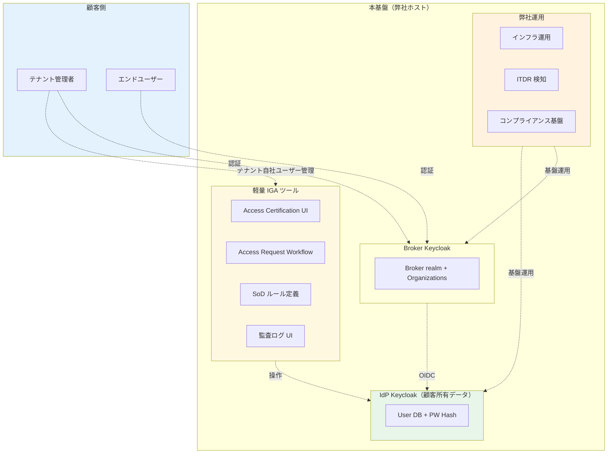

# ADR-037: IdP Keycloak の Shared Responsibility Model と軽量 IGA 設計

- **ステータス**: Proposed（要件定義フェーズで Accepted に昇格予定）
- **日付**: 2026-06-18
- **関連**:
  - [ADR-033 Keycloak 2-tier アーキテクチャ](033-keycloak-2tier-broker-idp-architecture.md)
  - [ADR-019 既存システム移行戦略](019-existing-system-migration.md)
  - [ADR-029 ローカルユーザー定義 — 利用者カテゴリと範囲シナリオ](029-local-user-categories-and-scope-scenarios.md)
  - [§FR-8 管理](../requirements/proposal/fr/08-admin.md)
  - [§FR-1.2.0.B AWS アカウント境界による運用摩擦への対応](../requirements/proposal/fr/01-auth.md)

---

## Context

[ADR-033](033-keycloak-2tier-broker-idp-architecture.md) で確定した 2-tier アーキテクチャ（Broker KC + IdP KC）では、**IdP-KC に移行したローカルユーザーの「所有権」と「責務」**が明示されていなかった。打ち合わせで以下の質問が提起された:

> 「IdP フェデレーションしている顧客 = 顧客管理 / ローカルで新設の IdP-KC に移行したユーザー = どう捉えるべきか?」

これは認証基盤の**所有権モデル**の根幹に関わる論点で、業界標準の **Shared Responsibility Model**（責任分担モデル）で整理する必要がある。あわせて関連する論点として **IGA（Identity Governance and Administration）スコープ**も決定が必要。

### 業界用語の整理（誤解しやすい論点）

| 用語 | スコープ | 本基盤での扱い |
|---|---|---|
| **IGA**（業界用語、Gartner / IDPro 由来）| 認証基盤の**利用者**（B2B 顧客のエンドユーザー）の権限ガバナンス | **本 ADR の対象** |
| AWS IAM | AWS リソースへのアクセス制御（インフラ運用者）| 別物（[NFR-4.5 クロスアカウント IAM](../requirements/proposal/nfr/04-security.md) で扱う）|
| CloudTrail | AWS API コール監査 | 別物（インフラ運用ガバナンス）|
| AWS Organization 統制 | AWS マルチアカウントガバナンス | 別物（インフラガバナンス）|

→ **本 ADR の IGA は「認証基盤の利用者の権限管理」**、AWS インフラのそれとは別物。

---

## Decision

### 採用方針

**「顧客所有・弊社ホスト」の Shared Responsibility Model + 軽量 IGA 内包** を採用。

| 項目 | 採用方針 |
|---|---|
| **IdP-KC ユーザーの所有モデル** | **「顧客所有・弊社ホスト」**（業界標準: Auth0 Premium Tenant / Microsoft Entra External ID / Okta Workforce 同パターン）|
| **責務分担** | **Shared Responsibility Model**（弊社: インフラ・データ保護 / 顧客: ユーザーマスタ運用）|
| **IGA スコープ** | **軽量 IGA 内包**（Access Certification / Access Request Workflow / 基本的な SoD）。**業界トレンド B 案**（[Microsoft Entra ID Governance / Okta Lifecycle Management 同パターン）|
| **インフラガバナンス** | **本 ADR スコープ外**（AWS IAM / CloudTrail / Organization 統制は別 ADR / NFR で扱う）|

---

## A. Shared Responsibility Model（責務分担マトリクス）

### 全体構造：顧客 IdP の場合 vs IdP-KC 移行の場合

責務分担は**顧客が自社 IdP を持っているか / 弊社 IdP-KC に移行しているか**で大きく変わる。両ケースを並列して整理:

| 責務 | フェデ顧客 （顧客 IdP 経由）|||| IdP-KC 移行顧客 ||| 備考 |
|---|---|---|---|---|---|---|---|---|
| **— ↓認証層責務↓ —** | **弊社（Broker のみ）**|| **顧客**|| **弊社（Broker + IdP-KC）**|| **顧客** | |
| **Broker Keycloak インフラ運用** | ✅ || — || ✅ || — | 両ケース共通、弊社 |
| **IdP インフラ運用**（稼働 / パッチ / HA / DR）| — || ✅（顧客 IdP）|| ✅（IdP-KC）|| — | **大きな違い** |
| **ユーザーマスタの物理保管・暗号化** | — || ✅（顧客 IdP に保管）|| ✅（IdP-KC、Aurora + KMS CMK）|| — | **大きな違い** |
| **インフラ層セキュリティ**（VPC / WAF / KMS）| ✅（Broker のみ）|| ✅（顧客 IdP 側）|| ✅（Broker + IdP-KC）|| — | NFR-4 |
| **— ↓ユーザー管理責務↓ —** | || || || | |
| **ユーザーマスタの作成・更新・削除** | — || ✅（顧客 IdP で）|| — || ✅（弊社 IdP-KC を介して）| **両ケースとも顧客責務** |
| **パスワード保管** | — || ✅（顧客 IdP で）|| ✅（IdP-KC が暗号化保管）|| — | **物理保管場所が異なる** |
| **パスワードポリシー適用** | — || ✅（顧客 IdP で設定）|| ⚠ 推奨提示 || ✅ 顧客が最終判断 | IdP-KC は共同責任 |
| **MFA 強制** | — || ✅（顧客 IdP で設定）|| ⚠ 推奨提示 || ✅ 顧客が最終判断 | 同上 |
| **ロール / 権限の付与** | — || ✅（顧客 IdP で + 本基盤の roles claim）|| — || ✅（ユーザ管理画面 経由）| 顧客業務判断 |
| **退職時 Deprovision** | ⚠ JIT/SCIM 受信 || ✅ 実施 || ⚠ ツール提供 || ✅ 実施 | 顧客責務、本基盤はインターフェース |
| **— ↓セキュリティ責務↓ —** | || || || | |
| **Compromised Credentials 検知** | ⚠ Broker 経由のみ || ✅（顧客 IdP 側 PW）|| ✅（IdP-KC ITDR）|| — | **大きな違い**、ADR-035 |
| **アカウント乗っ取り検知** | ⚠ Broker 経由ログイン || ✅（顧客 IdP 側）|| ✅（IdP-KC ITDR）|| — | ADR-035 |
| **インシデント通知** | ✅（Broker 範囲）|| ✅（顧客 IdP 範囲）|| ✅（IdP-KC + Broker）|| — | NFR-6 |
| **— ↓ガバナンス責務↓ —** | || || || | |
| **アクセスレビュー**（Access Certification）| — || ✅（顧客の IGA 製品で）|| ⚠ 軽量 IGA ツール提供 || ✅ 実施 | IdP-KC では本基盤がツール提供 |
| **監査ログ提供** | ✅（Broker 経由分）|| ✅（顧客 IdP 内部）|| ✅（IdP-KC + Broker 全量）|| — | Trust Center 経由 |
| **監査ログの分析・対応** | — || ✅ || — || ✅ | 顧客責務 |
| **コンプライアンス基盤**（SOC 2 / ISO 27001 / PCI DSS）| ✅（Broker 範囲）|| ✅（顧客 IdP 自社準拠）|| ✅（Broker + IdP-KC 範囲）|| — | NFR-7 + ADR-036 |
| **データ削除請求（GDPR Art.17 等）対応** | — || ✅（顧客 IdP で）|| ⚠ ツール提供 || ✅ 申請受付 | 顧客が窓口 |

### 重要な観察（顧客 IdP vs IdP-KC の責務差分）

| 項目 | フェデ顧客 | IdP-KC 移行顧客 | 差分の意味 |
|---|---|---|---|
| **インフラ運用負担** | 顧客 IT 部門 | **弊社** | 顧客の運用コスト削減（Managed Service）|
| **ユーザーデータの物理保管** | 顧客 IdP（Entra/Okta 等）| **弊社 IdP-KC**（Aurora + KMS）| 保管場所が変わるが、所有権は顧客のまま |
| **PW ハッシュの物理保管** | 顧客 IdP | **弊社 IdP-KC** | 同上 |
| **インフラ層セキュリティ責任** | 顧客 | **弊社** | 弊社の SOC 2 / ISO 27001 で代行カバー |
| **Compromised Credentials 検知** | 顧客 IdP の機能依存 | **弊社 ITDR が常時監視** | **弊社で能動検知**、顧客の検知ギャップを補完 |
| **アクセスレビュー UI** | 顧客の IGA 製品で実施 | **弊社が軽量 IGA UI を提供**（ユーザ管理画面）| 顧客の運用負担削減 |
| **ユーザーの所有権** | **顧客** | **顧客**（変わらず）| 所有権は両ケース変わらない |
| **ユーザー CRUD の責務** | **顧客**（顧客 IdP で）| **顧客**（弊社 IdP-KC を介して）| 責務は変わらないが、UI が違う |

### 一言で言うと

- **フェデ顧客**: 弊社は **Broker のみ運用**、顧客は **自社 IdP + ユーザー管理を全責任**
- **IdP-KC 移行顧客**: 弊社は **Broker + IdP-KC インフラ + データ保護 + ITDR + 軽量 IGA ツール**を提供、顧客は **ユーザー管理に集中**できる

→ **IdP-KC 移行は「弊社が インフラ層の重い責務を肩代わり」する Managed IdP モデル**。顧客は自社 IT 部門の運用コストを削減できる代わりに、データの物理保管を弊社に委ねる関係。

### 比喩：「ホテルの運営者と宿泊客」

> 弊社 = ホテルの運営者（建物・水道・電気・セキュリティ・清掃）
> 顧客 = 宿泊客（誰が何号室に泊まるか、何時に出るか、貴重品の管理）
>
> ホテルは「客室は提供するが、その中で何をするかは宿泊客の責任」。同様に本基盤は「IdP-KC は提供するが、誰をユーザーにするか・どんな権限を与えるかは顧客の責任」。

---

## B. フェデ顧客 vs IdP-KC 移行顧客の比較

「両者とも『ユーザーは顧客所有』」は同じ。違いは物理保管場所とインフラ運用主体のみ。

| 観点 | フェデ顧客（顧客 IdP 経由）| IdP-KC 移行顧客 |
|---|---|---|
| ユーザーマスタの**所有権** | 顧客 | **顧客**（変わらず）|
| ユーザーマスタの**物理保存場所** | 顧客 IdP（Entra/Okta）| **弊社 IdP-KC（Keycloak）**|
| 認証 PW の管理者 | 顧客（顧客 IdP 上で）| **顧客**（弊社 IdP-KC を介して）|
| MFA 設定 | 顧客 IdP で | 弊社 IdP-KC で（**顧客が設定**）|
| ユーザー作成・削除 | 顧客 IdP で | 弊社 IdP-KC で（**顧客が実施**）|
| 退職処理 | 顧客 IdP で | 弊社 IdP-KC で（**顧客が実施**）|
| 監査ログ取得 | 顧客 IdP で | 弊社 IdP-KC のログを**顧客に提供** |
| インフラ運用 | 顧客 IT | **弊社** |
| データ保護 | 顧客 IT | **弊社** |
| インシデント検知 | 顧客 SOC | **弊社（ITDR）+ 顧客への通知** |
| **責任モデル** | 顧客責任のみ | **Shared Responsibility（顧客 + 弊社）**|

### 業界の Managed IdP サービス比較

本基盤の IdP-KC は次の業界標準パターンと同等:

| サービス | モデル |
|---|---|
| **Auth0 Premium Tenant** | Auth0 ホスト、顧客所有 |
| **Microsoft Entra External ID** | Microsoft ホスト、顧客テナント所有 |
| **Okta Workforce Identity Cloud** | Okta ホスト、顧客所有 |
| **WorkOS** | WorkOS ホスト、顧客所有 |
| **本基盤 IdP-KC**（**同じパターン**）| **弊社ホスト、顧客所有** |

---

## C. 軽量 IGA 機能の本基盤提供範囲

### 業界の IGA 3 階層モデル

| 階層 | 機能 | 業界製品例 |
|:---:|---|---|
| **重量 IGA** | Role Mining / Identity Analytics / 高度な SoD / Risk Scoring | SailPoint IdentityIQ / Saviynt |
| **中量 IGA** | Access Certification / Access Request Workflow / 基本 SoD | Microsoft Entra ID Governance / Omada |
| **軽量 IGA**（**本基盤採用**）| Access Review UI / 基本 Workflow / 監査ログ | Okta Lifecycle Management / Auth0 |

→ 本基盤は **軽量 IGA を内包**し、重量 IGA は別システム（SailPoint 等）で対応する顧客の連携を可能にする。

### 軽量 IGA 機能セット（本基盤提供）

| 機能 | 内容 | 業界実例 |
|---|---|---|
| **Access Certification（軽量版）**| 顧客テナント管理者が **3 ヶ月 / 6 ヶ月** ごとに自社ユーザーの権限を一覧で確認・承認する UI | Okta End-User Dashboard の admin review |
| **Access Request Workflow**| ユーザーが追加権限申請 → 承認者（テナント管理者）レビュー → 自動付与 | Auth0 Authorization Extension |
| **基本 SoD**| 「ロール X とロール Y を同一ユーザーが持てない」の単純ルール定義 | Keycloak Custom Authorization |
| **Bulk Access Operations**| 退職時にユーザーの全権限を一括剥奪 | 既存 §FR-7 で部分カバー |
| **権限分布レポート**| ロール別ユーザー数 / 非アクティブユーザー検出 | Keycloak Custom Dashboard |
| **監査ログ UI**| 顧客テナント管理者が自社ユーザーの全認証ログを参照 | Keycloak Event Logs + Custom UI |

### 提供しない機能（顧客の責務 or 重量 IGA で対応）

| 機能 | 理由 |
|---|---|
| Role Mining（ロール最適化分析）| 業務知識必要、顧客責務 |
| 高度な SoD（条件式組合せ）| SailPoint 等の専用製品が必要 |
| Identity Analytics（リスクスコアリング）| ADR-035 ITDR でカバー |
| Privileged Access Management（PAM）| **F. PAM/JIT 管理者** で別 ADR 化（次フェーズ）|

---

## D. アーキテクチャ

### 責務の境界線

- **緑（IdP-KC）の内部データ** = 顧客所有（弊社は触らない、暗号化 + 監査）
- **黄色（IGA ツール）** = 弊社提供、顧客が操作
- **オレンジ（運用）** = 弊社責務

---

## E. 我々のスタンス

| 基本方針の柱 | Shared Responsibility + 軽量 IGA での実現 |
|---|---|
| **絶対安全** | データ保護は弊社、運用判断は顧客で、両者が役割分担で安全担保 |
| **どんなアプリでも** | 顧客が任意のロール / 権限体系を設計可能、弊社は基盤として提供 |
| **効率よく認証** | 軽量 IGA で 80% の顧客ニーズをカバー、重量 IGA 不要 |
| **運用負荷・コスト最小** | 弊社は基盤運用に専念、顧客は自社ユーザー管理に専念で重複なし |

---

## F. ADR-033 / ADR-019 / §FR-1.2.0.B Layer 1-4 との関係

| 関連 ADR / §FR | 関係 |
|---|---|
| **ADR-033 2-tier**| IdP-KC の位置付けを確定したが、所有権・責務は本 ADR で確定 |
| **ADR-019 移行戦略**| ローカルユーザーが IdP-KC に移行する手順は ADR-019、移行後の所有権・責務は本 ADR |
| **ADR-029 利用者カテゴリ**| P-1〜P-4 のカテゴリ別に、IdP-KC 該当者は P-2 + P-4 が中心 |
| **§FR-1.2.0.B Layer 1-4**| **Layer 3 委譲管理者 = 顧客テナント管理者**。本 ADR の Shared Responsibility はこの Layer 3 の責務を明示化 |
| **§FR-8 管理**| 軽量 IGA 機能を §FR-8 拡張として配置 |

---

## G. 顧客への説明テンプレート

> 「お客様の従業員（IdP-KC に登録されるユーザー）は **『お客様所有・弊社ホスト』** の Shared Responsibility Model で運用します。これは Auth0 / Microsoft Entra External ID / Okta と同じ業界標準パターンです。
>
> **弊社の責務**: インフラ運用、データ暗号化保管、攻撃検知（ITDR）、コンプライアンス基盤（SOC 2 / ISO 27001 / PCI DSS）
>
> **お客様の責務**: ユーザーマスタの作成・更新・削除、ロール / 権限の付与、退職処理、アクセスレビュー
>
> **軽量 IGA 機能**（Access Certification / Access Request Workflow / 基本 SoD）は本基盤に内包しており、お客様のテナント管理者が自社ユーザーの権限を管理しやすい UI を提供します。Microsoft Entra ID Governance 同等の機能セットです」

---

## Consequences

### Positive

- **所有権・責務の明確化**で顧客 / 弊社双方の認識ずれを防止
- 業界標準 Shared Responsibility に準拠（Auth0 / Microsoft / Okta と同等）
- 軽量 IGA 内包で 80% の B2B 顧客ニーズをカバー
- 重量 IGA は別システム連携で対応（顧客選択）
- AWS IAM / CloudTrail との混同を明示的に防止

### Negative

- 軽量 IGA UI の実装工数（Keycloak Custom Theme / SPA で 2-3 ヶ月）
- Access Certification UI のメンテナンス（年次レビュー周期等の運用）
- 顧客側で「Shared Responsibility が分かりにくい」場合の教育コスト

### Constraints

- 重量 IGA（SailPoint / Saviynt 等）は別システム、本基盤からの SCIM 経由で連携
- PAM（Privileged Access Management）は別 ADR（F 案、次フェーズ）で扱う
- AWS インフラガバナンス（IAM / CloudTrail / Organization）は別カテゴリで扱う

---

## H. 段階的導入

| Phase | 内容 | タイミング |
|---|---|---|
| **Phase 1** | Shared Responsibility Model 明示 + Customer Trust Center に責務分担表掲載 | MVP リリース時 |
| **Phase 2** | 軽量 IGA: Access Certification UI（年次 / 半年次レビュー機能）| MVP 6 ヶ月後 |
| **Phase 3** | 軽量 IGA: Access Request Workflow（申請承認 UI）| MVP 1 年後 |
| **Phase 4** | 軽量 IGA: 基本 SoD ルール定義 + 監査レポート | 必要時 |
| **Phase 5** | 重量 IGA 連携（SailPoint / Saviynt 等の顧客向け SCIM 連携）| 顧客要件次第 |

---

## I. TBD / 要確認

| 確認項目 | ヒアリング ID | 回答例 |
|---|---|---|
| **Shared Responsibility 認識** | **B-IGA-1** | 採用（業界標準）/ 弊社側の責務拡大希望 / 顧客側の責務拡大希望 |
| **Access Certification の必要性** | **B-IGA-2** | 必要（規制業種、年次 / 半年次）/ 不要（顧客側で別途実施）|
| **Access Request Workflow の必要性** | **B-IGA-3** | 必要（自社内承認プロセスあり）/ 不要（管理者直接付与）|
| **SoD の必要性** | **B-IGA-4** | 必要（業界 / 規制要件）/ 不要 |
| **重量 IGA 連携の予定**（SailPoint / Saviynt 等）| **B-IGA-5** | あり（製品名）/ なし / 検討中 |
| **顧客テナント管理者数** | **B-IGA-6** | 顧客あたり 1 名 / 2-3 名 / 大規模顧客 5+ 名 |
| **顧客 IT ガバナンス成熟度** | **B-IGA-7** | 高（IGA 製品保有）/ 中（手動運用）/ 低（基盤側で支援必要）|

---

## 参考資料

- [Gartner IGA Definition](https://www.gartner.com/en/information-technology/glossary/identity-governance-administration-iga)
- [IDPro Body of Knowledge - IAM Architecture](https://bok.idpro.org/article/76/galley/108/view/)
- [Microsoft Entra ID Governance](https://learn.microsoft.com/en-us/entra/id-governance/)
- [Okta Lifecycle Management](https://www.okta.com/products/lifecycle-management/)
- [SailPoint IdentityIQ](https://www.sailpoint.com/products/identity-iq/)
- [Auth0 Authorization Extension](https://auth0.com/docs/extensions/authorization-extension)
- [AWS Shared Responsibility Model](https://aws.amazon.com/compliance/shared-responsibility-model/) — 参考（同種の責任分担モデル）
- 関連 Claude 内部メモリ: `project_iga_shared_responsibility_2026-06-18.md`
