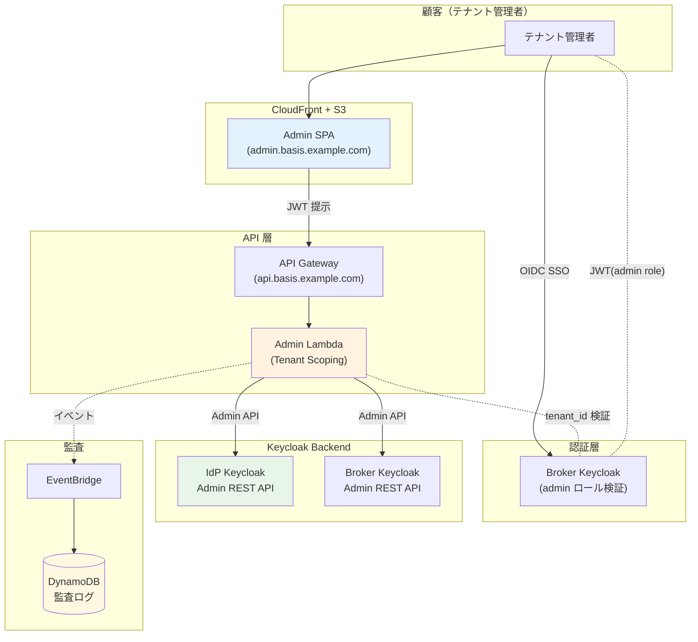
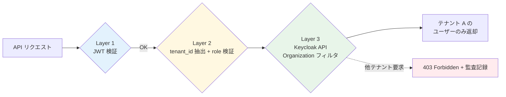

# ADR-038: ユーザ管理画面（顧客テナント管理者向け Admin UI）

- **ステータス**: Proposed（要件定義フェーズで Accepted に昇格予定）
- **日付**: 2026-06-18
- **関連**:
  - [ADR-037 Shared Responsibility Model + 軽量 IGA](037-shared-responsibility-and-lightweight-iga.md)
  - [ADR-033 Keycloak 2-tier アーキテクチャ](033-keycloak-2tier-broker-idp-architecture.md)
  - [ADR-021 Post-login Landing UX](021-post-login-landing-ux.md)
  - [§FR-8 管理](../requirements/proposal/fr/08-admin.md)
  - [§FR-1.2.0.B AWS アカウント境界による運用摩擦への対応](../requirements/proposal/fr/01-auth.md)（Layer 3 委譲管理者）

---

## Context

[ADR-037](037-shared-responsibility-and-lightweight-iga.md) で「**顧客所有・弊社ホスト**」の Shared Responsibility Model を確定したが、顧客（テナント管理者）が実際に**ユーザーマスタの CRUD・ロール付与・退職処理・アクセスレビュー**を行うための **UI** が未設計だった。

具体的な質問が打ち合わせで提起された:
> 「顧客が IdP-KC を操作することになるが、そのためのインターフェースとしての UI も提供する必要があるか。また、それはどこにどのように作るのが良さそうか」

これは [§FR-1.2.0.B Layer 1-4 運用モデル](../requirements/proposal/fr/01-auth.md) の **Layer 3 委譲管理者**が実際に使う UI の具体化であり、本 ADR で正式化する。

---

## Decision

### 採用方針

**カスタム Admin SPA を弊社が構築**し、`admin.basis.example.com` で全顧客に提供する。

| 項目 | 採用方針 |
|---|---|
| **必要性** | ✅ **必須**（Keycloak Admin Console を顧客に開放するのは業界実例なし、不可）|
| **構築方式** | **自作 SPA**（Auth0 / Okta / Microsoft Entra 全社採用パターン）|
| **配置 URL** | **`admin.basis.example.com`**（独立サブドメイン、CloudFront + S3 配信）|
| **テナント識別** | JWT `tenant_id` クレーム（URL パスでなく）|
| **テナントスコープ** | 3 層検証（API GW + Lambda + Keycloak Organizations）|
| **アクセス導線** | [サービス選択画面（ADR-021）](021-post-login-landing-ux.md) に「管理画面」タイルを配置、admin ロール保有時のみ表示 |

---

## A. なぜ Keycloak Admin Console を顧客に開放できないか（6 理由）

| 理由 | 詳細 |
|---|---|
| **マルチテナント未対応** | Keycloak Admin Console は **Realm 全体管理者向け**設計。同一 Realm 内の Organization 単位スコープ UI は v26+ でも未成熟。顧客 A が顧客 B のユーザーを誤って見るリスク |
| **UI 複雑度** | Realm / Client / Protocol Mapper / Flow / SPI 等の内部概念が露出。**顧客の業務担当者が扱える UI ではない** |
| **ブランディング不可** | 弊社の Keycloak UI が顧客に見える → 「自社のサービス」感が出ない |
| **セキュリティリスク** | Realm 管理者ロールを誤って付与すると影響甚大（IdP 設定変更等で全テナント影響）|
| **アクセスフロー設計困難** | Admin Console は独自セッション、Broker SSO 連携が不自然 |
| **業界実例なし** | Auth0 / Okta / Microsoft Entra / WorkOS / Frontegg、**主要 IdP どれも Keycloak Admin Console 同等を顧客に開放していない** |

---

## B. 業界標準（5 サービス比較）

| サービス | 顧客向け Admin UI | 配置 |
|---|---|---|
| **Auth0** | **Auth0 Dashboard**（SPA）| `manage.auth0.com` 共通 + Tenant 切替 |
| **Okta** | **Okta Admin Console**（カスタム SPA）| `{tenant}-admin.okta.com` テナント別サブドメイン |
| **Microsoft Entra External ID** | **Entra Admin Center**（Azure Portal 内）| `entra.microsoft.com` |
| **WorkOS** | **WorkOS Admin Portal** | Tenant 別 iframe embed or full SPA |
| **Frontegg** | **Frontegg Admin Portal** | 同上 |
| **AWS Cognito** | ❌ **なし**（AWS Console は弊社運用者向け、顧客向けは自前構築前提）| Cognito の弱点 |

→ **AWS Cognito 以外、全主要 IdP が「カスタム Admin SPA」を提供**。本基盤も同パターン。

---

## C. 機能セット（3 階層）

### Phase 1 必須機能（MVP）

| カテゴリ | 機能 | 説明 |
|---|---|---|
| **ユーザー管理** | CRUD（作成 / 検索 / 編集 / 削除）| `sys_user` 相当の基本操作 |
| | 招待リンク発行 | 新規ユーザーをセルフサインアップへ |
| | パスワードリセット（強制発行）| 管理者主導の PW リセット |
| | アカウントロック / アンロック | 不正アクセス時の即時対応 |
| | MFA 設定の確認 / リセット | ユーザー紛失時の MFA 解除 |
| | enabled/disabled トグル | 退職時の即時無効化 |
| **基本ロール管理** | ロール一覧 / 割当 / 解除 | RBAC 基本操作 |
| **監査ログ** | ユーザー別アクティビティ | ログイン履歴 / 失敗回数 / 異常検知 |
| | 管理操作ログ | 「誰が」「何を」「いつ」変更したか |

### Phase 2 推奨機能（軽量 IGA、[ADR-037](037-shared-responsibility-and-lightweight-iga.md)）

| カテゴリ | 機能 |
|---|---|
| **Bulk Import** | CSV インポート（大量ユーザー処理）|
| **グループ管理** | 部署 / 部門単位の権限管理 |
| **Access Certification UI** | 定期レビュー（年次 / 半年次）|
| **Access Request Workflow** | 申請 → 承認 → 自動付与 |
| **SoD ルール定義** | 「同一ユーザーが持てないロール組合せ」設定 |
| **権限分布レポート** | ロール別ユーザー数 / 非アクティブ検出 |

### Phase 3+ オプション機能

| カテゴリ | 機能 |
|---|---|
| **IdP 接続管理**（フェデ顧客向け）| SAML/OIDC IdP の登録・編集 |
| **ブランディング設定** | テナント別ロゴ・配色のセルフサービス |
| **MFA ポリシー設定** | テナント単位の MFA 強制レベル |
| **PW ポリシー設定** | テナント単位の PW 複雑性要件 |
| **API キー管理** | アプリ統合用 API トークン発行 |
| **Webhook 設定** | 顧客側システムへのイベント通知 |
| **使用状況メトリクス** | MAU / DAU / アクティブユーザー数 |

---

## D. 推奨アーキテクチャ



### 構成要素

| コンポーネント | 役割 | 実装 |
|---|---|---|
| **Admin SPA** | テナント管理者向け UI | React / Vue / Svelte、CloudFront + S3 |
| **Broker Keycloak** | 認証（admin ロール検証）| 既存（ADR-033 Tier 1）|
| **API Gateway** | Admin API エンドポイント | AWS API Gateway |
| **Admin Lambda** | テナントスコープ検証 + KC API ラッパー | Node.js / Python |
| **IdP-KC Admin REST API** | 実際のユーザー操作 | Keycloak 標準 |
| **EventBridge + DynamoDB** | 監査ログ | 全管理操作を記録 |

---

## E. テナントスコープ実装（重要、3 層検証）

「テナント管理者が他テナントのユーザーを見ない」ことを 3 層で保証:



| Layer | 内容 |
|---|---|
| **L1 JWT 検証** | API Gateway で OIDC JWT 検証（署名・有効期限）|
| **L2 tenant_id 抽出 + role 検証** | Lambda で JWT `tenant_id` クレーム取得 + `tenant-admin` ロール検証 |
| **L3 Keycloak API スコープ** | Admin API 呼出時に **tenant_id を Organization フィルタとして付与**（Keycloak v26 Organizations 機能活用）|

### 実装パターン例

```javascript
async function listUsers(event) {
  const jwt = decodeJWT(event.headers.authorization);
  const tenantId = jwt.tenant_id;
  const roles = jwt.realm_access.roles;

  // L1+L2: admin ロール検証
  if (!roles.includes('tenant-admin')) {
    return { statusCode: 403, body: 'No admin role' };
  }

  // L3: テナントスコープで Keycloak API
  const users = await keycloakAdminAPI.getUsers({
    realm: 'main',
    organization: tenantId,  // ← Organizations で自動フィルタ
  });

  // 監査ログ
  await eventBridge.putEvent({
    eventType: 'admin.users.list',
    tenantId,
    actor: jwt.sub,
    timestamp: new Date(),
  });

  return { statusCode: 200, body: JSON.stringify(users) };
}
```

---

## F. Build vs Buy 比較

| # | 選択肢 | 工数 | カスタマイズ性 | 10M MAU コスト |
|---|---|---|---|---|
| **A** | **完全自作 SPA**（**推奨**）| 3-6 ヶ月（初版）| ◎ 完全自由 | $0（人件費のみ）|
| B | Phase Two Console（OSS）| 1-2 ヶ月（カスタマイズ）| ○ Keycloak 特化 | $0 |
| C | WorkOS Admin Portal（商用）| 2-4 週間 | △ ベンダー仕様 | **$$$ MAU 課金で 10M で破綻** |
| D | Frontegg Admin Portal（商用）| 同上 | △ | 同上 |
| E | Backstage / Retool 等 流用 | 2-3 ヶ月 | ○ | $（中規模ライセンス）|

### A 自作を推奨する理由（10M MAU 規模）

- **コスト**: 商用は MAU 課金、10M MAU で年額数 M USD → 自作年額 $150-300K（人件費）が圧倒的有利
- **カスタマイズ性**: Shared Responsibility Model / 軽量 IGA / IdP-KC 統合 / サービス選択画面 統合 等の独自要件が多い
- **ベンダーロックイン回避**: 認証基盤の核心 UI を商用に依存しない
- **業界主流**: Auth0 / Okta / Microsoft 全社自作（買収/取得で得たケースも、結果的に自社管理）

---

## G. 配置 URL 戦略

| 項目 | 推奨 | 理由 |
|---|---|---|
| **SPA URL** | **`admin.basis.example.com`** | 独立サブドメイン、CloudFront + S3 配信 |
| **API URL** | **`api.basis.example.com/admin/*`** | API Gateway 配下 |
| **テナント識別** | **JWT `tenant_id` クレームから取得**（URL パスではなく）| シンプル、Keycloak Organizations と整合 |
| **アクセス導線** | [サービス選択画面](021-post-login-landing-ux.md) に「管理画面」タイル配置、admin ロール保有時のみ表示 | UX 一貫性 |

### テナント別サブドメイン（`acme-admin.basis.example.com`）の代替案

| 観点 | 単一サブドメイン | テナント別サブドメイン |
|---|---|---|
| SPA 配信 | 1 つ | 1 つ（マルチテナント対応 SPA）or テナント別 |
| Cookie 管理 | シンプル | テナント別 cookie 分離可能 |
| DNS 設定 | 1 レコード | テナント別 ACM 証明書 + DNS |
| ブランディング | テナント別 theme 切替（SPA 内）| サブドメインで切替容易 |
| 推奨 | **★（業界標準）** | 大口顧客の専用感要求時のみ |

→ **デフォルトは単一サブドメイン + JWT スコープ**、大口は[組織固有 URL（§FR-2.3.3.C）](../requirements/proposal/fr/02-federation.md)と整合させてテナント別サブドメインを併用可。

---

## H. 段階的構築パス

| Phase | 機能セット | 工数目安 | タイミング |
|---|---|---|---|
| **Phase 1**（MVP）| ユーザー CRUD + 検索 + 招待リンク + アクティビティログ | 3 ヶ月 | MVP リリース |
| **Phase 2** | ロール/グループ管理 + Bulk Import + MFA リセット + 監査ログ UI | 2 ヶ月 | MVP 3 ヶ月後 |
| **Phase 3**（[ADR-037](037-shared-responsibility-and-lightweight-iga.md) 軽量 IGA）| Access Certification + Access Request Workflow | 2 ヶ月 | MVP 6 ヶ月後 |
| **Phase 4** | IdP 接続管理 + ブランディング設定 + MFA/PW ポリシー設定 | 2 ヶ月 | MVP 1 年後 |
| **Phase 5** | API キー管理 + Webhook 設定 + 詳細メトリクス | 必要時 | 顧客需要次第 |

→ **MVP 3 ヶ月、Phase 1-3 で 7 ヶ月**で B2B 標準機能セット完成。

---

## I. 我々のスタンス

| 基本方針の柱 | ユーザ管理画面 での実現 |
|---|---|
| **絶対安全** | 3 層テナントスコープ検証 + 全管理操作の監査ログ |
| **どんなアプリでも** | テナント別ブランディング / マルチテナント対応 |
| **効率よく認証** | テナント管理者のセルフサービスで顧客からの問合せ削減 |
| **運用負荷・コスト最小** | 自作で MAU 課金回避、10M MAU で年額 $150-300K（商用比 100 倍削減）|

---

## J. ADR-033 / ADR-037 / ADR-021 との関係

| ADR | 関係 |
|---|---|
| **ADR-033 2-tier**| Admin SPA は **IdP-KC + Broker KC 両方の Admin API** を叩く |
| **ADR-037 Shared Responsibility + 軽量 IGA**| **本 SPA が軽量 IGA 機能の UI 実装場所**（Access Certification / Access Request UI 等）|
| **ADR-021 Post-login Landing UX**| サービス選択画面 に「管理画面」タイル配置、UX 一貫性 |
| **§FR-1.2.0.B Layer 1-4**| **Layer 3 委譲管理者**が本 SPA を実際に使う |
| **§FR-8 管理**| §FR-8.3 権限委譲の UI 実装、本 ADR で §FR-8.5 として新規追加 |

---

## Consequences

### Positive

- **業界標準（Auth0 / Okta / Microsoft）パターン**で顧客に違和感なし
- 10M MAU 規模でも商用 SaaS 比 100 倍コスト削減
- カスタマイズ性で軽量 IGA / Shared Responsibility / サービス選択画面 統合等の独自要件に対応
- Phase 1-5 段階的構築で初期投資抑制

### Negative

- 初期構築 3 ヶ月（MVP）、Phase 1-3 で 7 ヶ月の開発投資
- SPA メンテナンス（フロントエンド技術の追随、年間数百時間）
- セキュリティ脆弱性対応（フロントエンドライブラリ更新等）
- テナント管理者の UI トレーニング / ドキュメント作成

### Constraints

- 初期 Phase は Phase 1 機能のみ、Phase 2+ は段階導入
- Keycloak Organizations 機能（v26+）が前提
- Realm Admin ロールの誤付与防止運用（弊社運用者のミス防止）

### コスト試算（10M MAU、年額）

| 項目 | 自作 SPA | 商用（WorkOS / Frontegg 等）|
|---|---|---|
| 初期開発（人件費）| 〜$200K（Phase 1-3 で 7 ヶ月）| $50K（実装サポート）|
| 年次運用 | 〜$100K（メンテナンス）| **$2M-5M（MAU 課金）**|
| **5 年累計** | **〜$700K** | **〜$10M+** |

→ **5 年累計で 14 倍以上のコスト削減**。

---

## K. TBD / 要確認

| 確認項目 | ヒアリング ID | 回答例 |
|---|---|---|
| ユーザ管理画面 の必要性 | **B-TAP-1** | 必須 / 不要（弊社運用代行）|
| Build vs Buy | **B-TAP-2** | **自作（推奨）** / Phase Two OSS / WorkOS / Frontegg / Retool |
| MVP 機能セットの範囲 | **B-TAP-3** | Phase 1 のみ / Phase 1-2 / Phase 1-3 / Phase 1-5 全部 |
| 配置 URL | **B-TAP-4** | **単一サブドメイン（推奨）** / テナント別サブドメイン |
| サービス選択画面 統合 | **B-TAP-5** | 統合（タイル配置）/ 独立 URL のみ |
| テナント管理者数（顧客あたり）| **B-TAP-6** | 1 名 / 2-3 名 / 大規模 5+ 名 |
| Bulk Import の必要性 | **B-TAP-7** | 初期移行で必須 / 不要 |
| API キー / Webhook 管理 UI | **B-TAP-8** | Phase 1 から必要 / Phase 4+ / 不要 |
| ブランディング設定セルフサービス | **B-TAP-9** | 顧客が自分で設定 / 弊社運用が設定 / 不要 |
| 監査ログ保持期間 | **B-TAP-10** | 1 年 / 3 年 / 7 年（規制業種）|

---

## 参考資料

- [Auth0 Dashboard](https://auth0.com/docs/get-started/dashboard) — Auth0 の Tenant Admin UI
- [Okta Admin Console](https://help.okta.com/en-us/Content/Topics/Settings/console-overview.htm)
- [Microsoft Entra Admin Center](https://learn.microsoft.com/en-us/entra/fundamentals/entra-admin-center)
- [WorkOS Admin Portal](https://workos.com/docs/admin-portal)
- [Frontegg Admin Portal](https://docs.frontegg.com/docs/admin-portal-overview)
- [Phase Two Keycloak Console](https://phasetwo.io/product/)
- [Keycloak Admin REST API](https://www.keycloak.org/docs-api/latest/rest-api/index.html)
- [Keycloak Organizations API](https://www.keycloak.org/docs/latest/server_admin/#_managing_organizations)
- 関連 Claude 内部メモリ: `project_tenant_admin_portal_2026-06-18.md`
