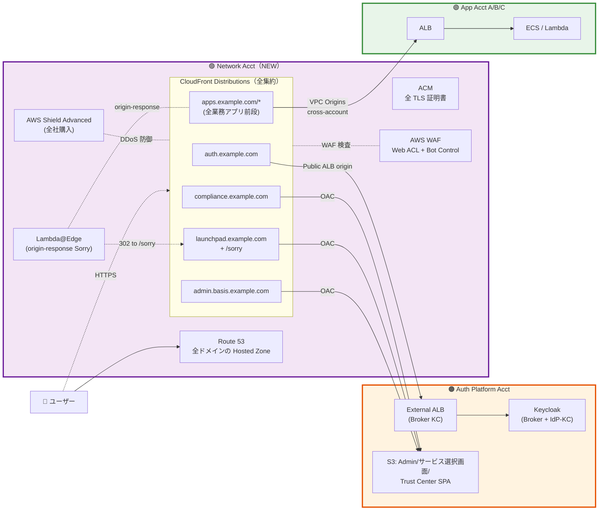
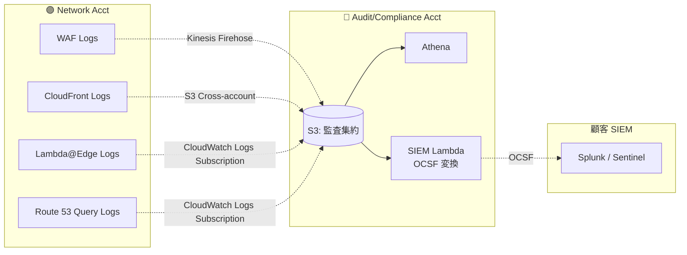
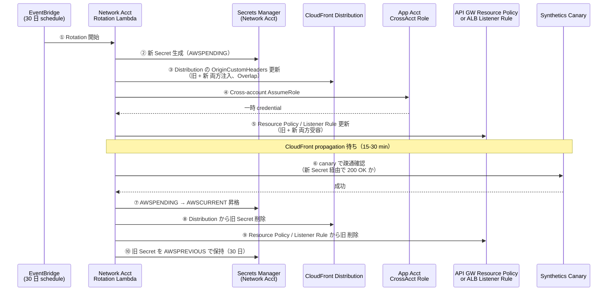
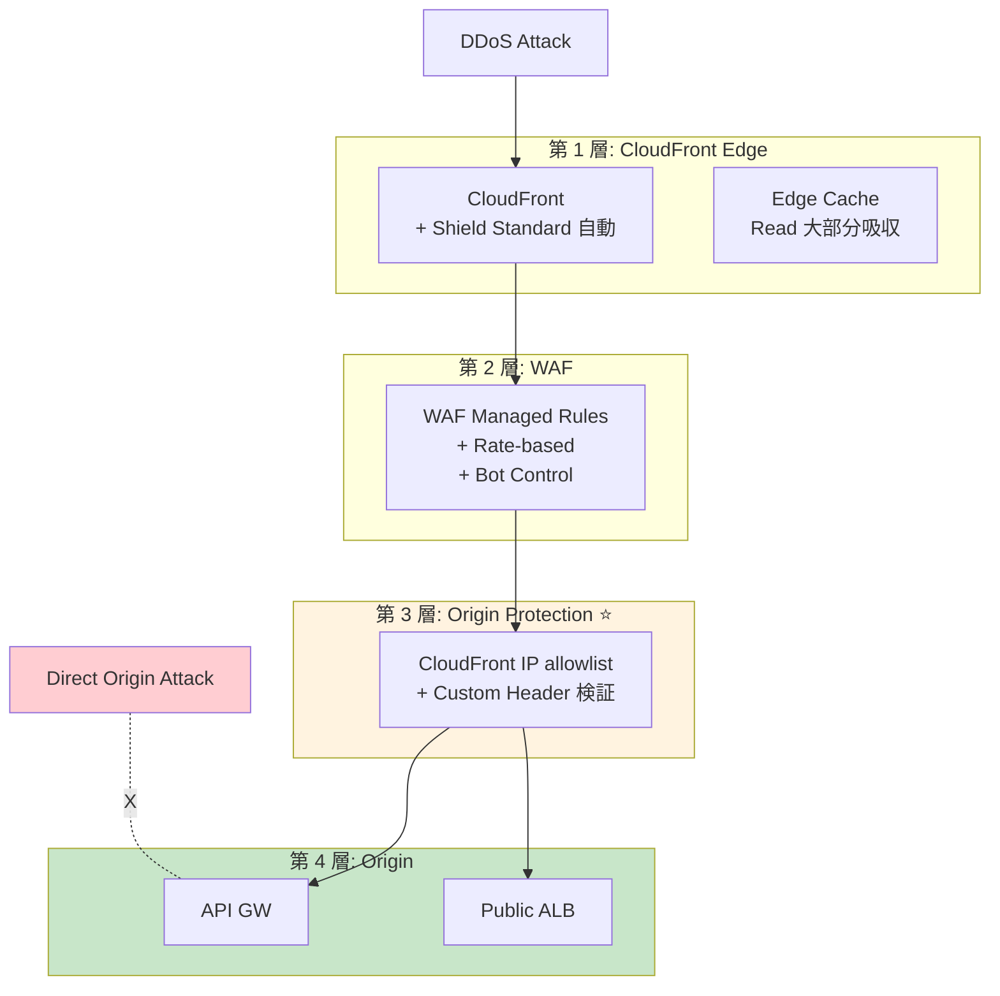

# ADR-039: 中央集約 Network 専用アカウント設計（CloudFront + WAF + Lambda@Edge）

- **ステータス**: Proposed（要件定義フェーズで Accepted に昇格予定）
- **日付**: 2026-06-23
- **関連**:
  - [ADR-011 認証基盤前段ネットワーク設計](011-auth-frontend-network-design.md)（更新あり）
  - [ADR-013 CloudFront + WAF による IP 制限の置き換え戦略](013-cloudfront-waf-ip-restriction.md)（更新あり）
  - [ADR-022 AWS edge での Sorry 制御パターン](022-aws-edge-sorry-control.md)（更新あり）
  - [ADR-036 Customer Audit Support](036-customer-audit-support.md)（Audit Account との関係）
  - [§C-7 実装アーキテクチャ](../requirements/proposal/common/07-implementation-architecture.md)（§C-7.2.2 全体図 / §C-7.2.3 アカウント境界 / §C-7.3.3 Network 層 / §C-7.3.11 Sorry 制御）

---

## Context

弊社内の組織方針として、**Network 層（CloudFront + WAF + Edge Function）を中央集約した専用アカウント**で運用する体制が確定した。これは AWS Well-Architected Framework / AWS Multi-account strategy で推奨される「**Centralized Egress / Centralized Ingress**」パターンに準拠する。

### Before（ADR-011/013/022 当時の前提）

各アカウントが個別に CloudFront + WAF を保有する構成:

```
ユーザー → CloudFront (Auth Platform Acct) → ALB (Auth Platform Acct) → Keycloak
ユーザー → CloudFront (App Acct A)         → ALB (App Acct A)         → App A
ユーザー → CloudFront (App Acct B)         → ALB (App Acct B)         → App B
```

### After（本 ADR 確定後）

**Network 専用アカウント**に CloudFront + WAF + Lambda@Edge を集約、Cross-account origin で各アカウントの ALB に接続:

```
ユーザー → CloudFront + WAF (Network Acct) → ALB (Auth Platform Acct) → Keycloak
ユーザー → CloudFront + WAF (Network Acct) → ALB (App Acct A)         → App A
ユーザー → CloudFront + WAF (Network Acct) → ALB (App Acct B)         → App B
```

### なぜ Network 集約か（業界根拠）

| 観点 | 集約による効果 |
|---|---|
| **セキュリティ統制** | WAF ルールを **Network チームが一元管理**、各アプリチームの実装ばらつきを排除 |
| **コスト最適化** | CloudFront / WAF を**全社で 1 つの料金プラン**に統合（Distribution 単位の固定費削減）|
| **監査容易性** | エッジトラフィックを **1 アカウントで完全把握**、SOC 2 / ISO 27001 監査時に有利 |
| **DDoS 対策** | AWS Shield Advanced を **1 アカウントで集中購入・適用**（$3,000/月 × 1 で全社カバー）|
| **DNS 一元管理** | Route 53 Hosted Zone を Network Acct に配置、ドメイン管理を一元化 |
| **業界ベストプラクティス** | AWS [Centralized Ingress with AWS Global Accelerator / CloudFront](https://aws.amazon.com/blogs/networking-and-content-delivery/centralized-ingress-with-aws-global-accelerator-and-aws-network-firewall/)、[Organizing AWS environment using multiple accounts](https://docs.aws.amazon.com/whitepapers/latest/organizing-your-aws-environment/centralizing-network-services.html) で推奨 |

---

## Decision

### アカウント分離方針

**Network 専用 Acct と Audit/Compliance 専用 Acct を分離**:

| アカウント | 役割 | 主要リソース | 責任チーム |
|---|---|---|---|
| 🟣 **Network Acct**（NEW）| **エッジ層集約**（CloudFront / WAF / Lambda@Edge / Route 53 / ACM）| 全 CloudFront Distribution + WAF + 全 ACM 証明書 + Route 53 Hosted Zone | Network / Security チーム |
| 🔵 **Audit/Compliance Acct** | **監査ログ集約**（CloudTrail Org Trail / S3 集約 / SIEM 連携）| CloudTrail Aggregation + 監査 S3 + SIEM Lambda | Compliance チーム |

→ 両者は責任分担とライフサイクルが異なるため**別アカウント**。

### 適用範囲

**全 inbound CloudFront/WAF を Network Acct に集約**:

| CloudFront 用途 | 集約前 | 集約後 |
|---|---|---|
| Broker Keycloak 前段 | Auth Acct | **Network Acct** |
| Admin SPA (`admin.basis.example.com`) | Auth Acct | **Network Acct** |
| サービス選択画面 SPA (`launchpad.example.com`) | Auth Acct | **Network Acct** |
| Trust Center (`compliance.example.com`) | Auth Acct | **Network Acct** |
| App A/B/C 前段（業務アプリ）| App Acct A/B/C | **Network Acct** |
| エラー / 案内画面 SPA | Auth Acct | **Network Acct**（サービス選択画面 と同一 distribution）|
| **Lambda@Edge**（origin-response Sorry 制御）| Auth Acct | **Network Acct**（CloudFront に紐付くため）|

### Cross-account 接続パターン

| Origin タイプ | 接続方式 |
|---|---|
| ALB（公開 ALB）| **CloudFront → Public ALB**（HTTPS、Host header 検証）|
| ALB（内部 ALB）| **CloudFront VPC Origins**（2024-12 GA）で **Cross-account 内部 ALB へ直接接続** |
| S3（SPA 配信）| **OAC（Origin Access Control）**で Cross-account S3 を保護（バケットポリシー側で許可）|

---

## A. アーキテクチャ詳細

### A-1. 全体構成



### A-2. Cross-account 接続の 3 パターン

| パターン | 用途 | 実装 |
|---|---|---|
| **公開 ALB Origin** | Broker KC（HTTPS 経由）| ALB に Public IP、CloudFront → ALB は HTTPS、ALB 側で `X-Forwarded-Host` + secret header 検証 |
| **VPC Origins**（推奨）| App 内部 ALB（Cross-account）| CloudFront から **内部 ALB に直接 PrivateLink 経由で接続**（2024-12 GA）、ALB を公開不要 |
| **OAC（S3）** | SPA 配信 | CloudFront から S3 への **OAC 経由アクセス**、S3 バケットポリシーで `aws:SourceArn` を CloudFront ARN に制限 |

### A-3. ドメイン / ACM 集約

| 項目 | 配置 | 備考 |
|---|---|---|
| Route 53 Hosted Zone | **Network Acct** | 全 SLD（`example.com` / `basis.example.com`）|
| ACM 証明書 | **Network Acct**（us-east-1）| CloudFront は us-east-1 の証明書のみ受付 |
| Internal ALB の ACM | 各アカウント | ALB は regional 証明書、各アカウントで管理 |
| Sub-domain 委譲 | 任意 | 子サブドメインは委譲可能（`internal.acme.basis.example.com` 等）|

### A-4. WAF 集約ルール

| ルールカテゴリ | 内容 | 適用範囲 |
|---|---|---|
| AWS Managed Rules - Core Rule Set | OWASP Top 10 | 全 Distribution |
| AWS Managed Rules - Known Bad Inputs | 既知脅威 | 全 Distribution |
| AWS Managed Rules - Bot Control | Bot 検知 | 全 Distribution |
| Custom: Rate Limiting | IP 毎 1000 req/5min | 全 Distribution |
| Custom: Geo Restriction | 国別アクセス制御 | 顧客テナント別 |
| Custom: IP Allowlist | 管理画面用 | Admin SPA のみ |

→ **Network チームが一元管理、変更は Terraform PR 経由**。

### A-5. Lambda@Edge（Sorry 制御）の所有

| 観点 | 配置 |
|---|---|
| Lambda 関数本体 | **Network Acct**（us-east-1）|
| CloudFront との紐付け | 同一アカウント内 |
| 実行ログ | **CloudWatch Logs（Network Acct）**、各エッジリージョンに自動分散 |
| デプロイ | Network チームの Terraform / CI/CD |
| エラー / 案内画面 SPA への redirect | `https://launchpad.example.com/sorry?app=...` （Network Acct 内 CloudFront）|

→ Lambda@Edge は CloudFront と**同一アカウントに配置必須**（AWS 仕様）、Network Acct に集約。

---

## B. 各アカウントの責務分担（更新版）

| アカウント | 主要責務 | 主要リソース | 主要 ADR |
|---|---|---|---|
| 🟣 **Network Acct**（NEW、本 ADR）| エッジ層 + DNS + 証明書 | CloudFront / WAF / Lambda@Edge / Route 53 / ACM / Shield Advanced | ADR-039 |
| 🟠 **Auth Platform Acct** | 認証コア | EKS（Broker KC / IdP KC）/ Aurora × 2 / KMS × 2 / SPA S3 / ITDR Lambda / Admin Lambda / Trust Center 内部 | ADR-033, 035, 036, 038 |
| 🟢 **App Acct A/B/C** | 業務アプリ | ALB（**内部**、VPC Origins 経由）/ ECS / Lambda / App DB | ADR-014 |
| 🔵 **Audit/Compliance Acct** | 監査ログ集約 | CloudTrail Org Trail / S3 集約 / Athena / SIEM Lambda | ADR-036 |

→ **最小構成 = Network + Auth + App + Audit の 4 アカウント**（旧 3 アカウント案から 1 増）。

---

## C. Cross-account 設定詳細

### C-1. IAM Role（Cross-account）

| 用途 | Role 名 | 信頼関係 | 権限 |
|---|---|---|---|
| CloudFront → ALB ヘルスチェック | `NetworkToAuthAlbHealth` | Network Acct CF → Auth Acct ALB | ALB describe |
| Lambda@Edge → CloudWatch Logs | `LambdaEdgeLogsRole` | Network Acct Lambda | Logs PutEvents |
| OAC → S3 Cross-account | （SP に書く）| CloudFront Service Principal | S3 GetObject |
| WAF Log → Audit Acct | `WAFLogsToAuditRole` | Network Acct WAF → Audit S3 | S3 PutObject |
| Terraform | `NetworkTerraformRole` | Network チーム IAM Identity Center | Full Network Acct |

### C-2. ログ集約フロー



### C-3. VPC Origins 設定（App 内部 ALB 接続）

VPC Origins（2024-12 GA）により、**Cross-account 内部 ALB に CloudFront から直接 PrivateLink 経由で接続**可能:

| 設定項目 | 値 |
|---|---|
| Origin タイプ | VPC Origin |
| Origin VPC | App Acct の VPC |
| Origin Target | App Acct の Internal ALB（VPC 内）|
| 共有方式 | AWS RAM で VPC Origin を Network Acct と共有 |
| TLS | Internal ALB の ACM 証明書（regional）|
| メリット | App ALB を **公開不要**、セキュリティ向上 |

### C-4. Origin Protection（Public API GW / Public ALB の直接アクセス防御）

VPC Origins（Pattern B）が採れない場合（**Public API GW** や **既存 Public ALB**）の Origin 保護パターン。**Custom Header + CloudFront IP Allowlist** の 2 層検証で「DNS は public、実質的に CloudFront 経由のみ受容」を実現。

#### C-4.1 設計原則

- **Pattern A: Custom Header + IP Allowlist**（CloudFront 公式パターン）を標準採用
- IP Allowlist 単独は不可（CloudFront を持つ他組織からも IP 範囲が同じため）
- Custom Header 単独も不可（漏洩リスク）
- **2 層検証併用必須**

#### C-4.2 Public API GW Resource Policy テンプレ（App Acct 側）

```json
{
  "Version": "2012-10-17",
  "Statement": [
    {
      "Sid": "AllowOnlyFromCloudFrontWithSecret",
      "Effect": "Allow",
      "Principal": "*",
      "Action": "execute-api:Invoke",
      "Resource": "arn:aws:execute-api:ap-northeast-1:${APP_ACCT}:${API_ID}/*",
      "Condition": {
        "IpAddress": {
          "aws:SourceIp": [
            "AWS_PREFIX_LIST:com.amazonaws.global.cloudfront.origin-facing"
          ]
        },
        "StringEquals": {
          "aws:RequestHeader/X-Origin-Verify": "${SECRET_VALUE}"
        }
      }
    },
    {
      "Sid": "DenyAllOthers",
      "Effect": "Deny",
      "Principal": "*",
      "Action": "execute-api:Invoke",
      "Resource": "arn:aws:execute-api:ap-northeast-1:${APP_ACCT}:${API_ID}/*",
      "Condition": {
        "StringNotEquals": {
          "aws:RequestHeader/X-Origin-Verify": "${SECRET_VALUE}"
        }
      }
    }
  ]
}
```

#### C-4.3 Public ALB Security Group + Listener Rule（App Acct 側）

**Security Group**：
```hcl
resource "aws_security_group" "alb_origin_protection" {
  ingress {
    from_port       = 443
    to_port         = 443
    protocol        = "tcp"
    prefix_list_ids = ["pl-58a04531"]  # com.amazonaws.global.cloudfront.origin-facing (ap-northeast-1)
  }
}
```

**ALB Listener Rule**：
```yaml
Listener Rules:
  - Priority: 1
    Conditions:
      - Field: http-header
        HttpHeaderConfig:
          HttpHeaderName: X-Origin-Verify
          Values: ["${SECRET_VALUE}"]
    Actions:
      - Type: forward
        TargetGroupArn: ${TARGET_GROUP_ARN}
  - Priority: 999
    Conditions: []
    Actions:
      - Type: fixed-response
        FixedResponseConfig:
          StatusCode: 403
          ContentType: "text/plain"
          MessageBody: "Forbidden"
```

#### C-4.4 Secret Rotation Cross-account 運用 SOP

最大の運用課題は **Network Acct と App Acct の Secret 値同期更新**。AWS 公式ソリューション [How to enhance Amazon CloudFront origin security with AWS WAF and AWS Secrets Manager](https://aws.amazon.com/blogs/security/how-to-enhance-amazon-cloudfront-origin-security-with-aws-waf-and-aws-secrets-manager/) ベースで実装。

##### C-4.4.1 Rotation シーケンス（30 日周期）



##### C-4.4.2 Cross-account IAM Role 設計

| Role 名 | 信頼関係 | 権限 |
|---|---|---|
| `OriginSecretRotationRole`（App Acct 側） | Network Acct Rotation Lambda | API GW UpdateRestApiPolicy / ELB ModifyRule / Secrets Manager Put |
| `SecretsRotatorRole`（Network Acct 側） | Lambda Execution | sts:AssumeRole（App Acct）+ CloudFront UpdateDistribution + Secrets Manager 全操作 |

##### C-4.4.3 Rollback 機構

| 失敗シナリオ | 復旧手順 |
|---|---|
| CloudFront 更新失敗 | AWSCURRENT 維持、AWSPENDING 削除 |
| Resource Policy 更新失敗 | CloudFront に旧 Secret 再追加 → Resource Policy ロールバック |
| Synthetics 疎通失敗 | 旧 Secret を CloudFront / Resource Policy 両方に強制復元、Slack/PagerDuty 通知 |
| Lambda タイムアウト | EventBridge 再実行 + 部分実行検知ロジック（Step Functions 推奨）|

##### C-4.4.4 Overlap Period 設計

| Phase | 期間 | CloudFront 側 | Origin 側 |
|---|---|---|---|
| Pre-rotation | – | 旧 Secret のみ | 旧 Secret のみ |
| **Overlap（旧 + 新 両方）** | **24-72h**（CloudFront propagation 余裕含む）| 旧 + 新 両方注入 | 旧 + 新 両方受容 |
| Post-rotation | – | 新 Secret のみ | 新 Secret のみ |

#### C-4.5 DDoS 対策の多層構造



| 層 | 効果 |
|---|---|
| L1 CloudFront + Shield | 99%+ の L3/L4 攻撃を Edge で吸収 |
| L2 WAF | L7 攻撃、SQLi/XSS、量的攻撃遮断 |
| **L3 Origin Protection** | **CloudFront 経由しない直接攻撃を完全遮断** |
| L4 Origin | API GW Throttling + Backend Auto Scaling |

#### C-4.6 Pattern A / B / C 採用判断

| 観点 | Pattern A: Custom Header | Pattern B: VPC Origins | Pattern C: OAC |
|---|:---:|:---:|:---:|
| API GW REST REGIONAL | ✅ 推奨 | ⚠ Private API GW のみ | ❌ 非対応 |
| API GW HTTP | ✅ | ⚠ Private のみ | ❌ |
| Public ALB | ✅ 推奨 | – | ❌ |
| Internal ALB | – | ✅ 推奨（C-3）| ❌ |
| S3 Origin | – | – | ✅ 推奨 |
| Lambda Function URL | ⚠ | – | ✅ 推奨 |

→ **API GW + Public ALB なら Pattern A 確定**、Internal ALB なら Pattern B、S3/Lambda URL なら Pattern C の使い分け。

#### C-4.7 残るリスクと対策

| リスク | 対策 |
|---|---|
| Secret 漏洩 | 30 日ローテ + Overlap + 漏洩検知（[L4 Athena cross-IP クエリ](../api-platform/proposal/common/06-external-api-auth-architecture.md)）|
| CloudFront 設定ミスで Distribution 廃止 → Origin が裸 | Resource Policy で **明示的 Deny**（CloudFront 経由以外）|
| Rotation 中の障害 | Overlap 確保 + Step Functions ベースのロールバック + Synthetics 監視 |
| Shield Advanced の必要性 | 通常 Shield Standard で十分、Tier 1 アプリのみ Shield Advanced（$3K/月）検討 |
| AWS IP Prefix 更新による瞬断 | Managed Prefix List 利用なら自動追従 |
| App 側で Resource Policy 手動変更による穴 | Config Rule `api-gw-resource-policy-cloudfront-only` で検知 |

---

## D. 移行計画（既存からの段階移行）

| Phase | 内容 | リスク |
|---|---|---|
| Phase 1 | Network Acct を新規作成、Route 53 / ACM を移管準備 | DNS 切替リスク（事前検証）|
| Phase 2 | Network Acct に CloudFront/WAF を新設、テスト用ドメインで疎通検証 | 低 |
| Phase 3 | 1 アプリ単位で DNS 切替（Network Acct CloudFront へ）| アプリ単位ロールバック可能 |
| Phase 4 | 全アプリ切替完了 → 旧 CloudFront 削除 | — |
| Phase 5 | Lambda@Edge 移管（Auth Acct → Network Acct）| 短時間メンテ窓 |

---

## E. 我々のスタンス

| 基本方針の柱 | 実現方法 |
|---|---|
| **絶対安全** | WAF 一元管理、Shield Advanced 全社、DDoS 防御強化 |
| **どんなアプリでも** | 全アプリが Network Acct CloudFront を経由 |
| **効率よく** | 各アプリチームは Edge 層を意識不要、Network チームに委任 |
| **運用負荷・コスト最小** | Distribution / WAF / Shield を 1 アカウントに集約、固定費削減 |

---

## Consequences

### Positive

- **WAF ルール一元管理**：Network チームが全社統一ルール適用、実装ばらつき排除
- **Shield Advanced 集中購入**：$3,000/月 × 1 で全社 DDoS 対策（複数アカウント分散時よりコスト効率良）
- **監査容易性**：エッジトラフィックが 1 アカウントで完全把握、SOC 2 監査で有利
- **DNS 一元化**：Route 53 を Network Acct に集約、ドメイン管理ガバナンス向上
- **App ALB 非公開化**：VPC Origins で内部 ALB のまま CloudFront 接続可能（セキュリティ向上）
- **AWS Well-Architected 準拠**：Centralized Ingress パターンの推奨に整合

### Negative

- **Cross-account 複雑性**：IAM Role 設計 / VPC Origins 設定 / OAC 設定が必要
- **Network チームへの依存**：CloudFront 設定変更がチーム間調整となる（PR レビュー必須）
- **ロールバック制約**：CloudFront 設定変更は伝播 5-15 分、緊急時のロールバック遅延
- **DNS 切替リスク**：移行 Phase 3 で各アプリの DNS 切替が必要（事前検証必須）
- **アカウント数増**：3 → 4 アカウントに増加

### Constraints

- VPC Origins（2024-12 GA）が前提。古いリージョンや AWS パートナーで未対応の可能性あり
- Lambda@Edge は CloudFront と同一アカウント必須（AWS 仕様）
- ACM 証明書は us-east-1 でなければ CloudFront で使えない
- AWS RAM でリソース共有設定が必要（VPC Origins / OAC）

---

## F. ADR-011/013/022 との関係（更新点）

| 元 ADR | 元の前提 | 本 ADR で更新 |
|---|---|---|
| [ADR-011](011-auth-frontend-network-design.md) | CloudFront を Auth Acct に配置 | **Network Acct に配置**（Cross-account origin で Auth Acct ALB に接続）|
| [ADR-013](013-cloudfront-waf-ip-restriction.md) | CloudFront + WAF を各アカウントで | **Network Acct に集約**、WAF ルールも一元 |
| [ADR-022](022-aws-edge-sorry-control.md) | Lambda@Edge を Auth Acct に配置 | **Network Acct に配置**（CloudFront と同一アカウント必須）|

→ 各 ADR には本 ADR への参照を追記済。

---

## 参考資料

- [AWS: Centralized Ingress with AWS Global Accelerator and AWS Network Firewall](https://aws.amazon.com/blogs/networking-and-content-delivery/centralized-ingress-with-aws-global-accelerator-and-aws-network-firewall/)
- [AWS: Organizing your AWS environment using multiple accounts - Centralizing Network Services](https://docs.aws.amazon.com/whitepapers/latest/organizing-your-aws-environment/centralizing-network-services.html)
- [AWS: VPC Origins for CloudFront (2024-12 GA)](https://aws.amazon.com/blogs/networking-and-content-delivery/introducing-vpc-origins-for-amazon-cloudfront/)
- [AWS: Cross-account access with CloudFront OAC](https://docs.aws.amazon.com/AmazonCloudFront/latest/DeveloperGuide/private-content-restricting-access-to-s3.html)
- [AWS Well-Architected Framework - Security Pillar](https://docs.aws.amazon.com/wellarchitected/latest/security-pillar/welcome.html)
- 関連 Claude 内部メモリ: `project_centralized_network_account_2026-06-23.md`
