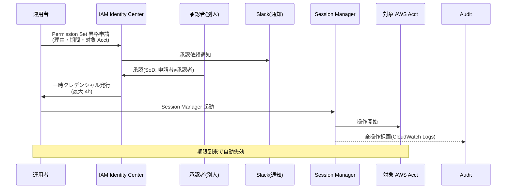
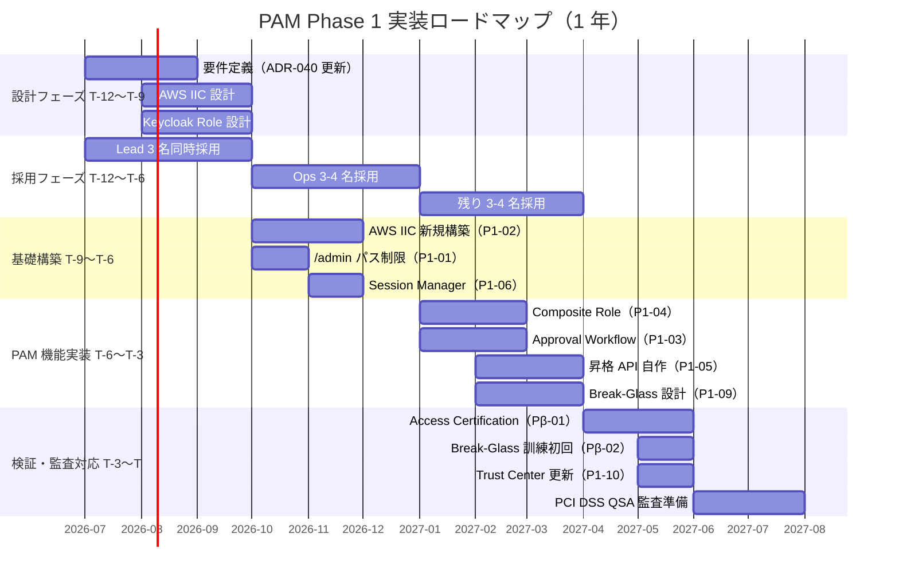
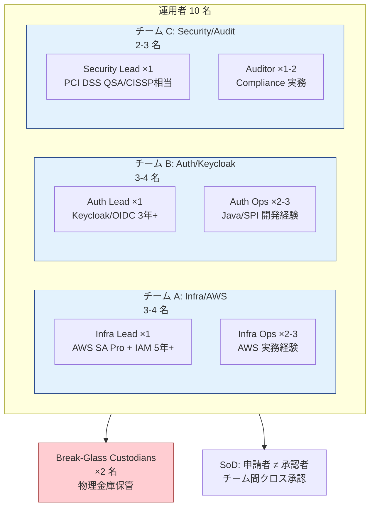
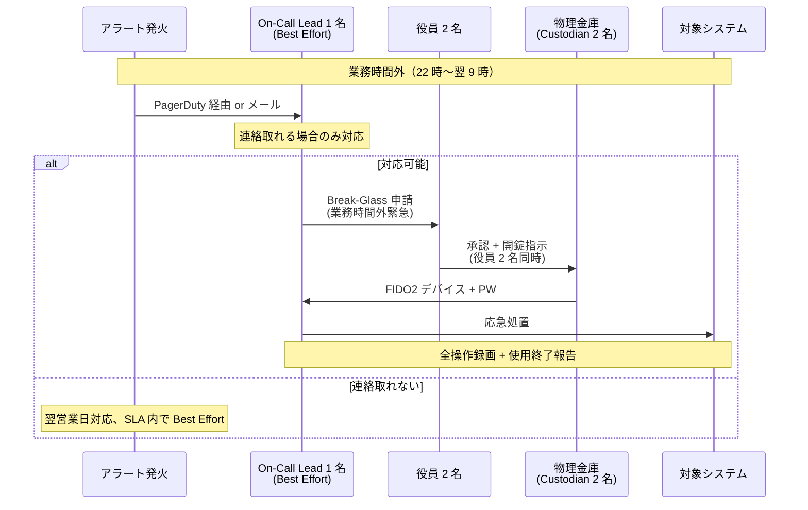

# ADR-040: PAM / JIT 管理者権限管理（APPI / PCI DSS 準拠）

- **ステータス**: **Accepted**（Phase 1 実装対象、2026-07-23 復活 — 運用要件定義に含めるユーザー要望による）
- **日付**: 2026-06-23 作成、2026-06-24 スコープアウト、**2026-07-23 スコープ再取込 + Phase 1 α/β 設計確定**

---

> **✅ 2026-07-23 スコープ再取込 + Phase 1 α/β 設計確定**
>
> **経緯**：2026-06-24 に「認証基盤の機能ではなく弊社運用体制側の話」として Out of Scope 判定していたが、**ユーザー要望で運用も要件定義に含めることが確定**（2026-07-23）。**PCI DSS 準拠顧客を Phase 1 β 以降で獲得するために必須の対応**として、Phase 1 実装対象に格上げ。
>
> **確定した前提条件**（2026-07-23）：
> - **リリース目標**：約 1 年後（T-12ヶ月から実装開始）
> - **運用者数**：10 名（3 Lead + 3-4 Ops × 3 系統 + Break-Glass Custodian 2 名）
> - **採用戦略**：3 Lead 同時採用、内部異動も可能、採用遅延時は初期はユーザ自身が回す
> - **On-Call**：**Phase 1 α（リリース時）= 業務時間内対応**、**Phase 1 β = 24/7 対応**、契約 SLA に明示
> - **PAM 製品**：**外部製品予算なし** → AWS ネイティブ（IAM Identity Center + Session Manager）+ Keycloak 標準機能で自作
> - **AWS IAM Identity Center**：Phase 1 で新規構築（ADR-039 5 アカウント体制と統合）
>
> **Phase 1 α / β の分離設計**：
> - **Phase 1 α**（T = リリース時）：業務時間内 SLA + PAM 基本機能全部（Tier 1 + Tier 2）
> - **Phase 1 β**（T+3〜T+6）：24/7 On-Call + PCI DSS QSA 初回監査対応
> - **Phase 2**（T+12〜）：Session 完全録画 + 顧客テナント JIT 拡張
>
> **Trust Center + 契約 SLA 明示化**：
> - 「Phase 1 α = 業務時間内対応、Phase 1 β で 24/7 予定」を Trust Center + 契約条項に含める
> - PCI DSS 準拠顧客獲得は Phase 1 β 段階で開始（契約時期の調整）
>
> **旧 Out of Scope 判定の理由と反論**（記録として保持）：
> - 旧判定：「認証基盤の機能ではなく運用体制側の話」
> - 反論：運用側 PAM の設計次第で本基盤側にも設計制約が発生（Keycloak Composite Role / `/admin` パス制限 / Audit ログ集約先）+ PCI DSS Req 7.2/8/10 対応の技術的実装は本基盤側で必要 → **本基盤設計要件の一部**
>
> **§G〜§I で詳細設計**（2026-07-23 新設）：
> - §G：1 年ロードマップ + Tier 1/2/3 分類
> - §H：10 名運用者体制設計（役割 + SoD + 承認フロー）
> - §I：業務時間対応 SLA + Phase 1 α/β 移行条件

---

- **関連**:
  - [ADR-037 Shared Responsibility Model + 軽量 IGA](037-shared-responsibility-and-lightweight-iga.md)
  - [ADR-038 ユーザ管理画面](038-tenant-admin-portal.md)
  - [ADR-035 ITDR 設計](035-identity-threat-detection-response.md)
  - [ADR-036 Customer Audit Support](036-customer-audit-support.md)
  - [§FR-8 管理機能](../requirements/proposal/fr/08-admin.md)
  - [§NFR-4 セキュリティ](../requirements/proposal/nfr/04-security.md)
  - [§NFR-7 コンプライアンス](../requirements/proposal/nfr/07-compliance.md)

---

## Context

### 背景

[ADR-037](037-shared-responsibility-and-lightweight-iga.md) で「軽量 IGA 内包」が確定し、[ADR-038](038-tenant-admin-portal.md) で ユーザ管理画面 を導入した。これにより**顧客テナント管理者**の権限管理は整理されたが、**特権アクセス（Privileged Access）**の扱いは未定義のまま残されていた。

具体的な未解決ポイント:

1. **弊社運用者（基盤管理者）の特権操作** — Keycloak Realm 設定変更 / DB 直接アクセス / 顧客テナント越境操作などの**最高権限**をどう管理するか
2. **顧客テナント管理者の特権操作** — ユーザ管理画面 経由でも「全ユーザー削除」「全 MFA リセット」等の**破壊的操作**は通常操作と扱いを分けるべきか
3. **PCI DSS / APPI 監査要件** — 規制業種顧客の打ち合わせで「APPI と PCI DSS に対応する必要がある」と確認済み。両規格とも**特権アカウントの常時保有禁止** / **承認ワークフロー** / **完全なセッション記録**が要求される
4. **インシデント時のブレークグラス（Break-Glass）口** — 全システム障害時の緊急アクセス手段を「平時の特権を常時保有」で代替するアンチパターンを避ける

### 業界用語の整理

| 用語 | 意味 | 本基盤での扱い |
|---|---|---|
| **PAM**（Privileged Access Management）| 特権アカウントのライフサイクル管理（保管 / 払い出し / セッション記録 / 監査）| **本 ADR の主題** |
| **JIT 管理者**（Just-in-Time Admin）| 必要な時だけ特権を付与、終了後即剥奪 | PAM の中核実装パターン |
| **PIM**（Privileged Identity Management）| Microsoft Entra 用語、JIT + 承認 + アラート | JIT と実質同義 |
| **PASM**（Privileged Account & Session Mgmt）| Gartner 分類、認証情報の vault 化 + セッション記録 | 部分採用 |
| **PEDM**（Privileged Elevation & Delegation Mgmt）| OS レベルの sudo 風権限昇格 | 本基盤スコープ外（EKS Worker Node 範囲は別 ADR）|
| **Break-Glass Account** | 緊急時専用の最高権限アカウント | **本 ADR で扱う** |
| **Bastion** | 踏み台 | EKS / Aurora アクセス手段、別 ADR |

### 規制要件（APPI / PCI DSS）の要約

| 規制 | 関連条項 | 本 ADR への要求 |
|---|---|---|
| **PCI DSS v4.0** | 7.2.4 / 7.2.5 — 特権アカウントの定期レビュー（半年ごと） | Access Certification 必須 |
| PCI DSS v4.0 | 7.2.5.1 — アプリケーション / システムアカウントは「**最小権限の原則**」適用 | RBAC 細分化 |
| PCI DSS v4.0 | 8.2.2 — 共有アカウント禁止、個人識別可能 | 個人 ID + JIT 昇格 |
| PCI DSS v4.0 | 8.6.1 / 8.6.2 — システム / アプリアカウントは対話的利用不可、認証情報の hardcode 禁止 | Workload Identity（[ADR-041](041-workload-identity-spiffe.md)）|
| PCI DSS v4.0 | 10.2.1 — 監査ログに**全特権操作**を記録 | 完全セッション記録 |
| PCI DSS v4.0 | 10.3 — 監査ログの保護（変更不可・分離保管）| Audit Acct + WORM |
| **APPI 改正法（2022/2024）** | 第 23 条 — 安全管理措置 | 個人データへの特権アクセス制限 + 監査 |
| APPI ガイドライン | 「組織的安全管理措置」 | アクセス権限の付与・剥奪手順策定、定期見直し |
| APPI ガイドライン | 「人的安全管理措置」 | 従業者の監督、教育 |
| APPI ガイドライン | 「技術的安全管理措置」 | 個人データへのアクセス記録、不正アクセス防止 |

→ PCI DSS は**特権操作の完全な可監査性**を厳格要求、APPI は**運用ライフサイクル**を要求。本 ADR は両方を 1 つの PAM 設計で同時充足。

---

## Decision

### 採用方針

**「JIT 昇格 + 承認 + セッション記録 + Break-Glass 分離」の 4 本柱で PAM を構築**。Keycloak ネイティブの roles と AWS IAM Identity Center / SSM Session Manager を組み合わせ、外部 PAM 製品（CyberArk 等）への依存を避ける。

| 項目 | 採用方針 |
|---|---|
| **特権ロール定義** | **常時付与禁止**、`<role>-eligible`（候補）/ `<role>-active`（昇格中）の 2 状態モデル |
| **昇格メカニズム**（基盤管理者）| **AWS IAM Identity Center + Session Manager** の Permission Set + Approval（承認）|
| **昇格メカニズム**（テナント管理者の破壊的操作）| **ユーザ管理画面 内 JIT 承認ワークフロー**（自社内 SoD 担保）|
| **セッション記録** | AWS Session Manager → CloudWatch Logs（インフラ側）、Keycloak Admin Events → Audit Acct（アプリ側）|
| **Break-Glass**（最終手段）| 物理金庫保管の MFA デバイス + 2 名同時操作 + 自動アラート + 24h 期限 |
| **特権アカウントの定期レビュー** | 半年ごと（PCI DSS 7.2.4）、ユーザ管理画面 で証跡生成 |
| **承認 SLA** | 通常 4h、緊急 15min（Pager 起動）|

---

## A. PAM 全体アーキテクチャ

### A.1 4 層モデル

```mermaid
flowchart TB
    subgraph L1["L1: 物理 / 緊急（Break-Glass）"]
        BG["Break-Glass Account<br/>物理金庫 + 2 名同時操作"]
    end

    subgraph L2["L2: インフラ層（AWS）"]
        IIC["IAM Identity Center<br/>SSO + Permission Set"]
        SSM["Systems Manager<br/>Session Manager(セッション記録)"]
        AWSACC["AWS Account 操作<br/>(Network/Auth/App/Audit)"]
        IIC --> SSM --> AWSACC
    end

    subgraph L3["L3: アプリ層（Keycloak）"]
        KCROLE["Keycloak Role<br/>realm-admin-eligible / -active"]
        KCAPI["Keycloak Admin API<br/>or Admin Console"]
        AUDIT["Keycloak Admin Events<br/>→ Audit Acct"]
        KCROLE --> KCAPI --> AUDIT
    end

    subgraph L4["L4: テナント特権（ユーザ管理画面）"]
        TAP["ユーザ管理画面"]
        TAPWF["JIT 承認ワークフロー<br/>(SoD: 申請者 != 承認者)"]
        TAPDESTRUCTIVE["破壊的操作<br/>(全ユーザー削除 / 全 MFA リセット)"]
        TAP --> TAPWF --> TAPDESTRUCTIVE
    end

    L1 -.|平時利用禁止| L2
    L2 -->|EKS / Aurora 経由| L3
    L4 -.|顧客テナント内のみ| L3

    style L1 fill:#ffcdd2
    style L2 fill:#fff3e0
    style L3 fill:#e3f2fd
    style L4 fill:#e8f5e9
```

### A.2 役割と粒度

| 層 | 対象操作 | 承認者 | セッション記録 | 規制対応 |
|---|---|---|---|---|
| **L1 Break-Glass** | 全システム障害時の最高権限 | 物理鍵 2 名 + 役員承認 | 全操作録画 + 即時通知 | PCI DSS 8.2.2 / APPI 安全管理 |
| **L2 インフラ層** | AWS Console / kubectl / DB | Manager 1 名 + Security 1 名 | Session Manager 全録画 | PCI DSS 10.2.1 |
| **L3 アプリ層** | Keycloak Realm / IdP 設定 | 認証基盤 Lead 承認 | Admin Events 全件 | PCI DSS 10.2.1 |
| **L4 テナント特権** | 全ユーザー削除 / 全 MFA リセット | 顧客側 SoD 承認者 | Tenant Audit Log | APPI 第 23 条 |

---

## B. JIT 昇格フロー詳細

### B.1 基盤管理者の AWS Acct 操作（L2）



### B.2 Keycloak Realm 操作（L3）

Keycloak ネイティブの `realm-admin` ロール常時付与を**禁止**し、以下の昇格モデルを採用:

```yaml
# Keycloak Composite Role 設計
roles:
  realm-admin-eligible:    # 候補（常時保有可、操作不可）
    description: "JIT 昇格候補者、実権限なし"
    composite: false

  realm-admin-active:      # 昇格中（操作可、最大 4h で自動剥奪）
    description: "JIT 昇格中、フル管理権限"
    composite: true
    composites:
      - realm-admin        # Keycloak ネイティブの全権限

# 昇格 API（ユーザ管理画面 経由 or 内部承認ツール）
POST /pam/elevate
{
  "user_id": "ops-suzuki",
  "from_role": "realm-admin-eligible",
  "to_role": "realm-admin-active",
  "justification": "Realm v26 → v27 アップグレード手順",
  "duration_minutes": 240,
  "approver_id": "ops-tanaka"
}
→ Keycloak User-Role mapping 追加
→ 期限到来時に EventBridge Lambda で自動 unassign
→ Admin Events として全記録
```

### B.3 テナント管理者の破壊的操作（L4）

ユーザ管理画面 で以下の操作は **JIT 承認必須**:

| 操作 | 影響範囲 | SoD 要件 |
|---|---|---|
| 全ユーザー一括削除 | テナント全体 | 申請者 + 別管理者 1 名 |
| 全 MFA リセット | 全ユーザー | 同上 |
| IdP 接続無効化 | テナント全ログイン不可化 | 同上 |
| Realm 設定変更（pwd policy / session timeout 等）| テナント全体 | 同上 |
| Audit ログのエクスポート | コンプライアンス情報 | 同上 + 監査人記録 |

通常操作（個別ユーザー編集等）は JIT 不要。

---

## C. Break-Glass 設計

### C.1 何のため・いつ使うか

- **目的**: 全 PAM システム（IIC / Keycloak）が壊れた最終手段
- **使用シナリオ**: IIC 障害 / Keycloak Realm 完全破損 / KMS 鍵紛失 / 内部不正による正規承認経路の遮断
- **NOT 用途**: 「承認が面倒だから」「業務 SLA 満たせないから」→ 通常 PAM を改善せよ

### C.2 設計

| 要素 | 仕様 |
|---|---|
| **アカウント数** | 各 AWS Acct に 1 つ、`break-glass@<acct-domain>` |
| **クレデンシャル保管** | パスワード = 物理金庫 / FIDO2 デバイス = 別金庫 / 2 名分離保管 |
| **MFA** | FIDO2 ハードウェアキー（YubiKey 等）必須 |
| **権限** | AdministratorAccess（全権限）|
| **使用条件** | 役員承認（チャットでも可、24h 以内に書面化）+ 2 名同時立会 |
| **期限** | 使用開始から 24h で自動無効化 + 再ローテーション |
| **モニタリング** | ログイン即時 PagerDuty / Slack #security 通知 |
| **使用後対応** | 24h 以内にパスワード / FIDO2 ローテーション + インシデントレビュー必須 |

### C.3 検証

- 半年ごとに **Break-Glass 訓練**（Tabletop Exercise）を実施
- 6 ヶ月使用ゼロでも訓練で動作確認
- 訓練記録は SOC 2 Type II / PCI DSS 監査エビデンス

---

## D. セッション記録とログ統合

### D.1 ログソース別の保管先

| ログソース | 内容 | 保管先 | 保管期間 | 改ざん防止 |
|---|---|---|---|---|
| **IAM Identity Center** | 昇格申請 / 承認 / 失効 | CloudTrail Organization | 7 年 | S3 Object Lock |
| **Session Manager** | 全コマンド / 標準入出力 | CloudWatch Logs → S3 | 1 年 + Glacier 6 年 | S3 Object Lock |
| **Keycloak Admin Events** | Realm / Client / User CRUD | Audit Acct OpenSearch | 1 年 + S3 6 年 | S3 Object Lock |
| **ユーザ管理画面 Audit** | テナント管理者操作全件 | Audit Acct OpenSearch | 1 年 + S3 6 年 | S3 Object Lock + 顧客ごと暗号化 |
| **Break-Glass 利用** | 上記すべて + PagerDuty | 上記 + 役員レビュー記録 | 7 年 | 同上 |

### D.2 PCI DSS 10.3 / APPI 安全管理対応

- **S3 Object Lock**（WORM）で保管期間中の削除不可
- **Audit Acct は別アカウント**（[ADR-039](039-centralized-network-account-edge-layer.md)）、本番運用者は read-only
- **暗号化**: KMS CMK、顧客テナント分はテナント別 CMK 推奨（APPI 個人データ分離）

---

## E. 顧客向け説明文（ADR-036 Trust Center 連動）

[ADR-036 Customer Audit Support](036-customer-audit-support.md) Trust Center で公開する文言テンプレート:

> ### 特権アクセス管理（PAM）
>
> 本基盤の管理者は **JIT（Just-in-Time）昇格モデル**で運用されており、常時保有される特権アカウントはありません。
>
> - **インフラ運用**: AWS IAM Identity Center による Permission Set 昇格、最大 4 時間、承認者は申請者と別人
> - **Keycloak 設定変更**: Composite Role による昇格モデル、全操作を Admin Events に記録
> - **緊急時 Break-Glass**: 物理金庫保管 + FIDO2 デバイス + 2 名同時操作 + 役員承認 + 自動アラート
> - **セッション記録**: Session Manager / Admin Events を別 AWS アカウントに WORM 保管（7 年）
>
> 規制対応: **PCI DSS v4.0 §7.2 / §8 / §10**、**APPI 第 23 条（安全管理措置）** 準拠。
> 監査エビデンスは Trust Center から顧客監査人にダウンロード可能（SOC 2 Type II Annex）。

---

## F. 代替案検討

| 案 | 評価 | 採否 |
|---|---|---|
| **A. CyberArk PAM 製品導入** | 業界デファクト、完成度高い | ❌ 年 $200K+ / 10 ユーザー、過剰 |
| **B. AWS IAM Identity Center + Session Manager + Keycloak ネイティブ**（本 ADR）| AWS 標準機能、追加製品ゼロ | ✅ 採用 |
| **C. HashiCorp Boundary** | OSS 系、Workload Identity と統合容易 | △ Phase 2 候補 |
| **D. Teleport** | 開発体験良い、SSH/DB/K8s 統合 | △ Phase 2 候補（EKS 多用時）|
| **E. 何もしない**（管理者常時付与）| | ❌ PCI DSS 違反 |

→ Phase 1 は **B**、運用規模拡大時に **C/D** 再評価。

---

## G. 【2026-07-23 新設】1 年ロードマップ + Phase 1 実装 10 項目の Tier 分類

> **背景**：Out of Scope 判定を覆して Phase 1 実装対象に格上げ。リリース目標約 1 年後、運用者採用と実装ペースを合わせる必要。10 項目を Tier 1/2/3 に分類 + Sprint 単位のロードマップで進める。

### G.1 1 年ロードマップ（Sprint 単位）

**T = リリース時点、T-12ヶ月 = 現時点** としたロードマップ:



### G.2 3 期間の役割分担

| 期間 | フェーズ | 中心タスク | 運用者体制 |
|---|---|---|---|
| **T-12〜T-9**（3 ヶ月）| **設計 + Lead 採用** | 要件確定、Lead 3 名採用 | Lead 3 名（設計主導）or ユーザ自身（採用遅延時） |
| **T-9〜T-3**（6 ヶ月）| **構築 + Ops 採用** | PAM 主要機能実装、Ops 4-5 名採用 | Lead 3 + Ops 3-4 名 |
| **T-3〜T**（3 ヶ月）| **検証 + 訓練 + 最終採用** | 監査対応、訓練、残り採用 | 10 名フル体制 |

### G.3 Tier 1（絶対必須、リリース必須）

Sprint 開始時から着手、Phase 1 α で全項目リリース:

| # | 項目 | 実装内容 | 実装時期 | 担当 Lead |
|---|---|---|---|---|
| **P1-01** | **`/admin` パス IP 制限** | CloudFront + WAF で外部 Deny + 内部（VPN/社内 Network）のみ許可 | T-9〜T-8 | Infra |
| **P1-08** | **常時 `realm-admin` 付与禁止** | 既存 role assignment cleanup、role → composite role 移行 | T-9 | Auth |
| **P1-07** | **Keycloak Admin Events → Audit Acct 転送** | ADR-053 と統合、S3 Object Lock で WORM 保管 | T-8〜T-7 | Auth + Security |
| **P1-04** | **Keycloak Composite Role 設計** | `realm-admin-eligible` / `-active` の 2 状態モデル | T-8〜T-6 | Auth |
| **P1-09** | **Break-Glass 設計 + FIDO2 手配** | 物理金庫 + YubiKey 2 名分 + 承認プロセス | T-6〜T-4 | Security + Infra |
| **P1-10** | **Trust Center 更新** | ADR-036 連動、PAM 説明 + Phase 1 α/β 差分明示 | T-4〜T-3 | Security |

### G.4 Tier 2（PCI DSS 対応で必要、リリース必須）

Sprint 中盤から着手、Phase 1 α で全項目リリース:

| # | 項目 | 実装内容 | 実装時期 | 担当 Lead |
|---|---|---|---|---|
| **P1-02** | **AWS IAM Identity Center 新規構築** | ADR-039 の 5 アカウント × Permission Set 定義 | T-9〜T-6 | Infra |
| **P1-03** | **IIC Approval Workflow** | Permission Set 昇格に承認必須化、SoD 担保 | T-6〜T-4 | Infra |
| **P1-06** | **Session Manager 導入 + CloudWatch Logs** | AWS 標準機能、全操作録画 | T-7〜T-6 | Infra |
| **P1-05** | **Keycloak Role 昇格 API 自作** | 内部承認ツール + EventBridge Lambda、期限自動失効 | T-6〜T-3 | Auth |

### G.5 Tier 3（Phase 1 α で対応、Phase 1 β バックアップ）

リリース前 3 ヶ月で対応、間に合わない場合 Phase 1 β 送り:

| # | 項目 | 実装内容 | 実装時期 | 判断 |
|---|---|---|---|---|
| **Pβ-01** | **半年 Access Certification 自動化** | ユーザ管理画面拡張 + 定期レビュー生成 | T-3〜T | Phase 1 α 対応可 ✅ |
| **Pβ-02** | **Break-Glass 訓練実施**（初回）| Tabletop Exercise、SOC 2 エビデンス | T-1 | Phase 1 α 対応可 ✅ |
| **Pβ-04** | **顧客テナント JIT**（ADR-038 拡張）| 破壊的操作 SoD 承認 | T-2〜T | Phase 1 β で判断 ⚠ |

### G.6 Phase 1 β（リリース後 6 ヶ月以内）

**PCI DSS 準拠顧客獲得の契約前ゲート**:

| # | 項目 | 実装時期 | 目的 |
|---|---|---|---|
| **Pβ-03** | 24/7 On-Call シフト開始 | T+3〜T+6 | PCI DSS Req 12.10.3 対応 |
| **Pβ-05** | PCI DSS QSA 初回監査対応 | T+6 | Level 2 SAQ D-SP 取得 |
| **Pβ-06** | Trust Center Phase 1 β 移行反映 | T+6 | 24/7 対応済み明示 |

### G.7 Phase 2（成熟後、T+12〜）

| # | 項目 | 実装時期 |
|---|---|---|
| **P2-01** | Session 完全録画（動画）| T+12 |
| **P2-02** | HashiCorp Boundary / Teleport 検討 | T+18（運用者 20 名超え時）|
| **P2-03** | 顧客ごと Audit Acct 分離 | T+18 |
| **P2-04** | APPI 個人データアクセス記録の高度化 | T+18 |

### G.8 別 ADR / 別文書で扱うもの（真の "運用体制" 領域）

本 ADR のスコープ外、別文書で管理:

- **オンコール体制詳細**（PagerDuty シフト、Escalation Chain）
- **教育プログラム**（新人 Onboarding、Break-Glass 訓練シナリオ集）
- **退職者 offboarding**（人事連動プロセス）
- **物理施設**（Break-Glass 金庫設置場所、FIDO2 バックアップ）
- **Vendor Escalation**（Keycloak / AWS 側障害時の窓口）

---

## H. 【2026-07-23 新設】10 名運用者体制設計

> **背景**：Phase 1 リリース時 10 名運用者体制で SoD + 業務時間内 24/7 対応可能な役割分担 + 承認フロー設計。3 系統 × 3-4 名 + Break-Glass Custodian 2 名の構成。

### H.1 役割分担（Role Matrix）

**3 系統 × 各 3-4 名で分担、SoD 担保 + 24/7 On-call 準備可能**:



### H.2 3 Lead の推奨バックグラウンド + 採用戦略

| Lead | 役割 | 推奨バックグラウンド | 採用時期 |
|---|---|---|---|
| **Infra Lead** | AWS IIC 設計 + Session Manager + Break-Glass | AWS SA Pro + IAM 実務 5 年+ | T-12（同時採用）|
| **Auth Lead** | Keycloak Composite Role + 昇格 API 自作 | Keycloak / OIDC 実務 3 年+ | T-12（同時採用）|
| **Security Lead** | 監査対応 + Access Certification + Trust Center | PCI DSS QSA / CISSP 相当 | T-12（同時採用）|

**採用戦略**（2026-07-23 確定）:
- **3 名同時採用**を目標
- **内部異動**も可能（既存社員から Lead 昇格）
- **採用遅延時**：初期はユーザ自身で回す、6 ヶ月以内に採用完了

### H.3 承認フロー（SoD 担保）

10 名体制での承認 SoD 設計:

| 昇格対象 | 申請者 | 承認者（SoD 必須） | 承認 SLA（Phase 1 α）| 承認 SLA（Phase 1 β）|
|---|---|---|:---:|:---:|
| **AWS Infra 権限**（L2）| Infra Ops | 別チーム Lead（Auth or Security）| 業務時間内 4h | 24/7 4h |
| **Keycloak Realm 権限**（L3）| Auth Ops | 別チーム Lead（Infra or Security）| 業務時間内 4h | 24/7 4h |
| **顧客テナント破壊操作**（L4）| Auth Ops | Security Lead | 業務時間内 4h | 24/7 4h |
| **Break-Glass 発動**（L1）| どのチーム | **役員 2 名同時承認** | 業務時間内 15 min | 24/7 15 min |
| **半年 Access Certification** | Security Lead | 経営層 | 定期作業 | 定期作業 |

**核心**：**Phase 1 α は業務時間内対応が基本**、承認 SLA も業務時間内。緊急時は Break-Glass 発動で対応。

### H.4 On-Call シフト設計（Phase 1 β 移行時）

10 名で 24/7 On-Call を回す場合の一般的パターン:

| パターン | 詳細 | 適用 |
|---|---|---|
| **A. 週次ローテーション**（Phase 1 β 推奨）| Primary 1 名 + Secondary 1 名 × 週替わり、10 名で 5 週サイクル | Phase 1 β 以降 |
| **B. 業務時間内のみ**（Phase 1 α デフォルト）| 平日 9-18 時 のみ、業務時間外は翌営業日 | **Phase 1 α（リリース時）** |
| **C. Follow the Sun** | 拠点分散時 | Phase 2 グローバル展開時 |

### H.5 採用と実装ペースの整合

| 時期 | 採用 累計 | 実装可能なスコープ | 制約 |
|---|:---:|---|---|
| **T-12**（現時点）| 0 名 | 要件定義、ADR 更新 | **ユーザ自身で対応**（採用遅延時） |
| **T-9** | Lead 3 名 | 設計主導、AWS IIC 構築開始 | Lead が設計 + PoC |
| **T-6** | 6-7 名 | PAM 機能実装本格化 | Ops が実装、Lead が review |
| **T-3** | 9-10 名 | 統合テスト、監査対応 | フル体制準備 |
| **T**（リリース）| **10 名** | 運用開始（業務時間内）| Phase 1 α |
| **T+6** | 10 名 | 24/7 On-Call 開始 | Phase 1 β |

---

## I. 【2026-07-23 新設】業務時間対応 SLA + Phase 1 α/β 移行条件

> **背景**：Phase 1 α（リリース時）は業務時間内対応、Phase 1 β で 24/7 移行。Trust Center + 契約 SLA に明示化。PCI DSS 準拠顧客獲得は Phase 1 β 段階。

### I.1 Phase 1 α SLA 定義（業務時間内対応）

**業務時間内対応**：
- 平日 9-18 時（祝日除く、JST）
- 業務時間外の緊急事態は **Best Effort**（連絡取れる時のみ対応）
- Break-Glass 発動時のみ業務時間外対応可能（役員承認 + 2 名同時操作）

**Phase 1 α 契約 SLA**：

| 項目 | Phase 1 α | Phase 1 β（T+6 以降）|
|---|---|---|
| 通常サポート | 業務時間内 4h 応答 | 24/7 4h 応答 |
| 緊急障害対応 | 業務時間内 15 min 応答 | 24/7 15 min 応答 |
| 業務時間外の緊急 | Best Effort（翌営業日）| PagerDuty 起動 |
| インシデント通知 | メール + Slack | メール + Slack + PagerDuty |
| 稼働率保証 | 99.9%（業務時間内）| 99.95%（24/7）|
| Break-Glass 対応 | 業務時間内 15 min（業務時間外は役員承認要）| 24/7 15 min |

### I.2 Phase 1 α/β 移行条件

**Phase 1 β 移行の必要条件**（T+3〜T+6 の間）:

1. **10 名運用者体制の完成**（Ops 全員 Onboarding 完了）
2. **24/7 On-Call シフトの安定運用**（3 ヶ月以上）
3. **Break-Glass 訓練実施**（初回）
4. **監査ログ 6 ヶ月分の蓄積**（PCI DSS QSA 監査エビデンス）
5. **PagerDuty 導入 + Escalation Chain 確立**
6. **Runbook 整備**（10-20 種、Sev 別対応手順）

### I.3 業務時間外の Break-Glass 設計（Phase 1 α 制約）

Phase 1 α で業務時間外に緊急事態が発生した場合の対応:



**契約明示**：
> 「Phase 1 α は業務時間内対応が基本、業務時間外の緊急事態は Best Effort（対応時間保証なし）。24/7 保証は Phase 1 β 以降（T+6 以降）で対応開始」

### I.4 顧客セグメント別 Phase 1 α/β 対応

**Phase 1 α（業務時間内）で獲得可能な顧客**:

| 顧客セグメント | Phase 1 α 対応可否 | 理由 |
|---|:---:|---|
| **一般 B2B SaaS**（金融外）| ✅ 対応可 | 業務時間内 SLA で満たせる |
| **社内システム顧客** | ✅ 対応可 | 業務時間内前提 |
| **中小企業** | ✅ 対応可 | 24/7 不要な業務 |
| **PCI DSS 準拠顧客**（決済系）| ❌ Phase 1 β 必要 | Req 12.10.3 24/7 IR On-Call 必須 |
| **金融 / 医療 / 官公庁** | ❌ Phase 1 β 必要 | 24/7 業界標準 |
| **ヘルスケア / ライフサイエンス** | ⚠ 要相談 | 顧客要件次第 |

### I.5 Trust Center 更新事項

[ADR-036 Customer Audit Support](036-customer-audit-support.md) Trust Center に以下を明示:

> **【本基盤のサポート体制】**（2026-07-23 明示化）
>
> - **Phase 1 α**（T = リリース時）：業務時間内対応（平日 9-18 時 JST）
>   - 通常サポート：業務時間内 4h 応答
>   - 緊急障害：業務時間内 15 min 応答
>   - 業務時間外：Best Effort（翌営業日対応）
>   - Break-Glass：業務時間外は役員承認要
> - **Phase 1 β**（T+6 以降）：24/7 対応開始
>   - PagerDuty 起動 + Escalation Chain 確立
>   - PCI DSS Req 12.10.3 24/7 IR On-Call 要件対応
>   - PCI DSS 準拠顧客受入開始
>
> **【契約時のご案内】**
> - Phase 1 α 段階で契約されるお客様は業務時間内 SLA が前提となります
> - PCI DSS 準拠 / 金融 / 医療業界のお客様は Phase 1 β 段階での契約をお勧めします
> - Phase 1 α → β 移行は 6 ヶ月後を目標、詳細はお問い合わせください

---

## Consequences

### Positive

- **PCI DSS §7 / §8 / §10 を 1 つの設計で同時充足**
- **APPI 安全管理措置の技術的実装根拠**を提供
- 外部 PAM 製品 $200K/年を節約
- 業界標準（Microsoft Entra PIM 同等）の JIT モデル
- Break-Glass 分離でアンチパターン（特権常時保有）回避

### Negative

- **運用負荷**: 承認フロー（4h 上限）が業務 SLA に影響、緊急時 PagerDuty 起動が必要
- **承認者の確保**: SoD 担保のため最低 2 名の管理者が常時必要、深夜 / 休日対応体制が必要
- **教育コスト**: 「承認なしで操作できない」運用文化への転換
- **訓練必須**: Break-Glass の半年ごと訓練、PCI DSS 監査時必須

### Neutral

- ユーザ管理画面 側 JIT は ADR-038 設計の拡張、追加工数小
- EKS / Aurora の bastion / SSH 等の OS レベル PEDM は別 ADR

### 我々のスタンス

| 基本方針の柱 | PAM 設計での実現 |
|---|---|
| **絶対安全** | 特権常時保有禁止 + SoD + 完全セッション記録 |
| **どんなアプリでも** | テナント管理者向け JIT は ユーザ管理画面 統合 |
| **効率よく認証** | AWS 標準機能で構築、追加製品なし |
| **運用負荷・コスト最小** | CyberArk 不要、年 $200K 節約、AWS IIC 月数十ドル |

---

## 参考資料

- [PCI DSS v4.0 公式文書](https://www.pcisecuritystandards.org/document_library/) — §7 / §8 / §10
- [APPI ガイドライン（個人情報保護委員会）](https://www.ppc.go.jp/personalinfo/legal/guidelines_tsusoku/) — 安全管理措置
- [NIST SP 800-53 Rev 5 AC-2(7)](https://csrc.nist.gov/publications/detail/sp/800-53/rev-5/final) — Privileged User Accounts
- [Microsoft Entra Privileged Identity Management Overview](https://learn.microsoft.com/en-us/entra/id-governance/privileged-identity-management/pim-configure)
- [AWS IAM Identity Center — Permission Set 承認](https://docs.aws.amazon.com/singlesignon/)
- [AWS Systems Manager Session Manager — セッションログ](https://docs.aws.amazon.com/systems-manager/latest/userguide/session-manager-logging.html)
- [Keycloak Admin Events](https://www.keycloak.org/docs/latest/server_admin/#admin-events) — 全管理操作の記録
- [Gartner: Privileged Access Management Magic Quadrant](https://www.gartner.com/) — 2026 年版
