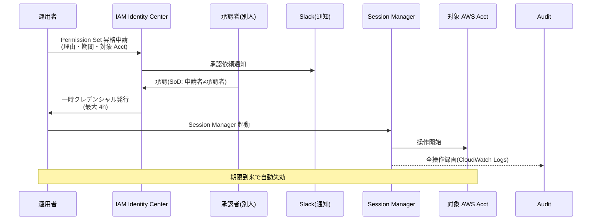

# ADR-040: PAM / JIT 管理者権限管理（APPI / PCI DSS 準拠）

- **ステータス**: Proposed（要件定義フェーズで Accepted に昇格予定）
- **日付**: 2026-06-23
- **関連**:
  - [ADR-037 Shared Responsibility Model + 軽量 IGA](037-shared-responsibility-and-lightweight-iga.md)
  - [ADR-038 Tenant Admin Portal](038-tenant-admin-portal.md)
  - [ADR-035 ITDR 設計](035-identity-threat-detection-response.md)
  - [ADR-036 Customer Audit Support](036-customer-audit-support.md)
  - [§FR-8 管理機能](../requirements/proposal/fr/08-admin.md)
  - [§NFR-4 セキュリティ](../requirements/proposal/nfr/04-security.md)
  - [§NFR-7 コンプライアンス](../requirements/proposal/nfr/07-compliance.md)

---

## Context

### 背景

[ADR-037](037-shared-responsibility-and-lightweight-iga.md) で「軽量 IGA 内包」が確定し、[ADR-038](038-tenant-admin-portal.md) で Tenant Admin Portal を導入した。これにより**顧客テナント管理者**の権限管理は整理されたが、**特権アクセス（Privileged Access）**の扱いは未定義のまま残されていた。

具体的な未解決ポイント:

1. **弊社運用者（基盤管理者）の特権操作** — Keycloak Realm 設定変更 / DB 直接アクセス / 顧客テナント越境操作などの**最高権限**をどう管理するか
2. **顧客テナント管理者の特権操作** — Tenant Admin Portal 経由でも「全ユーザー削除」「全 MFA リセット」等の**破壊的操作**は通常操作と扱いを分けるべきか
3. **PCI DSS / APPI 監査要件** — 規制業種顧客の打ち合わせで「APPI と PCI DSS に対応する必要がある」と確認済み。両規格とも**特権アカウントの常時保有禁止** / **承認ワークフロー** / **完全なセッション記録**が要求される
4. **インシデント時のブレークグラス（Break-Glass）口** — 全システム障害時の緊急アクセス手段を「平時の特権を常時保有」で代替するアンチパターンを避ける

### 業界用語の整理

| 用語 | 意味 | 本基盤での扱い |
|---|---|---|
| **PAM**（Privileged Access Management）| 特権アカウントのライフサイクル管理（保管 / 払い出し / セッション記録 / 監査）| **本 ADR の主題** |
| **JIT 管理者**（Just-in-Time Admin）| 必要な時だけ特権を付与、終了後即剥奪 | PAM の中核実装パターン |
| **PIM**（Privileged Identity Management）| Microsoft Entra 用語、JIT + 承認 + アラート | JIT と実質同義 |
| **PASM**（Privileged Account & Session Mgmt）| Gartner 分類、認証情報の vault 化 + セッション記録 | 部分採用 |
| **PEDM**（Privileged Elevation & Delegation Mgmt）| OS レベルの sudo 風権限昇格 | 本基盤スコープ外（EKS Worker Node 範囲は別 ADR）|
| **Break-Glass Account** | 緊急時専用の最高権限アカウント | **本 ADR で扱う** |
| **Bastion** | 踏み台 | EKS / Aurora アクセス手段、別 ADR |

### 規制要件（APPI / PCI DSS）の要約

| 規制 | 関連条項 | 本 ADR への要求 |
|---|---|---|
| **PCI DSS v4.0** | 7.2.4 / 7.2.5 — 特権アカウントの定期レビュー（半年ごと） | Access Certification 必須 |
| PCI DSS v4.0 | 7.2.5.1 — アプリケーション / システムアカウントは「**最小権限の原則**」適用 | RBAC 細分化 |
| PCI DSS v4.0 | 8.2.2 — 共有アカウント禁止、個人識別可能 | 個人 ID + JIT 昇格 |
| PCI DSS v4.0 | 8.6.1 / 8.6.2 — システム / アプリアカウントは対話的利用不可、認証情報の hardcode 禁止 | Workload Identity（[ADR-041](041-workload-identity-spiffe.md)）|
| PCI DSS v4.0 | 10.2.1 — 監査ログに**全特権操作**を記録 | 完全セッション記録 |
| PCI DSS v4.0 | 10.3 — 監査ログの保護（変更不可・分離保管）| Audit Acct + WORM |
| **APPI 改正法（2022/2024）** | 第 23 条 — 安全管理措置 | 個人データへの特権アクセス制限 + 監査 |
| APPI ガイドライン | 「組織的安全管理措置」 | アクセス権限の付与・剥奪手順策定、定期見直し |
| APPI ガイドライン | 「人的安全管理措置」 | 従業者の監督、教育 |
| APPI ガイドライン | 「技術的安全管理措置」 | 個人データへのアクセス記録、不正アクセス防止 |

→ PCI DSS は**特権操作の完全な可監査性**を厳格要求、APPI は**運用ライフサイクル**を要求。本 ADR は両方を 1 つの PAM 設計で同時充足。

---

## Decision

### 採用方針

**「JIT 昇格 + 承認 + セッション記録 + Break-Glass 分離」の 4 本柱で PAM を構築**。Keycloak ネイティブの roles と AWS IAM Identity Center / SSM Session Manager を組み合わせ、外部 PAM 製品（CyberArk 等）への依存を避ける。

| 項目 | 採用方針 |
|---|---|
| **特権ロール定義** | **常時付与禁止**、`<role>-eligible`（候補）/ `<role>-active`（昇格中）の 2 状態モデル |
| **昇格メカニズム**（基盤管理者）| **AWS IAM Identity Center + Session Manager** の Permission Set + Approval（承認）|
| **昇格メカニズム**（テナント管理者の破壊的操作）| **Tenant Admin Portal 内 JIT 承認ワークフロー**（自社内 SoD 担保）|
| **セッション記録** | AWS Session Manager → CloudWatch Logs（インフラ側）、Keycloak Admin Events → Audit Acct（アプリ側）|
| **Break-Glass**（最終手段）| 物理金庫保管の MFA デバイス + 2 名同時操作 + 自動アラート + 24h 期限 |
| **特権アカウントの定期レビュー** | 半年ごと（PCI DSS 7.2.4）、Tenant Admin Portal で証跡生成 |
| **承認 SLA** | 通常 4h、緊急 15min（Pager 起動）|

---

## A. PAM 全体アーキテクチャ

### A.1 4 層モデル

```mermaid
flowchart TB
    subgraph L1["L1: 物理 / 緊急（Break-Glass）"]
        BG["Break-Glass Account<br/>物理金庫 + 2 名同時操作"]
    end

    subgraph L2["L2: インフラ層（AWS）"]
        IIC["IAM Identity Center<br/>SSO + Permission Set"]
        SSM["Systems Manager<br/>Session Manager(セッション記録)"]
        AWSACC["AWS Account 操作<br/>(Network/Auth/App/Audit)"]
        IIC --> SSM --> AWSACC
    end

    subgraph L3["L3: アプリ層（Keycloak）"]
        KCROLE["Keycloak Role<br/>realm-admin-eligible / -active"]
        KCAPI["Keycloak Admin API<br/>or Admin Console"]
        AUDIT["Keycloak Admin Events<br/>→ Audit Acct"]
        KCROLE --> KCAPI --> AUDIT
    end

    subgraph L4["L4: テナント特権（Tenant Admin Portal）"]
        TAP["Tenant Admin Portal"]
        TAPWF["JIT 承認ワークフロー<br/>(SoD: 申請者 != 承認者)"]
        TAPDESTRUCTIVE["破壊的操作<br/>(全ユーザー削除 / 全 MFA リセット)"]
        TAP --> TAPWF --> TAPDESTRUCTIVE
    end

    L1 -.|平時利用禁止| L2
    L2 -->|EKS / Aurora 経由| L3
    L4 -.|顧客テナント内のみ| L3

    style L1 fill:#ffcdd2
    style L2 fill:#fff3e0
    style L3 fill:#e3f2fd
    style L4 fill:#e8f5e9
```

### A.2 役割と粒度

| 層 | 対象操作 | 承認者 | セッション記録 | 規制対応 |
|---|---|---|---|---|
| **L1 Break-Glass** | 全システム障害時の最高権限 | 物理鍵 2 名 + 役員承認 | 全操作録画 + 即時通知 | PCI DSS 8.2.2 / APPI 安全管理 |
| **L2 インフラ層** | AWS Console / kubectl / DB | Manager 1 名 + Security 1 名 | Session Manager 全録画 | PCI DSS 10.2.1 |
| **L3 アプリ層** | Keycloak Realm / IdP 設定 | 認証基盤 Lead 承認 | Admin Events 全件 | PCI DSS 10.2.1 |
| **L4 テナント特権** | 全ユーザー削除 / 全 MFA リセット | 顧客側 SoD 承認者 | Tenant Audit Log | APPI 第 23 条 |

---

## B. JIT 昇格フロー詳細

### B.1 基盤管理者の AWS Acct 操作（L2）



### B.2 Keycloak Realm 操作（L3）

Keycloak ネイティブの `realm-admin` ロール常時付与を**禁止**し、以下の昇格モデルを採用:

```yaml
# Keycloak Composite Role 設計
roles:
  realm-admin-eligible:    # 候補（常時保有可、操作不可）
    description: "JIT 昇格候補者、実権限なし"
    composite: false

  realm-admin-active:      # 昇格中（操作可、最大 4h で自動剥奪）
    description: "JIT 昇格中、フル管理権限"
    composite: true
    composites:
      - realm-admin        # Keycloak ネイティブの全権限

# 昇格 API（Tenant Admin Portal 経由 or 内部承認ツール）
POST /pam/elevate
{
  "user_id": "ops-suzuki",
  "from_role": "realm-admin-eligible",
  "to_role": "realm-admin-active",
  "justification": "Realm v26 → v27 アップグレード手順",
  "duration_minutes": 240,
  "approver_id": "ops-tanaka"
}
→ Keycloak User-Role mapping 追加
→ 期限到来時に EventBridge Lambda で自動 unassign
→ Admin Events として全記録
```

### B.3 テナント管理者の破壊的操作（L4）

Tenant Admin Portal で以下の操作は **JIT 承認必須**:

| 操作 | 影響範囲 | SoD 要件 |
|---|---|---|
| 全ユーザー一括削除 | テナント全体 | 申請者 + 別管理者 1 名 |
| 全 MFA リセット | 全ユーザー | 同上 |
| IdP 接続無効化 | テナント全ログイン不可化 | 同上 |
| Realm 設定変更（pwd policy / session timeout 等）| テナント全体 | 同上 |
| Audit ログのエクスポート | コンプライアンス情報 | 同上 + 監査人記録 |

通常操作（個別ユーザー編集等）は JIT 不要。

---

## C. Break-Glass 設計

### C.1 何のため・いつ使うか

- **目的**: 全 PAM システム（IIC / Keycloak）が壊れた最終手段
- **使用シナリオ**: IIC 障害 / Keycloak Realm 完全破損 / KMS 鍵紛失 / 内部不正による正規承認経路の遮断
- **NOT 用途**: 「承認が面倒だから」「業務 SLA 満たせないから」→ 通常 PAM を改善せよ

### C.2 設計

| 要素 | 仕様 |
|---|---|
| **アカウント数** | 各 AWS Acct に 1 つ、`break-glass@<acct-domain>` |
| **クレデンシャル保管** | パスワード = 物理金庫 / FIDO2 デバイス = 別金庫 / 2 名分離保管 |
| **MFA** | FIDO2 ハードウェアキー（YubiKey 等）必須 |
| **権限** | AdministratorAccess（全権限）|
| **使用条件** | 役員承認（チャットでも可、24h 以内に書面化）+ 2 名同時立会 |
| **期限** | 使用開始から 24h で自動無効化 + 再ローテーション |
| **モニタリング** | ログイン即時 PagerDuty / Slack #security 通知 |
| **使用後対応** | 24h 以内にパスワード / FIDO2 ローテーション + インシデントレビュー必須 |

### C.3 検証

- 半年ごとに **Break-Glass 訓練**（Tabletop Exercise）を実施
- 6 ヶ月使用ゼロでも訓練で動作確認
- 訓練記録は SOC 2 Type II / PCI DSS 監査エビデンス

---

## D. セッション記録とログ統合

### D.1 ログソース別の保管先

| ログソース | 内容 | 保管先 | 保管期間 | 改ざん防止 |
|---|---|---|---|---|
| **IAM Identity Center** | 昇格申請 / 承認 / 失効 | CloudTrail Organization | 7 年 | S3 Object Lock |
| **Session Manager** | 全コマンド / 標準入出力 | CloudWatch Logs → S3 | 1 年 + Glacier 6 年 | S3 Object Lock |
| **Keycloak Admin Events** | Realm / Client / User CRUD | Audit Acct OpenSearch | 1 年 + S3 6 年 | S3 Object Lock |
| **Tenant Admin Portal Audit** | テナント管理者操作全件 | Audit Acct OpenSearch | 1 年 + S3 6 年 | S3 Object Lock + 顧客ごと暗号化 |
| **Break-Glass 利用** | 上記すべて + PagerDuty | 上記 + 役員レビュー記録 | 7 年 | 同上 |

### D.2 PCI DSS 10.3 / APPI 安全管理対応

- **S3 Object Lock**（WORM）で保管期間中の削除不可
- **Audit Acct は別アカウント**（[ADR-039](039-centralized-network-account-edge-layer.md)）、本番運用者は read-only
- **暗号化**: KMS CMK、顧客テナント分はテナント別 CMK 推奨（APPI 個人データ分離）

---

## E. 顧客向け説明文（ADR-036 Trust Center 連動）

[ADR-036 Customer Audit Support](036-customer-audit-support.md) Trust Center で公開する文言テンプレート:

> ### 特権アクセス管理（PAM）
>
> 本基盤の管理者は **JIT（Just-in-Time）昇格モデル**で運用されており、常時保有される特権アカウントはありません。
>
> - **インフラ運用**: AWS IAM Identity Center による Permission Set 昇格、最大 4 時間、承認者は申請者と別人
> - **Keycloak 設定変更**: Composite Role による昇格モデル、全操作を Admin Events に記録
> - **緊急時 Break-Glass**: 物理金庫保管 + FIDO2 デバイス + 2 名同時操作 + 役員承認 + 自動アラート
> - **セッション記録**: Session Manager / Admin Events を別 AWS アカウントに WORM 保管（7 年）
>
> 規制対応: **PCI DSS v4.0 §7.2 / §8 / §10**、**APPI 第 23 条（安全管理措置）** 準拠。
> 監査エビデンスは Trust Center から顧客監査人にダウンロード可能（SOC 2 Type II Annex）。

---

## F. 代替案検討

| 案 | 評価 | 採否 |
|---|---|---|
| **A. CyberArk PAM 製品導入** | 業界デファクト、完成度高い | ❌ 年 $200K+ / 10 ユーザー、過剰 |
| **B. AWS IAM Identity Center + Session Manager + Keycloak ネイティブ**（本 ADR）| AWS 標準機能、追加製品ゼロ | ✅ 採用 |
| **C. HashiCorp Boundary** | OSS 系、Workload Identity と統合容易 | △ Phase 2 候補 |
| **D. Teleport** | 開発体験良い、SSH/DB/K8s 統合 | △ Phase 2 候補（EKS 多用時）|
| **E. 何もしない**（管理者常時付与）| | ❌ PCI DSS 違反 |

→ Phase 1 は **B**、運用規模拡大時に **C/D** 再評価。

---

## Consequences

### Positive

- **PCI DSS §7 / §8 / §10 を 1 つの設計で同時充足**
- **APPI 安全管理措置の技術的実装根拠**を提供
- 外部 PAM 製品 $200K/年を節約
- 業界標準（Microsoft Entra PIM 同等）の JIT モデル
- Break-Glass 分離でアンチパターン（特権常時保有）回避

### Negative

- **運用負荷**: 承認フロー（4h 上限）が業務 SLA に影響、緊急時 PagerDuty 起動が必要
- **承認者の確保**: SoD 担保のため最低 2 名の管理者が常時必要、深夜 / 休日対応体制が必要
- **教育コスト**: 「承認なしで操作できない」運用文化への転換
- **訓練必須**: Break-Glass の半年ごと訓練、PCI DSS 監査時必須

### Neutral

- Tenant Admin Portal 側 JIT は ADR-038 設計の拡張、追加工数小
- EKS / Aurora の bastion / SSH 等の OS レベル PEDM は別 ADR

### 我々のスタンス

| 基本方針の柱 | PAM 設計での実現 |
|---|---|
| **絶対安全** | 特権常時保有禁止 + SoD + 完全セッション記録 |
| **どんなアプリでも** | テナント管理者向け JIT は Tenant Admin Portal 統合 |
| **効率よく認証** | AWS 標準機能で構築、追加製品なし |
| **運用負荷・コスト最小** | CyberArk 不要、年 $200K 節約、AWS IIC 月数十ドル |

---

## 参考資料

- [PCI DSS v4.0 公式文書](https://www.pcisecuritystandards.org/document_library/) — §7 / §8 / §10
- [APPI ガイドライン（個人情報保護委員会）](https://www.ppc.go.jp/personalinfo/legal/guidelines_tsusoku/) — 安全管理措置
- [NIST SP 800-53 Rev 5 AC-2(7)](https://csrc.nist.gov/publications/detail/sp/800-53/rev-5/final) — Privileged User Accounts
- [Microsoft Entra Privileged Identity Management Overview](https://learn.microsoft.com/en-us/entra/id-governance/privileged-identity-management/pim-configure)
- [AWS IAM Identity Center — Permission Set 承認](https://docs.aws.amazon.com/singlesignon/)
- [AWS Systems Manager Session Manager — セッションログ](https://docs.aws.amazon.com/systems-manager/latest/userguide/session-manager-logging.html)
- [Keycloak Admin Events](https://www.keycloak.org/docs/latest/server_admin/#admin-events) — 全管理操作の記録
- [Gartner: Privileged Access Management Magic Quadrant](https://www.gartner.com/) — 2026 年版
