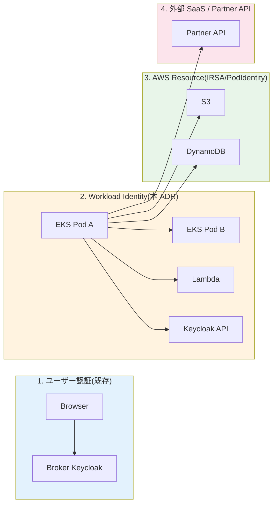
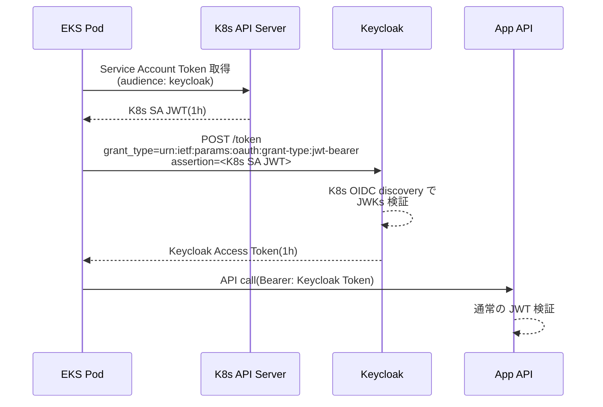
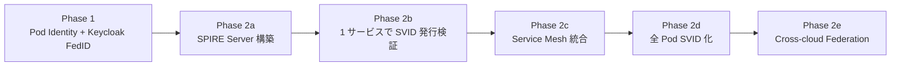

# ADR-041: Workload Identity 設計（SPIFFE/SPIRE + AWS IAM Roles for Service Accounts）

- **ステータス**: Proposed（要件定義フェーズで Accepted に昇格予定）
- **日付**: 2026-06-23 作成、**2026-07-23 更新（ROSA HCP 転換に伴い EKS Pod Identity → ROSA pod identity webhook + IRSA 方式へ差し替え + 基本設計 U7 反映）**

> **2026-07-23 実行基盤転換に伴う改訂（[ADR-056](056-rosa-adoption-decision.md) 逆転）**: 実行基盤が EKS → **ROSA HCP** に変更された。**EKS Pod Identity（EKS Auth API + agent 方式）は EKS 専用機能で ROSA には存在しない**。ROSA での Pod → AWS リソースアクセスは、**クラスタ作成時に自動構成される AWS IAM OIDC プロバイダ + 標準組込の pod identity webhook による IRSA 方式**（ServiceAccount に IAM Role ARN をアノテーション → Pod にトークン(1h ローテーション)がマウント → AWS SDK が `AssumeRoleWithWebIdentity`）を採用する。[Red Hat 公式手順](https://docs.redhat.com/en/documentation/red_hat_openshift_service_on_aws/4/html/authentication_and_authorization/assuming-an-aws-iam-role-for-a-service-account)。
> - 本文中の「EKS Pod Identity（Phase 1）」「`aws_eks_pod_identity_association`（§C.2 Terraform 例）」は「**OIDC プロバイダ信頼ポリシー付き IAM Role + SA アノテーション**」に読み替え
> - **2 段階 STS チェーン（App Acct Role → Auth Acct Role、§C.3）、Keycloak Federated Identity Credentials、SPIFFE/SPIRE Phase 2 候補の位置づけは全て維持**
> - Cross-account は [Red Hat Cloud Experts: Cross-account Access using Custom OIDC Provider](https://cloud.redhat.com/experts/rosa/cross-account-access-openid-connect/) パターンを参照
> - 詳細調査: [basic-design/research/rosa-hcp-adoption-research.md](../basic-design/research/rosa-hcp-adoption-research.md)
> - **2026-07-23 基本設計 U7 反映**: IRSA Role 規約（命名 / 1 SA = 1 Role / sub 完全一致 / クラスタ間相互信頼禁止）と Federated Identity Credentials の適用範囲は **[U7 §7.5](../basic-design/07-security-compliance-design.md) が実装 SSOT**（D-U7-09/10）。private_key_jwt 昇格 = Phase 2 開始時一括、Phase 1 は client_secret_post + Secrets Manager 90 日ローテ + 2 世代並走
- **関連**:
  - [ADR-040 PAM / JIT 管理者権限管理](040-pam-jit-admin-privilege-management.md)
  - [ADR-033 Keycloak 2-tier アーキテクチャ](033-keycloak-2tier-broker-idp-architecture.md)
  - [ADR-039 中央集約 Network 専用アカウント設計](039-centralized-network-account-edge-layer.md)
  - [ADR-014 共有認証基盤が対応する認証パターンの範囲](014-auth-patterns-scope.md)
  - [§FR-2 フェデレーション](../requirements/proposal/fr/02-federation.md)
  - [§FR-6 認可](../requirements/proposal/fr/06-authz.md)
  - [§C-API-3 API 認証パターン](../requirements/proposal/common/)

---

## Context

### 背景

打ち合わせで「**マイクロサービス前提はあった方が良い**」と顧客確認済み（[project-coverage-audit-2026-06-18](../../memory/project_coverage_audit_2026-06-18.md) Phase B 案 K）。これに伴い、**サービス間（machine-to-machine, M2M）の認証**を体系化する必要がある。

ヒトの認証は ADR-001〜038 で網羅的に設計済みだが、**Workload（マイクロサービス・Lambda・ECS タスク・Pod）の認証**は以下が未整理:

1. **Service Account の認証方式** — `client_credentials` grant で Keycloak から JWT 取得する方式は M2M で多用されるが、**Client Secret の管理（保管 / ローテーション / 漏洩検知）**がボトルネック
2. **クロスサービス通信の信頼境界** — Service A が Service B を呼ぶ際、API Key / 共有 Secret / mTLS 等が混在
3. **AWS リソースアクセス** — IAM Role for Service Account（IRSA）、ECS Task Role、Lambda Execution Role はあるが、**アプリ層 JWT との整合が未定義**
4. **PCI DSS 8.6.1 / 8.6.2** — システム / アプリアカウントは「対話的利用不可」「認証情報の hardcode 禁止」を厳格要求
5. **Zero Trust への対応** — ADR-035 ITDR + ADR-040 PAM はヒト側 Zero Trust を実現したが、Workload 側は未対応

### 業界用語の整理

| 用語 | 意味 | 本基盤での扱い |
|---|---|---|
| **Workload Identity** | サービス / コンテナ / 関数の身元 | **本 ADR の主題** |
| **SPIFFE**（Secure Production Identity Framework for Everyone）| CNCF 標準、Workload Identity 仕様 | 採用候補 |
| **SPIRE**（SPIFFE Runtime Environment）| SPIFFE のリファレンス実装 | OSS、CNCF Graduated |
| **SVID**（SPIFFE Verifiable Identity Document）| SPIFFE が発行する身元証明（X.509 or JWT）| 短命（〜1h）|
| **IRSA**（IAM Roles for Service Accounts）| EKS Pod に AWS IAM Role を割当 | AWS ネイティブ、採用 |
| **Pod Identity** | IRSA の後継（2024 GA）、agentless | EKS 1.28+、新規採用 |
| **mTLS**（mutual TLS）| クライアント / サーバー双方の証明書認証 | サービスメッシュ標準 |
| **OAuth 2.0 Client Credentials Grant** | M2M 用 OIDC フロー | 採用、ただし Secret 管理に課題 |
| **Service Mesh** | Istio / Linkerd / AWS App Mesh、Pod 間通信制御 | 推奨だが本 ADR 範囲外 |

### なぜ今この設計が必要か

| トリガー | 影響 |
|---|---|
| 顧客打ち合わせで「マイクロサービス前提」確認 | アプリ Acct 側のアーキ前提化 |
| PCI DSS v4.0 §8.6（2025/3 強制適用）| Client Secret hardcode 禁止 → SPIFFE / IRSA 必須 |
| ADR-039 で App Acct 分離確定 | Cross-account M2M 認証パターン整理が必要 |
| ADR-040 で PAM 整理 | Workload 側 PAM（Secret rotation）も同時整理 |
| Keycloak Service Account 機能の活用範囲明確化 | client_credentials の Secret vs SPIFFE Federation の選択 |

---

## Decision

### 採用方針

**2 層 Workload Identity モデル**を採用。AWS リソースアクセスは **IRSA / Pod Identity**、アプリ間 OAuth は **Keycloak Service Account + Federated Identity Credentials**、Zero Trust 強化用に **SPIFFE/SPIRE 採用は Phase 2 候補**。

| 用途 | 採用方式 | Phase |
|---|---|---|
| **EKS Pod → AWS リソース** | **EKS Pod Identity**（IRSA 後継、agentless）| Phase 1 |
| **ECS Task → AWS リソース** | Task Role（既存）| Phase 1 |
| **Lambda → AWS リソース** | Execution Role（既存）| Phase 1 |
| **アプリ A → アプリ B（HTTP）** | **Keycloak client_credentials + Federated Identity**（K8s SA JWT exchange）| Phase 1 |
| **アプリ → Keycloak（M2M）** | **Federated Identity Credentials**（client_secret 廃止）| Phase 1 |
| **Cross-Acct アプリ間通信** | mTLS + Service Mesh or VPC Endpoint + IAM | Phase 1 |
| **完全 Zero Trust（SPIFFE/SPIRE 全面採用）** | SPIRE Server + SDS Agent | **Phase 2** |
| **API Gateway 外部公開（partner API）** | mTLS or OAuth client_credentials（[§C-API-6](../requirements/proposal/common/) 連動）| Phase 1 |

---

## A. アーキテクチャ全体

### A.1 4 つの認証境界



### A.2 各認証境界の方式選定

| 境界 | 方式 | Token | 有効期間 | 監査 |
|---|---|---|---|---|
| **1. User → App** | OIDC Authorization Code + PKCE | JWT（RS256）| Access 1h / Refresh 12h | Keycloak Events |
| **2a. Pod → Pod**（同 Acct）| K8s Service Account JWT + mTLS（Phase 2: SPIFFE）| K8s SA JWT | 1h | EKS Audit Log |
| **2b. Pod → Keycloak API** | **Federated Identity Credentials**（K8s SA JWT → Keycloak Token）| JWT | 1h | Keycloak Admin Events |
| **2c. Pod → 別 Acct Pod** | mTLS + ALB（Phase 2: SPIFFE Federation）| X.509 | 24h | ALB Access Log |
| **3. Pod → AWS** | **EKS Pod Identity** | STS Session Token | 1h | CloudTrail |
| **4. Pod → Partner API** | OAuth client_credentials or mTLS | JWT or X.509 | 1h | App Log |

---

## B. Keycloak Service Account + Federated Identity Credentials

### B.1 従来パターンの問題

```yaml
# 従来の client_credentials grant
POST /realms/myrealm/protocol/openid-connect/token
grant_type=client_credentials
client_id=my-service
client_secret=<32 byte secret>  # ← この Secret の管理が問題
```

**問題点**:

1. Secret を AWS Secrets Manager 等に保管 → ローテーション運用負荷
2. Secret 漏洩時の影響範囲が大きい（取り消すまで任意の Pod が偽装可能）
3. PCI DSS 8.6.2 「認証情報の hardcode 禁止」に厳密準拠が困難

### B.2 採用パターン：Federated Identity Credentials

Keycloak 26 で標準化された **OIDC token exchange + K8s Service Account JWT** パターン:



**メリット**:

- **Secret ゼロ** — Pod は K8s が自動配布する SA Token のみ使用
- **自動ローテーション** — K8s SA Token は 1h で自動更新（Bound Service Account Token）
- **K8s RBAC で発行制御** — Service Account 単位で Keycloak Client 紐付け
- **監査統合** — Keycloak Events に「どの Pod から」が記録

### B.3 Keycloak 設定例

```json
{
  "clientId": "my-service",
  "publicClient": false,
  "serviceAccountsEnabled": true,
  "attributes": {
    "use.jwks.url": "true",
    "jwks.url": "https://kubernetes.default.svc/openid/v1/jwks",
    "token.endpoint.auth.signing.alg": "RS256"
  },
  "authenticationFlowBindingOverrides": {
    "browser": "federated-client-jwt-bearer"
  }
}
```

**注意点**:

- Keycloak から K8s API Server へ JWKs 取得可能なネットワーク経路が必要
- Cross-Acct の場合は K8s OIDC Discovery を S3 + CloudFront 公開（IRSA と同様の方式）

---

## C. AWS リソースアクセス：Pod → AWS（旧 EKS Pod Identity — 2026-07-23 以降は冒頭注記の ROSA IRSA 方式に読み替え）

### C.1 IRSA → Pod Identity 移行

| 項目 | IRSA（旧）| Pod Identity（新、2024 GA）|
|---|---|---|
| 仕組み | Pod 内環境変数 + OIDC Federation | EKS が直接 STS 発行 |
| 設定 | ServiceAccount アノテーション + Trust Policy | EKS PodIdentityAssociation API |
| Agent | sts-webhook（自動）| pod-identity-agent（DaemonSet）|
| ローテーション | 自動 | 自動 |
| パフォーマンス | OIDC Discovery 経由 | より低レイテンシ |
| **採用判断** | 既存稼働分は維持 | **新規は Pod Identity** |

### C.2 設定例（Pod Identity）

```yaml
# Kubernetes Service Account
apiVersion: v1
kind: ServiceAccount
metadata:
  name: my-app-sa
  namespace: my-app

---
# EKS Pod Identity Association(Terraform)
resource "aws_eks_pod_identity_association" "my_app" {
  cluster_name    = aws_eks_cluster.main.name
  namespace       = "my-app"
  service_account = "my-app-sa"
  role_arn        = aws_iam_role.my_app.arn
}

# IAM Role Trust Policy
{
  "Version": "2012-10-17",
  "Statement": [{
    "Effect": "Allow",
    "Principal": {"Service": "pods.eks.amazonaws.com"},
    "Action": ["sts:AssumeRole", "sts:TagSession"]
  }]
}
```

### C.3 Cross-Account アクセス

App Acct A の Pod から Auth Acct の Aurora にアクセスするケース:

```hcl
# Auth Acct 側 IAM Role(信頼ポリシーで App Acct A の Role を許可)
resource "aws_iam_role" "auth_db_reader" {
  assume_role_policy = jsonencode({
    Statement = [{
      Principal = { AWS = "arn:aws:iam::APP_ACCT_A:role/my-app-pod-identity" }
      Action    = "sts:AssumeRole"
      Effect    = "Allow"
    }]
  })
}

# Pod 側コード
aws sts assume-role --role-arn arn:aws:iam::AUTH_ACCT:role/auth-db-reader
```

→ Pod Identity Token → App Acct Role → Auth Acct Role の **2 段階 STS**。

---

## D. SPIFFE/SPIRE 採用判断（Phase 2 候補）

### D.1 Phase 1 で SPIFFE を採用しない理由

| 理由 | 詳細 |
|---|---|
| **AWS 標準で十分** | Pod Identity + Federated Identity Credentials で M2M 9 割カバー |
| **運用負荷** | SPIRE Server / Agent の DR / HA / アップグレード負荷大 |
| **学習コスト** | SPIFFE 概念（Trust Domain / SVID / Federation）の教育必要 |
| **エコシステム** | AWS では IRSA / Pod Identity の方が文書 / 事例豊富 |
| **マイクロサービス規模** | 10 サービス程度なら Pod Identity + Keycloak で完結 |

### D.2 Phase 2 で SPIFFE 採用を検討する条件

| 条件 | 採用判断 |
|---|---|
| マイクロサービス 50 個超 | SPIFFE Federation で運用効率化 |
| マルチクラウド（AWS + GCP + Azure）| Workload Identity 統一が必要 |
| Service Mesh（Istio / Linkerd）導入 | SPIFFE はメッシュ標準 |
| ゼロトラスト要件強化（NIST SP 800-207 完全準拠）| 全通信 mTLS + SVID 必須 |
| 規制業種拡大（金融 / 医療）| FAPI 2.0 / mTLS 必須化対応 |

### D.3 Phase 2 移行時の段階



---

## E. PCI DSS / APPI 対応

| 規制 | 条項 | 本 ADR での対応 |
|---|---|---|
| PCI DSS 8.6.1 | システム / アプリアカウントは対話的利用不可 | Pod Identity / FedID は対話的ログイン不可 |
| PCI DSS 8.6.2 | 認証情報の hardcode 禁止 | client_secret 廃止、K8s SA Token 自動配布 |
| PCI DSS 8.6.3 | アプリアカウント Password の半年ローテーション | 自動ローテーション（Pod Identity 1h, K8s SA 1h）|
| PCI DSS 10.2.1.5 | 識別と認証メカニズムへの変更 | EKS Audit + Keycloak Events |
| APPI 23 条 | 安全管理措置 | Workload も最小権限 + 監査ログ |

---

## F. 監査ログ統合

### F.1 ログソース

| ログ | 内容 | 保管先 |
|---|---|---|
| **EKS Audit Log** | K8s API 全リクエスト（SA Token 発行含む）| CloudWatch Logs → Audit Acct S3 |
| **CloudTrail** | Pod Identity → STS AssumeRole | CloudTrail Organization Trail |
| **Keycloak Admin Events** | client_credentials / FedID 発行 | Audit Acct OpenSearch |
| **App Access Log** | Pod 間 HTTP 呼び出し | App Acct CloudWatch → S3 |

### F.2 異常検知連携（ADR-035 ITDR と統合）

- **Service Account の異常使用** — 通常 Pod 以外からの Token 利用 → アラート
- **Cross-Acct AssumeRole 異常** — 通常呼ばない Account からの assume → アラート
- **K8s SA Token の VPC 外利用** — 外部 IP からの利用 → ブロック

---

## G. 顧客向け説明文（ADR-036 Trust Center 連動）

> ### Workload Identity（サービス間認証）
>
> 本基盤および顧客アプリケーションでは、サービス間通信に**認証情報の hardcode を禁止**しています。
>
> - **AWS リソースアクセス**: EKS Pod Identity / ECS Task Role / Lambda Execution Role による短命（1h）クレデンシャル自動発行
> - **Keycloak への M2M アクセス**: Federated Identity Credentials により Kubernetes Service Account JWT を直接 Token Exchange、Client Secret なし
> - **Cross-Account 通信**: 2 段階 STS AssumeRole、信頼ポリシーで Role 単位制御
>
> 規制対応: **PCI DSS v4.0 §8.6.1 / §8.6.2**（認証情報 hardcode 禁止、対話的利用禁止）準拠。

---

## H. 代替案検討

| 案 | 評価 | 採否 |
|---|---|---|
| **A. 全 Service Account を client_secret + Secrets Manager** | 従来手法、運用負荷大 | ❌ PCI DSS 違反リスク |
| **B. AWS Pod Identity + Keycloak Federated Identity Credentials**（本 ADR Phase 1）| AWS 標準、運用負荷小 | ✅ 採用 |
| **C. SPIFFE/SPIRE 全面採用 Phase 1** | CNCF 標準、ゼロトラスト完全 | △ 運用負荷大、Phase 2 |
| **D. Service Mesh（Istio）+ mTLS 自動化** | 全通信 mTLS、可視化高い | △ 運用負荷大、Phase 2 |
| **E. HashiCorp Vault Dynamic Secrets** | 短命 Secret 自動生成 | △ Vault 運用負荷、却下 |
| **F. AWS Secrets Manager + Lambda Rotation** | AWS 標準だが Secret 残る | △ B より劣る |

---

## Consequences

### Positive

- **PCI DSS §8.6 全項目を Pod Identity + FedID で同時充足**
- Secret 管理ゼロ化、漏洩リスク大幅低減
- AWS 標準機能で構築、追加製品なし
- Phase 2 SPIFFE への移行パス確保
- マイクロサービス規模拡大に追従可能

### Negative

- **K8s クラスタが SPOF** — EKS 障害時に全 M2M 認証停止（HA 構成必須）
- **Keycloak が SPOF** — FedID 経路の中央集権、ADR-033 HA 構成依存
- Cross-Acct 2 段階 STS の Latency（〜数十 ms）
- Pod Identity は EKS 1.28+ 限定、旧クラスタは IRSA 維持

### Neutral

- Service Mesh 導入は本 ADR 範囲外、別 ADR で扱う
- Phase 2 SPIFFE 採用時は本 ADR を Superseded → 新 ADR

### 我々のスタンス

| 基本方針の柱 | Workload Identity での実現 |
|---|---|
| **絶対安全** | Secret hardcode 禁止 + 短命 Token + 完全監査 |
| **どんなアプリでも** | Pod / ECS / Lambda / Cross-Acct 全方式カバー |
| **効率よく認証** | 自動ローテーション、Secret 配布不要 |
| **運用負荷・コスト最小** | Secrets Manager / Vault 不要、$0 追加コスト |

---

## 参考資料

- [SPIFFE 公式](https://spiffe.io/) — Trust Domain / SVID / Federation
- [SPIRE 公式](https://spiffe.io/docs/latest/spire-about/) — リファレンス実装
- [AWS EKS Pod Identity](https://docs.aws.amazon.com/eks/latest/userguide/pod-identities.html) — 2024 GA
- [Keycloak 26 — Token Exchange / Federated Identity](https://www.keycloak.org/docs/latest/server_admin/#_token-exchange)
- [PCI DSS v4.0 §8.6 — System and Application Accounts](https://www.pcisecuritystandards.org/document_library/)
- [NIST SP 800-207 Zero Trust Architecture](https://csrc.nist.gov/publications/detail/sp/800-207/final)
- [CNCF: SPIFFE Graduated Project](https://www.cncf.io/projects/spiffe/)
- [Kubernetes Service Account Token Volume Projection](https://kubernetes.io/docs/tasks/configure-pod-container/configure-service-account/)
