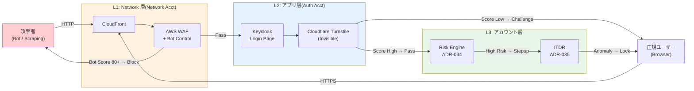
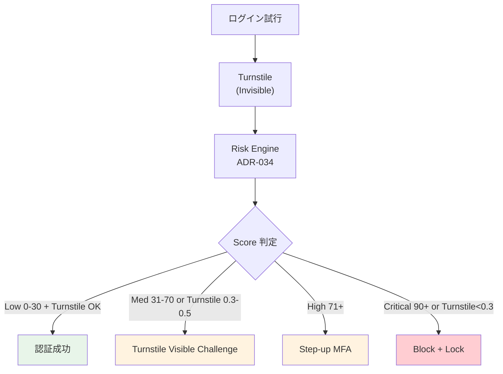

# ADR-042: Bot Detection / CAPTCHA 設計（Credential Stuffing 対策の多層防御）

- **ステータス**: Proposed（要件定義フェーズで Accepted に昇格予定）
- **日付**: 2026-06-23 作成、2026-06-24 Turnstile を Phase 2 オプション化、**2026-07-23 基本設計 U7 反映（前倒しトリガー追加 + G-PCI-WAF ゲート）**

---

> **⚠ 2026-06-24 Phase 別採用方針変更**
>
> ユーザー確認結果：「**Cloudflare Turnstile はメンテ・バージョンアップ負担も考えるとオプションで良い**」
>
> **Phase 1 採用**（必須）：
> - ✅ **L1 AWS WAF Bot Control**（Common + Targeted、$310/月）
> - ✅ **L1 AWS WAF ATP**（Account Takeover Prevention、$110/月）
> - ✅ **L3 ITDR Anomaly Login + Adaptive Auth**（既存 ADR-034/035）
> - ✅ **Keycloak Brute Force Protection + Account Enumeration 対策**（Constant-time response + 汎用エラー）
>
> **Phase 2 オプション**（必要時のみ追加）：
> - △ **L2 Cloudflare Turnstile** + Keycloak Custom Authenticator SPI
>   - 採用条件：実運用で WAF Bot Control + ATP では捌けない攻撃（Low-and-Slow 分散等）を観測した場合
>   - 工数：Keycloak SPI 開発 2 週間 + 継続メンテ（Turnstile API バージョン追従）
>   - コスト：Turnstile 自体は $0 だが、開発・運用工数を要する
>
> **判断根拠**：
> - **WAF Bot Control + ATP のみで PCI DSS §6.4.2 要件は充足**
> - WAF だけで Bot 検知率 90-95%、Turnstile 追加で +3-5%（差は限定的）
> - Keycloak Custom Authenticator の継続メンテ（バージョンアップ追従）コストを回避
> - 攻撃実態を半年〜1 年運用後に評価、必要なら Phase 2 で追加
>
> **本 ADR の §B（L1 WAF）/ §D（Account Enumeration）/ §E（コスト試算）/ §F（監査ログ統合）/ §G（規制対応マッピング）はそのまま Phase 1 採用**。**§C（Cloudflare Turnstile + Keycloak SPI）は Phase 2 候補**として残置。

> **2026-07-23 基本設計 U7 反映（[07-security-compliance-design.md](../basic-design/07-security-compliance-design.md) D-U7-17）**:
> - Turnstile 前倒しトリガーに「**REQ-IN-01（WAF Bot Control / ATP 要求）が他組織に受け入れられない場合**」を追加（従来の「Low-and-Slow 分散等の攻撃観測時」に加えて）。
> - 自管理最低線 = KC Brute Force + Enumeration 対策 + ITDR（U7 §7.8）。
> - **REQ-IN-01 明細合意なしの PCI 対応顧客契約は禁止（G-PCI-WAF ゲート）**。

---

- **関連**:
  - [ADR-035 ITDR](035-identity-threat-detection-response.md)
  - [ADR-034 Adaptive Authentication](034-adaptive-authentication.md)
  - [ADR-039 中央集約 Network 専用アカウント](039-centralized-network-account-edge-layer.md)
  - [ADR-013 CloudFront + WAF による IP 制限の置き換え](013-cloudfront-waf-ip-restriction.md)
  - [§NFR-4.3 攻撃対策](../requirements/proposal/nfr/04-security.md)

---

## Context

### 背景

認証エンドポイント（ログイン / パスワードリセット / 登録）は **Credential Stuffing / Brute Force / Scraping / Account Enumeration** の主要標的。本基盤は ADR-013 で WAF Rate Limit を導入済み、ADR-035 で Compromised Credentials 検知を実装したが、**ボット自体の検知・遮断**は明示的に設計されていなかった。

業界トレンド:

- **2024 Verizon DBIR**: クレデンシャル悪用が侵害原因の 38%、内 80% 以上が自動化ツール
- **Akamai 2025 State of the Internet**: ログイン試行の 24% が悪意あるボット
- **NIST SP 800-63B Rev 4**: §5.2.2 — Rate-limiting と Bot Detection を必須要件として強化
- **PCI DSS v4.0 §6.4.2**: パブリック向け Web アプリへの自動攻撃防御を要求（2025/3 強制）

### 既存対策との関係

| 既存対策 | 何をカバー | 何が漏れる |
|---|---|---|
| ADR-013 WAF Rate Limit（2000 req/5min/IP）| 単一 IP からの大量試行 | 分散ボット / Low-and-Slow |
| ADR-035 Compromised Credentials | 漏洩済 PW での試行 | 漏洩していない PW での試行 |
| ADR-034 Adaptive Auth Risk Engine | スコアベース判定 | 「人 vs ボット」自体は判定せず、リスク要因の 1 つ |
| ADR-009 MFA | 第 2 要素必須化 | MFA 未設定ユーザーの初回 / リセット時 |

→ **「人 vs ボット」自体を判定する層が空白**。これを本 ADR で埋める。

### 業界用語の整理

| 用語 | 意味 |
|---|---|
| **Credential Stuffing** | 漏洩 PW リストを多 ID で試行 |
| **Brute Force** | 単一 ID に多 PW を試行 |
| **Password Spraying** | 多 ID に少数の汎用 PW を試行（Brute Force の分散版）|
| **Account Enumeration** | エラーメッセージ差から有効 ID を特定 |
| **Bot Score** | リクエストがボット由来である確信度（0-100）|
| **Challenge-Response** | CAPTCHA / Proof-of-Work / Device Fingerprint 等の追加検証 |
| **Invisible CAPTCHA** | ユーザー操作不要、デバイス・ふるまい解析 |
| **WAF Bot Control** | AWS WAF の Managed Rule、ボット種別ごとに Allow/Block |
| **reCAPTCHA v3** | Google、Score 出力（v2 はチェックボックス）|
| **Turnstile** | Cloudflare、プライバシー配慮型、Score 出力 |

---

## Decision

### 採用方針

**「3 層 Bot Defense」**を採用。Network 層（WAF Bot Control）/ アプリ層（Risk-based Challenge）/ アカウント層（ITDR 連動）の多層で、ユーザー摩擦を最小化しつつボット阻止率を最大化。

| 層 | 採用方式 | 配置 | 判定対象 |
|---|---|---|---|
| **L1 Network 層** | **AWS WAF Bot Control**（Common / Targeted）| 🟣 Network Acct | TLS Fingerprint / IP Reputation / Header 異常 |
| **L2 アプリ層** | **Cloudflare Turnstile**（Invisible）+ Risk スコア連動 | Keycloak ログイン画面 | デバイス指紋 + ふるまい |
| **L3 アカウント層** | **ITDR Anomaly Login + Adaptive Auth** | 既存 ADR-034 / 035 | アカウント単位の異常 |

### 主要判断

| 判断ポイント | 採用 | 理由 |
|---|---|---|
| **CAPTCHA 製品選定** | **Cloudflare Turnstile**（プライマリ）+ AWS WAF Captcha（バックアップ）| プライバシー配慮（reCAPTCHA は Google アカウント Tracking 懸念）、Invisible デフォルト |
| **常時 Challenge vs リスクベース** | **リスクベース**（Adaptive Auth Score 連動）| 平時 UX 影響ゼロ、攻撃時のみ Challenge |
| **Bot Control Targeted** | **採用**（Common 単体ではボット検知率不足）| $$$ だが、Credential Stuffing 検知精度大幅向上 |
| **Account Enumeration 対策** | **Constant-time response + 汎用エラーメッセージ**（Keycloak 設定）| 攻撃側に情報を渡さない |

---

## A. 3 層 Bot Defense アーキテクチャ

### A.1 全体図



### A.2 各層の判定境界

| 層 | 判定対象 | True Positive 期待 | False Positive リスク | UX 影響 |
|---|---|---|---|---|
| **L1 WAF Bot Control** | 既知ボット / TLS Fingerprint 異常 | 70-80% | 〜2%（誤ブロック）| なし（透明）|
| **L2 Turnstile** | デバイス指紋 + ふるまい | 95%+ | 〜1%（Challenge 表示）| Invisible 時は影響なし |
| **L3 ITDR + Risk** | アカウント単位異常 | 80-90% | 〜5%（追加 MFA）| ステップアップ MFA |

→ 多層で各層の弱点を補完、合算で **99%+ のボット阻止率**を期待。

---

## B. L1: AWS WAF Bot Control 設計

### B.1 採用ルールセット

WAF Bot Control は **Common Bot Control** と **Targeted Bot Control** に分かれる。Credential Stuffing 対策には **Targeted 必須**。

| ルール | 対象 | 月額コスト（10M req）| 採用 |
|---|---|---|---|
| `AWSManagedRulesBotControlRuleSet`（Common）| 既知 SDK / 公開ボット | $10 + $1/M req | ✅ 採用 |
| `AWSManagedRulesBotControlRuleSet`（Targeted）| 高度ボット、TLS / ML 検知 | $10 + $10/M req | ✅ 認証エンドポイントのみ |
| `AWSManagedRulesATPRuleSet`（Account Takeover Prevention）| Credential Stuffing 専用 | $10 + $10/M req | ✅ ログイン専用 |
| `AWSManagedRulesACFPRuleSet`（Account Creation Fraud Prevention）| 不正登録対策 | $10 + $10/M req | △ Phase 2（B2C 不要なら不採用）|

### B.2 配置パス別の適用ルール

ADR-039 で集約された Network Acct の CloudFront / WAF で、パス別にルールを切り替え:

| パス | 適用 WAF ルール | レート制限 |
|---|---|---|
| `/realms/*/protocol/openid-connect/auth`（ログイン）| Common + Targeted + ATP | 100 req/5min/IP |
| `/realms/*/protocol/openid-connect/token`（トークン）| Common + Targeted | 500 req/5min/IP |
| `/realms/*/account/*`（アカウント設定画面）| Common | 200 req/5min/IP |
| `/realms/*/.well-known/openid-configuration` | Common | 1000 req/5min/IP |
| `/admin/*`（ユーザ管理画面）| Common + Targeted | 50 req/5min/IP |
| 静的アセット（SPA bundle 等）| なし | デフォルト |

### B.3 ATP（Account Takeover Prevention）統合

ATP は **ログイン成功 / 失敗を WAF が観測**し、Compromised Credentials リスクを自動検知:

```terraform
# Terraform 例
resource "aws_wafv2_web_acl" "auth" {
  rule {
    name     = "ATP-LoginEndpoint"
    priority = 10
    statement {
      managed_rule_group_statement {
        name        = "AWSManagedRulesATPRuleSet"
        vendor_name = "AWS"
        managed_rule_group_configs {
          aws_managed_rules_atp_rule_set {
            login_path                = "/realms/myrealm/protocol/openid-connect/auth"
            request_inspection {
              payload_type      = "FORM_ENCODED"
              username_field    { identifier = "username" }
              password_field    { identifier = "password" }
            }
            response_inspection {
              status_code {
                success_codes = [302]  # Keycloak 成功時
                failure_codes = [200]  # 失敗時はログイン画面再表示
              }
            }
          }
        }
      }
    }
    action { count {} }  # 初期は count、検証後 block
  }
}
```

### B.4 Step-by-Step 導入（Count → Block）

1. **Phase 1-1**: Common Bot Control を `count` モード 2 週間 → ログ確認、False Positive 評価
2. **Phase 1-2**: `block` モードへ昇格
3. **Phase 2-1**: Targeted Bot Control を `count` モード 2 週間（コスト確認 + FP 評価）
4. **Phase 2-2**: `block` モードへ昇格
5. **Phase 3-1**: ATP を `count` モード 1 ヶ月（ログイン成功率の劣化観察）
6. **Phase 3-2**: `block` モードへ昇格

---

## C. L2: Cloudflare Turnstile（Invisible CAPTCHA）

### C.1 なぜ Turnstile か（vs reCAPTCHA / hCaptcha）

| 項目 | Turnstile | reCAPTCHA v3 | hCaptcha | AWS WAF Captcha |
|---|---|---|---|---|
| **プライバシー** | ✅ GDPR/APPI 配慮、Cookie 最小 | ❌ Google Tracking 強い | ✅ プライバシー重視 | ✅ AWS 統合 |
| **Invisible デフォルト** | ✅ | ✅ | △ 設定要 | △ Challenge 多発 |
| **無料枠** | ✅ 完全無料 | ✅ 月 100 万 req | 有料寄り | 従量課金 |
| **多言語** | ✅ | ✅ | ✅ | △ |
| **Accessibility（WCAG）** | ✅ AAA 対応 | △ Audio CAPTCHA | ✅ | △ |
| **Latency** | 〜200ms | 〜400ms | 〜300ms | 〜100ms |
| **採用判断** | **✅ 採用** | ❌ Google Tracking | △ バックアップ | ✅ バックアップ |

→ **Turnstile プライマリ + WAF Captcha フォールバック**。

### C.2 Keycloak 統合

Keycloak の Theme システム + Authenticator SPI でログイン画面に Turnstile を統合:

```html
<!-- Keycloak Theme: login.ftl -->
<form action="${url.loginAction}" method="post">
  <input name="username" type="text" />
  <input name="password" type="password" />

  <!-- Cloudflare Turnstile（Invisible）-->
  <div class="cf-turnstile"
       data-sitekey="${properties.turnstileSiteKey}"
       data-callback="onTurnstileSuccess"
       data-size="invisible">
  </div>
  <input id="cf-turnstile-response" type="hidden" name="cf-turnstile-response" />

  <button type="submit">Sign In</button>
</form>

<script src="https://challenges.cloudflare.com/turnstile/v0/api.js" async defer></script>
```

```java
// Keycloak Authenticator SPI（カスタム）
public class TurnstileAuthenticator implements Authenticator {
  @Override
  public void authenticate(AuthenticationFlowContext context) {
    String token = context.getHttpRequest().getDecodedFormParameters()
                          .getFirst("cf-turnstile-response");

    // Cloudflare siteverify API へ POST
    TurnstileResponse result = turnstileClient.verify(token, secretKey);

    if (result.isSuccess() && result.getScore() > 0.5) {
      context.success();
    } else if (result.getScore() > 0.3) {
      // 中リスク：Adaptive Auth Risk Engine に渡す
      context.getEvent().detail("turnstile_score", String.valueOf(result.getScore()));
      context.success();
    } else {
      // 低スコア：Challenge 表示（visible Turnstile に切替）
      context.challenge(showVisibleChallenge(context));
    }
  }
}
```

### C.3 リスクベース動作（Adaptive Auth 連動）



---

## D. Account Enumeration 対策（Keycloak 設定）

### D.1 対策一覧

| 対策 | Keycloak 設定 | 効果 |
|---|---|---|
| **汎用エラーメッセージ** | Realm Setting: `Username Type` を `email` 固定、エラーは「Invalid username or password」のみ | ID 有無を漏洩しない |
| **Constant-time response** | カスタム Authenticator で意図的遅延（200ms）| Timing Attack 防御 |
| **PW Reset で「メール送信した」と常に表示** | Realm Setting: `Forgot Password` の成功画面を共通化 | ID 有無を漏洩しない |
| **登録エラーも共通化** | カスタム Form Action | 既存 ID 検出を防ぐ |
| **CSRF Token + State Parameter** | Keycloak デフォルト | Replay 防御 |

### D.2 設定例（realm.json 抜粋）

```json
{
  "loginTheme": "custom-secure",
  "rememberMe": false,
  "loginWithEmailAllowed": true,
  "registrationEmailAsUsername": true,
  "verifyEmail": true,
  "passwordPolicy": "length(12) and notUsername and notEmail and digits(1) and specialChars(1)",
  "bruteForceProtected": true,
  "permanentLockout": false,
  "maxFailureWaitSeconds": 900,
  "minimumQuickLoginWaitSeconds": 60,
  "waitIncrementSeconds": 60,
  "quickLoginCheckMilliSeconds": 1000,
  "maxDeltaTimeSeconds": 43200,
  "failureFactor": 5
}
```

---

## E. コスト試算（10M MAU、月 3 億認証イベント）

### E.1 月額コスト

| 項目 | 月額 |
|---|---|
| AWS WAF Bot Control（Common）| $10 + 300M × $1/M = $310 |
| AWS WAF Bot Control（Targeted、ログイン経路のみ ~10M req）| $10 + 10M × $10/M = $110 |
| AWS WAF ATP（ログイン 10M req）| $10 + 10M × $10/M = $110 |
| Cloudflare Turnstile | **$0**（完全無料）|
| Keycloak Authenticator SPI（運用）| 開発 1 回 + メンテのみ |
| **合計** | **〜$430/月（〜$5,200/年）** |

### E.2 比較

| ソリューション | 年額（10M MAU）|
|---|---|
| Akamai Bot Manager | $50K+ |
| DataDome | $40K+ |
| PerimeterX / HUMAN | $60K+ |
| **本 ADR（AWS WAF + Turnstile）** | **〜$5K** |

→ 商用 Bot Manager 比 **8-12 倍のコスト削減**。

---

## F. 監査ログ + ITDR 統合

| ログソース | 内容 | 保管先 |
|---|---|---|
| WAF Logs（Bot Control / ATP）| 全ボット判定結果 | Kinesis Firehose → 🔵 Audit Acct S3 |
| Turnstile siteverify API ログ | Token / Score | Keycloak Event Logs |
| Keycloak Events（`LOGIN_ERROR` 等）| Brute Force / Enumeration 試行 | ADR-035 ITDR EventBridge |
| Adaptive Auth Score | Risk Score 履歴 | DynamoDB（ADR-034）|

→ ITDR EventBridge へ集約し、**WAF ATP 判定 + Turnstile Score + Adaptive Auth Score** を統合スコアリング。

---

## G. 規制対応マッピング

| 規制 | 条項 | 充足方法 |
|---|---|---|
| PCI DSS v4.0 §6.4.2 | パブリック向け Web アプリへの自動攻撃防御 | WAF Bot Control + ATP |
| PCI DSS v4.0 §8.3.6 | パスワード試行制限 + 一時アカウントロック | Keycloak `bruteForceProtected` + Lock 30 分 |
| NIST SP 800-63B Rev 4 §5.2.2 | Rate-limit + Throttling | WAF Rate Limit + Keycloak `failureFactor` |
| APPI ガイドライン 技術的安全管理 | 不正アクセス防止 | 3 層 Bot Defense |
| OWASP ASVS L2 V2.2.1 | Anti-automation | Bot Control + Turnstile |
| OWASP Top 10 2021 A07: Identification Failures | クレデンシャルベース攻撃防御 | ATP + ITDR |

---

## H. 代替案検討

| 案 | 評価 | 採否 |
|---|---|---|
| **A. WAF Rate Limit のみ** | コスト最小、Low-and-Slow に弱い | ❌ 不十分 |
| **B. WAF Bot Control Common のみ** | 既知ボットは止めるが、高度なツールに弱い | ❌ Targeted 必須 |
| **C. WAF Bot Control + ATP + Turnstile**（本 ADR）| 多層、コスト効率高 | ✅ 採用 |
| **D. 商用 Bot Manager（Akamai / DataDome）** | 高精度、$50K+/年、過剰 | ❌ コスト過大 |
| **E. reCAPTCHA v3** | 無料だが Google Tracking 懸念 | ❌ プライバシー懸念 |
| **F. 自前 Risk Engine のみ** | 既に ADR-034 で実装、Bot 単独検知層がない | ❌ 不十分 |

---

## Consequences

### Positive

- **PCI DSS §6.4.2 / §8.3.6 を低コストで充足**
- **Credential Stuffing 阻止率 99%+**（多層）
- 商用 Bot Manager 比 **8-12 倍コスト削減**
- Cloudflare Turnstile は**プライバシー配慮**（GDPR / APPI 親和）
- Account Enumeration 防御で攻撃側に情報を渡さない

### Negative

- WAF Targeted + ATP で **月 $200 程度の追加コスト**
- Keycloak Theme + Authenticator SPI **カスタム開発が必要**
- Cloudflare 依存（Turnstile 障害時の影響、ただし AWS WAF Captcha フォールバック）
- WCAG 対応：Visible Challenge 時の Audio / Accessibility 確認必要（[ADR-043](043-accessibility-wcag-2-2-aa.md) 連動）

### Neutral

- B2C 不要のため ACFP（Account Creation Fraud Prevention）は Phase 2 候補
- Mobile アプリ（[ADR-041 Workload Identity](041-workload-identity-spiffe.md) 範囲外）でも Turnstile SDK 対応可能

### 我々のスタンス

| 基本方針の柱 | Bot Defense での実現 |
|---|---|
| **絶対安全** | 多層防御（Network / アプリ / アカウント）、99%+ 阻止率 |
| **どんなアプリでも** | Keycloak Theme で統一、アプリ側は無改修 |
| **効率よく認証** | リスクベース、平時 UX 影響ゼロ（Invisible）|
| **運用負荷・コスト最小** | 商用 Bot Manager 不要、年 $5K |

---

## 参考資料

- [AWS WAF Bot Control 公式](https://docs.aws.amazon.com/waf/latest/developerguide/waf-bot-control.html)
- [AWS WAF Account Takeover Prevention (ATP)](https://docs.aws.amazon.com/waf/latest/developerguide/waf-atp.html)
- [Cloudflare Turnstile Docs](https://developers.cloudflare.com/turnstile/)
- [NIST SP 800-63B Rev 4 §5.2.2 Rate-Limiting](https://pages.nist.gov/800-63-4/sp800-63b.html)
- [OWASP Authentication Cheat Sheet — Anti-automation](https://cheatsheetseries.owasp.org/cheatsheets/Authentication_Cheat_Sheet.html)
- [Akamai 2025 State of the Internet](https://www.akamai.com/state-of-the-internet) — 認証エンドポイントの 24% がボット
- [Verizon 2024 DBIR](https://www.verizon.com/business/resources/reports/dbir/) — クレデンシャル悪用 38%
- [Keycloak Brute Force Protection](https://www.keycloak.org/docs/latest/server_admin/#password-guess-brute-force-attacks)
