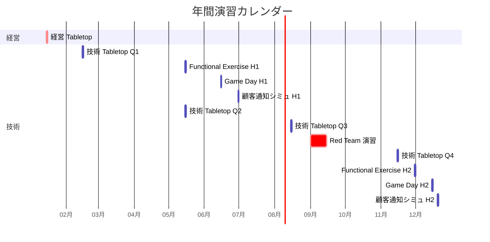
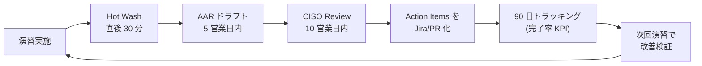

# ADR-044: Tabletop Exercise / セキュリティインシデント訓練設計

- **ステータス**: Proposed（要件定義フェーズで Accepted に昇格予定）
- **日付**: 2026-06-23
- **関連**:
  - [ADR-035 ITDR](035-identity-threat-detection-response.md)
  - [ADR-036 Customer Audit Support](036-customer-audit-support.md)
  - [ADR-040 PAM / JIT 管理者権限管理](040-pam-jit-admin-privilege-management.md)
  - [ADR-042 Bot Detection / CAPTCHA](042-bot-detection-captcha.md)
  - [§NFR-6 運用](../requirements/proposal/nfr/06-operations.md)
  - [§NFR-7 コンプライアンス](../requirements/proposal/nfr/07-compliance.md)

---

## Context

### 背景

ADR-035 ITDR / ADR-040 PAM / ADR-036 Customer Audit Support で**インシデント対応の技術的基盤**は整備した。しかし「**実際にインシデントが起きた時、人と組織が動けるか**」の検証が未定義のままだった。具体的に欠けていたもの:

1. **Incident Response Playbook**（IR プレイブック）の整備と更新プロセス
2. **Tabletop Exercise**（机上演習）の実施計画と頻度
3. **Break-Glass 訓練**（ADR-040 で半年実施と決めたが詳細手順未定義）
4. **Red Team / Purple Team 演習**（ITDR の実効性検証）
5. **顧客通知シミュレーション**（GDPR / APPI / SOC 2 要件）
6. **学習・改善ループ**（演習結果を技術改修に反映する仕組み）

### 規制要件の現状

| 規制 | 演習要求 |
|---|---|
| **SOC 2 Type II** | CC7.4 — インシデント対応プロセスを定義 + 年次演習 |
| **PCI DSS v4.0 §12.10.2** | IR プランの年次テスト必須 |
| **ISO 27001 A.5.24** | インシデント対応計画 + 演習 |
| **NIST CSF 2.0**（2024）| Function: Respond の RC.IM-3 — 演習結果から改善 |
| **APPI ガイドライン**（個人情報保護委員会）| 漏えい等報告体制の整備 + 訓練 |
| **金融庁 監督指針**（規制業種顧客）| インシデント対応訓練の年次実施 |
| **NIS2 Directive**（EU、2024 適用）| 重要インフラ事業者の演習義務 |

→ **どの規制も「演習の年次実施」を必須**としている。

### 業界用語の整理

| 用語 | 意味 |
|---|---|
| **Tabletop Exercise (TTX)** | 机上演習、シナリオに沿って関係者が口頭で対応を議論 |
| **Functional Exercise** | 一部システム実地操作を伴う演習（半実環境）|
| **Full-Scale Exercise** | 全システム本番に近い環境で実施 |
| **Red Team** | 攻撃側、本番環境で侵入を試みる |
| **Blue Team** | 防御側、SOC / IR チーム |
| **Purple Team** | Red + Blue 協調、技術改善目的 |
| **War Game** | 大規模 + 経営層含む演習 |
| **Hot Wash** | 演習直後の振り返り（記憶が鮮明なうち）|
| **After Action Report (AAR)** | 演習後の正式レポート、改善アクション含む |
| **Break-Glass Drill** | 緊急アクセス手順の訓練 |
| **Game Day**（AWS 用語）| 障害注入演習、技術復旧訓練 |

---

## Decision

### 採用方針

**「3 種 × 4 頻度」マトリクス**で演習を体系化。Tabletop（経営含む）/ Functional（技術中心）/ Game Day（カオスエンジニアリング）を、対象範囲とリスクに応じて実施。

| 演習種別 | 対象 | 頻度 | 期間 | 関係者 |
|---|---|---|---|---|
| **A. 経営 Tabletop** | 重大インシデント想定（10M ユーザー漏洩等）| **年 1 回** | 半日 | 経営 + IR Lead + 法務 + 広報 |
| **B. 技術 Tabletop** | ITDR シナリオ別（Credential Stuffing / Account Takeover / Insider Threat 等）| **四半期** | 2-3h | SOC / IR / SRE |
| **C. Functional Exercise**（Break-Glass 含む）| 実環境での承認・操作 | **半期** | 4h | IR + 該当チーム |
| **D. Game Day**（AWS 障害注入）| Region 障害 / Aurora failover / Keycloak 障害 | **半期** | 1 日 | SRE + IR |
| **E. Red Team / Purple Team** | 外部委託 + 内部 SOC | **年 1 回** | 1-2 週間 | 外部 + 内部 |
| **F. 顧客通知シミュレーション** | 大規模漏洩想定の顧客通知文書 / プロセス | **半期** | 2h | IR + 法務 + Customer Success |

### 主要判断

| 判断ポイント | 採用 | 理由 |
|---|---|---|
| **演習主催** | **CISO 直轄の演習チーム**（兼任 0.3 FTE）| 中立性確保、規制監査エビデンス |
| **シナリオ作成** | **MITRE ATT&CK ベース + 過去業界事例** | 体系性 + リアリティ |
| **AAR フォーマット** | **NIST SP 800-84 準拠** | 業界標準、SOC 2 監査連携 |
| **改善ループ** | **AAR の Action Items を 90 日以内に技術 PR or プロセス改訂** | 演習を「やりっぱなし」にしない |
| **外部委託** | **Red Team は年 1 外部委託**、Tabletop は内製 | コストとリアリティのバランス |
| **演習エビデンス公開** | **Trust Center で実施実績 + サマリ公開**（[ADR-036](036-customer-audit-support.md)）| 顧客監査対応 |

---

## A. 演習体系の詳細

### A.1 年間カレンダー例

```
Q1: 経営 Tabletop（年 1）、技術 Tabletop（四半期）
Q2: 技術 Tabletop、Functional Exercise（半期）、Game Day（半期）、顧客通知シミュレーション（半期）
Q3: 技術 Tabletop、Red Team / Purple Team（年 1）
Q4: 技術 Tabletop、Functional Exercise（半期）、Game Day（半期）、顧客通知シミュレーション（半期）
```



### A.2 シナリオライブラリ（MITRE ATT&CK ベース）

| ID | シナリオ | MITRE ATT&CK | 対応 ADR |
|---|---|---|---|
| **S-01** | Credential Stuffing 大規模攻撃 | T1110.004 | ADR-035 / 042 |
| **S-02** | Account Takeover + データ exfiltration | T1078 → T1567 | ADR-035 |
| **S-03** | Insider Threat（管理者の不正操作）| T1078.004 | ADR-040 |
| **S-04** | Phishing → MFA Bypass → Privilege Escalation | T1566 → T1556 → T1078 | ADR-035 |
| **S-05** | Supply Chain Attack（依存ライブラリ汚染）| T1195 | Phase C 別 ADR |
| **S-06** | Keycloak Realm Lockout（誤操作 / 攻撃）| T1531 | ADR-040 Break-Glass |
| **S-07** | Region 障害（AWS Tokyo 全停止）| — | ADR-033 + Game Day |
| **S-08** | Aurora データ破壊（Ransomware 想定）| T1486 | NFR-5 DR |
| **S-09** | Cloudflare（Turnstile）障害 | — | ADR-042 フォールバック |
| **S-10** | Customer Audit 緊急対応（顧客の SOC 2 監査でエビデンス即時提出要請）| — | ADR-036 |
| **S-11** | 10M ユーザー漏洩想定の顧客通知 | — | APPI 第 26 条 / GDPR 33 条 |
| **S-12** | Workload Identity 異常（Pod Identity 大量 STS 失敗）| T1556 | ADR-041 |

### A.3 シナリオ S-01 詳細例（Credential Stuffing）

```markdown
## シナリオ S-01: Credential Stuffing 大規模攻撃

### 想定
- 攻撃時刻: 2026-XX-XX 03:00 JST
- 攻撃元: 100K IP（分散ボットネット）
- 試行数: 1 時間で 500 万試行
- 標的: ログインエンドポイント `auth.example.com/realms/myrealm/protocol/openid-connect/auth`
- 被害想定: 300 アカウント漏洩

### 演習タイムライン（2 時間）
| 時刻 | イベント | 期待される対応 |
|---|---|---|
| 00:00 | ITDR Alert: Anomaly Login Spike | SOC 即時確認 |
| 00:10 | Adaptive Auth Score 平均上昇通知 | Risk Engine ログ確認 |
| 00:15 | WAF Bot Control ATP block 急増 | Network チーム連絡 |
| 00:30 | 一部アカウント Lock 発生 | Customer Success 顧客対応準備 |
| 00:45 | Senior IR Lead 通知 | 緊急 War Room 招集 |
| 01:00 | 経営報告 | CISO への第 1 報 |
| 01:30 | Cloudflare Turnstile Visible 強制有効化 | 全ログインに Challenge |
| 02:00 | Hot Wash | 何が良かったか / 何が遅かったか |

### 評価項目
- [ ] ITDR Alert 受信から初動まで 5 分以内か
- [ ] War Room 招集まで 30 分以内か
- [ ] 顧客通知文書のドラフトが 2 時間以内に出るか
- [ ] PagerDuty Escalation が正しく動いたか
- [ ] Turnstile 強制 Challenge 切替が技術的に可能か
- [ ] 該当アカウント Lock + 通知が顧客側に到達したか
```

---

## B. Break-Glass 訓練詳細（ADR-040 連動）

### B.1 訓練手順（半期実施）

| Step | 内容 | 期待時間 |
|---|---|---|
| 1 | 演習宣言 + 役員 1 名招集（実施前に通知）| 〜10 分 |
| 2 | 物理金庫から FIDO2 デバイス + パスワード紙 取出（2 名同時）| 〜10 分 |
| 3 | Break-Glass アカウントでログイン（本番環境）| 〜5 分 |
| 4 | 限定操作（例: テスト Realm の Read のみ）| 〜15 分 |
| 5 | ログオフ + パスワード / FIDO2 ローテーション | 〜30 分 |
| 6 | PagerDuty / Slack 通知が予期通り発火したか確認 | 〜10 分 |
| 7 | 監査ログ（Session Manager / Admin Events）の記録確認 | 〜10 分 |
| 8 | Hot Wash + AAR ドラフト | 〜60 分 |
| **合計** | | **〜2.5 時間** |

### B.2 評価 KPI

| 指標 | 目標 |
|---|---|
| ログイン成功までの時間 | 30 分以内 |
| PagerDuty 通知到達時間 | 1 分以内 |
| ローテーション完了時間 | 演習後 24h 以内 |
| 全操作の監査ログ記録率 | 100% |
| AAR 完了 | 演習後 5 営業日以内 |
| Action Items 完了率（90 日内）| 100% |

---

## C. 顧客通知シミュレーション

### C.1 規制ごとの通知 SLA

| 規制 | 通知 SLA | 対象 |
|---|---|---|
| **APPI 第 26 条**（漏えい等の通知）| 個人情報保護委員会へ「速やかに」、本人通知も「速やかに」 | 1,000 件超 / 要配慮個人情報 / 不正アクセス起因 |
| **GDPR 第 33 条** | 監督機関 72 時間以内、データ主体は「不当な遅延なく」 | 個人データの侵害 |
| **PCI DSS** | カードブランドへ 24 時間以内 | カード会員データ侵害 |
| **SOC 2 Type II** | 顧客契約に基づく（多くは 24-72h）| サービス影響時 |
| **NY DFS Cybersecurity Reg**（金融顧客向け）| 72 時間以内 | サイバーセキュリティイベント |

### C.2 顧客通知シミュレーション内容

| 項目 | 内容 |
|---|---|
| シナリオ | 「10M ユーザーのうち、推定 5 万アカウントのハッシュ化パスワード漏洩、CSRF Token 漏洩は確認されず」 |
| 演習所要時間 | 2 時間 |
| 関係者 | IR Lead + 法務 + 広報 + Customer Success + 経営（オブザーバー）|
| アウトプット | 顧客通知文書 草稿（PDF / メール / Trust Center 掲載） |
| 評価項目 | APPI 第 26 条適合 / 顧客契約 SLA 適合 / 法務リーガルチェック / 広報トーン適切 / 関係者役割明確 |

### C.3 通知文書テンプレート（Trust Center に保管）

```markdown
# セキュリティインシデントに関するお知らせ
発信日: YYYY-MM-DD HH:MM JST

## 1. 概要
[インシデントの 1 段落要約]

## 2. 影響範囲
- 対象データ: [パスワードハッシュ / 個人情報 / トークン等]
- 影響ユーザー数（推定）: XX 名
- 対象顧客テナント: XX 社
- 検出時刻: YYYY-MM-DD HH:MM
- 攻撃継続時間: XX 時間

## 3. 弊社対応
- [自動対応の内容、ADR-035 ITDR の応答]
- [手動対応の内容]
- [現時点で進行中の対応]

## 4. お客様へのお願い
- [パスワード変更推奨]
- [MFA 設定確認]
- [問合せ窓口]

## 5. 規制報告
- 個人情報保護委員会への報告: YYYY-MM-DD 完了
- 影響顧客への直接通知: YYYY-MM-DD 完了予定

## 6. 詳細情報
弊社 Trust Center にて随時更新: https://trust.basis.example.com/incidents/YYYY-XXXX
```

---

## D. After Action Report（AAR）

### D.1 NIST SP 800-84 準拠フォーマット

```markdown
# After Action Report — [演習名]
実施日: YYYY-MM-DD
作成日: YYYY-MM-DD
作成者: [Name], CISO Office
配布先: CISO / IR / SRE / Legal / 経営

## 1. Executive Summary
[1 段落、何が起きたか + 主要発見 3-5 点]

## 2. Exercise Overview
- シナリオ: [ID + 簡潔説明]
- 期間: YYYY-MM-DD HH:MM 〜 YYYY-MM-DD HH:MM
- 参加者: [役職 + 名前リスト]
- 観察者: [名前]

## 3. Objectives + Results
| 目標 | 結果 | 評価 |
|---|---|---|

## 4. Strengths（良かった点）
- [箇条書き]

## 5. Areas for Improvement（改善点）
| # | 課題 | 影響度 | 根本原因 |
|---|---|---|---|

## 6. Action Items（改善アクション）
| # | アクション | 担当 | 期限 | 種別（技術 / プロセス / 訓練）|
|---|---|---|---|---|

## 7. Lessons Learned
[3-5 文の振り返り]

## 8. Appendix
- タイムライン詳細
- 関連ログスクリーンショット
- 関連 Runbook へのリンク
```

### D.2 改善ループ



---

## E. SOC 2 / PCI DSS 監査連動（ADR-036）

### E.1 監査エビデンス成果物

[ADR-036 Customer Audit Support](036-customer-audit-support.md) Trust Center に以下を公開:

| エビデンス | 公開範囲 | 更新頻度 |
|---|---|---|
| 演習年間カレンダー | Trust Center 公開部 | 年次 |
| 演習実施実績サマリ（件数 + KPI 達成率）| Trust Center 公開部 | 半期 |
| 詳細 AAR | Customer Portal（NDA 配下）| 演習ごと |
| Action Items 完了率トラッキング | Customer Portal | 月次 |
| Break-Glass 訓練実施記録 | Customer Portal | 半期 |
| Red Team レポートサマリ | Customer Portal（要 NDA）| 年次 |

### E.2 監査人質問への定型回答

| 監査質問 | 定型回答 / エビデンス |
|---|---|
| 「IR プランは更新されているか?」 | Runbook Git 履歴、最終更新日 |
| 「IR 演習は年次実施しているか?」 | Trust Center 演習カレンダー + 実施実績 |
| 「演習結果は改善に反映されているか?」 | AAR の Action Items + 完了率 |
| 「Break-Glass 訓練は実施しているか?」 | 半期実施記録 + KPI 達成率 |
| 「Red Team 演習は実施しているか?」 | 年次レポートサマリ |

---

## F. 演習チーム + ガバナンス

### F.1 体制

```
CISO
 └── 演習チーム（0.3 FTE 兼任）
      ├── 演習プログラム Lead（CISO 部門の Sr. Manager）
      ├── Tabletop ファシリテーター（IR Lead が兼任）
      ├── Game Day SRE（SRE Lead が兼任）
      └── 外部委託管理（Red Team 等、Procurement 連携）

ステアリングコミッティ（四半期）
 ├── CISO
 ├── CTO
 ├── COO
 ├── 法務 Lead
 └── 演習プログラム Lead
```

### F.2 予算

| 項目 | 年額 |
|---|---|
| 演習プログラム Lead（0.3 FTE）| 〜300 万円 |
| Tabletop / Functional 内製運営 | 〜100 万円 |
| Red Team 外部委託（年 1）| 〜1,000 万円 |
| Game Day 環境費（AWS テスト環境）| 〜100 万円 |
| 訓練ツール（演習プラットフォーム等）| 〜100 万円 |
| **合計** | **〜1,600 万円 / 年** |

### F.3 ROI

- SOC 2 Type II / PCI DSS 監査合格率：100%（演習エビデンスで担保）
- 実際のインシデント発生時の被害削減：演習をしている企業は MTTR が **30-50% 短い**（IBM Cost of a Data Breach Report 2024）
- 顧客契約獲得：規制業種顧客の必須要件充足

---

## G. 代替案検討

| 案 | 評価 | 採否 |
|---|---|---|
| **A. 演習を実施しない** | SOC 2 / PCI DSS 違反、規制業種顧客失注 | ❌ |
| **B. 年 1 回の Tabletop のみ** | 最小限、リアリティ不足 | ❌ 不十分 |
| **C. 3 種 × 4 頻度マトリクス**（本 ADR）| 業界標準、規制充足 | ✅ 採用 |
| **D. 全演習を外部委託** | コスト高、内製ノウハウ蓄積せず | ❌ |
| **E. Red Team を内製** | 利害相反、客観性損失 | ❌ |
| **F. Game Day を AWS GameDay サービスで丸投げ** | 内製ノウハウ不足、本基盤特有のシナリオ未対応 | ❌ |

---

## Consequences

### Positive

- **SOC 2 CC7.4 / PCI DSS §12.10.2 / APPI 通知体制を 1 つの設計で同時充足**
- **MTTR 30-50% 短縮**（実インシデント時）
- 規制業種顧客の必須要件充足、契約獲得促進
- 演習結果の Trust Center 公開で顧客監査対応自動化
- Break-Glass / Red Team で技術設計（ADR-035 / 040 / 042）の実効性検証

### Negative

- **年 1,600 万円のコスト**
- 演習参加メンバーの工数（経営含めると 1 回 100h+）
- AAR の Action Items 追跡負荷
- 「演習疲れ」のリスク（マンネリ化対策必要）

### Neutral

- B2C 不要のため Consent Management 関連シナリオは Phase 2
- Mobile アプリ演習は Mobile SDK 採用時に追加

### 我々のスタンス

| 基本方針の柱 | 演習設計での実現 |
|---|---|
| **絶対安全** | 技術設計の実効性を「人と組織」レベルで継続検証 |
| **どんなアプリでも** | 演習シナリオは全認証パターン（フェデ / IdP-KC / 移行期）をカバー |
| **効率よく認証** | 演習の AAR を技術改修に直結、PDCA 短縮 |
| **運用負荷・コスト最小** | 内製中心、Red Team のみ外部委託、商用演習プラットフォーム不要 |

---

## 参考資料

- [NIST SP 800-84 Guide to Test, Training, and Exercise Programs](https://csrc.nist.gov/publications/detail/sp/800-84/final)
- [NIST SP 800-61 Rev 2 Computer Security Incident Handling Guide](https://csrc.nist.gov/publications/detail/sp/800-61/rev-2/final)
- [SOC 2 Trust Services Criteria — CC7.4](https://www.aicpa-cima.com/resources/landing/system-and-organization-controls-soc-suite-of-services)
- [PCI DSS v4.0 §12.10 — Incident Response](https://www.pcisecuritystandards.org/document_library/)
- [MITRE ATT&CK Framework](https://attack.mitre.org/)
- [CISA Tabletop Exercise Packages](https://www.cisa.gov/cisa-tabletop-exercises-packages)
- [IBM Cost of a Data Breach Report 2024](https://www.ibm.com/reports/data-breach) — 演習有無で MTTR 30-50% 差
- [AWS Well-Architected Reliability Pillar — Game Day](https://docs.aws.amazon.com/wellarchitected/latest/reliability-pillar/welcome.html)
- [個人情報保護委員会 漏えい等の報告 ガイドライン](https://www.ppc.go.jp/personalinfo/legal/leakAction/)
- [APPI 第 26 条（漏えい等の報告等）](https://www.ppc.go.jp/personalinfo/legal/)
