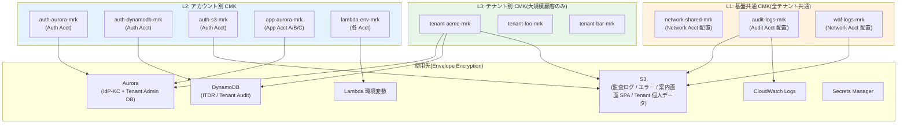
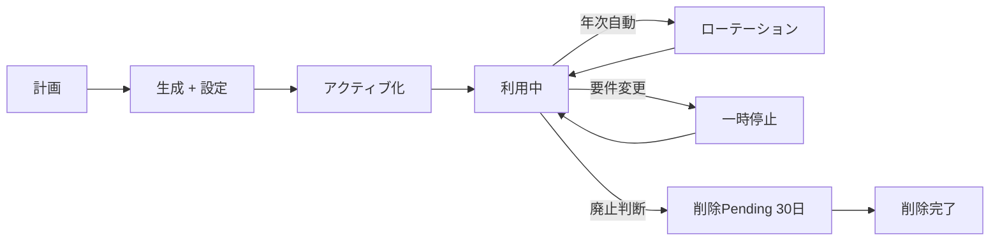
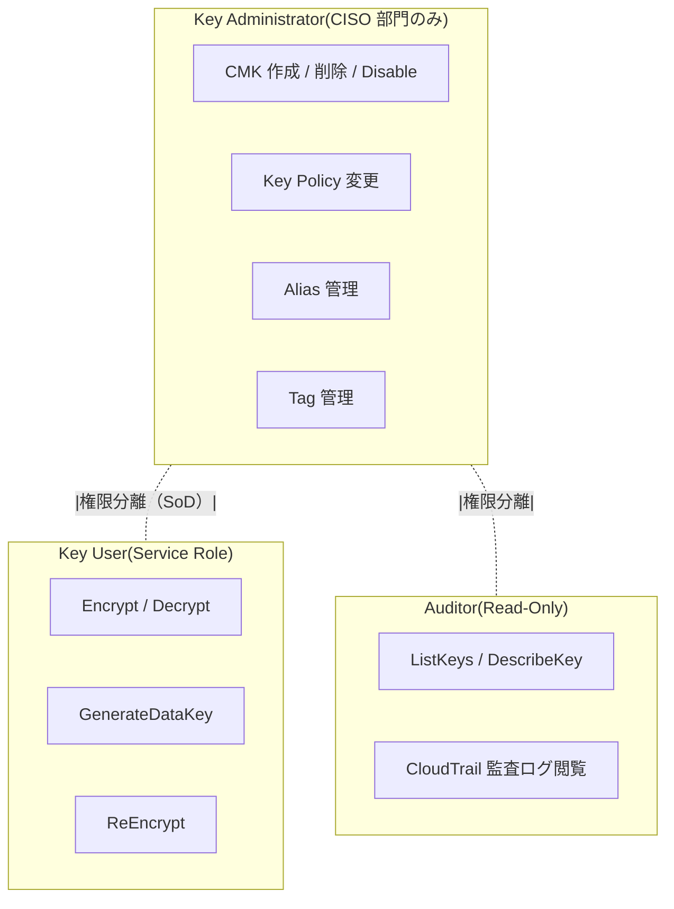

# ADR-045: 鍵管理戦略集約（KMS CMK 使い分け + 暗号化境界の統一）

- **ステータス**: Proposed（要件定義フェーズで Accepted に昇格予定）
- **日付**: 2026-06-23 作成、**2026-07-23 更新（基本設計 U7 反映: JWT 署名鍵 Realm Key 方式確定ほか — 下記注記参照）**
- **関連**:
  - [ADR-033 Keycloak 2-tier アーキテクチャ](033-keycloak-2tier-broker-idp-architecture.md)
  - [ADR-035 ITDR](035-identity-threat-detection-response.md)
  - [ADR-036 Customer Audit Support](036-customer-audit-support.md)
  - [ADR-039 中央集約 Network 専用アカウント](039-centralized-network-account-edge-layer.md)
  - [ADR-040 PAM / JIT 管理者権限管理](040-pam-jit-admin-privilege-management.md)
  - [ADR-041 Workload Identity](041-workload-identity-spiffe.md)
  - [§NFR-4.1 暗号化・鍵管理](../requirements/proposal/nfr/04-security.md)
  - [§NFR-7 コンプライアンス](../requirements/proposal/nfr/07-compliance.md)
  - **[ADR-060 認証プロトコル攻撃経路 残 TBD 対応 §C](060-auth-protocol-attack-path-residual-tbd.md)** — Golden SAML/JWT 検知時の緊急鍵ローテ SOP 追加要件（2026-07-08 追記）

> **2026-07-23 基本設計 U7 反映（[07-security-compliance-design.md](../basic-design/07-security-compliance-design.md)）**:
> 1. **JWT 署名鍵は Keycloak Realm Key 方式で確定**（Aurora 保管 + `broker-aurora-mrk` による at-rest 暗号化、90 日 Cryptoperiod + 30 日並走、[U7 D-U7-03](../basic-design/07-security-compliance-design.md)）。`alias/keycloak-jwt-signing` は予約のみ・Phase 1 未作成。KMS 署名 SPI は Phase 2 再評価（金融 / FAPI トリガー）。
> 2. Auth Platform Acct は Broker Acct / IdP-KC Acct に分割（6 アカウント体系）。alias 体系は U7 §7.1.1 の写像表が実装 SSOT。
> 3. Network Acct 系 alias（`network-shared` / `cloudfront-logs` / `waf-logs` / `lambda-edge-config`）は **P-18 により他組織管轄 → 弊社 alias 体系から削除し REQ（要求仕様）側で管理**。
> 4. Key Custodian「CISO 部門」は「Security Lead + Infra Lead（D-U7-02 の 2 名 SoD）」に読み替え。

---

## Context

### 背景

これまでの ADR で「KMS CMK で暗号化」「テナント別 CMK 推奨」等の言及が散在していたが、**全体的な鍵管理戦略**が一元的に定義されていなかった。具体的な欠落:

1. **KMS Key の階層モデル**（基盤共通 / テナント別 / 機能別の使い分け基準が不明確）
2. **鍵のローテーション戦略**（自動 vs 手動、頻度、Re-encrypt の必要性）
3. **鍵管理者の権限分離**（Key Administrator vs Key User、PCI DSS §3.6.1 / §3.7 要件）
4. **External Key Store (XKS)** の採用判断（HSM オンプレ統合の可否）
5. **クロスアカウント鍵共有**（ADR-039 Network Acct + ADR-036 Audit Acct での共有方式）
6. **暗号スイート選定**（TLS / JWT 署名 / DB 暗号化 / バックアップ暗号化）
7. **鍵廃棄プロセス**（Pending Window / 削除前検証 / 顧客通知）

### 規制要件の現状

| 規制 | 鍵管理に関する条項 |
|---|---|
| **PCI DSS v4.0 §3.6** | 暗号鍵の生成 / 配布 / 保管 / 破棄プロセス文書化 |
| **PCI DSS v4.0 §3.6.1.4** | 鍵管理者には専用個人アカウント、共有禁止 |
| **PCI DSS v4.0 §3.7** | Key Management Procedures（年次レビュー、責務分離）|
| **PCI DSS v4.0 §4.2.1.1** | TLS 1.2 以上、強力な暗号スイート |
| **APPI 第 23 条 技術的安全管理** | 個人データの暗号化、鍵管理 |
| **金融庁 監督指針**（規制業種顧客）| 鍵管理体制の独立性、HSM 利用推奨 |
| **NIST SP 800-57 Part 1 Rev 5**（2020）| 鍵ライフサイクル管理ベストプラクティス |
| **NIST SP 800-131A Rev 2** | 暗号アルゴリズム遷移ガイダンス（2023 改訂）|
| **FIPS 140-2 / 140-3** | 暗号モジュール認定、HSM 要件 |
| **CRYPTREC 暗号リスト**（2024 改訂）| 国内利用推奨暗号アルゴリズム |

### 既存 ADR / 設計での KMS 言及（散在状況）

| 出典 | KMS 用途 | 課題 |
|---|---|---|
| ADR-033 Keycloak 2-tier | Aurora（IdP-KC）暗号化 | テナント別 vs 共通 CMK の判断未定義 |
| ADR-035 ITDR | DynamoDB（履歴）暗号化 | デフォルト KMS or CMK 未定義 |
| ADR-036 Customer Audit | Trust Center / 監査ログ S3 暗号化 | 顧客テナント別 CMK の必要性 |
| ADR-038 ユーザ管理画面 | Tenant Audit Log 暗号化 | テナント別 CMK 推奨と書いたが詳細未定義 |
| ADR-039 Network Acct | CloudFront / WAF / Lambda@Edge | 配置 Acct での KMS 鍵共有 |
| ADR-040 PAM | Session Manager セッション記録 | S3 Object Lock + KMS、CMK 種別未定義 |
| ADR-041 Workload Identity | K8s Secret 暗号化、JWT 署名鍵 | Keycloak JWT 署名鍵 RS256/ES256 選定未定義 |

→ 本 ADR で**統一的な鍵管理戦略**を確定、各 ADR は本 ADR を参照する関係に整理。

### 業界用語の整理

| 用語 | 意味 |
|---|---|
| **CMK**（Customer Managed Key）| 顧客管理 KMS 鍵、ローテーション・ポリシー制御可能 |
| **AWS Managed Key**（旧 AWS Managed CMK）| AWS が管理、`aws/<service>` 形式、設定不可 |
| **AWS Owned Key** | AWS が完全所有、ARN なし、顧客から見えない |
| **Multi-Region Key**（MRK）| KMS Multi-Region 機能、リージョン間 Replica |
| **External Key Store (XKS)** | 外部 HSM をバックエンドにする KMS（2022 GA）|
| **CloudHSM** | 専用 HSM、FIPS 140-2 Level 3、$1,600+/月/HSM |
| **Envelope Encryption** | DEK を KMS で暗号化、データは DEK で暗号化 |
| **Key Spec** | SYMMETRIC_DEFAULT / RSA_2048 / RSA_4096 / ECC_NIST_P256 等 |
| **Key Rotation** | KMS 自動ローテーション（年次、AES-256-GCM）|
| **Re-encrypt** | データを新鍵で再暗号化（KMS 自動 Rotation では不要）|
| **Pending Window** | 鍵削除前の猶予期間（7-30 日）|
| **CRYPTREC** | 国内暗号技術評価委員会、推奨暗号リスト公開 |

---

## Decision

### 採用方針

**「3 階層 + 機能別」鍵管理モデル**を採用。基盤共通 / アカウント別 / テナント別の 3 階層 × 用途別の Multi-Region CMK で全暗号化を統一管理。CloudHSM は規制業種顧客が要求した場合の Phase 2 オプション。

| 階層 | スコープ | 数 | 使用先 |
|---|---|---|---|
| **L1 基盤共通 CMK** | 全テナント共通 | 〜10 個 | Network 層 / Audit Acct 集約ログ / WAF Logs |
| **L2 アカウント別 CMK** | AWS アカウント単位 | 各 Acct 5-10 個 | Aurora（共通）/ DynamoDB（共通）/ S3（共通）/ Lambda 環境変数 |
| **L3 テナント別 CMK** | 顧客テナント単位 | テナント数分（〜数百〜数千）| ユーザ管理画面 Audit / 個人データ S3 / IdP-KC 顧客領域 |

### 主要判断

| 判断ポイント | 採用 | 理由 |
|---|---|---|
| **CMK 種別** | **Multi-Region CMK**（MRK、共通基盤）+ Regional CMK（Single-Region 機能）| DR 対応 + コスト最適化 |
| **テナント別 CMK** | **大規模顧客のみ**（B-KMS-3 で確認）、Phase 1 は L2 共通 CMK | 数千テナント × CMK $1/月 = $1K-3K/月の追加コスト |
| **CloudHSM 採用** | **Phase 1 不採用、Phase 2 規制業種顧客要求時** | HSM/月 $1,600+ で高額、KMS の FIPS 140-2 Level 2 で大半カバー |
| **External Key Store** | **不採用**（XKS は顧客 HSM 持込前提、本基盤想定外）| 運用負荷大 |
| **JWT 署名鍵** | **ES256（ECC_NIST_P256）**、Keycloak が KMS から取得 | RS256 比でトークンサイズ小、性能高、業界トレンド |
| **TLS 暗号スイート** | TLS 1.3 必須 + TLS 1.2 一部許可（強力スイートのみ）| ACM + ALB 設定で統一 |
| **鍵ローテーション** | **年次自動**（KMS 標準）+ 個別手動ローテーション体制 | PCI DSS §3.7.4 充足 |
| **権限分離** | **Key Administrator** = CISO 部門のみ、**Key User** = サービス Role | PCI DSS §3.6.1.4 充足 |
| **鍵削除** | **Pending Window 30 日**（最大値）+ 削除前顧客通知 | 誤削除リスク最小化 |

---

## A. 3 階層鍵モデルの詳細

### A.1 全体図



### A.2 L1 基盤共通 CMK（〜10 個）

| Key Alias | 配置 Acct | 用途 | Multi-Region |
|---|---|---|---|
| `alias/network-shared` | 🟣 Network | CloudFront ログ / WAF ログ復号化 | ✅ |
| `alias/audit-logs` | 🔵 Audit | 全 Acct 監査ログ S3 暗号化 | ✅ |
| `alias/cloudtrail-org` | 🔵 Audit | CloudTrail Organization Trail | ✅ |
| `alias/sns-cross-acct` | 🟠 Auth | クロス Acct 通知（PagerDuty / Slack）| ❌ Regional |
| `alias/break-glass-vault` | 🟠 Auth | Break-Glass パスワード保管 Secrets | ❌ Regional |
| `alias/dr-replication` | 全 Acct | DR 用 Aurora / S3 リプリケーション | ✅ |

### A.3 L2 アカウント別 CMK（各 Acct 5-10 個）

#### Auth Platform Acct

| Key Alias | 用途 | Key Spec |
|---|---|---|
| `alias/auth-aurora` | IdP-KC Aurora 暗号化 | SYMMETRIC_DEFAULT |
| `alias/broker-aurora` | Broker Keycloak Aurora | SYMMETRIC_DEFAULT |
| `alias/auth-dynamodb` | ITDR / Adaptive Auth 履歴 | SYMMETRIC_DEFAULT |
| `alias/auth-s3` | SPA bundle / 共通 S3 | SYMMETRIC_DEFAULT |
| `alias/auth-secrets` | Secrets Manager（共通）| SYMMETRIC_DEFAULT |
| `alias/auth-lambda-env` | Lambda 環境変数 | SYMMETRIC_DEFAULT |
| `alias/keycloak-jwt-signing` | **JWT 署名鍵**（Keycloak Realm 鍵）（2026-07-23 改訂: Realm Key 方式に変更、本 alias は予約のみ・Phase 1 未作成 — 冒頭注記参照）| **ECC_NIST_P256（ES256）** |
| `alias/keycloak-jwt-encryption` | JWT 暗号化（必要時）| RSA_2048 |
| `alias/scim-tokens` | SCIM Bearer Token 暗号化 | SYMMETRIC_DEFAULT |

#### App Acct（各 App Acct で共通）

| Key Alias | 用途 |
|---|---|
| `alias/app-aurora` | App DB |
| `alias/app-dynamodb` | App DynamoDB |
| `alias/app-s3` | App S3 |
| `alias/app-lambda-env` | Lambda 環境変数 |
| `alias/app-secrets` | Secrets Manager |

#### Network Acct

| Key Alias | 用途 |
|---|---|
| `alias/cloudfront-logs` | CloudFront アクセスログ |
| `alias/waf-logs` | WAF ログ |
| `alias/lambda-edge-config` | Lambda@Edge 設定 |

#### Audit Acct

| Key Alias | 用途 |
|---|---|
| `alias/audit-s3-archive` | 監査ログ S3（Object Lock + 7 年）|
| `alias/audit-opensearch` | OpenSearch クラスタ |
| `alias/audit-glacier` | Glacier 長期保管 |

### A.4 L3 テナント別 CMK（大規模顧客のみ）

| 採用条件 | 内容 |
|---|---|
| **対象顧客** | 規制業種（金融 / 医療 / 自治体）+ 大企業（MAU 100K+）|
| **キー数** | 顧客 1 社あたり 3-5 個（Aurora / DynamoDB / S3 別）|
| **配置** | Auth Platform Acct（顧客が AWS 持込の場合は顧客 Acct）|
| **コスト** | $1/月/CMK + リクエスト $0.03/10K |
| **顧客提供 CMK**（BYOK） | KMS Import Key Material 機能で対応可能 |
| **削除請求** | 顧客が CMK を削除 → 該当データ復号不能化 = 論理削除（GDPR Art.17 対応の一手段）|

---

## B. 暗号化境界 — 全データ分類別の鍵割当

### B.1 データ分類マトリクス

| データ種別 | 機密度 | 配置 | 暗号化 | 鍵 |
|---|---|---|---|---|
| **JWT 署名鍵**（private）| 最高 | KMS のみ（取り出し不可）（2026-07-23 改訂: Realm Key 方式に変更 — 冒頭注記参照。Aurora 保管 + `broker-aurora-mrk` at-rest 暗号化）| KMS 内部 | `keycloak-jwt-signing` |
| **JWT トークン**（発行後）| 高 | クライアント側 | 不要（署名のみ）| — |
| **ユーザーパスワードハッシュ** | 高 | Aurora | TDE + at-rest | `auth-aurora` |
| **個人情報（メール等）** | 高 | Aurora | TDE + at-rest | `auth-aurora` or `tenant-X` |
| **PII を含むテナント設定** | 高 | Aurora | TDE + at-rest | `tenant-X` |
| **MFA Secret（TOTP）** | 最高 | Aurora（暗号化列）| Application-level + at-rest | `auth-aurora` |
| **WebAuthn Credentials** | 最高 | Aurora | TDE + at-rest | `auth-aurora` |
| **SCIM Bearer Token** | 高 | Secrets Manager | KMS | `scim-tokens` |
| **ITDR 履歴**（IP / Device）| 中 | DynamoDB | KMS | `auth-dynamodb` or `tenant-X` |
| **Adaptive Auth Score 履歴** | 中 | DynamoDB | KMS | `auth-dynamodb` |
| **監査ログ**（CloudTrail / Keycloak Events）| 高 | S3 Object Lock + CloudWatch | KMS | `audit-logs` |
| **Session Manager 録画**（ADR-040）| 最高 | S3 Object Lock | KMS | `audit-logs` |
| **Break-Glass パスワード** | 最高 | Secrets Manager + 物理金庫 | KMS + 物理 | `break-glass-vault` |
| **CloudFront / WAF ログ** | 中 | S3 | KMS | `network-shared` or `waf-logs` |
| **ユーザ管理画面 Audit** | 高 | DynamoDB | KMS | `tenant-X` or `auth-dynamodb` |

### B.2 アプリケーション層暗号化（追加レイヤ）

KMS による at-rest 暗号化に加え、**特定の高機密フィールド**は**アプリケーション層**で追加暗号化:

| フィールド | 理由 | 実装 |
|---|---|---|
| MFA Secret（TOTP）| Keycloak DB ダンプ盗難時の追加防御 | AES-256-GCM、DEK は KMS Envelope |
| WebAuthn Credentials | 同上 | 同上 |
| Backup Code | 同上 | 同上 |

---

## C. 暗号アルゴリズム選定

### C.1 採用アルゴリズム

| 用途 | アルゴリズム | 根拠 |
|---|---|---|
| **JWT 署名** | **ES256（ECDSA P-256 + SHA-256）** | サイズ小、性能高、業界トレンド（OIDC 推奨）|
| JWT 暗号化（JWE、必要時）| RSA-OAEP-256 + A256GCM | NIST SP 800-56B |
| TLS | TLS 1.3 必須、TLS 1.2 強力スイートのみ | PCI DSS §4.2.1.1 |
| 対称暗号（at-rest）| AES-256-GCM | KMS デフォルト、NIST SP 800-38D |
| パスワードハッシュ | Argon2id（推奨）or bcrypt（cost 12+）| Keycloak デフォルト、OWASP 推奨 |
| HMAC | HMAC-SHA-256 | 標準 |
| ハッシュ | SHA-256（汎用）、SHA-512（特殊用途） | NIST SP 800-131A |

### C.2 廃止 / 禁止アルゴリズム

| 廃止対象 | 理由 |
|---|---|
| TLS 1.0 / 1.1 | PCI DSS 2018-2020 廃止 |
| MD5 / SHA-1 | 衝突攻撃あり |
| RC4 / 3DES | 脆弱 |
| RSA < 2048 bit | 強度不足 |
| ECC < P-256 | 強度不足 |
| HS256（JWT 共通鍵）| 鍵共有時の漏洩リスク、本基盤は非対称必須 |

### C.3 CRYPTREC 整合

| CRYPTREC 推奨 2024 | 本基盤採用 |
|---|---|
| AES-128/192/256 | AES-256 ✅ |
| Triple DES | ❌ 採用しない |
| ECDSA over P-256 / P-384 | ES256 / ES384 ✅ |
| RSA-OAEP, RSA-PSS | RSA-OAEP-256 / RSA-PSS ✅ |
| SHA-256 / SHA-384 / SHA-512 | SHA-256 ✅ |
| HMAC | HMAC-SHA-256 ✅ |

---

## D. 鍵ライフサイクル管理

### D.1 ライフサイクルステージ



### D.2 各ステージの責務

| ステージ | 責務担当 | アクション |
|---|---|---|
| Plan | CISO + Architecture | 用途定義、Key Spec 選定 |
| Create | Key Administrator | Terraform PR + CISO Review |
| Activate | Key Administrator | Alias 設定、IAM 権限付与 |
| Use | Key User（Service Role）| 自動利用（Application 経由）|
| Rotate | KMS（自動）| 年次 + Re-encrypt 不要 |
| Suspend | Key Administrator | 一時的に Disable（インシデント時）|
| Delete | Key Administrator + CISO 承認 | Pending Window 30 日 + 顧客通知 |

### D.3 ローテーション戦略

| 鍵種別 | ローテーション | 詳細 |
|---|---|---|
| KMS Symmetric CMK | **年次自動**（KMS 機能）| Re-encrypt 不要、旧鍵は復号化のみで保持 |
| **KMS Asymmetric CMK（JWT 署名鍵、ES256）**（2026-07-23 改訂: Realm Key 方式に変更 — 冒頭注記参照）| **手動、90 日 Cryptoperiod**（**2026-07-15 短縮**）| Keycloak の Rotation 機能で旧鍵を 30 日並走、詳細は §D.4 参照 |
| アプリケーション層 DEK | 90 日 | Envelope Encryption、KMS で DEK 暗号化 |
| TLS 証明書（ACM）| 自動 | Public 証明書は自動更新 |
| API キー / Bearer Token | 90 日（強制）| ユーザ管理画面 で警告 |

### D.4 JWT 署名鍵の Cryptoperiod（2026-07-15 追記）

#### 決定: 90 日 Cryptoperiod（旧「手動年次」から短縮）

**背景**:

- 前版では「手動年次 + 30 日並走」だったが、[reference/pci-dss-v401-scope-for-auth-platform.md §6.4](../reference/pci-dss-v401-scope-for-auth-platform.md#64-req-3鍵管理--重要な解釈) の分析で JWT 署名鍵の Cryptoperiod 明文化推奨
- 業界事例（Auth0 / Okta）も **90 日周期**が標準
- Golden JWT 攻撃検知時の緊急ローテ SOP（ADR-060 §C）と整合

#### JWT 署名鍵 Cryptoperiod 詳細

| 項目 | 内容 |
|---|---|
| **Cryptoperiod** | **90 日**（新鍵発行、旧鍵は verification のみで 30 日並走）|
| **アルゴリズム** | ES256（ECC_NIST_P256）|
| **鍵管理** | KMS Asymmetric CMK `alias/keycloak-jwt-signing`（2026-07-23 改訂: Realm Key 方式に変更 — 冒頭注記参照）|
| **Rotation 実行** | Keycloak Admin API（`POST /realms/{realm}/keys/rotate`）+ CronJob 自動化 |
| **並走期間** | 30 日（旧鍵は verify のみ、sign は新鍵のみ）|
| **緊急ローテ** | Golden JWT 検知時（ADR-060 §C）は即時実行、並走なし |

#### PCI DSS v4.0.1 との位置付け

**重要な解釈**（[reference/pci-dss-v401-scope-for-auth-platform.md §6.4](../reference/pci-dss-v401-scope-for-auth-platform.md#64-req-3鍵管理--重要な解釈) より）:

> Req 3 is scoped to keys used to protect **stored account data (PAN)**. JWT signing keys fall outside Req 3 unless JWT carries PAN.

- **本基盤 ES256 JWT 署名鍵は Req 3.6/3.7 の literal mandate 対象外の可能性大**（JWT に PAN 含まないため）
- ただし **"顧客 CDE のセキュリティに影響する鍵" として同等管理が実務上必要**
- **QSA 事前確認推奨**（analyst interpretation として明示）
- 90 日 Cryptoperiod は Req 3.7.4 相当の運用として、QSA 対応時に説明可能

#### Key Custodian Agreement（追記）

**Custodian**（鍵管理責任者）に対する要件（PCI DSS Req 3.6.1.4 / 3.7.9 相当）:

| 項目 | 内容 |
|---|---|
| **人数** | 最低 2 名（Split Knowledge、Dual Control 準備）|
| **職務分掌**（SoD）| Key Administrator（作成 / 削除 / Policy 変更）と Key User（Encrypt / Decrypt 実行）を別人物に |
| **書面同意** | **Key Custodian Agreement 書面**を締結（Key の機密性 / 責任 / 通知義務を明記）|
| **アクセス記録** | KMS への全 API 呼出を CloudTrail + Audit Acct S3（Object Lock 7 年）に記録 |
| **年次レビュー** | 半期に一度、Key User リスト + 権限レビュー |
| **離職時** | Custodian 離職時は Key Policy から即時削除 + 監査記録 |

Key Custodian Agreement テンプレートは Phase 1 内で法務レビュー + 社内 SOP として整備。

#### 90 日 Cryptoperiod 変更の運用インパクト

| 項目 | 前版（年次）| 新版（90 日）|
|---|---|---|
| Rotation 頻度 | 年 1 回 | 年 4 回 |
| 手動作業時間 | 1-2 時間/年 | 15-30 分 × 4 回/年 = 1-2 時間/年（自動化前提）|
| 並走期間の複雑性 | 30 日 x 1 回/年 | 30 日 x 4 回/年（同時複数鍵は最大 2 世代）|
| Golden JWT 攻撃時の被害範囲縮小 | 最大 1 年 | **最大 90 日**（1/4）|
| PCI DSS QSA 対応時の説明容易性 | △ | **✅ 90 日は業界標準として説明容易** |
| Auth0 / Okta との整合性 | △ | **✅ 一致** |

### D.4 削除プロセス

| ステップ | 内容 |
|---|---|
| 1. 削除提案 | Architecture → CISO Review |
| 2. 影響分析 | 該当 CMK を使用中の全リソース列挙、データ復号不能化リスク確認 |
| 3. 顧客通知 | L3 テナント CMK 削除時は対象顧客に 30 日前通知 |
| 4. Pending 開始 | KMS Schedule Deletion（Pending Window 30 日）|
| 5. 検証期間 | 30 日間は Cancel 可能、CloudWatch アラート設定 |
| 6. 削除完了 | 30 日後自動削除 |
| 7. 監査記録 | Audit Acct に削除記録、AAR 作成 |

---

## E. 鍵管理者の権限分離（PCI DSS §3.6.1.4 / §3.7）

### E.1 ロール分離



### E.2 IAM ポリシー例

```hcl
# Key Administrator（CISO 部門のみ）
resource "aws_iam_policy" "key_administrator" {
  policy = jsonencode({
    Statement = [{
      Effect = "Allow"
      Action = [
        "kms:CreateKey", "kms:ScheduleKeyDeletion", "kms:DisableKey",
        "kms:PutKeyPolicy", "kms:CreateAlias", "kms:DeleteAlias",
        "kms:TagResource", "kms:UntagResource"
      ]
      Resource = "*"
      Condition = {
        # SoD: 鍵を使用する権限は持たない
        "Bool" = { "aws:MultiFactorAuthPresent" = "true" }
      }
    }]
  })
}

# Key User（Service Role に付与）
resource "aws_iam_policy" "key_user" {
  policy = jsonencode({
    Statement = [{
      Effect = "Allow"
      Action = [
        "kms:Encrypt", "kms:Decrypt", "kms:ReEncrypt*",
        "kms:GenerateDataKey*", "kms:DescribeKey"
      ]
      Resource = [
        # 該当 Service Role が使う特定の CMK のみ
        "arn:aws:kms:*:*:key/abcd1234-..."
      ]
    }]
  })
}
```

### E.3 PCI DSS §3.7 充足項目

| 要件 | 充足方法 |
|---|---|
| §3.7.1 鍵管理手順文書化 | 本 ADR + Runbook |
| §3.7.2 鍵生成手順 | Terraform PR + Key Admin 承認 |
| §3.7.3 鍵配布手順 | KMS Native（手動配布なし）|
| §3.7.4 鍵保管手順 | KMS HSM（FIPS 140-2 Level 2）|
| §3.7.5 鍵変更 / 暗号期間 | 年次自動ローテーション |
| §3.7.6 鍵破棄手順 | Pending Window 30 日 + Audit |
| §3.7.7 鍵管理者の SoD | Administrator vs User 分離 |
| §3.7.8 鍵管理者の責任明確化 | 本 ADR §E.1 |
| §3.7.9 暗号鍵管理ポリシーの年次レビュー | CISO 年次レビュー |

---

## F. クロスアカウント鍵共有

### F.1 共有が必要なケース

| ケース | 鍵 | 共有方式 |
|---|---|---|
| Audit Acct が他 Acct のログを暗号化保管 | `audit-logs`（Audit Acct 配置）| Audit Acct で Key Policy で他 Acct Principal 許可 |
| Network Acct が CloudFront ログを S3（Audit Acct）に出力 | `audit-logs` | 同上 |
| Lambda@Edge が Network Acct で実行、Auth Acct の Secrets を取得 | `auth-secrets` | Auth Acct で Lambda@Edge IAM Role に Decrypt 許可 |
| DR Replication（Aurora Cross-Region）| MRK | Multi-Region Key で同一 Key ID 利用 |

### F.2 Key Policy 例

```json
{
  "Version": "2012-10-17",
  "Id": "audit-logs-cross-acct",
  "Statement": [
    {
      "Sid": "AllowAuditAdminFullAccess",
      "Effect": "Allow",
      "Principal": { "AWS": "arn:aws:iam::AUDIT_ACCT:role/key-administrator" },
      "Action": "kms:*",
      "Resource": "*"
    },
    {
      "Sid": "AllowOtherAcctsToWriteLogs",
      "Effect": "Allow",
      "Principal": {
        "AWS": [
          "arn:aws:iam::NETWORK_ACCT:role/cloudfront-logs",
          "arn:aws:iam::AUTH_ACCT:role/cloudwatch-logs",
          "arn:aws:iam::APP_ACCT_A:role/cloudwatch-logs"
        ]
      },
      "Action": [
        "kms:Encrypt", "kms:GenerateDataKey*", "kms:Decrypt", "kms:DescribeKey"
      ],
      "Resource": "*"
    }
  ]
}
```

---

## G. 監査・モニタリング

### G.1 CloudTrail 監視対象イベント

| イベント | アラート優先度 |
|---|---|
| `CreateKey` | Low（通常運用）|
| `ScheduleKeyDeletion` | **High**（即時通知）|
| `DisableKey` | **High** |
| `PutKeyPolicy` | **High** |
| `CancelKeyDeletion` | Medium |
| `RotateKeyOnDemand`（手動 Rotation）| Medium |
| `Decrypt` の異常頻度 | Medium（DDoS 兆候）|
| 削除済み Key への Decrypt 試行 | **High**（攻撃兆候 or 設計ミス）|

### G.2 KMS Metric

| Metric | 閾値 |
|---|---|
| `NumberOfRequestsByKey` | 通常 ±50% 超過でアラート |
| `KeyMaterialThrottled` | 1 件でもアラート（KMS RPS 上限超過）|
| `Pending Deletion Keys` | 1 件以上で日次レポート |

### G.3 Trust Center 公開（ADR-036 連動）

| 公開項目 | 範囲 |
|---|---|
| 暗号化ポリシー | 公開部 |
| 採用アルゴリズム一覧 | 公開部 |
| CMK 階層モデル概要 | 公開部 |
| FIPS 140-2 Level 2（KMS）/ Level 3（CloudHSM、Phase 2）認定証 | 公開部（リンク）|
| 鍵管理者数 / SoD 体制 | Customer Portal（NDA）|
| 鍵削除ログサマリ | Customer Portal（NDA）|

---

## H. CloudHSM 採用判断（Phase 2 候補）

### H.1 Phase 1 不採用の理由

| 理由 | 詳細 |
|---|---|
| **コスト** | HSM 1 台 $1,600/月、HA 構成で 2 台 $3,200/月 |
| **KMS で大半カバー** | KMS は FIPS 140-2 **Level 2** 認定済、APPI / SOC 2 / PCI DSS §3 充足 |
| **運用負荷** | HSM Cluster 管理、CRL / OCSP 等の運用 |
| **業界トレンド** | 多くの SaaS は KMS のみで運用、CloudHSM は規制業種が要求した時のみ |

### H.2 Phase 2 採用条件

| 条件 | 採用 CloudHSM スコープ |
|---|---|
| 金融顧客が FIPS 140-2 **Level 3** 要求 | カード会員データ系のみ |
| 政府系顧客が CC EAL4+ 要求 | 該当データのみ |
| 顧客が自社 HSM を持込希望（XKS）| 当該顧客のみ |

### H.3 採用時のアーキテクチャ

```
顧客高機密データ → アプリ → KMS XKS Proxy → CloudHSM Cluster
                                            ↘ Multi-AZ + HA
```

---

## I. コスト試算

### I.1 月額試算（10M MAU）

| 項目 | 月額 |
|---|---|
| KMS CMK（L1 + L2 + L3 大規模顧客 50 社）= 〜250 個 × $1 | $250 |
| KMS リクエスト（年 100 億回想定 = 月 8.3 億回 × $0.03/10K）| $2,500 |
| 自動ローテーション（年 1 回、追加 free）| $0 |
| KMS 監視（CloudWatch）| $50 |
| **合計** | **〜$2,800/月（年 〜$34K）** |
| Phase 2 CloudHSM（規制業種 1 顧客分、HA 2 台）| +$3,200/月 |

### I.2 比較

| 案 | 年額 |
|---|---|
| **本 ADR（KMS のみ）** | **〜$34K** |
| CloudHSM 全面採用 | $200K+ |
| HashiCorp Vault on EKS | $50K（運用負荷大）|

---

## J. 代替案検討

| 案 | 評価 | 採否 |
|---|---|---|
| **A. AWS Managed Key のみ** | 設定不可、PCI DSS §3.6 充足困難 | ❌ |
| **B. 単一 CMK で全暗号化** | SoD 不可、ブラスト半径大 | ❌ |
| **C. 3 階層 CMK + 機能別**（本 ADR）| 業界標準、PCI DSS 充足 | ✅ 採用 |
| **D. 全テナント L3 CMK 強制** | $1K-3K/月 追加、過剰 | △ Phase 2 |
| **E. CloudHSM 全面採用** | $200K+/年、過剰 | ❌ Phase 2 規制業種のみ |
| **F. HashiCorp Vault 自社運用** | Vault 運用負荷大 | ❌ |
| **G. External Key Store** | 顧客 HSM 持込前提、本基盤想定外 | ❌ |

---

## Consequences

### Positive

- **PCI DSS §3.6 / §3.7 / §4.2 を 1 つの設計で同時充足**
- **既存散在の KMS 言及を統一**、各 ADR は本 ADR 参照に集約
- **3 階層モデル**でブラスト半径制御 + コスト最適化
- **JWT 署名 ES256 採用**で性能向上 + トークンサイズ削減
- **大規模顧客 L3 CMK**で顧客 GDPR Art.17 削除請求対応
- KMS Native ローテーション + 監査で運用負荷最小化

### Negative

- **テナント数増による L3 CMK コスト増**（テナント数 × $1/月）
- **Key Administrator の責務集中**（CISO 部門の運用負荷）
- **Cross-Account Key Policy の設計複雑化**
- **アプリケーション層暗号化**（MFA Secret 等）の追加実装

### Neutral

- CloudHSM は Phase 2 オプション、Phase 1 は KMS のみ
- 既存 ADR-033 / 035 / 036 / 038 / 040 / 041 は本 ADR を参照する形で軽量更新

### 我々のスタンス

| 基本方針の柱 | 鍵管理戦略での実現 |
|---|---|
| **絶対安全** | KMS FIPS 140-2 Level 2 + アプリ層追加暗号化 + Cross-Acct 分離 |
| **どんなアプリでも** | L2 共通 CMK で大半のアプリは透明、L3 オプション |
| **効率よく認証** | JWT 署名 ES256 で性能向上、KMS 自動ローテーション |
| **運用負荷・コスト最小** | CloudHSM 不要（年 $200K 節約）、KMS Native 機能で運用最小化 |

---

## 参考資料

- [NIST SP 800-57 Part 1 Rev 5 — Recommendation for Key Management](https://csrc.nist.gov/publications/detail/sp/800-57-part-1/rev-5/final)
- [NIST SP 800-131A Rev 2 — Transitioning the Use of Cryptographic Algorithms](https://csrc.nist.gov/publications/detail/sp/800-131a/rev-2/final)
- [CRYPTREC 暗号リスト 2024](https://www.cryptrec.go.jp/list.html)
- [PCI DSS v4.0 §3 / §4 公式](https://www.pcisecuritystandards.org/document_library/)
- [AWS KMS Best Practices](https://docs.aws.amazon.com/kms/latest/developerguide/best-practices.html)
- [AWS KMS FIPS 140-2 Compliance](https://aws.amazon.com/compliance/fips/)
- [AWS KMS Multi-Region Keys](https://docs.aws.amazon.com/kms/latest/developerguide/multi-region-keys-overview.html)
- [AWS External Key Store (XKS)](https://docs.aws.amazon.com/kms/latest/developerguide/keystore-external.html)
- [AWS CloudHSM Cluster](https://docs.aws.amazon.com/cloudhsm/latest/userguide/cluster-management.html)
- [Keycloak Realm Keys](https://www.keycloak.org/docs/latest/server_admin/#realm_keys)
- [OWASP Cryptographic Storage Cheat Sheet](https://cheatsheetseries.owasp.org/cheatsheets/Cryptographic_Storage_Cheat_Sheet.html)
