# ADR-046: ソフトウェアサプライチェーンセキュリティ（SBOM + SLSA + 依存スキャン + PCI DSS §6.4.3）

- **ステータス**: **Proposed（暫定維持、変更可能性あり）**
- **日付**: 2026-06-23 作成、2026-06-24 暫定維持確認

---

> **⚠ 2026-06-24 スコープ注記**
>
> ユーザー確認：「**CI/CD は基盤検討範囲として一旦維持、変わるかもしれない**」。本 ADR の Supply Chain Security 設計（6 層 Defense + SBOM + SLSA + Cosign 等）は**現時点で本基盤対象として暫定維持**するが、以下の理由で**設計フェーズ以降で再評価**の可能性が高い:
>
> - 「CI/CD / 開発プラクティス」は**会社全体の開発組織ポリシー**で別途定義される性質のもので、認証基盤プロダクトの ADR スコープを超える可能性がある
> - SBOM / SLSA / Cosign 等の本格採用は**開発組織全体での合意・運用体制構築**が前提
> - PCI DSS v4.0 §6.4.3 第三者スクリプト管理など**認証基盤に直接該当する部分のみ**は最低限実装、それ以外は組織ポリシー次第
>
> **推奨アクション**：
> - **Phase 1（最低限）**：認証基盤関連の依存スキャン（Trivy）+ コンテナ署名 + PCI DSS §6.4.3（CSP + SRI）のみ実装
> - **Phase 2 以降**：開発組織全体の Supply Chain ポリシー策定後に SBOM / SLSA / Cosign 等を追加
>
> 関連：[ADR-044 Tabletop Exercise](044-tabletop-exercise-incident-drill.md) や [ADR-049 Vendor Risk](049-vendor-risk-management-tprm.md) も同様に「過剰検討では」とユーザー指摘あり。設計フェーズで再評価候補。

---

- **関連**:
  - [ADR-040 PAM / JIT 管理者権限管理](040-pam-jit-admin-privilege-management.md)
  - [ADR-041 Workload Identity](041-workload-identity-spiffe.md)
  - [ADR-042 Bot Detection / CAPTCHA](042-bot-detection-captcha.md)
  - [ADR-044 Tabletop Exercise](044-tabletop-exercise-incident-drill.md)
  - [ADR-045 鍵管理戦略集約](045-cryptographic-key-management-strategy.md)
  - [§NFR-4 セキュリティ](../requirements/proposal/nfr/04-security.md)
  - [§NFR-6 運用](../requirements/proposal/nfr/06-operations.md)

---

## Context

### 背景

近年、**ソフトウェアサプライチェーン攻撃**が認証基盤・SaaS への主要脅威として急増。本基盤は OSS（Keycloak / Phase Two plugin / SCIM Server / Lambda 関数 / Container Image）を多用しており、サプライチェーン汚染は**全顧客に同時影響**する致命的事象となる。これまで暗黙的に「Container Image スキャン / 依存ライブラリ更新」を行う前提だったが、**体系的な対策**が未定義だった。

### 業界の主要事案（教訓）

| 事案 | 影響 | 教訓 |
|---|---|---|
| **SolarWinds**（2020）| 18,000+ 組織 | ビルドパイプライン侵害、署名付きでも安全ではない |
| **log4shell**（2021/12 CVE-2021-44228）| 依存ライブラリ経由で世界中影響 | **依存の依存（推移的依存）**まで把握必要、SBOM 必須化 |
| **xz-utils backdoor**（2024/3 CVE-2024-3094）| Long Game 攻撃、SSH 侵害可能性 | メンテナの社会的信頼も検証対象、Reproducible Build |
| **PyPI / npm 大量タイポスクワッティング**（継続中）| ビルド時に悪意あるパッケージ取得 | パッケージマネージャの信頼境界確立 |
| **GitHub Actions Workflow 改ざん**（2025）| CI 経由で Production シークレット漏洩 | OIDC Federation + 最小権限必須 |
| **Salesloft Drift breach**（2025）| 顧客チャットボット経由で 100+ 企業の Salesforce 侵害 | SaaS-to-SaaS 連携の信頼境界 |

### 規制要件 / 業界ガイドライン

| 規制 | 関連条項 |
|---|---|
| **PCI DSS v4.0 §6.4.3**（2025/3 強制適用）| パブリック向けページの**第三者スクリプト管理**（CSP / SRI / インベントリ）|
| **PCI DSS v4.0 §6.3.2** | 自社開発ソフトウェアの脆弱性管理 |
| **EO 14028 / NIST SSDF**（2022 米国）| SBOM 提出義務、Federal 調達基準 |
| **EU Cyber Resilience Act (CRA)**（2027/12 完全施行）| 製品提供者の SBOM + 脆弱性開示義務 |
| **OpenSSF SLSA v1.0**（2023）| Supply-chain Levels for Software Artifacts |
| **NIST SP 800-218 SSDF**（Secure Software Development Framework）| 安全な開発フレームワーク |
| **NIST SP 800-204D**（2024）| Software Supply Chain Security in Microservices |
| **CISA Secure by Design**（2023〜）| ベンダー責任、デフォルト Secure |

### 業界用語の整理

| 用語 | 意味 |
|---|---|
| **SBOM**（Software Bill of Materials）| ソフトウェア構成部品表、SPDX / CycloneDX 形式 |
| **SLSA**（Supply-chain Levels for Software Artifacts）| OpenSSF の成熟度モデル、L0-L3 |
| **Sigstore / Cosign** | コンテナ署名、Transparency Log（Rekor）|
| **in-toto** | サプライチェーン全段階の証明書連鎖 |
| **SRI**（Subresource Integrity）| ブラウザ側でスクリプトハッシュ検証 |
| **CSP**（Content Security Policy）| ブラウザ側 XSS / 第三者スクリプト制御 |
| **Reproducible Build** | 同じソースから同じバイナリを生成可能 |
| **Trivy / Grype / Snyk** | コンテナ・依存スキャナ |
| **Dependabot / Renovate** | 依存自動更新ツール |
| **OSV / NVD / GHSA** | 脆弱性データベース |
| **OIDC Federation for CI** | GitHub Actions → AWS の Secret レスアクセス |
| **Provenance** | アーティファクトの由来証明 |

---

## Decision

### 採用方針

**「6 層 Supply Chain Defense」**を採用。ソースコード / 依存ライブラリ / コンテナ / ビルドパイプライン / 配布 / ランタイムの各段階に対策を配置。SLSA Level 3 を 12 ヶ月以内に達成目標。

| 層 | 対策 | ツール |
|---|---|---|
| **L1 ソースコード** | コミット署名 + ブランチ保護 + Secret スキャン | Sigstore Gitsign / GitHub Branch Protection / GitGuardian |
| **L2 依存ライブラリ** | SBOM 自動生成 + 脆弱性スキャン + 自動更新 | CycloneDX / Trivy / Renovate |
| **L3 コンテナ** | Base Image 固定 + Image スキャン + 署名 | Amazon ECR + Trivy + Cosign |
| **L4 ビルドパイプライン** | OIDC Federation + Provenance 生成 + in-toto | GitHub OIDC + AWS IRSA + SLSA GitHub Generator |
| **L5 配布** | Image 署名検証 + Provenance 検証 | Cosign verify in Kyverno / OPA |
| **L6 ランタイム** | Runtime SBOM 監視 + 新脆弱性自動アラート | AWS Inspector + Trivy Operator |

### 主要判断

| 判断ポイント | 採用 | 理由 |
|---|---|---|
| **SBOM 形式** | **CycloneDX**（プライマリ）+ SPDX（互換性必要時生成） | CycloneDX は脆弱性情報統合に強い、業界トレンド |
| **コンテナ署名** | **Sigstore Cosign + Rekor Transparency Log** | OSS 標準、AWS との統合容易 |
| **SLSA 目標** | **L3 を 12 ヶ月以内**（Phase 1 は L2、Phase 2 で L3）| L4 は Reproducible Build 必要、過剰 |
| **依存自動更新ツール** | **Renovate**（Dependabot より柔軟）| グループ更新、Lock ファイル対応充実 |
| **CI/CD プラットフォーム** | **GitHub Actions + OIDC Federation**（IRSA）| Long-lived AWS Key 廃止、PCI DSS §8.6.2 |
| **脆弱性スキャナ** | **Trivy**（プライマリ）+ AWS Inspector（補完）| Trivy は OSS かつカバレッジ広い |
| **第三者スクリプト管理**（PCI DSS §6.4.3）| **インベントリ + SRI + CSP Strict**（アカウント設定画面 / Trust Center / ユーザ管理画面）| 必須要件 |
| **SBOM 公開** | **顧客向け Trust Center 公開**（[ADR-036](036-customer-audit-support.md)）+ CRA 対応 | EU 顧客必須 |

---

## A. 6 層 Supply Chain Defense アーキテクチャ

### A.1 全体図

```mermaid
flowchart LR
    Dev[開発者]

    subgraph L1["L1: ソースコード"]
        Git[GitHub Repo]
        Sign[Sigstore Gitsign<br/>コミット署名]
        Secret[GitGuardian<br/>Secret Scan]
    end

    subgraph L2["L2: 依存ライブラリ"]
        Lock[Lockfile<br/>(package-lock / pom.xml)]
        SBOM[SBOM 生成<br/>CycloneDX]
        VulnScan[Trivy 脆弱性 Scan]
        Renovate[Renovate 自動更新]
    end

    subgraph L3["L3: コンテナ"]
        Base[Base Image<br/>(distroless / minimal)]
        Build[Container Build]
        ImgScan[ECR Image Scan + Trivy]
        Cosign[Cosign 署名<br/>+ Rekor TL]
    end

    subgraph L4["L4: ビルドパイプライン"]
        GHA[GitHub Actions]
        OIDC[AWS OIDC Federation<br/>(IRSA, no long-lived key)]
        Provenance[SLSA Provenance 生成]
    end

    subgraph L5["L5: 配布"]
        ECR[Amazon ECR<br/>(Image Tag Immutable)]
        Verify[Kyverno / OPA<br/>Cosign Verify]
    end

    subgraph L6["L6: ランタイム"]
        Pod[EKS Pod]
        TrivyOp[Trivy Operator<br/>(継続スキャン)]
        Inspector[AWS Inspector<br/>(継続スキャン)]
    end

    Dev --> Git
    Git --> Sign
    Git --> Secret
    Git --> Lock
    Lock --> SBOM
    SBOM --> VulnScan
    Lock --> Renovate
    Git --> Build
    Base --> Build
    Build --> ImgScan
    ImgScan --> Cosign
    Build --> GHA
    GHA --> OIDC
    GHA --> Provenance
    Cosign --> ECR
    ECR --> Verify
    Verify --> Pod
    Pod --> TrivyOp
    Pod --> Inspector

    style L1 fill:#fff3e0
    style L2 fill:#e3f2fd
    style L3 fill:#e8f5e9
    style L4 fill:#fce4ec
    style L5 fill:#f3e5f5
    style L6 fill:#ffe0b2
```

### A.2 各層の責任

| 層 | 担当 | KPI |
|---|---|---|
| L1 ソースコード | 全エンジニア | コミット署名率 100%、Secret 漏洩ゼロ |
| L2 依存ライブラリ | SRE + 開発リード | Critical 脆弱性 7 日以内修正、SBOM 月次更新 |
| L3 コンテナ | Platform Team | High+ 脆弱性ゼロでのみ Production deploy |
| L4 ビルドパイプライン | SRE | OIDC 100%、Provenance 100% |
| L5 配布 | SRE | 未署名 Image deploy ゼロ |
| L6 ランタイム | SOC | 新規 CVE 検知から 24h 内トリアージ |

---

## B. L1: ソースコードセキュリティ

### B.1 GitHub 設定

| 項目 | 設定 |
|---|---|
| **Branch Protection**（main）| Required PR + 2 reviewer + status check pass + 線形履歴 + force push 禁止 |
| **Sigstore Gitsign** | コミット署名必須、OIDC 経由（社員 Google アカウント連動）|
| **Secret Scanning** | GitHub Advanced Security + GitGuardian 二重 |
| **Push Protection** | Secret 検知時 push ブロック |
| **CODEOWNERS** | クリティカルファイル（IAM / KMS / Keycloak Realm）は CISO Approval 必須 |
| **Dependabot Security Updates** | 自動 PR 作成 |

### B.2 Gitsign の採用理由（GPG vs Sigstore）

| 項目 | GPG | **Sigstore Gitsign** |
|---|---|---|
| キー管理 | 開発者個人鍵管理 | キーレス（OIDC + 短命証明書） |
| 公開鍵配布 | サーバ管理 | Transparency Log（Rekor）|
| 退職時の鍵失効 | 手動 | 自動（OIDC 連動）|
| **採用** | △ | **✅** |

---

## C. L2: 依存ライブラリ管理

### C.1 SBOM 生成パイプライン

```yaml
# GitHub Actions
name: SBOM Generation
on: [push, pull_request]
jobs:
  sbom:
    runs-on: ubuntu-latest
    steps:
      - uses: actions/checkout@v4
      - name: Generate CycloneDX SBOM
        uses: CycloneDX/gh-node-module-generatebom@v2
        with:
          path: './'
          output: './sbom.json'
      - name: Vulnerability Scan
        uses: aquasecurity/trivy-action@master
        with:
          scan-type: 'sbom'
          scan-ref: './sbom.json'
          format: 'sarif'
          output: 'trivy-results.sarif'
          severity: 'CRITICAL,HIGH'
          exit-code: '1'  # High+ で fail
      - name: Upload SARIF
        uses: github/codeql-action/upload-sarif@v3
        with:
          sarif_file: 'trivy-results.sarif'
      - name: Upload SBOM
        uses: actions/upload-artifact@v4
        with:
          name: sbom-${{ github.sha }}
          path: ./sbom.json
```

### C.2 言語別 SBOM ツール

| 言語 | ツール | 出力形式 |
|---|---|---|
| Node.js / TypeScript | `@cyclonedx/cyclonedx-npm` | CycloneDX 1.5 |
| Python | `cyclonedx-bom` | CycloneDX 1.5 |
| Java（Keycloak / Phase Two）| `cyclonedx-maven-plugin` | CycloneDX 1.5 |
| Go | `cyclonedx-gomod` | CycloneDX 1.5 |
| Terraform | `tfsec` + 手動 SBOM | — |
| Container Image | `syft` | CycloneDX / SPDX |

### C.3 脆弱性管理 SLA

| Severity | 修正 SLA | 例外承認 |
|---|---|---|
| Critical（CVSS 9.0+）| **24 時間** | CISO のみ |
| High（CVSS 7.0-8.9）| **7 日** | CISO + SRE Lead |
| Medium（CVSS 4.0-6.9）| 30 日 | SRE Lead |
| Low（CVSS < 4.0）| 90 日 / 次期メジャー | SRE |

### C.4 Renovate 設定

```json
{
  "extends": ["config:recommended", ":semanticCommits"],
  "schedule": ["after 10pm every weekday", "before 5am every weekday", "every weekend"],
  "labels": ["dependencies"],
  "packageRules": [
    {
      "matchUpdateTypes": ["minor", "patch"],
      "automerge": true,
      "automergeType": "pr",
      "platformAutomerge": true
    },
    {
      "matchUpdateTypes": ["major"],
      "automerge": false,
      "reviewers": ["@platform-team"]
    },
    {
      "matchDepTypes": ["devDependencies"],
      "groupName": "dev dependencies"
    },
    {
      "matchPackagePatterns": ["keycloak", "phase-two"],
      "automerge": false,
      "reviewers": ["@auth-platform-team"],
      "labels": ["dependencies", "keycloak"]
    }
  ],
  "vulnerabilityAlerts": {
    "enabled": true,
    "schedule": "at any time",
    "labels": ["security", "vulnerability"]
  }
}
```

---

## D. L3: コンテナイメージセキュリティ

### D.1 Base Image 方針

| 採用 | 理由 |
|---|---|
| **distroless**（gcr.io/distroless/java21）| 攻撃面最小、shell なし、CVE 数最小 |
| **Chainguard Wolfi**（alternative）| FIPS 140-3 対応、daily rebuild |
| ❌ Alpine | musl libc の互換性問題 |
| ❌ Ubuntu | 攻撃面大 |
| ❌ CentOS / RHEL 直接 | サポート切れリスク |

### D.2 ECR 設定

```hcl
resource "aws_ecr_repository" "keycloak" {
  name                 = "keycloak"
  image_tag_mutability = "IMMUTABLE"  # tag の上書き禁止

  image_scanning_configuration {
    scan_on_push = true
  }

  encryption_configuration {
    encryption_type = "KMS"
    kms_key         = aws_kms_key.ecr.arn  # ADR-045 L2 CMK
  }
}

resource "aws_ecr_repository_policy" "keycloak" {
  repository = aws_ecr_repository.keycloak.name
  policy = jsonencode({
    Statement = [{
      Effect = "Allow"
      Principal = { AWS = "arn:aws:iam::ACCT:role/eks-pull-images" }
      Action = ["ecr:BatchGetImage", "ecr:GetDownloadUrlForLayer"]
    }]
  })
}
```

### D.3 Cosign 署名 + 検証

```yaml
# GitHub Actions（ビルド時）
- name: Build and Push Image
  run: |
    docker build -t $ECR/keycloak:$SHA .
    docker push $ECR/keycloak:$SHA

- name: Cosign Sign (Keyless)
  env:
    COSIGN_EXPERIMENTAL: 1
  run: cosign sign --yes $ECR/keycloak:$SHA
```

```yaml
# Kyverno Policy（EKS にデプロイされる時の Verify）
apiVersion: kyverno.io/v1
kind: ClusterPolicy
metadata:
  name: verify-image-signature
spec:
  validationFailureAction: Enforce
  rules:
    - name: verify-cosign-signature
      match:
        any:
          - resources:
              kinds: [Pod]
      verifyImages:
        - imageReferences:
            - "ECR_URI/*"
          attestors:
            - entries:
                - keyless:
                    subject: "https://github.com/<ORG>/<REPO>/.github/workflows/build.yml@refs/heads/main"
                    issuer: "https://token.actions.githubusercontent.com"
```

---

## E. L4: ビルドパイプライン（SLSA）

### E.1 SLSA Level 達成ロードマップ

| Level | 要件 | 状態 |
|---|---|---|
| **L0** | 要件なし | — |
| **L1** | ビルド過程の文書化 | ✅ 達成済 |
| **L2** | hosted build platform + 改ざん防止 | ✅ GitHub Actions + OIDC |
| **L3** | 強化されたビルド + Provenance + non-falsifiable | **Phase 1 目標（〜12 ヶ月）** |
| **L4** | Two-party review + Reproducible Build | Phase 2 候補 |

### E.2 OIDC Federation（IRSA for GitHub Actions）

```hcl
# AWS IAM OIDC Provider for GitHub
resource "aws_iam_openid_connect_provider" "github" {
  url             = "https://token.actions.githubusercontent.com"
  client_id_list  = ["sts.amazonaws.com"]
  thumbprint_list = ["6938fd4d98bab03faadb97b34396831e3780aea1"]
}

resource "aws_iam_role" "github_actions_deploy" {
  assume_role_policy = jsonencode({
    Statement = [{
      Effect    = "Allow"
      Principal = { Federated = aws_iam_openid_connect_provider.github.arn }
      Action    = "sts:AssumeRoleWithWebIdentity"
      Condition = {
        StringEquals = {
          "token.actions.githubusercontent.com:aud" = "sts.amazonaws.com"
        }
        StringLike = {
          # 特定の repo + ブランチに限定
          "token.actions.githubusercontent.com:sub" = "repo:<ORG>/<REPO>:ref:refs/heads/main"
        }
      }
    }]
  })
}
```

### E.3 SLSA Provenance 生成

```yaml
# GitHub Actions（SLSA L3 達成）
jobs:
  build:
    permissions:
      id-token: write
      contents: read
      packages: write
    uses: slsa-framework/slsa-github-generator/.github/workflows/generator_container_slsa3.yml@v2.0.0
    with:
      image: ECR_URI/keycloak
      digest: ${{ needs.build.outputs.digest }}
      registry-username: ${{ github.actor }}
    secrets:
      registry-password: ${{ secrets.GITHUB_TOKEN }}
```

---

## F. L5 / L6: 配布 + ランタイム

### F.1 Kyverno Policy（配布時検証）

EKS にデプロイされる前に Cosign 署名 + Provenance を必須化（§D.3 と統合）。

### F.2 Runtime 継続スキャン

| ツール | スキャン対象 | 頻度 |
|---|---|---|
| **Trivy Operator** | 稼働中の Pod / Image / K8s 設定 | 日次 |
| **AWS Inspector v2** | EC2 / Lambda / ECR | 継続 |
| **AWS Inspector SBOM Generation**（2024）| Lambda 関数の SBOM 自動生成 | デプロイ時 |
| **OPA Gatekeeper** | K8s リソース Admission Control | 全リソース作成時 |

### F.3 新規 CVE 検知 → 対応フロー

```mermaid
flowchart LR
    CVE[新規 CVE 公表] --> NVD[NVD / GHSA / OSV]
    NVD --> Trivy[Trivy / Inspector 検知]
    Trivy --> Alert[Slack / PagerDuty Alert]
    Alert --> Triage[24h 内 SOC トリアージ]
    Triage --> Fix[SLA 内修正]
    Fix --> Renovate[Renovate PR 作成]
    Renovate --> Test[CI 自動テスト]
    Test --> Deploy[Production Deploy]
    Deploy --> Verify[Trivy 再スキャン]
```



---

## G. PCI DSS §6.4.3 — 第三者スクリプト管理（2025/3 強制）

### G.1 要件と対象

PCI DSS v4.0 §6.4.3 は**カード会員データ環境（CDE）のパブリック向けページ**に対し、以下を要求:

| 要件 | 内容 |
|---|---|
| §6.4.3 (a) | 各スクリプトの正当性確認 |
| §6.4.3 (b) | 各スクリプトの完全性保証（SRI 等） |
| §6.4.3 (c) | スクリプトのインベントリ管理 |

### G.2 対象画面（本基盤）

| 画面 | 第三者スクリプト | 対応 |
|---|---|---|
| Keycloak ログイン画面 | Cloudflare Turnstile | SRI ハッシュ + CSP |
| アカウント設定画面 | （なし）| CSP Strict |
| サービス選択画面 SPA | （なし）| CSP Strict |
| ユーザ管理画面 | （業務上必要なものは検討） | SRI + CSP |
| Trust Center | （Webフォント等）| SRI + CSP |

### G.3 CSP Strict 例

```http
Content-Security-Policy:
  default-src 'self';
  script-src 'self' 'sha384-...' https://challenges.cloudflare.com;
  style-src 'self' 'unsafe-inline';
  connect-src 'self' https://challenges.cloudflare.com;
  img-src 'self' data:;
  frame-src https://challenges.cloudflare.com;
  base-uri 'self';
  form-action 'self';
  frame-ancestors 'none';
  report-uri /csp-report;
```

### G.4 SRI 設定例

```html
<script src="https://challenges.cloudflare.com/turnstile/v0/api.js"
        integrity="sha384-EXAMPLE_HASH_VALUE_HERE"
        crossorigin="anonymous"
        async defer></script>
```

### G.5 スクリプトインベントリ管理

| 項目 | 内容 |
|---|---|
| インベントリ場所 | Git リポジトリ `third-party-scripts.yaml` |
| 記録内容 | URL / バージョン / SRI ハッシュ / 用途 / 承認者 / 承認日 / 次回レビュー日 |
| レビュー頻度 | 四半期 + 新規追加時 |
| 自動チェック | CI で `third-party-scripts.yaml` と HTML の整合検証 |

---

## H. SaaS-to-SaaS 連携の信頼境界（Salesloft Drift 教訓）

### H.1 本基盤の SaaS 連携対象

| 連携 SaaS | 用途 | 信頼境界 |
|---|---|---|
| Cloudflare（Turnstile）| Bot 検知 | API Token + SRI + CSP |
| PagerDuty | インシデント通知 | OIDC Federation（推奨）|
| Slack | 運用通知 | Webhook + IP allowlist |
| GitHub | ソースコード | OIDC Federation + Branch Protection |
| Datadog（顧客 SIEM 連携時）| 監視 | 顧客側設定 |
| Salesforce / ServiceNow（連携時）| SP 連携 | SAML + 監査 |

### H.2 ベンダー評価チェックリスト

新規 SaaS 連携時に CISO 部門で評価:

| 項目 | チェック |
|---|---|
| SOC 2 Type II 取得 | 必須 |
| ISO 27001 | 必須 |
| OAuth Scope の最小化 | 必須 |
| 取得可能データ範囲の文書化 | 必須 |
| インシデント通知 SLA | 24h 以内 |
| データ削除請求対応 | 必須 |
| Sub-processor 一覧 | 公開要 |
| 過去 24 ヶ月のインシデント開示 | 要請 |

---

## I. Trust Center 公開（ADR-036 連動）

| 公開項目 | 公開範囲 | 更新頻度 |
|---|---|---|
| SBOM（CycloneDX 形式） | Trust Center 公開部 | 月次 |
| SLSA Level | 公開部 | 半期 |
| 採用 Base Image / 主要依存 | 公開部 | 半期 |
| 第三者スクリプトインベントリ | 公開部 | 四半期 |
| ベンダー（Sub-processor）一覧 | 公開部 | 半期 |
| 脆弱性対応プロセス | 公開部 | — |
| 過去 12 ヶ月の脆弱性対応サマリ | Customer Portal（NDA）| 月次 |
| 詳細脆弱性レポート | Customer Portal（NDA）| 月次 |

---

## J. コスト試算

### J.1 月額試算

| 項目 | 月額 |
|---|---|
| GitHub Advanced Security（10 開発者）| $19 × 10 = $190 |
| GitGuardian（Team Plan）| $25 × 10 = $250 |
| Renovate（OSS、Cloud Free）| $0（OSS は無料）|
| Trivy / Cosign / SLSA Generator | $0（OSS）|
| AWS Inspector v2（10 Acct + 100 ECR Repo）| $50 |
| Kyverno / OPA Gatekeeper | $0（OSS、EKS で稼働）|
| Sigstore（Public Good Infrastructure）| $0 |
| **合計** | **〜$500/月（年 $6K）** |

### J.2 比較

| 案 | 年額 |
|---|---|
| **本 ADR（OSS 中心）** | **〜$6K** |
| Snyk Enterprise | $30K+ |
| JFrog Xray + Artifactory | $50K+ |
| Aqua Security / Sysdig | $40K+ |

---

## K. 代替案検討

| 案 | 評価 | 採否 |
|---|---|---|
| **A. 何もしない** | log4shell 再来時に全顧客影響、PCI DSS §6.4.3 違反 | ❌ |
| **B. 商用ツール全面採用（Snyk / Aqua）** | 年 $40-50K、機能リッチだが過剰 | △ Phase 2 |
| **C. OSS 中心 6 層 Defense**（本 ADR）| 業界標準、コスト最適 | ✅ 採用 |
| **D. ECR Image Scan のみ** | L1-L6 のうち L3 + L6 部分のみ、不十分 | ❌ |
| **E. GitHub Advanced Security のみ** | L1-L2 のみ、L3-L6 が欠落 | ❌ |
| **F. ベンダー SBOM 提示拒否** | EU CRA / EO 14028 違反、顧客失注 | ❌ |

---

## Consequences

### Positive

- **PCI DSS v4.0 §6.4.3 / §6.3.2 を 1 つの設計で同時充足**
- **EU CRA（2027/12）+ EO 14028 SBOM 要件**を先行対応
- log4shell 類似事象の早期検知 + 修正（SLA 24h-7d）
- **OSS 中心**で商用ツール比 6-8 倍コスト削減
- SLSA L3 達成で**サプライチェーンの透明性向上**
- ベンダー評価チェックリストで SaaS-to-SaaS リスク低減

### Negative

- **SLA 内修正の開発負荷**（Critical 24h は人員確保が必要）
- Renovate PR ノイズ対策（grouping / scheduling 必要）
- Cosign 署名検証で Pod 起動の追加 latency（〜100ms）
- SBOM 公開で攻撃側にライブラリ情報も渡る（リスクを上回るメリット判断）

### Neutral

- B2C 不要のため Consent 関連 SaaS 連携は範囲外
- AI Agent 想定なしのため LLM 系 Supply Chain は範囲外
- L4 SLSA Reproducible Build は Phase 2 候補

### 我々のスタンス

| 基本方針の柱 | Supply Chain Security での実現 |
|---|---|
| **絶対安全** | 6 層多層、log4shell 級事案にも 24h 内対応 |
| **どんなアプリでも** | OSS 中心、特定ベンダー依存なし |
| **効率よく認証** | Renovate 自動更新、CI 統合で開発フロー阻害最小 |
| **運用負荷・コスト最小** | OSS 中心、年 $6K、商用 $40K+ 比 6-8 倍削減 |

---

## 参考資料

- [PCI DSS v4.0 §6.4.3 公式](https://www.pcisecuritystandards.org/document_library/) — 第三者スクリプト管理
- [EU Cyber Resilience Act (CRA)](https://digital-strategy.ec.europa.eu/en/policies/cyber-resilience-act)
- [Executive Order 14028 - Improving Nation's Cybersecurity](https://www.whitehouse.gov/briefing-room/presidential-actions/2021/05/12/executive-order-on-improving-the-nations-cybersecurity/)
- [NIST SP 800-218 SSDF v1.1](https://csrc.nist.gov/publications/detail/sp/800-218/final)
- [NIST SP 800-204D Software Supply Chain Security](https://csrc.nist.gov/publications/detail/sp/800-204d/final)
- [OpenSSF SLSA v1.0](https://slsa.dev/)
- [CycloneDX 公式](https://cyclonedx.org/)
- [SPDX 公式](https://spdx.dev/)
- [Sigstore Cosign](https://docs.sigstore.dev/cosign/overview/)
- [Trivy 公式](https://trivy.dev/)
- [Renovate Docs](https://docs.renovatebot.com/)
- [Kyverno Verify Images](https://kyverno.io/docs/writing-policies/verify-images/)
- [CISA Secure by Design](https://www.cisa.gov/securebydesign)
- [SolarWinds Attack Analysis - CISA](https://www.cisa.gov/news-events/cybersecurity-advisories/aa20-352a)
- [xz-utils CVE-2024-3094](https://nvd.nist.gov/vuln/detail/CVE-2024-3094)
