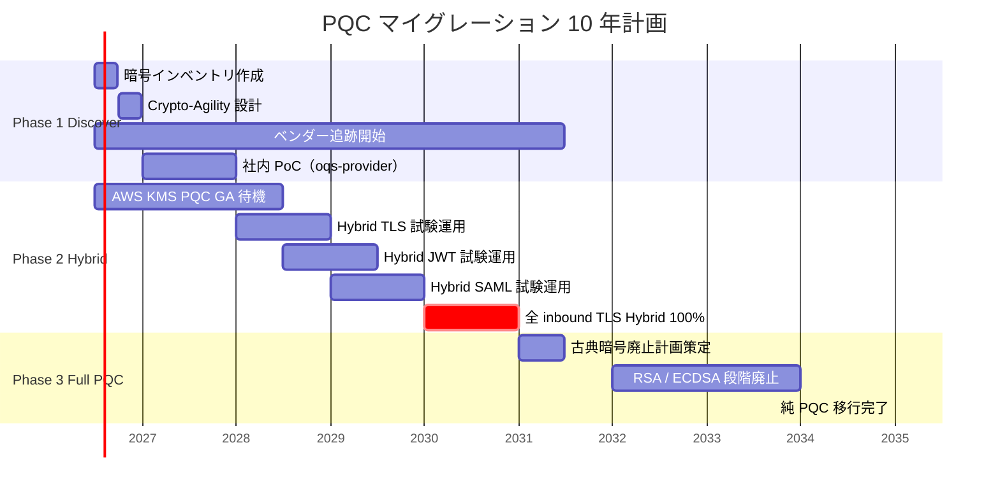

# ADR-047: Post-Quantum Cryptography（PQC）マイグレーション計画

- **ステータス**: Proposed（要件定義フェーズで Accepted に昇格予定）
- **日付**: 2026-06-23
- **関連**:
  - [ADR-045 鍵管理戦略集約](045-cryptographic-key-management-strategy.md)
  - [ADR-033 Keycloak 2-tier アーキテクチャ](033-keycloak-2tier-broker-idp-architecture.md)
  - [ADR-036 Customer Audit Support](036-customer-audit-support.md)
  - [§NFR-4.1 暗号化・鍵管理](../requirements/proposal/nfr/04-security.md)
  - [§NFR-7 コンプライアンス](../requirements/proposal/nfr/07-compliance.md)

---

## Context

### 背景

NIST が 2024/8 に **FIPS 203（ML-KEM）/ 204（ML-DSA）/ 205（SLH-DSA）** を正式公開し、**量子計算機耐性暗号（Post-Quantum Cryptography, PQC）** の標準化が完了した。各国規制 / 業界推奨も PQC 移行ロードマップの提示を要求し始めている。

**緊急性は中期だが、計画策定は早期に必要**な理由:

1. **HNDL 攻撃（Harvest Now, Decrypt Later）**: 暗号化された通信を**今のうちに収集し、量子計算機実用化後に復号**する攻撃。長期保管データ（監査ログ 7 年 / 個人情報）は **2026 時点から既にリスクに晒されている**
2. **暗号スイートの遷移は数年がかり**（過去の SHA-1 / TLS 1.0 廃止も 5-7 年）
3. **依存ライブラリ / IdP / ベンダーの PQC 対応状況**を計画的に把握する必要
4. **米国 OMB M-23-02**（2022/11）：連邦機関は 2035 年までに完全 PQC 移行
5. **EU**: ENISA Recommendations 2024、各国 NCA も 2030 までの移行を推奨

### 規制・ガイドラインの現状

| 規制 / 推奨 | 内容 |
|---|---|
| **NIST FIPS 203**（2024/8）| ML-KEM（旧 CRYSTALS-Kyber）鍵カプセル化メカニズム |
| **NIST FIPS 204**（2024/8）| ML-DSA（旧 CRYSTALS-Dilithium）デジタル署名 |
| **NIST FIPS 205**（2024/8）| SLH-DSA（旧 SPHINCS+）ハッシュベース署名 |
| **NIST SP 800-208** | Stateful Hash-Based Signatures（LMS, XMSS）|
| **NIST IR 8547**（2024/12）| PQC 移行ガイダンス Initial Draft |
| **NSA CNSA 2.0**（2022/9）| 米国国防系は 2033 まで PQC 完全移行 |
| **OMB M-23-02**（2022/11）| 米連邦機関は 2035 まで PQC 移行 |
| **CRYPTREC**（2024）| 国内推奨暗号リスト、PQC 評価フェーズ |
| **CNCF / OpenSSF**（業界）| OSS の PQC 対応ロードマップ |
| **ETSI TS 103 744**（2024）| PQC 移行プロセス標準 |
| **BSI（独）**（2024）| 2030 までに重要インフラ PQC |
| **ANSSI（仏）**（2024）| Hybrid 期 2025-2030、純 PQC 2030+ |

### HNDL 攻撃の本基盤への影響

| データ種別 | 想定寿命 | HNDL リスク | 優先度 |
|---|---|---|---|
| 監査ログ（7 年 + Glacier 6 年 = 13 年保管） | 〜2039 | **高**（量子計算機実用化 2030-2040 想定）| ★★★ |
| 顧客個人情報 | 顧客在籍期間（5-10 年） | 中-高 | ★★★ |
| Aurora バックアップ（暗号化）| 30 日 + 長期 | 中 | ★★ |
| Session Manager 録画（7 年）| 〜2033 | **高** | ★★★ |
| 短命 JWT / Session Cookie（1h-12h） | 即時 | 低 | ★ |
| TLS 通信（記録される可能性）| 即時 | 中（HNDL 標的）| ★★ |

→ **長期保管データ + TLS HNDL リスクが本基盤の PQC 優先対象**。

### 業界用語の整理

| 用語 | 意味 |
|---|---|
| **PQC**（Post-Quantum Cryptography）| 量子計算機耐性暗号 |
| **Quantum-Safe** | 同義 |
| **ML-KEM**（FIPS 203）| Module-Lattice based KEM、旧名 CRYSTALS-Kyber、鍵交換 |
| **ML-DSA**（FIPS 204）| Module-Lattice based Digital Signature、旧名 CRYSTALS-Dilithium |
| **SLH-DSA**（FIPS 205）| StateLess Hash-based DSA、旧名 SPHINCS+、保守的選択 |
| **Hybrid PQC** | 古典暗号 + PQC を併用、移行期の推奨 |
| **HNDL**（Harvest Now, Decrypt Later）| 「今盗み、後で復号」攻撃 |
| **Crypto-Agility** | 暗号アルゴリズムを動的に切替可能な設計 |
| **Q-Day** | 量子計算機が古典暗号を破る日 |
| **CRQC**（Cryptographically Relevant Quantum Computer）| 暗号関連量子計算機 |

---

## Decision

### 採用方針

**「3 フェーズ移行 + Crypto-Agility 基盤」**を採用。Phase 1（2026-2027）= インベントリ + Crypto-Agility 設計、Phase 2（2028-2030）= Hybrid PQC 導入、Phase 3（2031-2035）= 純 PQC 移行。

| Phase | 期間 | 内容 | KPI |
|---|---|---|---|
| **Phase 1: Discover & Prepare** | 2026-2027 | 暗号インベントリ + Crypto-Agility 設計 + ベンダー追跡 | インベントリ 100%、Agility 設計完了 |
| **Phase 2: Hybrid Deployment** | 2028-2030 | Hybrid TLS（ML-KEM + X25519）/ Hybrid 署名 | 全 inbound TLS が Hybrid 化 |
| **Phase 3: Full PQC** | 2031-2035 | 古典暗号廃止 | 純 PQC 100% |

### 主要判断

| 判断ポイント | 採用 | 理由 |
|---|---|---|
| **PQC 採用タイミング** | **段階的、2026 から Phase 1 開始** | HNDL 攻撃既に脅威、計画は早期着手必須 |
| **アルゴリズム選定** | **ML-KEM 768（鍵交換）+ ML-DSA 65（署名、業界標準パラメータ）** | NIST FIPS 203/204 推奨 |
| **保守的バックアップ** | **SLH-DSA**（FIPS 205）を**長期保管署名のみ採用** | Lattice 系に万が一突破された場合の保険、ハッシュベースは安全余裕大 |
| **Hybrid 期** | **必須**（Phase 2、2028-2030）| 業界推奨（ENISA / ANSSI / BSI）、後方互換確保 |
| **Crypto-Agility** | **必須**（Phase 1 から）| アルゴリズム変更時の改修コスト最小化 |
| **TLS 1.3 PQC** | **AWS / CloudFront 対応待ち**（2026-2027 想定）| インフラ依存、自社実装はしない |
| **JWT 署名 PQC** | **Phase 2 で ML-DSA 採用検討**、Phase 1 は ES256 継続 | Keycloak の PQC サポート待ち |
| **顧客向け表明** | **Trust Center で PQC ロードマップ公開**（[ADR-036](036-customer-audit-support.md)）| 規制業種顧客の必須要件化進行中 |

---

## A. Phase 1 — Discover & Prepare（2026-2027）

### A.1 暗号インベントリ作成

```yaml
# crypto-inventory.yaml（Git 管理）
inventory:
  - location: Broker Keycloak JWT signing
    algorithm: ES256 (ECDSA P-256)
    quantum_safe: false
    pqc_replacement: ML-DSA-65
    migration_phase: Phase 2
    dependencies: [Keycloak version, OIDC SDK compatibility]

  - location: Aurora at-rest encryption
    algorithm: AES-256-GCM
    quantum_safe: true  # 対称暗号は量子計算機に対し平方根の脆弱化のみ、AES-256 は実質安全
    pqc_replacement: none needed
    migration_phase: N/A

  - location: KMS Asymmetric CMK (JWT signing)
    algorithm: ECC_NIST_P256
    quantum_safe: false
    pqc_replacement: AWS KMS PQC support (2026-2027 待ち)
    migration_phase: Phase 2

  - location: TLS（CloudFront → Origin）
    algorithm: TLS 1.3 with X25519
    quantum_safe: false
    pqc_replacement: Hybrid X25519+ML-KEM-768
    migration_phase: Phase 2

  - location: ServiceNow SAML signature
    algorithm: RSA-SHA256 (2048-bit)
    quantum_safe: false
    pqc_replacement: ML-DSA-65 (ServiceNow 側対応待ち)
    migration_phase: Phase 3

  - location: 監査ログ署名（Audit Acct S3）
    algorithm: HMAC-SHA-256 (CloudTrail)
    quantum_safe: true  # HMAC は量子に対し対称暗号と同等の安全性
    pqc_replacement: none needed
    migration_phase: N/A

  - location: バックアップ暗号化（Aurora Snapshot）
    algorithm: AES-256-GCM (KMS)
    quantum_safe: true
    pqc_replacement: none needed
    migration_phase: N/A
    note: 鍵交換（KMS 内部）に古典暗号が使われている可能性あり、AWS 側 PQC 化を待つ
```

### A.2 Crypto-Agility 設計

```mermaid
flowchart LR
    App[アプリケーション]
    Lib[Crypto Abstraction Layer]
    Backend1[古典暗号<br/>(現行)]
    Backend2[Hybrid<br/>(Phase 2)]
    Backend3[Pure PQC<br/>(Phase 3)]

    App --> Lib
    Lib --> Backend1
    Lib -.|設定切替| Backend2
    Lib -.|設定切替| Backend3

    style Backend1 fill:#fff3e0
    style Backend2 fill:#e3f2fd
    style Backend3 fill:#e8f5e9
```

| 設計原則 | 実装 |
|---|---|
| アルゴリズム ID を設定可能化 | KMS Key Spec / Keycloak Realm Settings を環境変数で切替可能に |
| トークン形式に algorithm header | JWT `alg` フィールド、SAML `SignatureMethod` |
| ハイブリッド署名対応 | 1 トークンに古典 + PQC 両方の署名を持てる構造 |
| Crypto Provider 抽象化 | アプリ層は鍵生成 / 署名 / 検証を Provider 経由で実行 |
| 設定変更 = 無停止 | 鍵ロールオーバー機能で旧鍵を 90 日並走 |

### A.3 ベンダー / OSS 追跡

| 対象 | 追跡内容 | チェック頻度 |
|---|---|---|
| AWS KMS | PQC Key Spec 追加 | 月次 |
| AWS ACM / CloudFront | TLS PQC 対応 | 月次 |
| Keycloak | PQC アルゴリズムサポート | 月次（リリースノート） |
| Phase Two Keycloak Plugins | 同上 | 月次 |
| OpenSSL / BoringSSL | PQC API | 半期 |
| Cloudflare（Turnstile / Edge）| TLS PQC | 月次 |
| OIDC / SAML SDK（Node, Python, Java）| PQC alg 対応 | 半期 |
| 顧客 IdP（Entra ID / Okta / Auth0）| PQC ロードマップ | 半期 |

---

## B. Phase 2 — Hybrid Deployment（2028-2030）

### B.1 Hybrid TLS（X25519+ML-KEM）

業界既に進行中:

- **Chrome / Edge** 2024 で X25519Kyber768 デフォルト有効化
- **Cloudflare** 2024 で全 TLS が Hybrid 対応
- **AWS** 2025-2026 で CloudFront / ALB Hybrid 対応見込み
- **OpenSSL 3.5+** で oqs-provider 経由 PQC サポート

→ **インフラ側対応次第で本基盤も Hybrid 化**（基本待ち）

### B.2 Hybrid JWT 署名

```json
// Hybrid Signed JWT 概念例
{
  "header": {
    "alg": "HYBRID",
    "alg_classical": "ES256",
    "alg_pqc": "ML-DSA-65"
  },
  "payload": { ... },
  "signature_classical": "...",
  "signature_pqc": "..."
}
```

両方の署名を検証することで、片方が破られても安全。ただし**トークンサイズが ML-DSA で大幅増加**（〜3KB）するため、JWT 設計の見直しが必要。

### B.3 Hybrid SAML 署名

SAML は元々長大なため Hybrid 化のサイズインパクトは相対的に小さい。Keycloak Identity Provider Mapper で署名アルゴリズム選択を Hybrid 対応化。

### B.4 KMS Asymmetric CMK の PQC 化

```hcl
# AWS が PQC Key Spec をサポートしたら（2026-2027 想定）
resource "aws_kms_key" "jwt_signing_pqc" {
  description              = "JWT signing key - ML-DSA"
  customer_master_key_spec = "ML_DSA_65"  # 仮定の Spec 名
  key_usage                = "SIGN_VERIFY"
}
```

### B.5 Phase 2 KPI

| 指標 | 2028 目標 | 2029 目標 | 2030 目標 |
|---|---|---|---|
| 全 inbound TLS が Hybrid | 50% | 80% | 100% |
| JWT 署名 Hybrid 化 | 20%（社内テスト）| 60% | 90% |
| SAML 署名 Hybrid 化 | 10% | 40% | 80% |
| KMS CMK PQC 対応 | AWS 対応次第 | 主要鍵 50% | 全鍵 90% |

---

## C. Phase 3 — Full PQC（2031-2035）

### C.1 古典暗号廃止スケジュール

| アルゴリズム | 廃止目標 |
|---|---|
| RSA（全 bit 数）| 2033 |
| ECDSA / EdDSA | 2033 |
| ECDH | 2033 |
| TLS 1.3 古典 only | 2034 |
| 全 SAML 古典署名 | 2035 |

### C.2 旧暗号で署名された長期データの再署名

| データ | 対応 |
|---|---|
| 古い監査ログ（古典署名）| **再署名（ML-DSA）+ 元署名も保持**（証跡継続のため）|
| 古いバックアップ | 再暗号化（PQC 鍵）|
| 古い証明書 | 失効 + 新発行 |

---

## D. アルゴリズム選定理由

### D.1 ML-KEM 採用理由

| 候補 | パラメータ | 選定 |
|---|---|---|
| ML-KEM-512 | NIST L1（〜AES-128 相当）| △ 一般用途 |
| **ML-KEM-768** | NIST L3（〜AES-192 相当）| ✅ **本基盤標準** |
| ML-KEM-1024 | NIST L5（〜AES-256 相当）| △ 規制業種の高セキュリティ要求時のみ |

**推奨**: 業界標準パラメータ（Chrome / Cloudflare 採用）

### D.2 ML-DSA 採用理由

| 候補 | パラメータ | 選定 |
|---|---|---|
| ML-DSA-44 | NIST L2 | △ |
| **ML-DSA-65** | NIST L3 | ✅ **本基盤標準** |
| ML-DSA-87 | NIST L5 | △ サイズ大、規制業種のみ |

### D.3 SLH-DSA を併用する理由

ML-DSA / ML-KEM は**Lattice ベース**で、将来 Lattice に対する新たな攻撃法発見の**残存リスク**がある。SLH-DSA は**ハッシュベース**で、SHA-256 が安全な限り安全。

| 用途 | アルゴリズム |
|---|---|
| 短命トークン（JWT）| ML-DSA-65（性能重視）|
| 長期署名（監査ログ 13 年）| **SLH-DSA-128**（保守的、Lattice 突破の保険）|
| TLS Hybrid | X25519+ML-KEM-768 |

---

## E. 影響範囲分析

### E.1 トークンサイズ影響

| 項目 | 古典 | PQC | 増加倍率 |
|---|---|---|---|
| JWT 署名サイズ | 64 bytes（ES256）| 3,309 bytes（ML-DSA-65）| **51 倍** |
| TLS 1.3 ハンドシェイク（key share）| 32 bytes（X25519）| 1,184 bytes（ML-KEM-768）| **37 倍** |
| SAML Assertion 署名 | 〜500 bytes | 〜3,500 bytes | 7 倍 |
| 証明書サイズ | 〜1.5KB | 〜5-10KB | 3-7 倍 |

→ **JWT は要注意**。クレーム最小化（[ADR-030](030-minimal-jwt-claim-design.md)）を更に厳格化、Bearer Token over HTTP Header size 上限（ALB 16KB）対応必要。

### E.2 性能影響

| 項目 | 古典 | PQC | 性能変化 |
|---|---|---|---|
| 署名生成 | 〜0.1ms（ES256）| 〜0.5ms（ML-DSA-65）| 5 倍遅 |
| 署名検証 | 〜0.05ms（ES256）| 〜0.15ms（ML-DSA-65）| 3 倍遅 |
| 鍵交換 | 〜0.05ms（X25519）| 〜0.1ms（ML-KEM-768）| 2 倍遅 |

→ **性能影響は数 ms オーダー、本基盤の SLA に影響なし**。

### E.3 ストレージ / 帯域影響

- KMS CMK 数増（古典 + PQC 並走で実質倍）→ コスト +$250/月（10K MAU 換算）
- 監査ログサイズ増（PQC 署名で 〜50%増）→ S3 ストレージコスト +$X/月
- TLS ハンドシェイクサイズ増 → CloudFront データ転送コスト微増

---

## F. 業界ベンダー対応状況（2026 時点）

### F.1 大手クラウド

| ベンダー | PQC 対応状況 | 本基盤への影響 |
|---|---|---|
| **AWS KMS** | 検討中、2026-2027 対応見込み | Phase 2 で本基盤適用 |
| **AWS ACM / CloudFront** | TLS 1.3 PQC Hybrid 検討中 | Phase 2 で適用 |
| **AWS S3** | KMS 経由で透過対応見込み | 透明 |
| Google Cloud KMS | 2024 末から ML-KEM 試験提供 | — |
| Azure Key Vault | 2025 ML-KEM プレビュー | — |

### F.2 IdP / 認証製品

| 製品 | PQC 対応状況 | 本基盤への影響 |
|---|---|---|
| **Keycloak** | ロードマップ未公開（2026 時点）| Phase 2 で OSS PR / Phase Two 連携 |
| Microsoft Entra ID | 2026-2027 ML-DSA 対応見込み | フェデ顧客側で対応 |
| Okta | 2027 対応見込み | 同上 |
| Auth0 | 公式表明なし | 同上 |
| Ping Identity | ML-KEM 試験 | 同上 |

### F.3 ブラウザ / OIDC SDK

| 対象 | PQC 対応状況 |
|---|---|
| Chrome / Edge | 2024 X25519Kyber768 デフォルト |
| Firefox | 2024 試験対応 |
| Safari | 2025 予定 |
| oidc-client-ts | 未対応、Issue ウォッチ中 |
| OpenSSL | 3.5+ で oqs-provider 経由 |

---

## G. ロードマップ + マイルストーン



---

## H. Trust Center 公開（ADR-036 連動）

| 公開項目 | 公開範囲 | 更新頻度 |
|---|---|---|
| PQC ロードマップ概要 | Trust Center 公開部 | 半期 |
| Phase 別目標 | 公開部 | 半期 |
| 採用アルゴリズム（ML-KEM-768 / ML-DSA-65 / SLH-DSA-128）| 公開部 | — |
| 現状の達成率（Phase 1: 30%、Phase 2: 0% 等）| 公開部 | 四半期 |
| 詳細暗号インベントリ | Customer Portal（NDA）| 四半期 |
| ベンダー追跡レポート | Customer Portal（NDA）| 月次 |

---

## I. 顧客への説明文（規制業種顧客向け）

> ### Post-Quantum Cryptography（PQC）対応
>
> 本基盤は **NIST FIPS 203 / 204 / 205**（2024/8 公開）に基づく PQC 移行計画を策定済みです。
>
> - **Phase 1**（2026-2027）: 暗号インベントリ + Crypto-Agility 設計
> - **Phase 2**（2028-2030）: Hybrid 暗号（古典 + PQC 併用）で TLS / JWT / SAML を段階移行
> - **Phase 3**（2031-2035）: 古典暗号廃止、純 PQC へ完全移行
>
> **HNDL 攻撃（Harvest Now, Decrypt Later）対策**として、長期保管データ（監査ログ 7 年 / Session 録画 7 年）は Phase 2 で **SLH-DSA**（ハッシュベース署名、保守的選択）を併用し、Lattice 系突破時の保険を確保します。
>
> 規制対応:
> - **NIST FIPS 203 / 204 / 205**
> - **NSA CNSA 2.0**（米国国防系 2033 完全移行）
> - **OMB M-23-02**（米国連邦 2035 完全移行）
> - **CRYPTREC**（国内推奨暗号評価）
>
> 詳細ロードマップ + 達成率は Trust Center にて四半期更新で公開しています。

---

## J. コスト試算

### J.1 Phase 別追加コスト

| Phase | 初期投資 | 年次運用 |
|---|---|---|
| Phase 1（2026-2027）| 1,000 万円（インベントリ + Agility 設計）| 100 万円 |
| Phase 2（2028-2030）| 500 万円 × 3 年（Hybrid 実装）| 300 万円 × 3 年 |
| Phase 3（2031-2035）| 500 万円 × 5 年（古典廃止）| 200 万円 × 5 年 |
| **総額（10 年）** | **3,500 万円** | **2,400 万円** |

### J.2 ROI

- 規制業種顧客（金融 / 政府）の必須要件充足、契約獲得
- HNDL 攻撃による将来の漏洩リスク削減（金額換算困難だが、1 件で数億円規模）
- 業界先行で**Trust + Brand**価値向上

---

## K. 代替案検討

| 案 | 評価 | 採否 |
|---|---|---|
| **A. 様子見、業界対応待ち** | HNDL 攻撃既に脅威、規制対応遅延リスク | ❌ |
| **B. 2030 まで何もしない** | 7-10 年遅延、Q-Day に間に合わないリスク | ❌ |
| **C. 3 フェーズ段階移行 + Crypto-Agility**（本 ADR）| 業界標準（NIST IR 8547 / ENISA / ANSSI 同様）| ✅ 採用 |
| **D. 即時 PQC 全面移行** | 古典互換性喪失で顧客フェデ停止 | ❌ |
| **E. 独自 PQC アルゴリズム** | NIST 標準外、相互運用性なし | ❌ |
| **F. Quantum Key Distribution (QKD)** | 物理層対策、汎用アプリには非現実的 | ❌ |

---

## Consequences

### Positive

- **NIST FIPS 203/204/205 / NSA CNSA 2.0 / OMB M-23-02 への先行対応**
- **HNDL 攻撃リスク低減**（長期保管データの将来安全性確保）
- **Crypto-Agility 基盤**で将来の暗号アルゴリズム変更にも追従可能
- 規制業種顧客（金融 / 政府）の必須要件充足
- **業界先行**による Trust / Brand 価値向上
- Trust Center 公開で顧客監査即対応

### Negative

- **10 年で 〜6,000 万円のコスト**
- **JWT サイズ 51 倍増**（ML-DSA）でクレーム設計の見直し必要
- Keycloak / 主要ベンダー対応待ちが多く、本基盤側で完結できない
- Hybrid 期の運用複雑化（古典 + PQC 並走管理）
- 古い監査ログの再署名コスト

### Neutral

- AES-256 / HMAC-SHA-256 / SHA-256 は量子計算機に対し**実質安全**（Grover アルゴリズムでも 2 倍化のみ）、PQC 移行不要
- KMS Symmetric CMK は変更不要、Asymmetric CMK のみ対象

### 我々のスタンス

| 基本方針の柱 | PQC マイグレーション計画での実現 |
|---|---|
| **絶対安全** | HNDL 攻撃対策 + 長期保管データ保護 + SLH-DSA バックアップ |
| **どんなアプリでも** | Crypto-Agility で全アプリ透明に PQC 化、フェデ顧客 IdP 対応も追従 |
| **効率よく認証** | Hybrid 期で互換性確保、性能影響は数 ms オーダー |
| **運用負荷・コスト最小** | 段階移行で年次コスト平準化、業界対応待ちでベンダー開発工数活用 |

---

## 参考資料

### NIST 標準

- [NIST FIPS 203 — Module-Lattice Based KEM（ML-KEM）](https://csrc.nist.gov/pubs/fips/203/final)
- [NIST FIPS 204 — Module-Lattice Based Digital Signature（ML-DSA）](https://csrc.nist.gov/pubs/fips/204/final)
- [NIST FIPS 205 — Stateless Hash-Based Digital Signature（SLH-DSA）](https://csrc.nist.gov/pubs/fips/205/final)
- [NIST IR 8547 — Transition to Post-Quantum Cryptographic Standards（Initial Draft 2024/12）](https://csrc.nist.gov/pubs/ir/8547/ipd)
- [NIST SP 800-208 — Stateful Hash-Based Signature Schemes](https://csrc.nist.gov/publications/detail/sp/800-208/final)

### 各国規制 / ガイドライン

- [NSA CNSA 2.0（2022/9）](https://media.defense.gov/2022/Sep/07/2003071834/-1/-1/0/CSA_CNSA_2.0_ALGORITHMS_.PDF)
- [OMB M-23-02 — Migrating to Post-Quantum Cryptography](https://www.whitehouse.gov/wp-content/uploads/2022/11/M-23-02-M-Memo-on-Migrating-to-Post-Quantum-Cryptography.pdf)
- [CISA Quantum-Readiness Roadmap](https://www.cisa.gov/quantum)
- [BSI — Migration to Post-Quantum Cryptography（2024）](https://www.bsi.bund.de/SharedDocs/Downloads/EN/BSI/Crypto/Migration_to_Post_Quantum_Cryptography.pdf)
- [ANSSI — Position Paper on PQC（2024）](https://cyber.gouv.fr/publications/pqc-position-paper)
- [CRYPTREC](https://www.cryptrec.go.jp/)

### 業界

- [Cloudflare — Post-Quantum Cryptography](https://blog.cloudflare.com/pq-2024/)
- [Google — Securing TLS with Post-Quantum Cryptography](https://security.googleblog.com/2024/05/advancing-our-amazing-bet-on-asymmetric.html)
- [AWS — Post-Quantum Cryptography](https://aws.amazon.com/security/post-quantum-cryptography/)
- [OpenSSL PQC Roadmap](https://openssl-library.org/post/2024-11-10-pqc/)
- [Open Quantum Safe（liboqs / oqs-provider）](https://openquantumsafe.org/)
- [ETSI TS 103 744 — Transition Plans](https://www.etsi.org/)
