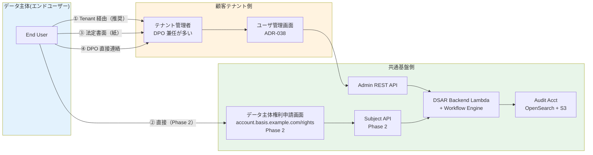

# ADR-048: データポータビリティ + データ主体権利対応（GDPR Art.15-20 / APPI 第 28-34 条）

- **ステータス**: Proposed（要件定義フェーズで Accepted に昇格予定）
- **日付**: 2026-06-23 作成、**2026-07-24 更新（基本設計 Wave 3 [U10 §10.5](../basic-design/10-integration-migration-design.md): Phase 1 Erasure = Soft Delete + 仮名化、エクスポート/削除は手動運用 — §C 注記参照）**
- **関連**:
  - [ADR-037 Shared Responsibility Model + 軽量 IGA](037-shared-responsibility-and-lightweight-iga.md)
  - [ADR-038 ユーザ管理画面](038-tenant-admin-portal.md)
  - [ADR-045 鍵管理戦略集約](045-cryptographic-key-management-strategy.md)
  - [§FR-7 ユーザー管理](../requirements/proposal/fr/07-user.md)
  - [§FR-8 管理機能](../requirements/proposal/fr/08-admin.md)
  - [§NFR-7 コンプライアンス](../requirements/proposal/nfr/07-compliance.md)

---

## Context

### 背景

[ADR-037](037-shared-responsibility-and-lightweight-iga.md) で「Shared Responsibility Model」を確定し、「顧客所有・弊社ホスト」のスタンスを定めた。しかし、**個人データ主体（エンドユーザー）からの権利行使**（開示請求 / 訂正 / 削除 / 利用停止 / **ポータビリティ**）への対応方式が、技術設計レベルで未定義のままだった。

特に **GDPR Right to Data Portability**（Art.20）と APPI 改正（2022/4 + 2024 政令）の **保有個人データの開示請求**（第 33 条）/ **利用停止等請求**（第 35 条）への対応は、認証基盤として必ず備えなければならない。

### 規制要件の現状

| 規制 | 関連条項 | 要求事項 |
|---|---|---|
| **GDPR Art.15** | Right of Access | 開示請求、30 日以内応答 |
| **GDPR Art.16** | Right to Rectification | 訂正請求 |
| **GDPR Art.17** | Right to Erasure（忘れられる権利）| 削除請求、30 日以内 |
| **GDPR Art.18** | Right to Restriction of Processing | 利用停止 |
| **GDPR Art.20** | **Right to Data Portability** | 機械可読形式での移転先 IdP へのエクスポート |
| **GDPR Art.21** | Right to Object | 処理拒否権 |
| **APPI 第 28 条** | 利用目的の通知 | — |
| **APPI 第 33 条**（2022 改正）| 保有個人データの開示請求 | デジタル形式での開示可能（電磁的記録の提供）|
| **APPI 第 34 条** | 訂正請求 | — |
| **APPI 第 35 条** | 利用停止・消去請求 | — |
| **APPI 第 36 条** | 第三者提供の停止 | — |
| **個人情報保護委員会 ガイドライン**（2024 改訂）| 電磁的方式の指定 | XLSX / CSV / JSON など機械可読を含む |
| **EU Data Act**（2025/9 施行）| 業務データの移転権利強化 | — |
| **CCPA / CPRA**（2023 拡張）| Right to Know / Delete / Correct | — |

### Shared Responsibility での扱い分け

| ユーザー種別 | データ所有者 | 権利行使先 | 本基盤の役割 |
|---|---|---|---|
| **フェデ顧客のエンドユーザー** | 顧客 IdP（顧客 Acme 社）| Acme 社の DPO（Data Protection Officer）| Broker 範囲のデータ（Login Audit / Session 等）のみ提供 |
| **IdP-KC 移行ユーザー** | 顧客所有・弊社ホスト（[ADR-037](037-shared-responsibility-and-lightweight-iga.md)）| 顧客の DPO → 弊社 → ツール提供 | フル機能を**ツールとして**顧客に提供 |
| **本基盤自身の利用者**（弊社運用者）| 弊社所有 | 弊社人事 / 法務 | フル機能 |

→ **IdP-KC 移行ユーザー分**が本 ADR の主要スコープ。フェデ顧客のエンドユーザー分は限定的（Broker 経由データのみ）。

### 業界用語の整理

| 用語 | 意味 |
|---|---|
| **DSAR**（Data Subject Access Request）| データ主体からの権利行使請求の総称 |
| **Right to Portability** | 構造化された機械可読形式での個人データ提供 |
| **Right to Erasure** | 「忘れられる権利」、削除請求 |
| **Right to Rectification** | 訂正請求 |
| **Cryptographic Erasure** | 暗号化鍵の破棄による論理削除（[ADR-045](045-cryptographic-key-management-strategy.md) L3 CMK 利用）|
| **Soft Delete** | 論理削除、復元可能期間あり |
| **Hard Delete** | 物理削除 |
| **DPO**（Data Protection Officer）| データ保護責任者 |
| **データ主体権利申請画面** | データ主体権利行使用 UI |
| **Audit Trail（DSAR）** | 請求受領 / 処理 / 応答の全プロセス記録 |

---

## Decision

### 採用方針

**「DSAR 4 経路 × 6 権利 × 機械可読 5 形式」のフレームワーク**を採用。
- 顧客テナント管理者経由（[ADR-038 ユーザ管理画面](038-tenant-admin-portal.md)）が**主導線**
- 直接ユーザー向け **データ主体権利申請画面**（Phase 2 オプション）も用意
- 全 DSAR は**証跡保管 7 年 + SLA 内応答**を保証

| 項目 | 採用方針 |
|---|---|
| **対応権利** | GDPR Art.15-21 + APPI 第 33-36 条すべて |
| **応答 SLA** | GDPR 30 日（最大 +60 日延長可、理由通知）、APPI「遅滞なく」（実運用 14 日目標）|
| **エクスポート形式** | **JSON**（プライマリ、機械可読標準）+ CSV / XLSX / SCIM 2.0 / OIDC UserInfo |
| **削除方式** | **論理削除（30 日 Pending）→ 物理削除**（30 日後、Cryptographic Erasure 併用）|
| **大規模顧客** | **テナント別 L3 CMK 削除で Cryptographic Erasure** 可（[ADR-045 §A.4](045-cryptographic-key-management-strategy.md)）|
| **メイン UI** | ユーザ管理画面（[ADR-038](038-tenant-admin-portal.md)）内に DSAR 管理画面追加 |
| **直接 UI**（Phase 2）| `account.basis.example.com/rights` で Subject 直接アクセス |
| **API** | Admin REST API（テナント管理者経由）+ Subject API（Phase 2）|
| **証跡保管** | 全 DSAR ログを Audit Acct OpenSearch（7 年）|
| **DPO 連絡** | テナントごとに DPO 連絡先を ユーザ管理画面 で設定可能 |

---

## A. 4 経路 × 6 権利マトリクス

### A.1 経路別の役割



### A.2 6 権利 × 機能マトリクス

| 権利 | GDPR | APPI | 実装内容 |
|---|---|---|---|
| **Right of Access**（開示）| Art.15 | 第 33 条 | 全データ JSON 形式エクスポート + 処理目的 / 保管期間 / 第三者提供先一覧 |
| **Right to Rectification**（訂正）| Art.16 | 第 34 条 | プロフィール編集 + 訂正履歴記録 |
| **Right to Erasure**（削除）| Art.17 | 第 35 条 | 論理削除 30 日 → 物理削除 + Cryptographic Erasure |
| **Right to Restriction**（処理制限）| Art.18 | 第 35 条 | アカウント Suspend、ログイン不可化（データは保持）|
| **Right to Portability**（ポータビリティ）| Art.20 | （APPI 直接条項なし、第 33 条で電磁的記録）| 機械可読 JSON / SCIM 2.0 形式、移転先 IdP 取込容易 |
| **Right to Object**（処理拒否）| Art.21 | 第 36 条 | 第三者提供停止 + 利用目的別 Opt-Out |

---

## B. エクスポート形式（Portability）

### B.1 JSON 形式（プライマリ）

```json
{
  "metadata": {
    "subject_id": "user-acme-12345",
    "tenant_id": "acme",
    "export_timestamp": "2026-06-23T10:00:00Z",
    "request_id": "dsar-req-abc123",
    "format_version": "1.0",
    "legal_basis": ["GDPR Art.20", "APPI 33 条"]
  },
  "profile": {
    "username": "alice@acme.example.com",
    "email": "alice@acme.example.com",
    "email_verified": true,
    "external_id": "ACME-EMP-12345",
    "given_name": "Alice",
    "family_name": "Tanaka",
    "locale": "ja",
    "created_at": "2025-04-01T00:00:00Z",
    "updated_at": "2026-05-15T12:34:56Z"
  },
  "authentication": {
    "credentials": {
      "password_set": true,
      "password_last_changed": "2026-04-01T00:00:00Z",
      "password_hash": "<NOT INCLUDED for security>"
    },
    "mfa": [
      { "type": "TOTP", "registered_at": "2025-04-15T00:00:00Z", "label": "Mobile Auth" },
      { "type": "WebAuthn", "registered_at": "2026-01-10T00:00:00Z", "label": "YubiKey 5C" }
    ],
    "federated_identities": [
      { "provider": "acme-entra-saml", "external_subject": "alice@acme.com" }
    ]
  },
  "groups_roles": {
    "groups": ["employees", "sales-team"],
    "realm_roles": ["user"],
    "client_roles": { "app-a": ["editor"], "app-b": ["viewer"] }
  },
  "consents": [
    { "scope": "openid profile email", "client_id": "app-a", "granted_at": "2025-04-01T..." }
  ],
  "sessions": [
    { "session_id": "...", "started_at": "2026-06-22T09:00:00Z", "ip": "192.0.2.X", "user_agent": "Mozilla/5.0..." }
  ],
  "audit_log_summary": {
    "login_count_last_90d": 67,
    "failed_login_count_last_90d": 3,
    "stepup_mfa_count_last_90d": 2,
    "first_login": "2025-04-02T09:00:00Z",
    "last_login": "2026-06-23T08:45:00Z",
    "ip_history_summary_only": true
  },
  "processing_info": {
    "purposes": [
      { "purpose": "認証", "legal_basis": "契約履行", "retention_period_days": "アカウント在籍中 + 13 年（監査保管）" },
      { "purpose": "セキュリティ監視（ITDR）", "legal_basis": "正当な利益", "retention_period_days": 365 },
      { "purpose": "適応認証（Risk スコアリング）", "legal_basis": "正当な利益", "retention_period_days": 90 }
    ],
    "third_party_disclosures": [
      { "recipient": "Cloudflare Turnstile", "data_type": "デバイス指紋", "purpose": "Bot 検出" }
    ],
    "data_location": "AWS ap-northeast-1（DR ap-northeast-3）"
  }
}
```

### B.2 SCIM 2.0 形式（IdP 移転用）

```json
{
  "schemas": ["urn:ietf:params:scim:schemas:core:2.0:User"],
  "id": "user-acme-12345",
  "externalId": "ACME-EMP-12345",
  "userName": "alice@acme.example.com",
  "name": { "givenName": "Alice", "familyName": "Tanaka" },
  "emails": [{ "value": "alice@acme.example.com", "primary": true }],
  "locale": "ja",
  "active": true,
  "groups": [{ "value": "employees" }, { "value": "sales-team" }],
  "meta": { "resourceType": "User", "created": "2025-04-01T...", "lastModified": "2026-05-15T..." }
}
```

### B.3 形式選択ガイダンス

| ユースケース | 推奨形式 |
|---|---|
| 他 IdP（Okta / Auth0 / Entra）への移転 | **SCIM 2.0** |
| データ閲覧 / 法的開示 | **JSON**（プライマリ）+ PDF（人間可読）|
| Excel / スプレッドシート分析 | **XLSX** |
| 他システム取込 / ETL | **CSV** |
| OIDC RP の UserInfo 形式互換 | **OIDC UserInfo Profile** |

---

## C. 削除戦略（Right to Erasure）

> **2026-07-24 注記（[U10 §10.5](../basic-design/10-integration-migration-design.md)）**: **Phase 1 の Erasure = Soft Delete + 仮名化**（U3 D3-09 の 3 段階削除モデル優先 — Phase 1 は物理削除を行わない）。**エクスポート / 削除は手動運用、API 化（§D DSAR Workflow Backend 等）は Phase 2**。

### C.1 3 段階削除モデル

```mermaid
flowchart LR
    Request[削除請求受領]
    Validate[本人確認 + 法的妥当性検証]
    Logical[論理削除<br/>30 日 Pending]
    Notify1[テナント管理者 + DPO 通知]
    Physical[物理削除]
    Crypto[暗号化キー破棄<br/>L3 CMK 削除]
    AuditKeep[監査ログのみ 13 年保管<br/>(法的義務、匿名化済)]

    Request --> Validate
    Validate --> Logical
    Logical --> Notify1
    Logical -.30 日経過.-> Physical
    Physical --> Crypto
    Crypto --> AuditKeep
```

### C.2 削除対象 / 保持対象の分類

| データ | 削除可否 | 保持理由 |
|---|---|---|
| プロフィール / 認証情報 | ✅ 完全削除 | — |
| Federated Identity Mapping | ✅ 削除 | — |
| Group / Role 割当 | ✅ 削除 | — |
| Consent 記録 | ✅ 削除 | — |
| Session 履歴 | ✅ 削除 | — |
| ITDR / Risk 履歴 | ✅ 削除 | — |
| **監査ログ（CloudTrail / Keycloak Events）** | ⚠ **匿名化のみ**（13 年保管必須）| PCI DSS §10.3 + APPI 第 23 条 + 訴訟リスク対応 |
| **法的紛争中のデータ** | ⚠ **Litigation Hold** | 削除停止、法務承認時のみ削除 |
| **規制要件で保管必須のデータ** | ⚠ 法定期間保管 | 金融顧客 7 年等 |

### C.3 監査ログの匿名化（Pseudonymization）

```json
// Before
{
  "event_id": "...",
  "user_id": "user-acme-12345",
  "username": "alice@acme.example.com",
  "ip_address": "192.0.2.1",
  ...
}

// After（削除実行後）
{
  "event_id": "...",
  "user_id": "DELETED-abcd1234",  // 不可逆ハッシュ
  "username": "<REDACTED>",
  "ip_address": "192.0.2.0/24",  // /24 まで集約
  "anonymization_date": "2026-07-23",
  ...
}
```

→ GDPR Recital 26：「匿名化されたデータは個人データに該当しない」、APPI 仮名加工情報も同様。

### C.4 Cryptographic Erasure（大規模顧客 L3 CMK）

[ADR-045 §A.4](045-cryptographic-key-management-strategy.md) で L3 テナント別 CMK を採用している顧客の場合:

- 個別ユーザー削除：通常の物理削除
- **テナント全削除**：L3 CMK を Pending Window 30 日で削除 → **暗号化データは即時復号不能** = 論理削除完了
- 物理削除：Pending 30 日 + バックアップ ローテーション 30 日 = 約 60 日で完全消滅

---

## D. DSAR Workflow Backend

### D.1 アーキテクチャ

```mermaid
flowchart TB
    subgraph In["Inbound"]
        TAdmin[ユーザ管理画面<br/>POST /admin/dsar/requests]
        SubPortal[Subject Portal Phase 2<br/>POST /rights/requests]
        DPOmail[DPO メール窓口]
    end

    subgraph Backend["DSAR Backend"]
        AGW[API Gateway]
        Lambda[DSAR Workflow Lambda]
        StateMachine[Step Functions<br/>State Machine]
        DDB[DynamoDB<br/>dsar-requests]
    end

    subgraph Workers["Processing Workers"]
        Validate[本人確認 Lambda]
        Export[Export Lambda<br/>JSON/CSV/XLSX/SCIM]
        Delete[Delete Lambda<br/>論理→物理]
        Notify[Notification Lambda<br/>SES + Slack]
    end

    subgraph Storage["Outputs"]
        S3Export[S3 + presigned URL<br/>7 日有効]
        Audit[Audit Acct<br/>OpenSearch + S3]
    end

    TAdmin --> AGW
    SubPortal --> AGW
    DPOmail -.|手動入力| TAdmin
    AGW --> Lambda
    Lambda --> StateMachine
    StateMachine --> DDB
    StateMachine --> Validate
    Validate --> Export
    Validate --> Delete
    StateMachine --> Notify
    Export --> S3Export
    StateMachine --> Audit

    style Backend fill:#fff3e0
    style Workers fill:#e3f2fd
```

### D.2 Step Functions ステートマシン

```yaml
States:
  ReceiveRequest:
    Type: Task
    Resource: arn:aws:lambda:...:dsar-receive
    Next: VerifyIdentity

  VerifyIdentity:
    Type: Task
    Resource: arn:aws:lambda:...:dsar-verify
    # MFA challenge / email link / DPO 確認
    Next: ChooseAction

  ChooseAction:
    Type: Choice
    Choices:
      - Variable: $.request_type
        StringEquals: ACCESS
        Next: ExportData
      - Variable: $.request_type
        StringEquals: ERASURE
        Next: LogicalDelete
      - Variable: $.request_type
        StringEquals: PORTABILITY
        Next: ExportData
      # ...

  ExportData:
    Type: Task
    Resource: arn:aws:lambda:...:dsar-export
    Parameters:
      format.$: $.format  # json / csv / xlsx / scim
    Next: GenerateDownload

  LogicalDelete:
    Type: Task
    Resource: arn:aws:lambda:...:dsar-logical-delete
    Next: WaitPendingWindow

  WaitPendingWindow:
    Type: Wait
    Seconds: 2592000  # 30 days
    Next: PhysicalDelete

  PhysicalDelete:
    Type: Task
    Resource: arn:aws:lambda:...:dsar-physical-delete
    Next: AnonymizeAuditLogs

  AnonymizeAuditLogs:
    Type: Task
    Resource: arn:aws:lambda:...:dsar-anonymize
    Next: NotifyComplete

  GenerateDownload:
    Type: Task
    Resource: arn:aws:lambda:...:dsar-presigned-url
    Next: NotifyComplete

  NotifyComplete:
    Type: Task
    Resource: arn:aws:lambda:...:dsar-notify
    End: true
```

### D.3 SLA 監視

| 指標 | SLA | アラート |
|---|---|---|
| GDPR 応答（30 日）| 25 日経過で Tenant Admin + DPO 通知 | PagerDuty |
| APPI 応答（14 日目標）| 10 日経過で Tenant Admin 通知 | Slack |
| 削除実行（30 日後）| 25 日経過で削除予定通知 | Email |
| エクスポート失敗 | 即時 | PagerDuty |
| 本人確認失敗 | 即時 | ユーザ管理画面 Notification |

---

## E. ユーザ管理画面 統合（ADR-038 拡張）

### E.1 DSAR 管理画面

| メニュー | 機能 |
|---|---|
| **DSAR Inbox** | 受領済 DSAR 一覧 + ステータス（Pending / Processing / Complete / Failed）|
| **新規 DSAR** | 法定書面 / DPO 直接連絡 / メール経由を手動登録 |
| **本人確認** | MFA Challenge / メール検証 / DPO による代理確認 |
| **エクスポート設定** | 形式選択（JSON / SCIM / CSV / XLSX）+ ダウンロードリンク発行 |
| **削除実行** | 論理削除開始 / Pending Window 状態確認 / Cancel |
| **Litigation Hold** | 法務承認時のみ削除停止 |
| **応答テンプレート** | 多言語対応の応答メールテンプレート |
| **証跡レポート** | 全 DSAR の SLA 達成率 / 月次サマリ（監査エビデンス）|

### E.2 DPO 設定画面

各テナントで DPO 連絡先を設定可能:

```yaml
tenant_dpo_config:
  primary_dpo:
    name: "山田太郎"
    email: "dpo@acme.example.com"
    phone: "+81-3-XXXX-XXXX"
  secondary_dpo:
    name: "鈴木花子"
    email: "dpo-deputy@acme.example.com"
  external_dpo:  # 外部委託の場合
    company: "DPO Service Co"
    contact: "..."
  notification_preferences:
    sla_warning_25d: true
    delete_executed: true
    export_failed: true
```

---

## F. データ主体権利申請画面（Phase 2 オプション）

### F.1 配置 + URL

- URL: `account.basis.example.com/rights`
- 認証: 既存 OIDC（Keycloak）+ MFA 必須（削除 / 全データエクスポートは Step-up）
- 配信: 🟠 Auth Platform Acct S3 + 🟣 Network Acct CloudFront（[ADR-039](039-centralized-network-account-edge-layer.md)）
- 多言語: 日本語 / 英語 / 中国語（顧客要件次第）

### F.2 UI 構成

```
account.basis.example.com/rights/
├── /access           — 自分のデータを閲覧 + エクスポート
├── /rectification    — プロフィール訂正
├── /erasure          — 削除請求
├── /restriction      — 利用停止
├── /portability      — 機械可読形式エクスポート
├── /objection        — 処理拒否
├── /requests         — 過去の請求履歴
└── /dpo-contact      — テナントの DPO 連絡先表示
```

### F.3 アクセシビリティ（[ADR-043](043-accessibility-wcag-2-2-aa.md)連動）

WCAG 2.2 AA + JIS X 8341-3:2016 AA 準拠必須。Audio CAPTCHA（[ADR-042](042-bot-detection-captcha.md)）も必要時提供。

---

## G. 証跡保管（監査対応）

### G.1 DSAR 監査ログ

| ログ項目 | 内容 | 保管 |
|---|---|---|
| 請求受領 | 受領経路 / 請求種別 / Subject ID / Tenant ID / Timestamp | 🔵 Audit Acct OpenSearch + S3（7 年）|
| 本人確認 | 方式 / 成功 / 失敗 | 同上 |
| 処理プロセス | Step Functions 実行 ARN / 各ステート遷移 / 担当 Lambda 関数 | 同上 |
| エクスポート | 形式 / レコード数 / ファイルサイズ / ダウンロード回数 | 同上 |
| 削除実行 | 削除対象 / 件数 / Cryptographic Erasure 有無 | 同上 |
| 完了通知 | 送信先 / 送信日時 | 同上 |
| Litigation Hold | 法務承認 ID / 解除日 | 同上 |
| SLA 達成 / 違反 | 受領→応答日数 / 違反時の理由 | 同上 |

### G.2 月次レポート（顧客監査用）

[ADR-036 Customer Audit Support](036-customer-audit-support.md) Trust Center 経由で公開:

| メトリクス | 公開範囲 |
|---|---|
| 月間 DSAR 受領件数 | Customer Portal（NDA）|
| 種別内訳（Access / Erasure / Portability 等）| 同上 |
| SLA 達成率 | 同上 + Trust Center 公開部（集計値のみ）|
| 平均応答日数 | 同上 |
| 失敗件数 + 理由 | Customer Portal |

---

## H. 多言語対応 + DPO 連絡

### H.1 対応言語（Phase 1）

| 言語 | 対象 |
|---|---|
| 日本語 | プライマリ（APPI 対応）|
| 英語 | グローバル（GDPR / CCPA 対応）|

Phase 2 で中国語 / 韓国語等を顧客要件に応じて追加。

### H.2 DPO 紛争解決パス

```
データ主体
  ↓
テナント DPO（顧客側、第一窓口）
  ↓
基盤 DPO（弊社、エスカレーション）
  ↓
監督機関（個人情報保護委員会 / EDPB / EU DPA）
```

各段階で **応答期限 / エビデンス保管 / 透明性** を確保。

---

## I. コスト試算

### I.1 月額（10M MAU）

| 項目 | 月額 |
|---|---|
| DSAR Backend Lambda | $20 |
| Step Functions（10K 実行 / 月想定）| $250 |
| DynamoDB（リクエスト履歴）| $50 |
| S3 Export Storage + presigned URL | $30 |
| SES 通知 | $20 |
| OpenSearch（監査ログ、既存 ADR-035 共用）| 既存活用 |
| **合計** | **〜$370/月（年 〜$4.5K）** |

### I.2 比較

| 案 | 年額 |
|---|---|
| **本 ADR（AWS 標準サービス）** | **〜$4.5K** |
| OneTrust DSAR モジュール | $50K+ |
| TrustArc | $40K+ |
| 自社運用 + 手動 Excel | スタッフコスト膨大 + SLA 違反リスク |

---

## J. 代替案検討

| 案 | 評価 | 採否 |
|---|---|---|
| **A. DSAR 対応せず** | GDPR / APPI 違反、罰金 + 信用失墜 | ❌ |
| **B. 手動 Excel + メール対応** | スケール不可、SLA 違反、人的ミス多発 | ❌ |
| **C. ユーザ管理画面 統合 + Subject Portal Phase 2**（本 ADR）| 業界標準（Auth0 / Okta 同パターン）| ✅ 採用 |
| **D. 商用 DSAR プラットフォーム（OneTrust / TrustArc）** | 年 $40-50K、機能リッチだが認証基盤との統合不足 | △ Phase 3 規模拡大時 |
| **E. Subject Portal のみ（Tenant 経由なし）** | 顧客 DPO の関与が不可能、Shared Responsibility 違反 | ❌ |
| **F. 削除は全て手動** | スケール不可、Cryptographic Erasure 利点なし | ❌ |

---

## Consequences

### Positive

- **GDPR Art.15-21 + APPI 第 33-36 条を 1 つの設計で同時充足**
- **CCPA / CPRA / EU Data Act** 等も同じ仕組みで対応可能
- **Cryptographic Erasure** で大規模顧客の完全削除を高速実行（テナント全削除 = L3 CMK 削除）
- 商用 DSAR プラットフォーム不要、**年 $4.5K で済む**
- ユーザ管理画面 統合で**顧客テナント管理者の負担最小化**
- 全 DSAR 監査ログ 7 年保管で**監査エビデンス即提示**
- 機械可読 5 形式で**IdP 移転を顧客が自由に**実施可能（Portability の真の実現）

### Negative

- **Subject Portal Phase 2 の追加開発コスト**（数百万円）
- 削除実行時の **データ整合性管理**（複数システムにまたがるデータの atomic 削除）
- **本人確認の運用負荷**（なりすまし防止と利便性のトレードオフ）
- 多言語対応の継続コスト

### Neutral

- B2C 不要のため Subject Portal は Phase 2 候補（Phase 1 は Tenant 経由のみ）
- フェデ顧客のエンドユーザー分は顧客 IdP 側対応、Broker 経由データのみ本基盤対応

### 我々のスタンス

| 基本方針の柱 | DSAR 対応での実現 |
|---|---|
| **絶対安全** | 本人確認厳格、削除証跡 7 年、Cryptographic Erasure 併用 |
| **どんなアプリでも** | 機械可読 5 形式（JSON / SCIM / CSV / XLSX / OIDC UserInfo）|
| **効率よく認証** | ユーザ管理画面 統合、Step Functions で自動化 |
| **運用負荷・コスト最小** | 商用 DSAR 不要（年 $50K 節約）、AWS 標準サービスで構築 |

---

## 参考資料

- [GDPR 公式](https://gdpr-info.eu/) — Art.15-21
- [個人情報保護委員会 APPI 改正法（2022/4 + 2024 政令）](https://www.ppc.go.jp/personalinfo/legal/)
- [個人情報保護委員会 ガイドライン（通則編）](https://www.ppc.go.jp/personalinfo/legal/guidelines_tsusoku/) — 第 33 条 開示
- [EDPB Guidelines on Data Portability (Art.20)](https://www.edpb.europa.eu/)
- [EDPB Guidelines on Right to Erasure (Art.17)](https://www.edpb.europa.eu/)
- [EU Data Act（2025/9 施行）](https://digital-strategy.ec.europa.eu/en/policies/data-act)
- [CCPA / CPRA 公式](https://oag.ca.gov/privacy/ccpa)
- [SCIM 2.0 RFC 7643/7644](https://www.rfc-editor.org/rfc/rfc7643)
- [NIST Privacy Framework](https://www.nist.gov/privacy-framework)
- [ISO/IEC 27701 Privacy Information Management](https://www.iso.org/standard/71670.html)
- [Keycloak アカウント設定画面 — Personal Info](https://www.keycloak.org/docs/latest/server_admin/#_account-service)
