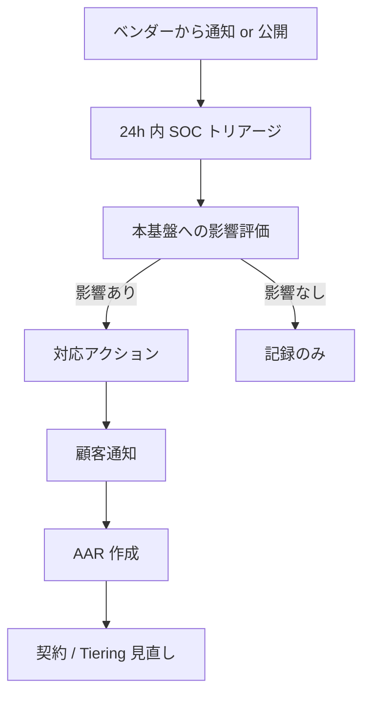

# ADR-049: Vendor Risk Management / TPRM（Third-Party Risk Management）

- **ステータス**: Proposed（要件定義フェーズで Accepted に昇格予定）
- **日付**: 2026-06-23
- **関連**:
  - [ADR-035 ITDR](035-identity-threat-detection-response.md)
  - [ADR-036 Customer Audit Support](036-customer-audit-support.md)
  - [ADR-042 Bot Detection / CAPTCHA](042-bot-detection-captcha.md)
  - [ADR-044 Tabletop Exercise](044-tabletop-exercise-incident-drill.md)
  - [ADR-046 Supply Chain Security](046-supply-chain-security.md)
  - [ADR-048 Data Portability](048-data-portability-subject-rights.md)
  - [§NFR-7 コンプライアンス](../requirements/proposal/nfr/07-compliance.md)

---

## Context

### 背景

[ADR-046 §H](046-supply-chain-security.md) で「ベンダー評価チェックリスト」を簡略に提示したが、本基盤が依存する**第三者ベンダー（Sub-processor / SaaS / OSS Maintainer / クラウド）の全体管理**が体系化されていなかった。Salesloft Drift breach（2025、100+ 企業の Salesforce 侵害）や CrowdStrike Falcon 障害（2024/7、世界 850 万デバイス影響）等、**ベンダー由来のインシデント**が SaaS 全体の主要リスクとして急速に顕在化している。

### 業界の主要事案

| 事案 | 影響 | 教訓 |
|---|---|---|
| **SolarWinds Orion**（2020）| 18,000+ 組織 | サプライチェーン化したベンダー製品 |
| **Kaseya VSA**（2021/7）| 1,500+ 中小企業 | MSP ツール経由ランサムウェア |
| **Okta Lapsus$**（2022/3）| Okta 顧客 366 社の関連懸念 | IdP ベンダー侵害の波及 |
| **MOVEit Transfer**（2023/5）| 2,500+ 組織 | ファイル転送ベンダー脆弱性 |
| **CrowdStrike Falcon Bug**（2024/7）| 850 万 Windows + 業界全停止 | エージェント型セキュリティの単一障害点 |
| **xz-utils backdoor**（2024/3）| 潜在 SSH 全侵害 | OSS Maintainer の社会的信頼検証 |
| **Salesloft Drift**（2025）| 100+ 企業 Salesforce 侵害 | SaaS-to-SaaS OAuth 統合の信頼境界 |
| **Snowflake Customer Breach**（2024/5）| 顧客 165 社のクレデンシャル流出 | 顧客側 MFA 未設定のベンダー対応責任 |

### 規制要件

| 規制 | 関連条項 |
|---|---|
| **SOC 2 Type II CC9.2** | Vendor Risk Management Program |
| **ISO 27001 A.5.19-A.5.23** | 供給者関係管理 |
| **PCI DSS v4.0 §12.8** | 第三者サービスプロバイダー管理 |
| **NIST SP 800-161 Rev 1** | Cybersecurity Supply Chain Risk Management |
| **NIST CSF 2.0** | Function GV.SC（Cybersecurity Supply Chain Risk Mgmt）2024 拡張 |
| **EU DORA**（Digital Operational Resilience Act）| 金融業 ICT 第三者プロバイダー要件、2025/1 適用 |
| **DOJ Bulk Sensitive Data Rule**（2025/4）| 米国、特定国ベンダー制限 |
| **APPI 第 25-26 条** | 委託先監督 + 第三者提供制限 |

### 業界用語の整理

| 用語 | 意味 |
|---|---|
| **TPRM**（Third-Party Risk Management）| 第三者リスク管理 |
| **VRM**（Vendor Risk Management）| 同義 |
| **Sub-processor** | GDPR 用語、再委託先の処理者 |
| **Critical Vendor** | サービス停止 / 漏洩が事業継続に致命的影響 |
| **DDQ**（Due Diligence Questionnaire）| デューデリ質問票 |
| **SIG**（Standardized Information Gathering）| 業界標準 DDQ（Shared Assessments）|
| **CAIQ**（Consensus Assessment Initiative Questionnaire）| CSA Cloud Security Alliance の質問票 |
| **Continuous Monitoring** | 契約後の継続的リスク監視 |
| **Tiering** | ベンダーをリスク層別化 |
| **4th Party Risk** | ベンダーの再委託先（自社から見て第 4 党）|
| **Concentration Risk** | 単一ベンダーへの依存集中 |
| **Vendor Lock-in** | 移行困難 |
| **Right to Audit Clause** | 監査権条項（契約） |

---

## Decision

### 採用方針

**「5 階層 Tiering + DDQ + Continuous Monitoring + Sub-processor 透明性」**で TPRM を体系化。SOC 2 CC9.2 / ISO 27001 A.5.19-23 / PCI DSS §12.8 / DORA を 1 つのフレームワークで充足。

| 項目 | 採用方針 |
|---|---|
| **ベンダー Tiering** | **5 階層**（Tier 0 Foundation / Tier 1 Critical / Tier 2 Important / Tier 3 Standard / Tier 4 Low Risk）|
| **DDQ** | **SIG Lite + 業界標準 CAIQ** 採用、初回 + 年次更新 |
| **継続監視** | **SecurityScorecard / BitSight** 等の Continuous Monitoring（Phase 2 候補）|
| **契約条項** | **Right to Audit / SLA / インシデント通知 24h / GDPR DPA / Data Portability** 必須 |
| **Sub-processor 一覧** | **Trust Center 公開部で随時更新**（[ADR-036](036-customer-audit-support.md)）|
| **新規ベンダー追加** | **CISO Approval Workflow**（GitHub PR ベース、3 人レビュー）|
| **インシデント** | **24h 内顧客通知 SLA + Tabletop 演習で検証**（[ADR-044](044-tabletop-exercise-incident-drill.md) S-10 連動）|
| **Concentration Risk** | **代替候補ベンダー必須**、シングルベンダー依存禁止 |
| **国家リスク**（DOJ Bulk Data Rule）| **特定国（中国 / ロシア / イラン / 北朝鮮 / キューバ / ベネズエラ）ベンダー除外** |

---

## A. 5 階層 Vendor Tiering

### A.1 階層定義

| Tier | 名称 | 定義 | 例 |
|---|---|---|---|
| **Tier 0** | Foundation（基盤）| AWS / Azure / GCP 等のハイパースケーラー、停止 = 全面停止 | AWS |
| **Tier 1** | Critical | 認証 / データ処理クリティカル、停止 = サービス停止 | Keycloak（OSS だが運用クリティカル）/ Cloudflare（DNS / Turnstile）|
| **Tier 2** | Important | 高機密データ取扱、停止 = 一部機能停止 | Phase Two Keycloak Plugins / PagerDuty |
| **Tier 3** | Standard | 業務効率化、停止 = 業務影響軽微 | Slack / GitHub / Datadog |
| **Tier 4** | Low Risk | 公開情報のみ、停止 = 影響極小 | アクセシビリティ検証会社 / 翻訳サービス |

### A.2 階層別の管理レベル

| 項目 | Tier 0 | Tier 1 | Tier 2 | Tier 3 | Tier 4 |
|---|---|---|---|---|---|
| **DDQ** | 簡易（業界公開情報）| SIG Full + CAIQ | SIG Lite | 簡易 DDQ | 不要 |
| **再評価頻度** | 年次 | **半年** | 年次 | 年次 | 隔年 |
| **継続監視** | AWS Health Dashboard | **SecurityScorecard A 評価維持** | スコア B+ | — | — |
| **インシデント通知 SLA** | 公開 Status Page | **24h** | 48h | 72h | 7 日 |
| **Right to Audit** | 不可（標準 SOC 2 等を受領）| **必須** | 必須 | 不要 | 不要 |
| **DPA / GDPR Sub-processor 契約** | AWS DPA 受領 | **必須** | 必須 | 必要時 | 不要 |
| **代替ベンダー候補** | 不要（移行困難）| **2 候補維持** | 1 候補 | — | — |
| **Tabletop 演習対象** | Game Day | **インシデントシナリオ S-09 等** | — | — | — |

### A.3 本基盤の現状ベンダー分類

| ベンダー | Tier | 用途 | DPA / Audit 必要性 |
|---|---|---|---|
| **AWS** | Tier 0 | クラウド基盤全体 | AWS DPA + GDPR DPA / FedRAMP 等 |
| **Cloudflare** | Tier 1 | Turnstile（[ADR-042](042-bot-detection-captcha.md)）/ 将来 DNS | Cloudflare Trust Hub + DPA |
| **Keycloak Community** | Tier 1 | OSS IdP（自社運用）| OSS、社内メンテナ評価 |
| **Phase Two** | Tier 2 | Keycloak Plugins（SCIM / Events 等）| 商用契約 + 監査権 |
| **GitHub** | Tier 2 | コード管理（[ADR-046](046-supply-chain-security.md)）| GitHub DPA |
| **PagerDuty** | Tier 2 | インシデント通知 | DPA |
| **Slack** | Tier 3 | 運用通知 | Slack DPA |
| **Datadog**（顧客 SIEM 連携時のみ）| Tier 3 | 監視 | 顧客側評価 |
| **インフォアクシア等**（[ADR-043](043-accessibility-wcag-2-2-aa.md)）| Tier 4 | 当事者テスト | 簡易 NDA |
| **NRI セキュア / Mandiant 等**（[ADR-044](044-tabletop-exercise-incident-drill.md)）| Tier 2 | Red Team 委託 | NDA + DPA |

---

## B. デューデリ（DDQ）プロセス

### B.1 採用 DDQ フレームワーク

| DDQ | 提供元 | 用途 |
|---|---|---|
| **SIG Full**（500+ 質問）| Shared Assessments | Tier 1 ベンダー |
| **SIG Lite**（100+ 質問）| Shared Assessments | Tier 2 ベンダー |
| **CAIQ v4**（CSA、200+ 質問）| Cloud Security Alliance | クラウドベンダー |
| 簡易 DDQ（独自、30 質問）| 弊社 | Tier 3 / Tier 4 |

### B.2 質問カテゴリ（SIG Lite 抜粋）

| カテゴリ | 質問例 |
|---|---|
| 組織体制 | CISO 配置 / セキュリティ予算比率 / インシデント対応体制 |
| ガバナンス | ポリシー文書化 / 教育 / 監査頻度 |
| 認証 / 認可 | MFA 必須 / RBAC / PAM 採用 |
| データ保護 | 暗号化（at-rest / in-transit）/ 鍵管理 / DLP |
| インシデント対応 | プレイブック / 訓練頻度 / 通知 SLA |
| BCP / DR | RTO / RPO / 演習頻度 |
| サブプロセッサ | 一覧公開 / 変更通知 / 顧客拒否権 |
| コンプライアンス | SOC 2 / ISO 27001 / PCI DSS / GDPR / APPI 認証 |
| 脆弱性管理 | ペネトレーションテスト頻度 / Bug Bounty / SLA |
| 物理セキュリティ | データセンター認証 / アクセス制御 |

### B.3 評価スコアリング

```yaml
# 各回答を 1-5 でスコア化、加重平均
scoring:
  Critical Categories (重み 3):  # 認証 / データ保護 / インシデント / DR
    - 認証 / 認可
    - データ保護
    - インシデント対応
    - BCP / DR
  Important Categories (重み 2):  # ガバナンス / サブプロセッサ / 脆弱性
    - 組織体制
    - ガバナンス
    - サブプロセッサ
    - 脆弱性管理
  Standard Categories (重み 1):  # コンプラ認証 / 物理
    - コンプライアンス
    - 物理セキュリティ

thresholds:
  Tier 1: ≥ 4.0/5.0 で承認
  Tier 2: ≥ 3.5/5.0
  Tier 3: ≥ 3.0/5.0
  Tier 4: ≥ 2.5/5.0
```

---

## C. 契約条項（Right to Audit / DPA）

### C.1 必須条項チェックリスト

| 条項 | Tier 1 | Tier 2 | Tier 3 | 内容 |
|---|---|---|---|---|
| **Right to Audit Clause** | ✅ | ✅ | △ | 年 1 回まで弊社による監査 or SOC 2 受領で代替可 |
| **インシデント通知 SLA** | ✅（24h）| ✅（48h）| ✅（72h）| 漏洩 / サービス侵害の即時通知義務 |
| **GDPR DPA**（Data Processing Agreement）| ✅ | ✅ | 必要時 | Sub-processor 一覧 + 変更通知義務 |
| **APPI 委託契約**（第 25 条）| ✅ | ✅ | ✅ | 委託先監督義務 |
| **Sub-processor 通知**（30 日前）| ✅ | ✅ | △ | 新規追加時の通知 + 顧客拒否権 |
| **データポータビリティ**（[ADR-048](048-data-portability-subject-rights.md)）| ✅ | ✅ | 必要時 | 契約終了時の弊社データ完全返却 |
| **削除証跡** | ✅ | ✅ | ✅ | 契約終了 90 日以内に完全削除 + 証跡提出 |
| **暗号化必須**（at-rest + in-transit）| ✅ | ✅ | ✅ | TLS 1.2+ / AES-256 |
| **SLA / SLO** | ✅ | ✅ | △ | 可用性 99.9%+ / RTO / RPO |
| **保険** | ✅ | ✅ | — | Cyber Liability Insurance 最低 $10M |
| **Bankruptcy Clause** | ✅ | ✅ | — | ベンダー破産時のデータエスクロー |
| **規制報告協力** | ✅ | ✅ | ✅ | 監督機関調査時の協力 |

### C.2 Right to Audit の実運用

| 形式 | 内容 |
|---|---|
| **直接監査** | 弊社が現地 / リモート監査、年 1 回まで（Tier 1 のみ）|
| **SOC 2 Type II 受領** | 監査人による独立レポートで代替（一般的）|
| **ISO 27001 認証受領** | 同上 |
| **CSA STAR Level 2** | 同上、クラウドベンダー向け |
| **Pooled Audit** | 複数顧客が共同監査、コスト分担 |

---

## D. Continuous Monitoring（継続的リスク監視）

### D.1 採用ツール

| ツール | 評価対象 | コスト | 採用判断 |
|---|---|---|---|
| **SecurityScorecard** | A-F の Letter Grade、10 分野 | $20K+/年 | **Tier 1 全ベンダー対象**（Phase 2）|
| **BitSight** | 評価類似 | $25K+/年 | △ 代替候補 |
| **UpGuard** | 評価類似 | $15K+/年 | △ |
| **Bishop Fox** | ペネトレーションテスト | 案件単位 | 大型ベンダーのみ |
| **公開 RSS / NVD** | CVE / Vendor Security Advisory | 無料 | 全ベンダー、SOC 監視 |

### D.2 監視メトリクス

| メトリクス | アラート条件 |
|---|---|
| SecurityScorecard Grade | A → B 降格で要レビュー、C 降格で即対応 |
| Public CVE | ベンダー製品の Critical/High CVE 公表 |
| データ漏洩公表 | Have I Been Pwned 等で被害公表 |
| Service Status | Status Page の Degraded / Major Outage |
| 上場 / 買収 | 経営変化（買収後の方針転換リスク）|

### D.3 自動化（GitHub Actions ベース）

```yaml
# .github/workflows/vendor-monitoring.yml
name: Vendor Continuous Monitoring
on:
  schedule:
    - cron: '0 9 * * 1'  # 毎週月曜
jobs:
  monitor:
    runs-on: ubuntu-latest
    steps:
      - name: Fetch SecurityScorecard
        run: curl https://api.securityscorecard.io/companies/cloudflare.com -H "Authorization: ..."
      - name: Fetch NVD for vendor products
        run: |
          for product in keycloak phase-two cloudflare-turnstile; do
            curl "https://services.nvd.nist.gov/rest/json/cves/2.0?keywordSearch=$product"
          done
      - name: Check Vendor Status Pages
        run: |
          curl https://www.cloudflarestatus.com/api/v2/status.json
          curl https://www.githubstatus.com/api/v2/status.json
      - name: Alert if Score Drop / Critical CVE / Outage
        run: ...
```

---

## E. Sub-processor 管理（Trust Center 公開）

### E.1 公開フォーマット

[ADR-036 Customer Audit Support](036-customer-audit-support.md) Trust Center 公開部にて以下を公開:

| 項目 | 内容例 |
|---|---|
| ベンダー名 | Cloudflare Inc. |
| 所在地 | San Francisco, CA, USA |
| 用途 | Bot Detection（Turnstile） |
| データ種別 | デバイス指紋（個人識別困難）|
| 法的保護 | SCC（Standard Contractual Clauses）+ DPA |
| 認証 | SOC 2 Type II, ISO 27001, CSA STAR Level 2 |
| 評価 Tier | Tier 1 |
| 開始日 | 2026-XX |
| 過去 24 ヶ月のインシデント | 0 件（公開済み範囲）|

### E.2 顧客通知 + 拒否権

新規 Sub-processor 追加時:

1. **30 日前に顧客通知**（Trust Center 更新 + メール）
2. **顧客拒否権**：契約で「正当な理由で拒否可能」、拒否時は代替手段 or 契約終了
3. **緊急時例外**：CVE 対応で緊急ベンダー追加時は事後 7 日以内通知

---

## F. 新規ベンダー追加プロセス

### F.1 PR ベース承認フロー

```mermaid
flowchart LR
    Need[ベンダー追加ニーズ]
    Eval[初期評価<br/>(SIG Lite)]
    PR["GitHub PR 作成<br/>vendor-registry.yaml"]
    Review[3 人レビュー<br/>CISO + 法務 + 該当チーム Lead]
    Contract[契約交渉<br/>(必須条項 §C.1)]
    Onboard[Onboard<br/>(Trust Center 更新)]
    Monitor[Continuous Monitoring 開始]

    Need --> Eval
    Eval -->|スコア閾値 OK| PR
    Eval -->|スコア NG| Reject[却下]
    PR --> Review
    Review -->|承認| Contract
    Review -->|条件付き| Conditions[条件付与<br/>(再評価期日 / 段階導入)]
    Conditions --> Contract
    Contract --> Onboard
    Onboard --> Monitor
```

### F.2 vendor-registry.yaml 例

```yaml
vendors:
  - name: Cloudflare
    tier: 1
    purposes:
      - Bot Detection (Turnstile)
      - Future: DNS Resolver / WAF Edge
    data_processed:
      - Device Fingerprint
      - IP Address (transient)
    region: US (SCC + DPA)
    certifications: [SOC2-Type2, ISO27001, CSA-STAR-L2]
    contract:
      signed_date: 2026-01-15
      renewal_date: 2027-01-15
      contact: legal@cloudflare.com
    ddq_score: 4.3 / 5.0
    ddq_completed: 2026-01-10
    next_review: 2026-07-15  # Tier 1 = 半年
    incident_history:
      - date: 2024-06-21
        summary: "Cloudflare partial outage（リージョン）"
        impact: "Turnstile 一時的に低下、本基盤は AWS WAF Captcha フォールバック作動"
    alternative_candidates:
      - hCaptcha
      - AWS WAF Captcha (Native)
    approved_by:
      - CISO: 田中
      - Legal: 佐藤
      - Platform Lead: 山田
```

---

## G. Concentration Risk + Vendor Lock-in 管理

### G.1 Concentration Risk マトリクス

| ベンダー | 依存度（％）| リスク | 代替手段 |
|---|---|---|---|
| AWS | 100%（基盤）| **致命** | Multi-cloud（GCP / Azure）は Phase 3 候補、現実的にロックイン受容 |
| Cloudflare（Turnstile） | 50%（プライマリ CAPTCHA）| 中 | AWS WAF Captcha + hCaptcha フォールバック |
| Keycloak（OSS）| 100%（認証コア）| **致命** | 移行不可、OSS Fork 戦略で対応 |
| Phase Two | 30%（SCIM / Events Plugin）| 中 | 自社開発 or 別 Plugin |
| GitHub | 90%（コード）| 高 | GitLab / Bitbucket への移行可能性確保 |

### G.2 Vendor Lock-in 緩和策

| 戦略 | 内容 |
|---|---|
| **Open Standards 採用** | OIDC / SAML / SCIM 標準準拠（[ADR-014](014-auth-patterns-scope.md)）|
| **データポータビリティ** | [ADR-048](048-data-portability-subject-rights.md) で機械可読 5 形式 |
| **Multi-cloud Awareness** | Aurora → PostgreSQL 互換、EKS → Kubernetes 互換 |
| **OSS Fork 戦略** | Keycloak / Phase Two が経営変化時、Fork 可能な体制 |
| **エスクロー契約** | 商用ベンダーのソースコード Escrow（Tier 1 のみ）|

---

## H. インシデント時のベンダー対応プロセス

### H.1 ベンダー由来インシデント時の対応フロー



### H.2 [ADR-044 Tabletop Exercise](044-tabletop-exercise-incident-drill.md) S-09 連動

シナリオ S-09「Cloudflare（Turnstile）障害」を年 1 回演習、SLA 検証:
- ベンダー通知から本基盤対応開始まで 24h 以内か
- AWS WAF Captcha フォールバック切替が技術的に可能か
- 顧客通知が 48h 以内に完了するか

---

## I. SOC 2 CC9.2 / ISO 27001 / DORA 監査エビデンス

### I.1 監査エビデンス成果物

| エビデンス | 公開範囲 | 更新頻度 |
|---|---|---|
| Vendor Registry（全ベンダー一覧）| Trust Center 公開部（Sub-processor のみ）/ Customer Portal（完全版）| 月次 |
| Tier 別管理レベル定義 | Trust Center 公開部 | — |
| DDQ サンプル（質問項目）| Trust Center 公開部 | — |
| 年次再評価実績 | Customer Portal | 年次 |
| Continuous Monitoring スコア推移 | Customer Portal | 月次 |
| ベンダーインシデント記録 | Customer Portal | 発生時 + 月次サマリ |
| 契約必須条項テンプレート | 法務内部 | — |

### I.2 SOC 2 CC9.2 充足項目

| 要件 | 充足方法 |
|---|---|
| ベンダーリスク評価 | DDQ + Tiering |
| 契約に SLA / セキュリティ条項 | §C.1 |
| ベンダー監視 | Continuous Monitoring + 年次再評価 |
| インシデント対応 | §H + Tabletop 連動 |
| 契約終了プロセス | データ削除 + 証跡 |

---

## J. コスト試算

### J.1 年額

| 項目 | 年額 |
|---|---|
| DDQ 運用（Shared Assessments 加盟）| $5K |
| SecurityScorecard（Tier 1 ベンダー 5 社）| $20K |
| 法務レビュー（契約 + DPA）| $30K（外部弁護士、年 10 件想定）|
| 内部監査（Tier 1 直接監査 年 1 回）| $20K（旅費 + 工数）|
| TPRM 専任（0.3 FTE）| $30K |
| **合計** | **〜$105K / 年** |

### J.2 比較

| 案 | 年額 |
|---|---|
| **本 ADR（自社運用 + ツール組合せ）** | **〜$105K** |
| OneTrust TPRM | $80K+ |
| ProcessUnity TPRM | $70K+ |
| Prevalent TPRM | $60K+ |
| 何もしない | SOC 2 / ISO 27001 / PCI DSS / DORA 違反、契約失注 |

---

## K. 代替案検討

| 案 | 評価 | 採否 |
|---|---|---|
| **A. 何もしない** | SOC 2 CC9.2 / PCI DSS §12.8 / DORA 違反 | ❌ |
| **B. 商用 TPRM プラットフォーム全面採用** | 年 $60-80K、機能リッチ | △ Phase 2 検討 |
| **C. 5 階層 Tiering + DDQ + Monitoring 自社運用**（本 ADR）| 業界標準、コスト最適 | ✅ 採用 |
| **D. SOC 2 受領のみで済ます** | 継続監視不在、CC9.2 不十分 | ❌ |
| **E. ベンダー数を最小化（Lock-in 受容）** | Concentration Risk 増大 | ❌ |
| **F. 個別契約毎にチェックリスト** | 体系性なし、SOC 2 監査不合格 | ❌ |

---

## Consequences

### Positive

- **SOC 2 CC9.2 / ISO 27001 A.5.19-23 / PCI DSS §12.8 / DORA を 1 つのフレームワークで充足**
- **CrowdStrike / Salesloft / Snowflake 級事案の早期検知 + 対応**
- Trust Center で **Sub-processor 完全透明性**、顧客監査即対応
- Concentration Risk 可視化 + 代替候補維持で**事業継続性向上**
- 5 階層 Tiering でリスクに応じた**コスト最適化**

### Negative

- **TPRM 専任 0.3 FTE の運用負荷**
- 年 $105K のコスト
- 新規ベンダー追加の **PR レビュー時間**（3 人レビュー）
- Continuous Monitoring の **誤検知対応**

### Neutral

- Phase 2 で SecurityScorecard 全面採用（Phase 1 は手動 + 公開情報）
- DOJ Bulk Data Rule 対象国（中国 / ロシア等）ベンダーは現状ゼロのため、影響なし
- 顧客側 TPRM プログラムとの連動（顧客の DDQ への回答も同時整理）

### 我々のスタンス

| 基本方針の柱 | TPRM での実現 |
|---|---|
| **絶対安全** | 5 階層 Tiering + DDQ + Monitoring + 契約条項 + 演習 |
| **どんなアプリでも** | Open Standards 採用 + Vendor Lock-in 回避 |
| **効率よく認証** | PR ベース承認 + 自動化 Monitoring |
| **運用負荷・コスト最小** | 商用 TPRM プラットフォーム不要、年 $105K |

---

## 参考資料

### 業界標準

- [Shared Assessments — SIG / SIG Lite](https://sharedassessments.org/sig/)
- [Cloud Security Alliance — CAIQ v4](https://cloudsecurityalliance.org/research/cloud-controls-matrix)
- [NIST SP 800-161 Rev 1 — C-SCRM](https://csrc.nist.gov/publications/detail/sp/800-161/rev-1/final)
- [NIST CSF 2.0 — Govern Function](https://www.nist.gov/cyberframework)
- [ISO 27036 — Supplier Relationships](https://www.iso.org/standard/59648.html)
- [ISO 27017 / 27018 — Cloud Privacy](https://www.iso.org/)

### 規制

- [SOC 2 Type II Trust Services Criteria — CC9.2](https://www.aicpa-cima.com/resources/landing/system-and-organization-controls-soc-suite-of-services)
- [PCI DSS v4.0 §12.8](https://www.pcisecuritystandards.org/document_library/)
- [EU DORA — Digital Operational Resilience Act](https://www.eiopa.europa.eu/digital-operational-resilience-act-dora_en)
- [DOJ Bulk Sensitive Personal Data Rule (2025/4)](https://www.justice.gov/opcl/bulk-data)
- [APPI 第 25 条 委託先監督](https://www.ppc.go.jp/personalinfo/legal/)

### ツール

- [SecurityScorecard](https://securityscorecard.com/)
- [BitSight](https://www.bitsight.com/)
- [UpGuard](https://www.upguard.com/)
- [OneTrust TPRM](https://www.onetrust.com/products/third-party-risk-management/)

### 事案教訓

- [SolarWinds Cybersecurity Advisory (CISA AA20-352A)](https://www.cisa.gov/news-events/cybersecurity-advisories/aa20-352a)
- [Okta Lapsus$ Incident Report](https://sec.okta.com/articles/2022/04/okta-concludes-its-investigation-january-2022-compromise)
- [CrowdStrike Falcon Channel File 291 Incident Report (2024)](https://www.crowdstrike.com/falcon-content-update-remediation-and-guidance-hub/)
- [Salesloft / Drift OAuth Breach (2025)](https://www.salesforce.com/news/) — 業界共通教訓
