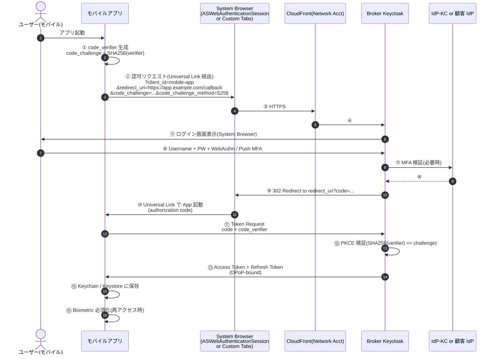

# ADR-050: モバイルアプリ認証設計（AppAuth PKCE + WebAuthn Platform + Push 通知 MFA）

- **ステータス**: Proposed（要件定義フェーズで Accepted に昇格予定）
- **日付**: 2026-06-23 作成、2026-06-24 適用範囲明確化
- **関連**:
  - **[ADR-057 CSRF 対策の責任分界](057-csrf-protection-responsibility-boundary.md)** — AppAuth + System Browser + PKCE 経路は Bearer 明示付与のため CSRF 免疫（2026-07-06 追記、[ADR-057 §E.1](057-csrf-protection-responsibility-boundary.md#e1-モバイルappauth--system-browseradr-050) 連動）

---

> **⚠ 2026-06-24 適用範囲明確化**
>
> 本 ADR の対象は **「弊社が提供するモバイルアプリの**エンドユーザ認証**」** である。具体的には:
>
> - **対象**：弊社が顧客向けに提供するモバイルアプリ（業務アプリのモバイル版）に、顧客企業のエンドユーザ（P-3 / P-4）がログインする場面
> - **非対象**：
>   - ❌ ユーザ管理画面（[ADR-038](038-tenant-admin-portal.md)）のモバイル版（管理者向け、Phase 1 では Web のみ）
>   - ❌ 顧客企業が自社で開発するモバイルアプリ（顧客側で SDK 採用方針を決定、本基盤は OIDC/PKCE 仕様準拠を保証するのみ）
>   - ❌ 弊社運用者の管理操作モバイル（PAM スコープ、[ADR-040](040-pam-jit-admin-privilege-management.md) Out of Scope）
>
> **典型ユースケース**：
> - 経費精算モバイルアプリ → 顧客 IdP（Entra/Okta）or IdP-KC で認証 → JWT 取得
> - 勤怠管理モバイルアプリ → 同上
> - 出張承認モバイルアプリ → 同上 + Push 通知 MFA で PC ログインを承認
>
> **認証方式自体は OIDC/OAuth で Web と共通**だが、モバイル特有の実装ガイドライン（System Browser / PKCE / Universal Links / Keychain 等）を提供する。

---

- **関連**:
  - [ADR-009 MFA 責任はパスワード管理側に帰属](009-mfa-responsibility-by-idp.md)
  - [ADR-014 共有認証基盤が対応する認証パターンの範囲](014-auth-patterns-scope.md)
  - [ADR-026 AAL 不整合とステップアップ MFA](026-aal-mismatch-stepup-mfa.md)
  - [ADR-034 Adaptive Authentication](034-adaptive-authentication.md)
  - [ADR-035 ITDR](035-identity-threat-detection-response.md)
  - [ADR-041 Workload Identity](041-workload-identity-spiffe.md)
  - [ADR-043 Accessibility WCAG 2.2 AA](043-accessibility-wcag-2-2-aa.md)
  - [§FR-1 認証](../requirements/proposal/fr/01-auth.md)
  - [§FR-3 MFA](../requirements/proposal/fr/03-mfa.md)

---

## Context

### 背景

ADR-001〜049 では**ブラウザベース認証**を主に設計してきた。一方、B2B SaaS でも顧客従業員のモバイル利用は今後発生する想定が高く、**ネイティブモバイルアプリ（iOS / Android）からの認証パターン**が未定義のままだった。打ち合わせで「B2C は含まない」「AI Agent 想定なし」は確認済みだが、**B2B 従業員モバイル**については明示的に範囲外と確定していない。

将来的に顧客アプリ（業務アプリ）がモバイル対応する場合、本基盤として**標準的なモバイル認証フローと SDK 推奨**を提示できる必要がある。

### 業界の現在地（2026 時点）

| 項目 | 業界標準 |
|---|---|
| **OAuth 2.0 for Native Apps** | **RFC 8252 + PKCE 必須**（System Browser 経由、WebView 禁止）|
| **OAuth 2.1 Draft** | PKCE デフォルト化 + WebView 禁止明文化 |
| **WebAuthn Platform Authenticator** | iOS Face ID / Touch ID / Android Biometric Prompt = passkey 同等 |
| **Conditional UI Passkey**（2023〜）| iOS 17 / Android 14 で自動 Passkey 提案 |
| **App-bound Refresh Token** | Refresh Token を App + Device に Bind |
| **Push 通知 MFA**（Okta Verify / Duo Push）| OTP より UX 良好、Fatigue Attack 対策必須 |
| **Universal Links / App Links** | OAuth Callback 用ディープリンク |
| **Mobile Threat Defense (MTD)** | デバイス侵害検知（Lookout / Zimperium）|
| **App Attest / Play Integrity** | デバイス・アプリの真正性検証 |
| **OS API**: iOS ASWebAuthenticationSession / Android Custom Tabs | System Browser 標準 |
| **AppAuth SDK** | OpenID Foundation 公式、iOS / Android / JS |

### 業界事案教訓

| 事案 | 教訓 |
|---|---|
| **MFA Fatigue Attack**（2022 Uber 等）| Push 承認の Number Matching + Context 表示必須 |
| **OAuth Phishing**（業界継続）| WebView 禁止徹底、System Browser のみ |
| **Refresh Token 漏洩**（モバイルアプリリバースエンジニアリング）| App-bound Token + Device Binding |
| **Cydia / Magisk Hide**（脱獄 / Root）| App Attest / Play Integrity で検知 |

### 規制要件

| 規制 | モバイル関連条項 |
|---|---|
| **NIST SP 800-63B Rev 4** | Authenticator Types（Software / Hardware）、AAL2/3 要件 |
| **OAuth 2.0 BCP for Native Apps (RFC 8252)** | System Browser 必須、WebView 禁止 |
| **OAuth 2.1 Draft** | 上記を強化 |
| **FAPI 2.0**（金融顧客向け）| mTLS / DPoP / PAR 必須 |
| **PCI DSS v4.0 §8** | モバイルアプリも認証要件適用 |
| **APPI 第 23 条** | 個人データへのアクセス制御（モバイル含む）|
| **WCAG 2.2 AA**（[ADR-043](043-accessibility-wcag-2-2-aa.md)）| ネイティブアプリは WCAG 直接非適用だが、iOS HIG / Android Material Accessibility 準拠 |

### 業界用語の整理

| 用語 | 意味 |
|---|---|
| **AppAuth** | OpenID Foundation の OAuth ネイティブ SDK |
| **PKCE**（Proof Key for Code Exchange）| 認可コード横取り対策 |
| **System Browser** | iOS Safari / Android Chrome、in-app browser ではない |
| **ASWebAuthenticationSession**（iOS）| Safari sandbox による OAuth フロー、Cookie 共有可能 |
| **Custom Tabs**（Android）| Chrome ベース、in-app だが安全 |
| **Universal Links / App Links** | https:// スキームでアプリ起動 |
| **Conditional UI Passkey** | パスワードフィールドで Passkey 自動提案 |
| **Device Bound Session Credentials** | DBSC、Google 提唱、Session を Device に Bind |
| **DPoP**（Demonstrating Proof-of-Possession）| Token を発行先 Client に Bind（RFC 9449）|
| **App Attest**（iOS）| アプリ真正性証明 |
| **Play Integrity API**（Android）| 同上 |
| **MAM** / **MDM** | Mobile Application Management / Mobile Device Management |
| **MTD**（Mobile Threat Defense）| デバイス脅威検知 |

---

## Decision

### 採用方針

**「AppAuth SDK + PKCE + System Browser + WebAuthn Platform + Push 通知 MFA」**を標準推奨。Phase 1 で SDK 設計 + リファレンス実装を提供、Phase 2 で MTD 統合 + App Attest 検証を追加。

| 項目 | 採用方針 |
|---|---|
| **OAuth フロー** | **OAuth 2.1 (PKCE 必須)** + Authorization Code + System Browser |
| **SDK 推奨** | **AppAuth iOS / Android（OpenID Foundation 公式）** + 弊社薄ラッパー |
| **ブラウザ** | **iOS: ASWebAuthenticationSession**、**Android: Chrome Custom Tabs** |
| **WebView** | **全面禁止**（OAuth Phishing 対策、RFC 8252）|
| **WebAuthn** | **Platform Authenticator 推奨**（Face ID / Touch ID / Android Biometric）|
| **Push 通知 MFA** | **Phase 2** で AWS SNS Mobile Push + Number Matching + Context |
| **TOTP** | Authenticator アプリ連携（Phase 1 から、Authenticator アプリ側で完結）|
| **Refresh Token** | **App-bound + Device Binding**（DPoP RFC 9449）|
| **デバイス検証** | **Phase 2** で App Attest（iOS）+ Play Integrity（Android）|
| **MTD 統合** | **Phase 3** で MDM / MAM / Lookout / Zimperium 統合（顧客要件次第）|
| **Deep Link** | **Universal Links（iOS）+ App Links（Android）**、Custom Scheme 非推奨 |
| **Refresh Token TTL** | モバイル 30 日（PC ブラウザより長め、利便性配慮）|

---

## A. モバイル認証フロー全体

### A.1 標準フロー（AppAuth + System Browser + PKCE）



### A.2 各ステップのセキュリティ要点

| ステップ | 要点 |
|---|---|
| ② | **WebView 禁止**、System Browser 必須（RFC 8252）|
| ② | redirect_uri は **Universal Link / App Link** で App を確実に起動、Custom Scheme 非推奨 |
| ⑤ | ログイン画面は Keycloak Theme（[ADR-024](024-login-screen-architecture-branding.md)）、ブランディング統一 |
| ⑥ | WebAuthn Platform Authenticator が Face ID / Touch ID / Android Biometric を活用 |
| ⑪ | code_verifier は元の App だけが知る = 認可コード横取り無効化 |
| ⑬ | DPoP 採用で Refresh Token を発行先 App に Bind、漏洩しても他 Client で使えない |
| ⑭ | Keychain（iOS）/ Android Keystore（Hardware-backed）に保存、Plain text 禁止 |
| ⑮ | 再起動 / 一定時間後の再認証は Biometric 必須化、Token 自動ロード回避 |

---

## B. SDK 推奨 + リファレンス実装

### B.1 推奨 SDK

| プラットフォーム | SDK | 理由 |
|---|---|---|
| **iOS** | **AppAuth-iOS**（OpenID Foundation 公式）| OAuth 2.1 準拠、ASWebAuthenticationSession 標準採用 |
| **Android** | **AppAuth-Android**（同公式）| Chrome Custom Tabs 標準採用 |
| React Native | **react-native-app-auth** | AppAuth ラッパー |
| Flutter | **flutter_appauth** | AppAuth ラッパー |

### B.2 弊社薄ラッパー（オプション提供）

```swift
// iOS Swift — 推奨パターン
import AppAuth

class AuthClient {
    let issuer = URL(string: "https://auth.basis.example.com/realms/customer")!
    let clientID = "mobile-app-customer-a"
    let redirectURI = URL(string: "https://app.customer-a.example.com/auth/callback")!

    func login(presenter: UIViewController) async throws -> OIDAuthState {
        // Discovery
        let config = try await OIDAuthorizationService.discoverConfiguration(forIssuer: issuer)

        // PKCE 自動生成（AppAuth が処理）
        let request = OIDAuthorizationRequest(
            configuration: config,
            clientId: clientID,
            scopes: [OIDScopeOpenID, OIDScopeProfile, OIDScopeEmail],
            redirectURL: redirectURI,
            responseType: OIDResponseTypeCode,
            additionalParameters: nil
        )

        // System Browser 起動（ASWebAuthenticationSession）
        let authState = try await OIDAuthState.authState(
            byPresenting: request, presenting: presenter
        )

        // Keychain 保存
        try KeychainStore.save(authState: authState, account: "current-user")

        // Biometric ロック設定
        try BiometricAuth.enable()

        return authState
    }
}
```

```kotlin
// Android Kotlin — 推奨パターン
import net.openid.appauth.*

class AuthClient(private val context: Context) {
    private val issuer = Uri.parse("https://auth.basis.example.com/realms/customer")
    private val clientId = "mobile-app-customer-a"
    private val redirectUri = Uri.parse("https://app.customer-a.example.com/auth/callback")

    suspend fun login(activity: Activity): AuthState {
        val config = AuthorizationServiceConfiguration.fetchFromIssuer(issuer)

        val request = AuthorizationRequest.Builder(
            config, clientId,
            ResponseTypeValues.CODE, redirectUri
        )
            .setScopes(listOf("openid", "profile", "email"))
            // PKCE 自動生成
            .build()

        val authService = AuthorizationService(context)
        val intent = authService.getAuthorizationRequestIntent(request)

        // Chrome Custom Tabs で起動
        activity.startActivityForResult(intent, REQ_AUTH)

        // ... onActivityResult で response 処理
        // AuthState 構築 + EncryptedSharedPreferences + Android Keystore 保存
    }
}
```

---

## C. WebAuthn Platform Authenticator（Biometric）統合

### C.1 採用理由

| 項目 | 従来 PW | TOTP | SMS | **WebAuthn Platform** |
|---|---|---|---|---|
| Phishing 耐性 | ❌ | ❌ | ❌ | **✅** |
| UX | △ 入力 | △ 入力 | △ | **✅ 指紋 / 顔のみ** |
| デバイス Binding | — | — | — | **✅** |
| サーバ側変更 | — | — | — | Keycloak v26 標準対応 |

### C.2 iOS / Android 統合

| OS | API | 認証方法 |
|---|---|---|
| iOS 16+ | ASAuthorizationPlatformPublicKeyCredentialProvider | Face ID / Touch ID |
| Android 9+ | androidx.credentials.CredentialManager | Biometric Prompt + Fingerprint / Face |

### C.3 Conditional UI Passkey

iOS 17 / Android 14+ で「ユーザーがログイン画面を見た瞬間に Passkey 候補を提案」する Conditional UI:

```swift
// iOS Swift
let request = ASAuthorizationPlatformPublicKeyCredentialProvider(
    relyingPartyIdentifier: "auth.basis.example.com"
).createCredentialAssertionRequest(challenge: challenge)

let controller = ASAuthorizationController(authorizationRequests: [request])
controller.delegate = self
controller.presentationContextProvider = self

// Conditional UI（ユーザー操作前に表示）
controller.performAutoFillAssistedRequests()
```

### C.4 Keycloak 側設定

Keycloak の Authentication Flow で `WebAuthn Passwordless` を Required に設定、Realm Setting で:

```json
{
  "webAuthnPolicyRpId": "basis.example.com",
  "webAuthnPolicyAttestationConveyancePreference": "indirect",
  "webAuthnPolicyAuthenticatorAttachment": "platform",
  "webAuthnPolicyRequireResidentKey": "Yes",
  "webAuthnPolicyUserVerificationRequirement": "required"
}
```

---

## D. Push 通知 MFA（Phase 2）

### D.1 アーキテクチャ

```mermaid
flowchart LR
    User[ユーザー(PC)]
    KC[Keycloak]
    SNS[AWS SNS<br/>Mobile Push]
    APNS[Apple APNS]
    FCM[Google FCM]
    App[モバイルアプリ]
    Touch[Touch ID / Face ID]

    User -->|① PC でログイン| KC
    KC -->|② Push 送信要求| SNS
    SNS -->|③ APNS| APNS
    SNS -->|④ FCM| FCM
    APNS --> App
    FCM --> App
    App -->|⑤ 通知表示<br/>Number Matching + Context| User
    User -->|⑥ Touch ID 承認 + Number 入力| Touch
    Touch --> App
    App -->|⑦ 承認結果送信| KC
    KC -->|⑧ ログイン完了| User
```

### D.2 MFA Fatigue Attack 対策必須項目

2022 Uber breach の教訓を踏まえ:

| 対策 | 内容 |
|---|---|
| **Number Matching** | 画面に表示された 2 桁数字をモバイルで入力（誤承認防止）|
| **Context 表示** | ログイン元 IP / 地域 / アプリ / 時刻を承認画面に明示 |
| **Push 試行回数制限** | 5 分間に 3 回まで、超過で一時ロック |
| **App-side Rate Limit** | App 側でも承認ボタン押下を制限 |
| **疑わしいログインで Push 拒否** | Adaptive Auth Score（[ADR-034](034-adaptive-authentication.md)）高で Push 送信せず Step-up |

### D.3 AWS SNS Mobile Push コスト

| 項目 | 月額 |
|---|---|
| SNS Mobile Push（10M MAU × 30 ログイン / 月 = 3 億件）| $750（$0.50 / 1M Push）|
| APNs / FCM API | 無料 |
| **合計** | **〜$750/月**（10M MAU）|

---

## E. デバイス検証（App Attest / Play Integrity、Phase 2）

### E.1 用途

| 検証項目 | iOS App Attest | Android Play Integrity |
|---|---|---|
| アプリの真正性 | ✅ App Store 配布のオリジナルか | ✅ Play Store / 公式署名か |
| デバイスの真正性 | ✅ Genuine Apple Device か | ✅ Google Certified Device か |
| ジェイルブレイク / Root 検知 | ✅ | ✅ |
| デバッガアタッチ検知 | △（App Store Review）| ✅ |

### E.2 Keycloak 統合（カスタム Authenticator SPI）

```java
// Keycloak Custom Authenticator
public class DeviceAttestationAuthenticator implements Authenticator {
    @Override
    public void authenticate(AuthenticationFlowContext context) {
        String attestationToken = context.getHttpRequest()
            .getHttpHeaders().getHeaderString("X-App-Attestation");

        if (attestationToken == null) {
            context.failure(AuthenticationFlowError.INVALID_CREDENTIALS);
            return;
        }

        if (attestationToken.startsWith("AppAttest:")) {
            // iOS App Attest 検証
            boolean valid = AppAttestVerifier.verify(attestationToken);
            if (valid) context.success();
            else context.failure(AuthenticationFlowError.INVALID_CREDENTIALS);
        } else if (attestationToken.startsWith("PlayIntegrity:")) {
            // Google Play Integrity 検証
            boolean valid = PlayIntegrityVerifier.verify(attestationToken);
            if (valid) context.success();
            else context.failure(AuthenticationFlowError.INVALID_CREDENTIALS);
        } else {
            context.failure(AuthenticationFlowError.INVALID_CREDENTIALS);
        }
    }
}
```

### E.3 Adaptive Auth 統合

検証失敗 → Risk Score 上昇（+30 点） → Step-up MFA → 拒否（[ADR-034](034-adaptive-authentication.md)）

---

## F. Refresh Token Binding（DPoP）

### F.1 DPoP RFC 9449 採用

Refresh Token / Access Token を発行先 Client（モバイルアプリ）に Bind:

```http
POST /realms/customer/protocol/openid-connect/token HTTP/1.1
Host: auth.basis.example.com
Content-Type: application/x-www-form-urlencoded
DPoP: eyJ0eXAiOiJkcG9wK2p3dCIsImFsZyI6IkVTMjU2IiwiandrIjp7...

grant_type=refresh_token&refresh_token=...
```

DPoP Header の JWT には:
- `htm`: HTTP Method
- `htu`: HTTP URL
- `iat`: 発行時刻
- `jti`: 重複防止 ID
- 署名: アプリ生成の秘密鍵で署名（公開鍵は `jwk` に含む）

→ Refresh Token 漏洩しても、攻撃者が秘密鍵を持たない限り使用不可。

### F.2 Keycloak DPoP サポート

Keycloak v22+ で DPoP 標準対応、Realm Setting で Enable 可能。

---

## G. Deep Link（Universal Links / App Links）

### G.1 iOS Universal Links

`apple-app-site-association` を弊社 Domain に配置:

```json
// https://app.customer-a.example.com/.well-known/apple-app-site-association
{
  "applinks": {
    "apps": [],
    "details": [{
      "appID": "TEAMID.com.customer-a.app",
      "paths": ["/auth/callback"]
    }]
  }
}
```

### G.2 Android App Links

`assetlinks.json` 同様:

```json
// https://app.customer-a.example.com/.well-known/assetlinks.json
[{
  "relation": ["delegate_permission/common.handle_all_urls"],
  "target": {
    "namespace": "android_app",
    "package_name": "com.customer_a.app",
    "sha256_cert_fingerprints": ["..."]
  }
}]
```

### G.3 Custom Scheme 非推奨理由

| 項目 | Custom Scheme（`myapp://`）| Universal/App Link（`https://`）|
|---|---|---|
| アプリ未インストール時 | 失敗 | Web ページ表示で代替可能 |
| 偽装アプリリスク | あり（同 Scheme 登録可）| なし（Domain 所有者証明必要）|
| ブラウザ警告 | あり（一部）| なし |
| **採用** | ❌ | ✅ |

---

## H. オフライン対応 + Token 管理

### H.1 Token 保管

| OS | 保管先 | 暗号化 |
|---|---|---|
| iOS | **Keychain Services**（kSecAttrAccessibleWhenPasscodeSetThisDeviceOnly）| Secure Enclave |
| Android | **EncryptedSharedPreferences + Android Keystore**（StrongBox if available）| Hardware-backed |

### H.2 オフライン → オンライン復帰時

- Access Token 期限切れ → Refresh Token で更新
- Refresh Token も期限切れ → 再ログイン要求
- ネットワーク断中の操作はキャッシュ + 復帰時 Sync

### H.3 ログアウト時

- ローカル Token 完全削除
- Keycloak End Session（[ADR-005](005-user-pool-not-identity-pool.md) Session 章参照）
- Push 通知トークン解除（SNS）

---

## I. MDM / MAM / MTD 統合（Phase 3 候補）

### I.1 顧客環境の MDM / MAM

| 製品 | 用途 |
|---|---|
| Microsoft Intune | MDM / MAM |
| VMware Workspace ONE | MDM / MAM |
| Jamf | iOS MDM |
| Google Workspace MDM | 簡易 MDM |

→ **本基盤は MDM / MAM そのものは提供しない**、顧客側ツールと連携する API + Conditional Access 設計を提供。

### I.2 Conditional Access パターン

```yaml
# 例: 「会社管理デバイス + iOS 16+ のみ」を許可
conditional_access:
  - condition:
      device_managed: required (MDM headers)
      os_version: ">= iOS 16"
      mtd_score: ">= clean"
    action: allow
  - condition: default
    action: step_up_mfa or deny
```

→ Adaptive Auth Score（[ADR-034](034-adaptive-authentication.md)）+ ITDR（[ADR-035](035-identity-threat-detection-response.md)）と統合。

---

## J. Accessibility（iOS HIG / Android Material）

### J.1 Native ガイドライン準拠

WCAG 2.2 はネイティブアプリ非適用、代わりに OS ガイドラインを採用:

| OS | ガイドライン |
|---|---|
| iOS | Human Interface Guidelines — Accessibility |
| Android | Material Design — Accessibility + WCAG 2.2 AA 参考 |

### J.2 必須要件

| 要件 | iOS | Android |
|---|---|---|
| VoiceOver / TalkBack 対応 | ✅ accessibilityLabel | ✅ contentDescription |
| Dynamic Type（フォントサイズ）| ✅ UIFontMetrics | ✅ Sp 単位 |
| 色コントラスト 4.5:1 | ✅ | ✅ |
| ターゲットサイズ 44pt / 48dp | ✅ | ✅ |
| キーボード操作 | iOS は Full Keyboard Access | Android Switch Access |

---

## K. Phase 別ロードマップ

| Phase | 内容 | 期間 |
|---|---|---|
| **Phase 1** | AppAuth SDK 推奨 + 弊社薄ラッパー + Keycloak 設定 + リファレンス実装（iOS / Android）| 3 ヶ月 |
| **Phase 2** | Push 通知 MFA（SNS）+ App Attest / Play Integrity + DPoP | 4 ヶ月 |
| **Phase 3** | MDM / MAM / MTD 統合 + Conditional Access 高度化 + FAPI 2.0（金融顧客向け）| 顧客要件次第 |

---

## L. コスト試算

### L.1 Phase 別

| Phase | 初期 | 月次運用 |
|---|---|---|
| Phase 1 | 1,500 万円（SDK ラッパー + リファレンス + ドキュメント）| 50 万円 |
| Phase 2 | 1,000 万円（Push MFA + App Attest）| +SNS 月 $750（10M MAU）|
| Phase 3 | 500 万円 + 顧客個別調整 | — |

### L.2 比較

| 案 | 5 年累計 |
|---|---|
| **本 ADR（OSS SDK + AWS SNS）** | **〜5,000 万円** |
| Auth0 Mobile SDK | $50K+/年（MAU 課金）|
| Okta Mobile SDK | $40K+/年 |

---

## M. 代替案検討

| 案 | 評価 | 採否 |
|---|---|---|
| **A. モバイル非対応** | 顧客モバイル需要に対応不可、競合敗北 | ❌ |
| **B. WebView ベース簡易対応** | RFC 8252 違反、Phishing リスク | ❌ |
| **C. AppAuth + PKCE + WebAuthn + Push MFA**（本 ADR）| 業界標準、規制準拠 | ✅ 採用 |
| **D. 独自 SDK 開発** | 業界 SDK 比較劣後 | ❌ |
| **E. Auth0 / Okta Mobile SDK 採用** | MAU 課金で 10M MAU 規模で破綻 | ❌ |
| **F. Passwordless（Magic Link）のみ** | ユースケース限定的 | △ 補完オプション |

---

## Consequences

### Positive

- **B2B 従業員モバイル想定の先回り設計**、顧客モバイル化要求に即対応
- **OAuth 2.1 / RFC 8252 / WebAuthn / DPoP 業界標準準拠**
- **WebAuthn Platform Authenticator（Biometric）**で UX + Phishing 耐性両立
- **MFA Fatigue Attack 対策**（Number Matching + Context）
- App-bound Refresh Token（DPoP）で漏洩耐性
- 商用 Mobile SDK（Auth0 / Okta）比 **5-10 倍コスト削減**

### Negative

- **iOS / Android 両方の SDK 維持**（OS バージョンアップ追従）
- Phase 2 開発コスト + SNS 月 $750
- MDM / MAM 統合は顧客側ツール依存
- ネイティブアプリの Accessibility は WCAG 直接非適用、OS ガイドライン別管理

### Neutral

- 当面 Phase 1 のみ実装、Phase 2/3 は顧客需要次第
- AI Agent 想定なしのため Voice Assistant 連携は範囲外
- Mobile-First B2C 系設計（Onboarding / Email Link 等）は範囲外

### 我々のスタンス

| 基本方針の柱 | モバイル認証設計での実現 |
|---|---|
| **絶対安全** | OAuth 2.1 / PKCE / WebAuthn / DPoP / App Attest 多層 |
| **どんなアプリでも** | iOS / Android / React Native / Flutter 全 SDK 対応 |
| **効率よく認証** | WebAuthn Platform（指紋 / 顔のみ）+ Conditional UI Passkey |
| **運用負荷・コスト最小** | OSS SDK 採用、商用 Mobile SDK $40-50K/年 比 5-10 倍削減 |

---

## 参考資料

### 標準仕様

- [RFC 8252 — OAuth 2.0 for Native Apps (BCP)](https://datatracker.ietf.org/doc/html/rfc8252)
- [OAuth 2.1 Draft](https://datatracker.ietf.org/doc/html/draft-ietf-oauth-v2-1)
- [RFC 7636 — PKCE](https://datatracker.ietf.org/doc/html/rfc7636)
- [RFC 9449 — DPoP（Demonstrating Proof-of-Possession）](https://datatracker.ietf.org/doc/html/rfc9449)
- [WebAuthn L3 W3C](https://www.w3.org/TR/webauthn-3/)
- [FAPI 2.0 Security Profile](https://openid.net/specs/fapi-2_0-security-profile.html)

### SDK

- [AppAuth-iOS](https://github.com/openid/AppAuth-iOS)
- [AppAuth-Android](https://github.com/openid/AppAuth-Android)
- [react-native-app-auth](https://github.com/FormidableLabs/react-native-app-auth)
- [flutter_appauth](https://pub.dev/packages/flutter_appauth)

### OS / プラットフォーム

- [Apple ASWebAuthenticationSession](https://developer.apple.com/documentation/authenticationservices/aswebauthenticationsession)
- [iOS Passkeys](https://developer.apple.com/passkeys/)
- [Android Custom Tabs](https://developer.chrome.com/docs/android/custom-tabs)
- [Android Credential Manager API](https://developer.android.com/training/sign-in/credential-manager)
- [Apple App Attest](https://developer.apple.com/documentation/devicecheck/establishing_your_app_s_integrity)
- [Google Play Integrity API](https://developer.android.com/google/play/integrity)

### Keycloak

- [Keycloak Mobile Apps](https://www.keycloak.org/docs/latest/securing_apps/#native-applications)
- [Keycloak WebAuthn](https://www.keycloak.org/docs/latest/server_admin/#_webauthn)
- [Keycloak DPoP（v22+）](https://www.keycloak.org/docs-api/latest/rest-api/index.html#_dpop)

### セキュリティ業界

- [OWASP Mobile Top 10 (2024)](https://owasp.org/www-project-mobile-top-10/)
- [OWASP MASVS](https://mas.owasp.org/MASVS/)
- [NIST SP 800-163 Vetting the Security of Mobile Applications](https://csrc.nist.gov/publications/detail/sp/800-163/rev-1/final)
- [Uber 2022 MFA Fatigue Attack Analysis](https://www.uber.com/newsroom/security-update/)
