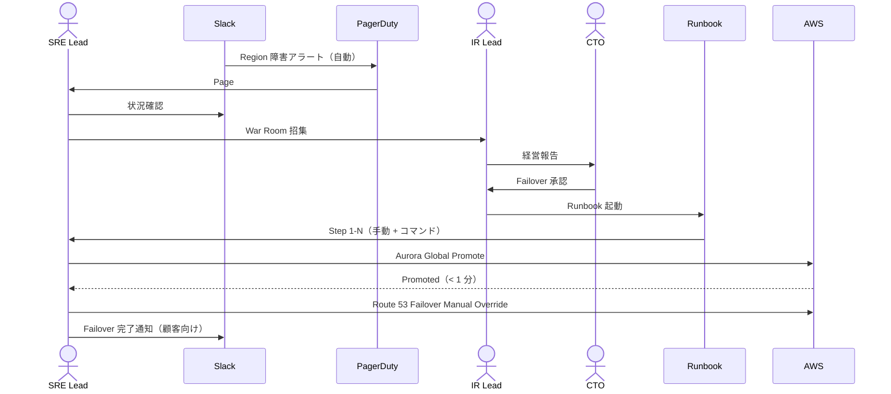

# ADR-051: Multi-Region DR / Failover 詳細設計（Aurora Global + KMS MRK + Keycloak Realm Replication）

- **ステータス**: Proposed（要件定義フェーズで Accepted に昇格予定）
- **日付**: 2026-06-23
- **関連**:
  - [ADR-033 Keycloak 2-tier アーキテクチャ](033-keycloak-2tier-broker-idp-architecture.md)
  - [ADR-039 中央集約 Network 専用アカウント](039-centralized-network-account-edge-layer.md)
  - [ADR-040 PAM / JIT 管理者権限管理](040-pam-jit-admin-privilege-management.md)
  - [ADR-044 Tabletop Exercise（Game Day 連動）](044-tabletop-exercise-incident-drill.md)
  - [ADR-045 鍵管理戦略集約（Multi-Region Key）](045-cryptographic-key-management-strategy.md)
  - [ADR-049 Vendor Risk Management（DORA 連動）](049-vendor-risk-management-tprm.md)
  - [§NFR-1 可用性](../requirements/proposal/nfr/01-availability.md)
  - [§NFR-5 DR](../requirements/proposal/nfr/05-dr.md)

---

## Context

### 背景

[§NFR-5 DR](../requirements/proposal/nfr/05-dr.md) では「RTO / RPO 要件」を抽象的に定義していたが、**具体的な Multi-Region 構成 + Failover 手順**は未定義のままだった。各 ADR で MRK / Cross-Region Replication への言及は散在していたが、**統合的な DR 戦略**として:

1. **Aurora Global Database** の採用判断（Read Replica vs Global vs Multi-AZ のみ）
2. **Keycloak Realm Replication** 戦略（Active-Active vs Active-Passive、Realm Export / Import 自動化）
3. **Network Acct（[ADR-039](039-centralized-network-account-edge-layer.md)）の Failover**（CloudFront / Route 53 / WAF）
4. **DynamoDB Global Tables**（ITDR / Adaptive Auth / Tenant Audit）
5. **S3 Cross-Region Replication**（監査ログ / SPA bundle / エラー / 案内画面 SPA）
6. **EKS Multi-Region**（Broker KC + IdP-KC 配置）
7. **Lambda + Step Functions** の Cross-Region 配置
8. **RTO / RPO 目標値**（Tier 別、規制業種顧客対応含む）
9. **Failover 自動化 vs 手動承認**（Split-Brain 防止）
10. **DR 訓練**（[ADR-044](044-tabletop-exercise-incident-drill.md) Game Day 連動）

### 規制要件

| 規制 | 関連条項 |
|---|---|
| **SOC 2 Type II A1.2** | システム可用性、Disaster Recovery プラン |
| **PCI DSS v4.0 §12.10.1** | インシデント対応 + BCP / DR |
| **ISO 27001 A.5.29-30** | 中断時の情報セキュリティ + ICT 継続性 |
| **ISO 22301** | BCMS（Business Continuity Management System）|
| **EU DORA**（2025/1）| 金融業 ICT Resilience（RTO/RPO 規制業種要件）|
| **金融庁 監督指針** | 重要システムの BCP + 訓練 |
| **NIST SP 800-34 Rev 1** | Contingency Planning Guide |
| **APPI 第 23 条** | 安全管理措置（事業継続）|

### 業界用語の整理

| 用語 | 意味 |
|---|---|
| **RTO**（Recovery Time Objective）| 復旧目標時間 |
| **RPO**（Recovery Point Objective）| データ損失許容時間 |
| **MTPD**（Maximum Tolerable Period of Disruption）| 最大許容停止時間 |
| **Active-Active** | 全リージョンで同時 Live、書込競合に注意 |
| **Active-Passive** | プライマリ + DR Standby、Failover 操作必要 |
| **Pilot Light** | 最小 Standby、Scale-up に時間 |
| **Warm Standby** | スケールダウン Standby |
| **Hot Standby** | フル Standby（最高速だが最高コスト）|
| **Aurora Global Database** | Cross-Region Replication（< 1 sec lag）、Managed Failover |
| **DynamoDB Global Tables** | Multi-Region Active-Active、Last-Writer-Wins |
| **Route 53 Health Check + Failover Routing** | DNS レベルの Failover |
| **Split-Brain** | 両 Region がプライマリと誤認、データ不整合 |
| **Failback** | プライマリ復旧後の元戻し |

---

## Decision

### 採用方針

**「Active-Passive Warm Standby + Region 単位 Failover + 自動化 80% + 手動承認 20%」**を採用。RTO 1 時間 / RPO 1 分を標準目標、規制業種顧客向けには Tier 1（RTO 30 分 / RPO 1 分）オプション提供。

| 項目 | 採用方針 |
|---|---|
| **プライマリ Region** | **ap-northeast-1（東京）** |
| **DR Region** | **ap-northeast-3（大阪）** |
| **Failover モデル** | **Active-Passive Warm Standby**（Active-Active は Split-Brain リスク、運用負荷大）|
| **RTO 標準** | **1 時間**（一般顧客）/ **30 分**（規制業種、Tier 1 オプション）|
| **RPO 標準** | **1 分**（Aurora Global Database / DynamoDB Global Tables 採用）|
| **MTPD** | 4 時間（業界標準）|
| **Aurora** | **Aurora Global Database 必須**（Broker DB / IdP-KC DB 両方）|
| **DynamoDB** | **Global Tables**（ITDR / Adaptive Auth / Tenant Admin Audit / DSAR Requests）|
| **S3** | **Cross-Region Replication**（監査ログ / SPA bundle / エラー / 案内画面 SPA / Export 一時保管）|
| **KMS** | **Multi-Region Keys (MRK)**（[ADR-045](045-cryptographic-key-management-strategy.md)）|
| **Keycloak** | **EKS 両 Region 配置、DR Region は Warm Standby（Scale 1 → Failover 時 Scale Up）** |
| **Realm 設定** | **GitOps + Realm Export 日次自動 → S3 → DR Region Import**（変更頻度低、十分）|
| **CloudFront** | **Multi-Origin Failover**（自動）+ 全 Acct 共通 |
| **Route 53** | **Health Check + Failover Routing**（DNS TTL 30 秒）|
| **EKS / Lambda / Step Functions** | **両 Region に IaC で配置**、DR Region は Replica 設定 |
| **Failover 自動化** | **Tier 0/1 障害は自動**（CloudFront Origin Failover / Route 53）/ **データ層は手動承認**（Split-Brain 防止）|
| **Failback** | **手動承認必須**、データ整合性確認後 |
| **DR 訓練** | **半期 Game Day**（[ADR-044](044-tabletop-exercise-incident-drill.md) S-07 シナリオ）|

---

## A. RTO / RPO 階層

### A.1 顧客 Tier 別目標

| 顧客 Tier | RTO | RPO | 適用条件 |
|---|---|---|---|
| **Tier 1 Premium**（規制業種）| **30 分** | **1 分** | 金融 / 医療 / 公的機関 / DORA 適用顧客 |
| **Tier 2 Standard**（一般 B2B）| **1 時間** | **1 分** | デフォルト |
| **Tier 3 Best Effort**（小規模）| **4 時間** | **15 分** | 試験運用 / PoC 顧客 |

### A.2 障害種別 × RTO/RPO

| 障害種別 | 影響範囲 | Failover 手段 | RTO | RPO |
|---|---|---|---|---|
| **単一 AZ 障害** | 1 AZ | Multi-AZ 自動 | < 1 分 | 0 |
| **EKS Cluster 障害** | Pod 全停止 | Auto-scaling 復旧 | 5-15 分 | 0 |
| **Aurora Primary 障害** | DB 書込不可 | Aurora Multi-AZ Failover | < 1 分 | 0 |
| **Keycloak Realm 破損** | 認証不可 | Realm Export Restore + 手動 | 30 分 - 2 時間 | 24 時間（日次 Export）|
| **Region 完全障害** | 全停止 | DR Region Failover（手動承認）| 30 分 - 1 時間 | < 1 分 |
| **CloudFront 障害**（[ADR-039](039-centralized-network-account-edge-layer.md)）| 全 Inbound 停止 | Origin Failover / DNS Failover | 5-15 分 | 0 |
| **KMS Region 障害** | 暗号化操作不可 | MRK Cross-Region | < 1 分 | 0 |
| **DDoS** | 性能低下 | Shield + WAF Rate Limit | リアルタイム | 0 |
| **Ransomware** | データ破壊 | Backup Restore + 監査 | 4-24 時間 | 〜24 時間 |

---

## B. データ層 DR 設計

### B.1 Aurora Global Database

```mermaid
flowchart TB
    subgraph Primary["プライマリ ap-northeast-1"]
        AuroraP[Aurora Primary Writer<br/>+ Reader x 2]
    end

    subgraph DR["DR ap-northeast-3"]
        AuroraDR[Aurora Secondary<br/>Read-Only<br/>Reader x 1（Warm）]
    end

    AuroraP -.|< 1 sec lag<br/>Storage-level Replication| AuroraDR

    subgraph Failover["Failover 時"]
        AuroraDRPromoted[Aurora Secondary<br/>→ Promoted to Primary<br/>RTO < 1 分（Managed Failover）]
        AuroraDR -.|Promote| AuroraDRPromoted
    end

    style Primary fill:#fff3e0
    style DR fill:#e3f2fd
    style Failover fill:#ffcdd2
```

#### 設定（Terraform 例）

```hcl
resource "aws_rds_global_cluster" "keycloak_idp" {
  global_cluster_identifier = "keycloak-idp-global"
  engine                    = "aurora-postgresql"
  engine_version            = "16.4"
  database_name             = "keycloak"
  storage_encrypted         = true
}

# プライマリ Region
resource "aws_rds_cluster" "primary" {
  provider                  = aws.tokyo
  cluster_identifier        = "keycloak-idp-primary"
  global_cluster_identifier = aws_rds_global_cluster.keycloak_idp.id
  engine                    = "aurora-postgresql"
  engine_version            = "16.4"
  kms_key_id                = aws_kms_key.auth_aurora_mrk.arn  # MRK (ADR-045)
  master_username           = "keycloak_admin"
  manage_master_user_password = true
  backup_retention_period   = 35
  preferred_backup_window   = "16:00-17:00"
}

# DR Region
resource "aws_rds_cluster" "secondary" {
  provider                  = aws.osaka
  cluster_identifier        = "keycloak-idp-secondary"
  global_cluster_identifier = aws_rds_global_cluster.keycloak_idp.id
  engine                    = "aurora-postgresql"
  engine_version            = "16.4"
  kms_key_id                = aws_kms_alias.auth_aurora_mrk_osaka.arn  # 同 MRK の Osaka エイリアス
  depends_on                = [aws_rds_cluster.primary]
}
```

#### 月額コスト試算（10M MAU）

| 項目 | プライマリ | DR | 月額 |
|---|---|---|---|
| Aurora db.r7g.xlarge × 3（Primary Writer + 2 Reader）| ✅ | — | $1,500 |
| Aurora db.r7g.xlarge × 1（DR Reader、Warm）| — | ✅ | $500 |
| ストレージ | 1 TB | 1 TB（同期）| $200 |
| Cross-Region Data Transfer | — | 10 GB/日 想定 | $80 |
| **合計** | | | **〜$2,280/月** |

### B.2 DynamoDB Global Tables

```hcl
resource "aws_dynamodb_table" "itdr_history" {
  name             = "itdr-login-history"
  billing_mode     = "PAY_PER_REQUEST"
  stream_enabled   = true
  stream_view_type = "NEW_AND_OLD_IMAGES"

  hash_key  = "user_id"
  range_key = "timestamp"

  attribute { name = "user_id"; type = "S" }
  attribute { name = "timestamp"; type = "S" }

  server_side_encryption {
    enabled     = true
    kms_key_arn = aws_kms_key.auth_dynamodb_mrk.arn  # MRK
  }

  replica {
    region_name = "ap-northeast-3"  # Osaka DR
    kms_key_arn = aws_kms_alias.auth_dynamodb_mrk_osaka.arn
  }
}
```

#### 注意点

- **書込競合**：Last-Writer-Wins、ITDR / Adaptive Auth は append-only なので競合最小
- **eventually consistent**：通常数秒以内、Region 間 lag < 1 sec
- **コスト**：Replica 分のストレージ + Cross-Region 転送

### B.3 S3 Cross-Region Replication

```hcl
resource "aws_s3_bucket_replication_configuration" "audit_logs" {
  bucket = aws_s3_bucket.audit_logs.id
  role   = aws_iam_role.replication.arn

  rule {
    id     = "audit-logs-to-osaka"
    status = "Enabled"
    filter { prefix = "" }

    source_selection_criteria {
      sse_kms_encrypted_objects { status = "Enabled" }
    }

    destination {
      bucket        = aws_s3_bucket.audit_logs_dr.arn
      storage_class = "STANDARD"
      encryption_configuration {
        replica_kms_key_id = aws_kms_key.audit_logs_mrk_osaka.arn
      }
      replica_modifications {
        status = "Enabled"  # メタデータ変更も Replication
      }
      metrics {
        status = "Enabled"
        event_threshold { minutes = 15 }
      }
    }
  }
}
```

| バケット | RPO 目標 |
|---|---|
| 監査ログ（[ADR-040 / 045](045-cryptographic-key-management-strategy.md)）| 15 分（CRR デフォルト 99%）|
| SPA bundle（アカウント設定画面 / サービス選択画面 / ユーザ管理画面 / Sorry）| 即時（デプロイ時両 Region）|
| DSAR Export 一時保管 | 15 分 |
| Glacier 長期保管 | 24 時間（コスト最適化）|

---

## C. Keycloak Realm Replication

### C.1 戦略選定

| 案 | 評価 | 採否 |
|---|---|---|
| **A. Active-Active**（両 Region で同時 Live、Aurora Global で同期）| データ整合性課題、Split-Brain リスク大 | ❌ |
| **B. Active-Passive + Aurora Global**（本 ADR）| RTO 30 分 - 1 時間、業界標準 | ✅ 採用 |
| **C. Keycloak External-Site Replication**（Keycloak ネイティブ Cross-DC）| 設計複雑、運用負荷大、適用例少ない | ❌ |
| **D. DB 同期のみ、Realm Export なし** | Realm 設定変更追跡困難 | ❌ |

### C.2 Realm 設定 + データの DR

| 項目 | 同期方式 | 頻度 | RPO |
|---|---|---|---|
| **User データ**（IdP-KC ユーザー全件）| **Aurora Global Database** | リアルタイム | < 1 分 |
| **Realm 設定**（Clients / IdP / Authentication Flow 等）| **GitOps**（Realm Export → S3 → DR Import）+ Terraform で IaC | 日次 / 変更時即時 | 24 時間 |
| **JWT 署名鍵 / 暗号化鍵** | **KMS MRK**（[ADR-045](045-cryptographic-key-management-strategy.md)）| リアルタイム | 0 |
| **Session データ**（Infinispan）| **失効許容**（再ログイン要求）| — | — |

### C.3 Realm 設定の GitOps（IaC）

```hcl
# Terraform + keycloak provider（Phase Two 等）
resource "keycloak_realm" "customer_acme" {
  realm                   = "acme"
  display_name            = "Acme Corporation"
  login_with_email_allowed = true
  registration_allowed    = false
  remember_me             = false
  # ... 全 Realm 設定を IaC 化
}

resource "keycloak_oidc_identity_provider" "acme_entra" {
  realm             = keycloak_realm.customer_acme.realm
  alias             = "acme-entra"
  provider_id       = "oidc"
  authorization_url = "https://login.microsoftonline.com/tenant-id/oauth2/v2.0/authorize"
  # ...
}
```

両 Region で同一 Terraform State で適用 → Realm 設定が両 Region 一致。

### C.4 Session データの DR 戦略

Keycloak の Infinispan Session キャッシュは Region 間同期しない。Failover 時:
- **Access Token / Refresh Token は失効許容**（顧客は再ログイン）
- **WebAuthn Resident Key は永続**（Aurora 経由で DR Region でも有効）
- **TOTP Secret は永続**（同上）
- → 「再ログインのみで業務再開可能」と顧客に説明

---

## D. Network Acct（ADR-039）の Failover

### D.1 CloudFront Multi-Origin Failover

```mermaid
flowchart TB
    User[ユーザー]
    R53[Route 53<br/>Health Check + Failover Routing<br/>TTL 30 秒]
    CFP[CloudFront Distribution<br/>Primary]
    CFD[CloudFront Distribution<br/>DR(同設定)]

    subgraph Auth1["プライマリ ap-northeast-1"]
        ALBP[ALB（Auth）]
        EKSP[EKS Keycloak<br/>Replicas 6]
    end

    subgraph Auth2["DR ap-northeast-3"]
        ALBD[ALB（Auth DR）]
        EKSD[EKS Keycloak<br/>Replicas 1 → 6（Failover）]
    end

    User --> R53
    R53 -->|Health OK| CFP
    R53 -.Failover.-> CFD
    CFP --> ALBP
    CFP -.|Origin Failover| ALBD
    CFD --> ALBD
    ALBP --> EKSP
    ALBD --> EKSD

    style Auth1 fill:#fff3e0
    style Auth2 fill:#e3f2fd
```

#### CloudFront Origin Group

```hcl
resource "aws_cloudfront_distribution" "auth" {
  origin_group {
    origin_id = "auth-group"
    failover_criteria {
      status_codes = [403, 404, 500, 502, 503, 504]
    }
    member { origin_id = "primary-alb" }
    member { origin_id = "dr-alb" }
  }
  # ...
}
```

### D.2 Route 53 Health Check + Failover

```hcl
resource "aws_route53_health_check" "auth_primary" {
  fqdn              = "auth-primary.basis.example.com"
  port              = 443
  type              = "HTTPS"
  resource_path     = "/health"
  failure_threshold = 3
  request_interval  = 10
}

resource "aws_route53_record" "auth" {
  zone_id = data.aws_route53_zone.basis.zone_id
  name    = "auth.basis.example.com"
  type    = "A"

  failover_routing_policy { type = "PRIMARY" }
  set_identifier  = "primary"
  health_check_id = aws_route53_health_check.auth_primary.id

  alias {
    name                   = aws_cloudfront_distribution.auth.domain_name
    zone_id                = aws_cloudfront_distribution.auth.hosted_zone_id
    evaluate_target_health = false
  }
}

resource "aws_route53_record" "auth_secondary" {
  # ... SECONDARY type で DR CloudFront を指す
}
```

### D.3 WAF / Shield / Turnstile の DR

| サービス | DR 戦略 |
|---|---|
| **AWS WAF**（[ADR-039](039-centralized-network-account-edge-layer.md)）| グローバル（CLOUDFRONT scope）、Region 障害の影響なし |
| **AWS Shield Advanced** | グローバル |
| **Cloudflare Turnstile**（[ADR-042](042-bot-detection-captcha.md)）| Cloudflare 側で Multi-Region、本基盤側 Failover 不要 |
| **Lambda@Edge** | グローバル分散実行 |
| **AWS WAF Captcha**（Turnstile フォールバック）| グローバル |

---

## E. Failover 自動化 vs 手動承認

### E.1 自動化基準

| 障害種別 | 自動 / 手動 | 理由 |
|---|---|---|
| 単一 AZ / Multi-AZ Failover | **自動** | AWS Managed |
| Aurora Primary Failover（同 Region 内）| **自動** | RDS Managed |
| CloudFront Origin Failover（同 Acct）| **自動** | CloudFront Managed |
| Route 53 Health Check Failover | **自動** | DNS レベル |
| Pod / Container 自動復旧 | **自動** | EKS Managed |
| **Aurora Global Promote（Cross-Region）** | **手動承認** | Split-Brain 防止 |
| **DR Region 全体 Failover** | **手動承認** | 影響範囲大 |
| **Realm 設定 Restore（破損時）** | **手動承認** | 誤動作 Restore 防止 |
| **Failback**（プライマリ復旧後） | **手動承認** | データ整合性確認後 |

### E.2 手動承認フロー（Aurora Cross-Region Promote 例）



### E.3 Runbook の事前準備

| Runbook | 内容 |
|---|---|
| **RB-DR-01 Aurora Global Promote** | Step by Step + コマンド + ロールバック手順 |
| **RB-DR-02 Route 53 Manual Failover** | Health Check Override + TTL 短縮 |
| **RB-DR-03 EKS DR Region Scale Up** | Replica 1 → 6 + 動作確認 |
| **RB-DR-04 Keycloak Realm Restore** | Latest Export from S3 + Import + 設定検証 |
| **RB-DR-05 Failback** | DR → Primary 切戻し（データ整合性確認後）|

各 Runbook は Git 管理 + 演習で動作検証（[ADR-044](044-tabletop-exercise-incident-drill.md) Game Day）。

---

## F. DR 訓練（Game Day、ADR-044 連動）

### F.1 演習スケジュール

| 演習 | 頻度 | 内容 |
|---|---|---|
| **S-07 Region 障害**（[ADR-044](044-tabletop-exercise-incident-drill.md)）| 半期 | Tokyo 完全停止想定、Osaka へ Failover、RTO/RPO 計測 |
| **S-08 Aurora 破壊**（Ransomware 想定）| 年 1 | Backup Restore + 監査 |
| **RB-DR-01〜05 Runbook 検証** | 半期 | 各 Runbook が動作可能か検証 |
| **Failback 訓練** | 半期 | 切戻し手順の検証 |

### F.2 評価 KPI

| KPI | 目標 |
|---|---|
| 演習 RTO 達成率 | 90%+ |
| 演習 RPO 達成率 | 100% |
| Runbook 完走率 | 100% |
| AAR Action Items 90 日完了率 | 100% |

---

## G. コスト試算

### G.1 月額（10M MAU、DR 込）

| 項目 | プライマリ単独 | DR 込 | 差額 |
|---|---|---|---|
| Aurora（Primary Writer + 2 Reader + DR Reader 1）| $1,500 | $2,000 | +$500 |
| Aurora Storage + Cross-Region | $200 | $280 | +$80 |
| DynamoDB Global Tables（Replica）| $500 | $750 | +$250 |
| S3 Cross-Region Replication | $30 | $100 | +$70 |
| EKS（DR Warm Standby、Replica 1 で待機）| $500 | $700 | +$200 |
| Route 53 Health Check | $0 | $20 | +$20 |
| Lambda + Step Functions（両 Region 配置）| $300 | $400 | +$100 |
| KMS MRK | $250 | $400 | +$150 |
| Network Acct 共通 | $500 | $500 | $0 |
| **合計** | **〜$3,780/月** | **〜$5,150/月** | **+$1,370/月** |

→ **DR 追加コスト 約 30% 増**（業界標準範囲）。

### G.2 規制業種 Tier 1（RTO 30 分）追加コスト

| 項目 | 追加 |
|---|---|
| EKS DR Region Hot Standby（Replica 6） | +$2,000/月 |
| Aurora DR Reader 増（× 2）| +$500/月 |
| **Tier 1 追加合計** | **+$2,500/月** |

---

## H. RTO/RPO 達成シミュレーション

### H.1 Tokyo 完全障害シナリオ

| 時刻 | イベント | 累計 RTO |
|---|---|---|
| T+0 | AWS Tokyo Region 完全停止検知 | 0 分 |
| T+1 分 | CloudFront Health Check Fail → DR Origin に自動 Failover | 1 分（部分復旧 = SPA / 静的）|
| T+3 分 | PagerDuty Alert → SRE Lead Page | — |
| T+10 分 | War Room 招集 + CTO 承認取得 | — |
| T+15 分 | Runbook RB-DR-01 起動：Aurora Global Promote | — |
| T+16 分 | Aurora Secondary → Primary 昇格完了（< 1 分）| — |
| T+20 分 | Runbook RB-DR-03 起動：EKS DR Replica Scale Up 1 → 6 | — |
| T+30 分 | EKS Scale Up 完了 + 動作確認 | — |
| T+35 分 | Route 53 Manual Failover Override + TTL 短縮 | — |
| T+40 分 | DNS 伝播完了（TTL 30 秒）| 40 分（**Tier 2 目標 60 分内達成**）|

→ Tier 2 RTO 1 時間目標は十分達成可能。

### H.2 Tier 1 Hot Standby なら

| 時刻 | イベント | 累計 RTO |
|---|---|---|
| T+0 | 障害検知 | 0 |
| T+10 分 | 承認 + Runbook | — |
| T+15 分 | Aurora Promote + Route 53 Failover | — |
| T+25 分 | DNS 伝播完了 | **25 分（Tier 1 目標 30 分内達成）**|

---

## I. 代替案検討

| 案 | 評価 | 採否 |
|---|---|---|
| **A. Multi-AZ のみ、DR なし** | Region 障害で全停止、規制違反 | ❌ |
| **B. Active-Active Multi-Region** | Split-Brain リスク大、運用負荷大 | ❌ |
| **C. Active-Passive Warm Standby + Aurora Global**（本 ADR）| 業界標準、RTO/RPO 達成 | ✅ 採用 |
| **D. Pilot Light（最小 Standby）** | RTO 数時間、Tier 2 目標未達 | ❌ |
| **E. Hot Standby 常時 6 Replicas** | コスト 2 倍、Tier 1 のみ採用 | △ Tier 1 オプション |
| **F. Cross-Cloud DR（AWS + GCP）** | 運用負荷膨大、Lock-in 緩和効果限定 | ❌ |
| **G. Backup-only Restore** | RPO 数時間、Tier 2 目標未達 | ❌ |

---

## J. Consequences

### Positive

- **SOC 2 A1.2 / PCI DSS §12.10 / ISO 22301 / DORA を 1 つの設計で同時充足**
- **Tier 2 RTO 1 時間 / RPO 1 分**（標準）+ **Tier 1 RTO 30 分**（規制業種オプション）
- **Aurora Global Database + DynamoDB Global Tables + S3 CRR + KMS MRK**で完全 Cross-Region
- **CloudFront Multi-Origin Failover** + **Route 53 Failover** で自動化 80%
- Realm 設定 GitOps + Realm Export 日次自動で**設定変更も両 Region 同期**
- DR 訓練（半期 Game Day）で**Runbook 実効性検証**

### Negative

- **DR 追加コスト 約 30% 増**（月 +$1,370）
- Tier 1 Hot Standby は更に +$2,500/月
- **Active-Active 不採用**で書込競合の不安定さは回避するが、DR 切替に手動承認必要
- **Failback の運用負荷**（プライマリ復旧後のデータ整合性確認）
- Keycloak Realm Export RPO 24 時間（設定変更分のみ、ユーザーデータは Aurora で RPO 1 分）

### Neutral

- Active-Active は将来の Phase 4 候補（Keycloak Cross-DC 機能が成熟次第）
- 顧客個別 Region 要件（EU 顧客の eu-west-1 等）は別途検討、本 ADR は国内顧客前提

### 我々のスタンス

| 基本方針の柱 | DR 設計での実現 |
|---|---|
| **絶対安全** | Multi-Region Active-Passive + 規制適合 + 半期演習 |
| **どんなアプリでも** | 全アプリ層が DR Region で稼働可能、Failover 透明 |
| **効率よく認証** | Aurora Global で RPO 1 分、再ログイン許容で UX 影響最小 |
| **運用負荷・コスト最小** | Active-Passive で運用負荷最小、コスト +30% で業界標準 |

---

## 参考資料

### AWS / 業界

- [AWS Disaster Recovery of Workloads on AWS](https://docs.aws.amazon.com/whitepapers/latest/disaster-recovery-workloads-on-aws/disaster-recovery-workloads-on-aws.html)
- [AWS Well-Architected Reliability Pillar](https://docs.aws.amazon.com/wellarchitected/latest/reliability-pillar/welcome.html)
- [Aurora Global Database](https://docs.aws.amazon.com/AmazonRDS/latest/AuroraUserGuide/aurora-global-database.html)
- [DynamoDB Global Tables](https://docs.aws.amazon.com/amazondynamodb/latest/developerguide/GlobalTables.html)
- [Route 53 Health Checks and DNS Failover](https://docs.aws.amazon.com/Route53/latest/DeveloperGuide/dns-failover.html)
- [CloudFront Origin Failover](https://docs.aws.amazon.com/AmazonCloudFront/latest/DeveloperGuide/high_availability_origin_failover.html)
- [AWS Game Days](https://aws.amazon.com/gameday/)

### Keycloak

- [Keycloak Cross-DC Setup](https://www.keycloak.org/server/caching)
- [Keycloak Backup & Restore](https://www.keycloak.org/server/importExport)

### 規制 / フレームワーク

- [SOC 2 Type II A1.2 — System Availability](https://www.aicpa-cima.com/)
- [ISO 22301 Business Continuity](https://www.iso.org/standard/75106.html)
- [ISO 27001 A.5.29-30 ICT 継続性](https://www.iso.org/)
- [EU DORA Regulation](https://www.eiopa.europa.eu/digital-operational-resilience-act-dora_en)
- [NIST SP 800-34 Rev 1 Contingency Planning Guide](https://csrc.nist.gov/publications/detail/sp/800-34/rev-1/final)
- [PCI DSS v4.0 §12.10 IR + BCP](https://www.pcisecuritystandards.org/document_library/)
