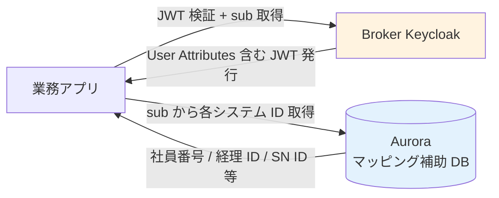
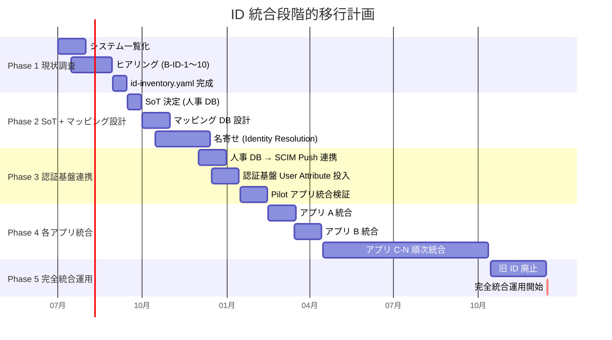

# ADR-054: ID 統合戦略（現状調査 + SoT 決定 + マッピング DB 設計 + 段階的移行プロセス）

- **ステータス**: Proposed（要件定義フェーズで Accepted に昇格予定）
- **日付**: 2026-06-24
- **関連**:
  - [ADR-018 ユーザー識別子 3 階層戦略](018-user-identifier-3layer-emailless.md)（識別子モデル）
  - [ADR-019 既存システムからの移行戦略](019-existing-system-migration.md)（移行全般）
  - [ADR-029 利用者カテゴリ](029-local-user-categories-and-scope-scenarios.md)（P-1〜P-4）
  - [ADR-037 Shared Responsibility Model + 軽量 IGA](037-shared-responsibility-and-lightweight-iga.md)
  - **[ADR-055 HRD 実装方式選定](055-hrd-implementation-method-selection.md)（2026-06-29 連動：ログイン ID は `<tenant>-<userid>` 形式、最初のハイフン前が Keycloak Organization alias）**
  - [§FR-1.2.0.D ユーザー識別子戦略](../requirements/proposal/fr/01-auth.md#fr-120d-ユーザー識別子戦略--メール非保有顧客独自-id-への対応)
  - [§FR-1.2.0.E 既存システムからの混在モデル移行戦略](../requirements/proposal/fr/01-auth.md#fr-120e-既存システムからの混在モデル移行戦略ローカル--フェデ併存からの集約)

---

## Context

### 背景

ユーザー設計レビュー：「**ID 統合についてもどこかでまとめたい。メールアドレスは使えず、現行はいろんなシステムでIDが違うので、まとめるところから必要らしい**」

[ADR-018](018-user-identifier-3layer-emailless.md) で識別子の**3 階層モデル**（Layer A `sub` / Layer B `external_id` / Layer C IdP `sub`）は確定済だが、これは「**認証基盤内部の識別子モデル**」。実際に現行システム群を**どう統合するか**の戦略・プロセスは未定義のまま残されていた。

### 現状の課題

各業務システムが**独自の ID 体系**を持っており、同じ人物でもシステム間で ID が異なる:

| システム例 | ID 体系例 |
|---|---|
| 人事システム | `EMP-001234`（社員番号）|
| 経理システム | `K-12345`（経理独自）|
| 業務システム A | `user_abc@app-a.local`（メアド風）|
| 業務システム B | `00001234`（数字 8 桁）|
| ServiceNow | `sys_user.user_name`（独自）|
| AD / LDAP | `sAMAccountName`（ドメイン ID）|
| メールシステム | `firstname.lastname@company.com` |

**問題**:
1. 同一人物が複数 ID を持つ（**名寄せ不可能**）
2. 退職時に全システムで個別に無効化が必要（**漏れリスク**）
3. 監査時に「この人物がどのシステムで何をしたか」を横断追跡できない
4. **メアド不可問題**（後述）でメアドを統合キーにできない

### メアド不可の理由（ヒアリング前提）

| 理由 | 影響 |
|---|---|
| **部署メアド共有**（営業部 `sales@xxx`）| 個人特定不可、複数人で 1 メアド |
| **取引先メアド共有**（クライアントとの共同メアド）| 認証 ID として使えない |
| **退職後引継ぎ**（前任者メアドを後任が継続使用）| 認証 ID 重複 / 一意性崩壊 |
| **個人メアド持たない従業員**（製造現場 / 派遣 / 短期）| メアド自体存在しない |
| **メアド変更頻度**（結婚 / 部署異動）| ID 安定性なし |
| **複数メアド保有**（個人 / 仕事 / 取引先別）| どれが「正」か不明 |

→ **メアドを統合 ID にできない** = **別の安定識別子（Layer A `sub` / Layer B `external_id`）が必要**。

### Why 本 ADR が必要

| 既存 ADR / §FR | 扱う内容 | 本 ADR の補完 |
|---|---|---|
| ADR-018 / §FR-1.2.0.D | 識別子の 3 階層**モデル** | 現実の**実装プロセス** |
| ADR-019 / §FR-1.2.0.E | 既存システム**全体**の移行戦略 | **ID 統合**に特化 |
| ADR-029 | 利用者**カテゴリ**（P-1〜P-4）| 各カテゴリの ID 統合扱い |

→ 本 ADR は「**現実の現行 ID をどう統合するか**」のプロセス・戦略を定義。

### 業界用語の整理

| 用語 | 意味 |
|---|---|
| **SoT**（Source of Truth）| 人物マスターとなる権威ある情報源 |
| **Identity Resolution** | 複数 ID を同一人物に名寄せするプロセス |
| **Identity Mapping**（ID マッピング）| 統合 ID と各システム ID の対応関係 |
| **HRIS**（Human Resources Information System）| 人事情報システム（多くの IDM の SoT）|
| **JML Process**（Joiner / Mover / Leaver）| 入社 / 異動 / 退職プロセス |
| **Identity Lifecycle Management** | ユーザー作成から削除までの全プロセス |
| **JIT Provisioning** | 初回ログイン時の自動作成 |
| **SCIM 2.0** | ユーザーライフサイクル同期の業界標準プロトコル |
| **IGA**（Identity Governance & Administration）| ID 統制・運用ツール群 |
| **Identity Stitching** | 複数 ID を統合する技術手法 |

---

## Decision

### 採用方針

**「3 段階 ID 統合戦略 + 人事 DB を SoT + マッピング DB を認証基盤内に集約」**を採用。Phase 1 は現状調査、Phase 2 で SoT 決定 + マッピング DB 構築、Phase 3 で認証基盤連携、Phase 4-5 で各アプリ統合。

### 主要判断

| 判断ポイント | 採用 | 理由 |
|---|---|---|
| **SoT** | **人事 DB（HRIS）が SoT**、認証基盤は参照側 | 人物マスター = 人事システムが業界標準（Workday / SAP SuccessFactors 等同パターン）|
| **統合 ID** | **Layer A `sub`（Keycloak UUID）**を主、**Layer B `external_id`（社員番号）** を補助 | ADR-018 と整合、ID 変更不要時は `sub` で十分 |
| **マッピング DB 配置** | **認証基盤内（Keycloak User Attribute + 補助 DynamoDB）** | 認証時参照頻度高、外部 DB だと latency 増 |
| **メアド統合 ID 化** | **しない**（識別子としては使わない、表示用のみ）| 上記「メアド不可」の問題 |
| **初期マッピング** | **人事 DB から SCIM Push（推奨）** or **CSV 一括 Import** | 自動化推奨、規模次第 |
| **新規ユーザー登録** | **人事 DB → SCIM Push → 認証基盤 → 各アプリ JIT** | 人事システムが起点 |
| **既存 ID の扱い** | **段階移行**（旧 ID と新 ID を一定期間並走、各アプリ側で順次切替）| Big Bang 移行は破綻リスク |
| **退職時** | **人事 DB → SCIM Push（無効化）→ 認証基盤 → 全アプリ波及** | JML Process 自動化 |

---

## A. 現状調査プロセス（Phase 1）

### A.1 現状調査ヒアリング項目

各システムについて以下を整理:

| 項目 | 内容 | ヒアリング ID |
|---|---|---|
| **システム一覧** | 認証対象システム全リスト（業務 / 管理 / 監視 / 外部 SaaS）| **B-ID-1** |
| **各システムの ID 体系** | 例：人事 `EMP001` / 経理 `K-12345` / 業務 A `user_abc` | **B-ID-2** |
| **ID 生成元** | 自動採番 / 人事システム / 各システム独自 / 申請ベース | **B-ID-3** |
| **ID 変更頻度** | 変わらない / 部署異動で変わる / 退職時に消える | **B-ID-4** |
| **人事 DB の存在** | あり（製品名 / 自社開発）/ なし | **B-ID-5** |
| **人事 DB の SoT 適格性** | 全従業員カバー / 一部のみ / 派遣 / 業務委託は別管理 | **B-ID-6** |
| **メアド体系** | 個人別 / 部署別共有 / 持たない人あり | **B-ID-7** |
| **SSO 現状** | 一部システムは SSO 済 / 全システム個別ログイン | **B-ID-8** |
| **既存 IDM 製品** | あり（製品名）/ なし | **B-ID-9** |
| **JML プロセス** | 自動化（人事 DB → 各システム）/ 手動申請 | **B-ID-10** |

### A.2 現状マッピング表テンプレ

ヒアリング結果を以下のテンプレで整理:

```yaml
# id-inventory.yaml（Git 管理）
systems:
  - name: 人事システム（HRIS）
    id_format: "EMP-XXXXXX"（6 桁数字）
    id_source: 入社時に人事部が手動採番
    id_change: なし（退職後も歴史的保持）
    unique_per_person: ✅ 1 人 1 ID
    sot_candidate: ✅ 第一候補

  - name: 経理システム
    id_format: "K-XXXXX"（5 桁数字）
    id_source: 経理部独自採番
    id_change: 部署異動で変更あり
    unique_per_person: ✅
    sot_candidate: ❌

  - name: 業務システム A（経費精算）
    id_format: "user_xxx@app-a.local"（メアド風）
    id_source: 申請時に IT 部が採番
    id_change: なし
    unique_per_person: ✅
    sot_candidate: ❌

  - name: ServiceNow
    id_format: sys_user.user_name（社員番号風）
    id_source: 人事 DB から同期（自動）
    id_change: 退職時に inactive 化
    unique_per_person: ✅
    sot_candidate: △ 人事 DB に従う

  - name: メールシステム
    id_format: firstname.lastname@company.com
    id_source: IT 部
    id_change: 結婚 / 部署異動で変更あり
    unique_per_person: ⚠ 部署メアド共有あり
    sot_candidate: ❌
```

### A.3 Identity Resolution（名寄せ）

現状で**同一人物の異 ID を名寄せ**する作業:

```yaml
# identity-mapping-initial.yaml（手動 or 半自動）
people:
  - canonical_id: PERSON-00001  # 統合 ID（Keycloak UUID 候補）
    name: 山田太郎
    primary_email: yamada@company.com  # 表示用、認証 ID ではない
    system_ids:
      hr: EMP-001234
      accounting: K-12345
      app_a: user_yamada_t@app-a.local
      servicenow: yamada.t
      ad: yamada.t

  - canonical_id: PERSON-00002
    name: 佐藤花子
    primary_email: sato@company.com
    system_ids:
      hr: EMP-001235
      accounting: K-12346
      app_a: user_sato_h@app-a.local
      servicenow: sato.h
      ad: sato.h
```

名寄せ手法:
- **氏名 + 部署 + 入社年月** で突合（人事 DB 起点）
- **手動 Review**（同姓同名 / 異字体 / 中途入社等のエッジケース）
- **既存 SSO 履歴**（既に SSO 済システム間は対応済）

---

## B. SoT 決定（Phase 2）

### B.1 SoT 候補比較

| 候補 | メリット | デメリット | 採用 |
|---|---|---|---|
| **A. 人事 DB（HRIS）**（推奨）| 全従業員網羅 / JML Process 起点 / 入社・退職の権威 | 派遣 / 業務委託 / 取引先は別管理 | ✅ **採用** |
| B. 認証基盤（Keycloak）SoT | 認証統合と一体化 | 人事側の変更を能動的に取り込めない | ❌ |
| C. 新規 IGA 製品（Okta / SailPoint）導入 | 業界標準フル機能 | 年 $100K+ コスト、過剰 | ❌ Phase 2+ 検討 |
| D. 新規 ID 統合 DB（独自）構築 | 柔軟設計 | 開発・保守コスト大、車輪の再発明 | ❌ |

### B.2 人事 DB 不在 / 不適格時の代替

- **派遣 / 業務委託 / 取引先**：別マスター（弊社運用 or Tenant Admin Portal 経由で顧客側登録）
- **人事 DB が部分カバー**：人事 DB + 補助マスター（Keycloak 内 User Attribute）併用

### B.3 SoT 連携プロトコル

| 連携方式 | 採用判断 |
|---|---|
| **SCIM 2.0 Push**（人事 DB → Keycloak）| ✅ **推奨**（業界標準、Joiner / Mover / Leaver 全対応）|
| 定期バッチ（夜間 CSV 同期）| △ レガシー、リアルタイム性なし |
| 人事 DB API + 認証基盤側 Pull | △ 認証基盤側に責任過大 |
| Manual（人事担当が画面操作）| ❌ 規模拡大不可 |

→ **SCIM 2.0 Push 強く推奨**。人事 DB が SCIM 非対応なら **アダプター Lambda** を介して SCIM 化。

---

## C. マッピング DB 設計（Phase 2-3）

### C.1 マッピング DB 配置

| 配置 | メリット | デメリット | 採用 |
|---|---|---|---|
| **A. Keycloak User Attribute**（推奨）| 認証時に同時取得、追加 DB 不要 | 属性数増で性能微低下 | ✅ **採用、主**|
| **B. Aurora 内補助テーブル** | 大量属性可、柔軟 | Keycloak から別取得必要 | ✅ **補助**（多くの ID マッピング時）|
| C. DynamoDB | 高速 K-V | Keycloak から別取得 | △ Phase 2 候補 |
| D. 外部 IGA 製品 | 業界標準 | $$$、過剰 | ❌ |

### C.2 Keycloak User Attribute スキーマ

```json
{
  "id": "550e8400-e29b-41d4-a716-446655440000",  // Layer A sub
  "username": "EMP-001234",  // Layer B external_id（社員番号、ログイン ID）
  "email": "yamada@company.com",  // 表示用、認証 ID ではない
  "firstName": "太郎",
  "lastName": "山田",
  "attributes": {
    "hr_employee_id": "EMP-001234",
    "accounting_id": "K-12345",
    "app_a_user_id": "user_yamada_t@app-a.local",
    "servicenow_user_id": "yamada.t",
    "ad_sam_account": "yamada.t",
    "department": "営業部",
    "hire_date": "2020-04-01",
    "employee_type": "正社員"  // 正社員 / 派遣 / 業務委託 / 取引先
  }
}
```

### C.3 マッピング DB アクセスパターン



→ **アプリは JWT の `sub` から、自分が必要なシステム ID を取得**できる構造。

### C.4 マッピング DB の更新フロー

| イベント | フロー |
|---|---|
| **新規入社** | 人事 DB → SCIM Push → Keycloak User 作成 + User Attribute セット → 各アプリ JIT で参照 |
| **部署異動** | 人事 DB → SCIM Push → Keycloak User Attribute 更新 |
| **退職** | 人事 DB → SCIM Push（active=false）→ Keycloak ユーザー無効化 → 全アプリで認可遮断 |
| **アプリ側 ID 変更**（経理 ID 等）| Tenant Admin Portal / アプリ側 → Admin REST API → Keycloak User Attribute 更新 |

---

## D. 段階的移行プロセス（Phase 2-5）

### D.1 5 Phase 移行計画



### D.2 Phase 別詳細

| Phase | 内容 | 期間 |
|---|---|---|
| **Phase 1** | 現状調査（ヒアリング + id-inventory.yaml 完成）| 3 ヶ月 |
| **Phase 2** | SoT 決定 + マッピング DB 設計 + Identity Resolution（名寄せ）| 3 ヶ月 |
| **Phase 3** | 人事 DB → SCIM Push 連携 + 認証基盤 User Attribute 投入 + Pilot 検証 | 2 ヶ月 |
| **Phase 4** | 各アプリ統合（1 アプリあたり 1 ヶ月、並列可、N アプリ）| 半年〜1 年 |
| **Phase 5** | 旧 ID 廃止 + 完全統合運用開始 | 2 ヶ月 |
| **合計** | | **約 1.5 年（10 アプリ想定）** |

### D.3 Big Bang vs 段階移行

| アプローチ | 評価 |
|---|---|
| **Big Bang 移行**（一斉切替）| ❌ リスク大、ロールバック困難、業務影響大 |
| **段階移行**（本 ADR）| ✅ アプリごと検証可、ロールバック容易、業務影響限定 |
| **並走期間**（旧 ID と新 ID 一定期間並走）| ✅ アプリ側都合で順次切替、安全 |

---

## E. メアド非保有 / 部署メアド対応

### E.1 ログイン識別子の選択

メアドが使えない場合、以下の代替:

| 代替識別子 | 採用判断 |
|---|---|
| **社員番号（`EMP-001234`）**| ✅ 推奨（人事 DB 連携、安定）|
| **AD `sAMAccountName`**（`yamada.t`）| ✅ 既存 AD 環境ありなら採用 |
| **電話番号** | △ 変更頻度あり、推奨せず |
| **自動採番 UUID** | ❌ 人間が覚えられない |
| **顧客独自 ID** | ✅ 顧客側決定（B-IDM-X ヒアリング項目）|

### E.2 表示名 vs ログイン ID の分離

**ログイン ID 形式（2026-06-29 確定、[ADR-055](055-hrd-implementation-method-selection.md) 連動）**:

> **`<tenant>-<userid>`** 形式で採番。最初のハイフン前が **Keycloak Organization の alias**、ハイフン後が顧客内部のユーザ ID（顧客側採番ルール自由）。
> - 例 1: `acme-001234` （tenant=`acme`, userid=`001234`）
> - 例 2: `acme-EMP-001234` （tenant=`acme`, userid=`EMP-001234`、ハイフン区切りは最初の 1 つ）
> - 例 3: `beta-yamada.t` （tenant=`beta`, userid=`yamada.t`）

| 用途 | 値 | 備考 |
|---|---|---|
| **ログイン ID**（Username）| `acme-EMP-001234`（テナント prefix + 顧客内部 ID）| 最初の `-` 前を ADR-055 SPI が parse し Organization alias で IdP ルーティング |
| **表示名**（Display Name）| `山田 太郎`（人事 DB から取得）| ログイン ID とは独立 |
| **メアド**（**optional 属性**）| `yamada@company.com`（通知 / パスワードリセット用、**認証 ID ではない**）| メアド非保有顧客は空でも可 |
| **External ID**（[ADR-018](018-user-identifier-3layer-emailless.md) Layer B）| `EMP-001234`（社員番号、ログイン ID の userid 部分）| 顧客内部 ID と一致 |
| **Tenant 識別**（[ADR-055](055-hrd-implementation-method-selection.md) Organization）| `acme`（Organization alias）| ログイン ID prefix と Organization alias は 1 対 1 |

### E.3 部署メアド / 取引先共有メアドの扱い

| ケース | 対応 |
|---|---|
| **部署メアド `sales@xxx`** | ❌ 認証用には使わない、別途部署別ロールで対応 |
| **取引先共有メアド** | ❌ 同上、取引先用は別認証経路 |
| **退職後引継ぎ** | ❌ 旧メアド再利用禁止、新規メアド発行 |

---

## F. 利用者カテゴリ別 ID 統合方針（ADR-029 連動）

| カテゴリ | SoT | ID 統合方針 |
|---|---|---|
| **P-1 基盤運用管理者** | **弊社 HRIS** | SCIM Push、弊社内 IdP（Entra ID）フェデ + Break Glass ローカル |
| **P-2 テナント管理者** | **顧客 HRIS** or **顧客 IdP** | 顧客 SCIM Push or 手動マッピング、Tenant Admin Portal 経由 |
| **P-3 IdP あり顧客従業員** | **顧客 HRIS / IdP** | 顧客 SCIM Push（推奨）or JIT |
| **P-4 IdP なし顧客従業員 + ゲスト** | **顧客 HRIS** or **Tenant Admin Portal 直接登録** | SCIM Push（HRIS あり時）or ユーザ管理画面で手動登録、招待 URL |

---

## G. SoT 候補のヒアリング項目

| 確認項目 | ヒアリング ID | 回答例 |
|---|---|---|
| **HRIS の有無**（顧客企業）| **B-IDI-1** | あり（製品名）/ なし / 部分（一部部門のみ）|
| **HRIS の SCIM 対応** | **B-IDI-2** | 標準対応 / カスタム / 非対応 |
| **HRIS が全従業員カバー** | **B-IDI-3** | カバー / 派遣・業務委託は別 / 取引先は別 |
| **ID 体系の安定性** | **B-IDI-4** | 入社時固定 / 部署異動で変更 / 退職時消滅 |
| **メアド付与** | **B-IDI-5** | 全員個人メアドあり / 一部部署メアド / 持たない人あり |
| **既存 IDM 製品** | **B-IDI-6** | Okta / SailPoint / Microsoft Identity Manager / なし |
| **アプリ側 SSO 状況** | **B-IDI-7** | 全アプリ SSO 済 / 一部 / 全アプリ個別認証 |
| **退職時 deprovision** | **B-IDI-8** | 自動（HRIS → 全システム）/ 半自動 / 手動申請 |
| **ID 統合のゴール** | **B-IDI-9** | 完全統合（1 ID 全アプリ）/ 部分統合（カテゴリ別）/ そのまま並走 |
| **移行期間許容** | **B-IDI-10** | 1 年以内 / 2-3 年 / 5 年以上 |

---

## H. 業界事例 / ベストプラクティス

### H.1 HR-driven IDM パターン（業界標準）

```
人事 DB (HRIS)
    ↓ SCIM 2.0 Push
Identity Provider (Keycloak / Entra ID)
    ↓ SCIM 2.0 Push / JIT
業務システム A / B / C / ...
```

採用企業例:
- **Microsoft**: Workday → Entra ID → Microsoft 365 / GitHub / Salesforce 等
- **Google**: BambooHR → Google Workspace
- **大手 SaaS**: Workday / SuccessFactors → Okta → 各アプリ
- **国内大手**: Internal HRIS → Microsoft Entra ID → 業務システム群

### H.2 IGA 製品連携パターン

大規模組織（5,000 名以上）では IGA 製品を導入することが多い:

| 製品 | 用途 |
|---|---|
| **Okta Identity Governance** | SCIM + Access Review + 申請ワークフロー |
| **SailPoint IdentityIQ / IdentityNow** | エンタープライズ IGA 標準 |
| **Microsoft Entra ID Governance** | Microsoft 環境統合 |
| **Saviynt** | エンタープライズ向け |

→ 本基盤は **軽量 IGA を内包**（[ADR-037](037-shared-responsibility-and-lightweight-iga.md)）、商用 IGA は規模 / 要件次第。

### H.3 段階移行の業界知見

| 観点 | ベストプラクティス |
|---|---|
| **Pilot アプリ選定** | 影響小 + ユーザー数少 + 開発チーム協力的なアプリを Pilot |
| **並走期間** | **最低 3 ヶ月、推奨 6 ヶ月**（ユーザー慣れ + バグ発見）|
| **コミュニケーション** | 移行 1 ヶ月前 / 1 週間前 / 当日 / 完了後の 4 段階通知 |
| **ロールバック計画** | 各 Phase で即時ロールバック手順を事前準備 |
| **訓練** | 管理者 / ユーザー / ヘルプデスクへの操作研修 |

---

## I. コスト試算

### I.1 1.5 年の総コスト

| 項目 | コスト |
|---|---|
| **Phase 1 現状調査**（コンサル + 内部工数 1 名 × 3 ヶ月）| 〜500 万円 |
| **Phase 2 SoT + マッピング設計**（PM + アーキ + 開発 2 名 × 3 ヶ月）| 〜1,500 万円 |
| **Phase 3 認証基盤連携**（開発 2 名 × 2 ヶ月）| 〜500 万円 |
| **Phase 4 各アプリ統合**（1 アプリあたり 〜200 万円 × 10 アプリ）| 〜2,000 万円 |
| **Phase 5 旧 ID 廃止 + 検証**（運用 1 名 × 2 ヶ月）| 〜200 万円 |
| **SCIM アダプター開発**（人事 DB が SCIM 非対応時）| +300〜500 万円 |
| **合計** | **約 5,000〜5,500 万円（1.5 年）** |

### I.2 ROI

- 退職時 deprovision 漏れによる**情報漏洩リスク**ゼロ化（1 件 数百万〜数億円相当）
- 監査時の**横断追跡可能化**（SOC 2 / ISO 27001 取得促進）
- 各アプリでの**個別認証廃止**による開発・運用コスト削減（年数百万円規模）

---

## J. 代替案検討

| 案 | 評価 | 採否 |
|---|---|---|
| **A. 何もしない（現状維持）** | 退職時 deprovision 漏れリスク継続、監査困難 | ❌ |
| **B. Big Bang 一斉移行** | リスク大、ロールバック困難 | ❌ |
| **C. 3 段階 ID 統合 + 段階移行**（本 ADR）| 業界標準、リスク管理可能 | ✅ 採用 |
| **D. 商用 IGA 製品（Okta / SailPoint）導入** | 年 $100K+ 過剰、本基盤の軽量 IGA で十分 | △ Phase 2+ 規模拡大時 |
| **E. メアドを統合 ID 化** | メアド不可問題で破綻 | ❌ |
| **F. 各システムで独自運用継続** | Identity Broker パターン崩壊 | ❌ |

---

## Consequences

### Positive

- **退職時 deprovision 漏れリスク**ゼロ化（人事 DB 起点で全アプリ波及）
- **監査時の横断追跡**可能化（同一人物の全システム操作を追跡可）
- **メアド不可問題**を社員番号ベースで解決
- **段階移行**でリスク管理可能、ロールバック容易
- 人事 DB を SoT にして**業界標準 HR-driven IDM パターン**準拠
- 商用 IGA 不要、本基盤の軽量 IGA + Tenant Admin Portal で実現

### Negative

- **1.5 年の移行期間**（10 アプリ想定）
- **コスト 5,000-5,500 万円**（初期投資）
- 各アプリ側の**改修工数**（アプリ別 ID 移行）
- 人事 DB が SCIM 非対応時の**アダプター開発**

### Neutral

- HRIS のない顧客企業は **Tenant Admin Portal で直接ユーザー登録**で対応
- B2C は本基盤対象外（[ADR-029](029-local-user-categories-and-scope-scenarios.md)）のため本 ADR の SoT 議論からも除外

### 我々のスタンス

| 基本方針の柱 | ID 統合戦略での実現 |
|---|---|
| **絶対安全** | 人事 DB 起点の deprovision で漏れゼロ + 監査追跡可能化 |
| **どんなアプリでも** | SCIM 標準採用で多様なアプリと連携可能 |
| **効率よく** | 段階移行 + Pilot 検証で安全に統合 |
| **運用負荷・コスト最小** | 商用 IGA 不要、認証基盤内マッピング DB で完結 |

---

## 参考資料

### 業界標準 / プロトコル

- [SCIM 2.0 RFC 7643/7644](https://www.rfc-editor.org/rfc/rfc7643)
- [NIST SP 800-63A — Identity Resolution](https://pages.nist.gov/800-63-3/sp800-63a.html)
- [Gartner — IGA Magic Quadrant](https://www.gartner.com/)
- [IDPro Body of Knowledge — Identity Lifecycle](https://idpro.org/)

### HR-driven IDM 事例

- [Microsoft: Workday → Entra ID Integration](https://learn.microsoft.com/en-us/entra/identity/saas-apps/workday-tutorial)
- [Okta Workforce Identity Cloud — Lifecycle Management](https://www.okta.com/products/lifecycle-management/)
- [SailPoint IdentityIQ Best Practices](https://www.sailpoint.com/)

### 関連 ADR / FR

- [ADR-018 ユーザー識別子 3 階層戦略](018-user-identifier-3layer-emailless.md)
- [ADR-019 既存システムからの移行戦略](019-existing-system-migration.md)
- [ADR-029 利用者カテゴリ](029-local-user-categories-and-scope-scenarios.md)
- [ADR-037 Shared Responsibility Model + 軽量 IGA](037-shared-responsibility-and-lightweight-iga.md)
- [§FR-1.2.0.D ユーザー識別子戦略](../requirements/proposal/fr/01-auth.md)
- [§FR-1.2.0.E 既存システムからの混在モデル移行戦略](../requirements/proposal/fr/01-auth.md)
- [§FR-7 ユーザー管理](../requirements/proposal/fr/07-user.md)
