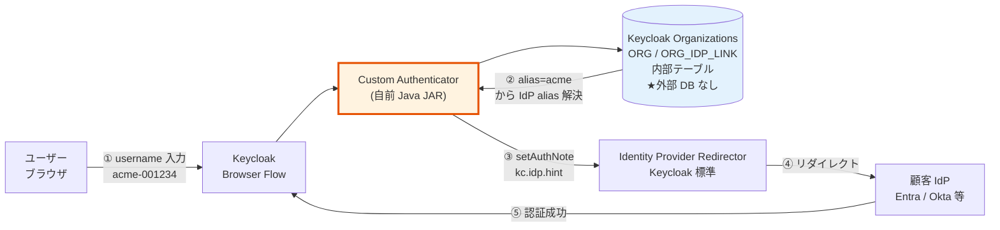
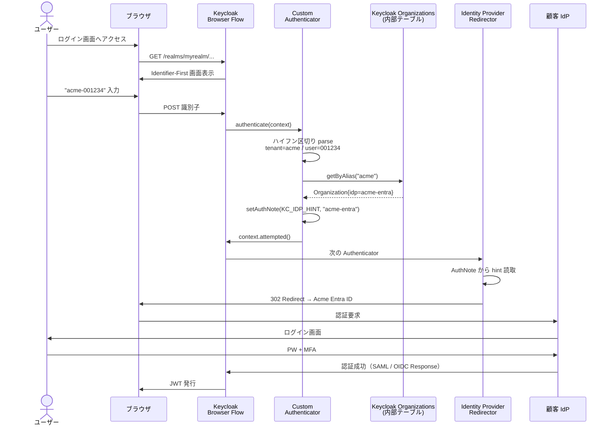
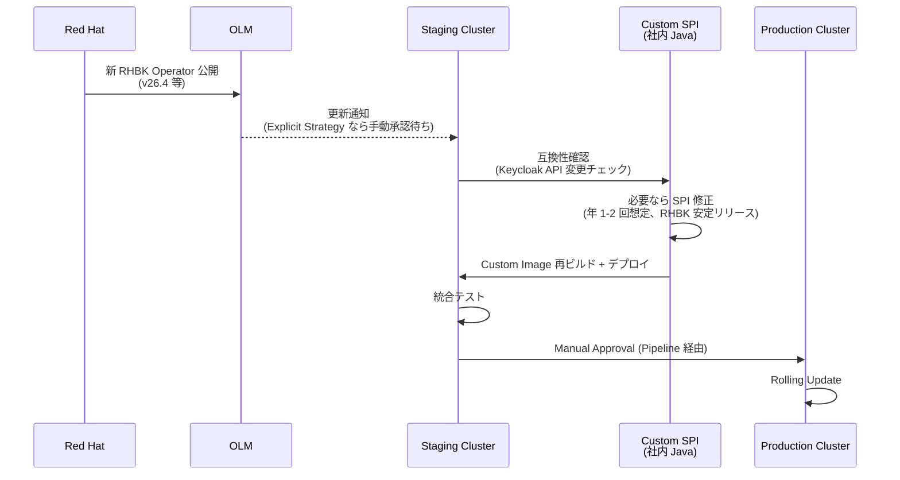
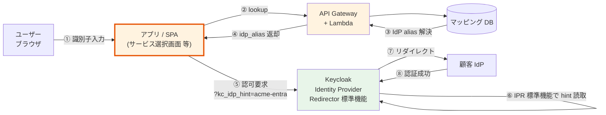
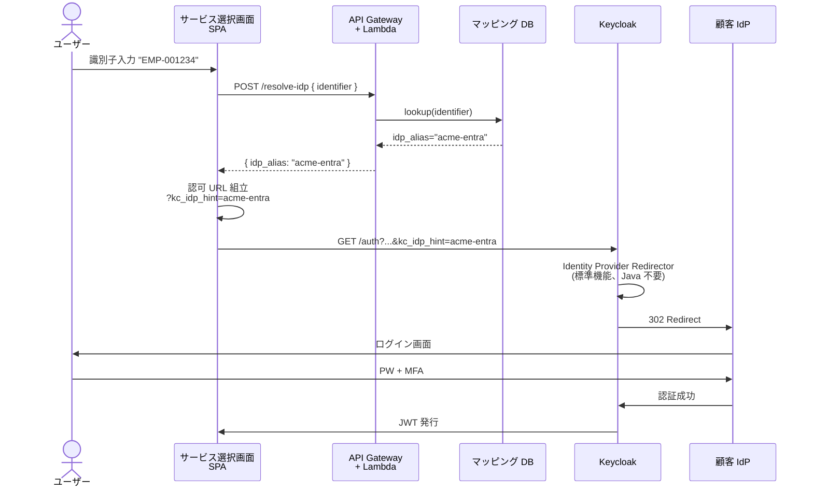
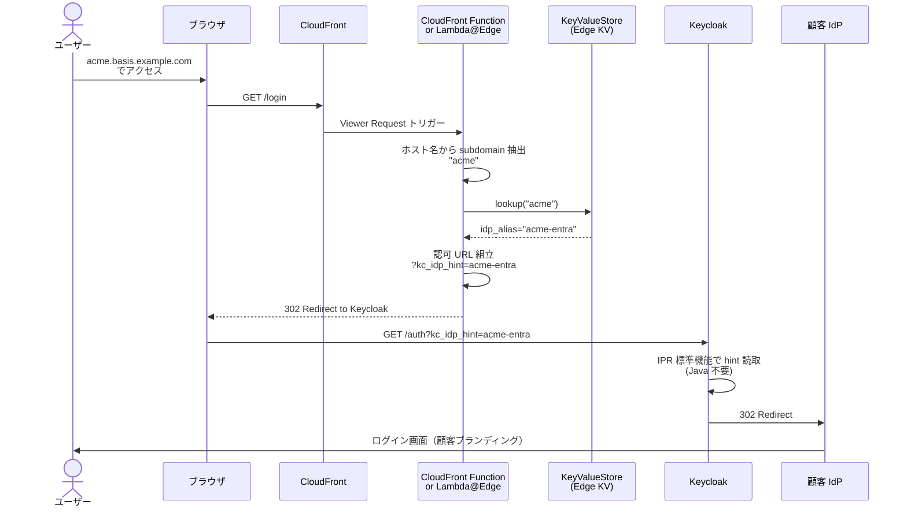
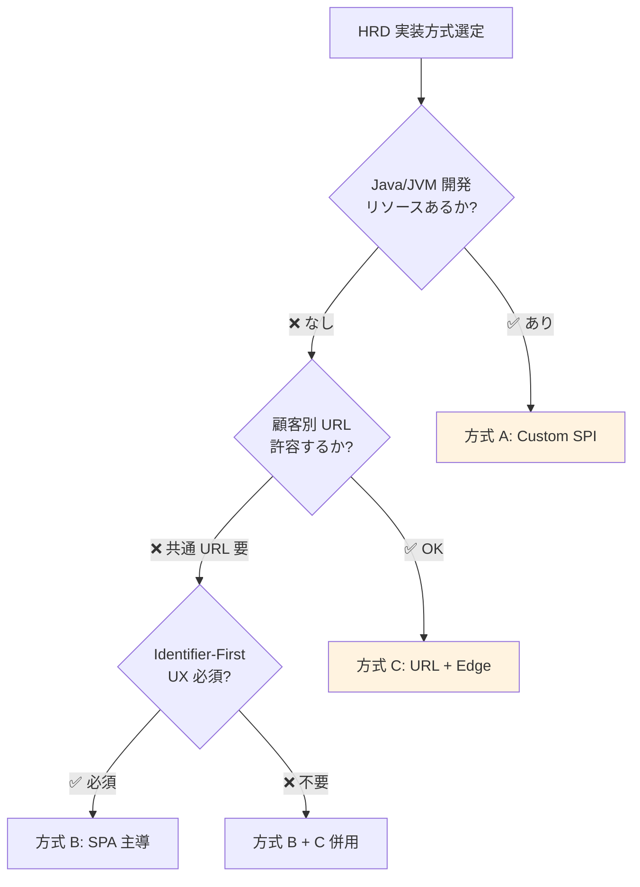

# ADR-055: HRD 実装方式選定（Custom Authenticator SPI / SPA 主導 kc_idp_hint / URL + Edge）

- **ステータス**: **Phase 1 採用確定 = 方式 A 改訂版**（**ハイフン区切り識別子 `<tenant>-<userid>` + 薄い Custom Authenticator SPI + Keycloak Organizations 内部データ、外部 DB なし**）（2026-06-25 SPI 方針確定 / 2026-06-29 識別子形式 + Keycloak 内データ確定）/ Phase 2 候補：方式 C 併用
- **日付**: 2026-06-25 作成、2026-06-25 SPI 方式確定、**2026-06-29 識別子設計 × HRD 実装方式 3-way 比較完了、薄い SPI + Organizations 内データ確定**、**2026-07-23 格上げ（基本設計 Wave 1: HRD SPI = 1000+ IdP 性能成立の必須条件 + U2 §2.3.3 確定値反映）**、**2026-07-24 更新（CI/CD ツールチェーン確定 = GitHub Actions + OIDC / OpenShift GitOps / ECR — [U9 D-U9-12](../basic-design/09-operations-observability-design.md) + §A.7 の stale な EKS Fargate 前提文を ROSA HCP + RHBK Operator（ADR-056 逆転）へ差替）**
- **関連**:
  - [ADR-056 ROSA 採用判断](056-rosa-adoption-decision.md)（**実行基盤次第で CI/CD ツールチェーン変化、§A.6 / §A.7 で併記**）
  - [ADR-020 HRD ヒントキー戦略 + フェデ/ローカル混在 Identifier-First](020-hrd-hint-keys-mixed-login.md)（**戦略レイヤ、本 ADR の上位**）
  - [ADR-018 ユーザー識別子 3 階層戦略](018-user-identifier-3layer-emailless.md)
  - [ADR-039 v2 ネットワーク監査アカウント設計](039-centralized-network-account-edge-layer.md)（CloudFront Function / Lambda@Edge 配置）
  - [ADR-054 ID 統合戦略](054-id-integration-strategy.md)（マッピング DB との連動）
  - [§FR-2.3.3 ログイン画面で IdP 選択 UX](../requirements/proposal/fr/02-federation.md)
  - [hrd-implementation-keycloak.md §2](../common/hrd-implementation-keycloak.md)

---

## Context

### 背景

[ADR-020](020-hrd-hint-keys-mixed-login.md) で HRD（Home Realm Discovery）の**ヒントキー戦略**（A〜E 案）は確定したが、その**実装方式**は「Custom Authenticator SPI（Option ③）」を前提に記述されていた。打ち合わせで「**SPI は何か / Java でないとダメか**」というユーザー質問が出たことで、実装方式の選択肢を体系的に整理する必要が判明。

### Why 本 ADR が必要

「**識別子 → IdP マッピングを解決する場所**」は以下の 3 つに分岐し、それぞれ言語・運用・コスト・拡張性が大きく異なる:

1. **Keycloak 内**（Custom Authenticator SPI、Java/JVM 必須）
2. **アプリ / サービス選択画面 SPA**（フロントエンド主導、JavaScript / TypeScript）
3. **エッジ層**（CloudFront Function / Lambda@Edge、JavaScript / Python）

この 3 方式の構成・フロー・メリデメ・採用判断を確定するのが本 ADR の目的。

### 業界用語の整理

| 用語 | 意味 |
|---|---|
| **HRD**（Home Realm Discovery）| ユーザーがどの IdP / realm に属するかを認証情報入力前に判定する仕組み |
| **SPI**（Service Provider Interface）| Java 標準の拡張プラグイン機構。Keycloak は全機能を SPI 化 |
| **Authenticator SPI** | Keycloak のログイン認証フローを拡張する SPI、`org.keycloak.authentication.Authenticator` インターフェース |
| **`kc_idp_hint`** | Keycloak **独自**の URL パラメータ（OIDC 標準ではない）。指定 IdP に強制リダイレクト |
| **Identity Provider Redirector** | Keycloak 標準 Authenticator、`kc_idp_hint` を処理して IdP リダイレクトを実行 |
| **Identifier-First Login** | パスワード入力前に識別子だけ入力させて IdP / 認証経路を決定する UX パターン |
| **CloudFront Function** | AWS CloudFront のエッジ実行 JS（軽量、sub-ms 実行、700+ Edge Locations）|
| **Lambda@Edge** | CloudFront のエッジ実行 Lambda（Node.js / Python、5-30s、13 Regional Edge Caches）|

---

## Decision

### 採用方針

**3 方式の併用可能性を認め、顧客状況・組織体制次第で選択**。

| 顧客状況 | 推奨方式 |
|---|---|
| **email 一部のみ保有（混在、メイン想定）** + JVM 開発リソースあり | **方式 A: Custom Authenticator SPI** + Organizations 標準 ハイブリッド |
| email 一部のみ保有 + **JVM 開発リソースなし** | **方式 B: SPA 主導 `kc_idp_hint`**（前段で識別子→IdP 解決）|
| **全員 email 非保有 + 顧客別 URL 許容** | **方式 C: URL + CloudFront Function**（subdomain → `kc_idp_hint` 変換）|
| 全員 email 保有 + 1 顧客 = 1 ドメイン | Keycloak Organizations 標準のみ（方式 A 不要）|

### 本基盤 Phase 1 の採用確定（2026-06-25 SPI 方式 / 2026-06-29 識別子 + データ確定）

- **採用確定**：**方式 A 改訂版** = 「**ハイフン区切り識別子 `<tenant>-<userid>` + 薄い Custom Authenticator SPI + Keycloak Organizations 内部データ**」
  - **識別子形式**: `<tenant>-<userid>`（例: `acme-001234`、`<tenant>` は Organization alias と一致）
  - **SPI 役割**: ハイフン前 parse → `OrganizationProvider.getByAlias()` 呼出 → リンク IdP の alias を `kc_idp_hint` に設定 → username を `<userid>` 部分に書換
  - **マッピングデータ格納**: **Keycloak Organizations（ORG / ORG_DOMAIN / ORG_IDP_LINK / ORG_ATTRIBUTE テーブル）のみ**。外部 DB なし
  - **理由**:
    1. **Q5 メアドベース UX 要件可能性に対応**: ID とメアドが明確に分離（メアドは optional 属性として別管理）
    2. **Q4 Phase 2 拡張余地（regex / IP / 時刻ベース等）に対応**: Phase 1 で SPI 基盤を持つことで Phase 2 要件発生時に Java で柔軟に対応可能
    3. **外部 DB 不要**: 運用シンプル、認証パス短縮、ADR-038 Tenant Admin Portal は Organization 管理のみで完結
    4. **Phase 1 SPI 実装は薄い**: ~50-100 行 Java（当初の multi-layer fallback 設計より大幅に簡素化）
    5. **ADR-054 ID 統合戦略 / ADR-038 Tenant Admin Portal と整合**
  - **開発体制**: **社内 Java 開発者**で実装（外部委託・OSS Fork は不採用）
  - **開発工数**: **1-1.5 週間**（当初の 1-2 週間想定から短縮）
  - **テスト方針**: 別途検討（[Phase X TBD]）
- **Phase 2 候補（フォールバック）**: 方式 C（URL + Edge）併用
  - 大口顧客（規制業種 / カスタムブランディング要望）のみ顧客別 URL 提供
- **Phase 2 拡張候補**: 方式 A SPI 内に regex / IP ベース / 時刻ベース ルーティング追加（顧客要件発生時）

### 2026-07-23 格上げ（基本設計 Wave 1）: HRD SPI = 1000+ IdP 性能成立の必須条件

> **2026-07-23 格上げ**: HRD SPI（IdP 一覧非表示）は UX 選好ではなく **1000+ IdP の性能成立の必須条件**（keycloak#45293 未解決のため。[research](../basic-design/research/keycloak-1000idp-scalability-research.md)、ADR-017 Consequences と整合）。
>
> **U2 §2.3.3 確定値**（[02-keycloak-logical-design.md](../basic-design/02-keycloak-logical-design.md)）:
> - 識別子 D 案 + メールドメイン A 案のハイブリッド
> - `hrd_mode` は Organization attribute で保持
> - 解決結果が複数 IdP の場合は先頭 1 件自動選択ではなく **attempted() 降格 → Organization セレクターに委譲**

### 識別子設計 × HRD 実装方式 3-way 比較（2026-06-29 追加、Phase 1 採用判断の根拠）

「**識別子をどう設計するか × HRD ロジックをどこで動かすか**」の組み合わせを比較。本基盤は **P3 採用**。

| 観点 | **P1: 合成 Email** | **P2: ハイフン区切り + Custom Theme** | **P3: ハイフン区切り + SPI + Keycloak Organizations 内部データ ★採用** |
|---|---|---|---|
| **ID 表記** | `u001234@acme.basis.example.com` | `acme-001234` | `acme-001234` |
| **コード言語** | なし | HTML/CSS/JavaScript（FreeMarker theme）| Java |
| **マッピングデータ格納** | Keycloak Organizations | Keycloak Organizations | **Keycloak Organizations** |
| **外部 DB** | 不要 | 不要 | **不要** |
| **開発工数** | 0 日 | 2-3 日 | **1-1.5 週間** |
| **バージョン追従コスト** | なし | Theme テンプレート確認 | Java API 追従（年 1-2 回）|
| **CI/CD** | なし | Theme bundling のみ | Maven + JAR ビルド + デプロイ |
| **セキュリティ（ID parse 場所）**| サーバ側ネイティブ | クライアント側 JS（迂回時 login 失敗 = 害は薄い）| **サーバ側 Java** |
| **Q4 Phase 2 拡張（regex 等）**| ❌ 拡張困難（pure built-in）| △ Theme JS 拡張可能だが client-side | ✅ **Java で柔軟に拡張可能** |
| **Q5 メアドベース UX 要件への耐性** | ❌ メアド誤認 UX 二重化リスク | ✅ ID とメアド明確に分離 | ✅ **ID とメアド明確に分離** |
| **管理 UI** | Keycloak Admin Console (Organizations) | 同左 | 同左 |
| **テナント 1000+ 対応** | ✅ | ✅ | ✅ |

#### P3 採用理由（P1 / P2 を退ける理由）

- **P1 不採用**: Q5 の「メアドベース UX 要件可能性」に対し UX 二重化リスク（合成 Email = `u001234@acme.basis.example.com` が email として誤認される）が高い。顧客から「これは普通の email じゃないですよね？」FAQ 多発予想
- **P2 不採用**: Theme JS は client-side ロジック（JS 迂回時 login 失敗 = 害は薄いが UX 劣化）。Phase 2 regex 等の拡張時に再設計コスト発生
- **P3 採用根拠**:
  - サーバ側 Java logic で堅牢
  - 外部 DB 不要（ユーザ希望）
  - Phase 2 拡張余地を確保
  - SPI 実装は薄く済む（~50-100 行）
  - ADR-055 §A.6 / §A.7 で整理済の CI/CD パイプラインそのまま使える（投資が無駄にならない）

#### ヒアリング項目（参考、最終確定後の補強用）

| 項目 | 目的 |
|---|---|
| 顧客に「ハイフン区切り ID `<tenant>-<userid>` 形式」への抵抗有無 | 採用確認 |
| メアドベース UX 要件の具体的有無（あれば optional 属性として別管理）| Q5 確定 |
| Phase 2 で regex / IP ベース / 時刻ベース ルーティング要件発生する可能性 | Q4 確定 → 必要なら SPI 拡張 / 制限案内 |

---

## A. 方式 A: Custom Authenticator SPI（Java/JVM）

### A.1 構成図



### A.2 認証フロー詳細



### A.3 実装スケッチ（2026-06-29 改訂：薄い SPI + Keycloak Organizations 内部データ）

> **設計変遷**: 当初版（2026-06-25）は multi-layer fallback (email domain / prefix / DB lookup) を想定していたが、2026-06-29 の識別子設計確定（`<tenant>-<userid>` 形式、外部 DB なし、Organizations 内データ）に伴い、**ハイフン前 parse → OrganizationProvider.getByAlias 呼出のみ**の薄い実装に簡素化。

```java
public class TenantPrefixHrdAuthenticator implements Authenticator {
    @Override
    public void authenticate(AuthenticationFlowContext context) {
        String identifier = context.getHttpRequest()
            .getDecodedFormParameters().getFirst("username");

        // ハイフン区切り parse（@ 含む or - 含まないなら通常フローに降格）
        if (identifier == null || !identifier.contains("-") || identifier.contains("@")) {
            context.attempted();
            return;
        }

        int idx = identifier.indexOf('-');
        String tenantAlias = identifier.substring(0, idx);     // 例: "acme"
        String userId = identifier.substring(idx + 1);          // 例: "001234"

        // Keycloak Organizations (v26 ビルトイン) から alias でルックアップ
        OrganizationProvider orgProvider = context.getSession()
            .getProvider(OrganizationProvider.class);
        OrganizationModel org = orgProvider.getByAlias(tenantAlias);

        if (org != null) {
            // 最初のリンク済 IdP を取得（複数リンクの場合は別途優先度ロジック検討）
            String idpAlias = org.getIdentityProviders()
                .findFirst()
                .map(IdentityProviderModel::getAlias)
                .orElse(null);

            if (idpAlias != null) {
                // kc_idp_hint 注入で次の Identity Provider Redirector が IdP リダイレクトを実行
                context.getAuthenticationSession()
                    .setAuthNote(AdapterConstants.KC_IDP_HINT, idpAlias);
                // username を ID 部分のみに書換（IdP 側で `<userid>` が認識される前提）
                context.getAuthenticationSession()
                    .setAuthNote("LOGIN_USERNAME", userId);
                context.attempted();
                return;
            }
        }

        // フォールバック: Organization 見つからない or IdP リンクなし → PW form 降格
        context.attempted();
    }

    @Override public boolean requiresUser() { return false; }
    @Override public boolean configuredFor(KeycloakSession s, RealmModel r, UserModel u) { return true; }
    @Override public void setRequiredActions(KeycloakSession s, RealmModel r, UserModel u) {}
    @Override public void action(AuthenticationFlowContext c) {}
    @Override public void close() {}
}
```

**コード規模**: ~50-100 行（テスト含めて 200-300 行）。当初の multi-layer fallback 版より大幅に薄い。

**マッピングデータ管理**:
- **Tenant Admin Portal**（ADR-038）→ Keycloak Admin API `POST /admin/realms/{realm}/organizations` で Organization 作成
- `alias`（PK）= テナント prefix（例: `acme`）として登録
- `identityProviders[]` にリンク IdP 追加
- ハイフン区切り識別子の prefix と Organization alias が **1 対 1 対応**

ファイル構成:
```
my-hrd-authenticator/
├── pom.xml                    (Maven、依存: keycloak-server-spi, keycloak-services)
├── src/main/java/...
│   ├── IdentifierBasedHrdAuthenticator.java
│   └── IdentifierBasedHrdAuthenticatorFactory.java
└── src/main/resources/META-INF/services/
    └── org.keycloak.authentication.AuthenticatorFactory  ← Factory FQN を記載
```

デプロイ：
```bash
# Maven build
mvn clean package

# Keycloak の /providers ディレクトリに JAR 配置
cp target/my-hrd-authenticator.jar $KC_HOME/providers/

# Optimized build モードなら再ビルド必須
kc.sh build

# 起動
kc.sh start
```

### A.4 メリット・デメリット（2026-06-29 改訂：Keycloak Organizations 内データ前提）

| メリット | デメリット |
|---|---|
| ✅ **Keycloak 内完結**（運用統一、**外部 DB なし**）| ❌ **Java/JVM 必須**（Kotlin / Scala / Groovy 可、他言語不可）|
| ✅ **共通 URL**（全顧客 `auth.basis.example.com`）| ❌ **開発工数 1-1.5 週間**（薄い SPI、Java + Maven + テスト）|
| ✅ **ユーザは識別子フィールドに入力するだけ**（UX シンプル）| ❌ Keycloak 内部 API 依存（バージョン追従コスト）|
| ✅ **完全制御**（IP / User-Agent / 時刻 等の任意条件で判定可能、Phase 2 拡張余地）| ❌ レビュー / テスト / 運用ドキュメント全て自社負担 |
| ✅ ライセンス問題なし（自社所有 JAR）| ❌ Keycloak メジャーバージョンアップ時の動作確認必要 |
| ✅ **マッピングは Keycloak Organizations 内部テーブルに集約**（外部 DB 不要、Tenant Admin Portal から標準 Admin API で管理）| ❌ JAR デプロイ + Keycloak 再起動が必要（ホットリロード不可）|
| ✅ **薄い実装**（~50-100 行 Java、ハイフン前 parse + OrganizationProvider 呼出のみ）| ❌ Organizations 機能の GA 状態（v26.2 時点）の確認必要（Spike 項目）|

### A.5 業界事例

| 事例 | 内容 |
|---|---|
| **keycloak-home-idp-discovery**（sventorben）| OSS Plugin、email domain ベース HRD。Elastic License v2、RHBK 対象外。本 ADR では Custom SPI 実装の参考に |
| **Microsoft Entra ID** | sign-in name で同様の挙動（managed / federated 振り分け、内部実装は非公開だが概念同等）|
| **Auth0 Identifier-First** | 識別子→connection マッピング、内部実装は Custom Authenticator 相当 |
| **Vidiemme**（イタリア企業）| KeyCloak custom provider for authentication、社内 ID システム連携で SPI 実装 |

### A.6 実装基盤別の CI/CD 差分（2026-06-25 追加、ROSA 採用判断連動）

> **2026-07-23 確定**: [ADR-056](056-rosa-adoption-decision.md) の Decision 逆転により実行基盤 = **ROSA HCP** で確定（暫定前提 P-01）。下表は **ROSA HCP 列を正**とし、EKS 列は不採用となった代替（参考）として残す。デプロイは **RHBK Operator（OperatorHub、追加サブスク不要）** 経由の `Keycloak` CR。**残 TBD**: RHBK 26.4 × upstream 26.x の Custom SPI 互換確認（本 §A.7 の年 1-2 回追従前提の実証、[research](../basic-design/research/rosa-hcp-adoption-research.md) 残 TBD ③）。
>
> **2026-07-24 確定**: 本基盤の CI/CD は **GitHub Actions + OIDC / OpenShift GitOps / ECR**（[U9 D-U9-12](../basic-design/09-operations-observability-design.md)。[ADR-046](046-supply-chain-security.md) SLSA 資産・ECR クロスリージョン DR・zero-egress ミラーとの整合が根拠）。下表・下図の **Tekton / Quay 列は不採用の代替**として保持。

実行基盤（EKS / ROSA Classic / ROSA HCP）次第で Custom SPI の CI/CD ツールチェーンが変化。**Java + Maven + Custom Container Image + Registry + Deploy の基本フローは共通**だが、ツール選定が異なる。

| 観点 | **EKS Fargate（現状想定）** | **ROSA Classic** | **ROSA HCP** |
|---|---|---|---|
| **CI 推奨ツール** | GitHub Actions / CodeBuild / Jenkins | **OpenShift Pipelines (Tekton)** / GitHub Actions | 同左 |
| **CD 推奨ツール** | ArgoCD / Flux（別途インストール）| **OpenShift GitOps (ArgoCD)** 標準同梱 | 同左 |
| **Container Image Build** | Docker build / Kaniko on EKS / 外部 CI | OpenShift BuildConfig (S2I / Buildah / Kaniko) / 外部 CI | 同左 |
| **Container Registry** | **ECR**（AWS 統合） | **Quay.io**（Red Hat 推奨、RHBK 連動）/ ECR | 同左 |
| **Image 更新トリガー** | GitOps（ArgoCD Image Updater 等）| **ImageStream + ImageChange Trigger**（OpenShift 独自）or GitOps | 同左 |
| **Keycloak デプロイ** | Helm Chart values.image | **Keycloak CR の `image:` フィールド**（rhbk-operator） | 同左 |
| **Secret 管理** | **AWS Secrets Manager + External Secrets Operator** | OpenShift Secret + Sealed Secret / Vault | 同左 |

#### 推奨 CI/CD パイプライン構成（ROSA Classic / HCP）

```mermaid
flowchart LR
    Git[GitHub<br/>SPI Source]
    Tekton[OpenShift Pipelines<br/>Tekton]
    Maven[Maven Build Task]
    Image[Image Build<br/>Buildah / Kaniko]
    Quay[Quay.io<br/>Container Registry]
    ArgoCD[OpenShift GitOps<br/>ArgoCD]
    Operator[rhbk-operator<br/>Keycloak CR]
    KC[Keycloak Pod<br/>ROSA Worker Node]

    Git --> Tekton
    Tekton --> Maven
    Maven --> Image
    Image --> Quay
    Quay --> ArgoCD
    ArgoCD --> Operator
    Operator --> KC

    style Tekton fill:#fff3e0
    style ArgoCD fill:#e3f2fd
    style Operator fill:#fce4ec
```



→ **ROSA Classic / HCP の CI/CD 差分なし**（Control Plane の所在は違うが、Pipeline / GitOps / Operator は同じ）。違いは **OpenShift 独自ツール（Tekton / BuildConfig / Operator）+ Quay.io vs EKS の GitHub Actions / ECR / Helm**。

### A.7 Keycloak バージョン追従プロセス（2026-06-25 追加、Classic / HCP 比較）

Custom SPI は Keycloak 内部 API（`AuthenticationFlowContext` 等）に依存するため、**Keycloak メジャーバージョンアップ時に動作確認 + 必要なら修正**が必要。

| 観点 | **EKS Upstream OSS** | **ROSA Classic（RHBK）** | **ROSA HCP（RHBK）** |
|---|---|---|---|
| **Keycloak ベース** | Upstream Keycloak OSS | **RHBK**（Red Hat build of Keycloak） | 同左 |
| **メジャー版リリース頻度** | **年 4-6 回**（v26 / v27 / v28 等） | **年 1-2 回**（v26.0 / 26.2 / 26.4 等、Red Hat ライフサイクル） | 同左 |
| **メジャー版サポート期間** | **1 メジャー版前のみ**（実質 〜6 ヶ月） | **v26.x = 2 年 / v27.x+ = 3 年** | 同左 |
| **アップグレード方式** | Helm upgrade / 手動マニフェスト | **rhbk-operator + OLM**（Operator Lifecycle Manager） | 同左 |
| **Operator 自動更新** | — | **OLM デフォルトで自動**（**要 Explicit Strategy 設定で手動承認制御**）| 同左 |
| **SPI 動作確認頻度** | **年 4-6 回**（Upstream 変更追従） | **年 1-2 回**（RHBK 安定リリース、追従工数低） | 同左 |
| **OpenShift Control Plane アップグレード** | — | **顧客主導、数時間** | **Red Hat が自動メンテ、約 1 時間** |
| **アップグレード窓口の柔軟性** | EKS 任意 | 高（顧客指定）| 低（Red Hat 側メンテウィンドウ依存）|
| **顧客の運用負荷** | Helm + 動作確認 | OpenShift + Keycloak/SPI | **Keycloak/SPI のみ集中可能** |

#### バージョン追従フロー（ROSA Classic / HCP 共通）



#### 推奨追従ポリシー

| Phase | 内容 |
|---|---|
| Phase 1 | **Explicit Strategy** 設定（OLM 自動更新を無効化）、Staging で動作確認後 Manual Approval |
| Phase 2 | Staging 環境を ROSA Classic / HCP / EKS 別に用意（移行時に切替可能）|
| Phase 3 | 年 1-2 回（RHBK）or 年 4-6 回（Upstream）の動作確認カレンダー化 |

→ **HCP は OpenShift Control Plane アップグレードを Red Hat に委譲できるため、Keycloak/SPI の動作確認に集中可能**。Classic では Control Plane も顧客側でアップグレードする必要があり、運用負荷が高い。

→ **本基盤 Phase 1 = ROSA HCP + RHBK Operator**（[ADR-056](056-rosa-adoption-decision.md) 2026-07-23 逆転、P-01。2026-07-24 差替: 旧「EKS Fargate + Upstream OSS Keycloak 想定」は stale）。バージョン追従頻度は RHBK の**年 1-2 回**が正。CI/CD ツールチェーンは **GitHub Actions + OIDC / OpenShift GitOps / ECR**（U9 D-U9-12、§A.6 の 2026-07-24 確定注記参照）。

### A.8 マッピング格納場所の選択肢比較（2026-06-29 追加、採用検討の経緯）

> **位置付け**: 本セクションは「マッピングデータをどこに置くか」の検討経緯を残すための appendix。本基盤は **Keycloak Organizations（候補 1）採用**で確定（§Decision Phase 1 採用確定参照）。他候補は将来の要件変化時の再評価材料として記録。

「識別子 → IdP マッピング」を解決する**データ格納場所**は以下の 5 候補がある。Keycloak v26.2 環境での比較:

| 候補 | 格納場所 | スキーマ | アクセス API | 適したケース |
|---|---|---|---|---|
| **1. Keycloak Organizations**（v26 built-in、★本基盤採用）| `KEYCLOAK_ORG` / `ORG_DOMAIN` / `ORG_IDP_LINK` / `ORG_ATTRIBUTE` テーブル | Organization 単位で alias + domains + linked IdPs + attributes | `OrganizationProvider.getByAlias()` / `getByDomainName()` | **email ドメインベース + テナント prefix ベース（本基盤）** |
| **2. IdentityProvider Config Attribute** | `IDENTITY_PROVIDER_CONFIG` テーブル | 各 IdP に `matchDomains` / `matchPrefix` カスタム config | `realm.getIdentityProvidersStream()` でループ + config 読取 | **IdP 数が少ない（< 100）+ シンプル運用** |
| **3. Keycloak User Attribute** | `USER_ATTRIBUTE` テーブル | ユーザに `default_idp` 属性付与 | `user.getAttribute("default_idp")` | **既存ユーザの 2 回目以降ログイン**（初回は鶏卵問題）|
| **4. Realm Attribute（JSON map）** | `REALM_ATTRIBUTE` テーブル | `hrd_mapping = {"acme.co.jp": "acme-entra", ...}` | `realm.getAttribute("hrd_mapping")` + JSON パース | **超シンプル / 顧客数 < 10** |
| **5. 外部 DB（Aurora 専用テーブル）** | Keycloak 外の Aurora（顧客 VPC 内）| `HRD_MAPPING(tenant_id, match_type, match_value, idp_alias, priority)` | JDBC / REST | **大規模 + 複雑ルール + 専用管理 UI 必要**（本基盤では不採用）|

#### 本基盤での選定理由（候補 1 採用）

- **Keycloak ビルトイン機能 → 外部依存ゼロ** (Tenant Admin Portal も標準 Admin API でアクセス)
- **alias による高速ルックアップ** (`getByAlias()` は O(1) インデックス前提)
- **Tenant Admin Portal（ADR-038）と整合**（Organization CRUD のみで運用可）
- **ADR-054 ID 統合戦略**（Keycloak User Attribute 補助テーブルとの併用余地）

#### 候補 5（外部 DB）を不採用とした理由

- 認証パスごとに DB 往復が発生（レイテンシ +5-20ms）
- 専用管理 UI 開発 / 障害切り分け箇所増加 / バックアップ設計増加
- 「やや複雑」（ユーザー判断 2026-06-29）

#### 将来の再評価条件

- **複雑な regex ルール / 時刻ベース / IP ベース ルーティング要件**が顧客から発生 → Organization attribute 拡張 or 候補 5 を再検討
- テナント数が 10,000 を超え、Organizations の管理が煩雑になった場合 → 候補 5（専用管理 UI）再評価

---

## B. 方式 B: アプリ / SPA 主導 `kc_idp_hint`

### B.1 構成図



### B.2 認証フロー詳細



### B.3 実装サンプル（JavaScript / React）

```typescript
// SPA 側 (React + oidc-client-ts 例)
async function loginWithIdentifier(identifier: string) {
    // 1. 識別子 → IdP alias 解決（API 経由）
    const res = await fetch('/api/resolve-idp', {
        method: 'POST',
        body: JSON.stringify({ identifier })
    });
    const { idp_alias } = await res.json();

    // 2. Keycloak に認可要求（kc_idp_hint 付き）
    const authUrl = new URL('https://auth.basis.example.com/realms/myrealm/protocol/openid-connect/auth');
    authUrl.searchParams.set('client_id', 'my-app');
    authUrl.searchParams.set('response_type', 'code');
    authUrl.searchParams.set('redirect_uri', 'https://app.example.com/callback');
    authUrl.searchParams.set('scope', 'openid profile email');
    authUrl.searchParams.set('code_challenge', generatePkceChallenge());
    authUrl.searchParams.set('code_challenge_method', 'S256');
    if (idp_alias) {
        authUrl.searchParams.set('kc_idp_hint', idp_alias);  // ← ここがキー
    }
    window.location.href = authUrl.toString();
}
```

Lambda 側 (Node.js):
```javascript
exports.handler = async (event) => {
    const { identifier } = JSON.parse(event.body);

    // マッピング DB ルックアップ（DynamoDB / Aurora / Keycloak Admin API 等）
    const idp_alias = await mappingDb.lookup(identifier);

    return {
        statusCode: 200,
        body: JSON.stringify({ idp_alias })
    };
};
```

### B.4 メリット・デメリット

| メリット | デメリット |
|---|---|
| ✅ **Keycloak 側 Java 実装ゼロ**（標準 Identity Provider Redirector のみ）| ❌ **マッピング知識がアプリに分散**（顧客追加時に複数アプリ更新）|
| ✅ **開発言語自由**（JS / TS / Python / Go 等）| ❌ アプリ / SPA から認証基盤の Admin API or 独立マッピング DB アクセス必要 |
| ✅ **開発工数 数日**（SPA + Lambda API）| ❌ Universal Login 原則に反する（[hrd-implementation-keycloak.md §1.2](../common/hrd-implementation-keycloak.md)）|
| ✅ Keycloak バージョンアップ影響少（標準機能利用）| ❌ Identifier-First Login の UX を**アプリ側で再実装**必要 |
| ✅ A/B テスト容易（フロント側で容易に挙動切替）| ⚠ `kc_idp_hint` は **Keycloak 独自パラメータ**（OIDC 標準ではない、他 IdP 移行時に書き換え必要）|

### B.5 業界事例 + 注意点

| 事例 | 内容 |
|---|---|
| **Auth0 SDK** | `connection` パラメータで明示的 IdP 指定（kc_idp_hint と同概念）|
| **Okta Widget** | クライアント側で `idp` パラメータ指定可能 |
| **多くの SaaS Identifier-First UI** | フロント側で識別子判定 → 適切な認証 URL に遷移 |

**注意点**（GitHub Issue #47229 / #44002）:
- `kc_idp_hint` は **OAuth 2.0 PAR**（Pushed Authorization Request）と組み合わせると Keycloak v26 以前で動作しないケースあり
- 解決策：v26+ 利用 or PAR 不使用

---

## C. 方式 C: URL ベース HRD + CloudFront Function / Lambda@Edge

### C.1 構成図

```mermaid
flowchart LR
    User[ユーザー]
    DNS[Route 53<br/>basis.example.com<br/>*.basis.example.com]
    CF[CloudFront]
    Edge["CloudFront Function<br/>or Lambda@Edge<br/>(JavaScript / Python)"]
    Mapping[(KeyValueStore<br/>or Edge KV)]
    KC[Keycloak<br/>標準機能のみ]
    IdP[顧客 IdP]

    User -->|acme.basis.example.com<br/>でアクセス| DNS
    DNS --> CF
    CF --> Edge
    Edge --> Mapping
    Mapping -->|subdomain "acme"<br/>→ idp_alias "acme-entra"| Edge
    Edge -->|kc_idp_hint=acme-entra<br/>付与してリダイレクト| KC
    KC -->|IPR 標準機能| IdP
    IdP --> User

    style Edge fill:#fff3e0,stroke:#e65100,stroke-width:3px
    style Mapping fill:#e3f2fd
    style KC fill:#e8f5e9
```

### C.2 認証フロー詳細



### C.3 実装サンプル（CloudFront Function、JavaScript ES2020）

```javascript
// CloudFront Function (Viewer Request)
import cf from 'cloudfront';

const kvsHandle = cf.kvs();

async function handler(event) {
    const request = event.request;
    const host = request.headers.host.value;

    // ホスト名から subdomain 抽出
    // 例: "acme.basis.example.com" → "acme"
    const subdomain = host.split('.')[0];

    // 認証関連パスのみ HRD 適用
    if (!request.uri.startsWith('/login') &&
        !request.uri.startsWith('/auth')) {
        return request;
    }

    // KeyValueStore lookup (subdomain → IdP alias)
    let idpAlias;
    try {
        idpAlias = await kvsHandle.get(subdomain);
    } catch (e) {
        // マッピング未登録 → そのままアプリへ
        return request;
    }

    // Keycloak 認可 URL にリダイレクト
    const keycloakUrl = `https://auth.basis.example.com/realms/myrealm/protocol/openid-connect/auth` +
        `?client_id=my-app` +
        `&response_type=code` +
        `&redirect_uri=https://${host}/callback` +
        `&scope=openid profile email` +
        `&kc_idp_hint=${idpAlias}`;

    return {
        statusCode: 302,
        statusDescription: 'Found',
        headers: { location: { value: keycloakUrl } }
    };
}
```

CloudFront KeyValueStore データ例:
```json
{
  "acme": "acme-entra",
  "fooco": "fooco-okta",
  "bar-corp": "bar-saml"
}
```

### C.4 メリット・デメリット

| メリット | デメリット |
|---|---|
| ✅ **Keycloak 側 Java 実装ゼロ**（標準 Identity Provider Redirector のみ）| ❌ **顧客別 URL 必要**（`acme.basis.example.com`）= DNS + 証明書 N 個 |
| ✅ **ユーザは何も入力不要**（URL 自体がヒント）| ❌ ブックマーク URL が顧客ごとに分散 |
| ✅ **顧客ブランディング統一容易**（顧客別 URL = 顧客別ランディング画面）| ❌ ワイルドカード証明書 or 顧客追加時 ACM 証明書更新が必要 |
| ✅ **CloudFront Function**：sub-ms 実行、700+ Edge Locations、軽量 JS | ❌ DNS 委任 / Hosted Zone 管理運用必要 |
| ✅ **Lambda@Edge**：Node.js / Python、外部 DB アクセス可（重い処理向け）| ❌ Edge KV / Lambda@Edge コスト（ただし安価）|
| ✅ A/B テスト / Canary 容易（CloudFront Distribution 単位）| ⚠ CloudFront Function は外部 API 不可（KeyValueStore のみ）|
| ✅ DDoS 緩和（エッジで処理、オリジン到達前）| ⚠ 顧客追加 = DNS + 証明書 + KVS 更新の自動化必要 |

### C.5 CloudFront Function vs Lambda@Edge

| 項目 | CloudFront Function | Lambda@Edge |
|---|---|---|
| 実行時間制限 | **sub-ms**（< 1ms）| 5-30 秒 |
| Edge Location 数 | **700+** | 13 Regional Edge Cache |
| 言語 | JavaScript ES2020 サブセット | Node.js / Python |
| 外部 API / DB | ❌ 不可（KeyValueStore 経由のみ）| ✅ 可（VPC 接続も可、ただし Latency 増）|
| パッケージサイズ | 10 KB | 1-50 MB |
| コスト（リクエスト 100 万件）| $0.10 | $0.60 |
| トリガー | Viewer Request / Viewer Response | 全 4 トリガー（Viewer Req/Res、Origin Req/Res）|
| **本 ADR 推奨** | ✅ **HRD 用途（軽量 lookup）** | △ 認証 + Cookie 処理等の複雑処理時 |

→ HRD の subdomain → IdP alias 変換は **CloudFront Function + KeyValueStore で十分**。

### C.6 業界事例

| 事例 | 内容 |
|---|---|
| **Slack** | `workspace.slack.com` 形式、workspace ID で URL 識別、ログイン画面に直結 |
| **Figma** | `team.figma.com` 形式、team ベース URL |
| **AWS Builder Center 公式** | "Streamline your SaaS tenant routing at the edge with Amazon CloudFront Functions and KeyValueStore"、SaaS tenant routing パターン公式推奨 |
| **Widen/cloudfront-auth** | OSS、Lambda@Edge で OIDC / SAML 認証統合 |
| **aws-samples/cloudfront-authorization-at-edge** | AWS 公式サンプル、Cognito + Cookie + Lambda@Edge |

---

## D. 3 方式の比較表

| 観点 | **A: Custom SPI** | **B: SPA 主導** | **C: URL + Edge** |
|---|:---:|:---:|:---:|
| **Java/JVM 必要** | ✅ 必要 | ❌ 不要 | ❌ 不要 |
| **開発言語** | Java / Kotlin / Scala | JS / TS / Python 等 | JS（CFFunction）/ Node/Python（Lambda@Edge）|
| **開発工数** | 1-2 週間 | 数日 | 数日 |
| **共通 URL** | ✅ 1 つ | ✅ 1 つ | ❌ 顧客別 URL |
| **ユーザ入力** | 識別子 1 回 | 識別子 1 回 | **入力不要**（URL がヒント）|
| **Keycloak 内完結** | ✅ | ❌ アプリ側で前処理 | ❌ Edge 層で前処理 |
| **マッピング DB アクセス** | Keycloak User Attribute 直接 | API Gateway + Lambda 経由 | KeyValueStore / 外部 DB |
| **顧客追加時の作業** | マッピング DB 更新のみ | マッピング DB 更新 + Lambda 動作確認 | DNS + 証明書 + KVS 更新 |
| **Universal Login 原則** | ✅ 準拠 | ❌ 違反（アプリ側分散）| ⚠ 部分準拠（Edge は中央集約）|
| **A/B テスト容易性** | ⚠ Keycloak 再起動必要 | ✅ フロント側で容易 | ✅ Distribution 単位 |
| **顧客ブランディング** | △ Keycloak Theme 共通 | △ アプリ側 | ✅ 顧客別 URL = 顧客別 LP |
| **DDoS 緩和** | ❌ Keycloak まで到達 | ❌ アプリまで到達 | ✅ Edge で遮断 |
| **業界採用事例** | Microsoft Entra ID / Okta 内部 | Auth0 SDK / 多くの SaaS | Slack / Figma / AWS 公式推奨 |
| **本基盤推奨度** | **★★★★★**（Phase 1 第一推奨）| ★★★（Java NG 時の代替）| ★★★★（大口顧客向け Phase 2）|

---

## E. 採用判断フロー



---

## F. ハイブリッド構成（推奨実装パターン）

本基盤の現実的な実装は **方式 A + 方式 C の併用** を推奨:

| シーン | 採用方式 | 理由 |
|---|---|---|
| **大多数の顧客**（共通 URL `auth.basis.example.com`）| **方式 A: Custom SPI** | 共通 URL でシンプル運用、識別子入力で IdP 振り分け |
| **大口顧客 / カスタムブランディング要望**（顧客別 URL `acme.basis.example.com`）| **方式 C: URL + CloudFront Function** | 顧客ブランディング統一、ユーザ入力不要 |
| **アプリ側ですでに識別子保持**（ポータル経由のディープリンク等）| **方式 B: アプリ主導** | 認証基盤に hint だけ渡せば十分 |

```mermaid
flowchart LR
    U1[一般顧客<br/>ユーザ]
    U2[Acme 社員<br/>大口顧客]
    U3[ポータル<br/>ディープリンク]

    CF[CloudFront]
    KC[Keycloak]
    SPI["Custom Authenticator<br/>(方式 A)"]
    IPR[Identity Provider<br/>Redirector 標準]

    U1 -->|auth.basis.example.com| CF
    CF --> KC
    KC --> SPI

    U2 -->|acme.basis.example.com| CF
    CF -->|CloudFront Function<br/>(方式 C)| CF2[Edge で kc_idp_hint 付与]
    CF2 --> KC
    KC --> IPR

    U3 -->|kc_idp_hint=X<br/>(方式 B)| KC
    KC --> IPR

    style SPI fill:#fff3e0
    style CF2 fill:#fff3e0
```

---

## G. コスト試算（月間 100 万認証想定）

| 方式 | コスト要素 | 月額 |
|---|---|---|
| **方式 A: Custom SPI** | EKS / Keycloak 既存ノード内で実行（追加コストなし）| **$0**（既存に内包）|
| 方式 A 開発 | 初期開発 1-2 週間 × Java 開発者 | 100-200 万円（初期のみ）|
| **方式 B: SPA 主導** | API Gateway $3.50/M + Lambda $0.20/M + DynamoDB（マッピング）$2 | **$10** |
| **方式 C: CloudFront Function** | CloudFront Function $0.10/M + KeyValueStore（無料枠内）| **$1** |
| **方式 C: Lambda@Edge** | Lambda@Edge $0.60/M + 外部 DB アクセス | **$5** |
| 方式 C 追加コスト（顧客別 URL） | ACM 証明書（無料）+ Route 53 Hosted Zone $0.50/zone | **$5**（顧客 10 社想定）|

→ **方式 A は追加コストゼロ**、方式 C は **$1-10/月程度**で安価。

---

## H. 代替案検討

| 案 | 評価 | 採否 |
|---|---|---|
| **A. Custom Authenticator SPI**（本 ADR）| Keycloak 内完結 + 共通 URL | ✅ 第一推奨 |
| **B. SPA 主導 kc_idp_hint** | Java 不要、開発容易 | ✅ Phase 2 候補（Java NG 時）|
| **C. URL + CloudFront Function** | 大口顧客向けブランディング統一 | ✅ Phase 2 併用 |
| D. Keycloak v26 Organizations 標準のみ（メアドのみ）| email 非保有顧客で破綻 | ❌（ADR-020 で確定済）|
| E. コミュニティ Plugin `keycloak-home-idp-discovery` | Elastic License v2、RHBK 対象外 | ❌（ADR-020 で却下）|
| F. JavaScript Authenticator（Nashorn）| Keycloak v18+ で非推奨 / 削除 | ❌ |
| G. アプリごとに認証実装（Broker パターン放棄）| Identity Broker パターン崩壊 | ❌ |

---

## Consequences

### Positive

- **3 方式の選択肢を明示**、顧客状況・組織体制次第で柔軟採用可能
- **Phase 1 = 方式 A（共通 URL シンプル運用）/ Phase 2 = 方式 C 併用（大口顧客向けブランディング）**の段階的進化パス確保
- 既存 ADR-020 戦略レイヤと整合（戦略 = ヒントキー / 実装 = 本 ADR）
- ID 統合戦略（ADR-054）の Keycloak User Attribute マッピング DB と方式 A で直結
- 業界事例で全 3 方式の実装根拠を裏どり

### Negative

- 方式 A は **Java/JVM 開発リソース必須**、社内リソース確保が前提
- ハイブリッド構成（A + C 併用）採用時は**運用ドキュメント二重化**
- `kc_idp_hint` は **Keycloak 独自パラメータ**（OIDC 標準外）、将来別 IdP 移行時に書換必要

### Neutral

- 方式 B（SPA 主導）は Phase 1 では採用しないが、緊急時の代替策として残置
- 方式 C の CloudFront Function vs Lambda@Edge の選択は実装フェーズで KVS で足りるか判定

### 我々のスタンス

| 基本方針の柱 | HRD 実装方式での実現 |
|---|---|
| **絶対安全** | Edge 層 DDoS 緩和（C）+ Keycloak 内完結（A）+ アプリ側分散最小化（B 不採用）|
| **どんなアプリでも** | 共通 URL（A）or 顧客別 URL（C）でアプリ側変更最小 |
| **効率よく** | 識別子 1 回入力 / ユーザ入力不要 で UX 最適 |
| **運用負荷・コスト最小** | 方式 A 追加コストゼロ、方式 C $1-10/月 |

---

## 参考資料

### Keycloak 公式

- [Keycloak Server Developer Guide - Authenticator SPI](https://www.keycloak.org/docs/latest/server_development/index.html)
- [Keycloak Server Administration - Identity Brokering (`kc_idp_hint`)](https://www.keycloak.org/docs/latest/server_admin/index.html)
- [Keycloak Authenticating Members (Identity-First Login)](https://github.com/keycloak/keycloak/blob/26.5.2/docs/documentation/server_admin/topics/organizations/authenticating-members.adoc)

### Custom Authenticator SPI 実装事例

- [GitHub: keycloak-home-idp-discovery (sventorben)](https://github.com/sventorben/keycloak-home-idp-discovery) — Elastic License v2 OSS Plugin（実装参考、本基盤は自社 SPI 実装）
- [GitHub: Keycloak-custom-auth-spi (DanieleSalvalaglio)](https://github.com/DanieleSalvalaglio/Keycloak-custom-auth-spi)
- [KeyCloak custom provider for authentication - Vidiemme](https://proudlynerd.vidiemme.it/keycloak-custom-provider-for-authentication-fb1c39edb42c)
- [Understanding Keycloak SPIs - Jatin Goyal (Medium)](https://medium.com/@jating4you/understanding-keycloak-spis-unlocking-customization-with-service-provider-interfaces-0df7313b3381)
- [Using Custom User Providers with Keycloak - Baeldung](https://www.baeldung.com/java-keycloak-custom-user-providers)

### `kc_idp_hint` パラメータ

- [Use kc_idp_hint to Choose Identity Provider in Keycloak - Skycloak](https://skycloak.io/blog/use-kc_idp_hint-to-choose-identity-provider-in-keycloak/)
- [Red Hat build of Keycloak 24.0 - Identity Broker (Client Suggested Identity Provider)](https://docs.redhat.com/en/documentation/red_hat_build_of_keycloak/24.0/html/server_administration_guide/identity_broker)
- [Keycloak Issue #47229: kc_idp_hint in Pushed Authorization Request](https://github.com/keycloak/keycloak/issues/47229)

### CloudFront Function / Lambda@Edge

- [Streamline your SaaS tenant routing at the edge with CloudFront Functions and KeyValueStore - AWS Builder Center](https://builder.aws.com/content/2v0JwXOygHSGQYROUuQfgrD5Zyr/streamline-your-saas-tenant-routing-at-the-edge-with-amazon-cloudfront-functions-and-keyvaluestore)
- [Securing CloudFront Distributions using OpenID Connect and AWS Secrets Manager - AWS Blog](https://aws.amazon.com/blogs/networking-and-content-delivery/securing-cloudfront-distributions-using-openid-connect-and-aws-secrets-manager/)
- [External Server Authorization with Lambda@Edge - AWS Blog](https://aws.amazon.com/blogs/networking-and-content-delivery/external-server-authorization-with-lambdaedge/)
- [GitHub: Widen/cloudfront-auth](https://github.com/Widen/cloudfront-auth) — Lambda@Edge OIDC/SAML 認証
- [GitHub: aws-samples/cloudfront-authorization-at-edge](https://github.com/aws-samples/cloudfront-authorization-at-edge) — Cognito + Cookie + Lambda@Edge

### 業界事例 (URL ベース HRD)

- Slack: `workspace.slack.com` 形式
- Figma: `team.figma.com` 形式
- Microsoft Entra ID: sign-in name で managed/federated 振り分け
- Auth0 Identifier-First Login

### 本基盤既存資料

- [ADR-020 HRD ヒントキー戦略](020-hrd-hint-keys-mixed-login.md)（**本 ADR の上位、戦略レイヤ**）
- [hrd-implementation-keycloak.md §2 Keycloak v26 での HRD 実装 4 オプション](../common/hrd-implementation-keycloak.md)
- [ADR-018 ユーザー識別子 3 階層戦略](018-user-identifier-3layer-emailless.md)
- [ADR-054 ID 統合戦略](054-id-integration-strategy.md)（マッピング DB 連動）
- [§FR-2.3.3 ログイン画面で IdP 選択 UX](../requirements/proposal/fr/02-federation.md)
