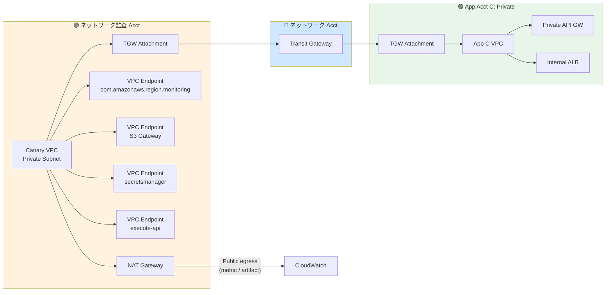

# ADR-059: 認証実装漏れ検知 Central Canary アーキテクチャ（Pattern β）

- **ステータス**: Proposed（要件定義フェーズで Accepted 昇格予定）
- **日付**: 2026-07-06 作成、**2026-07-24 更新（基本設計 Wave 3 [U9 D-U9-16](../basic-design/09-operations-observability-design.md): Canary 実行環境を弊社監査 Acct へ配置変更 + 運用主体 = 弊社 SRE。§M.4 逆転採用）**
- **関連**:
  - [ADR-039 ネットワーク監査アカウント設計](039-centralized-network-account-edge-layer.md)（Origin Protection、本 ADR の配置前提。**2026-07-24: 参照は v3〔6 アカウント体系、NW 監査 Acct = 他組織管理 — P-18〕へ読み替え**）
  - [§C-API-6 §C-6.6 認証実装漏れ検知 5 レイヤー](../api-platform/proposal/common/06-external-api-auth-architecture.md#c-6-6-認証実装漏れの-6-パターン--5-検知レイヤー)（本 ADR は L5 Behavioral の実装詳細）
  - [§C-API-5 §C-5.1 Service Catalog 標準提供物](../api-platform/proposal/common/05-self-service-catalog.md)（App Registry 登録の起点）
  - [ADR-057 CSRF 対策の責任分界](057-csrf-protection-responsibility-boundary.md)（Cookie 認証時のテスト観点）
  - [ADR-051 Multi-Region DR / Failover](051-multi-region-dr-failover.md)（Multilocation Canary の DR 併設）
  - [ADR-053 Observability Strategy](053-observability-strategy.md)（CloudWatch Metrics namespace 整合）

---

> **⚠ 2026-07-24 配置変更（[U9 D-U9-16](../basic-design/09-operations-observability-design.md)）**: **P-18 により NW 監査 Acct は他組織管理**となり、Pattern β の配置根拠（NW 監査チームの業務延長）が消滅。**Canary 実行環境は弊社監査 Acct へ配置変更、運用主体は弊社 SRE**（U9 D-U9-16）。方式（App Registry / OpenAPI Registry / Hybrid 検証 / Multi Checks Blueprint）は不変。本文の「ネットワーク監査 Acct」「Network 監査チーム」表記は **弊社監査 Acct / 弊社 SRE** に読み替え（§M.4 の 2026-07-24 逆転注記参照）。

---

## Context

### 背景

[§C-API-6 §C-6.6](../api-platform/proposal/common/06-external-api-auth-architecture.md) で「認証実装漏れの検知」を 5 レイヤー（IaC / Config / Static Code / Runtime Log / Behavioral）で担保する方針を確立し、L5 Behavioral に CloudWatch Synthetics canary を採用することにした。しかし **canary をどのアカウントで運用するか** は未確定であった。

顧客レビューで以下の要件が明確になった:

1. **「各アプリ実装を中央でチェックする」思想**（App team に自律を持たせつつ、認証実装漏れは中央で構造的に検知）
2. **Deploy 漏れの原理的排除**（App team が canary の deploy を忘れる可能性をゼロに）
3. **API GW を使わないモノリスや Private API も同様に監査可能**（本標準の対象は SPA + API に限定されない）

初期案として以下 2 パターンを比較:

- **Pattern α（各 App Acct 分散）**: Service Catalog 製品テンプレに canary を同梱、各 App Acct が自 canary を deploy
- **Pattern β（ネットワーク監査 Acct 集約）**: Central Canary が全アプリを probe

### なぜ本 ADR が必要か

- α と β では **deploy 漏れ防止の構造的保証**、**運用主体**、**Cross-Account 要件**、**思想的整合性** が全く異なる
- モノリス（API GW を使わない SSR / Lambda Function URL / 直接 ALB）や Private API（VPC 内部のみ）にも対応する canary 配置戦略が必要
- CloudWatch Synthetics の runtime バージョン、認証機能（Multi Checks Blueprint OAuth ネイティブ対応）、VPC/Multilocation 対応など仕様が 2024-2026 で大きく進化しており、過去実装案（[§C-API-5 §C-5.1.1](../api-platform/proposal/common/05-self-service-catalog.md) / [§C-API-6 §C-6.6.8](../api-platform/proposal/common/06-external-api-auth-architecture.md)）に含まれる `syn-nodejs-puppeteer-7.0` 等の記述は Deprecated / 不正確、修正が必要

### 業界用語の整理

| 用語 | 意味 |
|---|---|
| **CloudWatch Synthetics canary** | AWS マネージド合成監視、Lambda ベースで定期実行、HTTP/UI probe を送出 |
| **Multi Checks Blueprint** | 2024 GA、10 checks/canary の HTTP/DNS/SSL/TCP テスト JSON 設定、OAuth ネイティブ + Secrets Manager 参照サポート |
| **Puppeteer runtime**（`syn-nodejs-puppeteer-16.1` 最新）| Chromium 込みの重量 runtime、複雑シナリオ / OpenAPI 動的 probe 向け |
| **Node.js-only runtime**（`syn-nodejs-5.1` 最新）| Puppeteer 抜き軽量 runtime、Multi Checks Blueprint 用 |
| **Multilocation canary**（2026 GA、`syn-nodejs-puppeteer-16.0+`）| 単一 canary を複数 region に replica |
| **Negative test** | 未認証リクエストで 401/403 期待 |
| **Positive test** | valid token 付きで 2xx 期待、テスト基盤健全性検証 |
| **App Registry** | 監視対象アプリの Base URL / OpenAPI 場所 / Test client 参照を管理する中央 DynamoDB |

---

## Decision

### 採用方針

**Pattern β（ネットワーク監査 Acct に Central Canary 集約）を採用**。

### 主要判断

| 判断ポイント | 採用 |
|---|---|
| **配置 Acct** | **ネットワーク監査 Acct**（[ADR-039 v2](039-centralized-network-account-edge-layer.md) の CloudFront/WAF/Lambda@Edge 集約 Acct と同居）|
| **運用主体** | **Network 監査チーム**（既に CloudFront / WAF ルールを一元運用しており、canary は同種の監視業務の延長）|
| **Runtime（既定）** | **`syn-nodejs-puppeteer-16.1`**（Puppeteer、OpenAPI 動的発見 + 認証状態遷移対応、最新版）|
| **Runtime（小規模用）** | **`syn-nodejs-5.1`** + **Multi Checks Blueprint** |
| **App Registry** | **DynamoDB `app-registry`** をネットワーク監査 Acct に配置、Service Catalog 起動時に自動登録 |
| **OpenAPI Registry** | **S3 `openapi-registry`** をネットワーク監査 Acct に配置、Cross-Acct Bucket Policy で App Acct 書込み許可 |
| **Test Client Secret 保管**（β-Sec-A）| **ネットワーク監査 Acct 内 Secrets Manager 集約**、Auth Acct に central OAuth client（`canary-central-readonly`）を発行 |
| **Positive/Negative の Hybrid 検証** | 4×4 真偽値表に基づく failure 分類（[§C-6.6.8](../api-platform/proposal/common/06-external-api-auth-architecture.md)）|
| **Monolith 対応** | ✅ 対応、認証パターン別 assertion（後述 §D）|
| **Private API 対応** | ✅ 対応、Canary VPC + Transit Gateway 経由（後述 §E）|
| **Multilocation** | Phase 1 は単一 region（`ap-northeast-1`）、Phase 2 で DR region `ap-northeast-3` へ replica |
| **α の Fallback 検討** | 却下、ただし α + Enforcement 5 手段は本 ADR §F に参考記載 |

---

## A. 5 アカウント体系での配置と全体像

> **2026-07-24 読み替え（U9 D-U9-16 / ADR-039 v3）**: 本節の図・本文は **旧 5 アカウント体系** で記述。現行は **6 アカウント体系**（**Auth Acct → Broker Acct** に改称）へ読み替え。あわせて「🟣 ネットワーク監査 Acct」内の **Canary 系リソース（App Registry / OpenAPI Registry / Central Canary / Secrets Manager `canary/central/*` / Alert Router）は弊社監査 Acct に配置**（CloudFront / WAF / Lambda@Edge は NW 監査 Acct のまま — 他組織管理）。

### A.1 配置図

```mermaid
flowchart TB
    subgraph NA["🟣 ネットワーク監査 Acct"]
        Registry[App Registry<br/>DynamoDB]
        OpenAPIReg[OpenAPI Registry<br/>S3]
        CC[Central Canary<br/>Puppeteer 16.1]
        SM[Secrets Manager<br/>canary/central/*]
        CW[CloudWatch<br/>Namespace: AuthCheck<br/>Dim: AppId]
        CF_A[CloudFront-A]
        CF_B[CloudFront-B]
        CF_Auth[CloudFront-Auth]
        LE[Lambda@Edge<br/>X-Origin-Verify 注入]
        SNS[SNS Topic<br/>router]
    end

    subgraph Auth["🟠 Auth Acct"]
        KC[Keycloak<br/>OAuth /token]
    end

    subgraph AppA["🟢 App Acct A"]
        SC_A[Service Catalog<br/>製品起動]
        APIGW_A[API GW REST]
        Lambda_A[Lambda]
    end

    subgraph AppB["🟢 App Acct B: Monolith"]
        SC_B[Service Catalog<br/>製品起動]
        ALB_B[ALB]
        ECS_B[ECS SSR モノリス]
    end

    subgraph AppC["🟢 App Acct C: Private"]
        SC_C[Service Catalog<br/>製品起動]
        APIGW_C[API GW Private]
        Lambda_C[Lambda VPC]
    end

    subgraph N["🔷 ネットワーク Acct"]
        TGW[Transit Gateway]
    end

    SC_A -.deploy 時に自動登録.-> Registry
    SC_A -.OpenAPI export.-> OpenAPIReg
    SC_B -.同上.-> Registry
    SC_B -.OpenAPI export.-> OpenAPIReg
    SC_C -.同上.-> Registry
    SC_C -.OpenAPI export.-> OpenAPIReg

    CC -.Scan.-> Registry
    CC -.Get.-> OpenAPIReg
    CC -.token.-> SM
    CC -.OAuth.-> KC
    CC -->|Public: CloudFront 経由| CF_A
    CC -->|Public: CloudFront 経由| CF_B
    CC -->|"Private: TGW 経由<br/>(VPC 内 Canary)"| TGW

    CF_A --> APIGW_A
    CF_B --> ALB_B
    TGW --> APIGW_C

    CC --> CW
    CC --> SNS

    style NA fill:#fff3e0
    style Auth fill:#fce4ec
    style AppA fill:#e8f5e9
    style AppB fill:#e8f5e9
    style AppC fill:#e8f5e9
    style N fill:#cfe8ff
```

### A.2 Central Canary 構成の 4 コンポーネント

| # | コンポーネント | 場所 | 役割 |
|---|---|---|---|
| **1** | **App Registry**（DynamoDB）| ネットワーク監査 Acct | 監視対象アプリの Base URL / OpenAPI 場所 / 認証パターン / Test client / 通知先 team を管理。Service Catalog 起動時に自動登録 |
| **2** | **OpenAPI Registry**（S3）| ネットワーク監査 Acct | 各アプリの deploy 済 OpenAPI 正本。API GW から自動 export される |
| **3** | **Central Canary**（Puppeteer 16.1）| ネットワーク監査 Acct | Registry を Scan → 各アプリの endpoint を Hybrid 検証 |
| **4** | **Alert Router**（SNS + Lambda）| ネットワーク監査 Acct | Failure 分類（[§C-6.6.8 4×4 真偽値表](../api-platform/proposal/common/06-external-api-auth-architecture.md)）に基づき App team / Platform team / Security オンコールへ通知振り分け |

---

## B. App Registry のスキーマと自動登録

### B.1 DynamoDB スキーマ

```json
{
  "appId": "expense-api",
  "baseUrl": "https://app-a.example.com",
  "authPattern": "api-gw-jwt",
  "openApiS3Key": "888888888888/expense-api/openapi.yaml",
  "testTokenSecret": "canary/central/expense-api-readonly",
  "networkClass": "public",
  "alertRouting": {
    "critical": "arn:aws:sns:...:security-oncall",
    "warn": "arn:aws:sns:...:platform-team",
    "info": "arn:aws:sns:...:app-a-team"
  },
  "vpcConfig": null,
  "createdAt": "2026-07-06T10:00:00Z",
  "updatedAt": "2026-07-06T10:00:00Z"
}
```

### B.2 認証パターン識別子（authPattern）

| 値 | 対応 |
|---|---|
| `api-gw-jwt` | API GW REST + JWT Authorizer |
| `api-gw-iam` | API GW REST + AWS_IAM Auth |
| `alb-cookie-monolith` | ALB + アプリ内 Cookie セッション（SSR モノリス）|
| `alb-code-jwt` | ALB + アプリコード内 JWT 検証 |
| `lambda-function-url-iam` | Lambda Function URL + AWS_IAM |
| `api-gw-private` | API GW Private endpoint（VPC 内）|
| `internal-alb-jwt` | Internal ALB + アプリコード JWT（VPC 内）|

### B.3 自動登録フロー

Service Catalog 製品テンプレに Custom Resource Lambda を同梱、App Acct から Cross-Acct Role Assume で ネットワーク監査 Acct の Registry へ Put:

```yaml
# Service Catalog 製品テンプレ内
Resources:
  RegisterInAppRegistry:
    Type: Custom::AppRegistryRegister
    Properties:
      ServiceToken: !ImportValue SharedAppRegistryRegisterFunction  # in ネットワーク監査 Acct via Cross-Acct
      AppId: !Ref AppName
      BaseUrl: !Sub "https://${DomainName}"
      AuthPattern: !Ref AuthPattern
      OpenApiS3Bucket: !ImportValue SharedOpenApiRegistryBucket
      # ... 他フィールド
```

**必要な Cross-Acct IAM**:
- App Acct: `AppRegistryRegisterFunction` 実行 Role が ネットワーク監査 Acct の `AppRegistryPutRole` を AssumeRole
- ネットワーク監査 Acct: `AppRegistryPutRole` の Trust Policy に App Acct principal を許可

---

## C. Cross-Account 要件

> **2026-07-24 読み替え（U9 D-U9-16）**: 下表の Cross-Acct 宛先「ネットワーク監査 Acct」は **弊社監査 Acct** に読み替え（Registry / OpenAPI Registry / Test Client Secrets の配置先変更に伴う。OAuth central client の発行元は Auth Acct → **Broker Acct**）。要件構造（2 種類の書込みパス + Public URL 完結）は不変。

Pattern β 採用時の Cross-Acct 要件は **2 種類のみ**（Registry + OpenAPI Registry 書込み）、その他は Public URL 経由で完結:

| 要件 | 方式 | 対象 |
|---|---|---|
| **App Registry 書込み**（App Acct → ネットワーク監査 Acct DynamoDB）| Cross-Acct AssumeRole | Service Catalog 内 Custom Resource Lambda |
| **OpenAPI Registry 書込み**（App Acct → ネットワーク監査 Acct S3）| S3 Bucket Policy | Service Catalog 内 OpenAPI Export Custom Resource |
| **CloudFront 経由 API 呼出** | Public URL（Cross-Acct 不要）| Central Canary |
| **OAuth `/oauth2/token`** | Public URL（Cross-Acct 不要）| Central Canary |
| **Test Client Secrets Read** | Same-Acct IAM（β-Sec-A で集約）| Central Canary |
| **Private API 呼出** | Transit Gateway 経由（後述 §E）| Central Canary in VPC |

---

## D. Monolith 監査対応（API GW を使わないアプリ）

### D.1 対応可能なモノリス構成

| 構成 | 監査可否 | 認証パターン | Assertion 方針 |
|---|:---:|---|---|
| **Public ALB + SSR + Cookie セッション** | ✅ | `alb-cookie-monolith` | Negative: 未認証 → **302 Redirect to /login** 期待、Location ヘッダ検証 |
| **Public ALB + SSR + Bearer JWT ヘッダ** | ✅ | `alb-code-jwt` | Negative: 401 期待、Positive: Bearer で 200 |
| **CloudFront + ALB + SSR** | ✅ | 同上、Origin Protection 経由 | 同上 |
| **Lambda Function URL（AWS_IAM）** | ✅ | `lambda-function-url-iam` | Negative: 403 期待（IAM 検証失敗）|
| **ECS 直接公開（NLB）** | ⚠ | 個別対応 | HTTP プロトコル配信なら可、TCP のみは対象外 |

### D.2 Cookie ベース SSR モノリスの assertion 例

Central Canary は OpenAPI アノテーション `x-canary-auth-mode: cookie-redirect` を認識して assertion を切替:

```yaml
paths:
  /dashboard:
    get:
      x-canary-auth-mode: cookie-redirect     # ⭐ SSR モノリス指定
      x-canary-expected-redirect: "/login"
      responses:
        '200': { ... }
```

対応する canary ロジック（Puppeteer）:

```javascript
async function probeMonolithCookie(appConfig, path) {
  // Negative test: 未認証 → 302 to /login 期待
  const negRes = await fetch(`${appConfig.baseUrl}${path}`, {
    redirect: 'manual'  // ⭐ 手動でリダイレクト検知
  });
  if (negRes.status !== 302 || !negRes.headers.get('location').includes('/login')) {
    throw new Error(`Auth missing on monolith: expected 302→/login, got ${negRes.status}`);
  }
}
```

### D.3 Multi Checks Blueprint での Monolith assertion

```json
{
  "id": "1",
  "name": "Monolith /dashboard - unauth redirect check",
  "type": "http",
  "request": {
    "url": "https://app-b.example.com/dashboard",
    "method": "GET",
    "followRedirects": false
  },
  "assertions": [
    { "type": "status", "operator": "equals", "expected": 302 },
    { "type": "header", "key": "location", "operator": "contains", "expected": "/login" }
  ]
}
```

→ **Cookie ベースモノリスも Multi Checks Blueprint で直接記述可能**、Puppeteer 不要。

### D.4 モノリス Positive test の 2 段階フロー

Cookie ベースは Positive test でログイン → セッション取得の 2 段階が必要:

```javascript
// Puppeteer で Cookie フロー
async function probeMonolithPositive(appConfig, path) {
  const browser = await puppeteer.launch();
  const page = await browser.newPage();

  // Step 1: ログインページで credential 送信
  await page.goto(`${appConfig.baseUrl}/login`);
  await page.type('#username', canaryUsername);
  await page.type('#password', canaryPassword);
  await Promise.all([
    page.waitForNavigation(),
    page.click('#submit')
  ]);

  // Step 2: セッション付きで対象 endpoint 呼出
  const res = await page.goto(`${appConfig.baseUrl}${path}`);
  if (res.status() !== 200) {
    throw new Error(`Positive failed: ${res.status()}`);
  }
  await browser.close();
}
```

→ **Puppeteer runtime だと Cookie セッションの Positive test も自然に実装可能**（HTML フォーム自動送信）。Multi Checks Blueprint では Positive の Cookie フローは限定的、Puppeteer が本命。

---

## E. Private API 監査対応

### E.1 対応可能な Private 構成

| 構成 | 監査可否 | 到達手段 |
|---|:---:|---|
| **API GW Private endpoint** | ✅ | VPC Interface Endpoint（`execute-api`）|
| **Internal ALB**（VPC 内）| ✅ | VPC 内から直接、または TGW 経由 |
| **Internal NLB**（VPC 内）| ✅ | 同上 |
| **VPC Lattice Service** | ✅ | VPC Lattice Service Association |
| **ECS Service Connect** | ⚠ | Service Connect Namespace 参加が必要（限定的）|

### E.2 Canary VPC 構成（ネットワーク監査 Acct）



### E.3 Private 監査の 3 経路

| 経路 | 用途 | 実装 |
|---|---|---|
| **経路 P-1: Transit Gateway 経由** | Cross-Acct 内部 ALB / NLB / VPC 内 API GW REGIONAL | Canary VPC を TGW にアタッチ、App Acct VPC の CIDR にルート |
| **経路 P-2: VPC Interface Endpoint** | API GW Private endpoint（`execute-api`）| VPC Endpoint Policy で許可、Cross-Acct でも RAM で共有可 |
| **経路 P-3: VPC Lattice Service Association** | VPC Lattice サービス | Service Network + Association |

### E.4 Private 呼出時の Runtime 選択

Multi Checks Blueprint は VPC 対応。ただし OAuth token の取得先が Public（Auth Acct）の場合、以下の考慮必要:

| 状況 | 対応 |
|---|---|
| OAuth /token endpoint が **Public** | Canary VPC + NAT Gateway で egress、Private target と Public /token を両立 |
| OAuth /token が **Private**（Internal のみ）| VPC 内から /token 呼出、NAT 不要 |

### E.5 モノリスかつ Private の複合ケース

例: Internal ALB + Cookie セッション + VPC 内配置

→ **Puppeteer runtime + VPC + TGW アタッチ + Cookie フロー**の組合せで対応可能。全パターンで Central Canary から監査可能。

---

## F. 却下案：Pattern α + Enforcement 5 手段

α（各 App Acct 分散）採用時に deploy 漏れ防止する 5 手段:

| # | 手段 | 予防 | 検知 |
|---|---|:---:|:---:|
| 1 | **SCP + Service Catalog 強制**（非 Service Catalog 経由の API GW 作成禁止）| ✅ | – |
| 2 | **Config Rule** `api-gw-must-have-canary` | – | ✅ |
| 3 | **EventBridge Auto Deploy**（新規 API GW 作成 → Lambda が自動 canary deploy）| ✅ | – |
| 4 | **定期スキャン Lambda**（Config Aggregator + Coverage Matrix）| – | ✅ |
| 5 | **中央ダッシュボード**（Security Hub Custom Insight）| – | 可視化 |

**却下理由**:
- **構造的保証性が β 未満**：手段 1-5 のいずれかが設定漏れ / 例外承認・rule 見落としで機能停止するリスクあり
- **運用工数が β + 追加**：Enforcement 3 段防御を継続監査する工数が発生
- **思想的不整合**：「中央でチェック」という要件を「中央から強制」に置き換えており本質が異なる

ただし α + Enforcement は **β が組織的に採用不能な場合の Fallback として実装可能**、本 ADR では参考として記載のみ。

---

## G. Multi Checks Blueprint vs Puppeteer 選定基準

| 判定軸 | Multi Checks Blueprint | Puppeteer カスタム canary |
|---|:---:|:---:|
| **endpoint 数**（App × 2 test 合算）| ≤ 10 | > 10 |
| **OpenAPI 動的発見** | ❌ 固定 JSON | ✅ |
| **Cookie セッション Positive test** | ⚠ 限定 | ✅ フル対応 |
| **OAuth Client Credentials** | ✅ ネイティブ | ⚠ 自前実装 |
| **Secrets Manager 参照** | ✅ `${AWS_SECRET:...}` | ⚠ SDK 直接 |
| **VPC 対応** | ✅ | ✅ |
| **Multilocation 対応** | ❌ | ✅（`syn-nodejs-puppeteer-16.0+`）|
| **実装工数** | ✅ JSON のみ | ⚠ Node.js コード |
| **runtime cost** | ✅ 軽量（`syn-nodejs-5.1`）| ⚠ 重（Chromium 含）|

### G.1 選定ルール

| App の状況 | 選定 |
|---|---|
| endpoint 数 ≤ 10、Bearer JWT のみ | **Multi Checks Blueprint**（1 canary/app）|
| endpoint 数 > 10 or OpenAPI ドリブン希望 | **Puppeteer カスタム canary**（1 canary/app）|
| Cookie モノリスで Positive test 必要 | **Puppeteer カスタム canary** |
| Central 単一 canary で全アプリ処理 | **Puppeteer カスタム canary** ⭐ 本 ADR の本命 |

→ **Central Canary（Pattern β）の実装は Puppeteer カスタム canary 単一**、App Registry を Scan して全アプリ処理。Multi Checks Blueprint は個別要件時の代替。

---

## H. Runtime バージョン（2026-07 時点）

| Runtime | バージョン | 用途 |
|---|---|---|
| `syn-nodejs-puppeteer-16.1` | ⭐ 最新 | Puppeteer カスタム canary、Multilocation 対応 |
| `syn-nodejs-5.1` | ⭐ 最新 | Node.js-only、Multi Checks Blueprint 用 |
| `syn-nodejs-puppeteer-7.0` | ❌ **Deprecated** | 過去実装案で誤って引用、修正必要 |

### H.1 namespace（v13.1 以降変更）

| 旧 | 新（推奨）|
|---|---|
| `require('Synthetics')` | `require('@aws/synthetics-puppeteer')` |
| `require('SyntheticsLogger')` | `require('@aws/synthetics-logger')` |

### H.2 AWS SDK

- `syn-nodejs-puppeteer-8.0+` は Lambda Node.js 18+、**AWS SDK v3 必須**
- `const AWS = require('aws-sdk')` は動作しない、`@aws-sdk/client-*` を使用

---

## I. Multilocation Canary（Phase 2）

Phase 1 は単一 region（`ap-northeast-1`）で運用。Phase 2 で以下を検討:

| 要件 | Multilocation 採用 |
|---|:---:|
| DR region `ap-northeast-3` からの併走監査 | ✅ 推奨 |
| グローバル SaaS 展開時の region 別 SLO | ✅ 推奨 |
| Blast radius 縮小（Central Canary 障害の region 分散）| ✅ 推奨 |

**制約**:
- Runtime は `syn-nodejs-puppeteer-16.0+` or `syn-nodejs-playwright-7.0+` のみ対応
- **Multi Checks Blueprint は非対応**（本 ADR の本命 Puppeteer カスタムは対応）
- Replica 数だけコスト線形増加

---

## J. WAF 共存

Central Canary から CloudFront + WAF を通過するため WAF 設定調整が必要:

| 対応 | 実装 |
|---|---|
| **Canary User-Agent 固定** | `User-Agent: CloudWatchSynthetics-central-auth-check` |
| **WAF Rule 例外** | Rate-based rule に「User-Agent が `CloudWatchSynthetics-` で始まるものは除外」を追加、全アプリ CloudFront で共通適用 |
| **監査ログ識別** | Access log で Canary リクエストと通常トラフィックを分離集計 |
| **代替：Canary Static IP** | VPC + NAT Gateway 経由なら固定 IP、WAF IP allowlist 可能 |

---

## K. Alert Router 設計（4×4 真偽値表準拠）

Central Canary が failure を検出した際、[§C-6.6.8 Hybrid 検証](../api-platform/proposal/common/06-external-api-auth-architecture.md) の 4×4 真偽値表に基づく分類で通知先を振り分け:

| Negative status | Positive status | 分類 | 通知先 |
|:---:|:---:|---|---|
| 200 | 200 | 🔥 CRITICAL: 認証完全 missing | Security オンコール + App team（P1 即時）|
| 200 | 401/403 | 🔥 CRITICAL: 認証ロジック逆 | Security オンコール + App team（P1）|
| 401/403 | 401/403 | 🟡 WARN: Test token 失効 | Platform チーム（P2 24h）|
| 401/403 | 404 | 🟡 WARN: Endpoint 不在 / config ミス | Platform チーム（P2）|
| 401/403 | 500 | 🟢 INFO: Backend バグ、認証 OK | App team（P3）|

Alert Router Lambda が App Registry の `alertRouting` フィールドを参照して SNS Topic を選択。

---

## L. Consequences

### Positive

- ✅ **Deploy 漏れが構造的にゼロ**：Service Catalog 起動が App Registry 登録を強制、Central Canary が全登録アプリを自動追随
- ✅ **統一実装保証**：Central Canary 1 実装で全アプリ同一方式チェック、実装バラつきゼロ
- ✅ **「各アプリ実装を中央でチェック」思想と完全一致**
- ✅ **ADR-039 v2 の中央集約思想と整合**（Network 監査チームが CloudFront/WAF/canary を一元運用）
- ✅ **Cross-Acct 要件が最小**（Registry + OpenAPI Registry 書込みの 2 パスのみ）
- ✅ **モノリス / Private API / Cookie セッションもフル対応**
- ✅ **中央ダッシュボード**：全アプリ Coverage を Network 監査 team が横串可視化
- ✅ **Test Client Secret 一元管理**：ローテーション運用が集中、アプリ数線形コスト増を回避

### Negative

- ⚠ **Central Canary Blast Radius**：Canary 障害 = 全アプリ監視停止 → **Multilocation で ap-northeast-3 replica** を Phase 2 で追加
- ⚠ **Network 監査チームの運用負荷**：Puppeteer コード + Registry + Alert Router の保守が集中 → 変更頻度低の設計で軽減
- ⚠ **アプリ独自 probe（tenant 越境等）**：Central Canary への PR プロセス必要 → OpenAPI アノテーション拡張で柔軟性確保
- ⚠ **App team 自律性の一部低下**：canary 変更が中央依存 → App team は OpenAPI 制御でカバー可能

### Neutral

- Runtime `syn-nodejs-puppeteer-16.1` の依存管理は Network 監査 team 責任、AWS 側 EOL 対応に追随
- Multi-region deploy を Phase 2 で採用時、cost 線形増加を許容判断

---

## M. Alternatives Considered

### M.1 Pattern α（各 App Acct 分散）+ Enforcement 5 手段

**却下**。理由:
- deploy 漏れ防止が **構造的保証 → Enforcement 依存**に劣化
- Enforcement 3 段防御（SCP + Config Rule + Dashboard）の継続運用コストが発生
- 「中央でチェック」思想を「中央から強制」に置き換えており本質が異なる

ただし本 ADR §F に **Fallback 案として記述保持**、β が組織的に採用不能な場合の対応可能とする。

### M.2 Pattern γ（各 App Acct + Direct API GW）

**却下**。理由:
- CloudFront + WAF + Origin Protection を経由せず、実プロダクション経路と乖離
- Canary が X-Origin-Verify Secret を保持することになり Security posture 悪化

### M.3 Central Canary in Auth Acct

> **2026-07-24 注記（U9 D-U9-16）**: Auth Acct（現 Broker Acct、[ADR-039 v3](039-centralized-network-account-edge-layer.md) 6 アカウント体系）への配置却下は**引き続き有効**（SoD 違反の理由は不変）。ただし NW 監査 Acct 配置の前提が P-18 で消滅したため、採用先は **§M.4 の弊社監査 Acct** へ変更。

**却下**。理由:
- Auth Acct は認証機能責務、canary は監視責務、SoD 違反
- ADR-039 v2 の Network / Auth Acct 分離思想と不整合

### M.4 Central Canary in 監査 Acct（Compliance）

> **🔄 2026-07-24 逆転（U9 D-U9-16）**: **却下理由は「NW 監査 Acct = 自管理」前提時代のもの。P-18（NW 監査 Acct 他組織管理化）で前提が消滅したため、本 M.4 案を採用**。Canary 実行環境 = 弊社監査 Acct、運用主体 = 弊社 SRE。方式（App Registry / OpenAPI Registry / Hybrid 検証 / Multi Checks Blueprint）は Pattern β のまま不変。

**却下**。理由:
- 監査 Acct は監査ログ集約 + Organizations 責務、canary の active probe は責務違い
- Network 監査 Acct が既に CloudFront/WAF を運用しており、canary 併設が自然

---

## N. Implementation Roadmap

> **2026-07-24 注記（U9 D-U9-16）**: 各 Phase の構築先は弊社監査 Acct に読み替え。**Phase 2a（ap-northeast-3 大阪 replica）は [U9](../basic-design/09-operations-observability-design.md) の Phase 2 と整合させる**（DR 併走監視の採否は U9 Phase 2 計画に従う）。

| Phase | 内容 | 期間 |
|---|---|---|
| **Phase 1a** | App Registry DynamoDB + OpenAPI Registry S3 構築、Cross-Acct Bucket Policy 整備 | 1 週 |
| **Phase 1b** | Central Canary Puppeteer 実装（Registry Scan + Hybrid 検証）| 2 週 |
| **Phase 1c** | Alert Router Lambda（4×4 分類）| 1 週 |
| **Phase 1d** | Service Catalog 製品テンプレに Registry 自動登録 Custom Resource 追加 | 1 週 |
| **Phase 1e** | 1 アプリで PoC（`expense-api`）| 1 週 |
| **Phase 2a** | Multilocation replica を ap-northeast-3 に追加 | 1 週 |
| **Phase 2b** | Cookie モノリス対応（Puppeteer Cookie フロー実装）| 2 週 |
| **Phase 2c** | Private API 対応（Canary VPC + TGW アタッチ）| 2 週 |
| **Phase 3** | App team 通知先 / OpenAPI アノテーション整備、Dashboard 公開 | 継続 |

---

## O. Migration / Cleanup（過去記述の修正）

以下 3 ファイルに **α 前提の Puppeteer カスタム canary 記述** および **Deprecated runtime version** が残っており、本 ADR 採用後に修正必要:

| ファイル | 修正内容 |
|---|---|
| **[§C-API-5 §C-5.1.1](../api-platform/proposal/common/05-self-service-catalog.md)** | 「Service Catalog に canary 同梱」を「Service Catalog に App Registry 登録 Custom Resource + OpenAPI Export 同梱」に修正、Central Canary は本 ADR で別途配置 |
| **[§C-API-6 §C-6.6.8](../api-platform/proposal/common/06-external-api-auth-architecture.md)** | Runtime version 修正（`syn-nodejs-puppeteer-16.1` / `syn-nodejs-5.1`）、namespace `@aws/synthetics-*`、AWS SDK v3、Multi Checks Blueprint の OAuth ネイティブ機能明示、Central Canary への言及追加 |
| **[customer-doc/01 §1.7](../api-platform/customer-doc/01-external-api-auth-decision-guide.md)** | 「各アプリで canary」→「中央 canary で全アプリ横断チェック、アプリ deploy 時に自動追随」に修正、Monolith / Private 対応も追記 |

---

## P. TBD / 要ヒアリング

| ID | 質問 |
|---|---|
| `H-CAN-BETA-1` | Central Canary の **運用主体**：Network 監査チーム確定か、Security / Platform も候補 |
| `H-CAN-BETA-2` | Test client Secret の **保管場所**：β-Sec-A（ネットワーク監査 Acct 集約、本 ADR 想定）で確定か |
| `H-CAN-BETA-3` | App Registry 登録の **タイミング**：Service Catalog 起動時 auto、または手動レビュー |
| `H-CAN-BETA-4` | Central Canary コード変更管理：Network 監査チームリポで PR 制、App team は PR 出す形か |
| `H-CAN-BETA-5` | **Multi-region canary**：Phase 2 で ap-northeast-3 replica 採用するか（DR 併走監視要件次第）|
| `H-CAN-BETA-6` | App 固有 probe（tenant 越境等）の **拡張方法**：OpenAPI アノテーションで表現、Central が動的処理 |
| `H-CAN-BETA-7` | **Monolith Cookie 認証**の Positive test credential 管理：Test user アカウント発行方針 |
| `H-CAN-BETA-8` | **Private API 監視**：Canary VPC + TGW を Phase 2 で採用するか、Phase 1 は Public のみか |
| `H-CAN-BETA-9` | **WAF 例外設定**：全 CloudFront の WAF ルールに Canary User-Agent 除外を FMS で一括配布するか |
| `H-CAN-BETA-10` | Alert Router の **通知先粒度**：App team / Platform / Security の 3 分岐で十分か、より細分化必要か |

---

## Q. 参考資料

- [AWS: CloudWatch Synthetics Canary Blueprints（Multi Checks / API canary）](https://docs.aws.amazon.com/AmazonCloudWatch/latest/monitoring/CloudWatch_Synthetics_Canaries_Blueprints.html)
- [AWS: Multi Checks Blueprint 認証設定（Basic / API Key / SigV4 / OAuth Client Credentials）](https://docs.aws.amazon.com/AmazonCloudWatch/latest/monitoring/CloudWatch_Synthetics_Canaries_MultiCheck_Blueprint.html)
- [AWS: Synthetics Runtime versions（`syn-nodejs-puppeteer-16.1` / `syn-nodejs-5.1` 最新）](https://docs.aws.amazon.com/AmazonCloudWatch/latest/monitoring/CloudWatch_Synthetics_Library_nodejs_puppeteer.html)
- [AWS: Multilocation canaries（2026 GA）](https://docs.aws.amazon.com/AmazonCloudWatch/latest/monitoring/CloudWatch_Synthetics_Canaries_MultiLocation.html)
- [AWS: Running a canary on a VPC](https://docs.aws.amazon.com/AmazonCloudWatch/latest/monitoring/CloudWatch_Synthetics_Canaries_VPC.html)
- [ADR-039 ネットワーク監査アカウント設計（v2 5 アカウント体系）](039-centralized-network-account-edge-layer.md)
- [§C-API-6 §C-6.6 認証実装漏れ検知 5 レイヤー](../api-platform/proposal/common/06-external-api-auth-architecture.md#c-6-6-認証実装漏れの-6-パターン--5-検知レイヤー)
