# 01. クラウドガイドライン総論（アプリチーム向け）

前提: [00-basic-design-plan.md](00-basic-design-plan.md) BD-P-01〜08
対象読者: 各アプリチームの開発者 / アーキテクト / SRE
位置付け: API プラットフォーム標準を「**アプリチームが何をすればよいか**」に翻訳した実務ガイドの入口

---

## §1.0 前提と背景

### §1.0.1 なぜこのガイドラインが必要か

API プラットフォーム標準（`proposal/` 配下）は **要件・設計仕様** を定義するが、各アプリチームがそれを読み解いて個別実装すると、解釈のばらつき・実装漏れ・車輪の再発明が起きる。本ガイドライン群は標準を **「従えばよい手順」** に落とし、アプリチームの認知負荷を最小化する。

### §1.0.2 本ガイドラインの守備範囲

| 対象 | 範囲 | 対象外（別ドキュメント）|
|---|---|---|
| 流量制御 | API GW / CloudFront / WAF の rate limit・quota 設計 | 認証基盤の流量制御（認証側 §NFR）|
| 課金制御 | Cost Allocation Tag / Budgets / Partner 按分 | 全社 FinOps ポリシー |
| 静的解析 | cfn-guard / cdk-nag / Semgrep のルール・CI 統合 | アプリ固有のビジネスロジックテスト |
| テストプロセス | Pre-Deploy / Deploy / Runtime の 3 段階 | E2E 機能テスト全般 |

認証外形監視（Central Canary）は **別領域**（章 10-16）として扱う。本ガイドラインはアプリチームが日常的に守る「ルール」、外形監視は Network 監査チームが運用する「中央機構」。

### §1.0.3 3 アーキパターンとの関係

本ガイドラインは [§C-API-2](../proposal/common/02-runtime-selection-criteria.md) の 3 アーキパターンすべてに適用される:

| アーキパターン | 流量制御の主戦場 | 静的解析の対象 |
|---|---|---|
| SPA + API | API GW + CloudFront | IaC + フロント / API コード |
| SSR + API | API GW + CloudFront | IaC + SSR / API コード |
| SSR モノリス | ALB + CloudFront | IaC + モノリスコード |

---

## §1.1 死守事項サマリ（アプリチームが必ず守ること）

各章の詳細に入る前に、**絶対に外してはいけない項目**を一覧化する。詳細と根拠は各章参照。

### §1.1.1 流量制御の死守事項（→ [02 章](02-rate-limiting-quota-rules.md)）

| # | 死守事項 | 章参照 |
|---|---|---|
| RL-1 | Public エンドポイントには **WAF Rate-based rule 必須**（無制限公開禁止）| §2.x |
| RL-2 | Partner API には **Usage Plan による quota 設定必須** | §2.x |
| RL-3 | 429 応答時は **標準エラー body + Retry-After ヘッダ** | §2.x |
| RL-4 | 高コスト endpoint は **method 単位 throttle** で個別保護 | §2.x |

### §1.1.2 課金制御の死守事項（→ [03 章](03-billing-cost-allocation-rules.md)）

| # | 死守事項 | 章参照 |
|---|---|---|
| BL-1 | 全リソースに **必須 Cost Allocation Tag**（app-id / env / cost-center / owner）| §3.x |
| BL-2 | app / env 単位の **AWS Budgets 設定必須** | §3.x |
| BL-3 | Partner API は **API Key 経由で利用者識別**（課金按分の前提）| §3.x |
| BL-4 | Outbound SaaS 利用は **コスト monitor 対象化** | §3.x |

### §1.1.3 静的解析の死守事項（→ [04 章](04-static-analysis-guidelines.md)）

| # | 死守事項 | 章参照 |
|---|---|---|
| SA-1 | IaC は **cfn-guard または cdk-nag を CI で強制**（認証 / Origin Protection / タグ検証）| §4.x |
| SA-2 | アプリコードは **Semgrep を CI で実行**（認証 middleware / JWT 検証バグ検出）| §4.x |
| SA-3 | 検知は **deploy をブロック**（warn だけで通さない、例外は申請制）| §4.x |

### §1.1.4 テストプロセスの死守事項（→ [05 章](05-security-test-process.md)）

| # | 死守事項 | 章参照 |
|---|---|---|
| TP-1 | Pre-Deploy で **静的解析 + IaC lint を通過**させる | §5.x |
| TP-2 | Deploy は **Service Catalog 製品経由**（死守事項自動準拠）| §5.x |
| TP-3 | Runtime で **Central Canary の監視対象に登録**（App Registry）| §5.x |
| TP-4 | 検知アラート発火時の **対応 SLA を遵守**（P1: 即時 / P2: 24h）| §5.x |

---

## §1.2 責務分担（アプリチーム vs Platform / Network 監査チーム）

本標準の一貫した設計思想は「**Engine は中央、Relationship 運用は分散**」（[§C-API-6 §C-6.1](../proposal/common/06-external-api-auth-architecture.md)）。ガイドライン領域でも同様:

| 領域 | アプリチームの責務 | 中央（Platform / Network 監査）の責務 |
|---|---|---|
| **流量制御** | Usage Plan tier 選択 / quota 値設定 / 429 ハンドリング実装 | WAF ルール配布（FMS）/ CloudFront 標準 / rate limit 基盤 |
| **課金制御** | タグ付与 / Budgets 設定 / 自 app のコスト監視 | Cost Allocation Tag 有効化 / Athena 集計基盤 / 全社ダッシュボード |
| **静的解析** | CI に組込 / 検知修正 / 例外申請 | ルールセット配布 / cfn-guard・Semgrep ルール保守 |
| **テストプロセス** | Pre-Deploy テスト実行 / OpenAPI 維持 | Service Catalog 製品 / Central Canary / 検知基盤 |

→ **アプリチームは「設定・実装・修正」、中央は「基盤・ルール・機構」を担う**。

---

## §1.3 各章の読み方

```mermaid
flowchart TD
    Start([アプリチーム 新規 API 立ち上げ])
    Overview[01 総論<br/>本章]
    Start --> Overview

    Overview --> RL[02 流量制御<br/>どれだけ捌くか]
    Overview --> BL[03 課金制御<br/>コストをどう把握するか]
    Overview --> SA[04 静的解析<br/>実装漏れをどう防ぐか]
    Overview --> TP[05 テストプロセス<br/>いつ何を検証するか]

    RL --> Deploy[Service Catalog<br/>製品起動]
    BL --> Deploy
    SA --> Deploy
    TP --> Deploy

    Deploy --> Monitor[Central Canary<br/>監視対象に自動登録<br/>章 10-16]

    style Overview fill:#fff9c4
    style Deploy fill:#c8e6c9
    style Monitor fill:#e3f2fd
```

| 状況 | 読むべき章 |
|---|---|
| 新規 API を立ち上げる | 01 → 02 → 03 → 04 → 05 の順に通読 |
| 流量が想定を超えそう | 02 章の判断フロー |
| コストが膨らんでいる | 03 章のタグ + Budgets |
| CI で検知が出た | 04 章の例外申請プロセス |
| deploy 前チェックリスト | 05 章の Pre-Deploy 節 |

---

## §1.4 設計判断（本章）

| ID | 判断 | 根拠 |
|---|---|---|
| D-G-01 | ガイドラインは「死守事項サマリ（本章 §1.1）→ 各章詳細」の 2 層構造とする | アプリチームは §1.1 だけで最低ラインを把握でき、深掘りは各章に委譲できる |
| D-G-02 | 認証外形監視（Central Canary）はガイドラインと分離し章 10-16 で扱う | アプリチームが日常守る「ルール」と中央運用の「機構」は読者・責務が異なる |
| D-G-03 | 責務分担は「Engine 中央 / Relationship 分散」（§C-API-6）を踏襲 | 標準全体の設計思想と一貫させ、認知負荷を下げる |

---

## §1.5 未決事項・他章への引き渡し

| ID | 内容 | 引き渡し先 |
|---|---|---|
| BD-Q-01 | ROSA 側 P-18（監査アカウント他組織管理）確定時の責任分界改訂 | 16 章 + 本章 §1.2 |
| G-HANDOFF-1 | Partner 区分（Tier 廃止後）の流量制御標準値 | 02 章 D-G-02x |
| G-HANDOFF-2 | Cost Center タグの組織側標準名との整合 | 03 章 |

---

## §1.x 関連ドキュメント

- [§C-API-1 全体参照アーキテクチャ](../proposal/common/01-reference-architecture.md)
- [§C-API-5 Service Catalog](../proposal/common/05-self-service-catalog.md)
- [§C-API-6 外部 API 認証アーキテクチャ](../proposal/common/06-external-api-auth-architecture.md)
- [ADR-039 ネットワーク監査 Acct](../../adr/039-centralized-network-account-edge-layer.md)
- [ADR-059 Central Auth Check Canary](../../adr/059-central-auth-check-canary-architecture.md)
