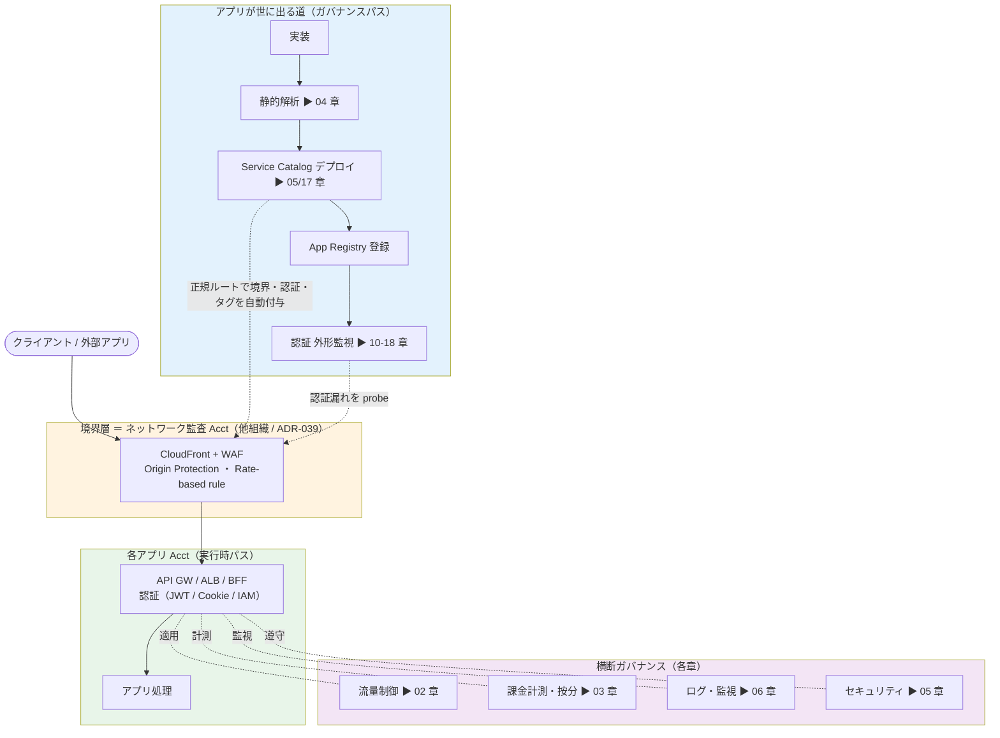
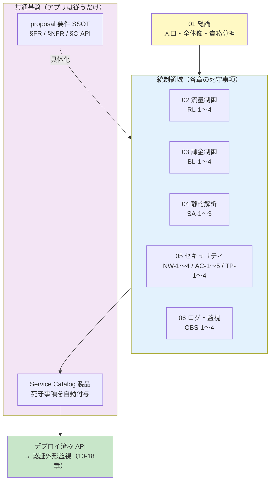
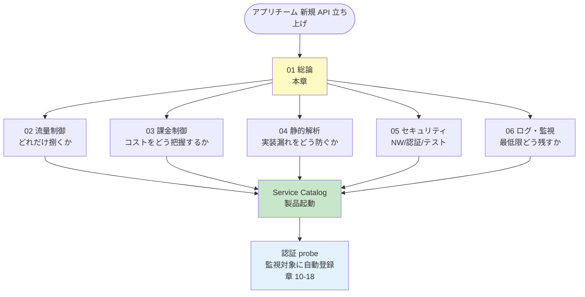

# 01. クラウドガイドライン総論（アプリチーム向け）

前提: [00-basic-design-plan.md](00-basic-design-plan.md) BD-P-01〜08
対象読者: 各アプリチームの開発者 / アーキテクト / SRE
位置付け: API プラットフォーム標準を「**アプリチームが何をすればよいか**」に翻訳した実務ガイドの入口

---

## §1.0 前提と背景

### §1.0.0 API 制御 全体像（全章の地図）

各章に入る前に、API プラットフォームの制御が **どこで・何を・どの章で**担保するかを 1 枚で把握する。制御は「**リクエストが通る道（実行時）**」と「**アプリが世に出る道（ガバナンス）**」の 2 軸で捉える。

**通過フロー（実行時）**: クライアント → **境界（CloudFront+WAF, ADR-039）** → **認証（アプリ Acct の GW/ALB/BFF）** → アプリ処理。この道の各段で **流量（02）／課金計測（03）／ログ・監視（06）／セキュリティ（05）** が横断的に効く。

**ガバナンスフロー（アプリが世に出る）**: 実装 → **静的解析（04, deploy 前に止める）** → **Service Catalog デプロイ（05/17, 境界・認証・タグを自動付与）** → **App Registry 登録** → **認証 外形監視（10-18, 稼働中の漏れを検知）**。

> 実行時パスは「1 リクエストが辿る道」、ガバナンスパスは「1 アプリがリリースされる道」。**両方が揃って初めて "どんなアプリでも安全に" が成立**する。各章はこの地図のどこかを詳細化したもの。

**ガイドライン構成図（統制領域＝各章の 5 本柱）**: 上の「地図」を、ガイドライン本体の構造として見ると次のとおり。01 総論を入口に、5 つの統制領域（02-06）がそれぞれ死守事項を持ち、共通基盤（Service Catalog / 要件 SSOT）の上に乗る。

> 5 本柱は**並列**（どれも独立に守る）。共通基盤の Service Catalog が死守事項の大半を自動付与するため、アプリチームは「値を選ぶ・修正する」だけで準拠できる。デプロイ後の実装漏れ検知は外形監視（10-18 章）が担う。

### §1.0.1 なぜこのガイドラインが必要か

API プラットフォーム標準（`proposal/` 配下）は **要件・設計仕様** を定義するが、各アプリチームがそれを読み解いて個別実装すると、解釈のばらつき・実装漏れ・車輪の再発明が起きる。本ガイドライン群は標準を **「従えばよい手順」** に落とし、アプリチームの認知負荷を最小化する。

### §1.0.2 本ガイドラインの守備範囲

| 対象 | 範囲 | 対象外（別ドキュメント）|
|---|---|---|
| 流量制御 | API GW / CloudFront / WAF の rate limit・quota 設計 | 認証基盤の流量制御（認証側 §NFR）|
| 課金制御 | Cost Allocation Tag / Budgets / Partner 按分 | 全社 FinOps ポリシー |
| 静的解析 | cfn-guard / cdk-nag / Semgrep のルール・CI 統合 | アプリ固有のビジネスロジックテスト |
| セキュリティ | ネットワーク / 認証制御 / テストプロセス（05 章）| 認証基盤の内部設計（認証側 SSOT）|
| ログ・監視 | 最低限のログ出力・保持・監視の死守事項（06 章）| アプリ固有の詳細オブザーバビリティ設計（自由）|

認証外形監視（Central Probe）は **別領域**（章 10-18）として扱う。本ガイドラインはアプリチームが日常的に守る「ルール」、外形監視は Network 監査チームが運用する「中央機構」。

### §1.0.3 4 アーキパターンとの関係

本ガイドラインは [§C-API-2](../proposal/common/02-runtime-selection-criteria.md) の 4 アーキパターンすべてに適用される:

| アーキパターン | 流量制御の主戦場 | 静的解析の対象 | 認証の持ち方 |
|---|---|---|---|
| A. SPA + API | API GW + CloudFront | IaC + フロント / API コード | ブラウザが Bearer 保持 |
| B. SSR + API | API GW + CloudFront | IaC + SSR / API コード | Session cookie + サーバ側 JWT |
| C. SSR モノリス | ALB + CloudFront | IaC + モノリスコード | ALB Cognito or アプリ内 session |
| **D. BFF** ⭐ | **BFF（CloudFront）+ 背後 API** | IaC + BFF / API コード | **ブラウザ↔BFF=Cookie / BFF↔API=Bearer（2 層）** |

→ D（BFF）は外形監視で authPattern `bff-cookie-session`（[18 章](18-scan-modes-and-scheduling.md) / 11 章 §11.3）、CSRF は [ADR-057](../../adr/057-csrf-protection-responsibility-boundary.md) 準拠。

---

## §1.1 死守事項サマリ（アプリチームが必ず守ること）

各章の詳細に入る前に、**絶対に外してはいけない項目**を一覧化する。詳細と根拠は各章参照。

### §1.1.1 流量制御の死守事項（→ [02 章](02-rate-limiting-quota-rules.md)）

| # | 死守事項 | 章参照 |
|---|---|---|
| RL-1 | Public エンドポイントには **WAF Rate-based rule 必須**（無制限公開禁止）| §2.x |
| RL-2 | Partner API には **Usage Plan による quota 設定必須** | §2.x |
| RL-3 | 429 応答時は **標準エラー body + Retry-After ヘッダ** | §2.x |
| RL-4 | 高コスト endpoint は **method 単位 throttle** で個別保護 | §2.x |

### §1.1.2 課金制御の死守事項（→ [03 章](03-billing-cost-allocation-rules.md)）

| # | 死守事項 | 章参照 |
|---|---|---|
| BL-1 | 全リソースに **必須 Cost Allocation Tag**（app-id / env / cost-center / owner）| §3.x |
| BL-2 | app / env 単位の **AWS Budgets 設定必須** | §3.x |
| BL-3 | Partner API は **API Key 経由で利用者識別**（課金按分の前提）| §3.x |
| BL-4 | Outbound SaaS 利用は **コスト monitor 対象化** | §3.x |

### §1.1.3 静的解析の死守事項（→ [04 章](04-static-analysis-guidelines.md)）

| # | 死守事項 | 章参照 |
|---|---|---|
| SA-1 | **IaC の静的解析**（cfn-guard / cdk-nag）を CI で強制（認証 / Origin Protection / タグ検証）| §4.2 |
| SA-2 | **アプリコードの静的解析**を CI で実行（必須観点: Lint / 型 / セキュリティ SAST / シークレット走査 / 依存脆弱性 SCA）| §4.3 |
| SA-3 | **CI/CD 統合で検知は deploy をブロック**（warn だけで通さない、例外は申請制）| §4.4 |

### §1.1.4 セキュリティの死守事項（→ [05 章](05-security.md)）

05 章は **ネットワーク / 認証制御 / テストプロセス**の 3 本柱で構成。

**ネットワークセキュリティ**
| # | 死守事項 | 章参照 |
|---|---|---|
| NW-1 | Public API は **CloudFront 経由必須**（Origin Protection、直アクセス 403）| §5.1 |
| NW-2 | Outbound は **Approved SaaS Allowlist 経由**（未許可ドメインは遮断前提）| §5.1 |
| NW-3 | **ネットワークに依存せず認証を必須化**（Zero Trust）| §5.1 |
| NW-4 | credential は **Secrets Manager**（環境変数/コード埋込禁止）| §5.1 |

**認証制御**
| # | 死守事項 | 章参照 |
|---|---|---|
| AC-1 | 自 API の **authPattern を把握** | §5.2 |
| AC-2 | アプリ JWT 検証は **署名/alg/iss/aud/exp を全て検証** | §5.2 |
| AC-3 | **認証必須**（NONE 禁止）、例外は申請制 | §5.2 |
| AC-4 | Cookie 認証（BFF/モノリス）は **CSRF 対策必須** | §5.2 |
| AC-5 | マルチテナントは **tenant_id をクレームと照合** | §5.2 |

**テストプロセス**
| # | 死守事項 | 章参照 |
|---|---|---|
| TP-1 | Pre-Deploy で **静的解析 + IaC lint を通過**させる | §5.3 |
| TP-2 | Deploy は **Service Catalog 製品経由**（死守事項自動準拠）| §5.3 |
| TP-3 | Runtime で **外形監視の対象に登録**（App Registry）| §5.3 |
| TP-4 | 検知アラート発火時の **対応 SLA を遵守**（P1: 即時 / P2: 24h）| §5.3 |

### §1.1.5 ログ・監視の死守事項（→ [06 章](06-logging-monitoring.md)）

**最低限のみ**。詳細なオブザーバビリティ設計はアプリの自由（06 章は「守るべき最低限」だけを定める）。

| # | 死守事項 | 章参照 |
|---|---|---|
| OBS-1 | API の **アクセスログを必須出力**（API GW / ALB / CloudFront のいずれか）| §6.1 |
| OBS-2 | ログに **相関 ID（`X-Amzn-Trace-Id` / trace id）を残す**（障害・監査の追跡単位）| §6.2 |
| OBS-3 | ログ・監視データへの **機微情報の平文出力禁止**（トークン / PII はマスク）| §6.3 |
| OBS-4 | ログの **保持期間を明示**（規制要件に満たす、既定は監査要件準拠）| §6.4 |

---

## §1.2 責務分担（アプリチーム vs Platform / Network 監査チーム）

本標準の一貫した設計思想は「**Engine は中央、Relationship 運用は分散**」（[§C-API-6 §C-6.1](../proposal/common/06-external-api-auth-architecture.md)）。ガイドライン領域でも同様:

| 領域 | アプリチームの責務 | 中央（Platform / Network 監査）の責務 |
|---|---|---|
| **流量制御** | Usage Plan tier 選択 / quota 値設定 / 429 ハンドリング実装 | WAF ルール配布（FMS）/ CloudFront 標準 / rate limit 基盤 |
| **課金制御** | タグ付与 / Budgets 設定 / 自 app のコスト監視 | Cost Allocation Tag 有効化 / Athena 集計基盤 / 全社ダッシュボード |
| **静的解析** | CI に組込 / 検知修正 / 例外申請 | ルールセット配布 / cfn-guard・Semgrep ルール保守 |
| **テストプロセス** | Pre-Deploy テスト実行 / OpenAPI 維持 | Service Catalog 製品 / Central Probe / 検知基盤 |
| **ログ・監視** | アクセスログ出力 / 相関 ID 付与 / PII マスク / 自 app のダッシュボード | ログ集約基盤（CloudWatch/S3）/ 保持ポリシー標準 / 中央監査ログ |

→ **アプリチームは「設定・実装・修正」、中央は「基盤・ルール・機構」を担う**。

---

## §1.3 各章の読み方

| 状況 | 読むべき章 |
|---|---|
| 新規 API を立ち上げる | 01 → 02 → 03 → 04 → 05 → 06 の順に通読 |
| 流量が想定を超えそう | 02 章の判断フロー |
| コストが膨らんでいる | 03 章のタグ + Budgets |
| CI で検知が出た | 04 章の例外申請プロセス |
| deploy 前チェックリスト | 05 章の Pre-Deploy 節 |

---

## §1.4 設計判断（本章）

| ID | 判断 | 根拠 |
|---|---|---|
| D-G-01 | ガイドラインは「死守事項サマリ（本章 §1.1）→ 各章詳細」の 2 層構造とする | アプリチームは §1.1 だけで最低ラインを把握でき、深掘りは各章に委譲できる |
| D-G-02 | 認証外形監視（Central Probe）はガイドラインと分離し章 10-18 で扱う | アプリチームが日常守る「ルール」と中央運用の「機構」は読者・責務が異なる |
| D-G-03 | 責務分担は「Engine 中央 / Relationship 分散」（§C-API-6）を踏襲 | 標準全体の設計思想と一貫させ、認知負荷を下げる |

---

## §1.5 未決事項・他章への引き渡し

| ID | 内容 | 引き渡し先 |
|---|---|---|
| BD-Q-01 | ROSA 側 P-18（監査アカウント他組織管理）確定時の責任分界改訂 | 16 章 + 本章 §1.2 |
| G-HANDOFF-1 | Partner 区分（Tier 廃止後）の流量制御標準値 | 02 章 D-G-02x |
| G-HANDOFF-2 | Cost Center タグの組織側標準名との整合 | 03 章 |

---

## §1.x 関連ドキュメント

- [§C-API-1 全体参照アーキテクチャ](../proposal/common/01-reference-architecture.md)
- [§C-API-5 Service Catalog](../proposal/common/05-self-service-catalog.md)
- [§C-API-6 外部 API 認証アーキテクチャ](../proposal/common/06-external-api-auth-architecture.md)
- [ADR-039 ネットワーク監査 Acct](../../adr/039-centralized-network-account-edge-layer.md)
- [ADR-059 Central Auth Check Canary](../../adr/059-central-auth-check-canary-architecture.md)
