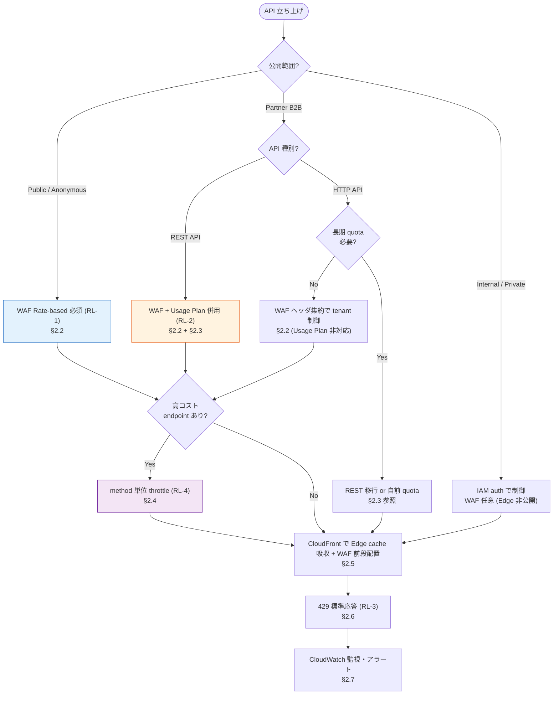

# 02. 流量制御・クォータルール（アプリチーム向け）

前提: [00-basic-design-plan.md](00-basic-design-plan.md) BD-P-01〜08
対象読者: 各アプリチームの開発者 / アーキテクト / SRE
位置付け: 総論 [01](01-cloud-guidelines-overview.md) §1.1.1 の死守事項 **RL-1〜4** を実装手順に詳細化する
要件定義 SSOT: [../proposal/fr/03-throttling-quota.md](../proposal/fr/03-throttling-quota.md)（§FR-API-3）

> ⚠ **本章の全数値は AWS 公式ドキュメントで裏取り済み（2026-07 時点）**。確認 URL は末尾「検証済み事実（一次資料）」節に列挙する。標準値（"暫定"表記）は本基盤のガイドライン提案値であり、AWS の仕様上限とは区別する。

---

## §2.0 前提と背景

### §2.0.1 このサブセクションで定めること

各アプリチームが Public / Partner API を立ち上げる際の **流量制御機構の選択と標準値**。総論の死守事項 RL-1〜4 を「どのサービスで、どの値で、どう設定するか」まで落とす。

| 死守事項（総論 §1.1.1）| 本章での詳細化先 |
|---|---|
| **RL-1** Public エンドポイントに WAF Rate-based rule 必須 | §2.2 |
| **RL-2** Partner API に Usage Plan quota 必須 | §2.3 |
| **RL-3** 429 応答は標準 body + Retry-After | §2.6 |
| **RL-4** 高コスト endpoint は method 単位 throttle | §2.4 |

### §2.0.2 主な判断軸

| 軸 | 方針 |
|---|---|
| **DDoS / 暴走遮断** | Edge（CloudFront + WAF）で Origin 到達前に遮断（RL-1）|
| **公平性（Noisy Neighbor）** | tenant / API Key 単位で集約し 1 顧客の占有を防ぐ |
| **コスト暴騰防止** | Usage Plan quota は **best-effort**。予算管理は AWS Budgets（[03 章](03-billing-cost-allocation-rules.md)）と WAF で行う（AWS 公式ガイダンス準拠）|
| **正規利用の非阻害** | 標準値で 80% カバー、個別調整は申請制 |

### §2.0.3 §FR-API-3 との関係

本章は §FR-API-3 の実装ガイド版。要件定義側の設計論理（§3.0.5 の「目的→対象→閾値→アーキ」4 観点、§3.0.6 の WAF vs Usage Plan 役割分担）を前提とし、アプリチームが従う手順に絞る。要件の背景・比較表は [../proposal/fr/03-throttling-quota.md](../proposal/fr/03-throttling-quota.md) を SSOT として参照する。

**AWS 公式の重要ガイダンス（検証済み）**: API Gateway 公式は「Usage plan throttling and quotas are not hard limits, and are applied on a best-effort basis. ... **Don't rely on usage plan quotas or throttling to control costs**. Consider using AWS Budgets ... and AWS WAF」と明記。本章はこれに従い、**流量制御層 = WAF、課金・ライフサイクル層 = Usage Plan** の役割分離を貫く。

---

## §2.1 流量制御機構の判断フロー

流量制御は「1 機構で全部」ではなく **層で組み合わせる**。以下フローで自 API に必要な機構を選ぶ。



**機構の早見表**（役割分担）:

| 機構 | 主戦場 | 何を制御 | 対応 API |
|---|---|---|---|
| **AWS WAF Rate-based rule** | Edge（CloudFront）/ Regional | 短期 rate（IP / ヘッダ / 複合キー）、DDoS / Bot | REST / HTTP / GraphQL すべて |
| **API GW Usage Plan** | API Gateway stage | Partner 短期 throttle + **長期 quota**（day/week/month）+ 請求データ | **REST API のみ** |
| **API GW method / stage throttle** | API Gateway stage | 高コスト endpoint の個別 rate + burst | REST API |
| **CloudFront** | Edge | cache による負荷吸収、WAF の実行場所 | 全種別（native rate limit は持たず WAF 経由）|

---

## §2.2 AWS WAF Rate-based rule 設計（RL-1 対応）

Public / Anonymous 向けの一次防御線。CloudFront に紐づく Web ACL に配置し、Origin 到達前に遮断する。

### §2.2.1 AWS 公式仕様（検証済み・2026-07 時点）

| 項目 | 値（AWS 公式で確認）|
|---|---|
| **評価ウィンドウ** | **60 / 120 / 300 / 600 秒**（1/2/5/10 分）から選択。**デフォルト 300 秒（5 分）**。※かつての「60 秒固定」は誤り |
| **rate limit（下限）** | **10**（この値以上でないと設定不可）|
| **rate limit（上限）** | 実質非常に大きい（RateBasedStatement の `Limit` は最大 2,000,000,000）※要件定義側の「100〜20,000,000,000」表記は API リファレンス上の値域に基づく。実運用値は下記標準参照 |
| **集約キー種別** | Source IP / IP address in header（Forwarded IP）/ ASN / ASN in header / Count all / **Custom keys** |
| **Custom keys の内訳** | Label namespace / **Header** / **Cookie** / **Query argument** / Query string / **URI path** / **JA3 fingerprint** / **JA4 fingerprint** / HTTP method / IP address / IP address in header |
| **複合キー上限** | Custom keys は組合せ可能。※Query string / URI path / JA3 / JA4 / HTTP method は各 1 回のみ、Header / Cookie / Query argument / Label namespace は複数回可 |
| **WCU コスト** | ベース 2 WCU + **カスタム集約キー 1 個あたり 30 WCU** |
| **action** | Block / Count / CAPTCHA / Challenge（**Allow 以外**すべて可）|

### §2.2.2 aggregation key の選択（本標準デフォルト）

| 公開範囲 | 集約キー | 標準値（暫定）| WCU 目安 |
|---|---|---|---|
| Public（認証有）| IP + Header（`Authorization` JWT クレーム由来 or `x-tenant-id`）複合 | 1,000 req / 5 分 / tenant | 2 + 30 = 32 |
| Public（オープン / Anonymous）| IP のみ（デフォルト集約）| 2,000 req / 5 分 / IP | 2 |
| Public（オープン・強保護 path）| IP + URI path 複合 | 100 req / 5 分 / IP·path（`/login`, `/signup` 等）| 32 |
| Bot 疑い検知 | JA4 fingerprint | 個別調整 | 32 |

- **Forwarded IP**: CloudFront 配下では送信元 IP が CloudFront になるため、真の client IP で集約する場合は `X-Forwarded-For` を "IP address in header" で指定する（fallback behavior を設定）。
- **ヘッダ名の標準**は未決（[§2.10 BD-Q-02 関連 / §FR-API-3 API-B-304](../proposal/fr/03-throttling-quota.md)）。`x-tenant-id` か JWT クレーム由来かを組織標準として確定する。

### §2.2.3 count → block 段階投入（誤遮断防止）

正規トラフィックを誤って遮断しないため、**必ず Count で開始 → メトリクス確認 → Block へ切替**する。

| 段階 | action | 期間 | 判定 |
|---|---|:---:|---|
| 1. 観測 | **Count** | 1〜2 週間 | `CountedRequests` メトリクスで実トラフィック分布を確認 |
| 2. 閾値調整 | Count | 継続 | p99 の実測値から標準値を再設定 |
| 3. 遮断投入 | **Block** | 本番 | `BlockedRequests` を監視、正規利用の巻き込みがないか確認 |

→ Block 化は §2.7 のダッシュボードで `BlockedRequests` の急増を監視しながら行う。

---

## §2.3 API Gateway Usage Plan 設計（RL-2 対応）

Partner B2B 向け。**REST API のみ**で利用可能（HTTP / WebSocket API は非対応 — AWS 公式確認）。長期 quota と請求データ生成は Usage Plan の独自領域で、WAF では代替できない。

### §2.3.1 AWS 公式仕様（検証済み・2026-07 時点）

| 項目 | 値（AWS 公式で確認）|
|---|---|
| **対応 API 種別** | **REST API のみ**（HTTP API / WebSocket API は Usage Plan 非対応）|
| **throttle 設定単位** | rate（RPS = token bucket への補充速度）+ burst（bucket 容量）。API 単位 / method 単位で設定可 |
| **quota 設定単位** | limit + period = **DAY / WEEK / MONTH** |
| **アルゴリズム** | token bucket |
| **best-effort 明記** | 「not hard limits ... applied on a best-effort basis ... clients can exceed the quotas」。**コスト管理には使うな**（AWS Budgets / WAF を使え）|
| **アカウントレベル既定 throttle** | **10,000 RPS**（steady-state）+ **burst 5,000**（全 API 種別横断、per account per Region）。増枠申請可。※一部 Region（Cape Town / Milan / Jakarta / UAE / Hyderabad / Melbourne / Spain / Zurich / Tel Aviv / Calgary / Malaysia / Thailand / Mexico Central 等）は既定 **2,500 RPS / burst 1,250**。**Usage Plan・method の値はアカウント上限を超えられない** |
| **API Key の位置付け** | 利用者識別用であり **認証手段ではない**（AWS 公式明記、§FR-API-2 と整合）|

### §2.3.2 Partner 区分の表現（Tier 廃止 → P-1〜P-7 準拠）

⚠ **Bronze / Silver / Gold の Tier 表現は廃止済み**（BD-P-04 / [§C-API-6 §C-6.2.5](../proposal/common/06-external-api-auth-architecture.md)）。Partner 区分は認証パターン **P-1〜P-7** で表現する。Usage Plan（API Key）が主役となるのは **P-5（API Key + Usage Plan）**。

| Partner 認証パターン | 流量制御の主役 | Usage Plan の関与 |
|---|---|---|
| **P-1** OAuth Client Credentials | JWT（共有認証基盤）+ WAF | △ 併用可（API Key で識別・請求）|
| **P-4** mTLS | 証明書 + WAF | △ 併用可 |
| **P-5** API Key + Usage Plan | **Usage Plan（API Key）** | ⭐ 主役 |
| **P-6** HMAC Webhook | 署名検証 + WAF | – |
| **P-7** AWS IAM SigV4 | IAM + WAF | – |

→ Usage Plan の quota / throttle は「Partner を **どの P パターンで識別するか**」と独立に、**課金按分・契約 quota の器**として使う。API Key を発行して Usage Plan に紐づけることで per-Partner の利用量計測が成立する（[03 章](03-billing-cost-allocation-rules.md) の按分前提 = 総論 BL-3）。

### §2.3.3 標準値（暫定 — BD-Q-02 で確定）

Partner 契約プラン別の throttle / quota 標準テンプレ。Service Catalog で配布する想定。

| 区分（契約プラン相当）| throttle rate | burst | 月次 quota | 想定 |
|---|---:|---:|---:|---|
| Trial / 評価 | 10 RPS | 20 | 10,000 / MONTH | 開発・PoC |
| 小規模商用 | 50 RPS | 100 | 100,000 / MONTH | SMB |
| 標準商用 | 100 RPS | 200 | 1,000,000 / MONTH | 標準 B2B |
| 大規模 | 個別 | 個別 | 個別 | 専用契約（アカウント上限との整合確認）|

> ⚠ これらは AWS の仕様値ではなく **本基盤のガイドライン提案値**。トラフィック実績に基づく再設定は §2.10 BD-Q-02 へ引き渡す。長期 quota が要件にない Partner は Usage Plan quota を省き WAF throttle のみでも可。

### §2.3.4 WAF + Usage Plan 併用の標準構成（Partner REST API）

```
[CloudFront + WAF]
  ├ Managed Rules（OWASP）
  ├ Rate-based（IP 単位、DDoS 対策）        … §2.2
  └ Rate-based（x-api-key ヘッダ + URI path） … bot / 濫用対策
[API Gateway REST API]
  ├ API Key 検証（利用者識別）
  └ Usage Plan
      ├ throttle: 区分別 RPS + burst（短期）
      ├ quota: 区分別 req/MONTH（長期）… Usage Plan のみ可
      └ Usage data（請求按分の根拠）      … Usage Plan のみ可
```

---

## §2.4 method 単位 throttle（RL-4 対応）

高コスト endpoint（重い集計 / 全文検索 / エクスポート / LLM 呼び出し等）は、API 全体とは別に **method 単位** で厳しく絞る。

### §2.4.1 設定方法（AWS 公式確認）

| 設定場所 | 粒度 | 用途 |
|---|---|---|
| **Usage Plan の method-level throttle** | `Resource=/path`, `Method=GET/POST` 単位 | Partner 別 + method 別の細粒度制御 |
| **Stage-level throttle**（全 method 共通 or method 別）| stage 内 method 単位 | Partner 非依存の全体保護 |

- 優先順位（AWS 公式の適用順）: **① Usage Plan（per-client / per-method）→ ② stage の per-method → ③ アカウントレベル → ④ Regional**。下位ほど後で評価され、いずれもアカウント上限を超えられない。

### §2.4.2 標準（暫定）

| endpoint 種別 | 例 | 標準 throttle |
|---|---|---|
| 通常 GET（軽量読取）| `/items` | API 全体標準に従う |
| 重い集計 / 検索 | `/reports/aggregate`, `/search` | 全体の 1/10 程度に個別絞り込み |
| エクスポート / バッチ起動 | `POST /exports` | 低 rate + 低 burst（例 1 RPS / burst 2）|
| 書込（POST/PUT/DELETE）| 破壊的操作 | GET より厳しめの標準テンプレ（§FR-API-3 API-B-303 で標準化検討）|

---

## §2.5 CloudFront との組合せ

### §2.5.1 CloudFront は native rate limit を持たない（検証済み）

CloudFront **単体に独立した rate limit 機能はなく**、rate limiting は **AWS WAF 連携で実現**する（CloudFront の "Set up rate limiting" は WAF rate-based rule のワンクリック設定であり、実体は WAF）。したがって RL-1 の実装は「CloudFront に紐づく Web ACL の rate-based rule」である。

### §2.5.2 配置と役割

| レイヤ | 役割 |
|---|---|
| **CloudFront（Edge）** | ① 静的コンテンツ / cache 可能 API を **cache で吸収**し Origin 負荷・従量コストを削減 ② **WAF の実行場所**（rate-based / Managed Rules を Edge で評価）|
| **WAF（CloudFront 紐付け Web ACL）** | rate-based rule を Origin 到達前に評価・遮断（RL-1）|
| **API Gateway / ALB（Origin）** | Usage Plan / method throttle（REST）またはアプリ内制御 |

- **前段配置の原則**: 攻撃・濫用は Edge（CloudFront + WAF）で落とし、Origin（API GW / ALB）には正規化されたトラフィックのみ通す。BD-P-02 の Origin Protection（Custom Header + CloudFront IP allowlist）と併せ、Origin 直叩きを塞ぐ。
- **cache と rate limit の関係**: cache hit したリクエストは Origin に届かないため、Origin 側 throttle の消費を抑えられる。ただし WAF rate-based は cache hit / miss に関わらず Edge で評価される。

---

## §2.6 429 応答の標準（RL-3 対応）

throttle / quota / WAF いずれの超過でも、クライアントが正しくリトライできる標準応答を返す。

### §2.6.1 標準仕様

| 項目 | 標準 |
|---|---|
| **HTTP ステータス** | `429 Too Many Requests`（RFC 6585）|
| **必須ヘッダ** | `Retry-After`（秒数推奨）|
| **推奨ヘッダ** | `X-RateLimit-Limit` / `X-RateLimit-Remaining` / `X-RateLimit-Reset` |
| **標準エラー body** | 下記 JSON 形式で統一 |

```json
{
  "error": "rate_limit_exceeded",
  "message": "Request rate limit exceeded. Retry after the indicated interval.",
  "retry_after_seconds": 60,
  "doc_url": "https://developer.example.com/errors/rate-limit"
}
```

### §2.6.2 クライアント規約（Exponential backoff 案内）

- **Exponential backoff + jitter** でのリトライを義務化（例: 1s → 2s → 4s → 8s に ±ランダム jitter）。
- 最大リトライ回数・累積待機時間の上限を SDK / API 規約で標準化し、リトライ嵐（thundering herd）を防ぐ。
- `Retry-After` を尊重し、それより早いリトライを禁止する旨を Partner 開発者ドキュメントに明記。

### §2.6.3 機構別の 429 生成元

| 機構 | 429 生成 | Retry-After / body |
|---|---|---|
| API GW Usage Plan / method throttle | API Gateway が自動で 429 | Gateway Responses で body / ヘッダをカスタマイズ |
| WAF Block（rate-based）| custom response で 429 + body 返却可 | WAF の Custom response bodies で定義 |
| アプリ内制御（ALB / モノリス）| アプリが生成 | アプリで上記標準を実装 |

→ **どの機構で遮断しても同一の body 形式** に揃えることを死守（RL-3）。

---

## §2.7 監視・アラート

### §2.7.1 主要メトリクス

| 発生源 | CloudWatch メトリクス | 意味 |
|---|---|---|
| API Gateway | **`4XXError`**（429 含む）| クライアントエラー全般。429 は body / access log で分離集計 |
| API Gateway | `Count`, `Latency`, `IntegrationLatency` | 流量・遅延の基礎 |
| API Gateway (Usage Plan) | Usage data（per-API Key）| quota 消費・請求按分（[03 章](03-billing-cost-allocation-rules.md)）|
| AWS WAF | **`BlockedRequests`** / `CountedRequests` / `AllowedRequests` | rate-based の遮断・観測量（§2.2.3 の段階投入判定に使用）|
| CloudFront | `Requests`, `4xxErrorRate`, cache hit rate | Edge 負荷・cache 効果 |

> ⚠ 429 は API Gateway の標準メトリクスで単独カウントされず `4XXError` に含まれる。**access log / CloudWatch Logs Insights で status=429 を抽出**して分離集計する（§FR-API-3 §3.3.1 と整合）。

### §2.7.2 標準ダッシュボード / アラート

| 監視項目 | アラート閾値（暫定）|
|---|---|
| WAF `BlockedRequests` 急増 | 通常比 N 倍（誤遮断 or 攻撃の両面で調査）|
| 429 率（`4XXError` から 429 分離）| 全リクエストの 1% / 5% / 10% 超で段階通知（閾値は §FR-API-3 API-B-321 で確定）|
| Usage Plan quota 消費 | 80% / 95% で Partner 通知・増枠案内 |
| account-level throttle 接近 | 10,000 RPS（or Region 別 2,500）に対する余裕監視 |

---

## §2.8 アプリチーム自己確認チェックリスト（RL-1〜4 充足）

deploy 前に以下を全て満たすこと（総論 §1.1.1 の死守事項）。

| # | 確認項目 | 対応 | 参照 |
|:---:|---|:---:|---|
| ☐ 1 | Public / Anonymous エンドポイントに WAF Rate-based rule を設定した | **RL-1** | §2.2 |
| ☐ 2 | WAF rule を **Count で先行投入**し、メトリクス確認後に Block へ切替える計画がある | RL-1 | §2.2.3 |
| ☐ 3 | 集約キー（IP / ヘッダ / 複合）を公開範囲に応じて選定した | RL-1 | §2.2.2 |
| ☐ 4 | Partner API（REST）に Usage Plan + API Key を紐づけ、月次 quota を設定した（長期 quota 要件時）| **RL-2** | §2.3 |
| ☐ 5 | Partner 区分を **P-1〜P-7** で表現している（Bronze/Silver/Gold を使っていない）| RL-2 | §2.3.2 |
| ☐ 6 | 高コスト endpoint に method / stage 単位 throttle を設定した | **RL-4** | §2.4 |
| ☐ 7 | 429 応答に `Retry-After` + 標準 JSON body を実装した（全遮断機構で同一形式）| **RL-3** | §2.6 |
| ☐ 8 | Exponential backoff + jitter のリトライ規約を Partner 向けドキュメントに記載した | RL-3 | §2.6.2 |
| ☐ 9 | WAF `BlockedRequests` / 429 率 / quota 消費のダッシュボード・アラートを設定した | – | §2.7 |
| ☐ 10 | CloudFront + WAF を前段配置し、Origin 直叩きを Origin Protection（BD-P-02）で塞いだ | RL-1 | §2.5 |
| ☐ 11 | HTTP API 採用時、Usage Plan 非対応を認識し WAF ヘッダ集約 or REST 移行を選定した | RL-2 | §2.1 / §2.3.1 |

---

## §2.9 設計判断（D-G-nn）

| ID | 判断 | 根拠 |
|---|---|---|
| **D-G-020** | Public / Anonymous の一次防御は **CloudFront 紐付け WAF Rate-based rule** で行う（Origin 到達前遮断）| CloudFront は native rate limit を持たず WAF 連携が実体（検証済み）。Edge 遮断が DDoS / コスト両面で最適 |
| **D-G-021** | WAF rate-based は **必ず Count → Block の段階投入**とする | 正規トラフィックの誤遮断を防ぎ、実測 p99 から閾値を再設定できる |
| **D-G-022** | 評価ウィンドウは **標準 300 秒（5 分）** を採用（60/120/600 も選択可）| AWS デフォルトかつ観測性と反応速度のバランス点。要件定義 §3.0.3 の「5 分窓」と整合 |
| **D-G-023** | Partner 長期 quota・請求データが要件の REST API は **WAF + Usage Plan 併用**をデフォルトとする | 長期 quota（day/week/month）と Usage data は Usage Plan の独自領域で WAF 代替不可（検証済み）|
| **D-G-024** | Usage Plan quota / throttle を **コスト管理・ハードリミットに使わない**。予算管理は AWS Budgets（03 章）、遮断は WAF | AWS 公式が best-effort と明記し「コスト管理に使うな」とガイド |
| **D-G-025** | Partner 区分は **Tier（Bronze/Silver/Gold）を使わず P-1〜P-7** で表現する | BD-P-04 / §C-API-6 で Tier 廃止確定。Usage Plan は P-5 の主役かつ全パターンの請求識別の器 |
| **D-G-026** | 429 応答は **全遮断機構（WAF / Usage Plan / method throttle / アプリ内）で同一の Retry-After + 標準 JSON body** に統一 | クライアントが機構を意識せず一貫したリトライを実装できる（RL-3）|
| **D-G-027** | 高コスト endpoint は **method / stage 単位 throttle** で API 全体標準より厳しく個別保護 | RL-4。従量課金リソースの局所暴騰を防ぐ |
| **D-G-028** | HTTP API で tenant 単位短期制御が必要な場合は **WAF ヘッダ集約キー（`x-tenant-id` 等）** を第一選択とし、自前実装（Lambda Authorizer + DDB）は業務ロジック駆動の例外時のみ | Usage Plan は HTTP API 非対応。WAF ヘッダ集約でマネージドに実現でき自前実装を回避できる |

---

## §2.10 未決事項・他章への引き渡し

| ID | 内容 | 引き渡し先 |
|---|---|---|
| **BD-Q-02** | Partner 区分（Tier 廃止後）の流量制御標準値（throttle / quota の確定値、トラフィック実績反映）| 本章 §2.3.3 → 実装 Phase / 契約体系 |
| API-B-304 | WAF ヘッダ集約キーで使うヘッダ名の標準（`x-tenant-id` / JWT クレーム由来）| [§FR-API-3 §3.1.3](../proposal/fr/03-throttling-quota.md) |
| API-B-302 | アカウントレベル throttle（10,000 RPS）の予防的増枠申請要否 | [§FR-API-3 §3.1.3](../proposal/fr/03-throttling-quota.md) |
| API-B-303 | method 単位 throttle（POST 厳 / GET 緩）の標準テンプレ化 | [§FR-API-3 §3.1.3](../proposal/fr/03-throttling-quota.md) |
| API-B-321 | 429 をアラート化する閾値（1% / 5% / 10%）| [§FR-API-3 §3.3.2](../proposal/fr/03-throttling-quota.md) |
| G-HANDOFF | Usage Plan の Usage data を用いた per-Partner 課金按分の集計方式 | [03 章 課金・按分ルール](03-billing-cost-allocation-rules.md)（総論 BL-3）|

---

## §2.x 関連ドキュメント

- [01 総論](01-cloud-guidelines-overview.md) §1.1.1 死守事項 RL-1〜4
- [03 課金・按分ルール](03-billing-cost-allocation-rules.md) — Usage data の按分・AWS Budgets 予算管理
- [§FR-API-3 流量制御・クォータ（SSOT）](../proposal/fr/03-throttling-quota.md)
- [§FR-API-2 §2.2 Partner 認証](../proposal/fr/02-authn-authz.md)
- [§C-API-6 §C-6.2.5 認証パターン P-1〜P-7](../proposal/common/06-external-api-auth-architecture.md)
- [ADR-052 マルチテナント Isolation + Rate Limiting](../../adr/052-multi-tenant-isolation-rate-limiting.md)（Scope Reduced — 認証 API のみ本基盤対象）
- [ADR-039 中央集約 Network アカウント](../../adr/039-centralized-network-account-edge-layer.md)

---

## 検証済み事実（一次資料）

以下はすべて **2026-07 時点で AWS 公式ドキュメント / re:Post を WebFetch / WebSearch で確認**した内容。

### AWS WAF Rate-based rule

| 確認内容 | URL |
|---|---|
| rate-based rule の概要、WCU（ベース 2 + カスタムキー 1 個 30 WCU）、scope-down、action は Allow 以外可 | https://docs.aws.amazon.com/waf/latest/developerguide/waf-rule-statement-type-rate-based.html |
| **評価ウィンドウ = 60/120/300/600 秒、デフォルト 300 秒**、rate limit 下限 = **10** | https://docs.aws.amazon.com/waf/latest/developerguide/waf-rule-statement-type-rate-based-high-level-settings.html |
| 集約キー種別（Source IP / IP in header / ASN / ASN in header / Count all / Custom keys）と Custom keys の内訳（Label namespace / Header / Cookie / Query argument / Query string / URI path / JA3 / JA4 / HTTP method / IP / IP in header）、複合キー可（Query string/URI path/JA3/JA4/HTTP method は各 1 回のみ）| https://docs.aws.amazon.com/waf/latest/developerguide/waf-rule-statement-type-rate-based-aggregation-options.html |
| RateBasedStatement API リファレンス（Limit 値域）| https://docs.aws.amazon.com/waf/latest/APIReference/API_RateBasedStatement.html |

### Amazon API Gateway throttling / Usage Plan

| 確認内容 | URL |
|---|---|
| token bucket、throttle は best-effort（target であり保証上限ではない）、適用順（Usage Plan per-client/method → stage per-method → account → Regional）、stage / method 単位設定可 | https://docs.aws.amazon.com/apigateway/latest/developerguide/api-gateway-request-throttling.html |
| **アカウント既定 throttle = 10,000 RPS + burst 5,000**（per account per Region、全 API 種別横断、増枠可）。一部 13 Region は **2,500 RPS / burst 1,250** | https://docs.aws.amazon.com/apigateway/latest/developerguide/limits.html |
| Usage Plan は **REST API 対象**、throttle（rate/burst）+ quota、quota は best-effort・**コスト管理に使うな（AWS Budgets / WAF を使え）**、API Key は認証手段ではない | https://docs.aws.amazon.com/apigateway/latest/developerguide/api-gateway-api-usage-plans.html |

### CloudFront rate limiting

| 確認内容 | URL |
|---|---|
| CloudFront の rate limiting は **AWS WAF 連携で実現**（"Set up rate limiting" は WAF rate-based のワンクリック設定、CloudFront 単体に独立 rate limit なし。非 S3 custom origin のみ表示）| https://docs.aws.amazon.com/AmazonCloudFront/latest/DeveloperGuide/WAF-one-click-rate-limiting.html |

### 標準仕様

| 確認内容 | URL |
|---|---|
| HTTP 429 Too Many Requests / Retry-After | https://datatracker.ietf.org/doc/html/rfc6585 |
