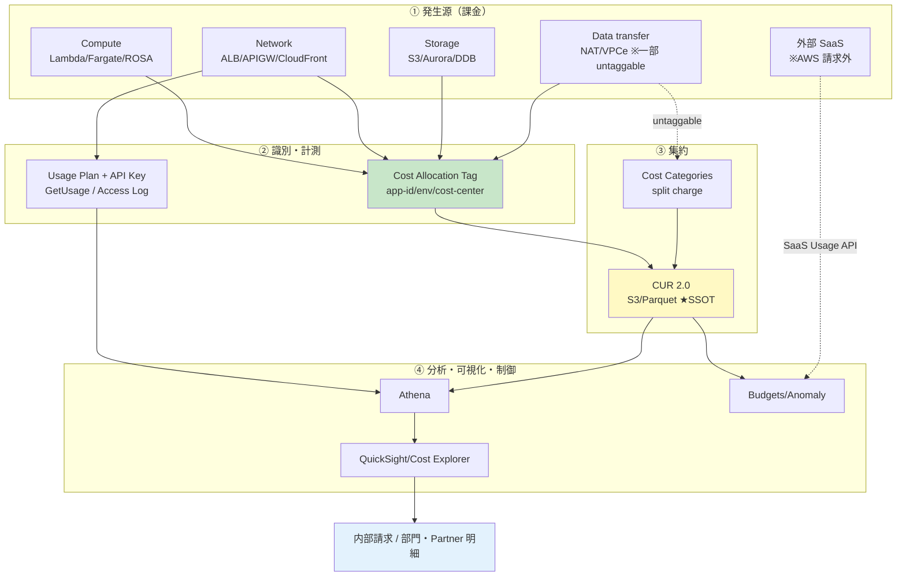

# 03. 課金制御・按分ガイドライン（アプリチーム向け）

前提: [00-basic-design-plan.md](00-basic-design-plan.md) BD-P-01〜08
対象読者: 各アプリチームの開発者 / アーキテクト / SRE / FinOps 担当
位置付け: [01 総論](01-cloud-guidelines-overview.md) §1.1.2 の**課金制御の死守事項 BL-1〜4** を「アプリチームが何をすればよいか」に落とす実務ガイド
要件 SSOT: [§FR-API-4 利用者識別・課金按分](../proposal/fr/04-metering-billing.md) / [§NFR-API-8 コスト・課金可視化](../proposal/nfr/08-cost.md)

---

## §3.0 前提と背景

### §3.0.1 なぜこの章が必要か

コストは「気付いたときには膨らんでいる」性質を持つ。API プラットフォームは複数アプリ・複数テナント・外部 SaaS 呼び出しが混在し、**誰が・どこで・いくら使ったかを後から按分できる形にしておかないと、内部請求も暴騰検知も成立しない**。本章は、アプリチームが立ち上げ時に一度設定すれば以降は自動で按分・監視が回る「型」を定義する。

### §3.0.2 本章で定めること / 定めないこと

| 定めること（本章） | 定めないこと（別ドキュメント） |
|---|---|
| 必須 Cost Allocation Tag の標準・強制手段（BL-1） | 全社 FinOps ポリシー・予算配賦の意思決定 |
| app / env 単位の AWS Budgets 設定（BL-2） | 会計システムへの連携仕様（別途） |
| Partner 課金按分の集計フロー（BL-3） | 課金単価・請求書発行の商流設計 |
| Outbound SaaS コスト監視（BL-4） | Savings Plan の全社コミット率決定（[§NFR-API-8 §8.3](../proposal/nfr/08-cost.md)） |

### §3.0.3 判断軸

| 軸 | 本章のスタンス |
|---|---|
| マネージド優先 | 独自集計基盤は作らない。Cost Allocation Tag + CUR + Athena + QuickSight の AWS ネイティブパイプラインに統一 |
| 一度設定すれば自動 | タグ付与・Budgets は Service Catalog 製品起動時に強制付与（BD-P-08）。アプリチームの手作業を最小化 |
| 後から再集計できる | 按分は CUR（生データ）を SSOT とし、集計ロジックは Athena クエリ側に持つ。ロジック変更は遡及再クエリで対応 |
| 上限制御は 02 章、可視化は本章 | [02 流量制御](02-rate-limiting-quota-rules.md)が「使わせすぎない」、本章が「使った分を見える化・按分する」。表裏一体 |

### §3.0.4 §FR-API-4 / §NFR-API-8 との関係

本章は要件 SSOT を実装ガイドに具体化したもの。対応関係は以下。

| 本章 | 対応する要件 SSOT |
|---|---|
| §3.1 コスト分類軸 | §FR-API-4 §4.0.1 用語・按分の考え方 |
| §3.2 必須 Cost Allocation Tag | §FR-API-4 §4.3 必須タグセット |
| §3.3 AWS Budgets | §NFR-API-8 §8.2 予算管理・アラート |
| §3.4 Partner 課金按分 | §FR-API-4 §4.2 計測 / §4.4 課金按分・請求 |
| §3.5 Outbound SaaS 監視 | [§C-API-6 §C-6.2.6.4](../proposal/common/06-external-api-auth-architecture.md) Outbound ガバナンス「コスト按分」 |
| §3.6 ダッシュボード | §NFR-API-8 §8.1 コストベースライン |

> ⚠ 要件 SSOT との差分は §3.9 に列挙。本章では**タグキーの命名を要件定義の記載から実装向けに一部正規化**しており、その根拠も §3.9 に記載する。

---

## §3.1 コスト分類軸

按分の前提として、API プラットフォームで発生するコストを 6 軸に分類する。各軸ごとに「主なサービス」「識別できる粒度」「按分の主手段」を定める。

| # | コスト軸 | 主な AWS サービス | 識別できる最小粒度 | 按分の主手段 |
|---|---|---|---|---|
| 1 | **Compute** | Lambda / ECS(Fargate) / EKS(ROSA) | app-id タグ（テナント別は EMF 併用） | Cost Allocation Tag |
| 2 | **Network** | ALB / NLB / API Gateway / CloudFront | app-id / exposure タグ | Cost Allocation Tag |
| 3 | **Storage** | S3 / EBS / Aurora / DynamoDB | app-id タグ | Cost Allocation Tag |
| 4 | **Data transfer** | NAT GW / VPC Endpoint / CloudFront egress | 一部 untaggable（後述） | split charge rule / Cost Categories |
| 5 | **Auth** | 共有認証基盤呼び出し（Keycloak/ROSA 側） | 認証基盤側のテナント計測に依存 | 認証基盤の按分に委譲（本章対象外の境界） |
| 6 | **Outbound SaaS** | Stripe / OpenAI / SendGrid 等の外部課金 | app-id タグ + SaaS 側利用明細 | §3.5（AWS 課金外のため別建て） |

**留意点**:
- **Data transfer の一部は untaggable**。データ転送料など個別リソースにタグが付かない費目は、Cost Allocation Tag だけでは按分できないため、**Cost Categories の split charge rule** または按分ルールで共有費として比例配分する（§3.4.4）。
- **Auth 軸は本 API プラットフォームの外**。共有認証基盤（ROSA/Keycloak）側のコストは認証基盤側の按分機構に委ねる。本章はあくまで「API プラットフォームのアプリ側で発生するコスト」を対象とする。
- **Outbound SaaS（軸 6）は AWS の請求に乗らない**。Stripe/OpenAI 等の課金は各 SaaS の明細で発生するため、AWS Budgets/CUR では捕捉できない。§3.5 で別建ての監視を定義する。

### §3.1.1 コスト按分に関わるサービス一覧（俯瞰表）

「どのサービスが按分パイプラインのどこで効くか」を 1 枚で把握する。**役割カテゴリ = 発生源 / 識別・計測 / 集約 / 分析・可視化 / 制御 / 出力**の 6 段。

| 役割カテゴリ | サービス / 機能 | 按分での役割 | 対応節 |
|---|---|---|---|
| **発生源**（課金が出る）| Lambda / Fargate / ROSA(EKS) | Compute 費。`app-id` タグで按分（テナント別は EMF 併用）| §3.1 軸1 |
| 発生源 | ALB / NLB / API Gateway / CloudFront | Network 費。`app-id` / `exposure` タグ | §3.1 軸2 |
| 発生源 | S3 / EBS / Aurora / DynamoDB | Storage 費。`app-id` タグ | §3.1 軸3 |
| 発生源 | NAT GW / VPC Endpoint / CloudFront egress | Data transfer。**一部 untaggable** → split charge | §3.1 軸4 |
| 発生源 | 外部 SaaS（Stripe / OpenAI 等）| **AWS 請求外**。別建て監視 | §3.5 |
| **識別・計測** | Cost Allocation Tag（`app-id`/`env`/`cost-center`/`owner`）| 按分の**一次キー**。要 activate（Org 管理 Acct）| §3.2 |
| 識別・計測 | API Gateway Usage Plan + API Key | Partner（法人テナント）識別。**認証ではなく識別・計測用**| §3.4.1 |
| 識別・計測 | GetUsage API | API Key ごとの日次 used/remaining quota | §3.4.2 |
| 識別・計測 | API GW Access Log / EMF | リクエスト詳細・`tenant_id` 次元メトリクス | §3.4.2 |
| **集約** | Cost & Usage Report (CUR 2.0, S3/Parquet) | 生データ **SSOT**。`resource_tags_user_*` 列 | §3.4.3 |
| 集約 | Cost Categories（split charge rule）| タグ/Acct を束ねる**二次分類**・untaggable 共有費の比例配分 | §3.4.4 |
| **分析・可視化** | Athena | CUR を標準 SQL 集計（サーバーレス）| §3.4.3 |
| 分析・可視化 | Cost Explorer | 即席ドリルダウン | §3.6.1 |
| 分析・可視化 | QuickSight | 定型ダッシュボード（日次）| §3.6 |
| 分析・可視化 | Cost Anomaly Detection | 異常検知（Cost Categories 軸と併用）| §3.9.1 |
| **制御** | AWS Budgets（Cost/Usage）| app/env 別の上限・予測アラート（最終防衛線）| §3.3 |
| 制御 | Budget Actions（IAM/SCP）| 超過時アクション（Phase 1 は既定 OFF）| §3.3.3 |
| **出力** | 内部請求 / 部門明細 / Partner 明細 | 会計連携は別途 | §3.6 |

> **タグ（一次データ・付与=アプリ）→ Cost Categories（二次分類・定義=中央）→ CUR（SSOT）→ Athena/QuickSight（可視化）** が背骨。API Key/GetUsage は Partner 按分の補助計測、Budgets/Actions は上限制御で按分そのものではない。

### §3.1.2 按分パイプライン概念図



> §3.4.3 の図は「Partner 按分の**処理フロー**（誰が何を渡すか）」、本図は「按分に関わる**サービスの層構造**（何がどこに効くか）」。前者=フロー、後者=概念マップ。

---

## §3.2 必須 Cost Allocation Tag 標準（BL-1 対応）

**(BL-1 対応)** 全リソースに必須 Cost Allocation Tag（app-id / env / cost-center / owner）を付与する。

### §3.2.1 必須タグセット

| タグキー | 必須 | 値の規約 | 用途 |
|---|:---:|---|---|
| `app-id` | ✅ | `app-` 前缀 + 小文字英数ハイフン（例 `app-checkout`）。App Registry の app_id と一致必須 | アプリ単位のコスト按分の主キー。Central Canary の App Registry（[ADR-059](../../adr/059-central-auth-check-canary-architecture.md)）と突合 |
| `env` | ✅ | `prod` / `stg` / `dev` のいずれか（列挙値のみ） | 環境別コスト追跡・Budgets 分割 |
| `cost-center` | ✅ | `cc-` 前缀 + 組織の部門コード（例 `cc-ec`）。組織側標準名は BD-Q-03 で確定 | 内部部門への按分・請求 |
| `owner` | ✅ | 責任チームの連絡先（メール DL 推奨、例 `team-checkout@example.com`） | コスト異常時のエスカレーション先 |
| `exposure` | 推奨 | `public` / `internal` / `partner` / `private` | [02 流量制御](02-rate-limiting-quota-rules.md) / FMS 配信キーと共用 |
| `tenant` | 条件付 | `tenant-` 前缀（マルチテナント運用時のみ） | テナント別按分（粒度が必要な場合） |

> **要件 SSOT との対応**: [§FR-API-4 §4.3.1](../proposal/fr/04-metering-billing.md) では `CostCenter` / `Application` / `Environment` 等の PascalCase 例が示されている。本章は実装ガイドとして **kebab-case（`app-id` / `cost-center`）に正規化**し、App Registry の属性名との一貫性を優先した（差分は §3.9 BD-Q-03 で組織側標準と最終整合）。**タグキーの大文字小文字は区別される**ため、確定後は SCP/Config で表記ゆれを禁止する。

### §3.2.2 Cost Allocation Tag の有効化（重要な制約）

タグは**リソースに付けただけでは課金レポートに現れない**。Billing コンソールで **activate（有効化）** する運用が必須。以下は AWS 公式で確認（2026-07 時点）。

| 事項 | 内容（AWS 公式確認） |
|---|---|
| 2 種類のタグ | **user-defined tags**（利用者が定義、`user:` 系プレフィックス）と **AWS-generated tags**（AWS/ISV が付与、`aws:` プレフィックス。例 `aws:createdBy`）。**両者は別々に activate が必要** |
| 有効化の主体 | **Organizations の管理アカウント**（および単独アカウント）のみが Billing コンソールの cost allocation tags マネージャにアクセス可能 |
| 反映までの時間 | activate 後、Billing/Cost Management コンソールに現れるまで **最大 24 時間** |
| 遡及の扱い | 有効化前に発生したコストには自動では適用されない。過去分は **backfill cost allocation tags** 機能で明示的に埋め戻す必要がある（=「付けておけば後から見える」ではない） |
| CUR 反映 | 有効化後、CUR に `resource_tags_user_<キー名>` 列として出力される |

> **設計含意（D-G-031）**: 「新規タグキーを追加したら、Org 管理アカウントで即 activate する」を運用手順化しないと、**タグは付いているのに CUR に列が出ず按分に使えない**という事故が起きる。有効化は中央（Platform/FinOps）の責務、付与はアプリチームの責務。

### §3.2.3 タグ付与の強制手段（BL-1 の担保）

「付け忘れ」を人手に頼らず、**多層で強制**する。

| 層 | 手段 | 効果 | 出典 |
|---|---|---|---|
| 予防（起動時） | **Service Catalog 製品テンプレ**で必須タグを埋め込み | 製品起動＝タグ自動付与。アプリチームは値を選ぶだけ | BD-P-08 / [§C-API-5](../proposal/common/05-self-service-catalog.md) |
| 予防（組織ガード） | **SCP の Tag Policy / `aws:RequestTag` 条件**で必須タグ欠落の作成を拒否 | Service Catalog を迂回した手動作成も塞ぐ | §FR-API-4 §4.3.2 |
| 検知（事後） | **AWS Config Rule `required-tags`** で欠落リソースを継続検出 | 既存リソース・ドリフトを可視化、自動修復に接続可 | §FR-API-4 §4.3.2 |

> 3 層の役割分担: Service Catalog は「正規ルートを楽にする」、SCP は「不正ルートを塞ぐ」、Config は「漏れを見つける」。3 つ揃って初めて BL-1 が担保される。

---

## §3.3 AWS Budgets 設定（BL-2 対応）

**(BL-2 対応)** app / env 単位で AWS Budgets を必須設定する。以下の仕様は AWS 公式で確認（2026-07 時点）。

### §3.3.1 Budgets の種類（AWS 公式）

| 種類 | 用途 | 本章での採否 |
|---|---|---|
| **Cost budgets** | 支出上限の設定・超過アラート | ✅ 必須（app/env 単位） |
| **Usage budgets** | サービス使用量（例 リクエスト数）の上限監視 | ○ 高コスト API で任意採用 |
| **RI utilization / coverage budgets** | Reserved Instances の利用率・カバレッジ監視 | 全社側（本章対象外） |
| **Savings Plans utilization / coverage budgets** | Savings Plans の利用率・カバレッジ監視 | 全社側（[§NFR-API-8 §8.3](../proposal/nfr/08-cost.md)） |

- Budgets の情報は **1 日最大 3 回更新**（前回更新の 8〜12 時間後が目安）。**リアルタイムではない**ため、瞬間的な暴騰は WAF/Usage Plan（02 章）で止め、Budgets は「最終防衛線」と位置づける。
- **課金と通知の間には遅延がある**（リソース使用〜課金反映のラグ）。閾値超過に気付く前に追加コストが発生し得る点を運用で織り込む。

### §3.3.2 標準 Budget 構成

| Budget | スコープ（タグフィルタ） | 種別 | 閾値・通知 |
|---|---|---|---|
| app 別月次 | `app-id = app-xxx` | Cost | 80% / 100% / 120%（forecasted 含む） |
| env 別月次 | `env = prod`（prod は個別、stg/dev は合算可） | Cost | 80% / 100% |
| Outbound SaaS（AWS 側計上分のみ） | §3.5 参照 | Cost | 80% / 100% |

- **actual（実績）と forecasted（予測）の両方**で通知可能。予測超過アラートで「月末に超えそう」を先取りする。
- 通知先: **Amazon SNS トピック / メール**（両方可）。SNS → Chatbot 経由で Slack に流す（[§NFR-API-8 §8.2](../proposal/nfr/08-cost.md) の Slack/メール要件）。
- 閾値の既定値（50/80/100/120%）は §NFR-API-8 の `API-C-1611` で最終確定。本章は暫定で 80/100/120% を標準とする。

### §3.3.3 Budget Actions（自動アクション）の採否

Budget Actions（AWS 公式で確認、2026-07 時点）は、閾値超過時に**自動またはマニュアル承認後**にアクションを実行できる。

| 採れるアクション（AWS 公式） | 本章の採否 |
|---|---|
| IAM ポリシー適用（例: Deny で新規リソース作成を制限） | ⚠ Phase 1 では **マニュアル承認モードのみ**採用検討 |
| SCP（Service Control Policy）適用（管理アカウントから他アカウントへ可） | ⚠ 同上、影響大のため慎重運用 |
| 対象 EC2 / RDS インスタンスの停止 | ✕ 本プラットフォームは Lambda/Fargate 主体のため非該当。**他アカウントの EC2/RDS は対象不可** |

> **設計判断（D-G-032）**: **Phase 1 では Budget Actions の自動実行は既定 OFF**。理由は、prod の課金超過で IAM/SCP を自動適用すると**正規リクエストまで巻き込んで停止**し可用性を損なうため。まず通知（§3.3.2）で運用が回ることを確認し、**マニュアル承認付き Action** から段階導入する。自動アクションは dev/stg の暴走抑止など限定用途に留める。

---

## §3.4 Partner 課金按分（BL-3 対応）

**(BL-3 対応)** Partner API は API Key 経由で利用者を識別し、その計測を按分の根拠とする。

### §3.4.1 利用者識別（API Key）

Partner（法人テナント）の識別は **API Gateway Usage Plan + API Key** を用いる。以下は AWS 公式で確認（2026-07 時点）。

| 事項 | 内容（AWS 公式確認） |
|---|---|
| Usage Plan の役割 | どの API ステージ・メソッドに、どの API Key でアクセスできるかを規定し、スロットリング/クォータを設定 |
| API Key の識別性 | Usage Plan は **API Key で API クライアントを識別**。API Key ↔ Partner（法人テナント）を対応づける（[§FR-API-4 §4.1.1](../proposal/fr/04-metering-billing.md)） |
| **⚠ API Key は認証手段ではない** | AWS 公式明記: **同一 Usage Plan 内の複数 API を 1 つの有効な API Key で横断アクセスできてしまう**。アクセス制御は Lambda Authorizer / IAM / Cognito で別途行う。API Key は**あくまで「識別・計測」用途**（BD-P-04 の認証パターンと役割分離） |

### §3.4.2 利用量計測（GetUsage）

利用量は 2 経路で取得する。

| 経路 | 取得できるもの | 特性 |
|---|---|---|
| **Usage Plan の GetUsage API** | AWS 公式確認: 指定期間の **API Key ごとの日次ログ `[used quota, remaining quota]`**（使用済み/残クォータ） | Usage Plan の**クォータ消費量**が取れる。1 リクエストあたり最大 500 件・ページング |
| **API Gateway access log**（マスク済 apiKey フィールド） | requestId / method / path / status / latency / responseLength 等（[§FR-API-4 §4.2.1](../proposal/fr/04-metering-billing.md)） | リクエスト**詳細**が取れる。EMF で `tenant_id` 次元のメトリクス化も可 |

> ⚠ **Usage Plan のクォータ/スロットルは「ベストエフォート・非ハードリミット」**（AWS 公式明記）。クライアントは設定値を一時的に超え得るため、**課金・アクセス制御を Usage Plan だけに依存しない**。コスト管理は AWS Budgets、流量制御は WAF（02 章）を併用する。

### §3.4.3 按分の集計フロー（CUR + Athena）

生データは **CUR** を SSOT とし、**Athena** で SQL 集計する。以下は AWS 公式で確認（2026-07 時点）。

- **CUR は Athena で標準 SQL クエリ可能**（サーバーレス。独自データウェアハウス不要）。
- Athena 連携用の CUR は **新規 S3 バケット + 新規 CUR + Apache Parquet** 形式を強く推奨（AWS 公式）。
- CUR には **`resource_tags_user_app_id` / `resource_tags_user_cost_center`** 等のタグ列が出力され、これで app/部門別に集計できる（§3.2.2 の有効化が前提）。
- セットアップは **CloudFormation テンプレート**（Glue/Athena 自動構成）または手動の 2 方式。

```mermaid
flowchart TB
    subgraph App["各アプリ Acct（Partner API）"]
        APIK["API Gateway<br/>Usage Plan + API Key<br/>(Partner=法人テナント識別)"]
        ALOG["Access Log<br/>(apiKey マスク / tenant_id)"]
        RES["課金対象リソース<br/>Lambda / ALB / S3 …<br/>必須タグ付与"]
    end

    subgraph Mgmt["Org 管理 Acct（FinOps 中央）"]
        CUR["Cost & Usage Report 2.0<br/>(S3 / Parquet)<br/>resource_tags_user_app_id 列"]
        ATH["Athena<br/>タグ列 × Usage で按分クエリ"]
        CC["Cost Categories<br/>部門/BU 階層 + split charge"]
        QS["QuickSight<br/>標準ダッシュボード"]
    end

    APIK -->|GetUsage: used/remaining quota| ATH
    ALOG -->|S3 export| ATH
    RES -->|Cost Allocation Tag<br/>(要 activate)| CUR
    CUR --> ATH
    CC -.->|部門/BU 分類列を付与| CUR
    ATH --> QS
    QS -->|Partner向け / 部門向け| Bill["内部請求 / 明細<br/>(会計連携は別途)"]

    style CUR fill:#fff9c4
    style ATH fill:#c8e6c9
    style QS fill:#e3f2fd
```

**按分ロジックの標準**:
1. **タグで按分できるコスト**（Compute/Network/Storage の大半）は `resource_tags_user_app_id` で直接集計。
2. **API Key 単位の利用量**（GetUsage / access log）を Partner ごとに集計し、**共有リソース（VPC・データ転送等）の untaggable コストを利用量比で比例配分**。
3. 部門・BU への集約は **Cost Categories**（§3.4.4）で階層化。

### §3.4.4 Cost Categories による部門・共有費按分

Cost Categories（AWS 公式で確認、2026-07 時点）で、タグ・アカウント・サービス等の billing dimension をルールにコストを分類できる。

| 特性（AWS 公式確認） | 本章での使い方 |
|---|---|
| ルールで dimension（Account / Tag key / Service / Region 等）をグルーピング | `cost-center` タグ → 部門、部門 → BU の**階層分類**を定義 |
| **Cost Explorer / Budgets / CUR / Anomaly Detection で横断利用可能** | ダッシュボード・予算・異常検知すべてで同じ分類軸を使える |
| CUR には `costCategory/<名前>` 列として出力 | Athena で部門別按分の GROUP BY キーに使える |
| **split charge rule** で共有コストを比例配分 | untaggable なデータ転送・共有基盤費を部門/app に配賦 |
| 当月初から有効（月中の作成・更新も月初に遡って適用） | ルール変更が当月全体に反映され、再集計が容易 |

> **タグ vs Cost Categories の使い分け**: **タグ = リソースに直接貼る一次データ**（付与はアプリチーム）、**Cost Categories = タグ/アカウントを束ねる二次分類**（定義は中央 FinOps）。app-id は必ずタグ、部門・BU の束ねは Cost Categories、が原則。

---

## §3.5 Outbound SaaS コスト監視（BL-4 対応）

**(BL-4 対応)** Outbound SaaS（Stripe / OpenAI / SendGrid 等）の利用はコスト monitor 対象とする。

### §3.5.1 なぜ別建てか

[§C-6.2.6](../proposal/common/06-external-api-auth-architecture.md) のとおり Outbound は**外部 SaaS がプロトコルを決め、課金も SaaS 側で発生**する。したがって:
- **AWS Budgets / CUR では Outbound SaaS の従量課金は捕捉できない**（AWS の請求に乗らない）。
- ただし [§C-6.2.6.4](../proposal/common/06-external-api-auth-architecture.md) の中央ガバナンス表で **「コスト按分: 外部 SaaS との通信量・課金 monitor」** が中央責務として明記されている。

### §3.5.2 監視の型（2 面）

| 面 | 何を見るか | 手段 |
|---|---|---|
| **AWS 側（間接コスト）** | SaaS 呼び出しに伴う NAT GW / Egress データ転送、呼び出し元 Lambda 実行時間 | `app-id` タグ + CUR/Budgets。Outbound の egress は Network Firewall 経由（[§C-6.2.6.4](../proposal/common/06-external-api-auth-architecture.md) egress filtering）で app 別に見える化 |
| **SaaS 側（直接課金）** | Stripe/OpenAI 等の従量課金額（トークン数・API コール数） | **SaaS の Usage/Billing API を定期取得**し、`app-id` を紐付けて FinOps 台帳に集約。AWS 外のため Budgets ではなく独自しきい値アラート |

### §3.5.3 タグ紐付けと FinOps 集計

- Outbound を呼ぶ Lambda/ECS/Secrets には**呼び出し先 SaaS を示す補助タグ**（例 `saas-target = openai`）を推奨付与し、間接コストを SaaS 別に切り分け可能にする。
- **Approved SaaS Allowlist**（[§C-6.2.6.4](../proposal/common/06-external-api-auth-architecture.md)）に登録された SaaS のみ接続可のため、監視対象＝Allowlist で網羅性を担保。棚卸しは中央（Security/Legal/FinOps）。
- SaaS 側課金の取得頻度・しきい値は FinOps 台帳側で管理（本 API プラットフォームは「AWS 側間接コストの可視化」と「app-id 紐付けの型」を提供）。

---

## §3.6 ダッシュボード標準

### §3.6.1 2 系統のダッシュボード

| ツール | 用途 | 更新頻度 | 対象読者 |
|---|---|---|---|
| **Cost Explorer** | 即席の探索・タグ別/サービス別/Cost Category 別のドリルダウン | AWS マネージド | アプリチーム / FinOps |
| **QuickSight**（CUR + Athena ベース） | 定型ダッシュボードの標準テンプレ配布 | 日次バッチ | 部門長 / Partner 向け明細 |

- QuickSight 標準テンプレは中央が提供（[§NFR-API-8 §8.1](../proposal/nfr/08-cost.md)）。アプリチームは自 `app-id` でフィルタするだけ。

### §3.6.2 可視化する標準 KPI

| KPI | 定義 | 出典 |
|---|---|---|
| app 別月額コスト | `app-id` タグ集計 | §NFR-API-8 §8.1 |
| Request あたりコスト | USD / 100 万 req | §NFR-API-8 §8.1（USD/1M req） |
| テナント別月額コスト | `tenant` タグ or EMF `tenant_id` | §FR-API-4 §4.4 |
| 環境別構成比 | prod / stg / dev の比率 | §NFR-API-8 §8.1 |
| 共有リソース按分済みコスト | split charge 適用後の app/部門別 | §3.4.4 |
| Budget 消化率 | 各 Budget の actual/forecasted % | §3.3 |

> **EMF カーディナリティ注意**（[§FR-API-4 §4.2.2 / §4.A](../proposal/fr/04-metering-billing.md)）: テナント数が大きい場合、`tenant_id` を EMF 次元にそのまま出すと CloudWatch コストが急増する。**上位 N テナント + その他**に集約するか、CUR + アプリログ集計の併用を推奨。

---

## §3.7 アプリチーム自己確認チェックリスト（BL-1〜4）

新規 API 立ち上げ時 / 四半期レビュー時に、以下を自己確認する。

| # | 確認項目 | 対応 | 確認手段 |
|---|:---:|---|---|
| □ | 全リソースに `app-id` / `env` / `cost-center` / `owner` が付与されているか | **BL-1** | Config Rule `required-tags` が緑 / Tag Editor で確認 |
| □ | タグキーが Org 管理アカウントで **activate 済み**か（付けただけで安心しない） | **BL-1** | FinOps に activate 依頼済み・CUR に列が出ている |
| □ | Service Catalog 製品経由で起動したか（手動作成で SCP を迂回していないか） | **BL-1** | 起動元が Service Catalog |
| □ | `app-id` 別・`prod` 別の **AWS Budgets** を設定したか | **BL-2** | Budgets コンソールに 2 本以上 |
| □ | Budget 通知先（SNS/Slack/メール）が有効か | **BL-2** | テスト通知が届く |
| □ | Partner API に **Usage Plan + API Key** を設定し、API Key ↔ テナントが台帳化されているか | **BL-3** | Usage Plan 設定 / テナント台帳 |
| □ | API Key を**認証に使っていない**か（認可は Authorizer/IAM/Cognito） | **BL-3** | 設計レビュー |
| □ | Outbound SaaS 呼び出しが **Approved Allowlist** 内で、`app-id`/`saas-target` タグが付いているか | **BL-4** | Allowlist 突合 / タグ確認 |
| □ | SaaS 直接課金（Stripe/OpenAI 等）が FinOps 台帳に登録されているか | **BL-4** | FinOps 台帳 |

---

## §3.8 設計判断（D-G-030 番台）

| ID | 判断 | 根拠 |
|---|---|---|
| D-G-030 | 課金按分は **Cost Allocation Tag + CUR + Athena + QuickSight** のマネージドパイプラインに統一し、独自集計基盤は作らない | §FR-API-4 §4.0.3「運用負荷・コスト最小」。AWS 公式で CUR→Athena 標準クエリを確認 |
| D-G-031 | 新規タグキー追加時は **Org 管理アカウントで即 activate** を運用手順化。付与（アプリ）と有効化（中央）を責務分離 | AWS 公式: activate しないと CUR/Cost Explorer に出ない・遡及しない（最大 24h 反映） |
| D-G-032 | **Budget Actions の自動実行は Phase 1 で既定 OFF**。まず通知運用、次にマニュアル承認付き Action、自動は dev/stg 限定 | prod で IAM/SCP 自動適用は正規リクエストを巻き込み可用性を損なうリスク |
| D-G-033 | タグキーは実装ガイドとして **kebab-case（`app-id` 等）に正規化**し App Registry と一致させる | Central Canary App Registry（ADR-059）との突合性。最終整合は BD-Q-03 |
| D-G-034 | **API Key は識別・計測専用**とし、アクセス制御は Authorizer/IAM/Cognito に分離。Usage Plan クォータは非ハードリミットのためコスト制御を依存しない | AWS 公式明記（Usage Plan はベストエフォート / API Key は認証に使うなと明記） |
| D-G-035 | **untaggable コスト（データ転送等）は Cost Categories の split charge rule** で按分。タグ＝一次データ、Cost Categories＝二次分類の役割分担 | AWS 公式: Cost Categories は CUR/CE/Budgets 横断・split charge 対応 |
| D-G-036 | **Outbound SaaS 直接課金は AWS Budgets 対象外**として別建て監視（SaaS Usage API + FinOps 台帳）。AWS 側は間接コスト（egress/Compute）を app-id で可視化 | Outbound 課金は AWS 請求に乗らない（§C-6.2.6.4 中央ガバナンス） |

---

## §3.9 未決事項・他章への引き渡し

| ID | 内容 | 状態 / 引き渡し先 |
|---|---|---|
| **BD-Q-03** | `cost-center` タグの**組織側標準名との整合**（部門コード体系・粒度） | 未決。組織 FinOps と確定後、§3.2.1 の値規約を最終化。要件側 `API-D-401` と連動 |
| G-HANDOFF-BL-1 | 必須タグの**最終確定と表記（PascalCase vs kebab-case）** | 本章は kebab-case を暫定採用。BD-Q-03 で組織標準に合わせ最終決定 |
| G-HANDOFF-BL-2 | Budgets の**既定アラート閾値**（50/80/100/120% のどれを標準義務化するか） | §NFR-API-8 `API-C-1611` で確定。本章は暫定 80/100/120% |
| G-HANDOFF-02 | [02 流量制御](02-rate-limiting-quota-rules.md) の **Usage Plan 設計との連携**（同じ API Key / Usage Plan を識別・計測に共用） | 02 章確定後に §3.4.1 を相互参照で整合 |
| G-HANDOFF-BL-4 | Outbound SaaS の **SaaS 側課金取得の実装方式・頻度・しきい値** | FinOps 台帳側で管理。本章は AWS 側間接コスト可視化と app-id 紐付けの型のみ提供。要件側 `API-C-2662`（自動ローテ範囲）とは別軸 |
| BD-Q-03-b | untaggable コストの split charge **比率ルール**（利用量比 / 均等 / 固定）の最小義務化 | 要件側 `API-D-412`（共有リソース按分ルール）で確定 |

### §3.9.1 要件 SSOT（§FR-API-4 / §NFR-API-8）との差分・注記

| # | 差分・注記 | 対応 |
|---|---|---|
| 1 | 要件 §4.3.1 は必須タグを **PascalCase 例**（`CostCenter` / `Application` 等）で記載。本章は実装向けに **kebab-case（`cost-center` / `app-id`）** を採用 | 命名は BD-Q-03 で組織標準に最終整合。**大文字小文字はタグでは区別される**ため、確定後は SCP/Config で表記ゆれ禁止（矛盾ではなく正規化） |
| 2 | 要件 §4.3.1 に「2025: アカウントレベル cost allocation tag が Organizations で配信可能」と記載 | 本章では触れず。有効化主体が Org 管理アカウントである点（AWS 公式確認）は §3.2.2 に反映済み。詳細採否は FinOps 判断 |
| 3 | 要件 §4.4.1 に **AWS Marketplace SaaS の Metering API**（従量課金 SaaS 提供）が記載 | 本 API プラットフォームは**内部按分が主目的**のため §3 では対象外。Marketplace 出品は別スコープ |
| 4 | §NFR-API-8 §8.2 に **AWS Cost Anomaly Detection 必須有効化**の記載 | 本章 §3.3 は Budgets に集中。Anomaly Detection は Cost Categories と併用可（§3.4.4 で横断利用を明記）だが、必須設定の詳細は §NFR-API-8 に委譲 |

---

## §3.x 関連ドキュメント

- [01 クラウドガイドライン総論](01-cloud-guidelines-overview.md) — 死守事項 BL-1〜4（§1.1.2）
- [02 流量制御ガイドライン](02-rate-limiting-quota-rules.md) — Usage Plan / API Key の上限制御（本章と表裏）
- [§FR-API-4 利用者識別・課金按分](../proposal/fr/04-metering-billing.md) — 要件 SSOT
- [§NFR-API-8 コスト・課金可視化](../proposal/nfr/08-cost.md) — コスト目標・予算・最適化
- [§C-API-6 §C-6.2.6.4 Outbound ガバナンス](../proposal/common/06-external-api-auth-architecture.md) — Outbound SaaS コスト按分の中央責務
- [§C-API-5 Service Catalog](../proposal/common/05-self-service-catalog.md) — 必須タグの IaC 配布
- [ADR-059 Central Auth Check Canary](../../adr/059-central-auth-check-canary-architecture.md) — App Registry（app-id 突合）

---

## 検証済み事実（一次資料）

以下は本章の AWS 固有仕様の裏取りに用いた一次資料（すべて **2026-07 時点で AWS 公式ドキュメントを確認**）。

| # | 事実 | 一次資料 URL |
|---|---|---|
| 1 | Cost Allocation Tags は **user-defined（`user:`系）と AWS-generated（`aws:`）の 2 種**があり**別々に activate 必要**。**Org 管理アカウントのみ**管理可。**最大 24 時間**で反映。有効化前分は自動適用されず backfill が必要 | https://docs.aws.amazon.com/awsaccountbilling/latest/aboutv2/cost-alloc-tags.html |
| 2 | AWS Budgets の種類 = **Cost / Usage / RI utilization / RI coverage / Savings Plans utilization / Savings Plans coverage**。**actual と forecasted** の両方で通知可。情報は**1 日最大 3 回更新**（8〜12h 間隔）。SNS/メール通知 | https://docs.aws.amazon.com/cost-management/latest/userguide/budgets-managing-costs.html |
| 3 | Budget Actions は閾値超過時に**自動またはマニュアル承認後**に実行。アクション = **IAM ポリシー / SCP 適用**、**EC2/RDS インスタンス停止**。**他アカウントの EC2/RDS は対象不可**（SCP は管理アカウントから他アカウント可） | https://docs.aws.amazon.com/cost-management/latest/userguide/budgets-controls.html |
| 4 | Usage Plan は **API Key でクライアント識別**しスロットル/クォータを設定。**クォータ/スロットルは非ハードリミット（ベストエフォート）**。**API Key を認証に使うな**（同一 Usage Plan の全 API に横断アクセス可）。コスト管理は Budgets、流量は WAF を推奨 | https://docs.aws.amazon.com/apigateway/latest/developerguide/api-gateway-api-usage-plans.html |
| 5 | GetUsage API は Usage Plan の指定期間の使用量を **API Key ごとの日次ログ `[used quota, remaining quota]`** で返す（最大 500 件/ページ） | https://docs.aws.amazon.com/apigateway/latest/api/API_GetUsage.html |
| 6 | CUR は **Athena で標準 SQL クエリ可能**（サーバーレス）。Athena 用は**新規 S3 + 新規 CUR + Parquet** 推奨。**CloudFormation テンプレ**または手動でセットアップ | https://docs.aws.amazon.com/cur/latest/userguide/cur-query-athena.html |
| 7 | Cost Categories はルールで **Account / Tag key / Service / Region 等の dimension** をグルーピング。**Cost Explorer / Budgets / CUR / Anomaly Detection で横断利用可**。CUR に `costCategory/<名前>` 列を出力。**split charge rule** で共有コスト按分。当月初から有効 | https://docs.aws.amazon.com/awsaccountbilling/latest/aboutv2/manage-cost-categories.html |
