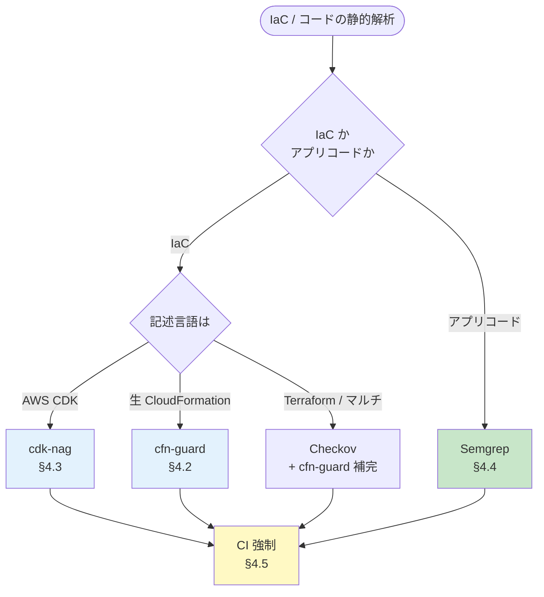

# 04. 静的解析ガイドライン

前提: [00-basic-design-plan.md](00-basic-design-plan.md) BD-P-01〜08
対象読者: アプリチームの開発者 / CI 整備担当
対応死守事項: SA-1（IaC は cfn-guard/cdk-nag を CI 強制）/ SA-2（アプリコードは Semgrep）/ SA-3（検知は deploy ブロック）

---

## §4.0 前提と背景

**このガイドラインで定めること**: IaC とアプリコードの静的解析を CI に組み込み、認証実装漏れ・設定ミスを **deploy 前**に検出する標準。
**主な判断軸**: 検知 5 レイヤー（[§C-API-6 §C-6.6](../proposal/common/06-external-api-auth-architecture.md)）のうち **L1（IaC Pre-Deploy）と L3（Static Code）** を実装対象化。誤検知を抑えつつ死守事項を強制する。
**§C-6.6 との関係**: §C-6.6.4（L1 IaC）/ §C-6.6.6（L3 Static Code）の実装サンプルを、アプリチームが従うガイドラインに昇華する。

> ⚠ **ファクト検証注記（2026-07 時点）**: 本章の cdk-nag ルール ID は公式 [cdk-nag RULES.md](https://github.com/cdklabs/cdk-nag/blob/main/RULES.md) で実在確認済み。§C-API-6 §C-6.6.4 の旧サンプルに存在しないルール ID（`LMB5` / `ELB7`）があったため、本章では**正しい ID のみ**を記載する（詳細は §4.10）。

---

## §4.1 3 ツール併用の全体像

静的解析は対象（IaC 言語 / アプリコード）で使うツールが分かれる。

| ツール | 対象 | 役割 | コスト |
|---|---|---|---|
| **cfn-guard** | CloudFormation / Terraform plan JSON | Policy-as-code、独自ルール DSL で認証・タグ検証 | OSS 無料 |
| **cdk-nag** | AWS CDK（TypeScript/Python 等）| CDK synth 時に NagPack で自動検査 | OSS 無料 |
| **Checkov** | マルチ IaC（CFN/TF/K8s/Dockerfile）| 網羅的ベストプラクティス検査 | OSS 無料 |
| **Semgrep** | アプリコード（多言語）| AST パターンで認証 middleware 欠落 / JWT バグ検出 | OSS 無料 / Pro 有償 |

### §4.1.1 IaC 言語別の選定フロー



**選定原則**:
- **CDK 採用アプリ** → cdk-nag（CDK ネイティブ、synth 時検査）を第一に、独自要件は cfn-guard で補完
- **生 CloudFormation** → cfn-guard（独自 DSL ルール）
- **Terraform** → Checkov + cfn-guard（plan JSON に対して）
- **アプリコード全般** → Semgrep

---

## §4.2 cfn-guard 標準ルールセット（SA-1 対応）

cfn-guard は AWS 公式の policy-as-code ツール。独自 DSL（Guard rules language）で CloudFormation テンプレを検査する。

### §4.2.1 標準ルール 3 群

本標準が配布する cfn-guard ルール（`code-samples/iac-guard-rules/` に実装、[§C-6.6.4](../proposal/common/06-external-api-auth-architecture.md) 準拠）:

| ルール群 | 検査内容 | 根拠 |
|---|---|---|
| **認証必須** | API GW Method の `AuthorizationType != NONE`、Lambda Function URL の `AuthType == AWS_IAM`、ALB Listener の authenticate action | §C-API-6 6 漏れパターン P1 |
| **Origin Protection** | Public API GW の Resource Policy が CloudFront Prefix List + Custom Header 検証を持つ、Public ALB SG が origin-facing prefix list のみ | ADR-039 §C-4 |
| **必須タグ** | `app-id` / `env` / `cost-center` / `owner` の付与 | 03 章 BL-1 |

### §4.2.2 サンプル（認証必須ルール）

```
# api-gw-authorizer-required.guard
let api_gw_methods = Resources.*[ Type == 'AWS::ApiGateway::Method' ]

rule api_gw_must_have_authorizer when %api_gw_methods !empty {
    %api_gw_methods.Properties {
        AuthorizationType != "NONE"
        <<API GW Method must have non-NONE AuthorizationType>>
    }
}

let lambda_urls = Resources.*[ Type == 'AWS::Lambda::Url' ]

rule lambda_url_must_have_iam_auth when %lambda_urls !empty {
    %lambda_urls.Properties {
        AuthType == "AWS_IAM"
        <<Lambda Function URL must use AWS_IAM auth>>
    }
}
```

CI 実行:
```bash
cfn-guard validate -r rules/auth-required.guard -d cloudformation/
```

### §4.2.3 運用注意
- `/health` 等の例外は guard ルールに注釈で明示し、例外承認（§4.7）を経る
- ルールセットは共通リポジトリで配布、各アプリは consumer
- 段階導入: 既存 stack は warn、新規は error

---

## §4.3 cdk-nag 標準構成（SA-1 対応）

cdk-nag は CDK の Aspect として動作し、synth 時に NagPack のルールで検査する。

### §4.3.1 NagPack 選定

| NagPack | 用途 |
|---|---|
| **AwsSolutions** | 本標準の標準（AWS Well-Architected 準拠の汎用検査）|
| HIPAASecurity / NIST80053R5 / PCIDSS321 | 規制対応が必要なアプリで追加 |

適用（TypeScript 例）:
```typescript
import { AwsSolutionsChecks } from 'cdk-nag';
import { App, Aspects } from 'aws-cdk-lib';

const app = new App();
const stack = new MyApiStack(app, 'MyApiStack');
Aspects.of(stack).add(new AwsSolutionsChecks({ verbose: true }));
```

### §4.3.2 API プラットフォーム関連の実在ルール ID（公式 RULES.md 確認済み）

**⚠ 以下は cdk-nag 公式 RULES.md で実在確認した ID のみ**（2026-07 時点）:

| ルール ID | 検査内容 | 本標準での意味 |
|---|---|---|
| **AwsSolutions-APIG1** | API に access logging が有効か | 監査ログ（TP 系）|
| **AwsSolutions-APIG2** | REST API に request validation が有効か | 入力検証 |
| **AwsSolutions-APIG3** | REST API stage が WAFv2 web ACL に関連付いているか | Origin/WAF（RL-1）|
| **AwsSolutions-APIG4** ⭐ | API が authorization を実装しているか（IAM / Cognito / カスタム Authorizer）| **認証必須（SA-1 の中核）**|
| **AwsSolutions-APIG6** | REST API Stage が全 method で CloudWatch logging 有効か | 実行ログ |
| **AwsSolutions-L1** | 非コンテナ Lambda が最新ランタイムか | ランタイム鮮度 |
| **AwsSolutions-ELB2** | ELB に access logs が有効か | ALB 監査ログ |
| **AwsSolutions-ELB5** | CLB listener が secure protocol か | 暗号化 |
| **AwsSolutions-CFR2** | CloudFront が WAF 統合を要するか | Origin/WAF |
| **AwsSolutions-CFR3** | CloudFront に access logging が有効か | CDN ログ |

> **⚠ 存在しないルール ID に注意**: cdk-nag に **`LMB` prefix は存在しない**（Lambda は `L1`）。ALB access logging は `ELB2`（`ELB7` は存在しない）。§C-6.6.4 旧サンプルの `LMB5` / `ELB7` は誤りであり使用禁止。**Lambda Function URL の AuthType を検査する cdk-nag ルールは存在しない**ため、これは cfn-guard（§4.2.2）で担保する。

### §4.3.3 suppress の作法
- 例外は `NagSuppressions.addResourceSuppressions()` で個別に、理由を必須記載
- suppress は監査対象（§4.7 例外承認 + §C-6.6.5 Config Rule で継続確認）

---

## §4.4 Semgrep 標準ルール（SA-2 対応）

Semgrep は AST パターンでアプリコードの認証実装漏れを検出する。[§C-6.6.6](../proposal/common/06-external-api-auth-architecture.md) のルールを標準化する。

### §4.4.1 ルール YAML 構文（公式確認済み）

Semgrep ルールは `rules:` 配下に `id` / `pattern`（or `pattern-either` / `pattern-not` / `patterns`）/ `message` / `severity`（ERROR/WARNING/INFO）/ `languages` を持つ。

### §4.4.2 標準ルール（言語別）

| ルール | 対象言語 | 検出内容 | 漏れパターン |
|---|---|---|---|
| `fastapi-missing-auth-middleware` | Python | FastAPI app に AuthMiddleware 欠落 | P6 |
| `spring-controller-missing-preauthorize` | Java | `@PreAuthorize`/`@Secured` 欠落 | P6 |
| `jwt-decode-without-verify` | Python | `verify=False` / `algorithms=["none"]` / 鍵未指定 | P5 |
| `missing-tenant-validation` | Python | path の tenant_id を JWT クレームと照合せず | P3 |
| `express-route-missing-auth` | Node/TS | `/api/` route に authMiddleware 欠落 | P6 |

サンプル（JWT 検証バグ検出）:
```yaml
rules:
  - id: jwt-decode-without-verify
    pattern-either:
      - pattern: jwt.decode($TOKEN, ..., verify=False, ...)
      - pattern: jwt.decode($TOKEN, ..., algorithms=["none"], ...)
    message: "JWT decoded without proper signature verification (P5)"
    languages: [python]
    severity: ERROR
```

### §4.4.3 公式レジストリ pack の併用
- `p/owasp-top-ten` / `p/security-audit` を標準 pack として併用
- 自作ルールは `semgrep-rules/`（`code-samples/`）で管理

---

## §4.5 CI 統合パターン（SA-3 対応）

### §4.5.1 各 CI での組込

| CI | IaC 検査 | コード検査 |
|---|---|---|
| **GitHub Actions** | cfn-guard action / `cdk synth`+cdk-nag | `semgrep ci`（`returntocorp/semgrep` action）|
| **GitLab CI** | 同上を job 化 | Semgrep SAST template |
| **CodeBuild / CodePipeline** | buildspec に cfn-guard / cdk synth | buildspec に semgrep |

### §4.5.2 deploy ブロック（SA-3 の中核）
- 検知は **CI を fail させ deploy を止める**（warn だけで通さない）
- 例外は §4.7 の申請を経たもののみ
- GitHub Actions 例:
```yaml
- name: cfn-guard validate
  run: cfn-guard validate -r rules/auth-required.guard -d cloudformation/
# 失敗時は step が non-zero exit → PR ブロック
```

---

## §4.6 pre-commit hook（開発者ローカル）

- `pre-commit` フレームワークで cfn-guard / cdk-nag / semgrep をローカル実行
- CI と同じルールセットを参照（ドリフト防止）
- 開発者が push 前に検知でき、CI 失敗の往復を削減

---

## §4.7 例外承認プロセス

| ステップ | 内容 |
|---|---|
| 1. 申請 | 誤検知 or 正当な例外を Issue/チケットで申請（対象リソース・理由・期限）|
| 2. レビュー | Security チームが承認/却下 |
| 3. 記録 | 承認済み例外を台帳化（cdk-nag suppress / cfn-guard 注釈にチケット ID）|
| 4. 監査 | §C-6.6.5 Config Rule + 定期棚卸しで suppress の妥当性を継続確認 |

---

## §4.8 アプリチーム自己確認チェックリスト

| # | 確認項目 | 死守 |
|---|---|:---:|
| 1 | IaC が CDK なら cdk-nag（AwsSolutionsChecks）を Aspect 適用 | SA-1 |
| 2 | 生 CFN / TF なら cfn-guard 認証ルールを CI 実行 | SA-1 |
| 3 | APIG4（authorization）が pass している | SA-1 |
| 4 | Lambda Function URL は cfn-guard で `AuthType=AWS_IAM` 検証 | SA-1 |
| 5 | アプリコードに Semgrep（自作 + owasp pack）を CI 実行 | SA-2 |
| 6 | 検知は deploy をブロックする設定 | SA-3 |
| 7 | suppress / 例外はチケット ID 付きで承認済み | SA-3 |
| 8 | pre-commit hook をローカルに導入 | — |

---

## §4.9 設計判断

| ID | 判断 | 根拠 |
|---|---|---|
| D-G-040 | CDK は cdk-nag、生 CFN は cfn-guard、コードは Semgrep を標準ツールとする | IaC 言語ネイティブの検査が誤検知が少なく保守しやすい |
| D-G-041 | cdk-nag ルール ID は公式 RULES.md 実在確認済みのもののみ記載 | ハルシネーション（`LMB5`/`ELB7`）を排除、監査で破綻しない |
| D-G-042 | Lambda Function URL の AuthType 検査は cdk-nag に存在しないため cfn-guard で担保 | cdk-nag に該当ルールがないという事実に基づく設計 |
| D-G-043 | 検知は deploy ブロック（warn では通さない）、例外は申請制 | SA-3、Fail-closed の徹底 |

---

## §4.10 未決事項・他章への引き渡し

| ID | 内容 | 引き渡し先 |
|---|---|---|
| BD-Q-04 | Semgrep 言語別ルールの整備優先順位（Python / Node / Java / Go）| `code-samples/semgrep-rules/` 実装 Phase |
| G-HANDOFF-04-1 | cfn-guard / cdk-nag ルールセットの実装 | `code-samples/iac-guard-rules/` |
| G-HANDOFF-04-2 | §C-6.6.4 の cdk-nag 誤 ID（LMB5/ELB7）の修正 | §C-API-6 側（統合作業で対応）|
| G-HANDOFF-04-3 | 検知後の対応 SLA | 05 章 §5.7 |

---

## §4.x 検証済み事実（一次資料）

| # | 事実 | 一次資料 |
|---|---|---|
| 1 | cdk-nag API Gateway ルール = APIG1（access logging）/ APIG2（request validation）/ APIG3（WAFv2 ACL）/ **APIG4（authorization）** / APIG6（CloudWatch logging）| https://github.com/cdklabs/cdk-nag/blob/main/RULES.md |
| 2 | cdk-nag Lambda ルールは **L1（runtime 鮮度）のみ**、`LMB` prefix は存在しない | 同上 |
| 3 | cdk-nag ELB ルール = ELB2（access logs）/ ELB5（secure protocol）、`ELB7` は存在しない | 同上 |
| 4 | cdk-nag CloudFront = CFR2（WAF 統合）/ CFR3（access logging）| 同上 |
| 5 | Semgrep ルール構文 = `rules[].id/pattern(-either/-not)/message/severity/languages` | https://semgrep.dev/docs/writing-rules/rule-syntax |
| 6 | cfn-guard = AWS 公式 policy-as-code、Guard rules language DSL | https://docs.aws.amazon.com/cfn-guard/latest/ug/ |

## §4.x 関連ドキュメント

- [§C-API-6 §C-6.6.4/.6](../proposal/common/06-external-api-auth-architecture.md) — L1/L3 実装サンプル
- [§FR-API-7 §7.2.2](../proposal/fr/07-guardrails.md) — Config Rules（Post-Deploy）との役割分担
- [05-security.md](05-security.md) — セキュリティ 3 本柱（テストプロセス §5.3 での位置付け）
