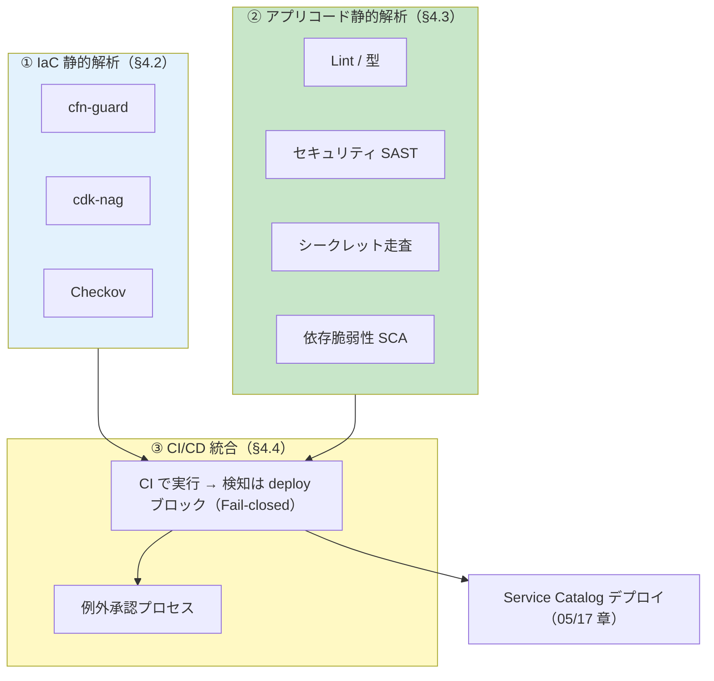
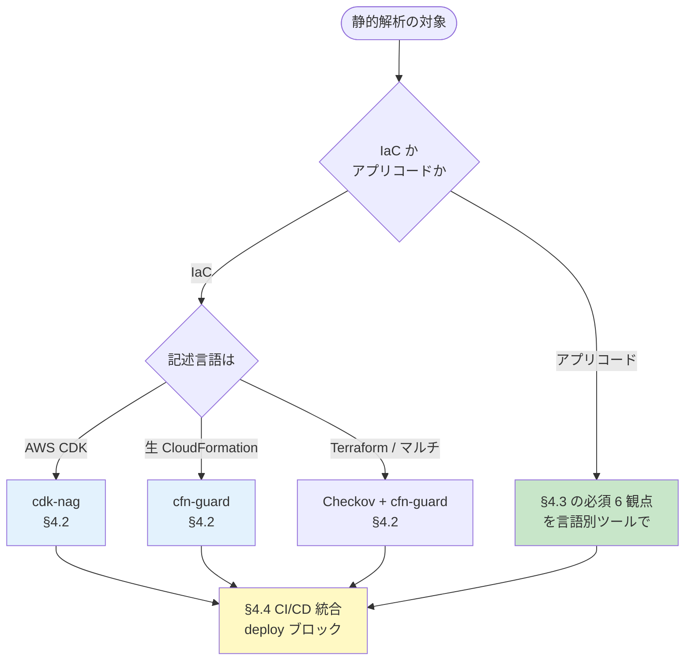
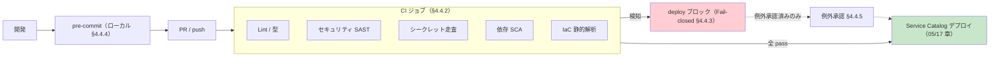

# 04. 静的解析ガイドライン

前提: [00-basic-design-plan.md](00-basic-design-plan.md) BD-P-01〜08
対象読者: アプリチームの開発者 / CI 整備担当
対応死守事項: **SA-1**（IaC の静的解析）/ **SA-2**（アプリコードの静的解析）/ **SA-3**（CI/CD 統合で deploy ブロック）

---

## §4.0 前提と背景

**このガイドラインで定めること**: 静的解析を **3 本柱** で定義し、認証実装漏れ・設定ミス・危険コードを **deploy 前**に止める標準を示す。

| 柱 | 節 | 対象 | 死守事項 |
|---|---|---|---|
| **① IaC コードの静的解析** | §4.2 | CloudFormation / CDK / Terraform | SA-1 |
| **② アプリコードの静的解析** | §4.3 | 各言語のアプリコード（Lint / 型 / セキュリティ / シークレット / 依存）| SA-2 |
| **③ CI/CD との統合** | §4.4 | パイプライン組込・deploy ブロック・例外承認 | SA-3 |

**主な判断軸**: 検知 5 レイヤー（[§C-API-6 §C-6.6](../proposal/common/06-external-api-auth-architecture.md)）のうち **L1（IaC Pre-Deploy）と L3（Static Code）** を実装対象化。①②で「何を検査するか」、③で「いつ・どう止めるか」を定める。誤検知を抑えつつ死守事項を強制する。

> ⚠ **ファクト検証注記（2026-07 時点）**: 本章の cdk-nag ルール ID は公式 [cdk-nag RULES.md](https://github.com/cdklabs/cdk-nag/blob/main/RULES.md) で実在確認済み。§C-API-6 §C-6.6.4 の旧サンプルに存在しないルール ID（`LMB5` / `ELB7`）があったため、本章では**正しい ID のみ**を記載する（§4.2.4 / 検証済み事実）。

### §4.0.1 全体像（3 本柱と流れ）



---

## §4.1 ツール早見表と選定

静的解析は対象（IaC 言語 / アプリ言語）で使うツールが分かれる。まず全体の早見表を示す。

| 分類 | ツール | 対象 | 役割 | コスト |
|---|---|---|---|---|
| ① IaC | **cfn-guard** | CloudFormation / Terraform plan JSON | Policy-as-code、独自 DSL で認証・タグ検証 | OSS 無料 |
| ① IaC | **cdk-nag** | AWS CDK（TS/Python 等）| synth 時に NagPack で自動検査 | OSS 無料 |
| ① IaC | **Checkov** | マルチ IaC（CFN/TF/K8s/Dockerfile）| 網羅的ベストプラクティス | OSS 無料 |
| ② コード | **Semgrep** | 多言語 | AST パターンで認証漏れ / JWT バグ検出 | OSS 無料 / Pro 有償 |
| ② コード | **言語別 Linter / 型 / SCA / secret** | 各言語 | §4.3 で網羅 | 大半 OSS |

### §4.1.1 選定フロー



**選定原則**:
- **CDK 採用** → cdk-nag（CDK ネイティブ、synth 時検査）を第一に、独自要件は cfn-guard で補完
- **生 CloudFormation** → cfn-guard（独自 DSL ルール）
- **Terraform** → Checkov + cfn-guard（plan JSON に対して）
- **アプリコード** → §4.3 の必須 6 観点を、言語ごとの代表ツールで満たす

---

## §4.2 ① IaC コードの静的解析（SA-1 対応）

**(SA-1)** IaC は cfn-guard または cdk-nag を CI で強制する。

### §4.2.1 標準で検査する 3 群

本標準が配布する IaC ルール（`code-samples/iac-guard-rules/` に実装、[§C-6.6.4](../proposal/common/06-external-api-auth-architecture.md) 準拠）:

| ルール群 | 検査内容 | 根拠 |
|---|---|---|
| **認証必須** | API GW Method の `AuthorizationType != NONE`、Lambda Function URL の `AuthType == AWS_IAM`、ALB Listener の authenticate action | §C-API-6 6 漏れパターン P1 / 05 章 AC-3 |
| **Origin Protection** | Public API GW の Resource Policy が CloudFront Prefix List + Custom Header 検証を持つ、Public ALB SG が origin-facing prefix list のみ | ADR-039 §C-4 / 05 章 NW-1 |
| **必須タグ** | `app-id` / `env` / `cost-center` / `owner` の付与 | 03 章 BL-1 |

### §4.2.2 cfn-guard（生 CFN / Terraform plan）

cfn-guard は AWS 公式の policy-as-code ツール。独自 DSL（Guard rules language）で検査する。

```
# api-gw-authorizer-required.guard
let api_gw_methods = Resources.*[ Type == 'AWS::ApiGateway::Method' ]

rule api_gw_must_have_authorizer when %api_gw_methods !empty {
    %api_gw_methods.Properties {
        AuthorizationType != "NONE"
        <<API GW Method must have non-NONE AuthorizationType>>
    }
}

let lambda_urls = Resources.*[ Type == 'AWS::Lambda::Url' ]

rule lambda_url_must_have_iam_auth when %lambda_urls !empty {
    %lambda_urls.Properties {
        AuthType == "AWS_IAM"
        <<Lambda Function URL must use AWS_IAM auth>>
    }
}
```

CI 実行:
```bash
cfn-guard validate -r rules/auth-required.guard -d cloudformation/
```

運用注意:
- `/health` 等の例外は guard ルールに注釈で明示し、例外承認（§4.4.5）を経る
- ルールセットは共通リポジトリで配布、各アプリは consumer
- 段階導入: 既存 stack は warn、新規は error

### §4.2.3 cdk-nag（CDK 採用時）

cdk-nag は CDK の Aspect として動作し、synth 時に NagPack のルールで検査する。

| NagPack | 用途 |
|---|---|
| **AwsSolutions** | 本標準の標準（Well-Architected 準拠の汎用検査）|
| HIPAASecurity / NIST80053R5 / PCIDSS321 | 規制対応が必要なアプリで追加 |

```typescript
import { AwsSolutionsChecks } from 'cdk-nag';
import { App, Aspects } from 'aws-cdk-lib';

const app = new App();
const stack = new MyApiStack(app, 'MyApiStack');
Aspects.of(stack).add(new AwsSolutionsChecks({ verbose: true }));
```

### §4.2.4 cdk-nag 関連の実在ルール ID（公式 RULES.md 確認済み）

**⚠ 以下は cdk-nag 公式 RULES.md で実在確認した ID のみ**（2026-07 時点）:

| ルール ID | 検査内容 | 本標準での意味 |
|---|---|---|
| **AwsSolutions-APIG1** | API に access logging が有効か | 監査ログ |
| **AwsSolutions-APIG2** | REST API に request validation が有効か | 入力検証 |
| **AwsSolutions-APIG3** | REST API stage が WAFv2 web ACL に関連付いているか | Origin/WAF（RL-1）|
| **AwsSolutions-APIG4** ⭐ | API が authorization を実装しているか（IAM / Cognito / カスタム Authorizer）| **認証必須（SA-1 の中核）**|
| **AwsSolutions-APIG6** | REST API Stage が全 method で CloudWatch logging 有効か | 実行ログ |
| **AwsSolutions-L1** | 非コンテナ Lambda が最新ランタイムか | ランタイム鮮度 |
| **AwsSolutions-ELB2** | ELB に access logs が有効か | ALB 監査ログ |
| **AwsSolutions-ELB5** | CLB listener が secure protocol か | 暗号化 |
| **AwsSolutions-CFR2** | CloudFront が WAF 統合を要するか | Origin/WAF |
| **AwsSolutions-CFR3** | CloudFront に access logging が有効か | CDN ログ |

> **⚠ 存在しないルール ID に注意**: cdk-nag に **`LMB` prefix は存在しない**（Lambda は `L1`）。ALB access logging は `ELB2`（`ELB7` は存在しない）。§C-6.6.4 旧サンプルの `LMB5` / `ELB7` は誤りであり使用禁止。**Lambda Function URL の AuthType を検査する cdk-nag ルールは存在しない**ため、これは cfn-guard（§4.2.2）で担保する。

### §4.2.5 suppress の作法
- 例外は `NagSuppressions.addResourceSuppressions()` で個別に、理由を必須記載
- suppress は監査対象（§4.4.5 例外承認 + §C-6.6.5 Config Rule で継続確認）

---

## §4.3 ② アプリコードの静的解析（SA-2 対応）

**(SA-2)** アプリコードは言語ごとの静的解析を CI で実行する。使うツールは言語で変わるため、本節は **「言語に依存しない必須観点」を先に抽象化**し（§4.3.0）、その後に**言語別の代表ツール対応表**（§4.3.1）を示す。

### §4.3.0 言語非依存の必須観点（6 カテゴリ）

どの言語でも満たすべき静的解析の観点を 6 つに抽象化する。**必須**は SA-2 として deploy ブロック対象、**推奨**は品質向上目的。

| # | 観点 | 目的 / 検出する問題 | 区分 |
|---|---|---|:---:|
| 1 | **Lint（コード品質）** | 未定義・未使用変数、到達不能コード、危険イディオム（`eval` 等）、コーディング規約違反 | **必須** |
| 2 | **フォーマット** | 整形統一（レビュー効率・差分ノイズ低減）。セキュリティには直接関与しない | 推奨 |
| 3 | **型チェック** | 型不整合・null 参照。型付き言語（Java/Go/TS）はコンパイラで担保、動的言語（Python/JS）は漸進的型導入 | 型付き=**必須** / 動的=推奨 |
| 4 | **セキュリティ SAST** | 認証漏れ・インジェクション・危険関数・JWT 検証バグ（本プラットフォームの中核 P3/P5/P6）| **必須** |
| 5 | **シークレット走査** | ハードコードされた credential / API キー / 秘密鍵（05 章 NW-4 と連動）| **必須** |
| 6 | **依存脆弱性 SCA** | 既知 CVE を持つライブラリ依存（直接・推移的）| **必須** |
| （7）| ライセンス走査 | 依存の OSS ライセンス適合 | 任意（組織方針次第）|

> **設計原則**: 「ツール名」ではなく「観点」を必須化する。言語やチームの好みでツールは選べるが、**上記 4 つの必須観点（Lint / セキュリティ SAST / シークレット / 依存脆弱性、+型付き言語の型）を CI で満たすこと**が SA-2 の実体。

### §4.3.1 言語別 代表ツール対応表

必須観点を各言語でどのツールが満たすかの標準マッピング（いずれも広く使われる OSS。同等の代替可）。

| 言語 | Lint | 型 | セキュリティ SAST | シークレット | 依存 SCA |
|---|---|---|---|---|---|
| **Python** | Ruff / Pylint / Flake8 | mypy（推奨）| Semgrep / Bandit | gitleaks / detect-secrets | pip-audit / Safety |
| **JS / TS** | ESLint | tsc（TS は必須）| Semgrep / eslint-plugin-security | gitleaks | npm audit / osv-scanner |
| **Java** | Checkstyle / PMD | コンパイラ | SpotBugs + FindSecBugs / Semgrep | gitleaks | OWASP Dependency-Check / Trivy |
| **Go** | golangci-lint（`go vet` 内包）| コンパイラ | gosec / Semgrep | gitleaks | govulncheck |
| **言語横断（共通で使える）** | — | — | **Semgrep**（多言語 1 本化）| **gitleaks / TruffleHog** | **Trivy / osv-scanner / Grype** |

> **本標準の共通線**: セキュリティ SAST は **Semgrep**（多言語対応で認証漏れ検出ルールを一元管理、§4.3.2）、シークレットは **gitleaks**、SCA は **Trivy / osv-scanner** を横断標準として推奨。言語固有 Linter は各アプリの選択に委ねる（必須は「Lint を回すこと」自体）。

### §4.3.2 セキュリティ SAST 標準ルール（Semgrep、認証漏れ検出）

セキュリティ観点は本プラットフォームの中核であり、[§C-6.6.6](../proposal/common/06-external-api-auth-architecture.md) の認証漏れルールを標準化する。

| ルール | 対象言語 | 検出内容 | 漏れパターン |
|---|---|---|---|
| `fastapi-missing-auth-middleware` | Python | FastAPI app に AuthMiddleware 欠落 | P6 |
| `spring-controller-missing-preauthorize` | Java | `@PreAuthorize`/`@Secured` 欠落 | P6 |
| `jwt-decode-without-verify` | Python | `verify=False` / `algorithms=["none"]` / 鍵未指定 | P5 |
| `missing-tenant-validation` | Python | path の tenant_id を JWT クレームと照合せず | P3 |
| `express-route-missing-auth` | Node/TS | `/api/` route に authMiddleware 欠落 | P6 |

```yaml
rules:
  - id: jwt-decode-without-verify
    pattern-either:
      - pattern: jwt.decode($TOKEN, ..., verify=False, ...)
      - pattern: jwt.decode($TOKEN, ..., algorithms=["none"], ...)
    message: "JWT decoded without proper signature verification (P5)"
    languages: [python]
    severity: ERROR
```

> Semgrep ルール構文: `rules[]` に `id` / `pattern`（`pattern-either` / `pattern-not` / `patterns`）/ `message` / `severity`（ERROR/WARNING/INFO）/ `languages`。自作ルールは `code-samples/semgrep-rules/` で管理。
>
> ⚠ **P4-1 で発見した実バグ**: `fastapi-missing-auth-middleware` は素朴に書くと健全コードで誤検知した。`patterns:` リスト形式 + `pattern-not-inside` 末尾 `...` で修正済み（[research/phase4-local-verification-results.md](research/phase4-local-verification-results.md)）。ルールは「走らせて誤検知ゼロ」を確認してから配布する。

### §4.3.3 シークレット走査

- **gitleaks / TruffleHog / detect-secrets** で credential・秘密鍵・API キーのハードコードを検出。
- CI（PR 時）+ pre-commit（§4.4.4）+ 履歴全体スキャン（初回導入時）の 3 タイミング。
- 05 章 **NW-4（credential は Secrets Manager、コード埋込禁止）** の静的担保。検出は即 deploy ブロック。

### §4.3.4 依存脆弱性 SCA

- **Trivy / osv-scanner / Grype**（言語横断）または言語別（npm audit / pip-audit / govulncheck / OWASP Dependency-Check）で既知 CVE を検出。
- 重大度で閾値を設定（例: HIGH 以上は deploy ブロック、MEDIUM は警告 + 期限付き是正）。
- lockfile（`package-lock.json` / `poetry.lock` 等）を対象に**推移的依存**まで走査。

### §4.3.5 公式レジストリ pack の併用
- Semgrep は `p/owasp-top-ten` / `p/security-audit` を標準 pack として併用。
- 自作ルール（認証漏れ P3/P5/P6）+ 公式 pack（汎用脆弱性）の 2 段構えで網羅。

---

## §4.4 ③ CI/CD との統合（SA-3 対応）

**(SA-3)** 検知は deploy をブロックする（warn だけで通さない）。①②を「いつ・どこで・どう止めるか」を定める。

### §4.4.1 パイプライン内の配置



### §4.4.2 各 CI での組込

| CI | IaC 検査 | コード検査（Lint/SAST/secret/SCA）|
|---|---|---|
| **GitHub Actions** | cfn-guard action / `cdk synth`+cdk-nag | 言語別 lint action + `semgrep ci` + gitleaks action + Trivy action |
| **GitLab CI** | 同上を job 化 | SAST / Secret Detection / Dependency Scanning テンプレート |
| **CodeBuild / CodePipeline** | buildspec に cfn-guard / cdk synth | buildspec に lint / semgrep / gitleaks / trivy |

### §4.4.3 deploy ブロック（Fail-closed、SA-3 の中核）
- 必須観点（§4.3.0 の必須）の検知は **CI を fail させ deploy を止める**。
- 例外は §4.4.5 の申請を経たもののみ通す。
```yaml
- name: cfn-guard validate
  run: cfn-guard validate -r rules/auth-required.guard -d cloudformation/
# 失敗時は step が non-zero exit → PR ブロック
- name: semgrep
  run: semgrep ci --config p/owasp-top-ten --config ./semgrep-rules
```

### §4.4.4 pre-commit hook（開発者ローカル）
- `pre-commit` フレームワークで lint / semgrep / gitleaks / cfn-guard / cdk-nag をローカル実行。
- CI と**同じルールセット**を参照（ドリフト防止）。
- 開発者が push 前に検知でき、CI 失敗の往復を削減。

### §4.4.5 例外承認プロセス

| ステップ | 内容 |
|---|---|
| 1. 申請 | 誤検知 or 正当な例外を Issue/チケットで申請（対象・理由・期限）|
| 2. レビュー | Security チームが承認/却下 |
| 3. 記録 | 承認済み例外を台帳化（cdk-nag suppress / cfn-guard 注釈 / semgrep `nosemgrep` にチケット ID）|
| 4. 監査 | §C-6.6.5 Config Rule + 定期棚卸しで妥当性を継続確認 |

### §4.4.6 監視資材アップロード（デプロイ成功後の標準ステップ）

全静的解析 pass → デプロイ成功の**後**に、パイプライン最終段で**監視資材**（`monitoring.yaml` / `openapi.yaml`（デプロイ版の写し）+ 任意 `deploy-info.json`）を App アカウントの資材バケットへアップロードする（規約は [17 章 §17.3](17-deployment-integration-and-registration.md)、権限は [16 章 §16.2.2](16-cross-account-iam-design.md)）。中央の外形監視はこの資材の VersionId 変化で変更を検知するため、**アップロードしないと新しい版が監視対象に反映されない**（アップロード漏れ・誤りは原則アプリ責任、17 §17.2.2）。

```yaml
# デプロイ成功後の標準ステップ（例）
- name: upload monitoring artifacts
  run: |
    # アプリ単位の専用ロール（デプロイロールとは別）を Assume
    #   ArtifactUploadRole-{appId}: {appId}/* 限定の s3:PutObject のみ
    aws s3 cp monitoring.yaml "s3://auth-monitoring-artifacts-${ACCOUNT_ID}/${APP_ID}/monitoring.yaml"
    aws s3 cp openapi.yaml    "s3://auth-monitoring-artifacts-${ACCOUNT_ID}/${APP_ID}/openapi.yaml"
    aws s3 cp deploy-info.json "s3://auth-monitoring-artifacts-${ACCOUNT_ID}/${APP_ID}/deploy-info.json"  # 任意
```

- **順序を固定**: 「デプロイ成功 → 資材アップロード」。逆順・デプロイ失敗時のアップロードは禁止（「資材あり = その版がデプロイ済み」を成立させるため）
- Assume するのは `ArtifactUploadRole-{appId}`（CI からの AWS 接続方式はアプリごとの既存方式で可）

---

## §4.5 アプリチーム自己確認チェックリスト（3 本柱）

| # | 確認項目 | 柱 / 死守 |
|---|---|:---:|
| 1 | IaC が CDK なら cdk-nag（AwsSolutionsChecks）を Aspect 適用 | ① SA-1 |
| 2 | 生 CFN / TF なら cfn-guard 認証ルールを CI 実行 | ① SA-1 |
| 3 | APIG4（authorization）が pass / Lambda URL は cfn-guard で `AuthType=AWS_IAM` | ① SA-1 |
| 4 | アプリコードに **Lint** を CI 実行（必須観点 1）| ② SA-2 |
| 5 | 型付き言語は**型チェック**が pass（必須観点 3）| ② SA-2 |
| 6 | **セキュリティ SAST**（Semgrep 自作 + owasp pack）を CI 実行（必須観点 4）| ② SA-2 |
| 7 | **シークレット走査**（gitleaks 等）を CI + pre-commit 実行（必須観点 5）| ② SA-2 |
| 8 | **依存脆弱性 SCA**（Trivy 等、HIGH は block）を CI 実行（必須観点 6）| ② SA-2 |
| 9 | 検知は deploy をブロックする設定 | ③ SA-3 |
| 10 | suppress / 例外はチケット ID 付きで承認済み | ③ SA-3 |
| 11 | pre-commit hook をローカルに導入（CI と同ルール）| ③ — |

---

## §4.6 設計判断

| ID | 判断 | 根拠 |
|---|---|---|
| D-G-040 | CDK は cdk-nag、生 CFN は cfn-guard、コードは Semgrep を標準ツールとする | IaC 言語ネイティブの検査が誤検知が少なく保守しやすい |
| D-G-041 | cdk-nag ルール ID は公式 RULES.md 実在確認済みのもののみ記載 | ハルシネーション（`LMB5`/`ELB7`）を排除、監査で破綻しない |
| D-G-042 | Lambda Function URL の AuthType 検査は cdk-nag に存在しないため cfn-guard で担保 | cdk-nag に該当ルールがないという事実に基づく設計 |
| D-G-043 | 検知は deploy ブロック（warn では通さない）、例外は申請制 | SA-3、Fail-closed の徹底 |
| D-G-044 | アプリコード静的解析は **「ツール名」ではなく「必須観点」（Lint/型/SAST/secret/SCA）を義務化** | 言語・チーム差を吸収しつつ必須網羅を担保（§4.3.0）|
| D-G-045 | セキュリティ SAST=Semgrep / シークレット=gitleaks / SCA=Trivy を言語横断の共通標準に | 多言語を 1 ルール基盤で一元管理し、言語追加時の保守を最小化 |

---

## §4.7 未決事項・他章への引き渡し

| ID | 内容 | 引き渡し先 |
|---|---|---|
| BD-Q-04 | Semgrep 言語別ルールの整備優先順位（Python / Node / Java / Go）| `code-samples/semgrep-rules/` 実装 Phase |
| BD-Q-04-b | SCA の deploy ブロック閾値（HIGH/CRITICAL のどこで止めるか）と是正 SLA | Security / 組織方針 |
| G-HANDOFF-04-1 | cfn-guard / cdk-nag ルールセットの実装 | `code-samples/iac-guard-rules/` |
| G-HANDOFF-04-2 | §C-6.6.4 の cdk-nag 誤 ID（LMB5/ELB7）の修正 | §C-API-6 側（統合作業で対応）|
| G-HANDOFF-04-3 | 検知後の対応 SLA | 05 章 §5.3.6 |

---

## §4.x 検証済み事実（一次資料）

| # | 事実 | 一次資料 |
|---|---|---|
| 1 | cdk-nag API Gateway ルール = APIG1（access logging）/ APIG2（request validation）/ APIG3（WAFv2 ACL）/ **APIG4（authorization）** / APIG6（CloudWatch logging）| https://github.com/cdklabs/cdk-nag/blob/main/RULES.md |
| 2 | cdk-nag Lambda ルールは **L1（runtime 鮮度）のみ**、`LMB` prefix は存在しない | 同上 |
| 3 | cdk-nag ELB ルール = ELB2（access logs）/ ELB5（secure protocol）、`ELB7` は存在しない | 同上 |
| 4 | cdk-nag CloudFront = CFR2（WAF 統合）/ CFR3（access logging）| 同上 |
| 5 | Semgrep ルール構文 = `rules[].id/pattern(-either/-not)/message/severity/languages` | https://semgrep.dev/docs/writing-rules/rule-syntax |
| 6 | cfn-guard = AWS 公式 policy-as-code、Guard rules language DSL | https://docs.aws.amazon.com/cfn-guard/latest/ug/ |

## §4.x 関連ドキュメント

- [01 総論 §1.1.3](01-cloud-guidelines-overview.md) — 死守事項 SA-1〜3
- [§C-API-6 §C-6.6.4/.6](../proposal/common/06-external-api-auth-architecture.md) — L1/L3 実装サンプル
- [§FR-API-7 §7.2.2](../proposal/fr/07-guardrails.md) — Config Rules（Post-Deploy）との役割分担
- [05-security.md](05-security.md) — セキュリティ 3 本柱（テストプロセス §5.3 / NW-4 シークレット / AC-2 JWT 検証）
