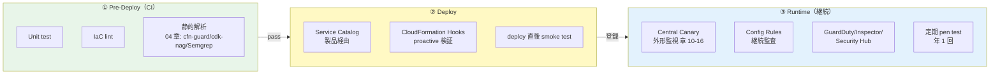
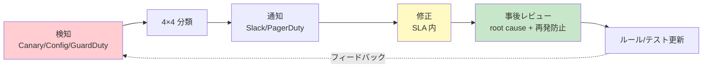

# 05. セキュリティテストプロセス

前提: [00-basic-design-plan.md](00-basic-design-plan.md) BD-P-01〜08
対象読者: アプリチームの開発者 / SRE / セキュリティ担当
対応死守事項: TP-1（Pre-Deploy で静的解析通過）/ TP-2（Deploy は Service Catalog 経由）/ TP-3（Runtime で Central Canary 登録）/ TP-4（アラート対応 SLA 遵守）

---

## §5.0 前提と背景

**このガイドラインで定めること**: セキュリティテストを **Pre-Deploy / Deploy / Runtime** の 3 段階に整理し、各段階で何を検証するかを標準化する。
**主な判断軸**: [§C-API-6 §C-6.6.9 統合パイプライン](../proposal/common/06-external-api-auth-architecture.md) をアプリチームの実務プロセスに落とす。検知は早いほど安く直せる（shift-left）。
**§C-6.6 との関係**: §C-6.6.9（統合パイプライン）/ §C-6.10（分散化 OK 条件 C1-C10）/ §C-6.11（残余リスク）を実務化。

---

## §5.1 テスト 3 段階の全体像

| 段階 | タイミング | 主目的 | 検知 5 レイヤー対応 |
|---|---|---|---|
| ① Pre-Deploy | CI（PR / push）| 実装漏れを deploy 前に止める | L1（IaC）+ L3（Static Code）|
| ② Deploy | Service Catalog / CFN | 死守事項の自動準拠 + 疎通 | L2（Config proactive）|
| ③ Runtime | 常時 / 定期 | 稼働中の漏れ・攻撃を検知 | L4（Log）+ L5（Behavioral）|

---

## §5.2 Pre-Deploy 段階（TP-1 対応）

CI（PR / push 契機）で以下を実行し、**すべて通過しないと deploy させない**:

| 検査 | 内容 | 参照 |
|---|---|---|
| **Unit test** | アプリロジックの単体テスト | アプリ固有 |
| **IaC lint** | cfn-lint / cdk synth の構文検査 | — |
| **静的解析** | cfn-guard / cdk-nag（IaC）+ Semgrep（コード）| [04 章](04-static-analysis-guidelines.md)|

→ **静的解析の検知は CI を fail させる**（SA-3 と一体）。例外は 04 章 §4.7 の承認済みのみ。

---

## §5.3 Deploy 段階（TP-2 対応）

### §5.3.1 Service Catalog 製品経由の強制
- API GW / ALB は **Service Catalog 製品経由でのみ deploy**（[§C-API-5](../proposal/common/05-self-service-catalog.md)）
- 製品テンプレが認証必須 / Origin Protection / 必須タグ / App Registry 登録を自動付与
- Service Catalog 外の直接 deploy は SCP で禁止（[§C-6.6.9 手段 1](../proposal/common/06-external-api-auth-architecture.md)、ADR-059 §F）

### §5.3.2 CloudFormation Hooks による deploy 前検証
- **CloudFormation Hooks（proactive）** で、リソースの provision 前に検証して非準拠なら **Reject** できる（AWS 公式確認 2026-07）
- 認証なし API GW / Origin Protection 欠落を deploy 段階で最終ブロック
- AWS Config の **proactive evaluation** も併用可（deploy 前にルール評価）

---

## §5.4 Deploy 直後の smoke test（TP-3 対応）

- deploy 完了直後に **疎通 + 認証確認**の smoke test を実行
- App Registry への登録が完了し、Central Canary の監視対象に入ったことを確認
- smoke test は Central Canary の初回起動をトリガとして流用可（章 10-16）

---

## §5.5 Runtime 段階（TP-3 対応）

稼働中の継続検証:

| 機構 | 役割 | 参照 |
|---|---|---|
| **Central Canary（外形監視）** | 5 分周期で全アプリの認証を Negative + Positive で probe | 章 10-16、ADR-059 |
| **Config Rules（継続監査）** | 認証 / Origin Protection の drift 検知 | [§FR-API-7 §7.2.2](../proposal/fr/07-guardrails.md)|
| **GuardDuty** | 脅威検知（全アカウント）| §NFR-API-4 |
| **Amazon Inspector** | EC2 / ECR / Lambda の脆弱性スキャン | §NFR-API-4 |
| **Security Hub** | 検知の集約・標準準拠スコア | §NFR-API-4 |

---

## §5.6 定期セキュリティテスト

| 頻度 | 内容 | 根拠 |
|---|---|---|
| **週次** | Athena クエリによる認証ログ異常検知（[§C-6.6.7](../proposal/common/06-external-api-auth-architecture.md)）| L4 |
| **月次** | OWASP ZAP 等による深掘りスキャン | L5 |
| **四半期** | 脆弱性スキャン（内部 + 外部 ASV）| PCI DSS 11.3.1/11.3.2 |
| **年 1 回 + 重要変更後** | ペネトレーションテスト（内部 + 外部）| **PCI DSS 11.4.2/11.4.3** |

> **⚠ PCI DSS ペネトレーションテスト頻度（原文検証済み）**: PCI DSS v4.0.1 Req 11.4.2（内部）/ 11.4.3（外部）はいずれも **"At least once every 12 months"（少なくとも 12 ヶ月に 1 回）+ 重要なインフラ / アプリの変更後** を要求（[pci-dss-appi-compliance-gap.md](../../common/pci-dss-appi-compliance-gap.md) で PDF 原文照合済み）。In-Scope なら外部認定企業（QSA/ASV）、Out-of-Scope なら自社 / 委託で実施。本番稼働前の実施も必須。

---

## §5.7 検知アラート対応 SLA（TP-4 対応）

Central Canary / Config / GuardDuty のアラートは **4×4 真偽値表**（[§C-6.6.8](../proposal/common/06-external-api-auth-architecture.md)）で自動分類し、担当・SLA を分ける:

| 分類 | 例 | 通知先 | SLA |
|---|---|---|:---:|
| **CRITICAL**（認証漏れ）| Negative=200（未認証で通過）| Security オンコール | 🔥 P1 即時 |
| **WARN**（テスト基盤 / 構成）| Positive=401（token 失効）/ 404 | Platform チーム | 🟡 P2 24h |
| **INFO**（Backend バグ）| Positive=500（認証 OK, API 異常）| アプリチーム | 🟢 P3 通常 |

→ 「全部 Security に飛ばす」のではなく、分類して適切な担当に振り分け、誤 P1 を防ぐ。

---

## §5.8 インシデント対応フロー

- P1（認証漏れ）は即時 deny / rollback を検討（§C-6.11 残余リスク R3）
- 事後レビューで検知ルール / テストを更新（次回の shift-left）

---

## §5.9 チェックリスト（deploy 前 + 自己確認）

### §5.9.1 deploy 前チェックリスト

| # | 確認項目 | 死守 |
|---|---|:---:|
| 1 | Unit test + IaC lint + 静的解析が CI で pass | TP-1 |
| 2 | Service Catalog 製品経由で deploy（直接 deploy でない）| TP-2 |
| 3 | OpenAPI に認証 probe アノテーション付与済み | TP-3 |
| 4 | deploy 直後 smoke test で認証 401/403 を確認 | TP-3 |

### §5.9.2 運用自己確認

| # | 確認項目 | 死守 |
|---|---|:---:|
| 5 | App Registry に登録され Central Canary 監視対象 | TP-3 |
| 6 | Config Rules が有効（認証 / Origin Protection）| TP-3 |
| 7 | アラート通知先 / SLA を把握（P1/P2/P3）| TP-4 |
| 8 | 年次 pen test 計画に組み込まれている | — |

---

## §5.10 設計判断

| ID | 判断 | 根拠 |
|---|---|---|
| D-G-050 | テストは Pre-Deploy / Deploy / Runtime の 3 段階に整理 | shift-left で早期・安価に検知、検知 5 レイヤーと対応 |
| D-G-051 | deploy 段階は Service Catalog + CloudFormation Hooks の二重で死守事項を強制 | 直接 deploy の抜け道を塞ぐ（Fail-closed）|
| D-G-052 | pen test は PCI DSS 11.4.2/11.4.3 準拠で「年 1 回 + 重要変更後 + 本番前」 | 原文照合済み、監査で破綻しない |
| D-G-053 | アラートは 4×4 真偽値表で分類し担当・SLA を分岐 | 誤 P1 を防ぎ運用負担を最小化 |

---

## §5.11 未決事項・他章への引き渡し

| ID | 内容 | 引き渡し先 |
|---|---|---|
| BD-Q-05 | 外部 pen test のベンダー選定・予算（$20-50k/年 目安）| 契約 / 予算フェーズ |
| G-HANDOFF-05-1 | Central Canary / Alert Router の実装 | 章 10-16、`code-samples/` |
| G-HANDOFF-05-2 | 週次 Athena クエリの実装 | §C-6.6.7 + `code-samples/` |

---

## §5.x 検証済み事実（一次資料）

| # | 事実 | 一次資料 |
|---|---|---|
| 1 | PCI DSS v4.0.1 Req 11.4.2（内部 pen test）= "At least once every 12 months" + 重要変更後 | PCI DSS v4.0.1 PDF 原文（[pci-dss-appi-compliance-gap.md §11.4.2](../../common/pci-dss-appi-compliance-gap.md) で照合済み）|
| 2 | PCI DSS v4.0.1 Req 11.4.3（外部 pen test）= "At least once every 12 months" + 重要変更後 | 同上 §11.4.3 |
| 3 | CloudFormation Hooks は provision 前に proactive 検証して Reject 可能 | https://docs.aws.amazon.com/cloudformation-cli/latest/hooks-userguide/ |
| 4 | AWS Config は proactive evaluation（deploy 前ルール評価）をサポート | https://docs.aws.amazon.com/config/latest/developerguide/evaluate-config-rules.html |
| 5 | GuardDuty / Inspector / Security Hub の役割（脅威検知 / 脆弱性 / 集約）| §NFR-API-4 + AWS 各サービス公式 |

## §5.x 関連ドキュメント

- [04-static-analysis-guidelines.md](04-static-analysis-guidelines.md) — Pre-Deploy 静的解析の詳細
- [§C-API-6 §C-6.6.9](../proposal/common/06-external-api-auth-architecture.md) — 統合パイプライン
- [ADR-059](../../adr/059-central-auth-check-canary-architecture.md) — Central Canary（Runtime 外形監視）
- 章 10-16（Phase 2）— 外形監視の実装
