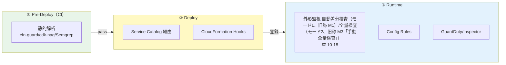

# 05. セキュリティ

前提: [00-basic-design-plan.md](00-basic-design-plan.md) BD-P-01〜08
対象読者: アプリチームの開発者 / SRE / セキュリティ担当
対応死守事項: **NW-1〜4**（ネットワーク）/ **AC-1〜5**（認証制御）/ **TP-1〜4**（テストプロセス）

---

## §5.0 前提と背景

**この章で定めること**: アプリチームが守るべきセキュリティを **3 本柱**で示す。
**主な判断軸**: 認証基盤側の設計（[認証 basic-design 06 章](../../basic-design/06-infra-network-design.md)）と API 側の認証設計（[§C-API-6](../proposal/common/06-external-api-auth-architecture.md)）を、**アプリチームが把握・遵守すべきこと**に翻訳する（認証基盤の内部設計そのものは各 SSOT に委譲、本章はアプリ視点）。

| 柱 | 節 | 概要 |
|---|---|---|
| **ネットワークセキュリティ** | §5.1 | 他アカウント（ネットワーク監査アカウント）が Inbound/Outbound を制御する構造と、アプリが守ること |
| **認証制御** | §5.2 | アプリが把握・遵守すべき認証（JWT 検証 / 認証必須 / CSRF / tenant 分離）|
| **セキュリティテストプロセス** | §5.3 | Pre-Deploy / Deploy / Runtime の 3 段階検証 |

---

## §5.1 ネットワークセキュリティ

### §5.1.1 前提：境界は「他アカウント」が制御する

API プラットフォームのインターネット境界は **ネットワーク監査アカウント（他組織/中央管理）** に集約される（[ADR-039](../../adr/039-centralized-network-account-edge-layer.md)）。アプリチームは自分のアカウント内に境界を持たず、以下を**前提として理解**する。

| 方向 | 制御 | 管理主体 |
|---|---|---|
| **Inbound** | CloudFront + WAF + Origin Protection（→ 各アプリ API GW/ALB）| ネットワーク監査アカウント |
| **Outbound** | Network Firewall ドメインフィルタ（許可ドメインのみ Egress）| ネットワーク監査アカウント |

→ 認証基盤側は「**A 部（自管理）/ B 部（他組織要求仕様 REQ-IN/REQ-OUT）**」に分け、**「B 部が満たされなくても A 部単独で破られない」**を生命線としている（[認証 06 章 §6.0.2](../../basic-design/06-infra-network-design.md)）。API 側アプリも同じ原則に従う（§5.1.4）。

### §5.1.2 インバウンド：Origin Protection（NW-1）

アプリの API は **CloudFront 経由でのみ到達可能**にする（[ADR-039 §C-4](../../adr/039-centralized-network-account-edge-layer.md)）。

| アプリが守ること | 手段 |
|---|---|
| CloudFront 経由以外の直アクセスを弾く | API GW Resource Policy（CloudFront Prefix List + `X-Origin-Verify` Custom Header）/ ALB SG（origin-facing prefix list のみ）|
| 直 curl は 403 | 上記 2 層検証。Service Catalog 製品が自動注入（[§C-API-5](../proposal/common/05-self-service-catalog.md)）|

→ アプリチームは Service Catalog 製品を使えば自動準拠。詳細は認証基盤の [ADR-039 §C-4](../../adr/039-centralized-network-account-edge-layer.md)。

### §5.1.3 アウトバウンド：Egress 制御（NW-2）

外部への通信は **Network Firewall のドメインフィルタで許可ドメインのみ**。アプリが外部 SaaS を呼ぶ（Outbound、[§C-API-6 §C-6.2.6](../proposal/common/06-external-api-auth-architecture.md)）場合：

| アプリが守ること | 手段 |
|---|---|
| 接続先 SaaS を事前申請 | **Approved SaaS Allowlist**（Security/Legal レビュー）→ NFW 許可ドメイン追加 |
| credential は Secrets Manager | 環境変数/コード埋込禁止（[03 章 BL / §C-6.2.6.4](../proposal/common/06-external-api-auth-architecture.md)）|
| 未許可ドメインへの通信は遮断される前提で設計 | エラーハンドリング |

### §5.1.4 Zero Trust：ネットワークに依存せず認証必須（NW-3）

**最重要原則**。ネットワーク境界（他組織管理の Inbound/Outbound）は**追加層**であり、それだけに依存しない。認証基盤の「B 部（他組織）が破られても A 部（自管理）で守る」に対応し、API 側は：

- **ネットワークで守られているから認証を省く、は禁止**（[§NFR-API-4 Zero Trust 原則](../proposal/nfr/04-security.md)）
- Origin Protection（NW 層）が外れても、**認証（§5.2）が独立して成立**していれば破られない
- 「同一 VPC 内だから」「Internal だから」で認証を省かない

→ これが §5.2 認証制御と本節が**独立した 2 層**である理由。

### §5.1.5 死守事項（ネットワーク）

| # | 死守事項 |
|---|---|
| **NW-1** | Public API は CloudFront 経由必須（Origin Protection、直アクセス 403）|
| **NW-2** | Outbound は Approved SaaS Allowlist 経由（未許可ドメインは遮断前提）。※中央の認証実装確認処理の probe は**明示的例外**（宛先固定 + 代償統制、[10 §10.1.6](10-external-monitoring-overview.md) / 承認 M-Q-10-3）|
| **NW-3** | ネットワーク層に依存せず認証を必須化（Zero Trust）|
| **NW-4** | credential は Secrets Manager（環境変数/コード埋込禁止）|

---

## §5.2 認証制御

認証基盤（Keycloak）が Engine を提供し、**検証・遵守はアプリ側の責務**（[§C-API-6 Engine vs Relationship](../proposal/common/06-external-api-auth-architecture.md)）。アプリが把握・遵守すべきことを示す。

### §5.2.1 自アプリの認証パターンを把握する（AC-1）

自 API がどの認証方式かを [7 パターン / authPattern](../proposal/common/02-runtime-selection-criteria.md) で把握する。

| authPattern | アプリが検証すること |
|---|---|
| `api-gw-jwt` | API GW JWT Authorizer（マネージド）+ アプリ側で claim 利用 |
| `alb-code-jwt` | **アプリコードで JWT 検証**（下記 §5.2.2 が要）|
| `alb-cookie-monolith` / `bff-cookie-session` | Cookie セッション + **CSRF 対策**（§5.2.4）|
| `api-gw-iam` / `lambda-url-iam` | AWS IAM（SigV4）|

### §5.2.2 JWT 検証の遵守事項（AC-2）

アプリコードで JWT を検証する場合（`alb-code-jwt` 等）、以下を**必ず**守る（[§C-API-6 §C-6.6 P5 漏れパターン](../proposal/common/06-external-api-auth-architecture.md)）：

| # | 検証項目 | 誤り例（Semgrep で検出、04 章）|
|---|---|---|
| 1 | **署名検証**（公開鍵で）| `verify=False` |
| 2 | **`alg` 固定**（`none` 拒否）| `algorithms=["none"]` |
| 3 | **`iss` 検証**（共有認証基盤の issuer）| iss 未検証 |
| 4 | **`aud` 検証**（自 API の audience）| aud 未検証 |
| 5 | **`exp` 検証**（期限切れ拒否）| exp 未検証 |

→ これらは [04 章 Semgrep `jwt-decode-without-verify`](04-static-analysis-guidelines.md) で CI 検出される。

### §5.2.3 認証必須（NONE 禁止、Fail-closed）（AC-3）

- **未認証 API を作らない**（`AuthorizationType=NONE` 禁止、[§C-API-6 P1 漏れパターン](../proposal/common/06-external-api-auth-architecture.md)）
- 例外（public health / JWKS 等）は明示申請 + `x-synthetics-skip-auth-check`（13 章）
- Service Catalog 製品 / cfn-guard / 外形監視の 3 段で担保（04 章 / 18 章）

### §5.2.4 CSRF（Cookie を使う時＝BFF / モノリス）（AC-4）

認証手段が **Cookie の場合のみ** CSRF 対策が要る（[ADR-057](../../adr/057-csrf-protection-responsibility-boundary.md)）。

| 認証手段 | CSRF 対策 |
|---|---|
| Bearer JWT（`api-gw-jwt` / SPA）| **不要**（ブラウザが Authorization ヘッダを自動送信しない）|
| **Cookie セッション（`bff-cookie-session` / `alb-cookie-monolith`）** | **必須**（Double Submit Cookie / SameSite=Strict）|
| OAuth Authorization Code フロー | `state` + PKCE（別種の CSRF、RP が生成）|

→ BFF（4 アーキパターンの D、[§C-API-2 §C-2.1.1.A](../proposal/common/02-runtime-selection-criteria.md)）は Cookie のため CSRF 必須。詳細は [ADR-057](../../adr/057-csrf-protection-responsibility-boundary.md)。

### §5.2.5 tenant 分離（クロステナント防止）（AC-5）

マルチテナントで path/body の tenant 指定を **JWT の `tenant_id` クレームと照合**する（[§C-API-6 P3 漏れパターン](../proposal/common/06-external-api-auth-architecture.md)）。

```python
jwt_tenant = event['requestContext']['authorizer']['tenant_id']
if requested_tenant != jwt_tenant:
    return 403  # クロステナント拒否
```

→ [04 章 Semgrep `missing-tenant-validation`](04-static-analysis-guidelines.md) で CI 検出。

### §5.2.6 死守事項（認証制御）

| # | 死守事項 |
|---|---|
| **AC-1** | 自 API の authPattern を把握する |
| **AC-2** | アプリ JWT 検証は署名/alg/iss/aud/exp を全て検証 |
| **AC-3** | 認証必須（NONE 禁止）、例外は申請制 |
| **AC-4** | Cookie 認証（BFF/モノリス）は CSRF 対策必須 |
| **AC-5** | マルチテナントは tenant_id をクレームと照合 |

---

## §5.3 セキュリティテストプロセス

上記 §5.1/§5.2 の遵守を、**Pre-Deploy / Deploy / Runtime の 3 段階**で検証する。検知は早いほど安く直せる（shift-left、[§C-API-6 §C-6.6.9](../proposal/common/06-external-api-auth-architecture.md)）。

### §5.3.1 3 段階の全体像



| 段階 | 主目的 | 検知 5 レイヤー |
|---|---|---|
| ① Pre-Deploy（CI）| 実装漏れを deploy 前に止める | L1（IaC）+ L3（コード）|
| ② Deploy | 死守事項の自動準拠 + 疎通 | L2（Config proactive）|
| ③ Runtime | 稼働中の漏れ・攻撃を検知 | L4（Log）+ L5（Behavioral）|

### §5.3.2 Pre-Deploy（TP-1）

CI で **Unit test + IaC lint + 静的解析**（[04 章](04-static-analysis-guidelines.md)）を実行し、通過しないと deploy させない。静的解析の検知は CI を fail させる（例外は 04 章 §4.4.5 承認済みのみ）。

### §5.3.3 Deploy（TP-2）

- API GW / ALB は **Service Catalog 製品経由でのみ deploy**（認証必須 / Origin Protection / タグを自動付与、[§C-API-5](../proposal/common/05-self-service-catalog.md)。外形監視対象への登録は中央巡回が自動で行う、17 章）
- **CloudFormation Hooks（proactive）** で provision 前に非準拠を Reject（AWS 公式確認 2026-07）
- Service Catalog 外の直接 deploy は SCP で禁止（17 章）

### §5.3.4 Runtime（TP-3）

| 機構 | 役割 | 参照 |
|---|---|---|
| **外形監視（認証実装確認処理）** | 自動差分検査（モード1）+ 全量検査（モード2）で認証を Negative+Positive の 2 種リクエストで検査 | 章 10-18、[ADR-059](../../adr/059-central-auth-check-canary-architecture.md)|
| Config Rules | 認証 / Origin Protection の drift 検知 | [§FR-API-7 §7.2.2](../proposal/fr/07-guardrails.md)|
| GuardDuty / Inspector / Security Hub | 脅威検知 / 脆弱性 / 集約 | §NFR-API-4 |

> 外形監視の実行モデルは [18 章](18-scan-modes-and-scheduling.md)（自動差分検査（モード1）+ 全量検査（モード2）、Lambda 基盤）。

### §5.3.5 定期セキュリティテスト

| 頻度 | 内容 | 根拠 |
|---|---|---|
| 週次 | Athena 認証ログ異常検知 | L4 |
| 月次 | OWASP ZAP 深掘り | L5 |
| 四半期 | 脆弱性スキャン（内部 + 外部 ASV）| PCI DSS 11.3.1/11.3.2 |
| **年 1 回 + 重要変更後** | ペネトレーションテスト | **PCI DSS 11.4.2/11.4.3** |

> **PCI DSS pen test 頻度（原文検証済み）**: Req 11.4.2（内部）/ 11.4.3（外部）はいずれも **"At least once every 12 months" + 重要変更後**（[pci-dss-appi-compliance-gap.md](../../common/pci-dss-appi-compliance-gap.md) で PDF 原文照合済み）。本番稼働前の実施も必須。

### §5.3.6 検知アラート対応 SLA とインシデント（TP-4）

アラートは **4×4 真偽値表**（[§C-6.6.8](../proposal/common/06-external-api-auth-architecture.md) / 15 章）で自動分類し担当・SLA を分ける（「全部 Security」を避ける）:

| 分類 | 通知先 | SLA |
|---|---|:---:|
| CRITICAL（認証漏れ、Neg=200）| Security オンコール | 🔥 P1 即時 |
| WARN（token 失効 / 構成）| Platform | 🟡 P2 24h |
| INFO（Backend バグ）| App team | 🟢 P3 通常 |

インシデント: 検知 → 4×4 分類 → 通知 → 修正（SLA 内）→ 事後レビュー → ルール/テスト更新。P1 は即時 deny / rollback を検討。

---

## §5.4 アプリチーム チェックリスト（3 本柱）

| # | 項目 | 柱 |
|---|---|:---:|
| 1 | Public API は CloudFront 経由（Origin Protection）| NW-1 |
| 2 | Outbound は Approved SaaS Allowlist 経由 | NW-2 |
| 3 | ネットワークに依存せず認証必須（Zero Trust）| NW-3 |
| 4 | credential は Secrets Manager | NW-4 |
| 5 | 自 API の authPattern を把握 | AC-1 |
| 6 | JWT 検証は署名/alg/iss/aud/exp 全て | AC-2 |
| 7 | 認証必須（NONE 禁止）| AC-3 |
| 8 | Cookie 認証は CSRF 対策 | AC-4 |
| 9 | tenant_id をクレームと照合 | AC-5 |
| 10 | CI で静的解析が pass | TP-1 |
| 11 | Service Catalog 製品経由で deploy | TP-2 |
| 12 | 外形監視の対象になっている（中央巡回が自動登録。デプロイ時に監視資材 `monitoring.yaml` 等を資材バケットへアップロードするのが前提、17 §17.3）| TP-3 |
| 13 | アラート通知先 / SLA を把握 | TP-4 |

---

## §5.5 設計判断

| ID | 判断 | 根拠 |
|---|---|---|
| D-G-050 | セキュリティを NW / 認証制御 / テストプロセスの 3 本柱で構成 | アプリチームが「どの層で何を守るか」を一望できる |
| D-G-051 | ネットワークと認証を独立 2 層に（Zero Trust）| ネットワーク境界（他組織）が破られても認証で守る（認証 06 章の A/B 部原則に対応）|
| D-G-052 | 認証制御はアプリ視点に絞る（Engine は認証基盤、検証・遵守はアプリ）| §C-API-6 の Engine vs Relationship 分担 |
| D-G-053 | テストは 3 段階（shift-left）+ 4×4 分類で担当分岐 | 早期・安価な検知、誤 P1 防止 |
| D-G-054 | pen test は PCI DSS 11.4 準拠で「年 1 回 + 重要変更後 + 本番前」 | 原文照合済み |

---

## §5.6 未決事項・他章への引き渡し

| ID | 内容 | 引き渡し先 |
|---|---|---|
| BD-Q-05 | 外部 pen test のベンダー選定・予算（$20-50k/年 目安）| 契約 / 予算フェーズ |
| BD-Q-01 | ROSA 側 P-18（ネットワーク監査アカウント 他組織管理）確定時の NW セキュリティ責任分界 | 16 章 |
| G-HANDOFF-05-1 | 外形監視（自動差分検査（モード1）/全量検査（モード2））の実装 | 章 10-18、`code-samples/` |

---

## §5.7 検証済み事実（一次資料）

| # | 事実 | 一次資料 |
|---|---|---|
| 1 | PCI DSS v4.0.1 Req 11.4.2/11.4.3 = "At least once every 12 months" + 重要変更後 | PCI DSS v4.0.1 PDF（[pci-dss-appi-compliance-gap.md](../../common/pci-dss-appi-compliance-gap.md) 照合済み）|
| 2 | CloudFormation Hooks は provision 前に proactive 検証して Reject 可能 | https://docs.aws.amazon.com/cloudformation-cli/latest/hooks-userguide/ |
| 3 | AWS Config は proactive evaluation をサポート | https://docs.aws.amazon.com/config/latest/developerguide/evaluate-config-rules.html |
| 4 | 認証基盤の A 部/B 部（自管理/他組織要求）+ REQ-IN/OUT + Egress ドメインフィルタ | [認証 basic-design 06 章](../../basic-design/06-infra-network-design.md) |

---

## §5.x 関連ドキュメント

- [01-cloud-guidelines-overview.md](01-cloud-guidelines-overview.md) — 死守事項サマリ
- [04-static-analysis-guidelines.md](04-static-analysis-guidelines.md) — Pre-Deploy 静的解析
- [章 10-18](10-external-monitoring-overview.md) — Runtime 外形監視
- [ADR-039](../../adr/039-centralized-network-account-edge-layer.md) — ネットワーク監査アカウント / Origin Protection
- [ADR-057](../../adr/057-csrf-protection-responsibility-boundary.md) — CSRF 責任分界
- [§C-API-6](../proposal/common/06-external-api-auth-architecture.md) — 認証アーキ / 6 漏れパターン
- [認証 basic-design 06 章](../../basic-design/06-infra-network-design.md) — ネットワーク設計（A/B 部、REQ-IN/OUT）
