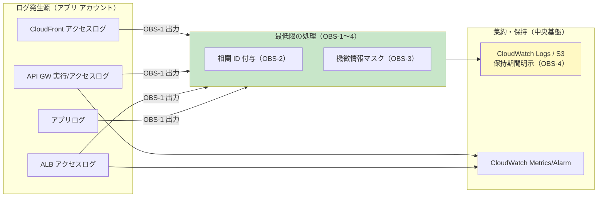

# 06. ログ・監視（オブザーバビリティ）

前提: [00-basic-design-plan.md](00-basic-design-plan.md) BD-P-01〜08
対象読者: 各アプリチームの開発者 / SRE
位置付け: [01 総論](01-cloud-guidelines-overview.md) §1.1.5 の **ログ・監視の死守事項 OBS-1〜4** を「アプリチームが何をすればよいか」に落とす
対応死守事項: **OBS-1〜4**

---

## §6.0 前提と背景

### §6.0.1 なぜログ・監視を独立章にするか

ログと監視は **流量制御（02）・課金按分（03）・セキュリティ（05）すべてに横串で関わる**横断関心事である。従来は各章に散在していた（02 §2.7 CloudWatch 監視 / 03 §3.4.2 Access Log / 05 §5.3 Runtime 監視）ため、**「最低限どのログを・どう残すか」が一望できなかった**。本章はそれを 1 か所に集約する。

### §6.0.2 この章のスタンス（重要）

> **本章は「最低限守るべきこと（OBS-1〜4）」だけを定める。それ以上のオブザーバビリティ設計はアプリチームの自由。**

| 定めること（最低限） | 定めないこと（アプリの自由）|
|---|---|
| アクセスログの必須出力（OBS-1）| ログ集約先（CloudWatch/OpenSearch/3rd party）の選定 |
| 相関 ID の付与（OBS-2）| 分散トレーシングの深さ・スパン設計 |
| 機微情報のマスク（OBS-3）| メトリクスの種類・ダッシュボードの作り込み |
| 保持期間の明示（OBS-4）| SLO/SLI・アラート閾値の詳細設計 |

**アプリの自由度を縛らない**のが原則。中央は「基盤（ログ集約先・保持ポリシー標準）」を提供し、アプリは「出す・付ける・隠す・残す期間を決める」の 4 点だけ必ず守る。

### §6.0.3 認証 外形監視（10-18 章）との違い

| 観点 | 本章（06）| 認証 外形監視（10-18）|
|---|---|---|
| 主体 | 各アプリチーム | ネットワーク監査アカウント（中央）|
| 対象 | 自 app が出すログ・自 app の監視 | 全アプリ横断の**認証漏れ**を probe |
| 性質 | アプリが守る「最低限ルール」 | 中央が運用する「検知機構」 |

→ 本章は「アプリが残す」、10-18 章は「中央が見張る」。役割が異なる。

### §6.0.4 全体像における位置づけ

---

## §6.1 アクセスログの必須出力（OBS-1）

API の入口で**アクセスログを必ず出力**する。どの入口かは authPattern（[05 §5.2.1](05-security.md)）に対応する。

| 入口 | ログ種別 | 出力先 | 備考 |
|---|---|---|---|
| API Gateway | **アクセスログ**（`$context` 変数で整形）+ 実行ログ（任意）| CloudWatch Logs | REST/HTTP 両対応。アクセスログはステージで有効化 |
| ALB | **アクセスログ** | S3 | 有効化は属性設定。Athena で分析可 |
| CloudFront | **標準ログ（v2）/ リアルタイムログ** | S3 / CloudWatch Logs / Kinesis | 境界層（ADR-039）は中央が管理。アプリ側は自 app 分を参照 |
| アプリ本体 | 構造化ログ（JSON 推奨）| CloudWatch Logs | リクエスト単位でエラー・業務イベントを記録 |

- **最低限、入口 1 か所のアクセスログは必ず出す**（どれを主にするかは構成次第）。
- API GW アクセスログの推奨フィールド: `requestId` / `ip`（マスク検討）/ `httpMethod` / `routeKey` or `resourcePath` / `status` / `responseLatency` / `identity.apiKeyId`（API Key の値そのものではない）。

---

## §6.2 相関 ID の付与（OBS-2）

障害調査・監査で「1 リクエストを端から端まで追える」ように、**相関 ID を残す**。

| 手段 | 内容 |
|---|---|
| **`X-Amzn-Trace-Id`** | AWS が付与する追跡ヘッダ。X-Ray 有効時に伝播。API GW `$context.xrayTraceId` でログ出力可 |
| **`$context.requestId`** | API GW がリクエストごとに発行する一意 ID。アクセスログに必須 |
| アプリ間伝播 | BFF/マイクロサービス跨ぎでは受領した trace id を下流へ伝播（新規生成しない）|

- 最低限、**アクセスログに `requestId`（+ 可能なら trace id）を残す**こと。アプリログにも同じ ID を出せば突合できる。
- 分散トレーシング（X-Ray / OpenTelemetry）の**深さはアプリの自由**。ここでは「ID を残す」だけが死守事項。

---

## §6.3 機微情報のマスク（OBS-3）

ログ・監視データに **トークン / 認証情報 / PII を平文で残さない**。

| 対象 | 扱い |
|---|---|
| `Authorization` ヘッダ / Bearer トークン | **ログに出さない**（出す場合はマスク）|
| API Key | API GW アクセスログは Key の値を出さない（`apiKeyId` のみ）。アプリ側でも値を残さない |
| Cookie / セッション ID | マスク。セッション固定・漏洩の原因になる |
| PII（氏名・メール・電話等）| 業務上不要ならログに出さない。必要時はマスク/トークナイズ |

- **CloudWatch Logs のデータ保護ポリシー**でマネージド/カスタムのデータ識別子により PII を自動マスク可（中央基盤が標準ポリシーを提供）。
- 認証情報を誤ってログ出力していないかは [05 章](05-security.md) の静的解析（Semgrep）とも連動。

---

## §6.4 保持期間の明示（OBS-4）

ログの**保持期間を必ず明示的に設定**する（既定放置は不可）。

| 事項 | 内容 |
|---|---|
| CloudWatch Logs の既定 | **無期限（Never expire）** がデフォルト → 設定しないとコスト増。**必ず明示設定** |
| 設定粒度 | ロググループ単位で保持日数（1 日〜10 年 or 無期限）を設定 |
| 監査要件 | 監査・規制（PCI DSS 等）が要求する期間を満たす。要件は 05 章 / 認証基盤側と整合 |
| 長期保管 | 長期は S3（+ ライフサイクル → Glacier）へエクスポートしコスト最適化 |

- 保持期間の**組織標準値**は中央（Platform）が提示。アプリは自要件がそれを超える場合に個別延長。
- 具体的な規制別保持年数は本章では固定しない（要件次第、BD-Q-06）。

---

## §6.5 監視の最低限

「出したログ・メトリクスを最低限アラートに繋ぐ」。**深い SLO 設計はアプリの自由**。

| 最低限 | 手段 |
|---|---|
| エラー率の監視 | CloudWatch Metrics（`5XXError` / `4XXError`）+ Alarm |
| レイテンシの監視 | `Latency` / `IntegrationLatency` の Alarm（任意閾値）|
| 流量との連携 | 429（スロットル）発生は [02 §2.7](02-rate-limiting-quota-rules.md) と同じメトリクスを参照 |
| 通知先 | 自 app の運用チャネル（中央の P1/P2/P3 とは別。認証漏れの中央検知は 15 章）|

---

## §6.6 アプリチーム チェックリスト（OBS-1〜4）

| # | 項目 | 対応 |
|---|:---:|---|
| □ | 入口（API GW/ALB/CloudFront）のアクセスログを出力しているか | OBS-1 |
| □ | アクセスログに `requestId`（+ trace id）を残しているか | OBS-2 |
| □ | `Authorization`/API Key/Cookie/PII をマスク・非出力にしているか | OBS-3 |
| □ | ロググループの保持期間を明示設定したか（無期限放置していないか）| OBS-4 |
| □ | 5XX/4XX の最低限アラートを設定したか | §6.5 |

---

## §6.7 設計判断

| ID | 判断 | 根拠 |
|---|---|---|
| D-G-060 | ログ・監視を独立章にし、流量/課金/セキュリティの横断関心事として集約 | 従来は各章散在で「最低限」が一望できなかった |
| D-G-061 | 本章は **OBS-1〜4 の最低限のみ**を定め、集約先・トレース深さ・SLO はアプリの自由 | 「アプリの自由度を縛らない」方針（§6.0.2）|
| D-G-062 | CloudWatch Logs は**保持期間の明示設定を義務化**（既定 Never expire を放置しない）| AWS 既定は無期限でコスト増を招く |
| D-G-063 | 認証漏れの監視は中央（10-18 章）に委譲し、本章は自 app のログ・監視に限定 | 主体・対象が異なる（§6.0.3）|

---

## §6.8 未決事項・他章への引き渡し

| ID | 内容 | 引き渡し先 |
|---|---|---|
| BD-Q-06 | ログ**保持期間の組織標準値**（規制別年数）| Platform / 監査 / 認証基盤側と整合 |
| G-HANDOFF-06-1 | 中央ログ集約基盤（CloudWatch/S3）の標準構成・データ保護ポリシー配布 | Platform（中央）|
| G-HANDOFF-06-2 | 課金用 Access Log 項目（tenant_id 等）との整合 | [03 §3.4.2](03-billing-cost-allocation-rules.md)|

---

## §6.x 関連ドキュメント

- [01 総論 §1.1.5](01-cloud-guidelines-overview.md) — 死守事項 OBS-1〜4
- [02 流量制御 §2.7](02-rate-limiting-quota-rules.md) — CloudWatch 監視・429 メトリクス（本章と共用）
- [03 課金制御 §3.4.2](03-billing-cost-allocation-rules.md) — Access Log / EMF（tenant_id 計測）
- [05 セキュリティ §5.3](05-security.md) — セキュリティログ・監査・静的解析でのマスク検出
- [章 10-18](10-external-monitoring-overview.md) — 認証 外形監視（中央機構、本章と役割分担）

---

## 検証済み事実（一次資料）

| # | 事実 | 一次資料 |
|---|---|---|
| 1 | API Gateway はアクセスログを `$context` 変数で整形し CloudWatch Logs に出力（実行ログと別）| https://docs.aws.amazon.com/apigateway/latest/developerguide/set-up-logging.html |
| 2 | ALB アクセスログは S3 に出力（属性で有効化）| https://docs.aws.amazon.com/elasticloadbalancing/latest/application/load-balancer-access-logs.html |
| 3 | CloudWatch Logs のログ保持は既定 **Never expire**、ロググループ単位で保持日数を設定 | https://docs.aws.amazon.com/AmazonCloudWatch/latest/logs/Working-with-log-groups-and-streams.html |
| 4 | CloudWatch Logs データ保護ポリシーでマネージド/カスタムデータ識別子により機微情報をマスク可 | https://docs.aws.amazon.com/AmazonCloudWatch/latest/logs/mask-sensitive-log-data.html |
| 5 | X-Ray は `X-Amzn-Trace-Id` を伝播、API GW `$context.xrayTraceId`/`$context.requestId` をログ出力可 | https://docs.aws.amazon.com/apigateway/latest/developerguide/apigateway-mapping-template-reference.html |
