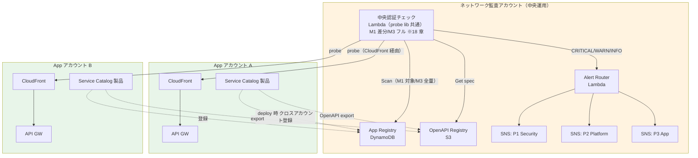
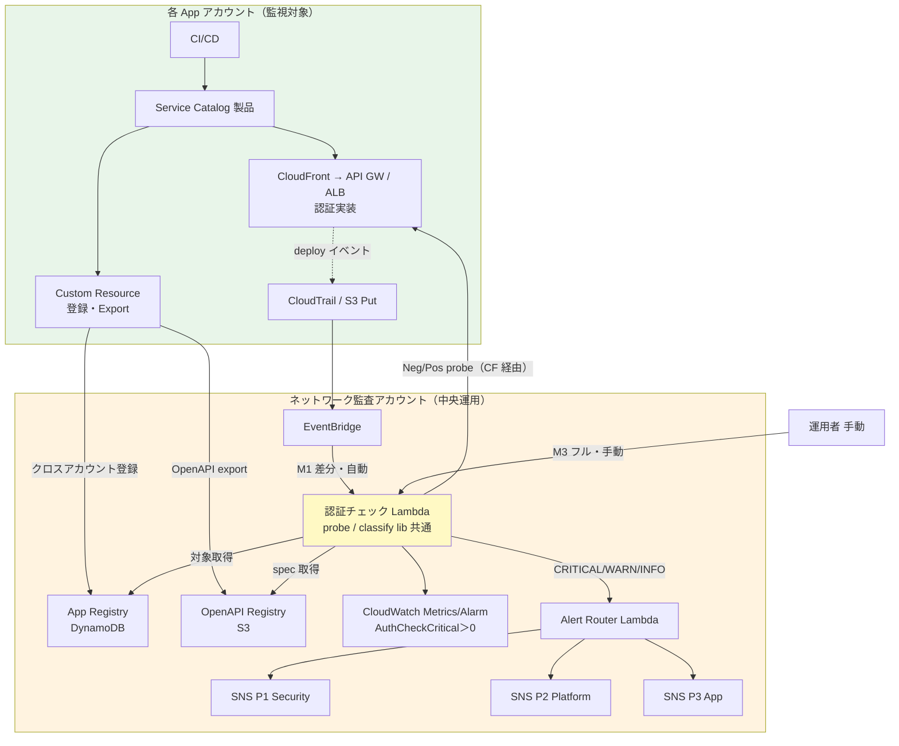
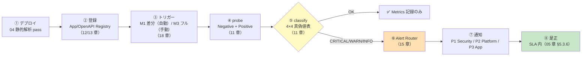
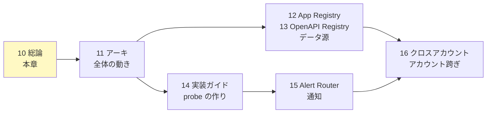

# 10. 認証外形監視 総論

前提: [00-basic-design-plan.md](00-basic-design-plan.md) BD-P-01〜08
実装: [code-samples/](code-samples/) / 根拠: [ADR-059](../../adr/059-central-auth-check-canary-architecture.md) / [§C-API-6 §C-6.6.8](../proposal/common/06-external-api-auth-architecture.md)
対象読者: ネットワーク監査チーム / Platform チーム / アプリチーム / セキュリティ責任者

---

## §10.0 前提と背景

### §10.0.1 この設計書群（章 10-18）で定めること

「アプリチームに認証を実装させたうえで、**その実装漏れを中央で継続検知する**」仕組み ＝ **中央認証チェック**（ADR-059 では "Central Auth Check Canary" の名称）の詳細設計。ガイドライン章（01-06）が「アプリチームが守るルール」を定めるのに対し、本章群は **ネットワーク監査チームが運用する中央機構**を定める。

### §10.0.2 なぜ外形監視が要るか

静的解析（04 章）や Config Rules は「設定・コードの検査」であり、**実際に稼働中の API が未認証リクエストを弾いているか**は保証できない。外形監視（実トラフィックで probe する Behavioral 検知 = [§C-6.6 の L5](../proposal/common/06-external-api-auth-architecture.md)）が最後の砦になる。検知 5 レイヤーの中で **L5 は「実装方式を問わず 95-99% 担保」できる唯一の層**。

### §10.0.3 スコープ

| 対象 | 本章群で扱う |
|---|---|
| 認証チェック（Lambda / 検査ロジック probe lib）| ✅ 11 / 14 章 |
| App Registry（DynamoDB）| ✅ 12 章 |
| OpenAPI Registry（S3）| ✅ 13 章 |
| Alert Router（4×4 → SNS）| ✅ 15 章 |
| クロスアカウント IAM / 配布 | ✅ 16 章 |
| 静的解析 / Config Rules | ❌ 04 章・§FR-API-7（別領域）|

### §10.0.4 用語（英語のまま使う語の意味）

| 用語 | 意味 |
|---|---|
| **probe（プローブ）** | 原義は「探針」。本設計では「**実際に HTTP リクエストを送り、応答で認証の効き具合を確かめる検査**」を指す。設定を読むのではなく、実物に触って確かめるのが特徴 |
| **Negative probe（未認証検査）** | 認証情報**なし**でリクエスト → 401/403（Cookie 系は 302）が返れば正常。**2xx が返れば認証漏れ** |
| **Positive probe（正規検査）** | **有効なトークン付き**でリクエスト → 200 が返れば API 稼働とテスト健全性を確認。Negative との組合せで誤検知を防ぐ（11 章 §11.2）|
| **probe lib（検査ロジック）** | 上記の検査を実装した共通ライブラリ（[central-probe-lib/](code-samples/central-probe-lib/)）。認証チェック Lambda が実行する |
| **Pattern β** | 検査を各アプリに配らず**中央 1 箇所**から横断実行する方式（§10.1）|
| **M1 / M3** | 実行モード。M1=デプロイ差分（自動）/ M3=フル監査（手動）（18 章）|

---

## §10.1 採用アーキテクチャ：Pattern β（中央集約）

### §10.1.1 Pattern β とは

probe を**各アプリに配らず、ネットワーク監査アカウントの中央認証チェック（Lambda）が全アプリを横断監視**する（[ADR-059](../../adr/059-central-auth-check-canary-architecture.md)）。

> **実行モデル（[18 章](18-scan-modes-and-scheduling.md) が SSOT）**: 実行基盤は **Lambda**、モードは **M1 デプロイ差分（自動・変更アプリ単位）+ M3 フル監査（手動・全量）**。CloudWatch Synthetics は不使用（将来 M2 用オプション）。図中の中央認証チェックはこの Lambda を指す。実行モデルを Lambda に定めた経緯は [ADR-059](../../adr/059-central-auth-check-canary-architecture.md)。

### §10.1.2 なぜ β（中央）か — α（分散）との比較

| 観点 | α: 各アプリ配置 | **β: 中央集約（採用）** |
|---|:---:|:---:|
| Deploy 漏れ | ⚠ 個別 deploy 必要、漏れリスク | ✅ **App Registry 登録で自動追随、原理的にゼロ** |
| 統一実装保証 | ⚠ アプリごとにばらつく | ✅ 中央認証チェック 1 実装 |
| 運用主体 | 各アプリチーム | ネットワーク監査チーム集約 |
| メトリクス集約 | ⚠ クロスアカウント集約が別途必要 | ✅ 標準で 1 箇所 |
| 「中央でチェック」思想 | ✗ | ✅ **一致** |
| Blast radius | ✅ アプリ単位 | ⚠ Central 障害で全断（Multilocation で緩和）|

→ **「各アプリ実装を中央でチェックする」という要件目的に対し β が構造的に正解**。α の Deploy 漏れ防止に必要な SCP / Config / Dashboard の 3 段防御（[ADR-059 §F](../../adr/059-central-auth-check-canary-architecture.md)）が β では不要になる。

### §10.1.3 統合構成図（登録・トリガー・検査・通知）

§10.1.1 は「どこに何があるか」の骨格。ここでは **登録（12/13 章）→ トリガー（18 章）→ probe/classify（11 章）→ 通知（15 章）** までを 1 枚に統合する。各コンポーネントの詳細は該当章が SSOT。

> §10.1.1 との違い: こちらは **トリガー（EventBridge の M1 / 手動 M3、18 章）と classify・Alarm（11 章）を明示**した完全版。実行基盤は **Lambda**（§10.1.1 の注記どおり）。

### §10.1.4 エンドツーエンド フロー（deploy → 検知 → 通知 → 是正）

1 つの API が「世に出てから認証漏れが通知・是正されるまで」の縦断フロー。章をまたぐ流れを 1 本で示す。

> **静的解析（①の 04 章）をすり抜けた認証漏れを、稼働後に④〜⑧で捕捉する**のが本機構の存在意義（具体例は [11 章 §11.8](11-central-probe-architecture.md) の 4 ケース）。①〜③はライフサイクル、④〜⑤の 1 実行内の詳細は [11 章 §11.1](11-central-probe-architecture.md) のシーケンス図。

---

### §10.1.5 構成リソース一覧（何が・どこで・何をするか）

図に登場する全リソースの役割を 1 表にまとめる。詳細は「詳細章」列が SSOT。

**ネットワーク監査アカウント（中央）側**

| リソース | AWS サービス | 役割（ひとことで） | 詳細章 |
|---|---|---|:---:|
| **App Registry** | DynamoDB | **監視対象の台帳**。アプリごとの baseUrl / 認証方式（authPattern）/ 通知先を 1 レコードで保持。認証チェックは「ここに載っているもの」だけを検査する | 12 |
| **OpenAPI Registry** | S3（Versioning）| **API 仕様の正本置き場**。deploy 後の実 API GW から export された OpenAPI を保管し、endpoint 一覧と公開印（MON-1）の情報源になる | 13 |
| **認証チェック Lambda（中央認証チェック）** | Lambda | **検査の実行体**。台帳と仕様を読み、各 endpoint に未認証/正規の 2 種リクエストを送って認証の効き具合を確かめる | 11 / 14 |
| **EventBridge** | EventBridge | **M1 の起動役**。デプロイイベント（OpenAPI Export の S3 Put 等）を検知して認証チェック Lambda を自動起動 | 18 |
| **CloudWatch Metrics / アラーム** | CloudWatch | **検査結果の記録と発報**。`AuthCheckCritical > 0` で認証漏れアラーム | 11 / 18 |
| **Alert Router Lambda** | Lambda | **通知の振り分け役**。検知結果を 4×4 分類に従い P1/P2/P3 の宛先へ振り分ける（「全部 Security 行き」を防ぐ）| 15 |
| **SNS（P1 / P2 / P3）** | SNS | **通知の出口**。P1=Security 即時 / P2=Platform 24h / P3=アプリチーム | 15 |
| **Secrets Manager** | Secrets Manager | **正規検査用の資格情報**（canary-central-readonly）。実行ごとに短命トークンを発行（漏洩耐性は §11.3.1）| 11 |

**各アプリアカウント側**

| リソース | AWS サービス | 役割（ひとことで） | 詳細章 |
|---|---|---|:---:|
| **Service Catalog 製品** | Service Catalog | **正規デプロイの型**。認証必須・Origin Protection・タグ・下記 2 つの登録処理を全部込みで提供（アプリはパラメータを選ぶだけ）| 17 |
| **App Registry 登録（Custom Resource）** | 製品テンプレ内蔵 | deploy と同時に**台帳へ自動登録**（アプリ開発者はコードを書かない）| 12 / 17 |
| **OpenAPI Export（Custom Resource）** | 製品テンプレ内蔵 | deploy 後の実 API GW から**仕様を自動 export** して正本置き場へ | 13 / 17 |
| **CloudFront → API GW / ALB** | — | **検査の対象**。認証チェックは実ユーザーと同じ CloudFront 経由で叩く（Origin Protection を破らない）| 12 §12.2 |

> **1 行まとめ**: アプリが Service Catalog 製品で deploy すると**台帳と仕様が自動で中央に登録**され、その瞬間（M1）と手動監査時（M3）に**中央の認証チェック Lambda が実際にリクエストを投げて認証漏れを検査**し、問題があれば **4×4 分類で適切なチームに通知**される。

---

## §10.2 実装物ナビ（章 ↔ code-samples 対応）

| 章 | 設計 | 実装（code-samples/）|
|---|---|---|
| 11 | 認証チェック アーキテクチャ | [central-probe-lib/](code-samples/central-probe-lib/) |
| 12 | App Registry | [app-registry-lambda/](code-samples/app-registry-lambda/) |
| 13 | OpenAPI Registry | [openapi-export-lambda/](code-samples/openapi-export-lambda/) |
| 14 | 実装ガイド（probe lib / モノリス・Private 対応）| [central-probe-lib/](code-samples/central-probe-lib/) |
| 15 | Alert Router | [alert-router-lambda/](code-samples/alert-router-lambda/) |
| 全 | データ契約 SSOT | [code-samples/README.md](code-samples/README.md) |

> **データ契約の SSOT は [code-samples/README.md](code-samples/README.md)**（App Registry スキーマ / OpenAPI アノテーション / CloudWatch Metrics / 4×4 真偽値表 / authPattern enum / Alert 形式）。本設計書群はその設計意図・判断根拠を説明し、厳密な定義は README を参照する。

---

## §10.3 Phase 4 ローカル検証の到達点

本設計は「机上」でなく**実際に走らせて検証済み**（[research/phase4-local-verification-results.md](research/phase4-local-verification-results.md)）。

| 検証 | 状態 |
|---|:---:|
| 静的解析ルール（cfn-guard 3 + Semgrep 3）| ✅ フィクスチャ検証（**実バグ 2 件修正**）|
| Lambda SDK 実挙動（app-registry PutItem / alert-router SNS Publish）| ✅ LocalStack 3.8.1 |
| probe lib logic（classify / probe / extractEndpoints）| ✅ 27 テスト PASS |
| full orchestration（認証チェック Lambda E2E / Positive probe / metrics 着地）| ⏳ SAM local or 実 AWS 要 |

→ **ロジックは検証済み、残るは AWS 環境依存の full-run**（14 章 §14.5 に要 PoC 項目を明記）。

---

## §10.4 読み方

| 知りたいこと | 章 |
|---|---|
| 全体がどう動くか | 11 |
| アプリがどう監視対象に載るか | 12（登録）+ 13（OpenAPI）|
| probe の中身・モノリス/Private 対応 | 14 |
| 検知後の通知の流れ | 15 |
| アカウントを跨ぐ権限 | 16 |

---

## §10.5 設計判断

| ID | 判断 | 根拠 |
|---|---|---|
| D-M-10-1 | Pattern β（中央集約）を採用 | Deploy 漏れが構造的にゼロ、「中央でチェック」要件と一致（§10.1.2）|
| D-M-10-2 | データ契約の SSOT は code-samples/README.md、設計書は意図を説明 | 実装と設計の二重管理を避ける |
| D-M-10-3 | 設計は Phase 4 で実行検証してから確定 | 「検証済み事実」を積み上げる方針（BD 品質方針）|

---

## §10.6 未決事項

| ID | 内容 | 章 |
|---|---|---|
| BD-Q-01 | ROSA 側 P-18（監査アカウント他組織管理）確定時の責任分界 | 16 |
| M-Q-10-1 | Central 障害時の Multilocation（DR region replica）採否 | 11 / 14 |
| M-Q-10-2 | full-run（SAM local / 実 AWS）の実施タイミング | 14 |
